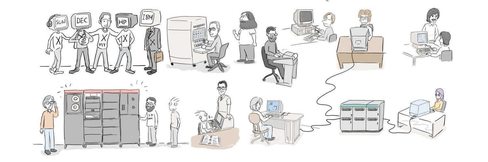

# F/OSS Comics

F/OSS Comics is a comic series dedicated to Free and Open Source Software. The comics aim to educate and entertain readers about the world of free and open source software.

Explore the comics at [fosscomics.com](https://fosscomics.com) or directly read them in this repository:

* [1. Charles Babbage and Ada Lovelace](content/posts/1.%20Charles%20Babbage%20and%20Ada%20Lovelace/index.md)
* [2. Alan Turing and Von Neumann](content/posts/2.%20Alan%20Turing%20and%20Von%20Neumann/index.md)
* [3. The Era of Commercial Computers](content/posts/3.%20The%20Era%20of%20Commercial%20Computers/index.md)
* [4. how did people write code in the early days of computing](content/posts/4.%20how%20did%20people%20write%20code%20in%20the%20early%20days%20of%20computing/index.md)
* [5. The beginning of software engineering/index.md](content/posts/5.%20The%20beginning%20of%20software%20engineering/index.md)
* [6. The origin of the hacker culture](content/posts/6.%20The%20origin%20of%20the%20hacker%20culture/index.md)
* [7. ITS and hacker culture/index.md](content/posts/7.%20ITS%20and%20hacker%20culture/index.md)
* [8. UNIX and C Language/index.md](content/posts/8.%20UNIX%20and%20C%20Language/index.md)

## About the Repository

This repository hosts the source code used to generate the static website for F/OSS Comics.

The static webpage generator was adapted from [kartiknair's blog](https://github.com/kartiknair/blog) and is styled using the [Archie theme](https://github.com/athul/archie). I've customized the generator to better suit the needs of the F/OSS Comics series.

## Contributions

I welcome contributions and feedback on the comics and the website. If you have suggestions or want to contribute, please submit a pull request or join the discusstions.

# License

* The [Archie theme](https://github.com/athul/archie) is licensed under its original license([MIT](https://github.com/athul/archie?tab=MIT-1-ov-file#readme)).
* Node.js code in this project is licensed under the [BSD 3-Clause "New" or "Revised" License](https://opensource.org/licenses/BSD-3-Clause).  
* All rights to the comics files (Markdown, images, and generated contents) are reserved. Contact me for specific usage permissions.

