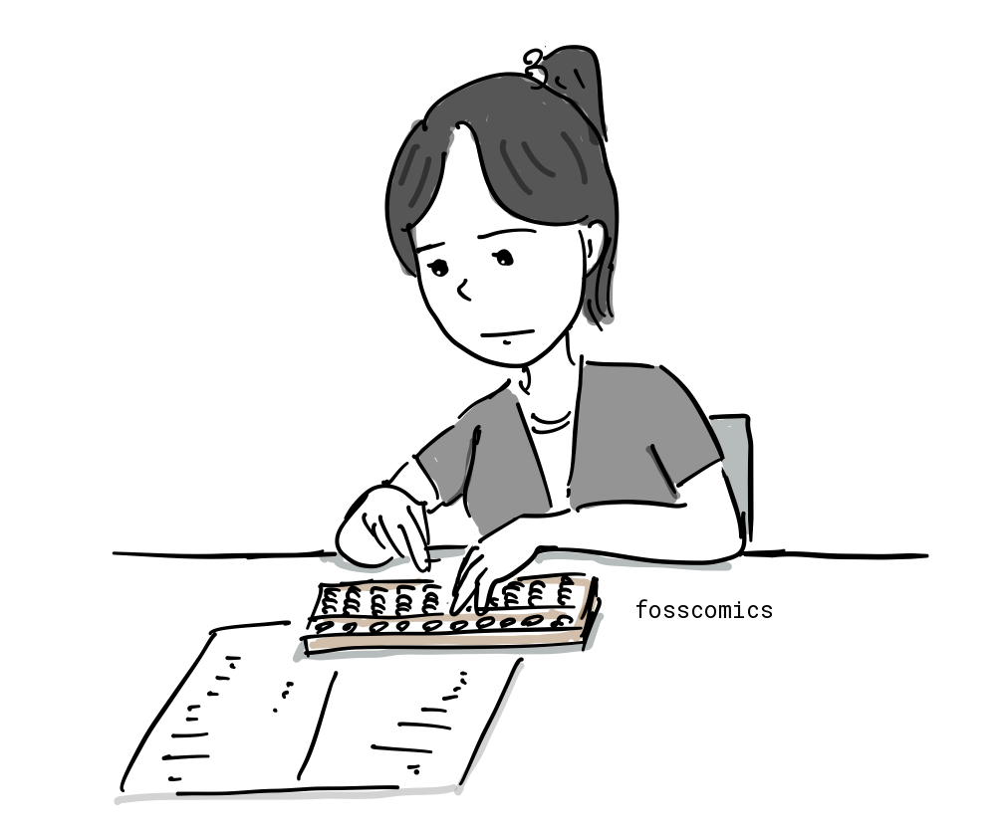
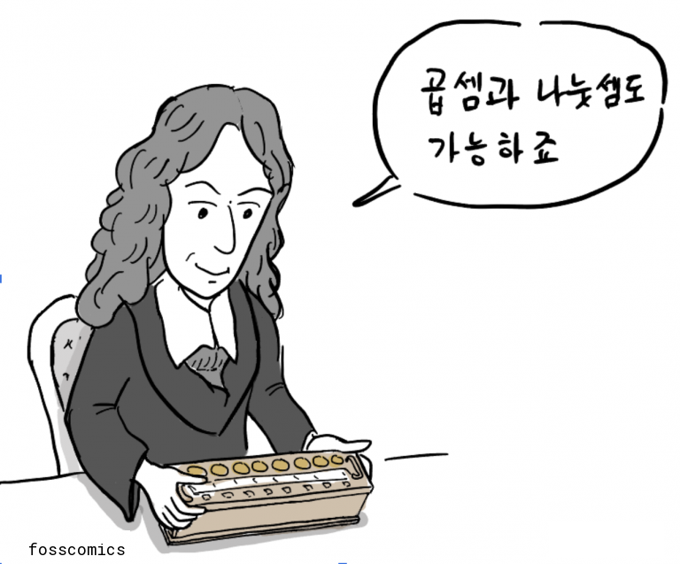
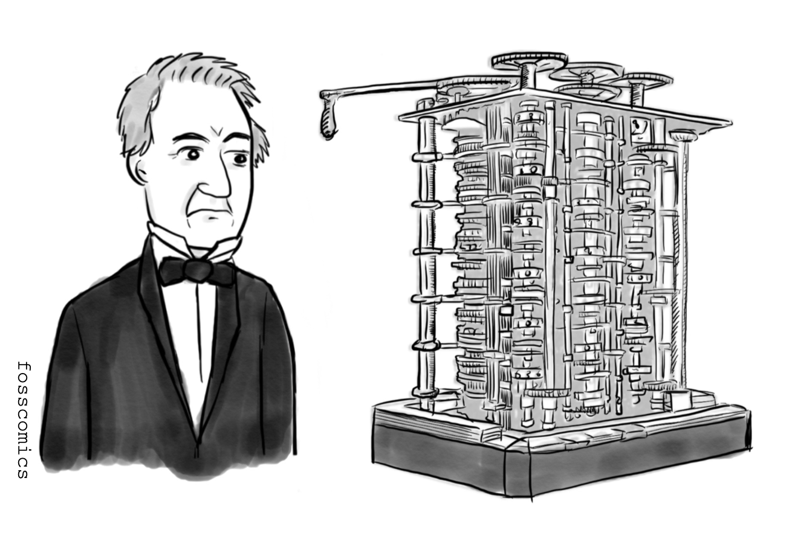
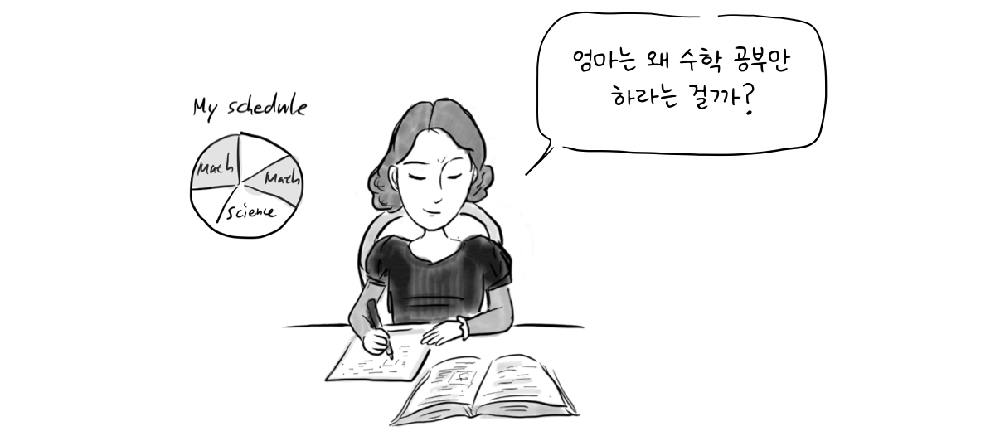
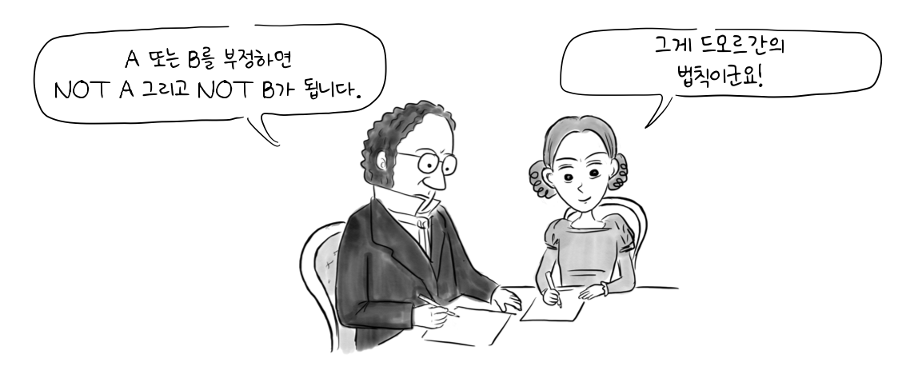
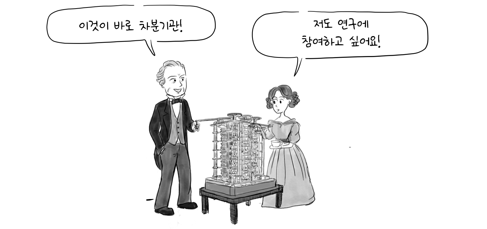
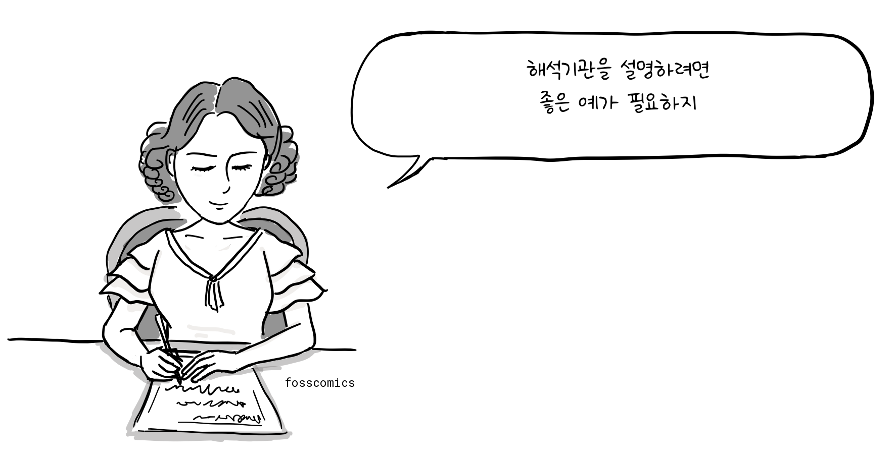
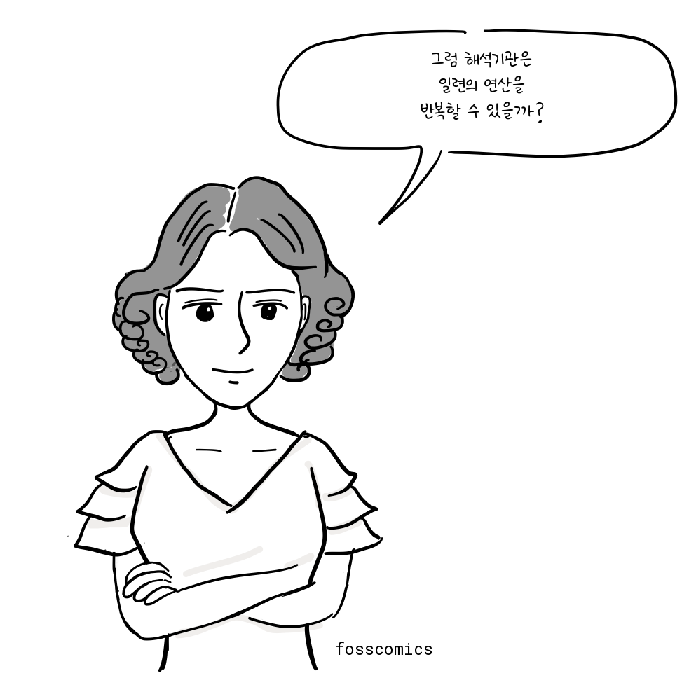
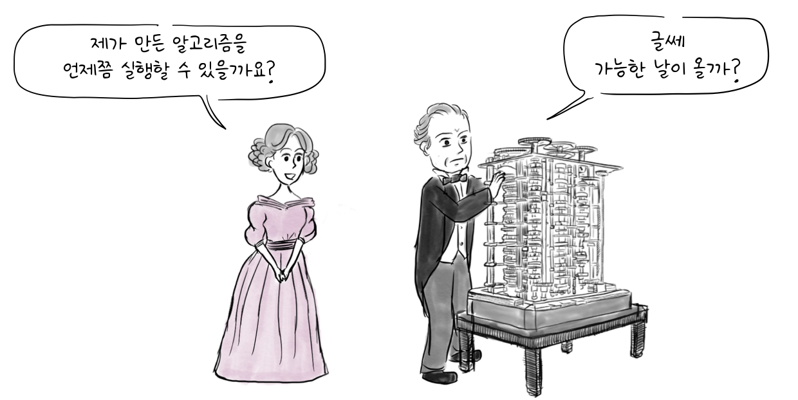
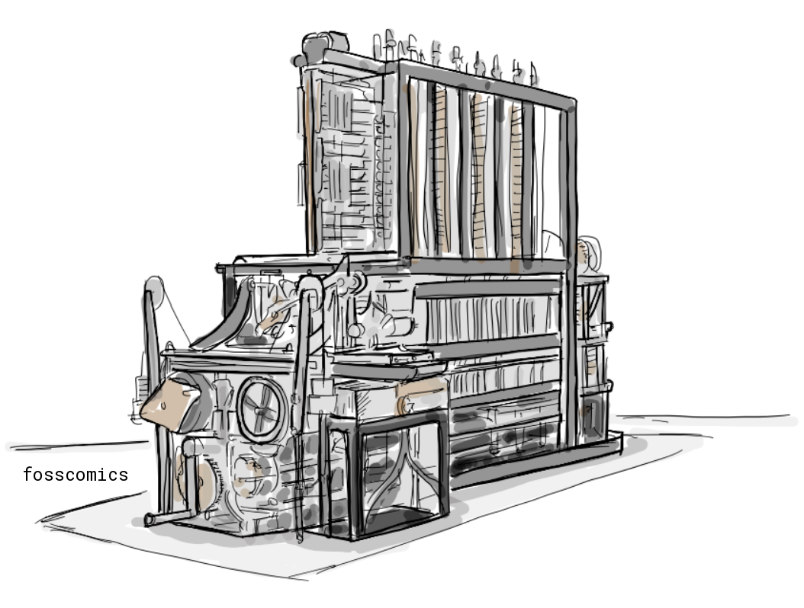

인류는 오래전부터 수학 계산을 더 쉽고 정확하게 하기 위해 여러가지 도구를 만들어왔다. 그중 하나인 주판은 여러 고대 문명에서 사용되었고, 우리나라에는 15세기 무렵 중국에서 주판이 전래되었다.


1980년대까지만 해도 은행에서 흔하게 주판을 사용했고, 어린이들은 주산학원을 다니기도 했다. 이후 컴퓨터가 보급되면서 주판은 대부분 자취를 감추었다.



17세기 유럽에서는 [파스칼](https://ko.wikipedia.org/wiki/블레즈_파스칼)과 [라이프니츠](https://ko.wikipedia.org/wiki/고트프리트_빌헬름_라이프니츠)가 톱니바퀴로 작동하는 기계식 계산기를 만들었다.


> "곱셈과 나눗셈도 가능하죠"

## 찰스 배비지와 차분기관

1822년 영국의 수학자 [찰스 배비지](https://ko.wikipedia.org/wiki/찰스_배비지)(1791 ~ 1871)는 로그표나 삼각함수표 같은 정확한 수표를 자동으로 만들기 위해 기계식 계산기인 차분기관(Difference Engine)을 설계했다. 그는 이후 기억 장치인 "저장고(store)", 연산 장치인 "연산부(mill)", 천공 카드 입력 장치와 인쇄 장치를 갖춘 범용 기계인 해석기관(Analytical Engine)을 설계했다. 이는 현대 컴퓨터의 여러 구성 요소를 앞서 보여 준 설계였다.



[에이다 러브레이스](https://ko.wikipedia.org/wiki/에이다_러브레이스)는 바이런 경으로 더 잘 알려진 시인 조지 고든 바이런과 앤 이사벨라 밀뱅크 사이에서 1815년에 태어났다. 부모는 에이다가 태어난 직후 별거했고 어미니 밑에서 자랐다. 어머니는 에이다가 바이런의 기질을 물려받을지도 모른다는 불안감에 문학보다 수학과 과학을 중심으로 교육을 시켰다.


> "엄마는 왜 수학 공부만 하라는 걸까?"

에이다는 여러 저명한 수학자에게 배웠는데, 그중에는 에이다의 재능을 알아본 [오거스터스 드모르간](https://ko.wikipedia.org/wiki/오거스터스_드모간)도 있었다.


> "A 또는 B를 부정하면 NOT A 그리고 NOT B가 됩니다." \
> "그게 드모르간의 법칙이군요!"

열일곱 살에 에이다는 배비지를 만났고, 나중에 그가 완성한 차분기관의 일부가 작동하는 모습을 보았다.


> "이것이 바로 차분기관!" \
> "저도 연구에 참여하고 싶어요!"

에이다는 해석기관을 설명하기 위해 자신이 출판한 주석에 [베르누이 수](https://ko.wikipedia.org/wiki/베르누이_수)를 계산하는 알고리즘을 실었다. 이 알고리즘은 흔히 최초로 출판된 컴퓨터 프로그램으로 소개된다.


> "해석기관을 설명하려면 좋은 예가 필요하지"

에이다의 주석은 해석기관이 일련의 연산을 반복하는 방법도 설명했다. 이는 반복문에 대한 초기 설명으로 볼 수 있다. 이런 업적으로 에이다는 흔히 최초의 컴퓨터 프로그래머라고 불린다. 다만 베르누이 수 알고리즘 가운데 어느 부분이 에이다에게서 나왔고 어느 부분이 배비지와의 협업으로 만들어졌는지를 두고는 역사학자들 사이에 논쟁이 있다. 두 사람의 공헌을 정확히 어떻게 나누어 보든, 에이다의 주석은 출판된 프로그래밍의 가장 초기 사례 가운데 하나로 남아 있다.


> "그럼 해석기관은 일련의 연산을 반복할 수 있을까?"

이러한 선구적인 공헌을 기려 프로그래밍 언어 [에이다(Ada)](https://ko.wikipedia.org/wiki/에이다)는 에이다의 이름을 따서 명명되었다.

```ada
with Ada.Text_IO;
procedure Hello is
begin
   Ada.Text_IO.Put_Line ("Hello, world!");
end Hello;
```
*에이다로 작성한 "Hello, world!" 프로그램*

배비지는 재정적·조직적·기술적 어려움 때문에 에이다가 살아 있는 동안 차분기관과 해석기관 어느 것도 완성하지 못했다. 따라서 에이다의 프로그램도 제안된 기계에서 실행되지 못했다.


> "제가 만든 알고리즘을 언제쯤 실행할 수 있을까요?" \
> "글쎄 가능한 날이 올까?"

1991년 런던 과학박물관은 배비지의 설계를 바탕으로 실제로 작동하는 차분기관 2호의 계산 장치를 완성했다. 인쇄 장치는 2002년에 뒤이어 완성되었다. 이 기관은 31자리 정밀도로 계산할 수 있었다. 현재 에이다의 주석은 범용 계산 기계를 어떻게 프로그래밍할 수 있는지를 설명한 중요한 초기 기록으로 남아 있다.



## 참고 문헌

1. [찰스 배비지, 위키백과](https://ko.wikipedia.org/wiki/찰스_배비지)
2. [에이다 러브레이스, 위키백과](https://ko.wikipedia.org/wiki/에이다_러브레이스)