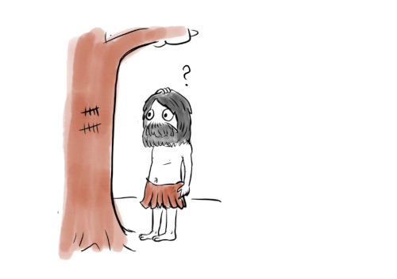
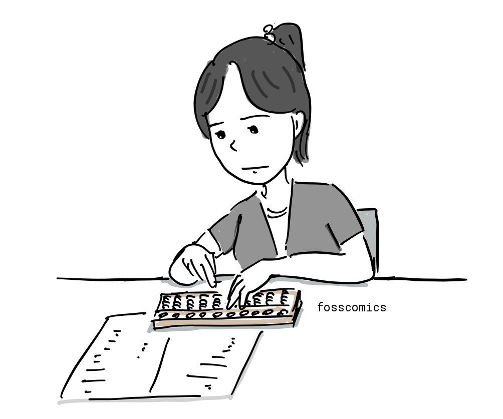
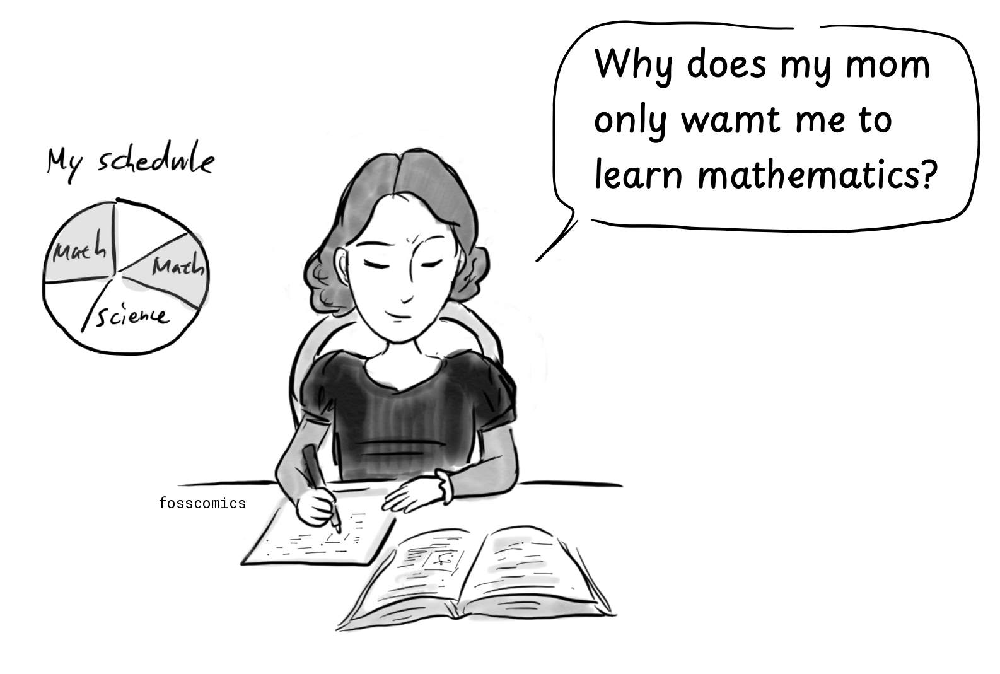
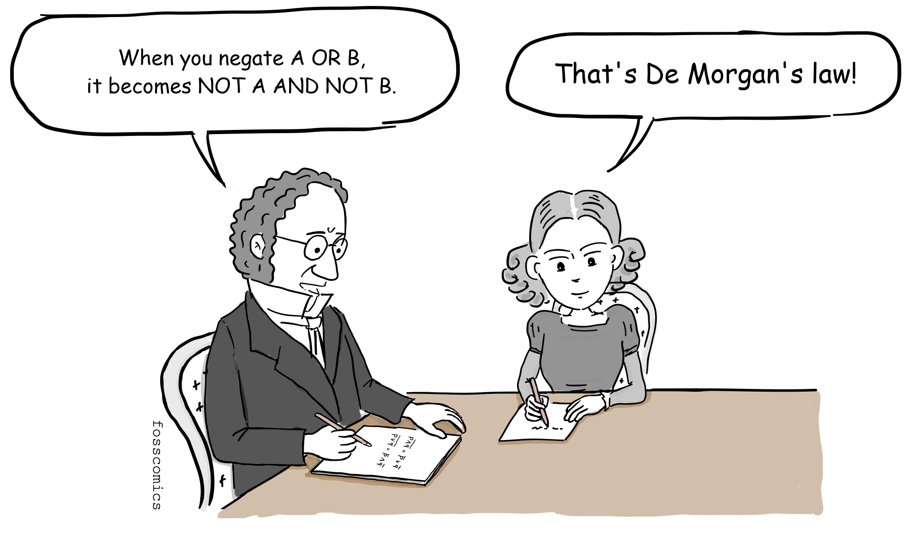
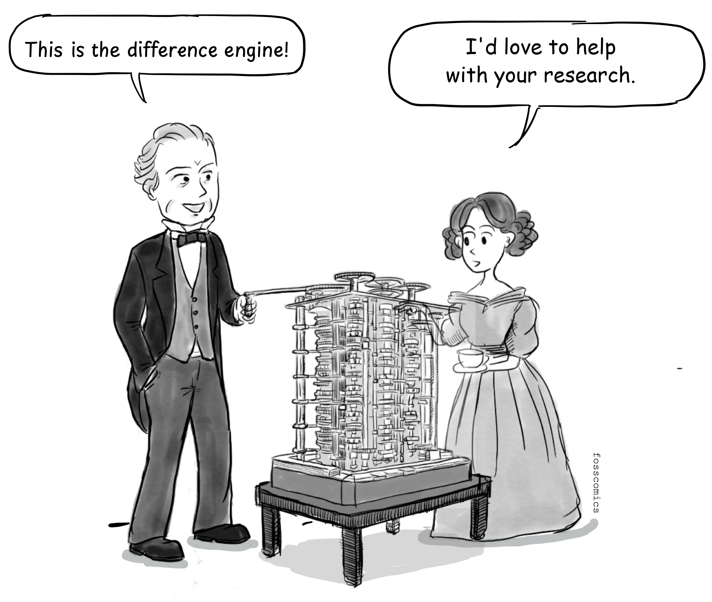
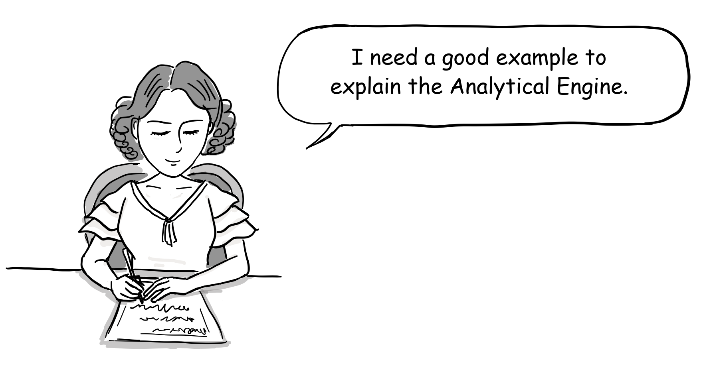
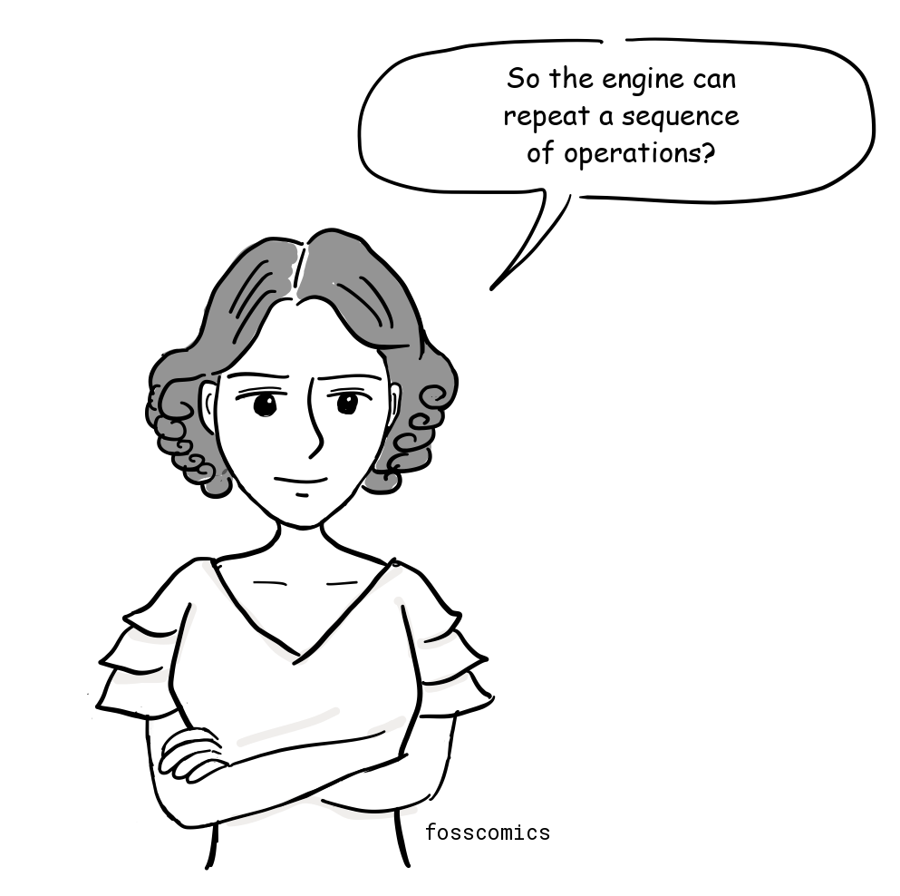
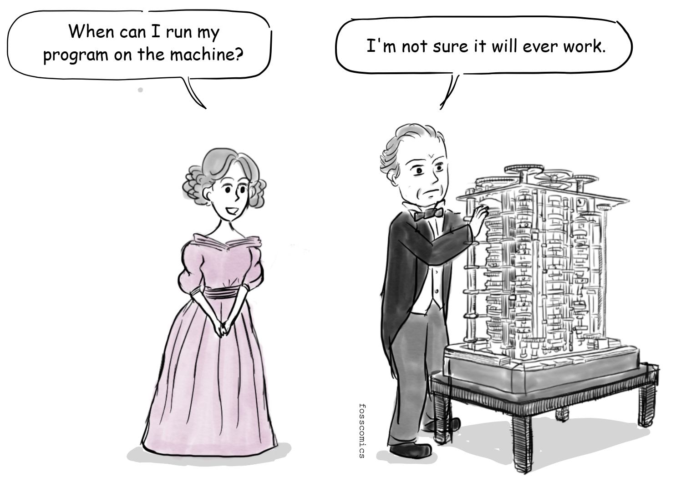

People have long built tools to make arithmetic easier and more accurate. One of these tools, the abacus, was used by several ancient civilizations.

The abacus reached Korea from China around the 15th century. Individuals and banks continued to use it until the 1980s, when computers largely replaced it.

In 17th-century Europe, [Pascal](https://en.wikipedia.org/wiki/Pascal%27s_calculator) and Leibniz built gear-driven mechanical calculators.

 size:70%")

## Charles Babbage and his difference engine
In 1822, British mathematician Charles Babbage proposed the Difference Engine, a mechanical calculator designed to automatically produce accurate numerical tables, such as logarithmic and trigonometric tables. He later designed the Analytical Engine, a general-purpose mechanical machine with a memory or "store," an arithmetic unit or "mill," punched-card input, and a printer, anticipating several components of modern computers.

Ada Lovelace was born in 1815 to the poet George Gordon Byron, better known as Lord Byron, and Anne Isabella Milbanke. Her parents separated shortly after her birth. Concerned that Ada might inherit Byron's temperament, her mother directed her education toward mathematics and science rather than literature.

 
> "Why does my mom only want me to learn mathematics?"

Ada studied with prominent mathematicians, including Augustus De Morgan, who recognized her talent.

> "When you negate A OR B, it becomes NOT A AND NOT B." \
> "That's De Morgan's law!"

At seventeen, Ada met Babbage and later saw him demonstrate the completed portion of his Difference Engine.

> "This is the difference engine!" \
> "I'd love to help with your research."

To help explain the Analytical Engine, she presented an algorithm for calculating Bernoulli numbers in her published notes. It is often described as the first published computer program.

> "I need a good example to explain the Analytical Engine."

Her notes described how the Analytical Engine could repeat a series of operations, an early account of looping. This work is why she is often called the first computer programmer. However, historians debate how much of the Bernoulli-number algorithm originated with Lovelace and how much was developed in collaboration with Babbage. Whatever the precise division of credit, Lovelace's notes remain one of the earliest published examples of programming. In recognition of her pioneering contribution, the programming language Ada was later named after her.

> "So the engine can repeat a sequence of operations?"

Babbage completed neither the Difference Engine nor the Analytical Engine during Lovelace's lifetime because of financial, organizational, and technical difficulties. As a result, her program was never run on the proposed machine.

> "When can I run my program on the machine?" \
> "I'm not sure it will ever work."

In 1991, the Science Museum in London completed the calculating section of a working Difference Engine No. 2 based on Babbage's designs. Its printing mechanism followed in 2002. The engine could calculate results to 31 digits. Lovelace's notes remain an important early account of how a general-purpose computing machine could be programmed.

## References
1. https://en.wikipedia.org/wiki/Charles_Babbage
2. https://en.wikipedia.org/wiki/Ada_Lovelace
