:::panel
People have long built tools to make calculations easier and more accurate. One of these tools, the abacus, was used by several ancient civilizations. It was introduced to Korea from China around the 1400s.


:::

:::panel
As late as the 1980s, abacuses were still common in Korean banks, and children attended classes to learn abacus calculation. As computers became widespread, abacuses largely disappeared from everyday use.

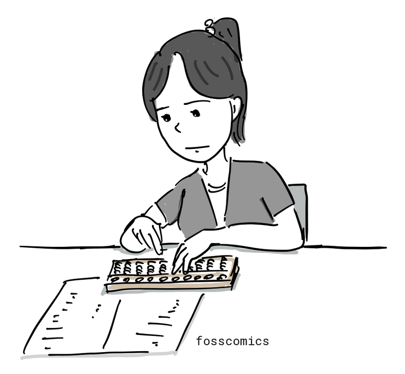
:::

:::panel
In 17th-century Europe, [Pascal](https://en.wikipedia.org/wiki/Pascal%27s_calculator) and [Leibniz](https://en.wikipedia.org/wiki/Gottfried_Wilhelm_Leibniz) built gear-driven mechanical calculators.

 size:90%")
> "It can multiply and divide, too!"
:::

## Charles Babbage and his difference engine
:::panel
In 1822, British mathematician [Charles Babbage](https://en.wikipedia.org/wiki/Charles_Babbage) (1791-1871) proposed the Difference Engine. This mechanical calculator would automatically produce accurate tables of numbers for mathematical calculations.

He later designed a more ambitious machine: the Analytical Engine. It was designed to follow instructions for different kinds of calculations, much like a modern computer.

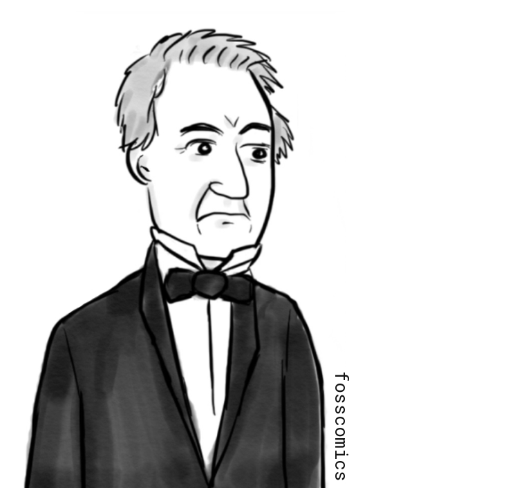
:::

:::panel rounded="true"
The Difference Engine was designed to build numerical tables by adding numbers over and over. Unlike the later Analytical Engine, it was designed for a specific kind of calculation.

The mathematics behind it is called the method of finite differences. It uses repeated addition to calculate values of polynomials, which can approximate the functions needed for logarithmic and trigonometric tables. See the [Computer History Museum's explanation of the engines](https://www.computerhistory.org/babbage/engines/).

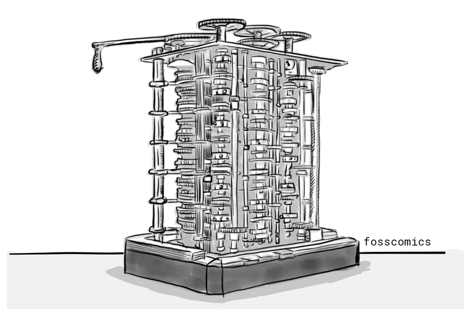
:::

## Ada's education and her meeting with Babbage

:::panel
[Ada Lovelace](https://en.wikipedia.org/wiki/Ada_Lovelace) was born in 1815 to George Gordon Byron (better known as Lord Byron), a leading English Romantic poet, and Anne Isabella Milbanke. Her parents separated shortly after she was born, and she grew up with her mother.

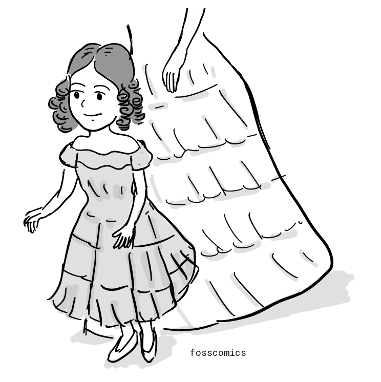
:::

:::panel
Since her mother was concerned that Ada might inherit Byron's temperament, her education emphasized mathematics and science rather than literature.

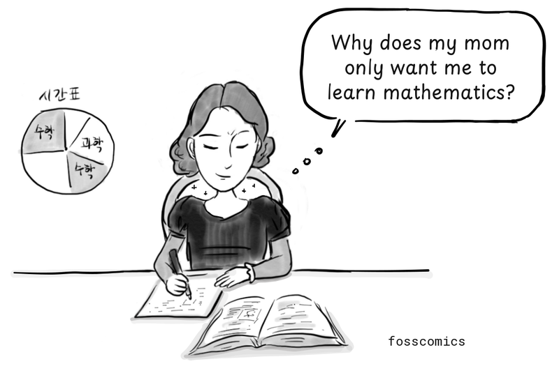
> "Why does Mom only want me to study math?"
:::

:::panel
Ada studied with prominent mathematicians, including [Augustus De Morgan](https://en.wikipedia.org/wiki/Augustus_De_Morgan), who recognized her talent.

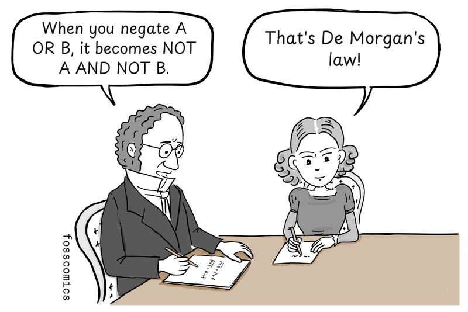
> "When you negate A OR B, it becomes NOT A AND NOT B." \
> "That's De Morgan's law!"
:::

:::panel
At seventeen, Ada met Babbage and later saw him demonstrate the completed portion of his Difference Engine.

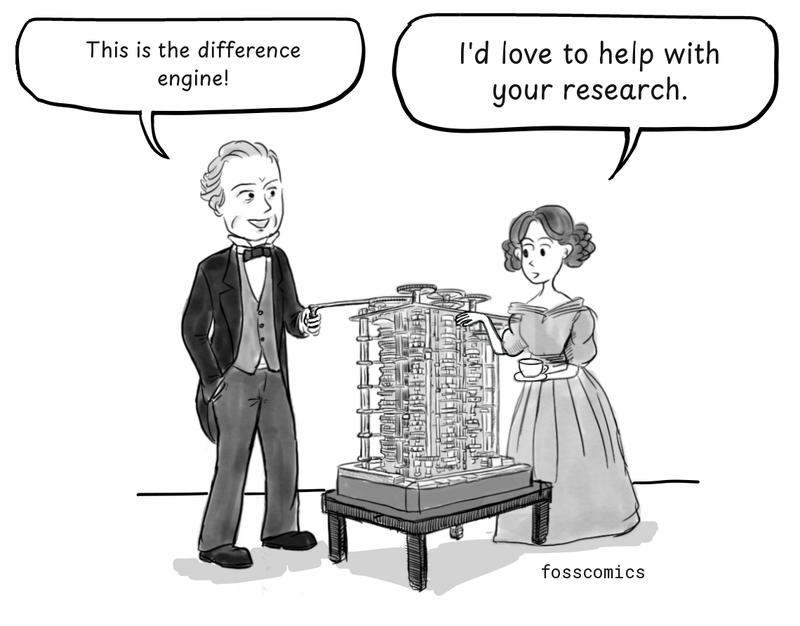
> "This is the difference engine!" \
> "I'd love to help with your research."
:::

## The Analytical Engine: a machine that could read programs

:::panel
The [Analytical Engine](https://en.wikipedia.org/wiki/Analytical_engine), described in 1837, went beyond making tables: it was designed for general-purpose computation, like a modern computer. It would have memory (the "store"), a calculating unit (the "mill"), and a printer. Punched cards would supply instructions and numbers. Its step-by-step instructions can be compared to modern assembly language, and the machine was intended to be powered by a steam engine. The illustration imagines the scale of this proposed machine, rather than a completed engine.

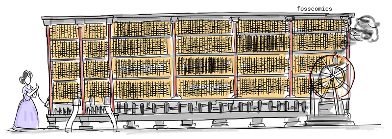
:::

:::panel rounded="true"
Charles Babbage dreamed big, but the manufacturing technology and funding available at the time were not enough to automate complex calculations with intricate machinery.

The larger ambitions also raised questions about finishing and funding the earlier machine.

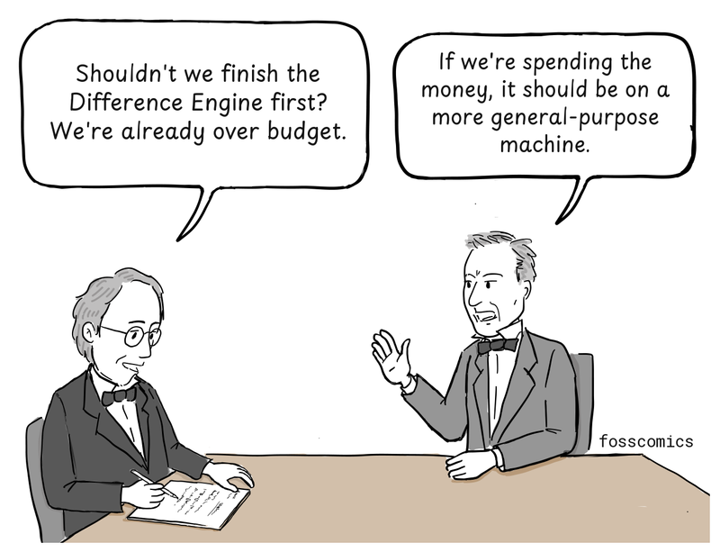
> "Shouldn't we finish the Difference Engine first? We're already over budget." \
> "If we're spending the money, it should be on a more general-purpose machine."
:::

## Ada's notes and early programming

:::panel
Ada became actively involved in work on the Analytical Engine. In 1843, Lovelace published an English translation of Luigi Menabrea's French article on the Analytical Engine, adding extensive notes of her own. The [Computer History Museum describes this publication and her collaboration with Babbage](https://www.computerhistory.org/babbage/adalovelace/).

To help explain the Analytical Engine, she presented an algorithm for calculating [Bernoulli numbers](https://en.wikipedia.org/wiki/Bernoulli_number) in her published notes. It is often described as the first published computer program.

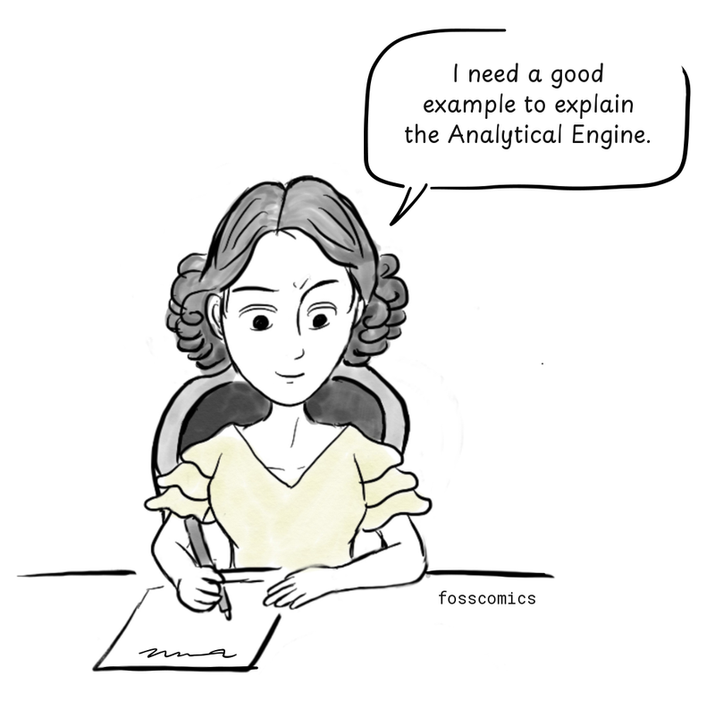
> "I need a good example to explain the Analytical Engine."
:::

:::panel rounded="true"
Her notes described how the Analytical Engine could repeat a series of operations, an early account of looping. This work is why she is often called the first computer programmer. However, historians debate how much of the Bernoulli-number algorithm originated with Lovelace and how much resulted from her work with Babbage. Whatever the division of credit, Lovelace's notes remain one of the earliest published examples of programming.

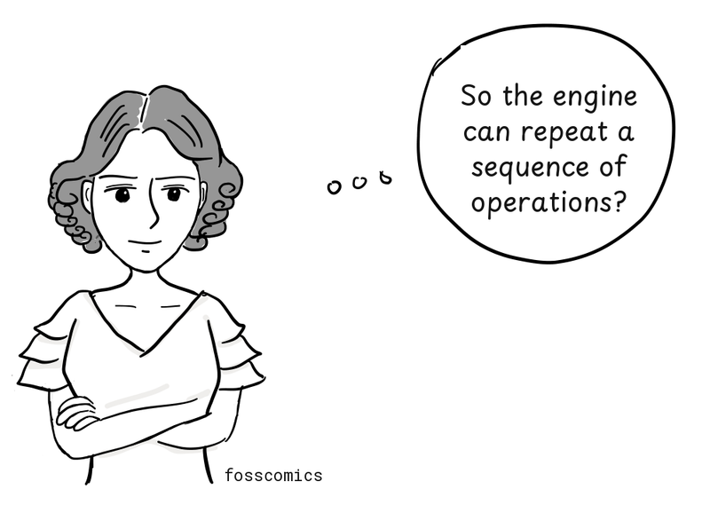
> "So the engine can repeat a sequence of operations?"
:::

:::panel
In recognition of her pioneering contribution, the programming language [Ada](https://en.wikipedia.org/wiki/Ada_(programming_language)) was later named after her.

```ada
with Ada.Text_IO;
procedure Hello is
begin
   Ada.Text_IO.Put_Line ("Hello, world!");
end Hello;
```
*A "Hello, world!" program written in Ada.*
:::

## Unfinished machines, lasting ideas

:::panel
Babbage completed neither the Difference Engine nor the Analytical Engine during Lovelace's lifetime because of financial and technical difficulties. As a result, her program was never run on the proposed machine.

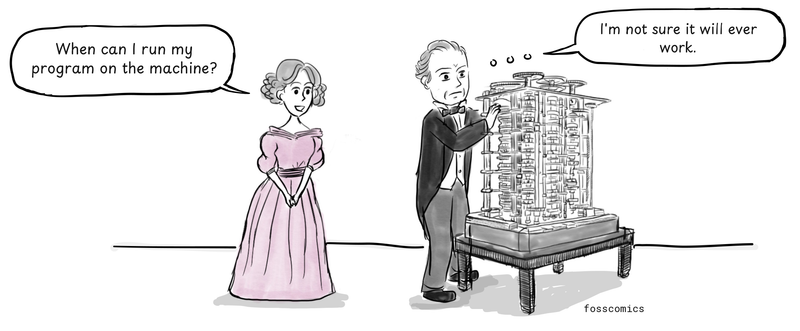
> "When can I run my program on the machine?" \
> "I'm not sure it will ever work."
:::

:::panel
In 1991, the Science Museum in London completed the calculating section of a working Difference Engine No. 2 based on Babbage's designs. Its printing mechanism followed in 2002. The engine could calculate results to 31 digits. Lovelace's notes remain an important early account of how a general-purpose computing machine could be programmed.

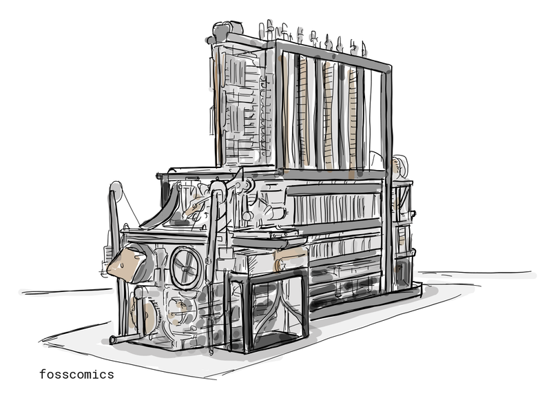
:::

## References
1. https://en.wikipedia.org/wiki/Charles_Babbage
2. https://en.wikipedia.org/wiki/Ada_Lovelace
3. [The Engines, Computer History Museum](https://www.computerhistory.org/babbage/engines/)
4. [Ada Lovelace, Computer History Museum](https://www.computerhistory.org/babbage/adalovelace/)
