**자기가 만든 프로그래밍 언어로 운영체제를 개발한 사람.**

**1999년 데니스 리치의 집**

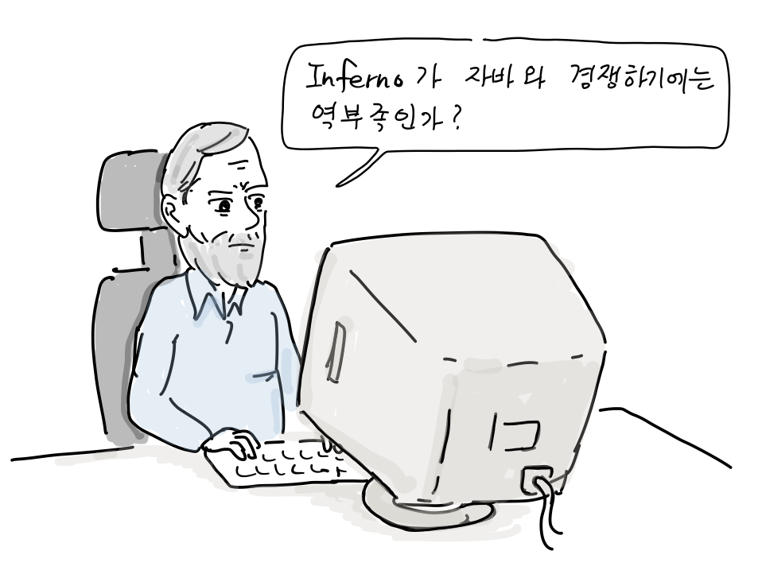

*“Inferno가 자바와 경쟁하기에는 역부족인가?”*

당시 [데니스 리치](https://ko.wikipedia.org/wiki/%EB%8D%B0%EB%8B%88%EC%8A%A4_%EB%A6%AC%EC%B9%98)는 [Inferno 운영체제](https://ko.wikipedia.org/wiki/%EC%9D%B8%ED%8E%98%EB%A5%B4%EB%85%B8_\(%EC%9A%B4%EC%98%81_%EC%B2%B4%EC%A0%9C\))와 [Limbo](https://en.wikipedia.org/wiki/Limbo_\(programming_language\))라는 프로그래밍 언어 개발에 참여하고 있었다.

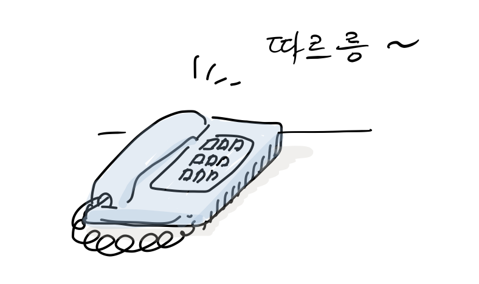

“따르릉”

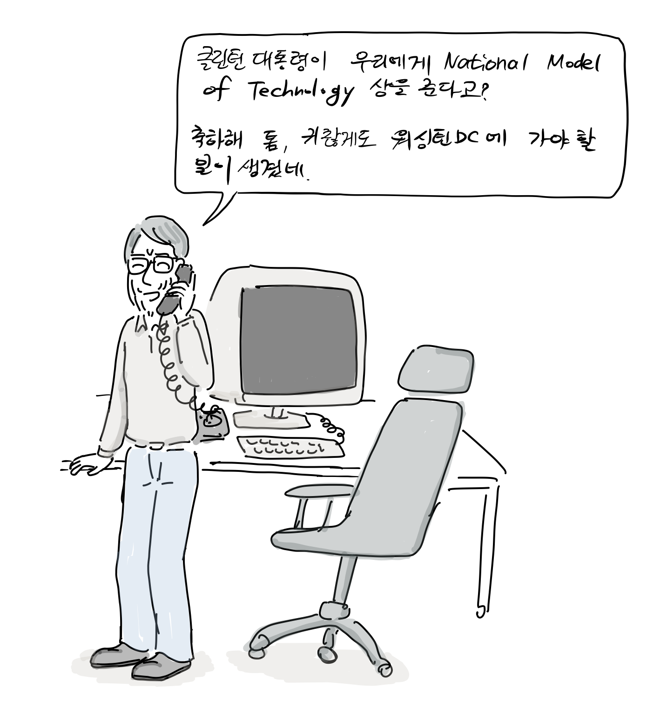

“클린턴 대통령이 우리에게 National Medal of Technology 을 준다고? 축하해 톰, 귀찮게도 워싱턴에 가야할이 생겼네.”

켄 톰슨: “우리 너무 상을 많이 받는 거 아닌가?”

데니스 리치: “그러게, 난 사실 [튜링상](https://ko.wikipedia.org/wiki/%ED%8A%9C%EB%A7%81%EC%83%81)을 받은 것 만으로 만족스러운데..”

데니스 리치가 이렇게 과학자로서 성공하게 된 배경에는 벨연구소에서 연구원으로 일했던 아버지 영향을 많은 받은 듯 보인다.

**1940년대 벨연구소**

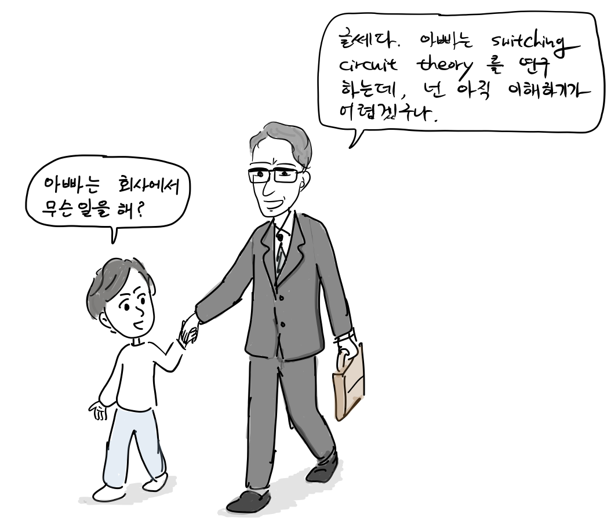

데니스 리치: “아빠는 무슨일을 해?”  
아버지(Alistair E. Ritchie): “글쎄다. 아빠는 [switching circuit theory](https://en.wikipedia.org/wiki/Switching_circuit_theory)을 연구하는데, 넌 아직 이해하기 어렵겠구나.”

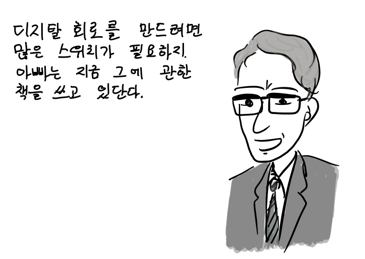

“디지털 회로를 만들려면 많은 switch가 필요하지. 아빠는 지금 그에 관한 책을 쓰고 있단다.”

**10여년 후,**

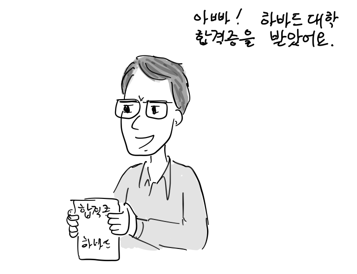

데니스 리치: “아빠, 하버드 대학 합격증을 받았어요.”

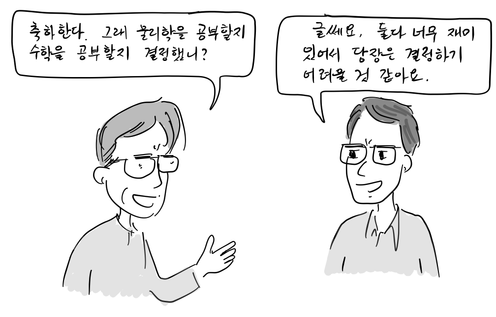

아버지: “축하한다. 그래 물리학을 공부할지 수학을 공부하지 결정했니?”  
데니스 리치: “글쎄요. 둘다 너무 재미있어서 당장은 결정하기 어려울 것 같아요.”

“수학도 좋고 물리학도 재밌고.”

1960년 경,

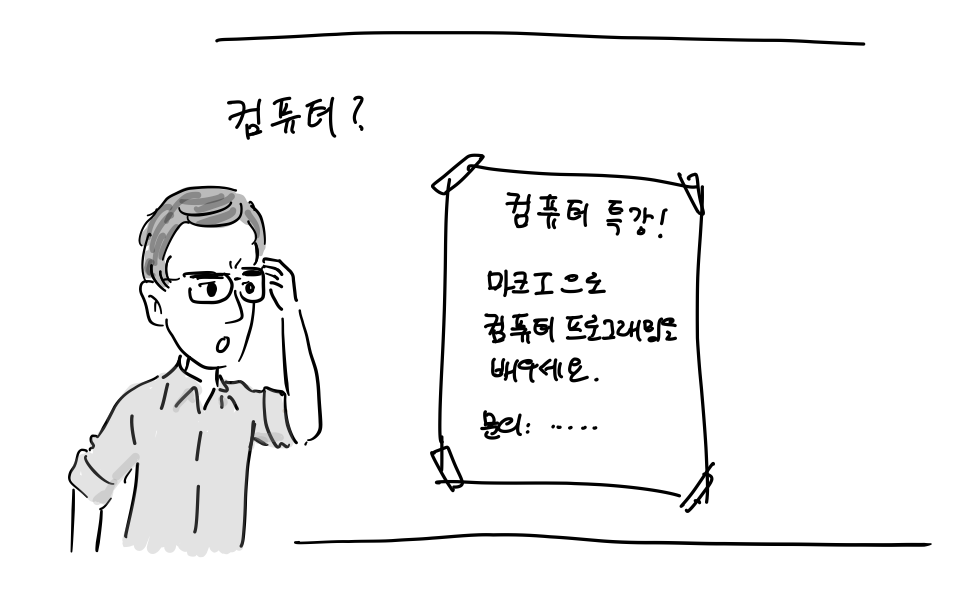

“컴퓨터?”  
컴퓨터 특강! 마크I으로 컴퓨터 프로그래밍을 배우세요. 문의: …

“컴퓨터를 이용하면 수학계산을 빨리할수 있겠는걸?”

**컴퓨터 특강 시간**

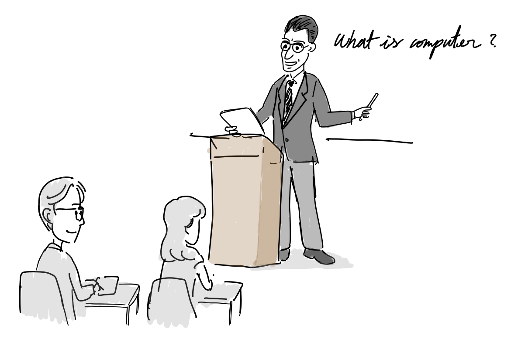

데니스 리치는 이 당시 Univac 컴퓨터로 프로그래밍을 배웠는데, 아날로그 컴퓨터, 펀치 카드 사용법을 배우고 나서야 비로소 디지털 컴퓨터를 배웠다\[2\].

물리학과 학부 학생임에도 불구하고 데니스 리치는 컴퓨터에 더 많은 흥미를 갖기 시작한다.

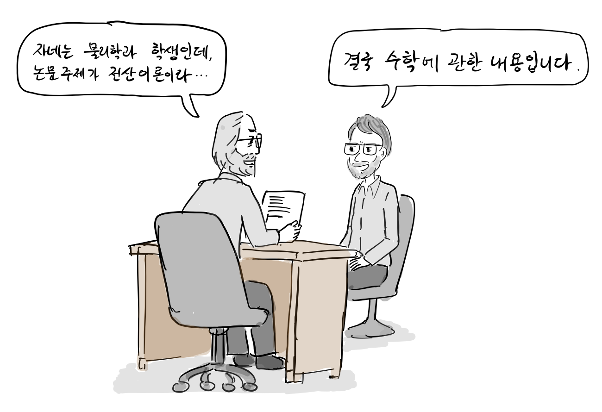

교수: “자네는 물리학과 학생인데, 논문 주제가 전산 이론이….”  
데니스: “결국, 수학에 관한 내용입니다.”

대학원 논문 주제도 지금의 전산학에 관한 내용(hierarchies of recursive functions)이였다. 대학에서 전산학이 제대로 된 학문으로 자리 잡기 전의 일이라서 아마도 응용수학으로 이러한 논문을 쓴 것 같다.

데니스 리치는 이론 보다는 실용적인 측면에 관심이 많았고, 3년 동안 그가 수강했던 컴퓨터 특강의 강사가 되어 컴퓨터를 가르쳤다\[2\].

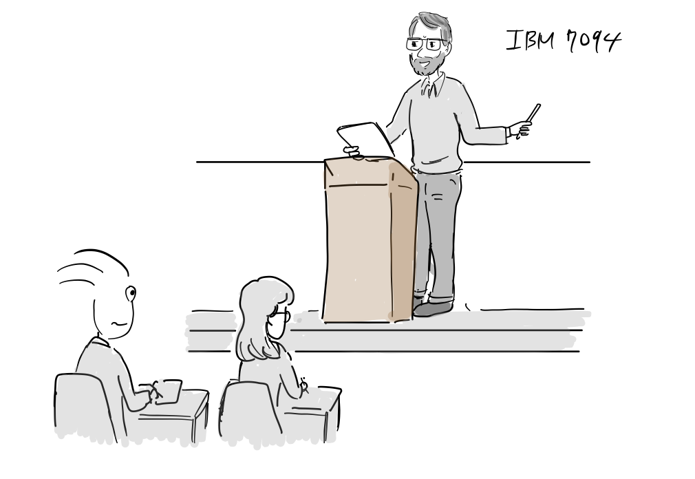

데니스 리치가 컴퓨터를 가르칠 때는 IBM 7094를 사용했다\[2\].

**1967년 벨연구소**

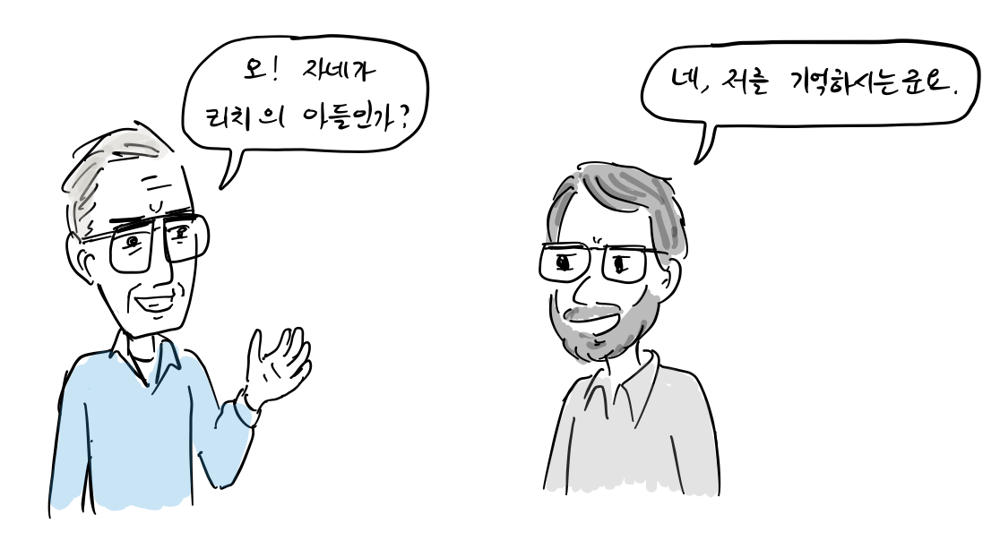

벨연구소 연구원: “오, 자네가 리치의 아들인가?”  
데니스 리치: “네, 저를 기억하시는군요.”

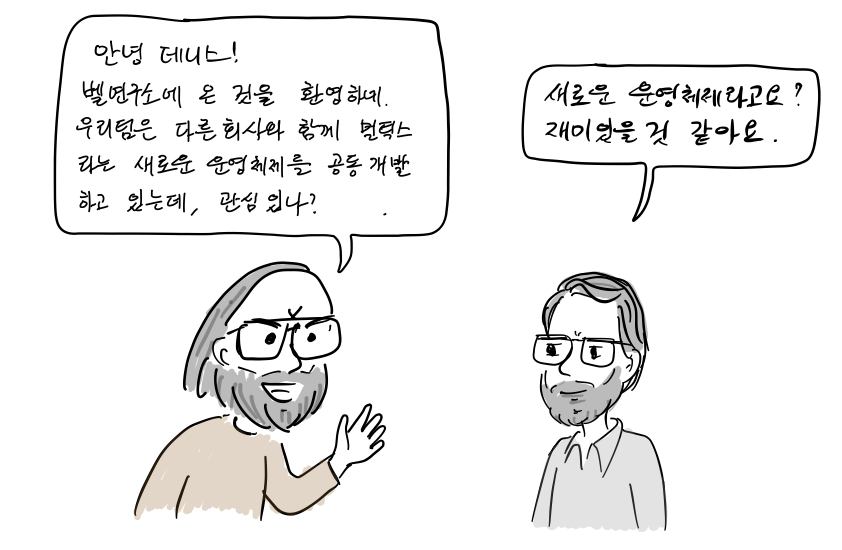

켄 톰슨: “안녕 데니스! 벨 연구소에 온 것 을 환영하네.  
우리 팀은 다른 회사와 함께 멀틱스라는 새로운 운영체제를 공동 개발하고 있는데, 관심있나?”  
데니스: “새로운 운영체제라고요? 재미있을 것 같아요.”

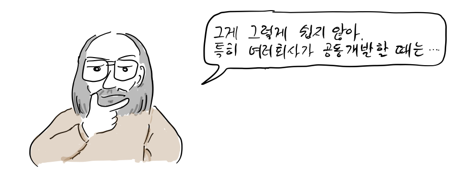

켄 톰슨: “그게 쉽지 않아. 특히, 여러 회사가 공동개발할때는…”

**1969년 벨 연구소**

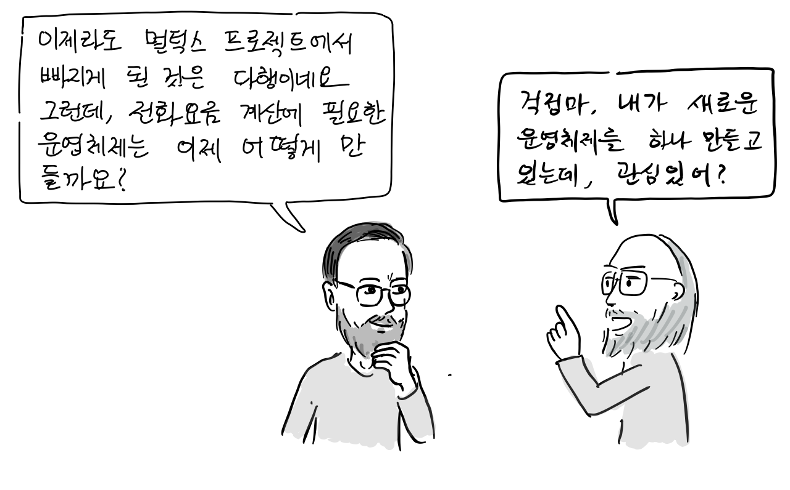

데니스: “이제라도 멀틱스 프로젝트에서 빠지게 된 것은 다행이네요.

그런데, 전화 요금 계산에 필요한 운영체제는 이제 어떻게 만들까요?”  
켄 톰슨: 걱정마, 내가 새로운 운영체제를 하나 만들고 있는데, 관심있어?”

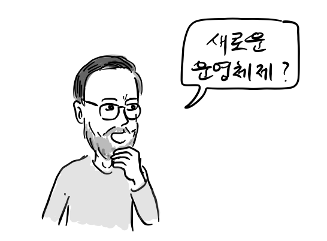

데니스: 새로운 운영체제?

톰 켄슨은 멀틱스에서 몇가지 아이디어를 가져오고 만들던 코드를 기반으로 새로운 운영체제를 만들고 있었다.

**1972년 벨 연구소**

유닉스 개발 당시 PDP-11으로 컴퓨터가 업그레이드되었는데, 명령어가 호환되지 않아서 다시 어셈블리 코드를 작성해야했다. 데니스 리치는 톰 켄슨과 함께 개발한 B언어로 유닉스를 다시 개발하려는 시도를 한다\[3\].

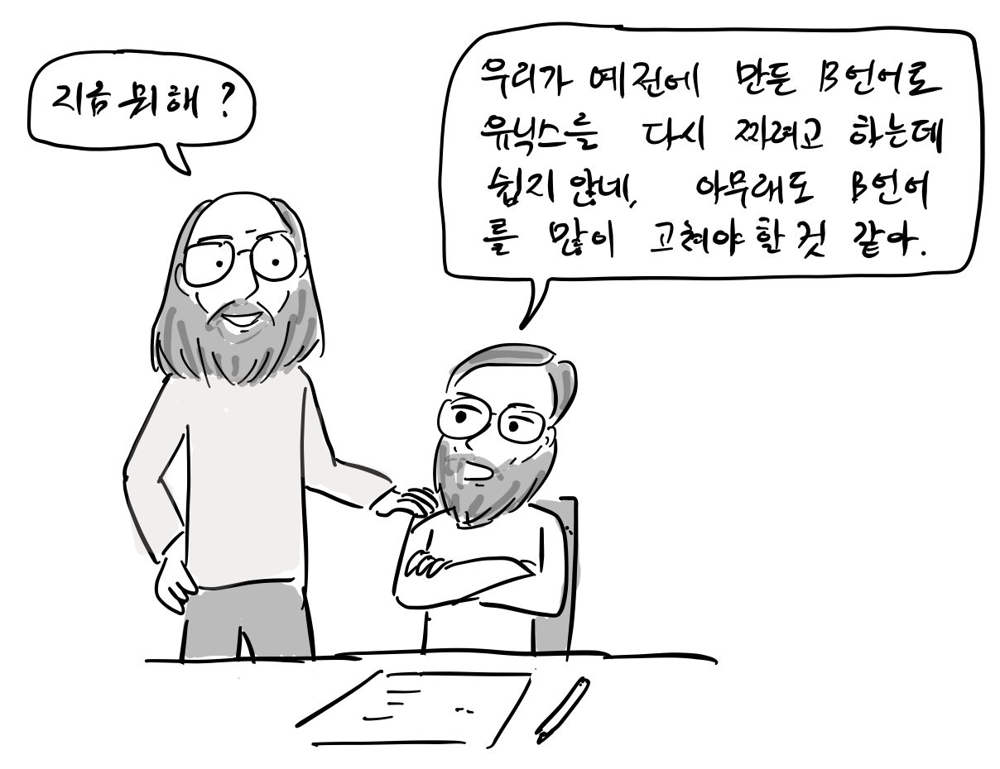

켄 톰슨: “지금 뭐해?”  
데니스: “우리가 예전에 만든 B언어로 유닉스를 다시 짜려고 하는데, 쉽지 않네. 아무래도 B언어를 많이 고쳐야할 것 같아.”

당시 B언어는 PDP-11의 최신 기능을 활용하지 못했는데, 이를 수정해서 [C언어](https://ko.wikipedia.org/wiki/C_\(%ED%94%84%EB%A1%9C%EA%B7%B8%EB%9E%98%EB%B0%8D_%EC%96%B8%EC%96%B4\))라는 이름으로 재탄생한다. 그리고, 1972년 유닉스를 다시 C언어로 개발했다\[4\].

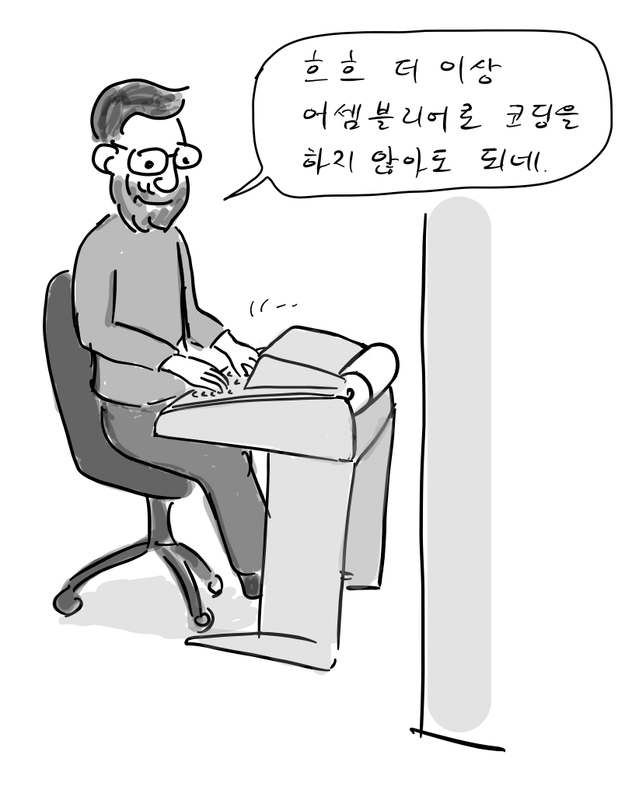

“흐흐 더 이상 어셈블리어로 코딩을 하지 않아도 되네.”

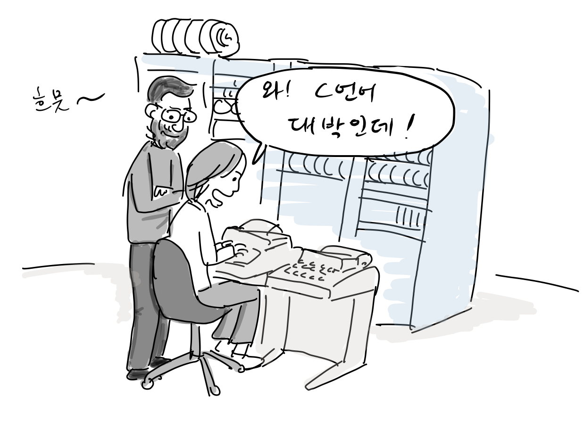

“흐뭇~” “와 C언어 대박인데!”

유닉스와 C언어는 벨 연구소 내에서 사용되었고, 1975년 부터 외부에 라이센스되어 판매되기 시작했고, 대학과 각 기관에 보급되었다. 또한, HP, Sun Microsystems과 같은 회사에서도 유닉스 코드를 기반으로 한 자체 운영체제를 만들기 시작하면서 사실상 업계 표준으로 자리 잡기 시작한다.

**C 프로그래밍 언어 책을 쓰다.**

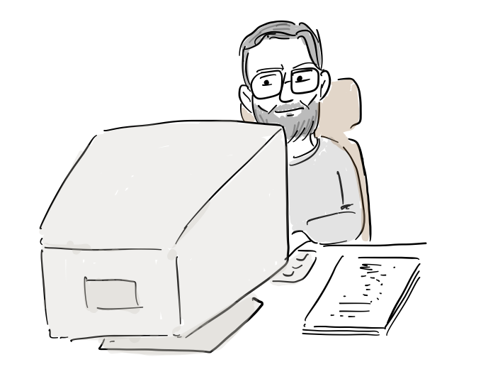

벨 연구소에 일하던 [브라이언 커니핸](https://ko.wikipedia.org/wiki/%EB%B8%8C%EB%9D%BC%EC%9D%B4%EC%96%B8_%EC%BB%A4%EB%8B%88%ED%95%B8)은 사내 교육용으로 B언어 튜토리얼를 작성했다. 이후, B언어가 C언어로 업그레이드 되면서 자연스럽게 C언어 튜토리얼도 작성하게 된다.

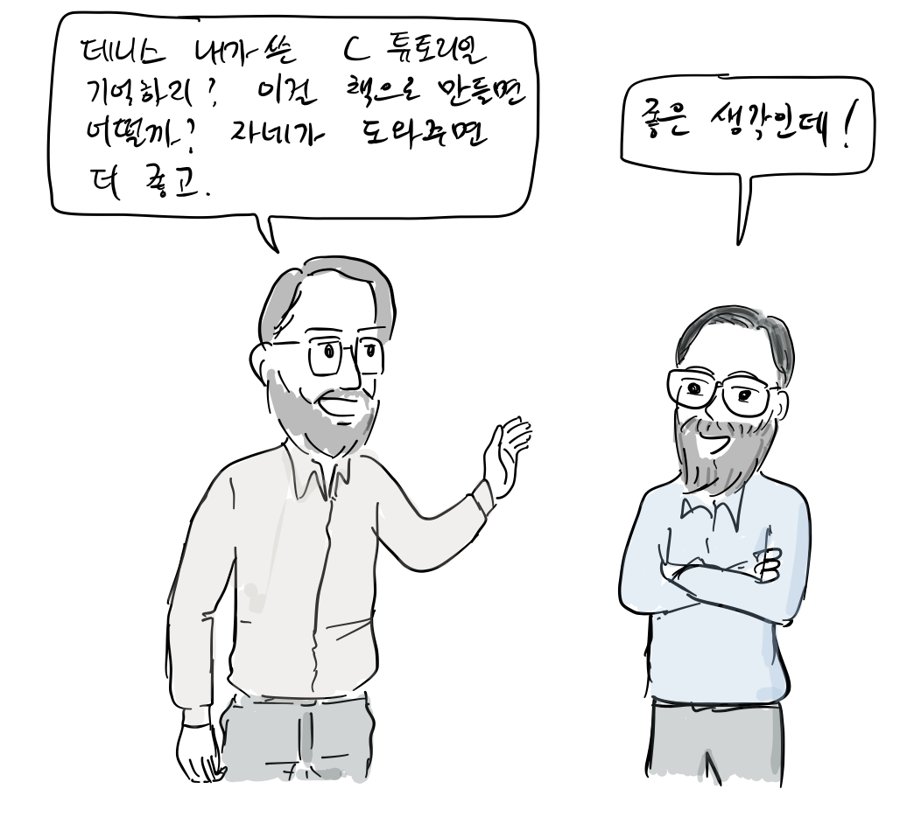

브라이언 커니핸: “데니스, 내가 쓴 C튜토리얼 기억하지? 이걸 책으로 만들면 어떨까? 자네가 도와주면 더 좋고.”  
데니스 리치: “좋은 생각인데!”

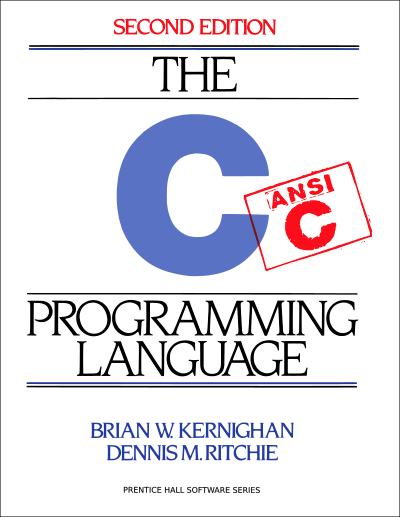

책표지, 이미지 출처: 위키피디아 ([링크](https://en.wikipedia.org/wiki/The_C_Programming_Language#/media/File:The_C_Programming_Language_cover.svg))

C 프로그래밍 언어 책은 1978년 첫판이 출간되었고, 1988년 2판이 출판되었다. 20개 언어로 번역되었고, 90년대까지 전산학을 전공한 학생이면 대부분 이 책으로 C언어를 공부했다.

**분산운영체제 Plan9**

“흠.. 유닉스 이후에는 어떤 운영체제를 만들어야 하나?”

벨 연구소는 유닉스의 후속으로 80년대 중반부터 Plan9이라는 운영체제를 개발하기 시작한다.

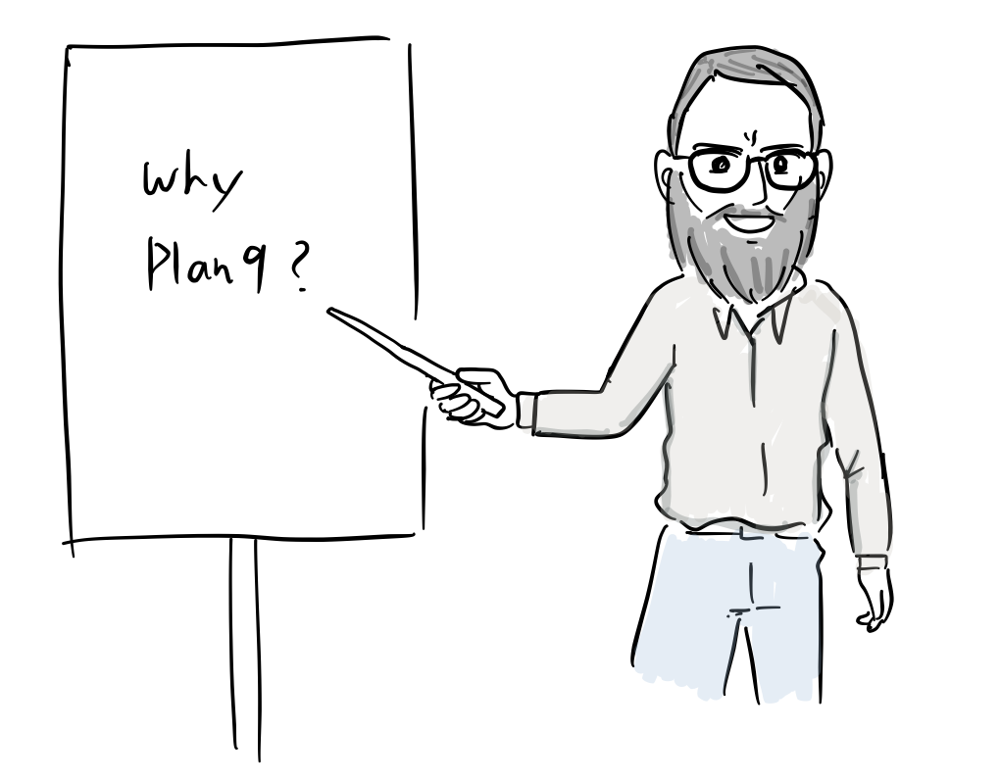

데니스 리치는 이미 Computing Techniques Research 부서를 이끌고 있었는데, 이 때 부터는 실제 개발 보다는 조언자로서 개발에 참여한다. 본인 말로는 급여를 승인하는 업무를 했다고 하는데, 일부 코드를 작성했음을 시인하기도 했다\[5\].

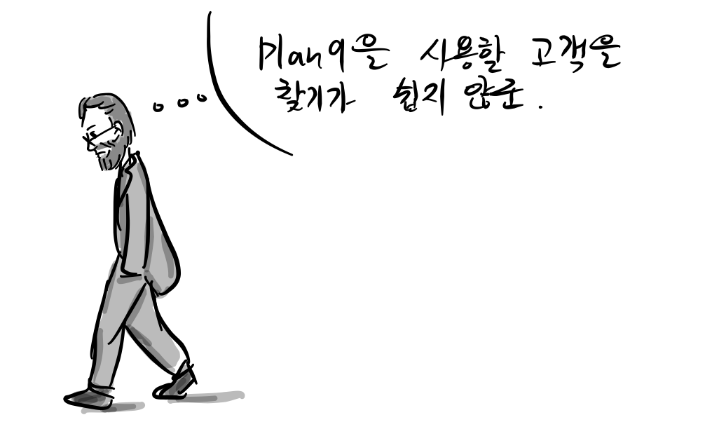

Plan9은 벨 연구소 내부에서 유닉스를 대치하시 시작했지만 외부에서 고객을 찾기는 쉽지 않았다.

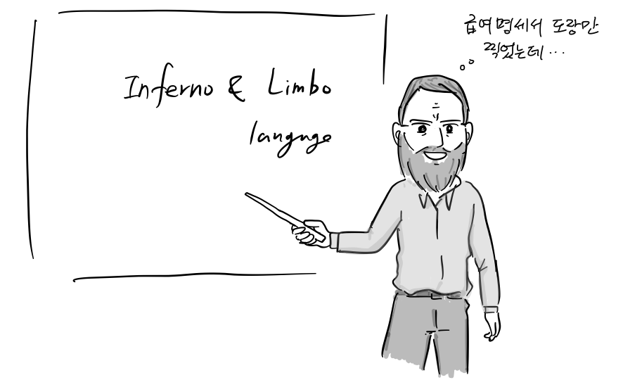벨 연구소는 1990년대 부터 네트웍 장비에 사용할 목적으로 Inferno라는 운영체제와 Limbo라는 프로그래밍 언어를 개발하기 시작한다. 다양한 네트웍 장비에 동작을 하기 위해 가상 기계를 도입했는데, Sun에서 개발한 Java와 비슷한 부분이 많았다.

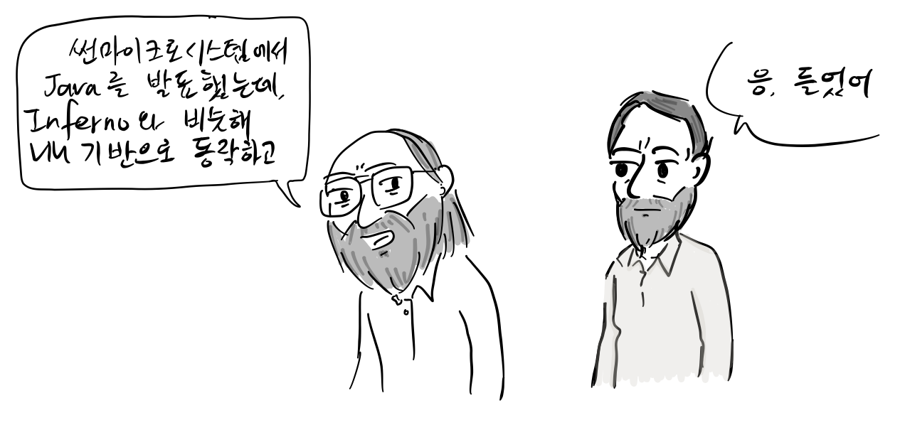

동료: “선마이로시스템에서 Java를 발표했는데, Inferno와 비슷해. VM기반으로 동작하고.”  
데니스: “응, 들었어.”

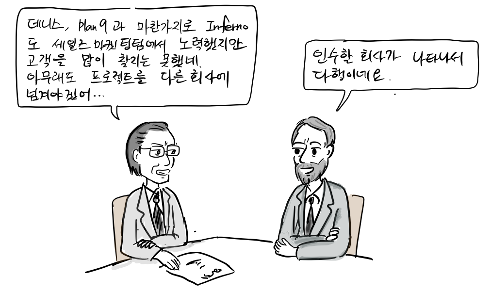

벨연구소장: “데니스, Plan9과 마찬가지로 Inferno도 세일즈 마켓팅팀에서 노력했지만 고객을 많이 찾지는 못했네. 아무래도 프로젝트를 다른 회사에 넘겨야겠어.”  
데니스: “인수할 회사가 나타나서 다행이네요.”

데니스 리치가 개발에 참여하고 조언을 했음에도 불구하고 벨 연구소가 유닉스 후속으로 개발한 Plan9과 Inferno는 시장에서 성공적이지 못했다. 마케팅의 실패 등 여러가지 이유가 있겠지만, 근본적으로 유닉스가 여전히 쓸만했기 때문에, 다른 OS를 도입할 이유를 찾기 어려웠다. 여기서 에릭 레이먼드는 [본인이 쓴 책](http://catb.org/~esr/writings/taoup/html/plan9.html)에서 Plan9를 예로 들면서 이러한 말을 남겼다\[6\]

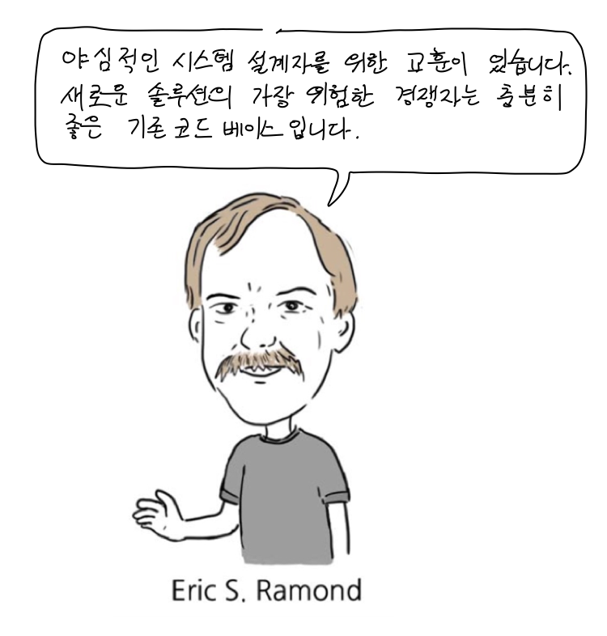

“야심적인 시스템 설계자를 위한 교훈이 있습니다. 새로운 솔루션의 가장 위험한 경쟁자는 충분히 좋은 기존 코드 베이스입니다(There is a lesson here for ambitious system architects: the most dangerous enemy of a better solution is an existing codebase that is just good enough).”

Plan9에서 나온 [/proc, utf8, clone 등 몇 가지 아이디어는 다른 유닉스와 리눅스에 적용](https://unix.stackexchange.com/questions/8337/what-aspects-of-plan-9-have-made-their-way-into-unix)되기도 했다.

**2007년 은퇴**

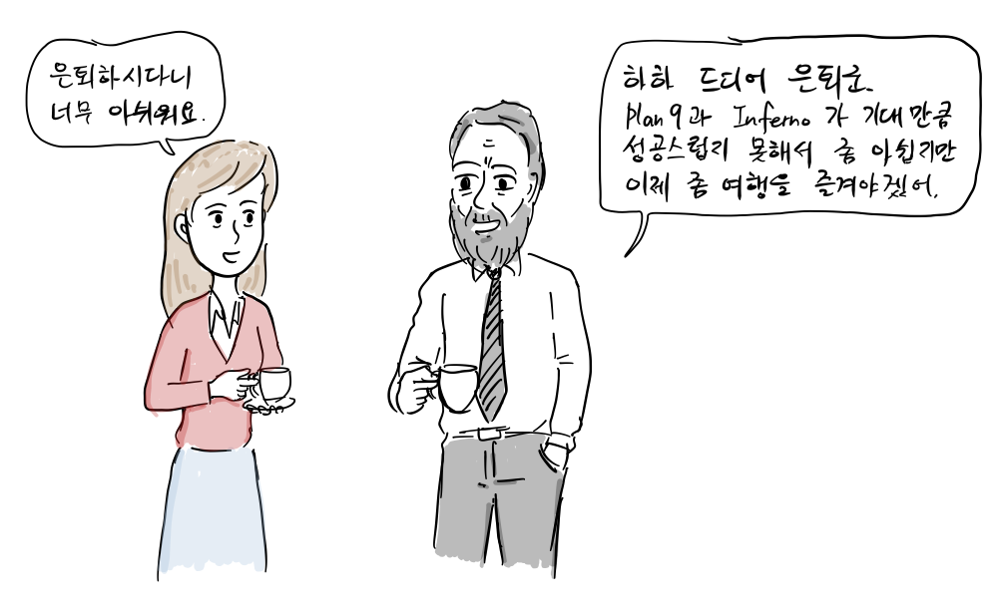

팀원: “은퇴하게 되어 너무 아쉬워요.”  
데니스: “드디어 은퇴군, Plan9과 Inferno가 성공스럽지 못해서 좀 아쉽지만, 이제 좀 여행을 즐겨야겠어.”

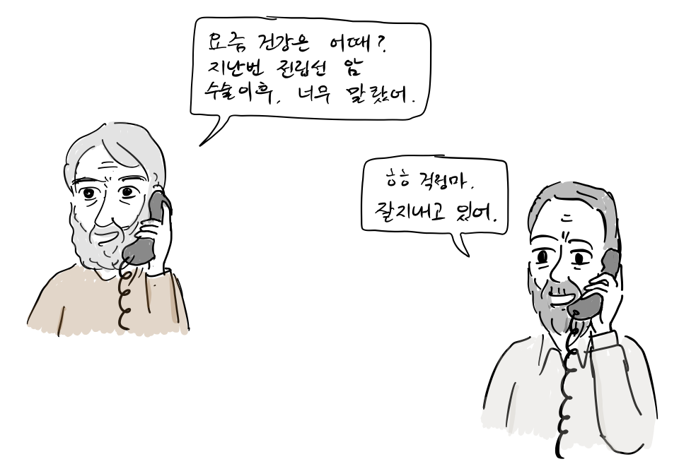

동료: “요즘 건강은 어때? 지난번 전립선 암 수술 이후, 너무 말랐어.”  
데니스: “ㅎㅎ 걱정마. 아직까지도 흥미로운게 너무 많아.”

동료:” 데니스하고 통화가 안되는데, 아무래도 집에 가봐야겠어.”

**죽음**

“이봐 데니스!”

혼자 살고 있던 데니스 리치는 2011년 10월 12일 뉴저지 주 버클리 헤이츠에 있는 집에서 숨진채로 발견되었다\[1\].

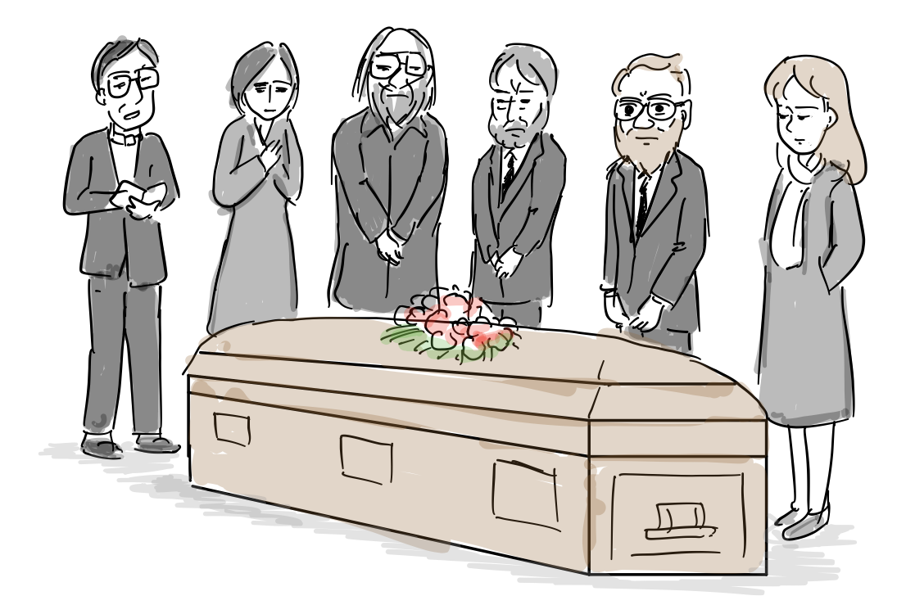

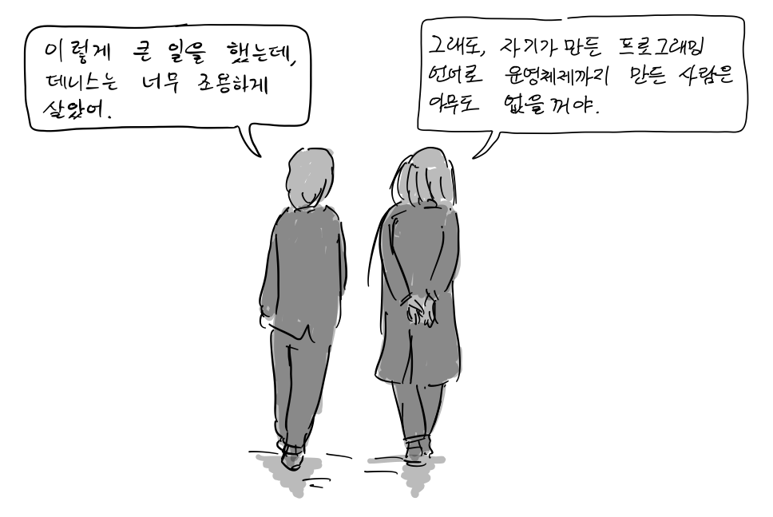 “이렇게 큰 일을 했는데, 이 친구 너무 조용하게 살았어.”  
“그래도, 자기가 만든 프로그래밍 언어로 운영체제까지 만든 사람은 아무도 없을거야…:”

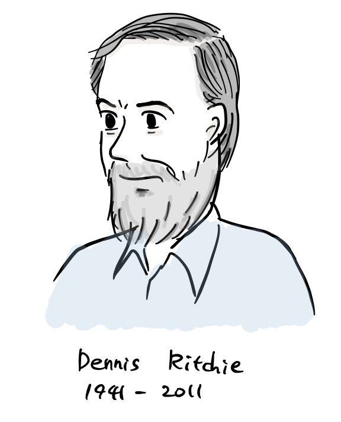

참고문헌

\[1\] [데니스 리치](https://ko.wikipedia.org/wiki/%EB%8D%B0%EB%8B%88%EC%8A%A4_%EB%A6%AC%EC%B9%98), 위키피디아 한글페이지  
\[2\] [Interview with Dennis Ritchie](https://anders.unix.se/2015/10/26/interview-with-dennis-ritchie-2003/)  
\[3\] https://en.wikipedia.org/wiki/C\_(programming\_language)  
\[4\] https://en.wikipedia.org/wiki/Unix  
\[5\] 데니스 리치 홈페이지: https://www.bell-labs.com/usr/dmr/www/chist.html  
\[6\] http://www.catb.org/esr/writings/taoup/html/plan9.html

본 만화에 나오는 대화는 실제 대화가 아니고 사실을 기반으로 하여 약간의 상상력으로 구성한 것임을 알려드립니다. 혹시 만화 내용 중 틀린 부분이 있으면 답글로 알려주시면 감사하겠습니다.
