:::panel rounded="true" style="width: 80%; align:center;"

**자기가 만든 프로그래밍 언어로 운영체제를 개발한 사람.**

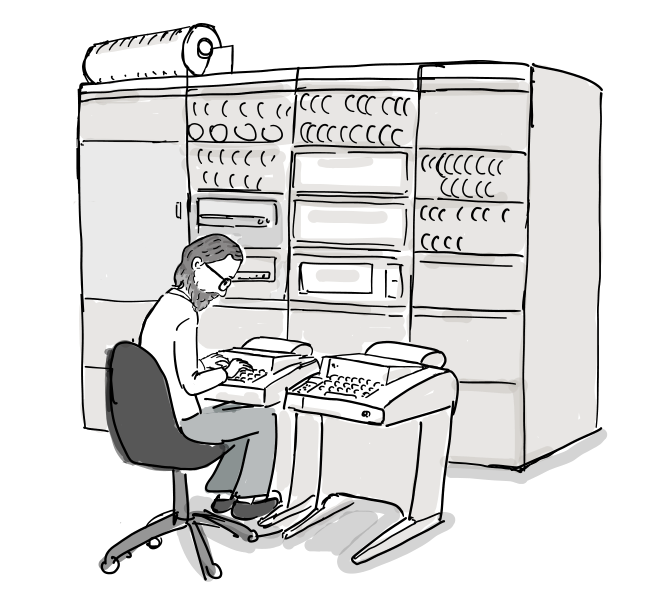

:::

## 1999년, 뜻밖의 전화

:::panel

당시 데니스 리치는 Inferno 운영체제와 Limbo라는 프로그래밍 언어를 개발하는 연구진을 이끌고 있었다.[&lbrack;1&rbrack;][1]

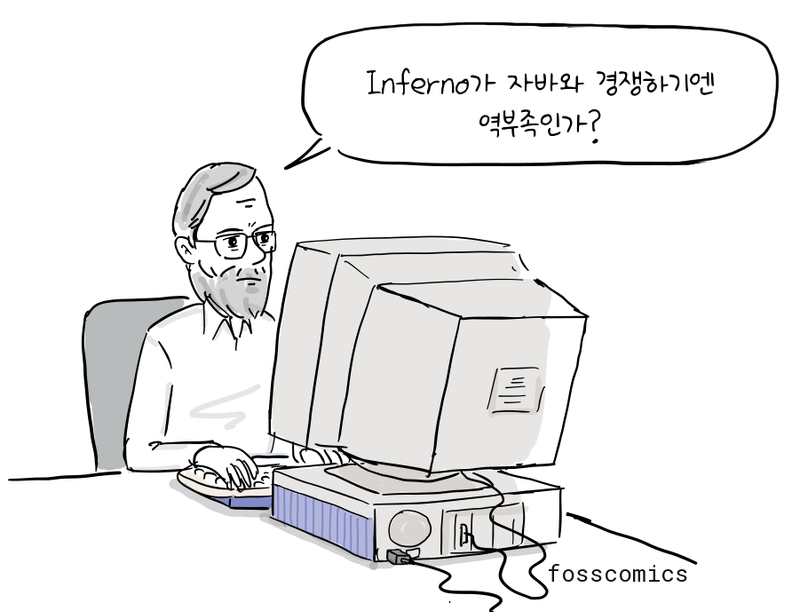

> Inferno가 자바와 경쟁하기엔 역부족인가?

:::

:::panel style="margin-top: 5rem;margin-bottom: 5rem;"

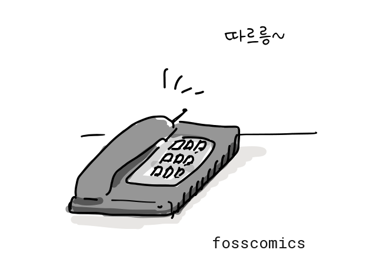

> 따르릉~

:::

:::panel rounded="true"

리치와 켄 톰프슨은 1998년도 미국 국가 기술 훈장 수상자로 선정되어, 1999년 4월 백악관에서 훈장을 받았다.[&lbrack;11&rbrack;][11]

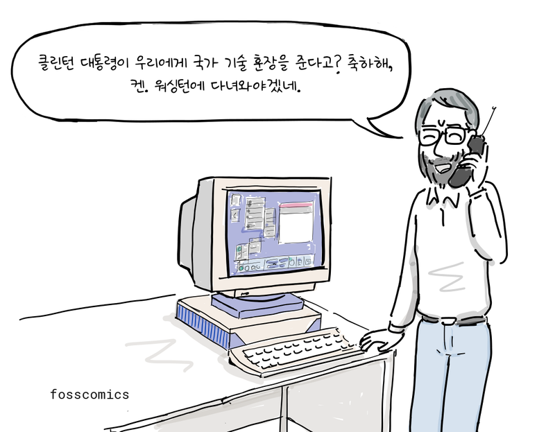

> 클린턴 대통령이 우리에게 국가 기술 훈장을 준다고? 축하해, 켄. 워싱턴에 다녀와야겠네.

:::

::::panels columns="2" label=""

:::panel rounded="true"

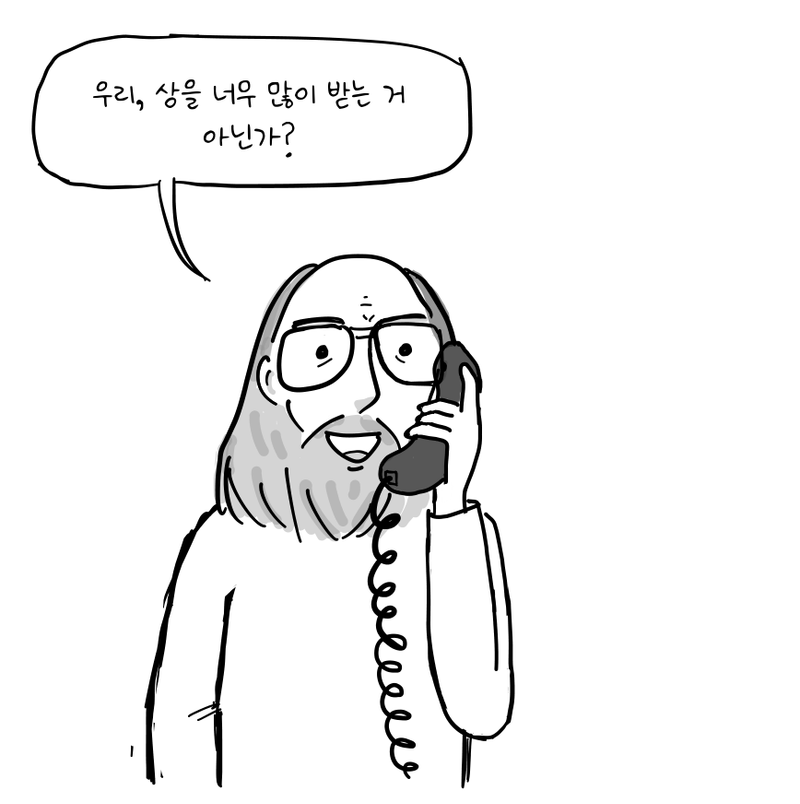

> 우리, 상을 너무 많이 받는 거 아닌가?

:::

:::panel rounded="true"

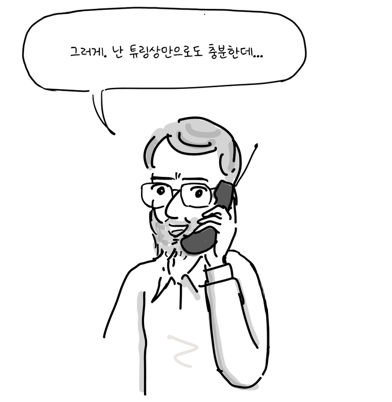

> 그러게. 난 튜링상만으로도 충분한데...

:::

::::

:::panel rounded="true"

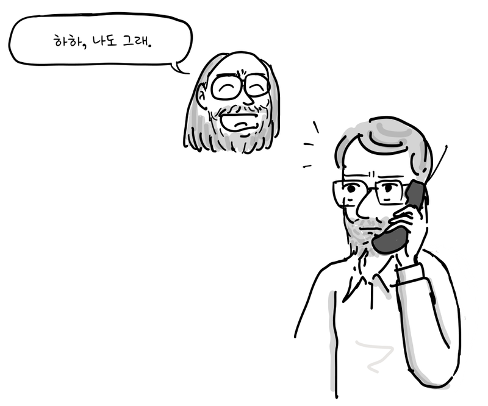

> 하하, 나도 그래.

:::

## 아버지와 벨 연구소

:::panel

1940년대 데니스 리치의 아버지 앨리스터 E. 리치는 벨 연구소에서 스위칭 회로 이론을 연구했다.[&lbrack;2&rbrack;][2] 당시에는 이미 자동 전화 교환기가 쓰이고 있었지만, 여전히 많은 통화는 교환수가 상대방을 연결해 주어야 했다.[&lbrack;12&rbrack;][12] 벨 시스템의 연구기관인 벨 연구소에서는 전후에도 자동 교환 기술을 발전시키기 위한 연구가 이어지고 있었다.[&lbrack;13&rbrack;][13]

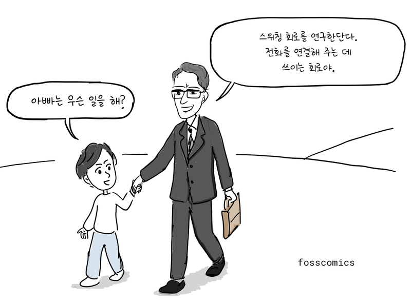

> 아빠는 무슨 일을 해?\
> 스위칭 회로를 연구한단다. 전화를 연결해 주는 데 쓰이는 회로야.

:::

:::panel style="margin-top: 5rem;margin-bottom: 5rem;"

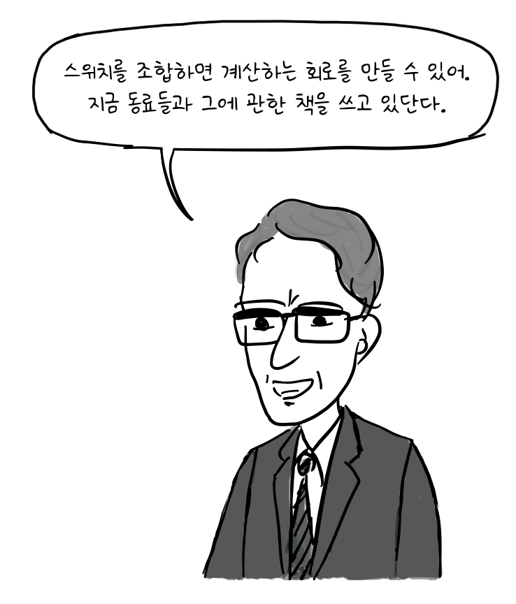

> 스위치를 조합하면 계산하는 회로를 만들 수 있어. 지금 동료들과 그에 관한 책을 쓰고 있단다.

:::

## 하버드 대학에서 컴퓨터를 만나다

:::panel

10여 년 후,

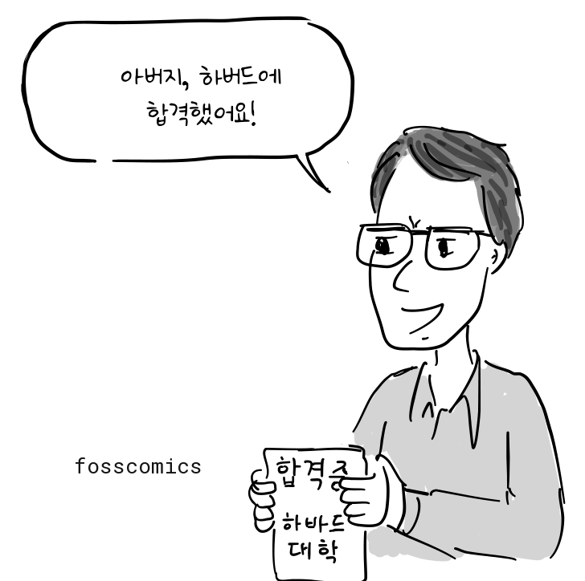

> 아버지, 하버드에 합격했어요!

:::

:::panel style="margin-top: 5rem;margin-bottom: 5rem;"

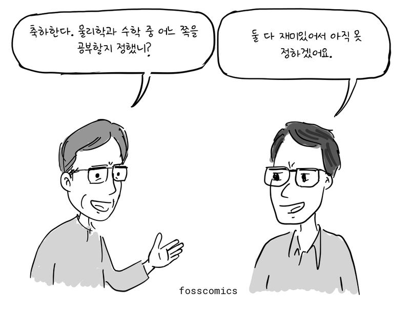

> 축하한다. 물리학과 수학 중 어느 쪽을 공부할지 정했니?\
> 둘 다 재미있어서 아직 못 정하겠어요.

:::

:::panel style="margin-bottom: 5rem;"

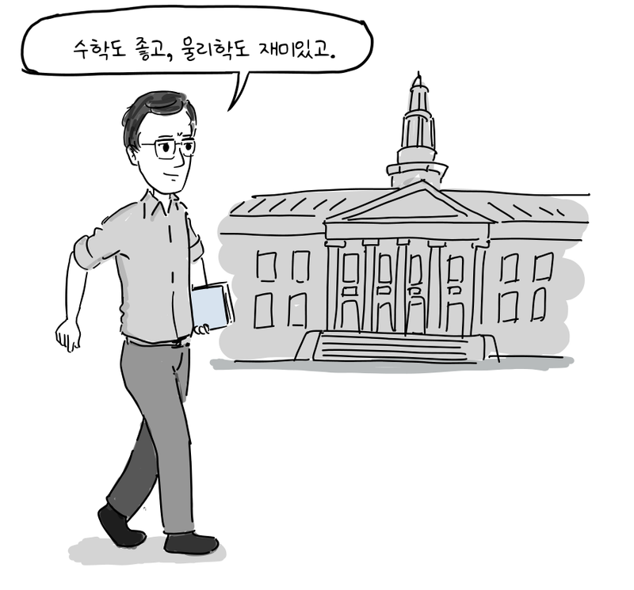

> 수학도 좋고, 물리학도 재미있고.

:::

::::panels columns="2" label="컴퓨터 입문 수업과 데니스의 생각"

:::panel rounded="true"

1960년 무렵,

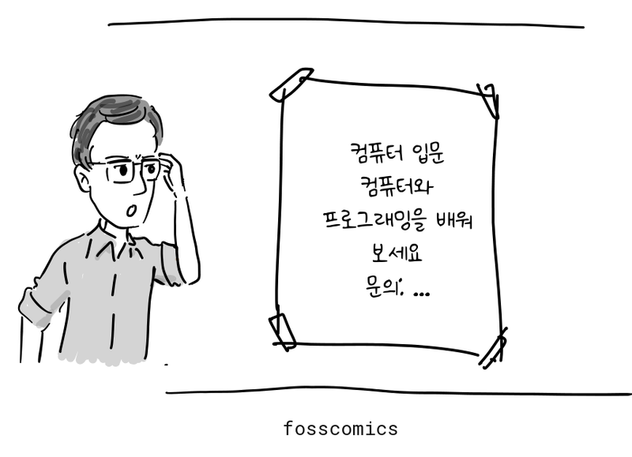

> 컴퓨터 입문 컴퓨터와 프로그래밍을 배워 보세요 문의: ...

:::

:::panel rounded="true"

> 컴퓨터가 있으면 수학 계산을 빨리할 수 있겠는데?

:::

::::

:::panel rounded="true"

데니스 리치는 컴퓨터 강연에 흥미를 느껴 입문 수업을 들었다. 아날로그 컴퓨터와 천공 카드 사용법을 배운 뒤, UNIVAC I에서 실행할 프로그램을 작성했다.[&lbrack;3&rbrack;][3]

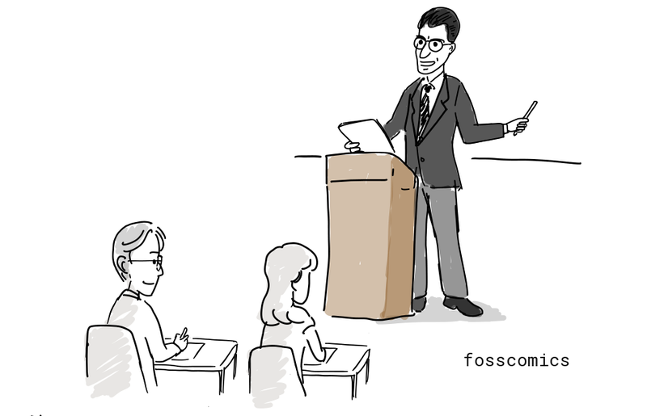

:::

:::panel style="margin-top: 5rem;"

물리학과 학부 학생이었던 데니스 리치는 컴퓨터의 이론과 실제에 점점 더 많은 흥미를 갖기 시작한다.[&lbrack;3&rbrack;][3]

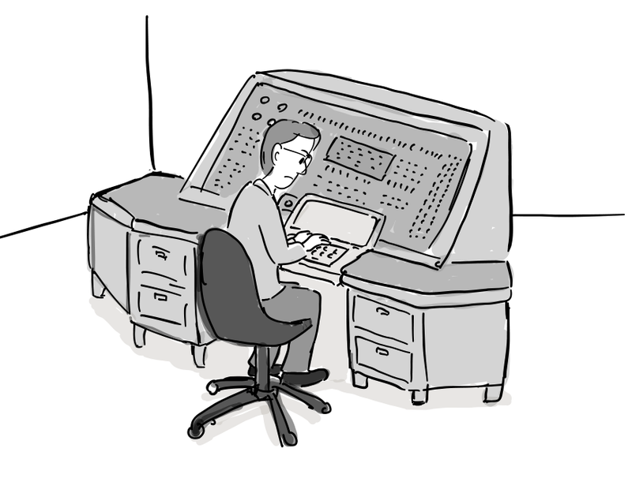

:::

:::panel style="margin-top: 5rem;margin-bottom: 5rem;"

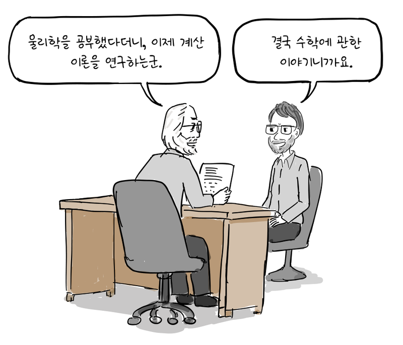

> 물리학을 공부했다더니, 이제 계산 이론을 연구하는군.\
> 결국 수학에 관한 이야기니까요.

:::

:::panel rounded="true"

대학원 논문 주제도 지금의 전산학에 관한 내용인 재귀 함수의 계층(hierarchies of recursive functions)이었다. 리치는 응용수학을 공부하며 이 주제를 연구했다. 전산학이 독립된 학문으로 자리 잡아 가던 시기였다.[&lbrack;2&rbrack;][2][&lbrack;3&rbrack;][3]

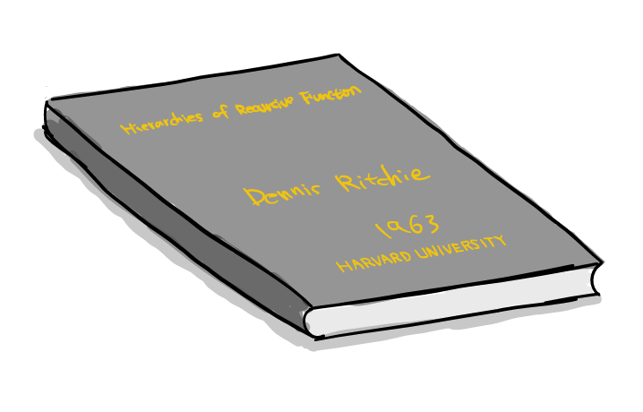

:::

:::panel style="margin-top: 2rem;margin-bottom: 5rem;"

데니스 리치는 실용적인 측면에도 관심이 많았고, 3년 동안 자신이 수강했던 컴퓨터 입문 수업의 조교로 학생들을 가르쳤다. 그가 컴퓨터를 가르칠 때는 IBM 7094를 사용했다.[&lbrack;3&rbrack;][3]

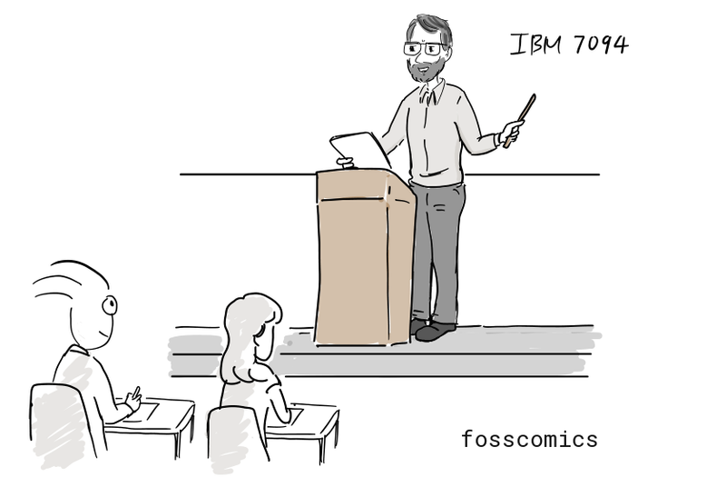

:::

## 벨 연구소와 유닉스의 탄생

:::panel

1967년, 데니스 리치는 벨 연구소에서 일을 시작했다.[&lbrack;2&rbrack;][2]

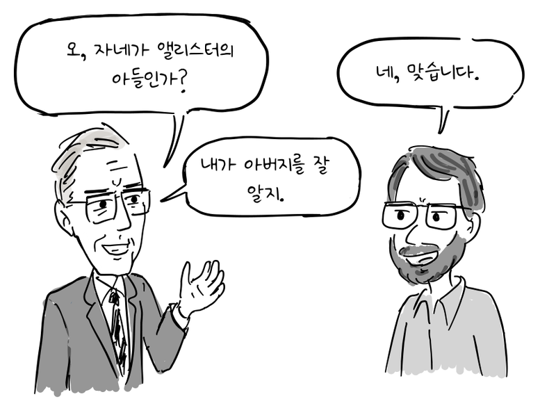

> 오, 자네가 앨리스터의 아들인가?\
> 네, 맞습니다.\
> 내가 아버지를 잘 알지.

:::

:::panel style="margin-top: 5rem;margin-bottom: 5rem;"

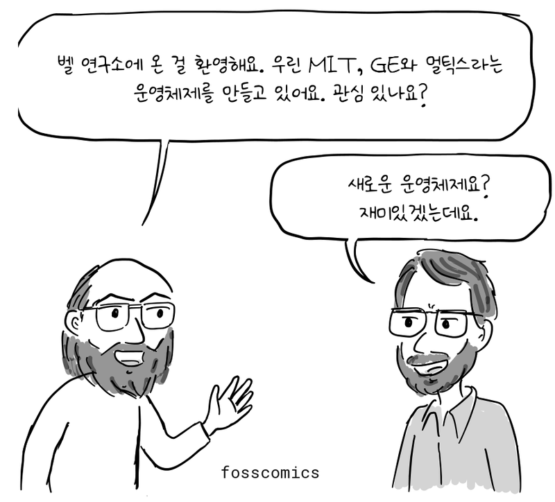

> 벨 연구소에 온 걸 환영해요. 우린 MIT, GE와 멀틱스라는 운영체제를 만들고 있어요. 관심 있나요?\
> 새로운 운영체제요? 재미있겠는데요.

:::

:::panel

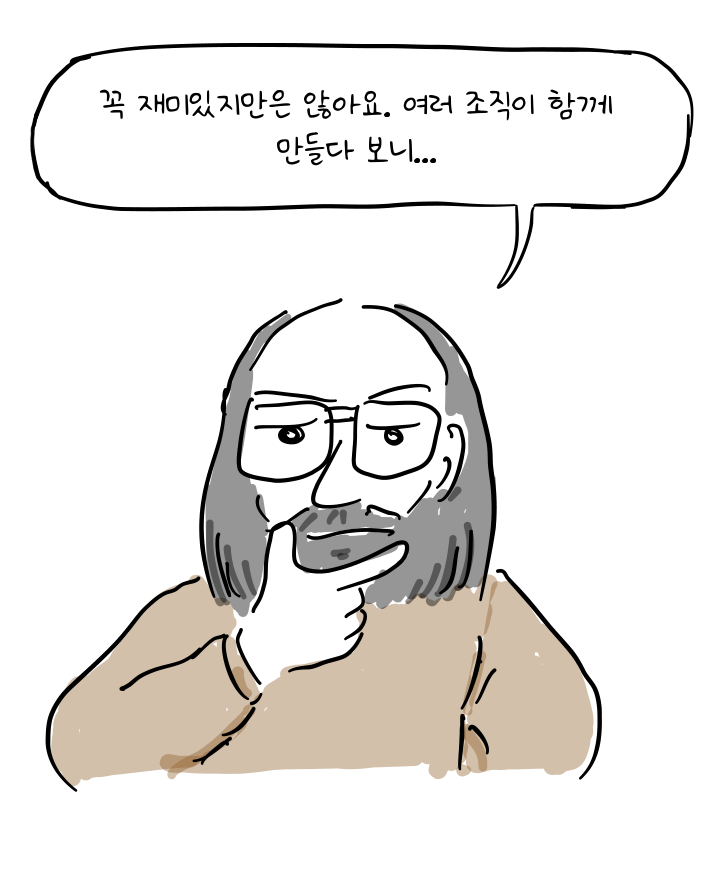

> 꼭 재미있지만은 않아요. 여러 조직이 함께 만들다 보니...

:::

:::panel style="margin-top: 5rem;margin-bottom: 5rem;"

1969년, 벨 연구소는 멀틱스 프로젝트에서 철수했다.[&lbrack;2&rbrack;][2]

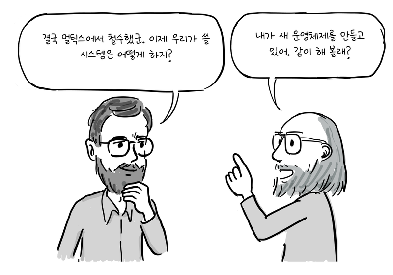

> 결국 멀틱스에서 철수했군. 이제 우리가 쓸 시스템은 어떻게 하지?\
> 내가 새 운영체제를 만들고 있어. 같이 해 볼래?

:::

:::panel style="margin-bottom: 5rem;"

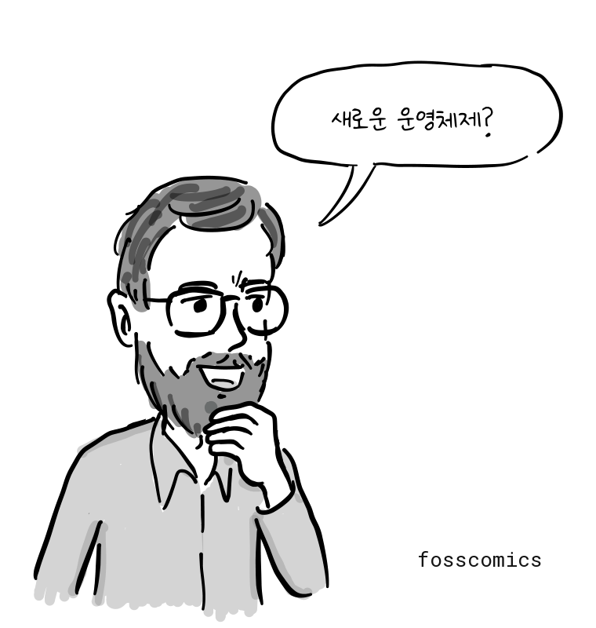

> 새로운 운영체제?

:::

:::panel

켄 톰슨은 멀틱스에서 몇 가지 아이디어를 가져와 새로운 운영체제를 만들고 있었다. 리치와 동료들도 개발에 참여했고, 이 시스템이 유닉스가 되었다.[&lbrack;2&rbrack;][2][&lbrack;4&rbrack;][4]

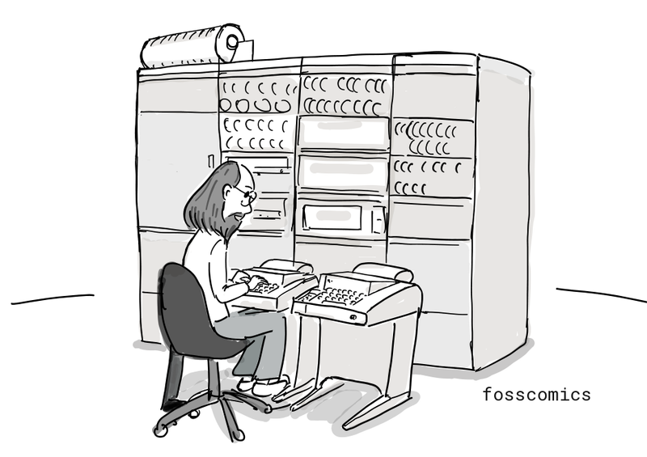

:::

## B언어에서 C언어로

:::panel

1972년 무렵, 벨 연구소.

유닉스 개발 도중 컴퓨터를 PDP-7에서 PDP-11로 옮기게 되었다. CPU 명령어가 호환되지 않아 어셈블리 코드를 다시 작성해야 했다. 데니스 리치는 켄 톰슨이 만든 B언어로 유닉스를 구현하려 했지만, B언어를 PDP-11에 그대로 쓰기에는 한계가 있었다.[&lbrack;4&rbrack;][4]

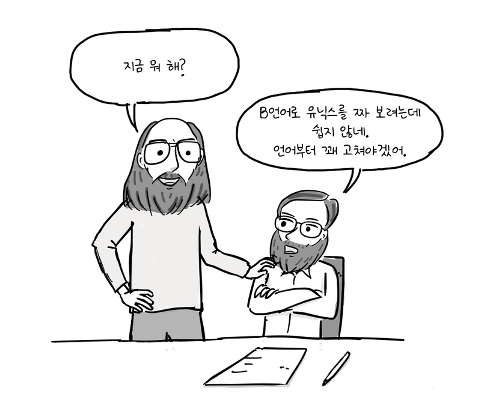

> 지금 뭐 해?\
> B언어로 유닉스를 짜 보려는데 쉽지 않네. 언어부터 꽤 고쳐야겠어.

:::

:::panel rounded="true"

당시 B언어는 PDP-11의 기능을 충분히 활용하지 못했다. 리치는 B언어에 자료형을 더하고 컴파일러를 고쳐 C언어를 만들었다. 그리고 1973년 여름, 유닉스 커널을 C언어로 다시 작성했다.[&lbrack;4&rbrack;][4]

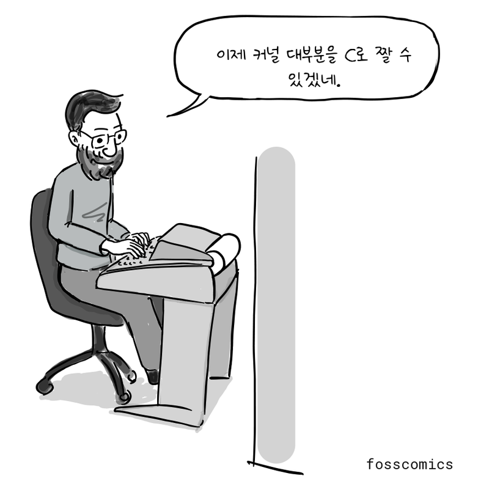

> 이제 커널 대부분을 C로 짤 수 있겠네.

:::

:::panel style="margin-top: 5rem;margin-bottom: 5rem;"

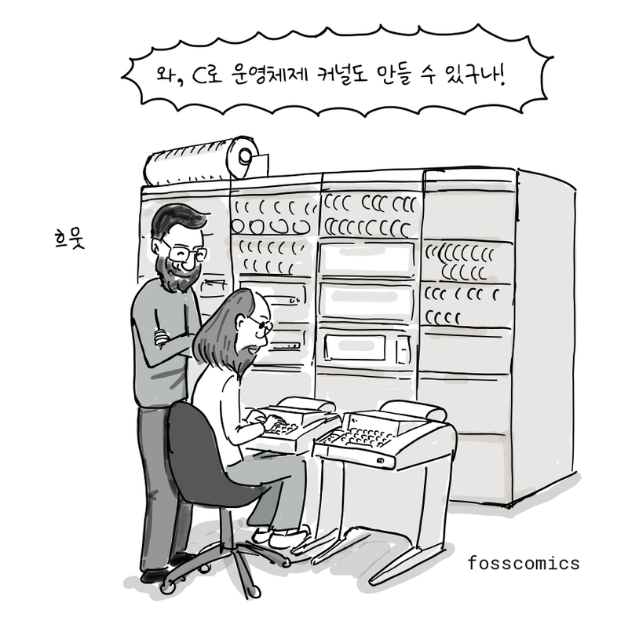

> 와, C로 운영체제 커널도 만들 수 있구나!\
> 흐뭇

:::

:::panel rounded="true" style="margin-bottom: 5rem;"

유닉스와 C언어는 벨 연구소에서 사용되다가 대학과 여러 기관으로 퍼져 나갔다. 이후 HP, Sun Microsystems 같은 회사도 유닉스 코드를 기반으로 자체 운영체제를 만들면서 유닉스는 업계의 주요 표준으로 자리 잡기 시작한다.

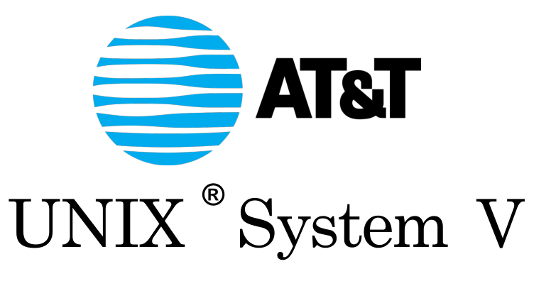

:::

## 한 권의 책으로 만난 C

:::panel

벨 연구소에서 일하던 브라이언 커니핸은 사내 교육용으로 B언어 튜토리얼을 작성했다. 이후 C언어가 개발되면서 C언어 튜토리얼도 작성하게 된다. 이 튜토리얼은 훗날 책의 바탕이 되었다.[&lbrack;1&rbrack;][1]

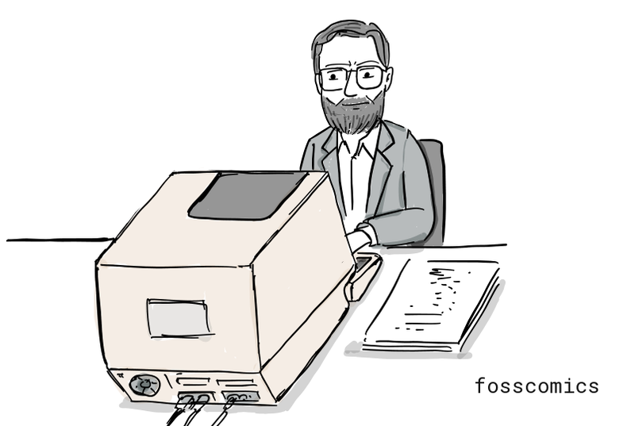

:::

:::panel style="margin-top: 5rem;margin-bottom: 5rem;"

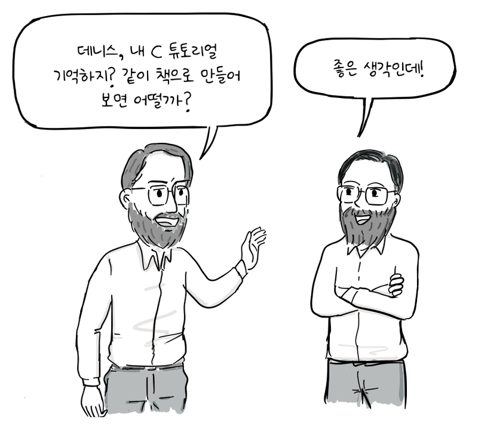

> 데니스, 내 C 튜토리얼 기억하지? 같이 책으로 만들어 보면 어떨까?\
> 좋은 생각인데!

:::

:::panel rounded="true" style="margin-bottom: 5rem;"

『The C Programming Language』는 1978년 초판이 출간되었고, 1988년 제2판이 나왔다. 여러 언어로 번역되어 C언어를 배우는 독자들에게 널리 읽혔다.[&lbrack;4&rbrack;][4][&lbrack;5&rbrack;][5]

그림은 제2판 표지. 이미지 출처: [위키피디아](https://en.wikipedia.org/wiki/The_C_Programming_Language#/media/File:The_C_Programming_Language_cover.svg).

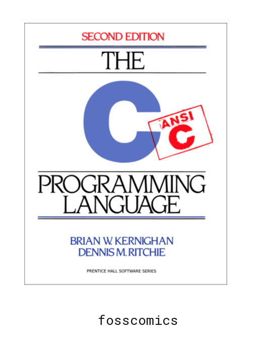

:::

## 유닉스 다음을 찾아서: Plan 9

:::panel style="margin-top: 3rem;margin-bottom: 5rem;"

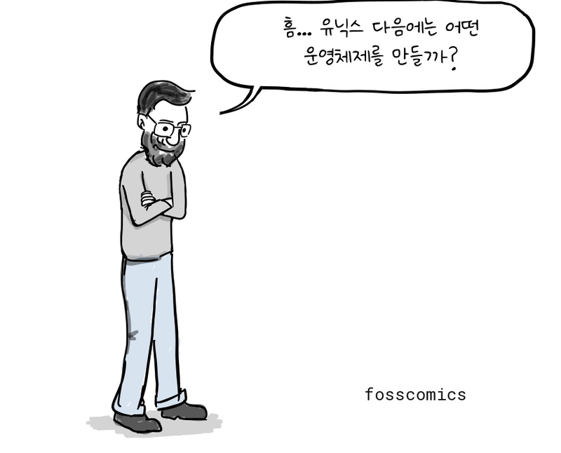

> 흠... 유닉스 다음에는 어떤 운영체제를 만들까?

:::

:::panel rounded="true"

벨 연구소에서는 1980년대 후반부터 유닉스의 후속으로 Plan 9을 개발했다. 여러 컴퓨터의 자원을 함께 쓰는 방식을 새롭게 설계한 연구용 운영체제였다.[&lbrack;6&rbrack;][6]

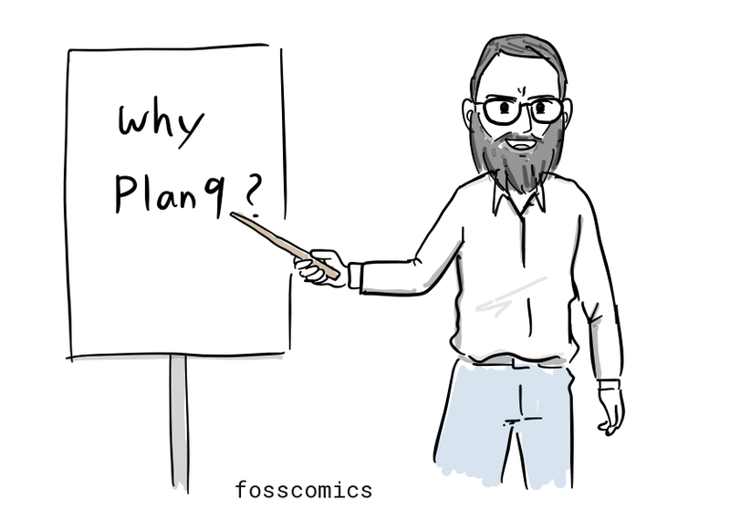

:::

:::panel style="margin-top: 3rem;margin-bottom: 5rem;"

연구팀을 이끌던 데니스 리치는 주로 관리와 조언을 맡았다. 본인 말로는 급여를 승인하는 업무를 했다고 하는데, 일부 코드를 직접 작성했음을 시인하기도 했다.[&lbrack;1&rbrack;][1]

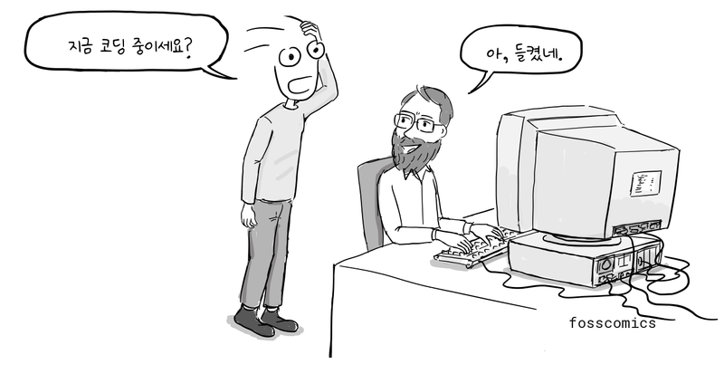

> 지금 코딩 중이세요?\
> 아, 들켰네.

:::

:::panel

Plan 9은 벨 연구소 내부에서 쓰였지만 외부에서 고객을 찾기는 쉽지 않았다. 유닉스를 널리 대체하지는 못했다.

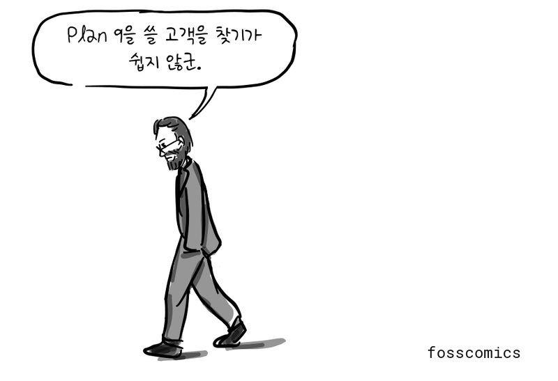

> Plan 9을 쓸 고객을 찾기가 쉽지 않군.

:::

## Inferno, 그리고 남은 아이디어

:::panel

벨 연구소는 1990년대에 다양한 장치와 네트워크에서 사용할 Inferno 운영체제와 Limbo라는 프로그래밍 언어를 개발하기 시작한다. Limbo로 작성한 프로그램은 Dis 가상 머신에서 실행되어 기종에 대한 의존도를 줄였다.[&lbrack;7&rbrack;][7][&lbrack;8&rbrack;][8]

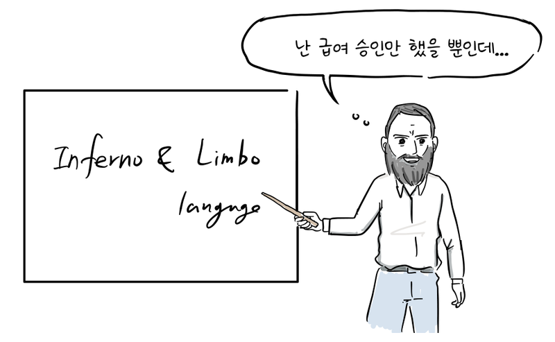

> 난 급여 승인만 했을 뿐인데...

:::

:::panel style="margin-top: 5rem;margin-bottom: 5rem;"

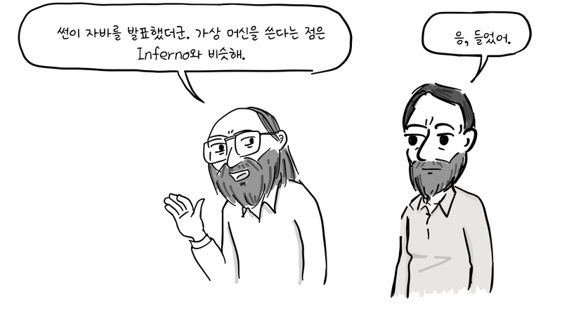

> 썬이 자바를 발표했더군. 가상 머신을 쓴다는 점은 Inferno와 비슷해.\
> 응, 들었어.

:::

:::panel 

데니스 리치가 개발에 참여하고 조언했지만, Plan 9과 Inferno는 유닉스만큼 널리 보급되지 못했다. Inferno는 이후 Vita Nuova에서 개발과 배포를 이어 갔다.[&lbrack;1&rbrack;][1][&lbrack;8&rbrack;][8]

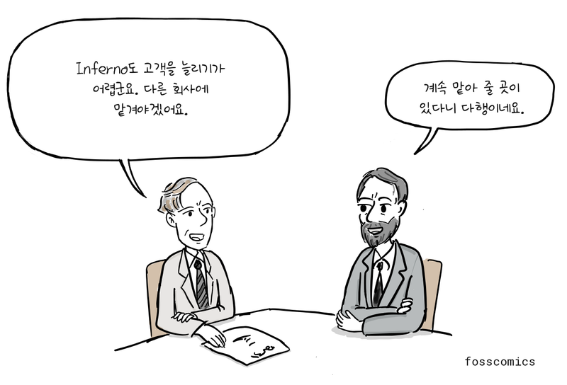

> Inferno도 고객을 늘리기가 어렵군요. 다른 회사에 맡겨야겠어요.\
> 계속 맡아 줄 곳이 있다니 다행이네요.

:::

:::panel style="margin-top: 5rem;margin-bottom: 5rem;"

마케팅의 어려움 등 여러 이유가 있었겠지만, 이미 쓸 만한 유닉스가 있다는 점도 장벽이었다. 에릭 레이먼드는 『The Art of Unix Programming』에서 Plan 9을 예로 들며 이런 교훈을 이야기했다.[&lbrack;9&rbrack;][9] 아래 대사는 그 요지를 각색한 것이다.

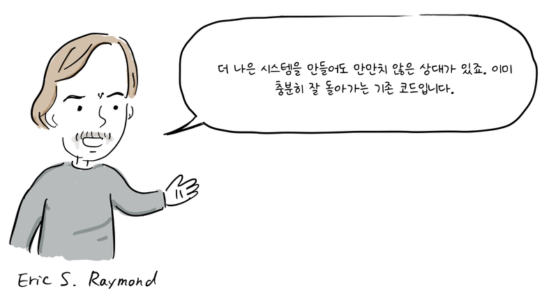

> 더 나은 시스템을 만들어도 만만치 않은 상대가 있죠. 이미 충분히 잘 돌아가는 기존 코드입니다.

:::

:::panel rounded="true" style="margin-bottom: 5rem;"

Plan 9의 몇 가지 아이디어는 다른 시스템에도 영향을 주었다. 켄 톰슨과 롭 파이크가 Plan 9에서 구현한 UTF-8은 그 대표적인 사례다.[&lbrack;10&rbrack;][10] 시스템 자체가 널리 퍼지지 않아도 그 안의 아이디어는 남았다.

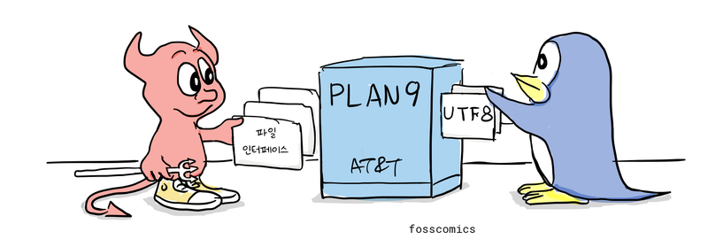

> 파일 인터페이스

:::

## 2007년, 은퇴 이후의 삶

:::panel style="margin-top: 5rem;"

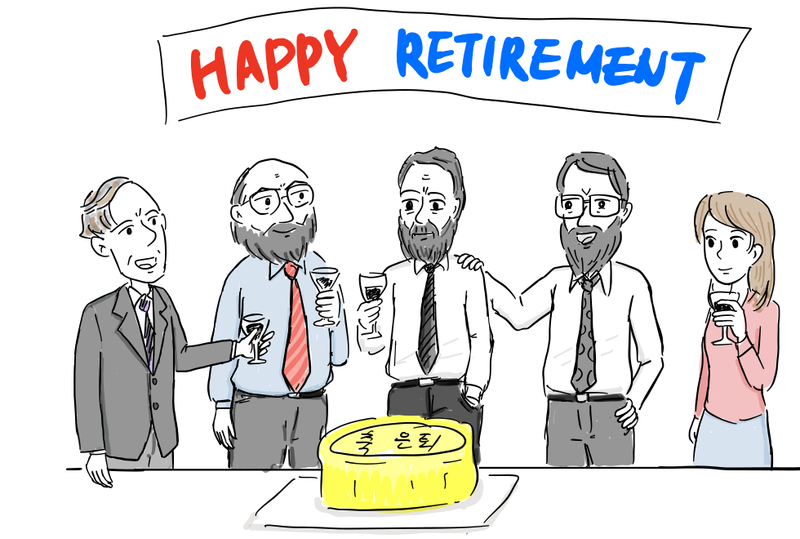

:::

:::panel style="margin-top: 5rem;margin-bottom: 5rem;"

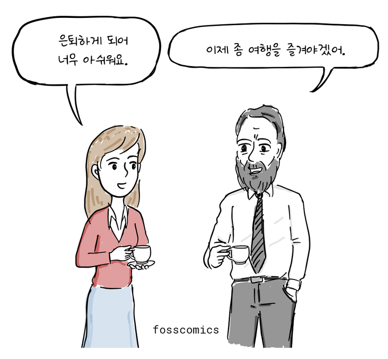

> 은퇴하게 되어 너무 아쉬워요.\
> 이제 좀 여행을 즐겨야겠어.

:::

:::panel

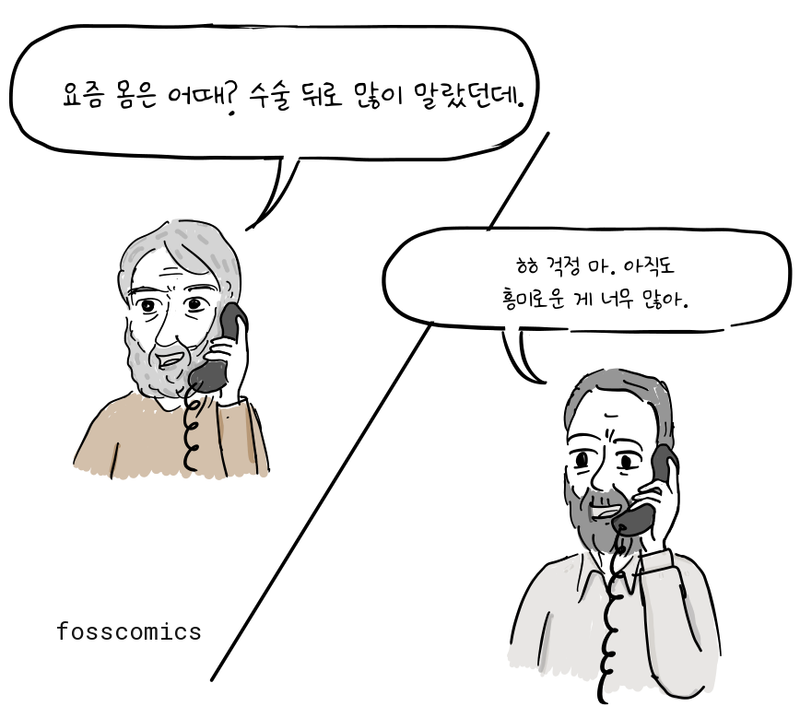

> 요즘 몸은 어때? 수술 뒤로 많이 말랐던데.\
> ㅎㅎ 걱정 마. 아직도 흥미로운 게 너무 많아.

:::

:::panel style="margin-top: 5rem;margin-bottom: 5rem;"

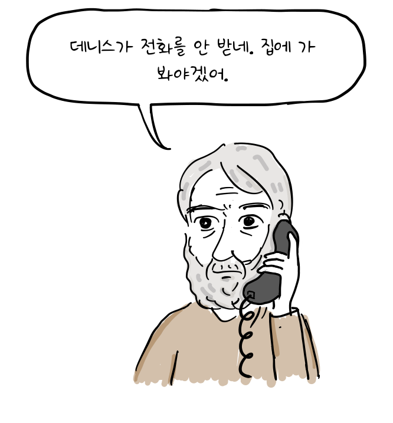

> 데니스가 전화를 안 받네. 집에 가 봐야겠어.

:::

## 2011년 10월, 조용한 작별

:::panel

데니스 리치는 2011년 10월 뉴저지의 집에서 세상을 떠났다.[&lbrack;1&rbrack;][1]

> 데니스!

:::

:::panel style="margin-top: 5rem;margin-bottom: 5rem;"

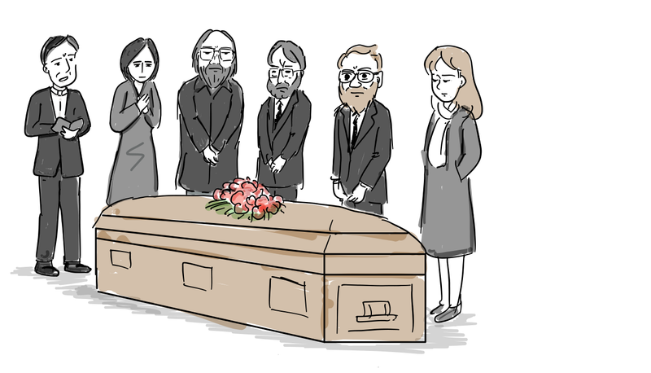

:::

:::panel 

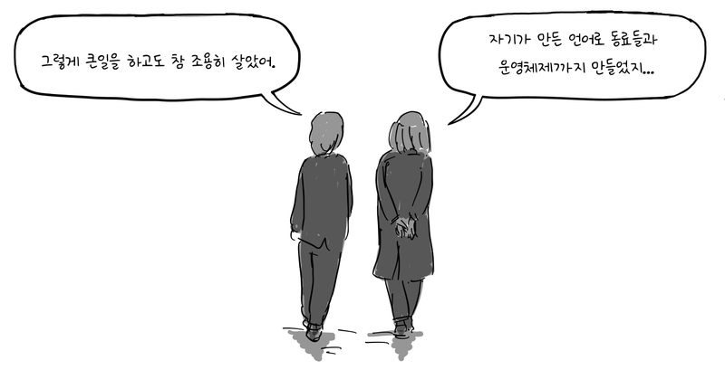

> 그렇게 큰일을 하고도 참 조용히 살았어.\
> 자기가 만든 언어로 동료들과 운영체제까지 만들었지...

:::

:::panel rounded="true" style="margin-top: 5rem;margin-bottom: 5rem;"

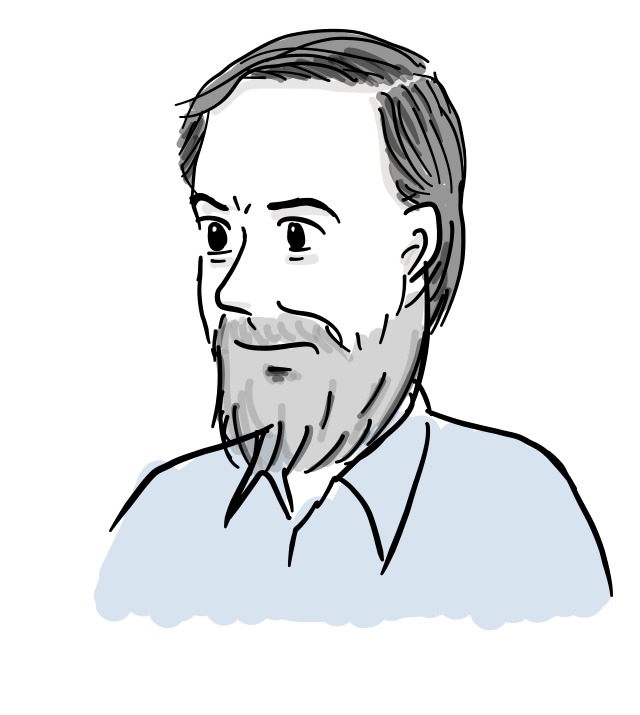

:::

**끝**

본 만화에 나오는 대화는 실제 대화가 아니라 역사적 사실을 바탕으로 상상력을 더해 구성한 것입니다. 발견 장면과 장례 장면도 목격 기록을 재현한 것이 아닙니다. 내용 중 틀린 부분이 있으면 답글로 알려주시면 감사하겠습니다.

## 참고 자료

1. [Dennis M. Ritchie homepage and family memorial](https://www.nokia.com/bell-labs/about/dennis-m-ritchie/)
2. [Dennis M. Ritchie, autobiographical sketch](https://www.nokia.com/bell-labs/about/dennis-m-ritchie/bigbio1st.html)
3. [Interview with Dennis Ritchie (2003)](https://anders.unix.se/2015/10/26/interview-with-dennis-ritchie-2003/)
4. [Dennis M. Ritchie, The Development of the C Language](https://www.nokia.com/bell-labs/about/dennis-m-ritchie/chist.html)
5. [Brian Kernighan, The C Programming Language](https://www.cs.princeton.edu/~bwk/cbook.html)
6. [Plan 9 from Bell Labs: Overview](https://9p.io/plan9/about.html)
7. [Phil Winterbottom and Rob Pike, The Design of the Inferno Virtual Machine](https://www.vitanuova.com/inferno/papers/hotchips.html)
8. [Vita Nuova, Inferno](https://www.vitanuova.com/inferno/)
9. [Eric S. Raymond, The Art of Unix Programming: Plan 9](http://catb.org/~esr/writings/taoup/html/plan9.html)
10. [Rob Pike and Ken Thompson, Hello World](https://9p.io/sys/doc/utf.html)
11. [Dennis M. Ritchie, Letter from Washington](https://www.nokia.com/bell-labs/about/dennis-m-ritchie/medal.html)
12. [David A. Price, Goodbye, Operator](https://www.richmondfed.org/publications/research/econ_focus/2019/q4/economic_history)
13. [Nokia Bell Labs, History](https://www.nokia.com/bell-labs/about/history/)

[1]: https://www.nokia.com/bell-labs/about/dennis-m-ritchie/
[2]: https://www.nokia.com/bell-labs/about/dennis-m-ritchie/bigbio1st.html
[3]: https://anders.unix.se/2015/10/26/interview-with-dennis-ritchie-2003/
[4]: https://www.nokia.com/bell-labs/about/dennis-m-ritchie/chist.html
[5]: https://www.cs.princeton.edu/~bwk/cbook.html
[6]: https://9p.io/plan9/about.html
[7]: https://www.vitanuova.com/inferno/papers/hotchips.html
[8]: https://www.vitanuova.com/inferno/
[9]: http://catb.org/~esr/writings/taoup/html/plan9.html
[10]: https://9p.io/sys/doc/utf.html
[11]: https://www.nokia.com/bell-labs/about/dennis-m-ritchie/medal.html
[12]: https://www.richmondfed.org/publications/research/econ_focus/2019/q4/economic_history
[13]: https://www.nokia.com/bell-labs/about/history/
