:::panel rounded="true" style="width: 80%; align:center;"

**The man who built an operating system, using a language he created.**

:::

## An unexpected call in 1998

:::panel

At the time, Dennis Ritchie led the research group developing the Inferno operating system and the Limbo programming language.[&lbrack;1&rbrack;][1]

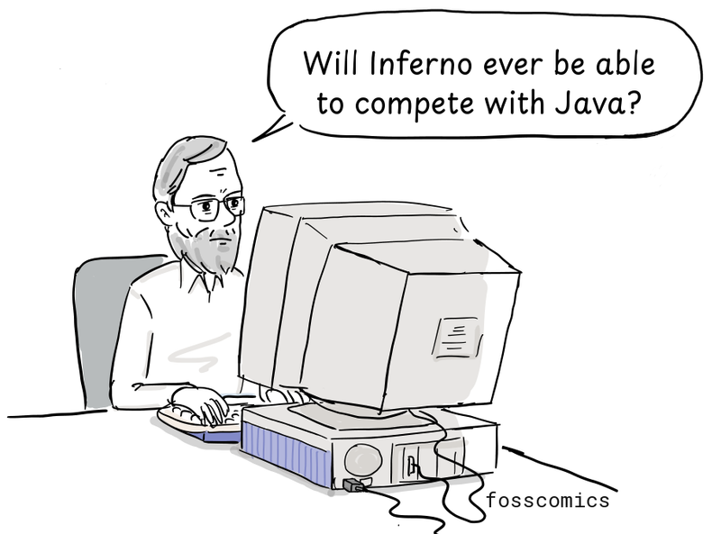

> Can Inferno really compete with Java?

:::

:::panel style="margin-top: 5rem;margin-bottom: 5rem;"

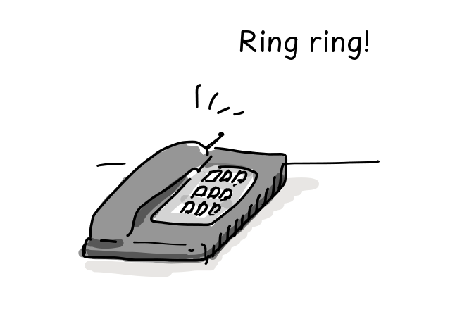

> Ring ring!

:::

:::panel rounded="true"

Ritchie and Ken Thompson were named recipients of the 1998 National Medal of Technology and received their medals at the White House in April 1999.[&lbrack;11&rbrack;][11]

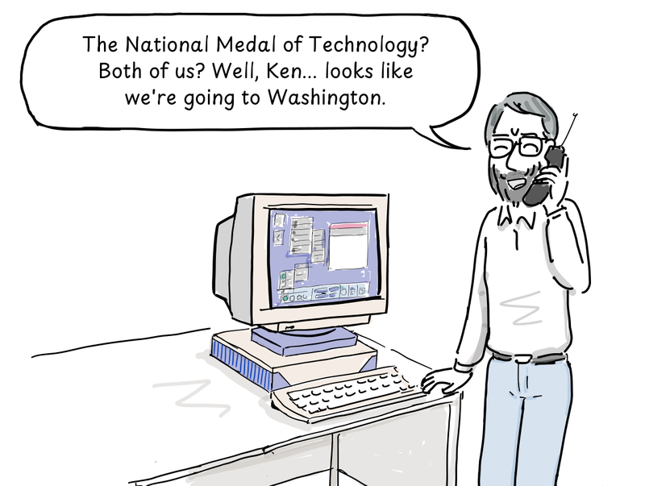

> The National Medal of Technology? Both of us? Well, Ken... looks like we're going to Washington.

:::

::::panels columns="2" label=""

:::panel rounded="true"

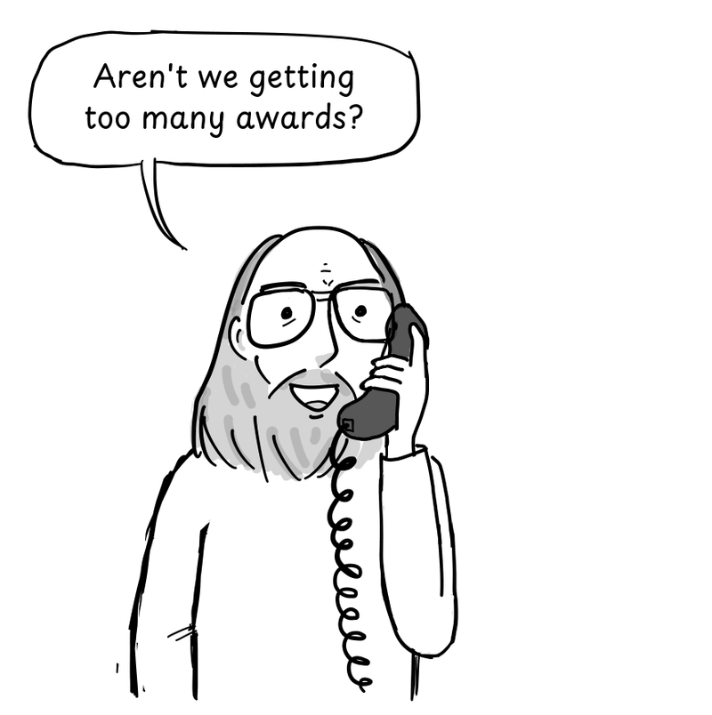

> Aren't we getting too many awards?

:::

:::panel rounded="true"

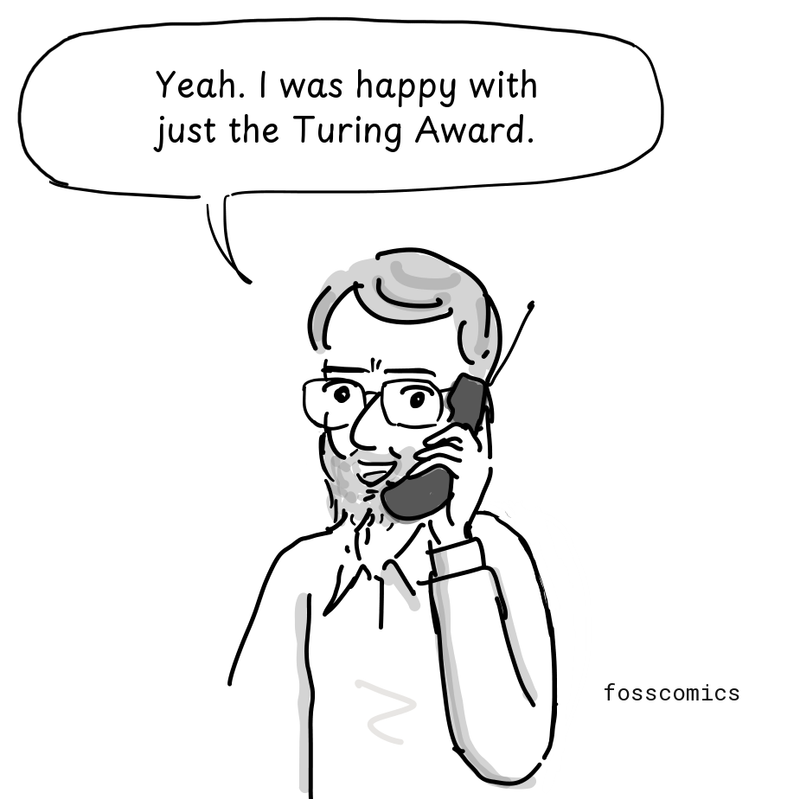

> Yeah. I was happy with just the Turing Award.

:::

::::

:::panel rounded="true"

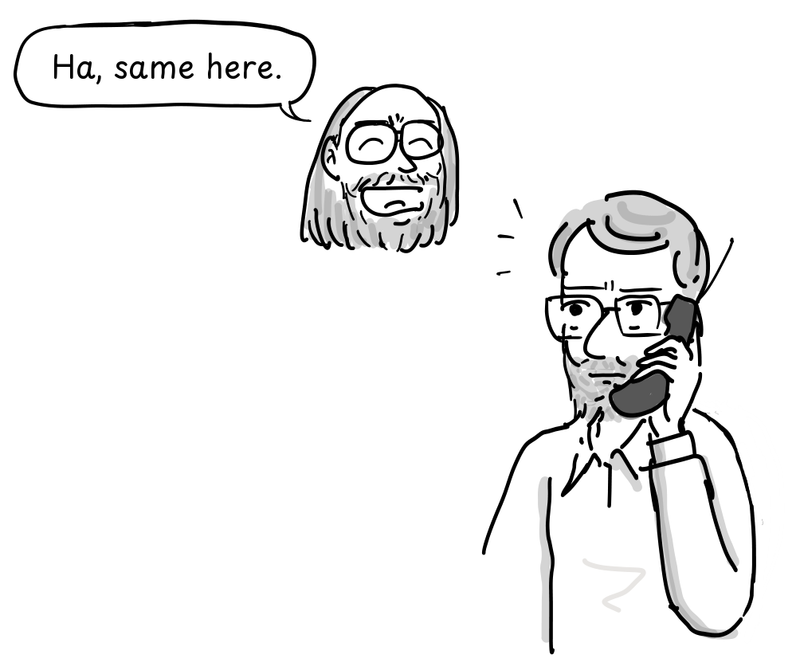

> Ha, same here.

:::

## His father and Bell Labs

:::panel

In the 1940s, Dennis Ritchie’s father, Alistair E. Ritchie, studied switching circuit theory at Bell Labs.[&lbrack;2&rbrack;][2] Automatic telephone exchanges were already in use, but many calls still needed an operator to connect them.[&lbrack;12&rbrack;][12] Bell Labs, the Bell System's research organization, continued developing automatic switching technology in the postwar years.[&lbrack;13&rbrack;][13]

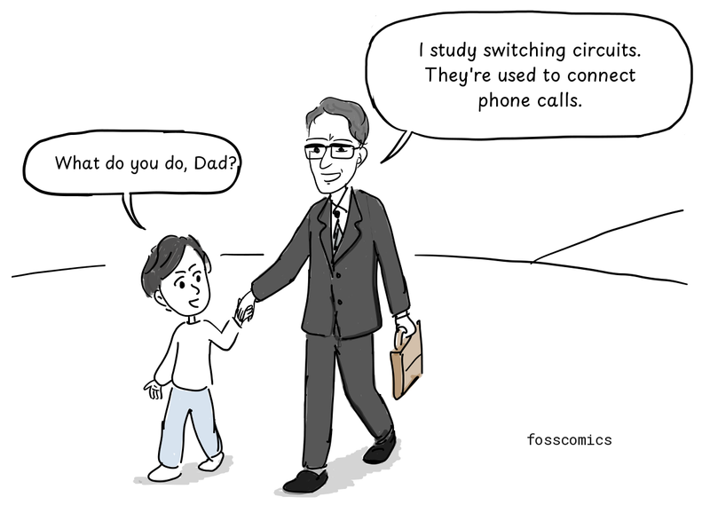

> What do you do, Dad?\
> I work on switching circuits. They help connect phone calls.

:::

:::panel style="margin-top: 5rem;margin-bottom: 5rem;"

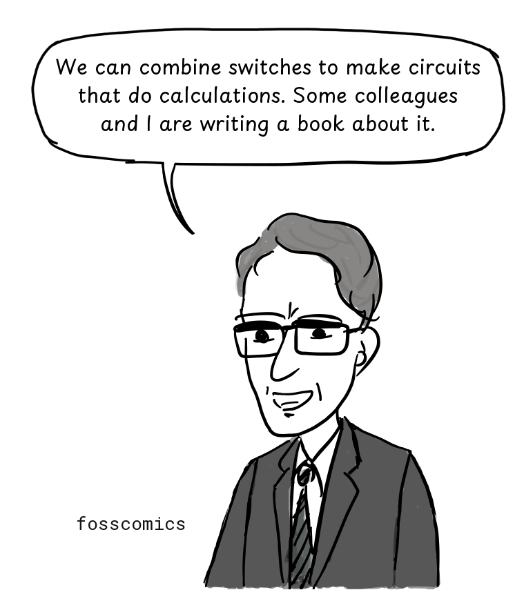

> We can combine switches to make circuits that do calculations. Some colleagues and I are writing a book about it.

:::

## Discovering computers at Harvard

:::panel

A decade or so later.

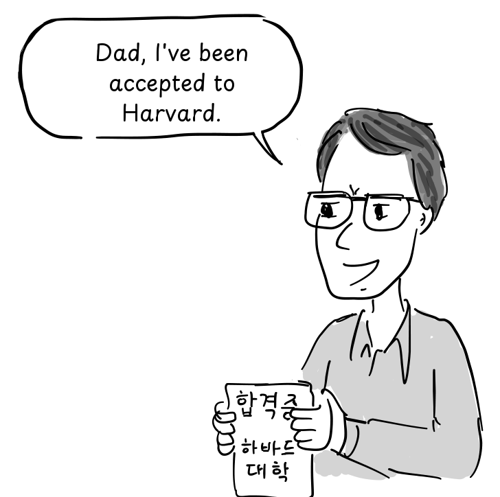

> Dad, I've been accepted to Harvard.

:::

:::panel style="margin-top: 5rem;margin-bottom: 5rem;"

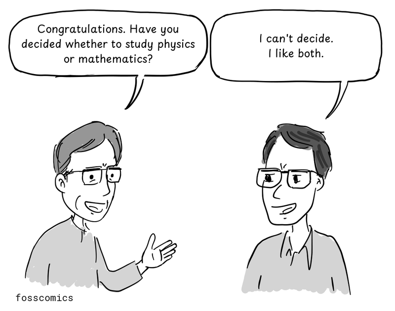

> Congratulations. Have you decided whether to study physics or mathematics?\
> I can't decide. I like both.

:::

:::panel style="margin-bottom: 5rem;"

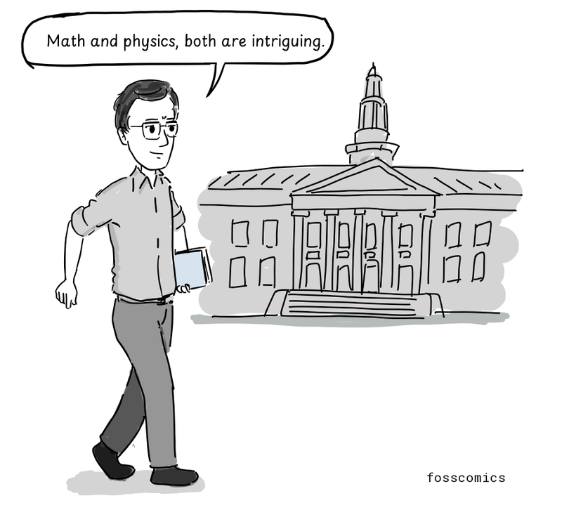

> Math or physics... Why do I have to choose?

:::

::::panels columns="2" label="An introductory computing course and Dennis's idea"

:::panel rounded="true"

Around 1960.

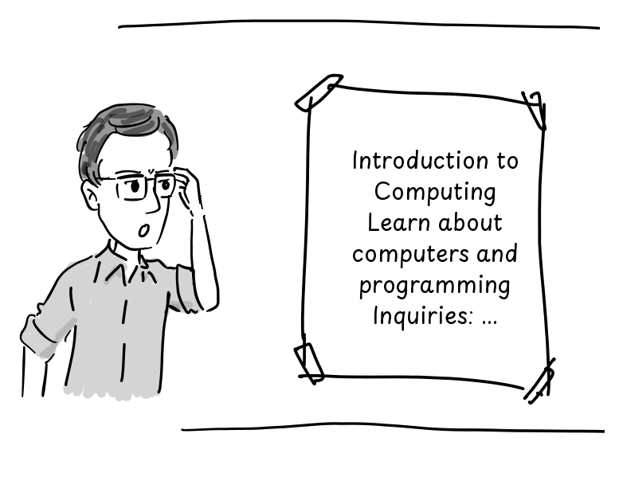

> Introduction to Computing Learn about computers and programming Inquiries: ...

:::

:::panel rounded="true"

> Wait... I could make the computer do the calculations.

:::

::::

:::panel rounded="true"

A talk about computers caught Ritchie’s interest, and he took an introductory course. After learning about analog computers and punched-card equipment, his class wrote a program to run on a UNIVAC I.[&lbrack;3&rbrack;][3]

:::

:::panel style="margin-top: 5rem;"

Although his undergraduate major was physics, Ritchie grew increasingly interested in both the theory and practice of computing.[&lbrack;3&rbrack;][3]

:::

:::panel style="margin-top: 5rem;margin-bottom: 5rem;"

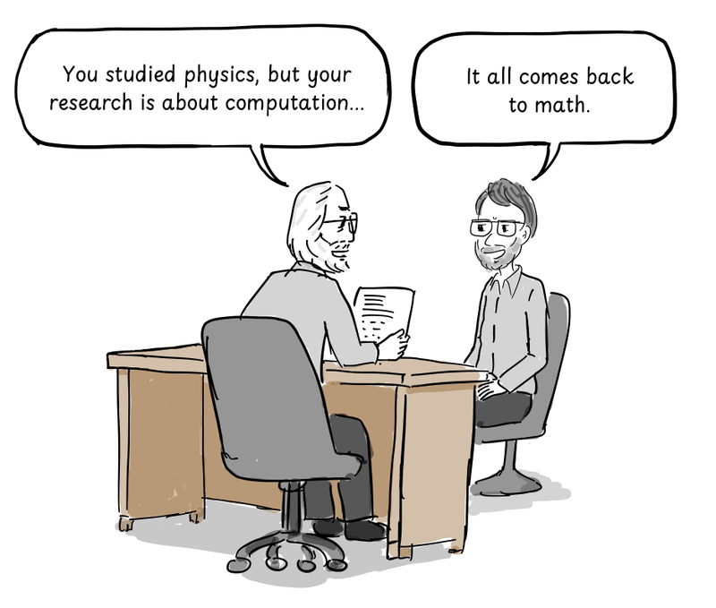

> You studied physics, but your research is about computation...\
> It all comes back to math.

:::

:::panel rounded="true"

His graduate thesis concerned hierarchies of recursive functions, a topic now associated with computer science. He studied it as a graduate student in applied mathematics, while computer science was still emerging as a distinct discipline.[&lbrack;2&rbrack;][2][&lbrack;3&rbrack;][3]

:::

:::panel style="margin-top: 2rem;margin-bottom: 5rem;"

Ritchie was also interested in the practical side of computing. For three years, he taught as a teaching assistant in the introductory course he had taken. By then, the course used an IBM 7094.[&lbrack;3&rbrack;][3]

:::

## Bell Labs and the birth of Unix

:::panel

In 1967, Ritchie joined Bell Labs.[&lbrack;2&rbrack;][2]

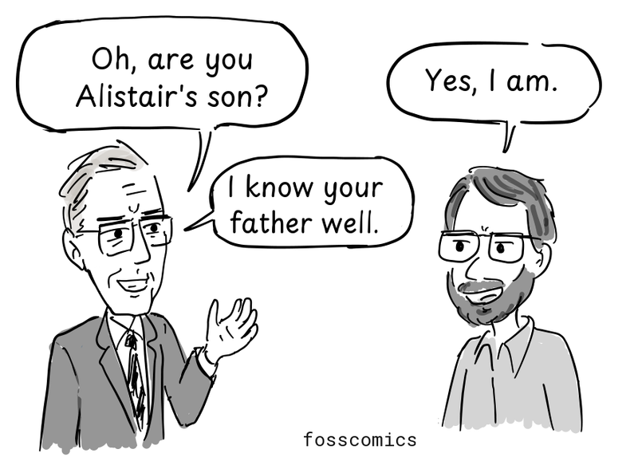

> Oh, are you Alistair's son?\
> Yes, I am.\
> I know your father well.

:::

:::panel style="margin-top: 5rem;margin-bottom: 5rem;"

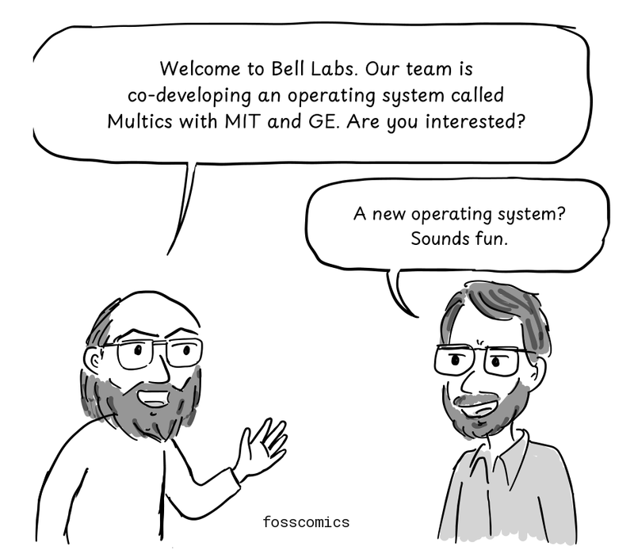

> Welcome to Bell Labs. We're building an operating system called Multics with MIT and GE. Interested?\
> A new operating system? Sounds fun.

:::

:::panel

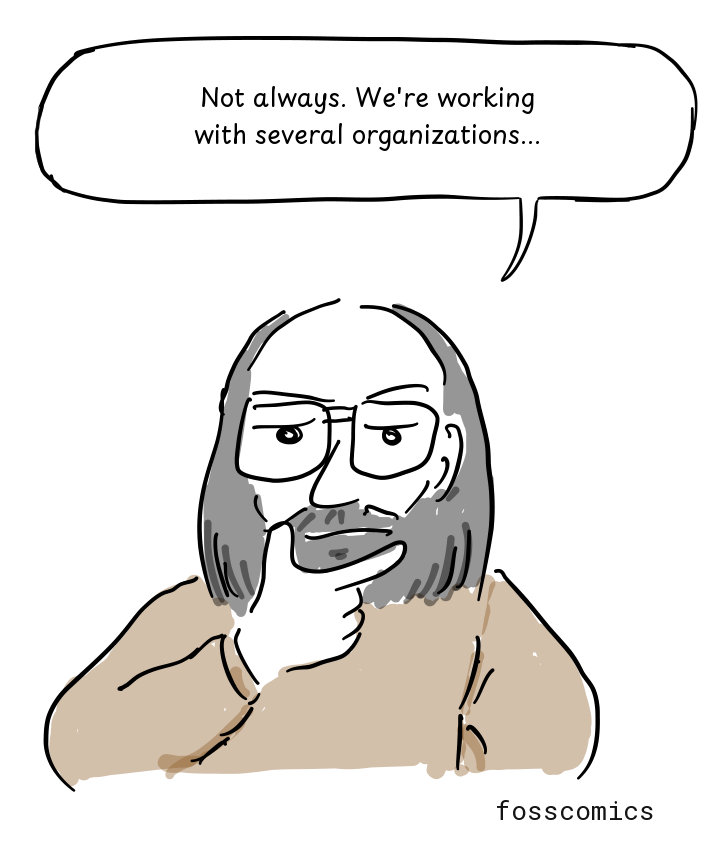

> Well... there are three organizations involved.

:::

:::panel style="margin-top: 5rem;margin-bottom: 5rem;"

In 1969, Bell Labs withdrew from the Multics project.[&lbrack;2&rbrack;][2]

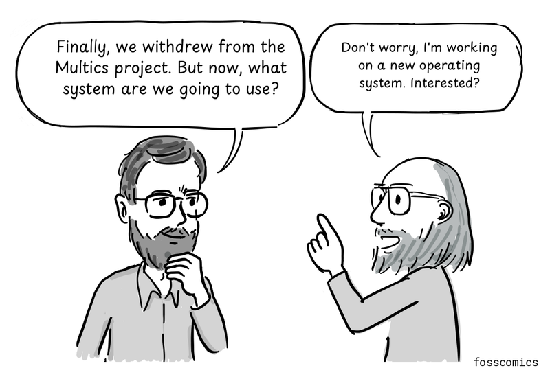

> So we're out of Multics. What do we use now?\
> I'm working on something. A new operating system. Want in?

:::

:::panel style="margin-bottom: 5rem;"

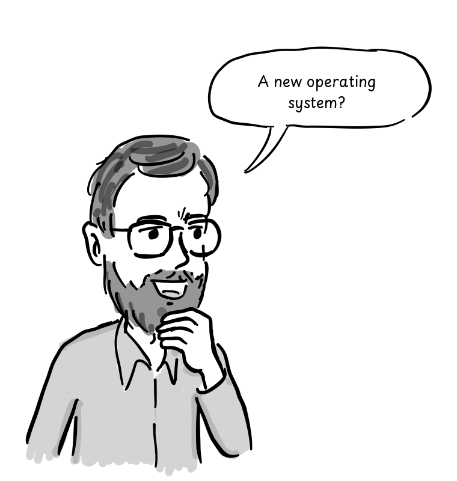

> A new operating system?

:::

:::panel

Ken Thompson was building a new operating system that drew on some ideas from Multics. Ritchie and their colleagues joined the effort, and the system became Unix.[&lbrack;2&rbrack;][2][&lbrack;4&rbrack;][4]

:::

## From B to C

:::panel

Bell Labs, around 1972.

During Unix development, the team moved from the PDP-7 to the PDP-11. Their incompatible instruction sets meant rewriting the assembly code. Ritchie tried to implement Unix in Thompson's B language, but B had limitations on the PDP-11.[&lbrack;4&rbrack;][4]

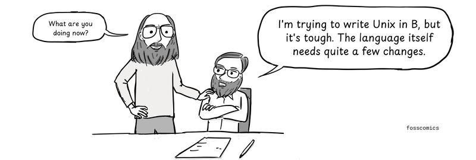

> How's the Unix rewrite going?\
> I think B needs some work.

:::

:::panel rounded="true"

B could not fully use the PDP-11's features. Ritchie added types and reworked the compiler, creating C. In the summer of 1973, the Unix kernel was rewritten in C.[&lbrack;4&rbrack;][4]

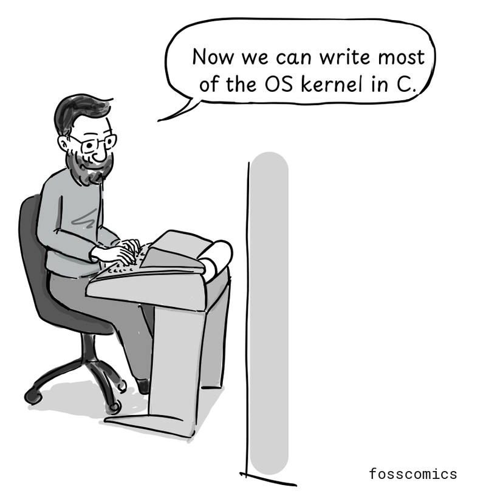

> Heh. Barely need assembly anymore.

:::

:::panel style="margin-top: 5rem;margin-bottom: 5rem;"

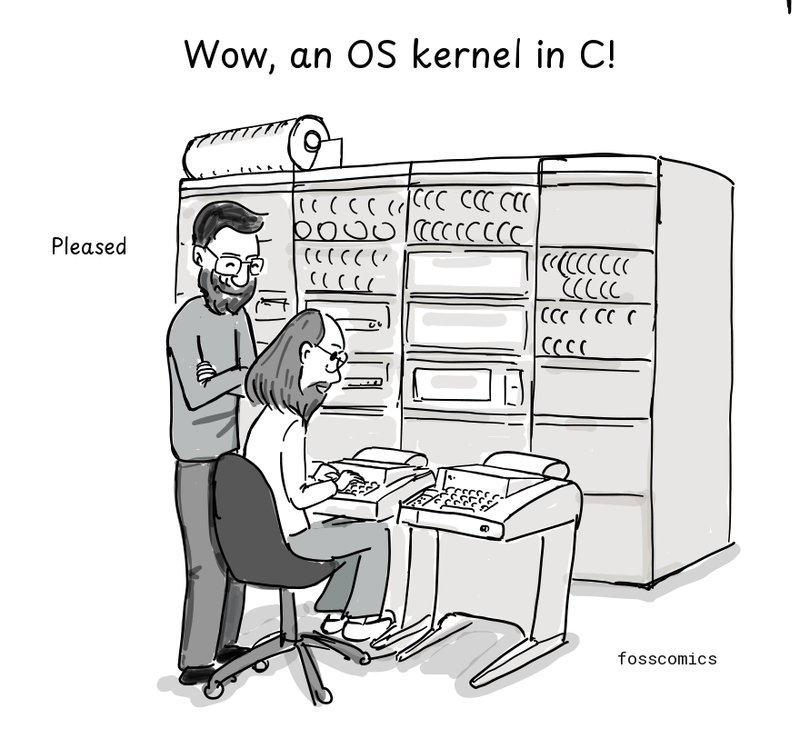

> Wow! C is awesome!\

:::

:::panel rounded="true" style="margin-bottom: 5rem;"

Unix and C spread from Bell Labs to universities and other institutions. Later, companies such as HP and Sun Microsystems built their own operating systems based on Unix code, helping make Unix a major industry standard.

:::

## Learning C through a book

:::panel

Brian Kernighan, who worked at Bell Labs, wrote a B tutorial for in-house training. After C was developed, he wrote a C tutorial too. It later became the basis for a book.[&lbrack;1&rbrack;][1]

:::

:::panel style="margin-top: 5rem;margin-bottom: 5rem;"

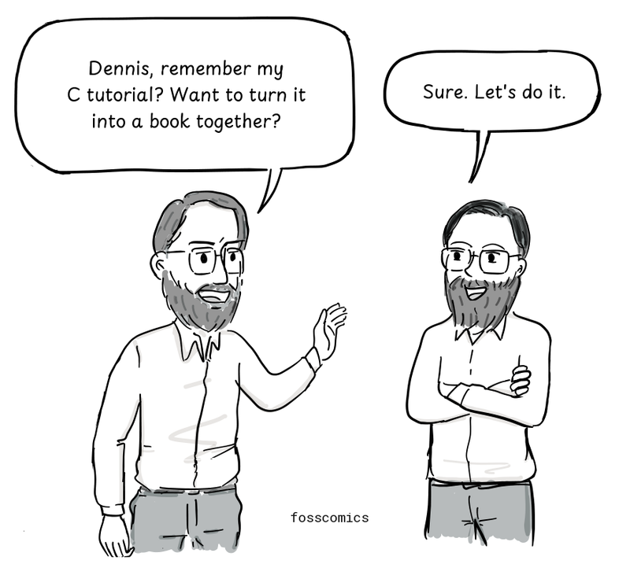

> Dennis, remember my C tutorial? Want to turn it into a book together?\
> Sure. Let's do it.

:::

:::panel rounded="true" style="margin-bottom: 5rem;"

The C Programming Language was first published in 1978, with a second edition following in 1988. Translated into many languages, it became widely read by people learning C.[&lbrack;4&rbrack;][4][&lbrack;5&rbrack;][5]

Second-edition cover. Image source: [Wikipedia](https://en.wikipedia.org/wiki/The_C_Programming_Language#/media/File:The_C_Programming_Language_cover.svg).

:::

## Beyond Unix: Plan 9

:::panel style="margin-top: 3rem;margin-bottom: 5rem;"

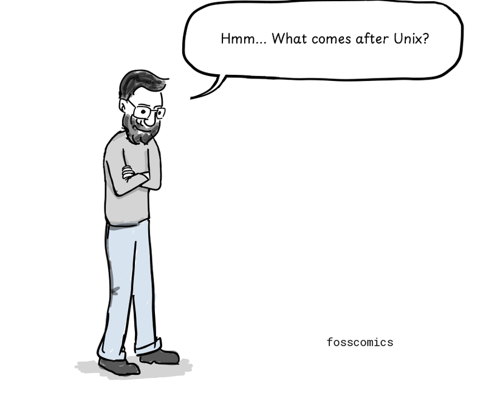

> Hmm... What comes after Unix?

:::

:::panel rounded="true"

Bell Labs began developing an operating system called Plan 9 in the late 1980s as a successor to Unix. This research system rethought how computers could share resources.[&lbrack;6&rbrack;][6]

:::

:::panel style="margin-top: 3rem;margin-bottom: 5rem;"

As the research group’s leader, Ritchie mainly managed and advised the team. He joked that his contribution was signing paychecks, though he also admitted to writing a little code himself.[&lbrack;1&rbrack;][1]

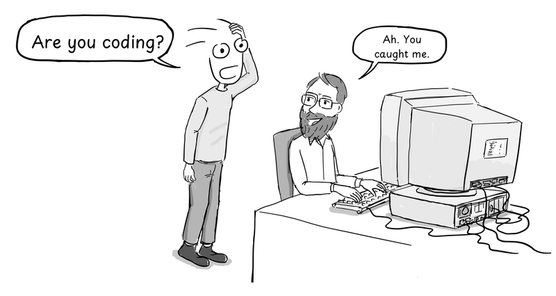

> Are you coding?\
> Ah. You caught me.

:::

:::panel

Plan 9 was used inside Bell Labs, but finding outside customers was difficult. It did not widely replace Unix.

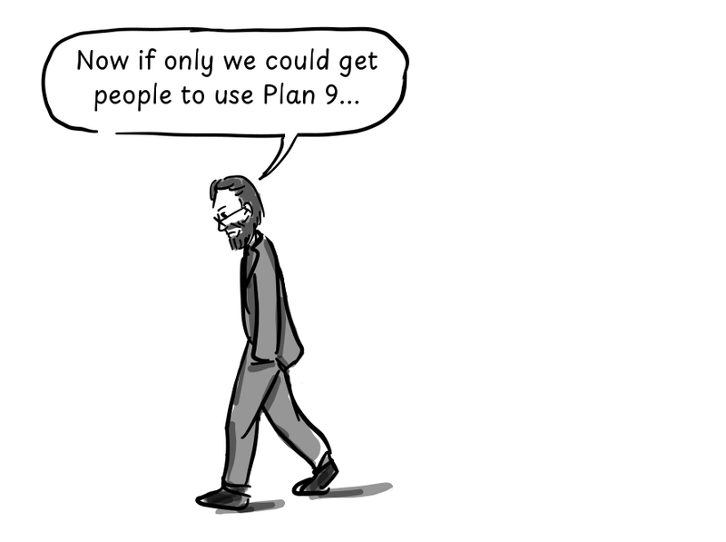

> Now if only we could get people to use Plan 9...

:::

## Inferno and the ideas that lived on

:::panel

In the 1990s, Bell Labs began developing Inferno and the Limbo programming language for a wide range of devices and networks. Limbo programs ran on the Dis virtual machine, making them less dependent on particular hardware.[&lbrack;7&rbrack;][7][&lbrack;8&rbrack;][8]

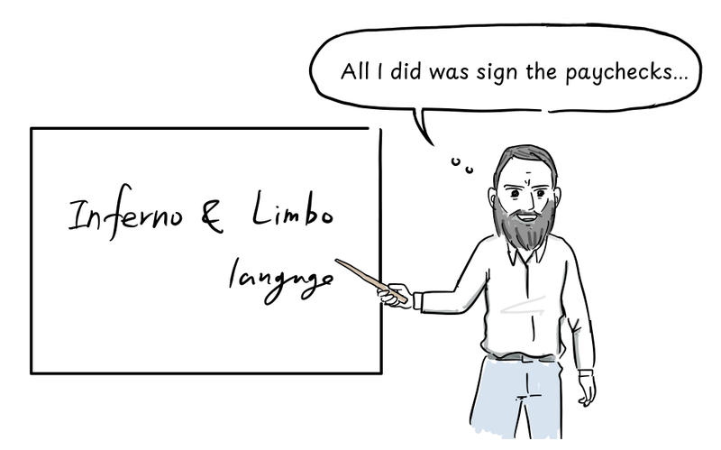

> All I did was sign the paychecks...

:::

:::panel style="margin-top: 5rem;margin-bottom: 5rem;"

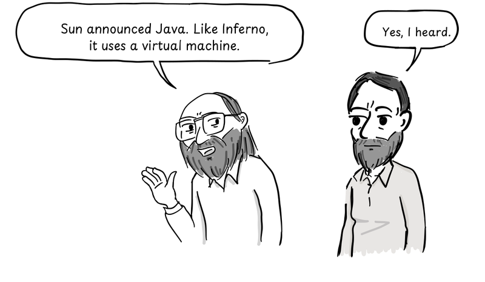

> Sun announced Java. Like Inferno, it uses a virtual machine.\
> Yes, I heard.

:::

:::panel

Although Ritchie contributed to and advised on their development, Plan 9 and Inferno did not spread as widely as Unix. Vita Nuova later continued Inferno’s development and distribution.[&lbrack;1&rbrack;][1][&lbrack;8&rbrack;][8]

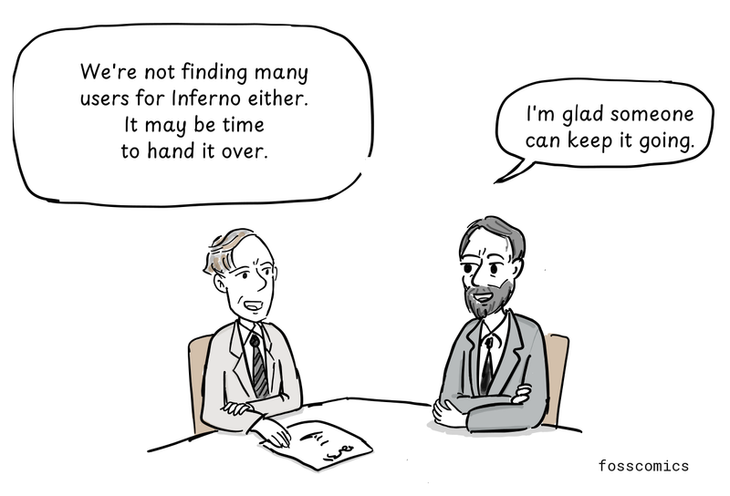

> We're not finding many users for Inferno either. It may be time to hand it over.\
> I'm glad someone can keep it going.

:::

:::panel style="margin-top: 5rem;margin-bottom: 5rem;"

There were various obstacles, including marketing difficulties. Eric Raymond pointed to another in The Art of Unix Programming: users already had a usable system in Unix.[&lbrack;9&rbrack;][9]

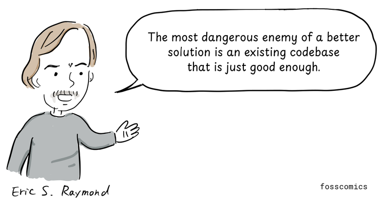

> The most dangerous enemy of a better solution is an existing codebase that is just good enough.

:::

:::panel rounded="true" style="margin-bottom: 5rem;"

Some ideas from Plan 9 influenced other systems. UTF-8, implemented in Plan 9 by Ken Thompson and Rob Pike, is one example.[&lbrack;10&rbrack;][10] The system itself did not become widespread, but its ideas lived on.

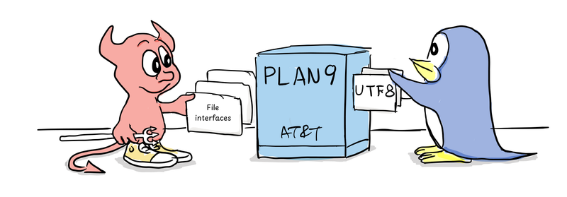

> File interfaces

:::

## Life after retirement in 2007

:::panel style="margin-top: 5rem;"

:::

:::panel style="margin-top: 5rem;margin-bottom: 5rem;"

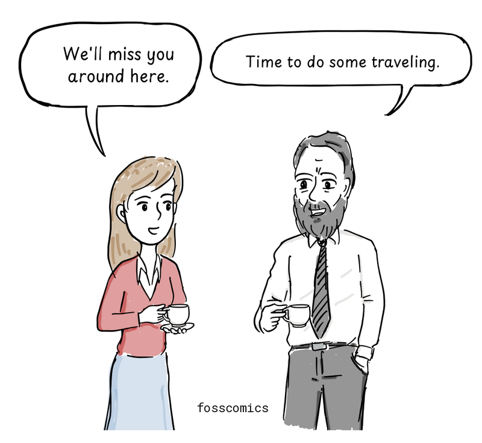

> We'll miss you around here.\
> Time to do some traveling.

:::

:::panel

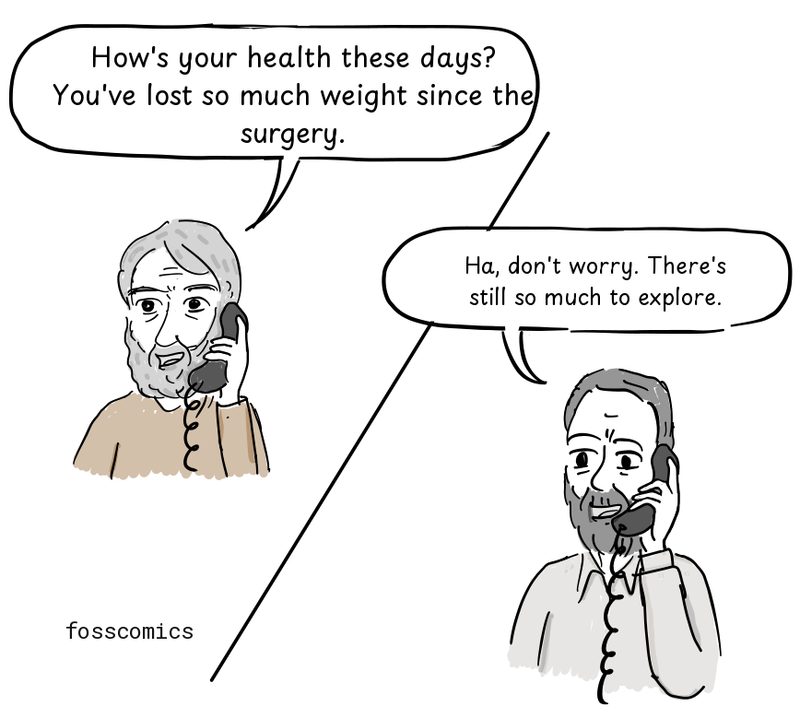

> How are you feeling? You've lost a lot of weight since the surgery.\
> I'm doing all right. Don't worry about me.

:::

:::panel style="margin-top: 5rem;margin-bottom: 5rem;"

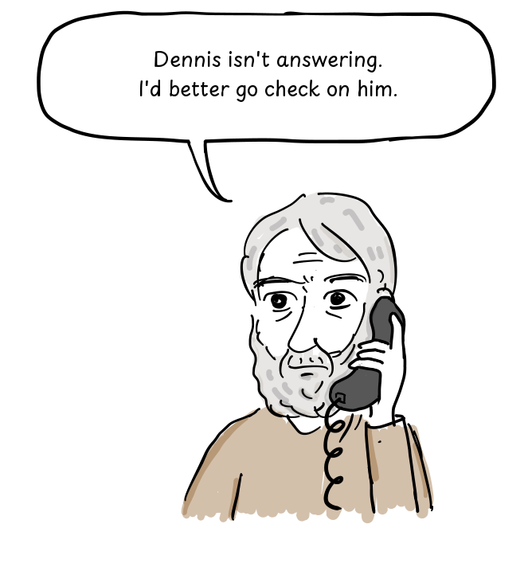

> Dennis isn't answering. I'd better go check on him.

:::

## A quiet farewell in October 2011

:::panel

Dennis Ritchie died at his home in New Jersey in October 2011.[&lbrack;1&rbrack;][1]

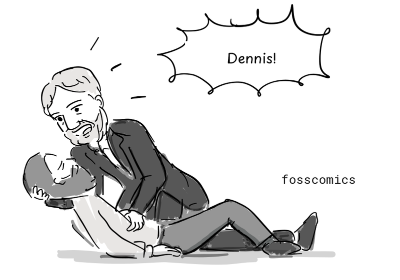

> Dennis!

:::

:::panel style="margin-top: 5rem;margin-bottom: 5rem;"

:::

:::panel

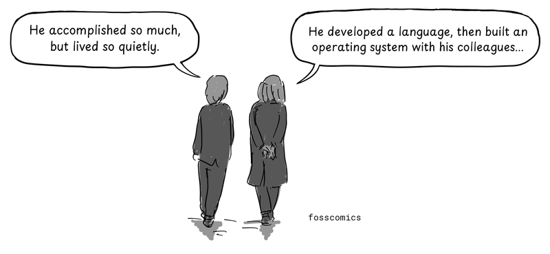

> He accomplished so much, but lived so quietly.\
> Unix, C... His work is still everywhere.

:::

:::panel rounded="true" style="margin-top: 5rem;margin-bottom: 5rem;"

:::

**End**

The dialogue is dramatized from historical sources, not a record of actual conversations. The discovery and funeral scenes are imagined, not eyewitness reconstructions. Please leave a comment if you spot an error.

## References

1. [Dennis M. Ritchie homepage and family memorial](https://www.nokia.com/bell-labs/about/dennis-m-ritchie/)
2. [Dennis M. Ritchie, autobiographical sketch](https://www.nokia.com/bell-labs/about/dennis-m-ritchie/bigbio1st.html)
3. [Interview with Dennis Ritchie (2003)](https://anders.unix.se/2015/10/26/interview-with-dennis-ritchie-2003/)
4. [Dennis M. Ritchie, The Development of the C Language](https://www.nokia.com/bell-labs/about/dennis-m-ritchie/chist.html)
5. [Brian Kernighan, The C Programming Language](https://www.cs.princeton.edu/~bwk/cbook.html)
6. [Plan 9 from Bell Labs: Overview](https://9p.io/plan9/about.html)
7. [Phil Winterbottom and Rob Pike, The Design of the Inferno Virtual Machine](https://www.vitanuova.com/inferno/papers/hotchips.html)
8. [Vita Nuova, Inferno](https://www.vitanuova.com/inferno/)
9. [Eric S. Raymond, The Art of Unix Programming: Plan 9](http://catb.org/~esr/writings/taoup/html/plan9.html)
10. [Rob Pike and Ken Thompson, Hello World](https://9p.io/sys/doc/utf.html)
11. [Dennis M. Ritchie, Letter from Washington](https://www.nokia.com/bell-labs/about/dennis-m-ritchie/medal.html)
12. [David A. Price, Goodbye, Operator](https://www.richmondfed.org/publications/research/econ_focus/2019/q4/economic_history)
13. [Nokia Bell Labs, History](https://www.nokia.com/bell-labs/about/history/)

[1]: https://www.nokia.com/bell-labs/about/dennis-m-ritchie/
[2]: https://www.nokia.com/bell-labs/about/dennis-m-ritchie/bigbio1st.html
[3]: https://anders.unix.se/2015/10/26/interview-with-dennis-ritchie-2003/
[4]: https://www.nokia.com/bell-labs/about/dennis-m-ritchie/chist.html
[5]: https://www.cs.princeton.edu/~bwk/cbook.html
[6]: https://9p.io/plan9/about.html
[7]: https://www.vitanuova.com/inferno/papers/hotchips.html
[8]: https://www.vitanuova.com/inferno/
[9]: http://catb.org/~esr/writings/taoup/html/plan9.html
[10]: https://9p.io/sys/doc/utf.html
[11]: https://www.nokia.com/bell-labs/about/dennis-m-ritchie/medal.html
[12]: https://www.richmondfed.org/publications/research/econ_focus/2019/q4/economic_history
[13]: https://www.nokia.com/bell-labs/about/history/
