**1973년 SOSP(Symposium of Operating Systems Principles) 컨퍼런스**

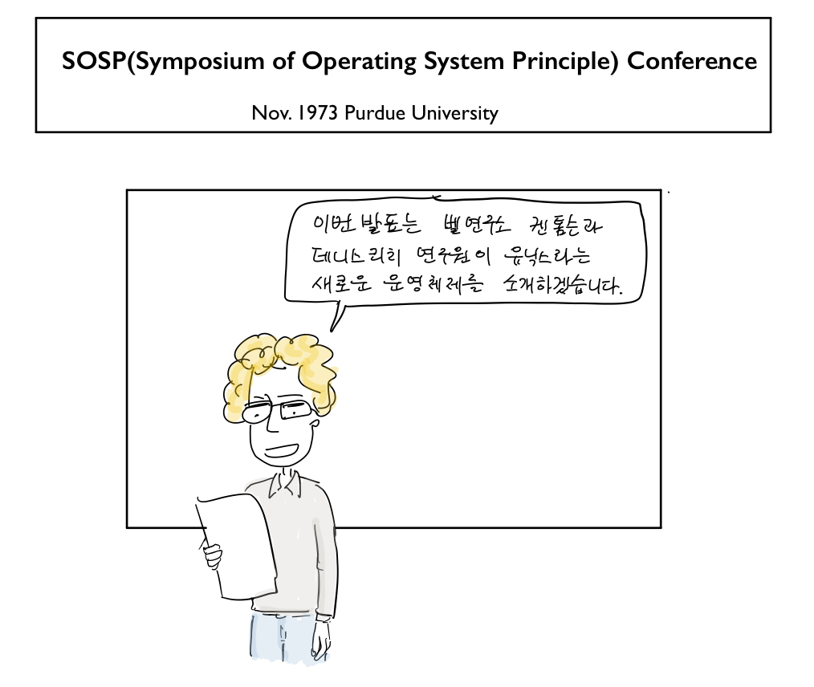

“이번 발표는 벨 연구소 켄 톰슨과 데니스 리치 연구원이 유닉스라는 새로운 운영체제를 소개하겠습니다.”

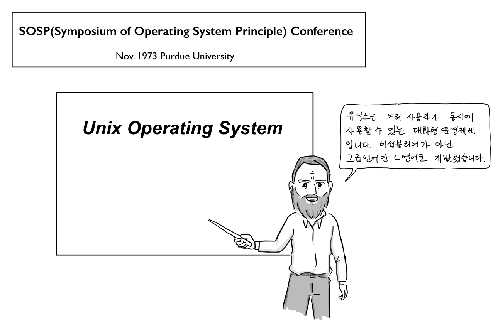

“유닉스는 여러 사용자가 동시에서 사용할 수 있는 대화형 운영체제입니다. 어셈블리어가 아닌 고급언어인 C언어로 개발했습니다.”

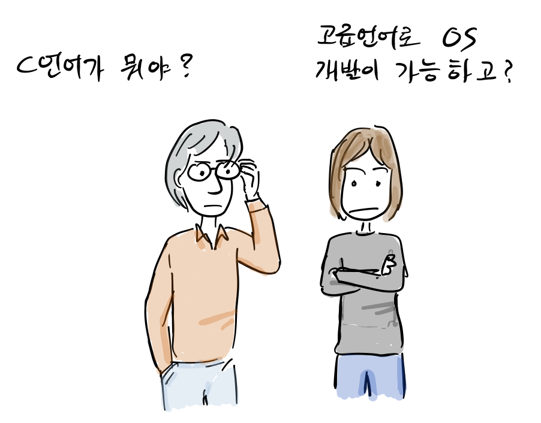

“C언어가 뭐야?”, “고급 언어로 OS개발이 가능하다고?”

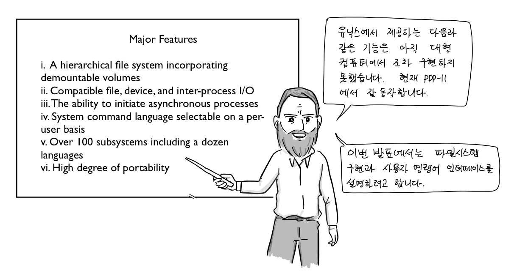

Major Features

i. A hierarchical file system incorporating demountable volumes  
ii. Compatible file, device, and inter-process I/O  
iii. The ability to initiate asynchronous processes  
iv. System command language selectable on a per-user basis  
v Over 100 subsystems including a dozen languages  
vi. High degree of portability

“유닉스에서 제공하는 다음과 같은 기능은 아직 대형 컴퓨터에서 조차 구현하지 못했습니다. 현재, PDP-11에서 잘 동작하고 있습니다. 이번 발표에서는 파일시스템 구현과 사용자 명령어 인터페이스를 설명하려고 합니다.”

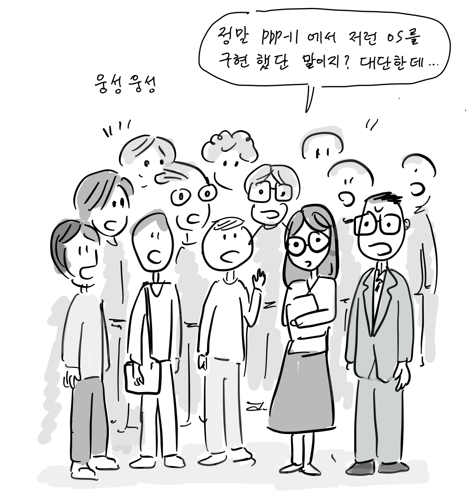

참석자들: “웅성 웅성.. 정말 PDP-11에 저런 OS를 구현했단 말이지? 대단한데..”

발표가 끝나자,

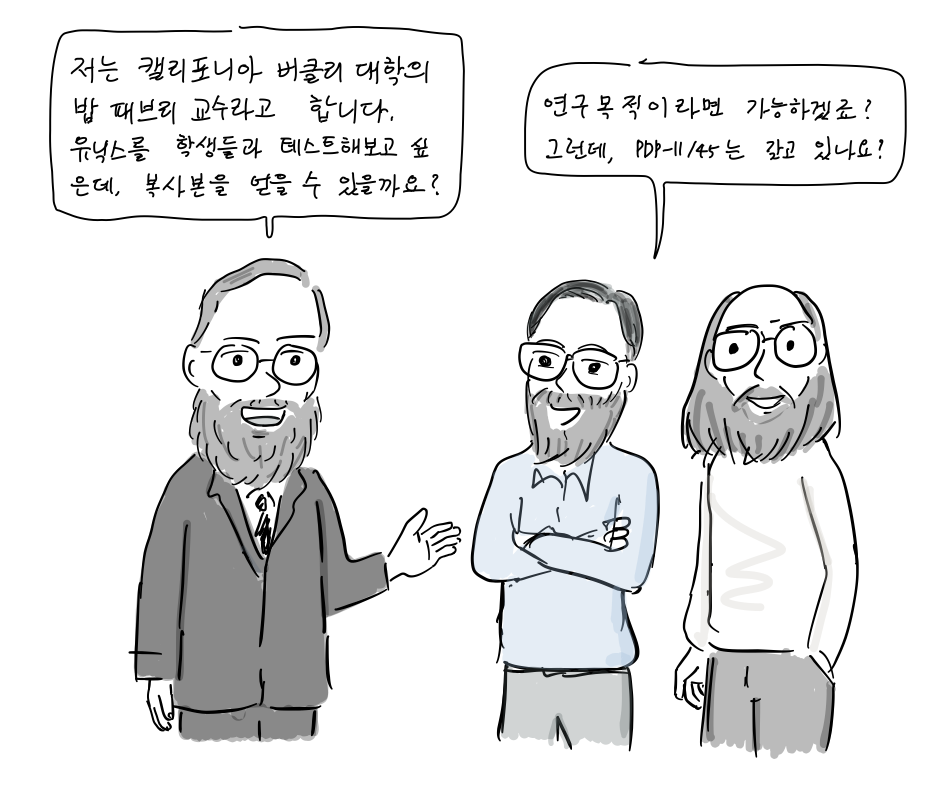

밥 패브리: “저는 캘리포니아 버클리 대학 밥 패브리 교수입니다. 유닉스를 저희 대학에서 테스트해보고 싶은데, 복사본을 얻을 수 있을까요?”  
켄 & 데니스: “연구 목적이라면 가능하겠죠? 그런데, PDP-11/45을 갖고 있나요?”

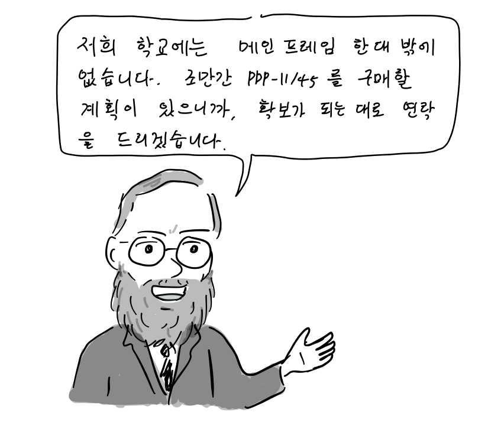

밥 패브리: “저희 학교에는 메인 프레임 한대밖에 없습니다. 조만간 구매할 계획이 있으니 확보가 되는 대로 다시 연락을 드리겠습니다.”

1974년 1월, 유닉스 버전4가 담긴 테이프가 버클리 대학에 도착한다.

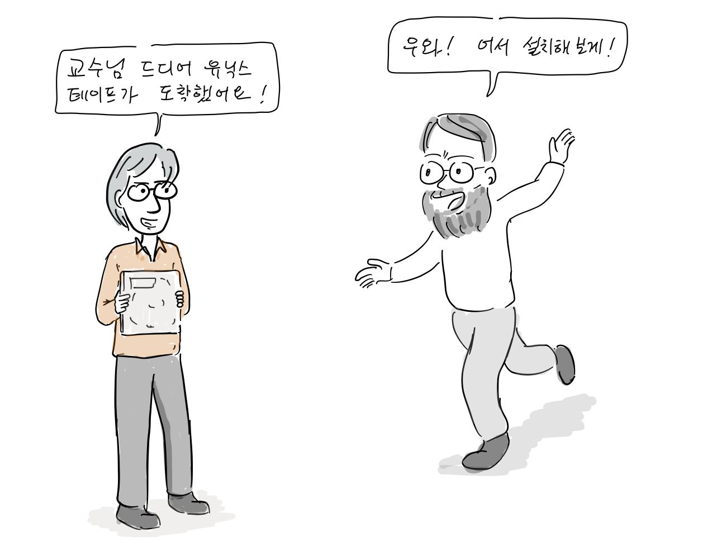

대학원생: “교수님, 유닉스 테이프가 도착했어요.”  
밥 패브리 교수: “어서 설치해 보게.”

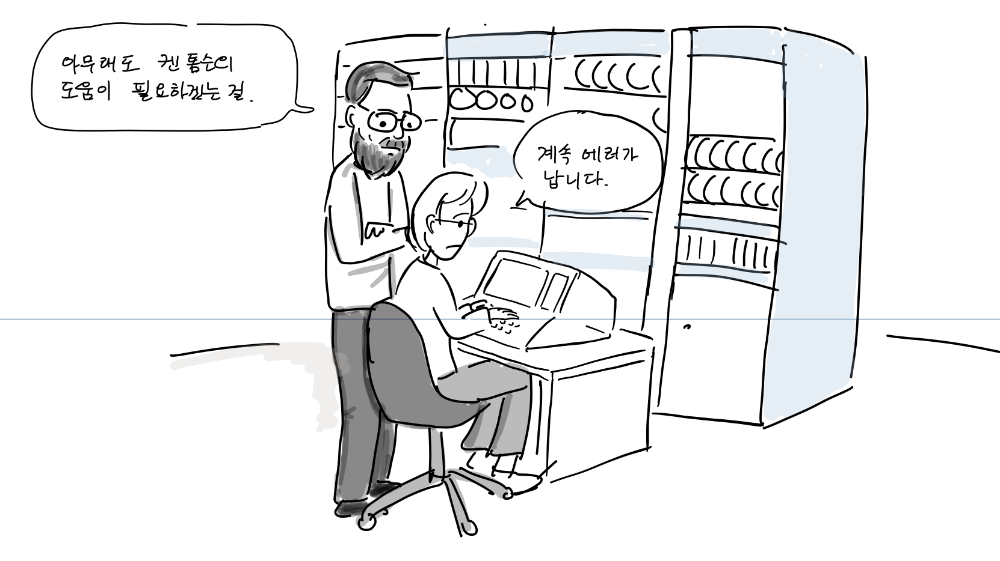대학원생: “계속 에러가 납니다”  
밥 패브리 교수: 아무래도 켄 톰슨의 도움이 필요하겠는걸”

켄 톰슨은 모뎀을 이용해서 원격으로 유닉스 디버깅을 돕는다. 당시 버클리 대학에 설치된 PDP-11/45에는 하나의 디스크 컨트롤러에 두개의 디스크가 동시에 연결되어 있었는데, 유닉스가 이를 지원하도록 하였다.

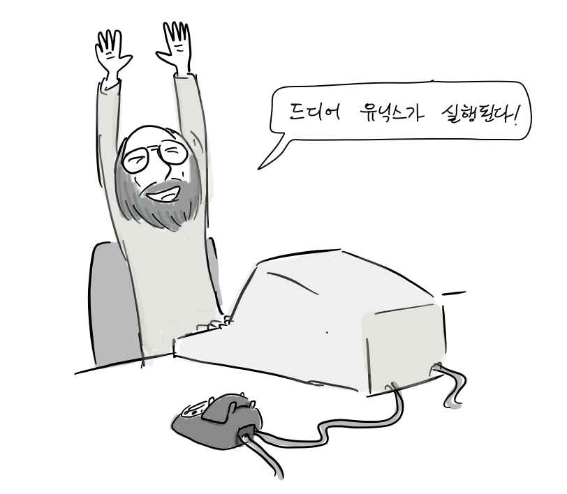

“드디어 유닉스가 실행된다!”

버클리 대학에 설치된 유닉스는 전산과 학생들에게 인기가 많았지만, 수학과 통계학과 학생들과 함께 사용해야했기 때문에 사용 시간이 늘 부족했다.

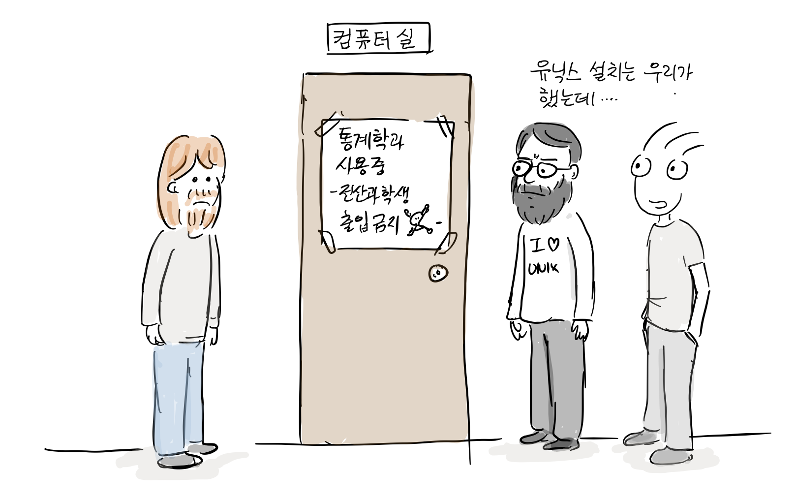

결국, 1975년 새롭게 출시된 PDP-11/70 기종을 구매하게 된다.

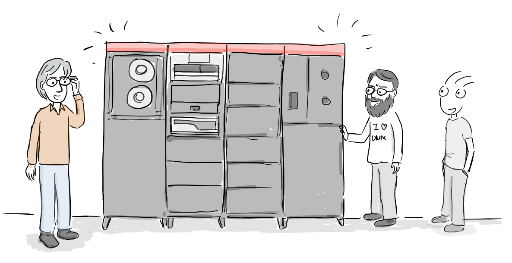

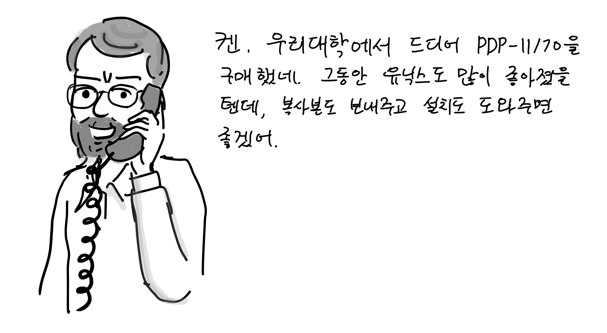

교수: “켄, 우리 대학에서 드디어 PDP-11/70을 구매했네, 그동안 유닉스도 새로운 버전이 나왔을 텐데, 복사본도 보내주고 지난번 처럼 설치도 도와주면 좋겠어.”

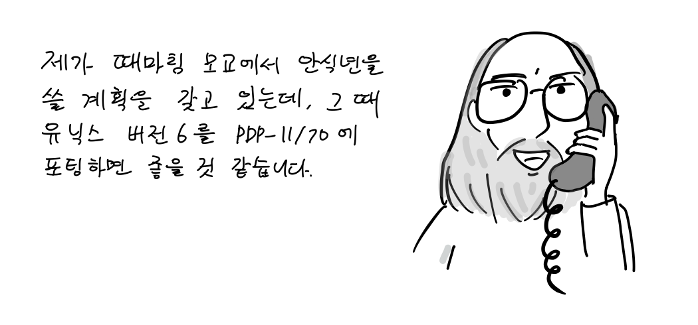

켄 톰슨: “제가 때마침 모교에서 안식년을 쓸 계획을 갖고 있는데, 그 때 유닉스 버전6를 PDP-11/70에 포팅하면 좋을 것 같습니다.”

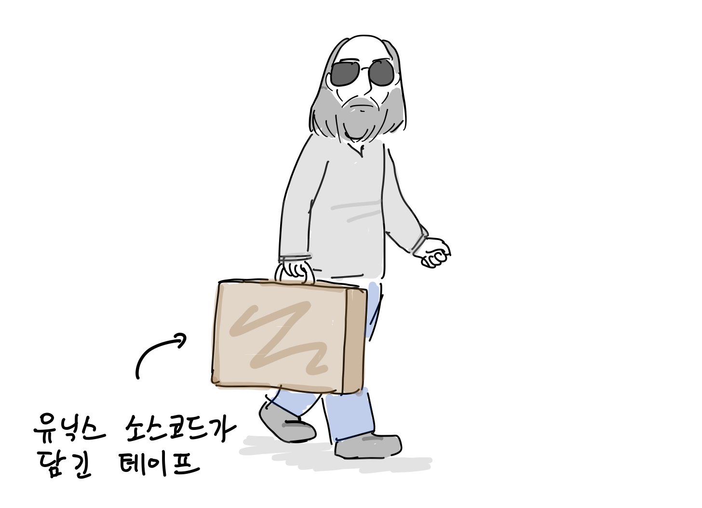

켄 톰슨은 1966년 버클리대학에서 전기공학 학위를 받았는데, 1975년 모교에서 방문 교수로 안식년을 보내기로 한다. 이때, 최신 기기인 PDP-11/70에 유닉스 버전6를 포팅하였고, 이것이 훗날 BSD 유닉스로 발전하게 된다. ([2편에서 계속…](http://joone.net/2017/12/23/11-%EC%9E%90%EC%9C%A0%EB%A1%9C%EC%9D%98-%ED%88%AC%EC%9F%81-bsd-%EC%9C%A0%EB%8B%89%EC%8A%A4-2%ED%99%94/))

참고 문헌

-   D. M. Ritchie and K. Thompson, [The UNIX Time-Sharing System](http://cm.bell-labs.co/who/dmr/cacm.pdf), 1974
-   ANDREW LEONARD, [BSD Unix: Power to the people, from the code](https://www.salon.com/2000/05/16/chapter_2_part_one/), 2000
-   마샬 커크 맥퀴식, [버클리 유닉스의 20년, 오픈소스 혁명의 목소리, 한빛출판사](http://www.hanbit.co.kr/store/books/look.php?p_code=E5329835060), 2013

참고로, 이번 만화는 버클리 유닉스의 20년 내용을 기반으로 작성하였습니다.
