:::panel

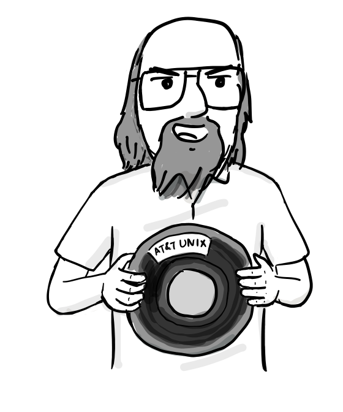

:::

:::panel rounded="true" style="border-width: 3px;border-color: black;"

1973년, SOSP(Symposium on Operating Systems Principles) 학술대회. 켄 톰슨과 데니스 리치가 유닉스를 소개한다.[&lbrack;1&rbrack;][1]

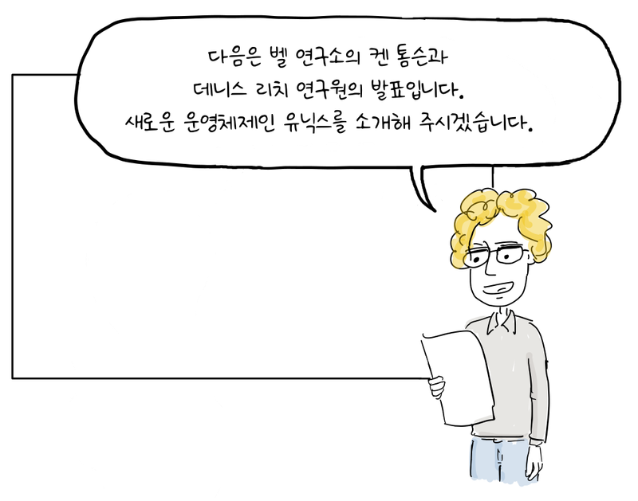

> 다음은 벨 연구소의 켄 톰슨과 데니스 리치 연구원의 발표입니다. 새로운 운영체제인 유닉스를 소개해 주시겠습니다.

:::

:::panel rounded="true" style="border-width: 3px;border-color: black;"

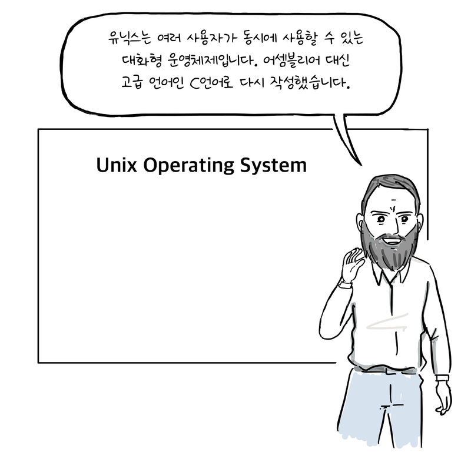

> 유닉스는 여러 사용자가 동시에 사용할 수 있는 대화형 운영체제입니다. 어셈블리어 대신 고급 언어인 C언어로 다시 작성했습니다.

:::

:::panel rounded="true" style="border-width: 3px;border-color: black;"

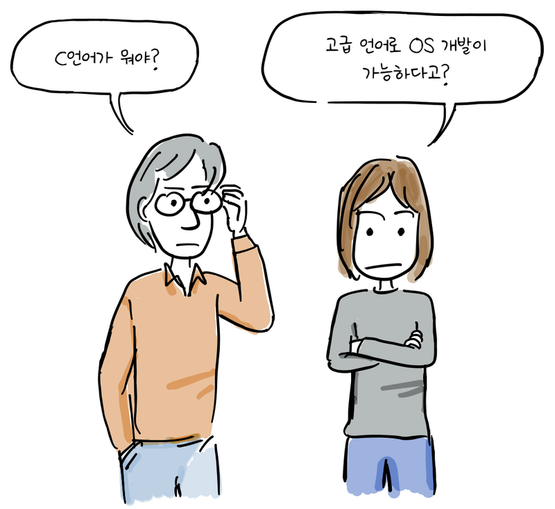

> C언어가 뭐야?\
> 고급 언어로 OS 개발이 가능하다고?

:::

:::panel rounded="true" style="border-width: 3px;border-color: black;padding: 0;"

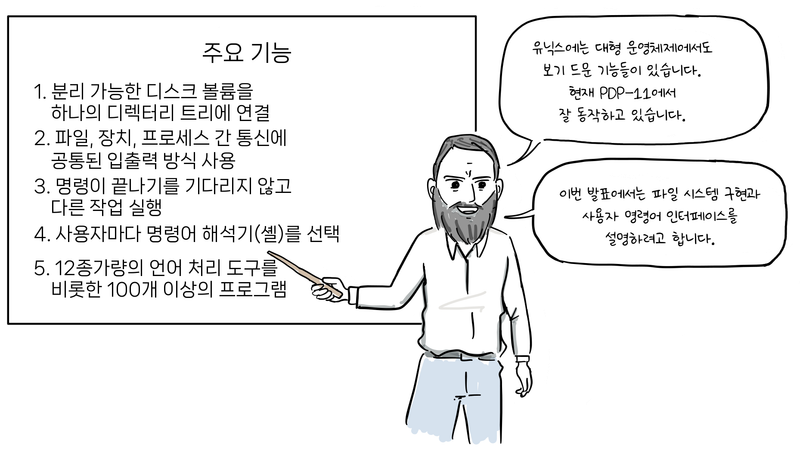

> 유닉스에는 대형 운영체제에서도 보기 드문 기능들이 있습니다. 현재 PDP-11에서 잘 동작하고 있습니다.\
> 이번 발표에서는 파일 시스템 구현과 사용자 명령어 인터페이스를 설명하려고 합니다.
>
> 화면의 주요 기능 목록:
> 1. 분리 가능한 디스크 볼륨을 하나의 디렉터리 트리에 연결
> 2. 파일, 장치, 프로세스 간 통신에 공통된 입출력 방식 사용
> 3. 명령이 끝나기를 기다리지 않고 다른 작업 실행
> 4. 사용자마다 명령어 해석기(셸)를 선택
> 5. 12종가량의 언어 처리 도구를 비롯한 100개 이상의 프로그램

:::

:::panel rounded="true" style="border-width: 3px;border-color: black;"

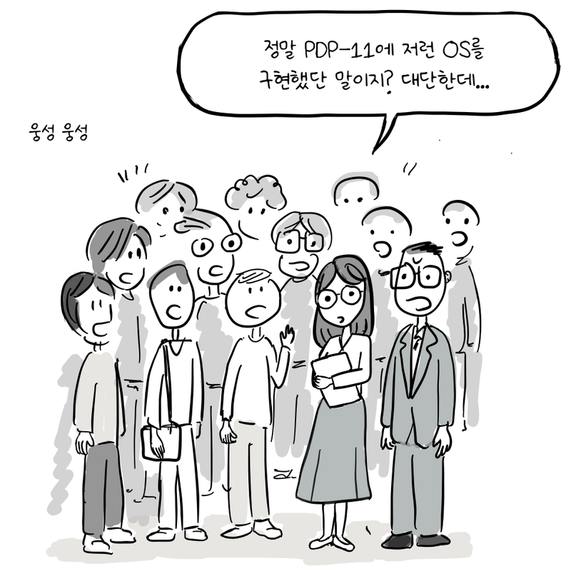

> 웅성 웅성\
> 정말 PDP-11에 저런 OS를 구현했단 말이지? 대단한데...

:::

:::panel rounded="true" style="border-width: 3px;border-color: black;"

발표가 끝나자, 캘리포니아 대학교 버클리의 밥 패브리 교수가 두 사람에게 다가온다.

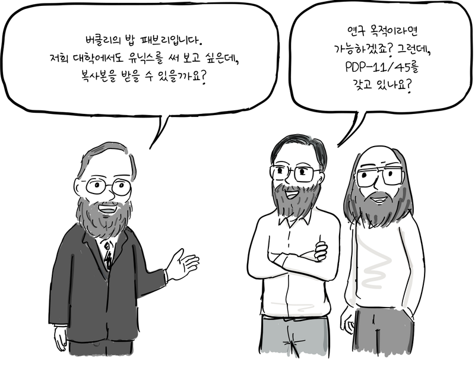

> 버클리의 밥 패브리입니다. 저희 대학에서도 유닉스를 써 보고 싶은데, 복사본을 받을 수 있을까요?\
> 연구 목적이라면 가능하겠죠? 그런데, PDP-11/45를 갖고 있나요?

:::

:::panel rounded="true" style="border-width: 3px;border-color: black;"

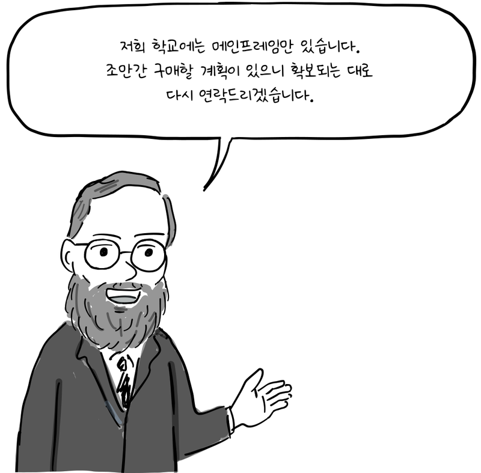

> 저희 학교에는 메인프레임만 있습니다. 조만간 구매할 계획이 있으니 확보되는 대로 다시 연락드리겠습니다.

:::

:::panel rounded="true" style="border-width: 3px;border-color: black;"

버클리의 전산과·수학과·통계학과가 공동으로 PDP-11/45를 구입했다. 1974년 1월, 유닉스 버전 4가 담긴 자기 테이프가 도착했고, 대학원생 키스 스탠디퍼드가 설치를 맡았다.[&lbrack;2&rbrack;][2]

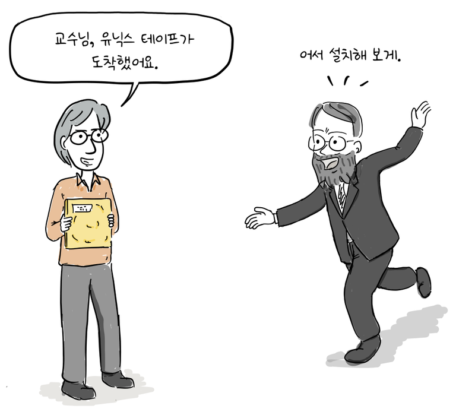

> 교수님, 유닉스 테이프가 도착했어요.\
> 어서 설치해 보게.

:::

:::panel rounded="true" style="border-width: 3px;border-color: black;"

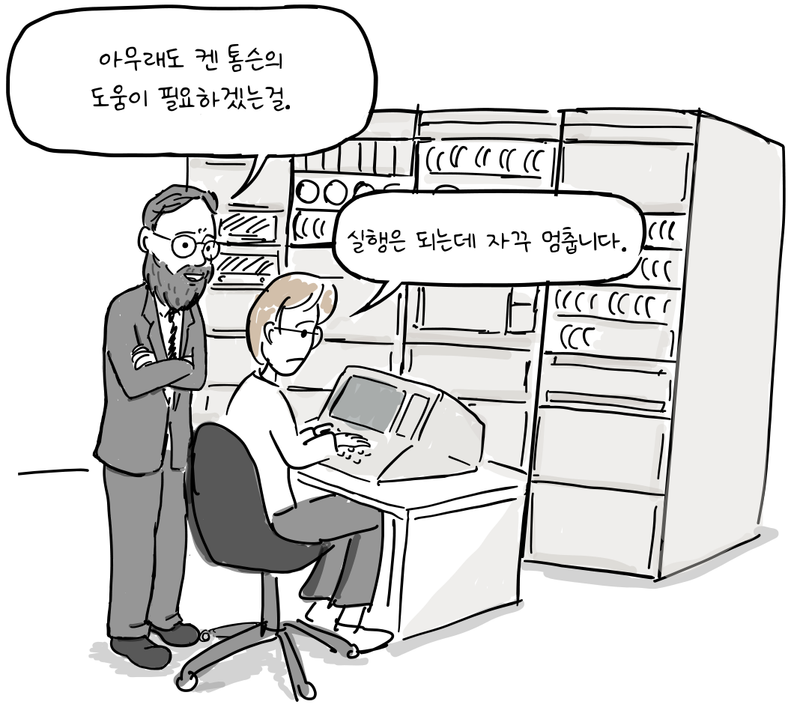

> 아무래도 켄 톰슨의 도움이 필요하겠는걸.\
> 실행은 되는데 자꾸 멈춥니다.

:::

:::panel rounded="true" style="border-width: 3px;border-color: black;"

켄 톰슨은 모뎀을 통해 원격으로 디버깅을 돕는다. 버클리의 PDP-11/45에는 디스크 두 대가 하나의 컨트롤러에 연결되어 있었다. 컨트롤러가 두 디스크의 탐색 작업을 겹쳐 처리할 때 문제가 생겼고, 유닉스가 이를 지원하도록 하였다.[&lbrack;2&rbrack;][2]

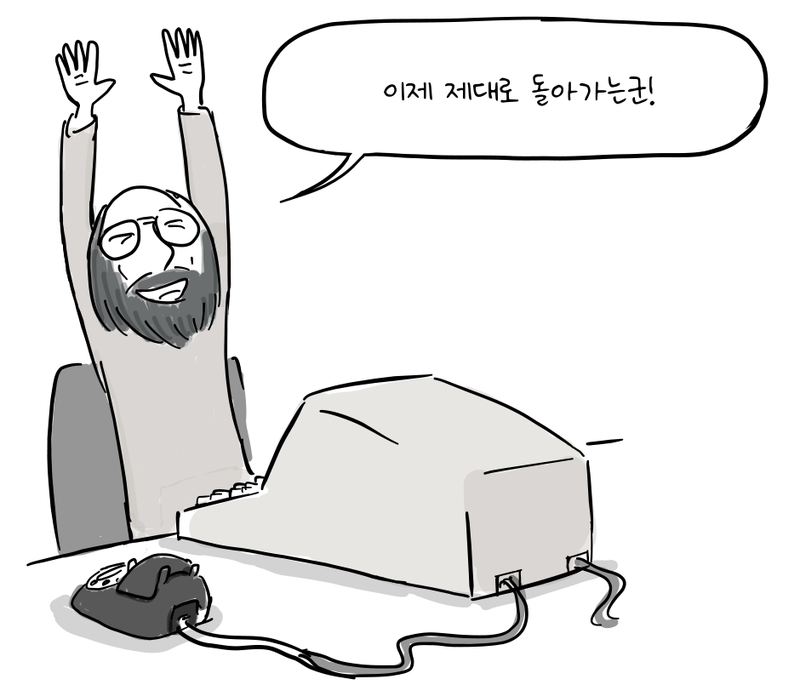

> 이제 제대로 돌아가는군!

:::

:::panel rounded="true" style="border-width: 3px;border-color: black;"

유닉스는 전산과 학생들에게 인기가 많았지만, 수학과·통계학과는 DEC의 RSTS를 원했다. 결국 유닉스는 하루 8시간, RSTS는 나머지 16시간을 쓰기로 했다. 공평하게 쓰려고 시간대도 날마다 바꿨다. 사흘에 한 번은 자정부터 오전 8시까지가 유닉스 차례였다.[&lbrack;2&rbrack;][2]

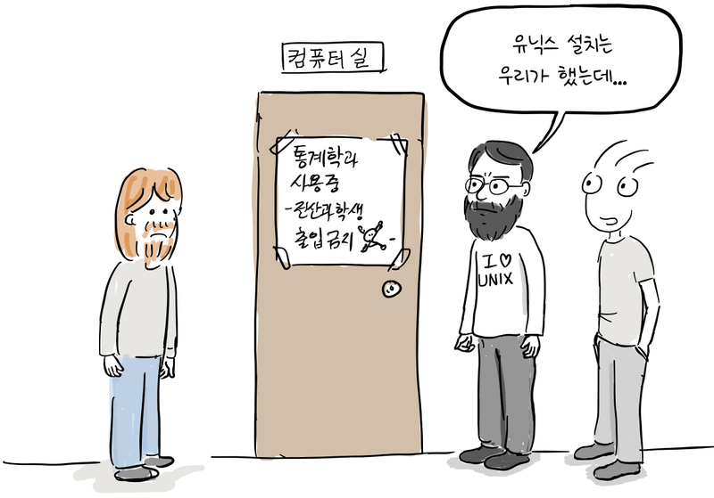

> 유닉스 설치는 우리가 했는데...

:::

:::panel rounded="true" style="border-width: 3px;border-color: black;"

컴퓨터 사용 시간은 여전히 부족했다. 버클리는 새 기종인 PDP-11/70을 구입했고, 컴퓨터는 1975년 가을에 도착한다.[&lbrack;2&rbrack;][2]

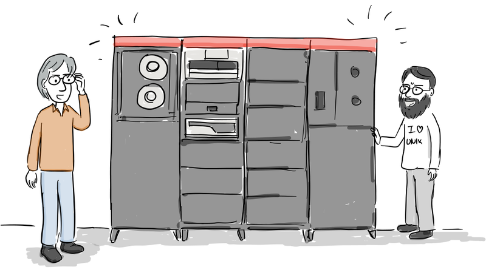

:::

::::panels columns="2" label=""

:::panel rounded="true" style="border-width: 3px;border-color: black;padding: 0;"

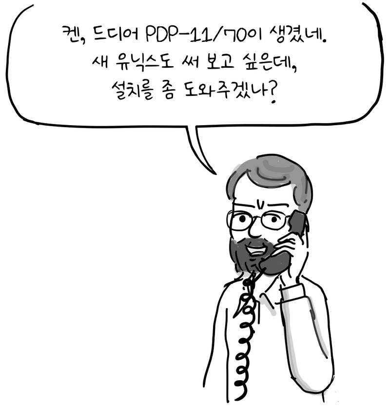

> 켄, 드디어 PDP-11/70이 생겼네. 새 유닉스도 써 보고 싶은데, 설치를 좀 도와주겠나?

:::

:::panel rounded="true" style="border-width: 3px;border-color: black;padding: 0;"

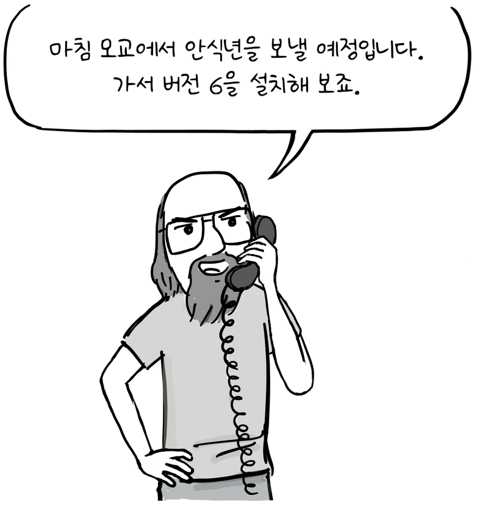

> 마침 모교에서 안식년을 보낼 예정입니다. 가서 버전 6을 설치해 보죠.

:::

::::

:::panel rounded="true" style="border-width: 3px;border-color: black;"

1975년, 켄 톰슨은 모교인 버클리 대학에서 방문 교수로 안식년을 보낸다. 톰슨은 제프 슈리브먼, 밥 크리들 등과 함께 새 PDP-11/70에서 유닉스 버전 6을 가동했다. 버클리에서 이어진 이러한 작업은 훗날 BSD 유닉스로 발전한다.[&lbrack;2&rbrack;][2]

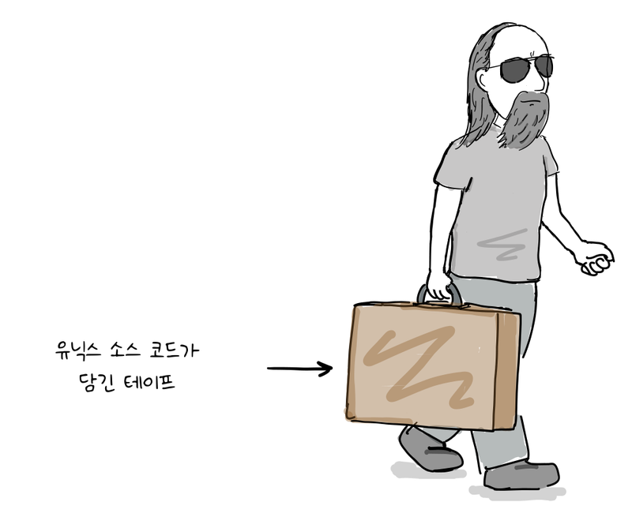

> 유닉스 소스 코드가 담긴 테이프

:::

**다음 편에서는 버클리에서 탄생한 편집기 vi의 이야기가 이어집니다.**

이 만화는 마셜 커크 맥큐식의 「버클리 유닉스의 20년」을 바탕으로 구성했습니다. 등장인물의 대화는 역사적 사실에 상상력을 더한 것으로, 실제 발언을 그대로 옮긴 것은 아닙니다.

## 참고 자료

1. D. M. Ritchie and K. Thompson, [The UNIX Time-Sharing System](https://people.eecs.berkeley.edu/~prabal/resources/osprelim/RT74.pdf), 1974.
2. Marshall Kirk McKusick, [Twenty Years of Berkeley Unix](https://www.oreilly.com/openbook/opensources/book/kirkmck.html), 1999.
3. Andrew Leonard, [BSD Unix: Power to the people, from the code](https://www.salon.com/2000/05/16/chapter_2_part_one/), 2000.
4. 마셜 커크 맥큐식, [「버클리 유닉스의 20년」, 『오픈소스: 혁명의 목소리』, 한빛미디어](http://www.hanbit.co.kr/store/books/look.php?p_code=E5329835060), 2013.

[1]: https://people.eecs.berkeley.edu/~prabal/resources/osprelim/RT74.pdf
[2]: https://www.oreilly.com/openbook/opensources/book/kirkmck.html
