:::panel

:::

:::panel rounded="true" style="border-width: 3px;border-color: black;"

In 1973, Ken Thompson and Dennis Ritchie presented Unix at the Symposium on Operating Systems Principles (SOSP).[&lbrack;1&rbrack;][1]

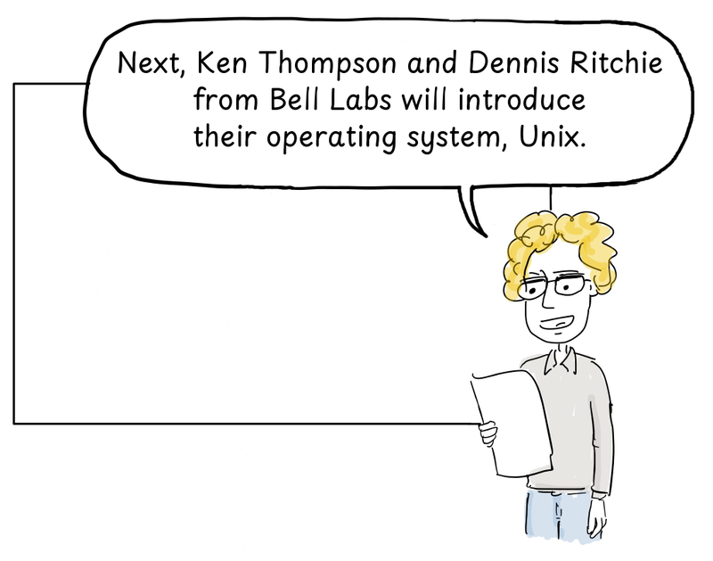

> Next, Ken Thompson and Dennis Ritchie from Bell Labs will introduce their operating system, Unix.

:::

:::panel rounded="true" style="border-width: 3px;border-color: black;"

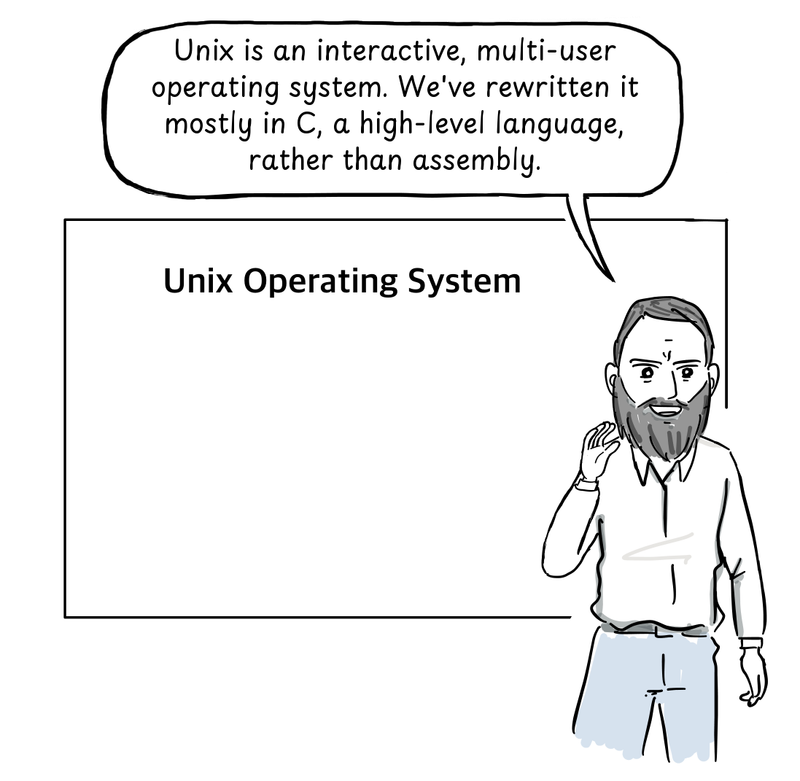

> Unix is an interactive, multi-user operating system. We've rewritten it mostly in C, a high-level language, rather than assembly.

:::

:::panel rounded="true" style="border-width: 3px;border-color: black;"

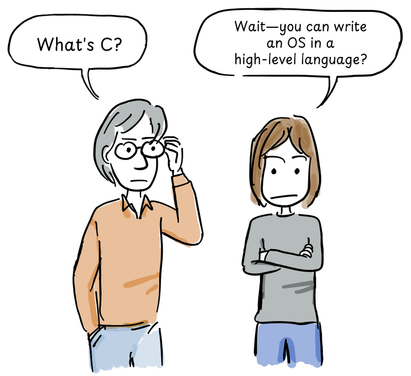

> What's C?\
> Wait—you can write an OS in a high-level language?

:::

:::panel rounded="true" style="border-width: 3px;border-color: black;padding: 0;"

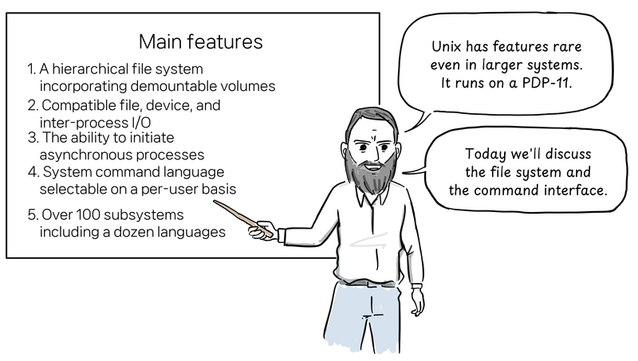

> Unix has features rare even in larger systems. It runs on a PDP-11.\
> Today we'll discuss the file system and the command interface.
>
> Main features shown on the board, using the original wording from the 1974 paper's abstract:[&lbrack;1&rbrack;][1]
> 1. A hierarchical file system incorporating demountable volumes
> 2. Compatible file, device, and inter-process I/O
> 3. The ability to initiate asynchronous processes
> 4. System command language selectable on a per-user basis
> 5. Over 100 subsystems including a dozen languages

:::

:::panel rounded="true" style="border-width: 3px;border-color: black;"

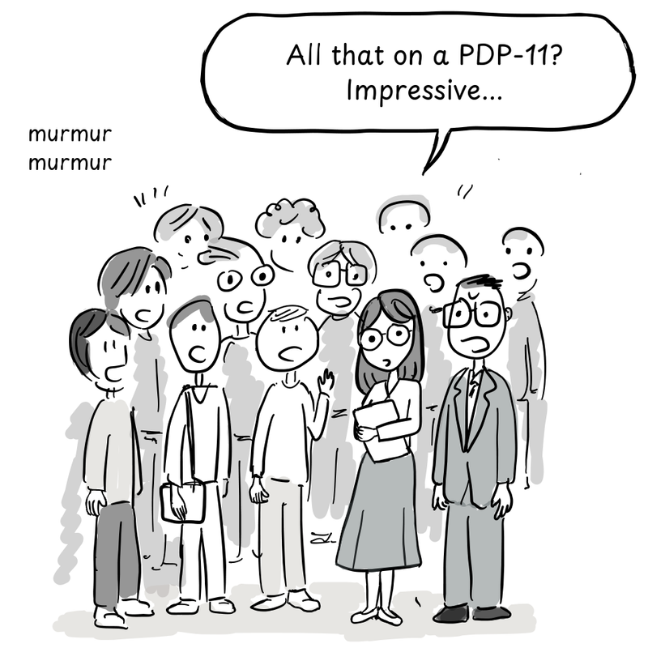

> murmur murmur\
> All that on a PDP-11? Impressive...

:::

:::panel rounded="true" style="border-width: 3px;border-color: black;"

After the talk, Professor Bob Fabry of the University of California, Berkeley approached the two speakers.

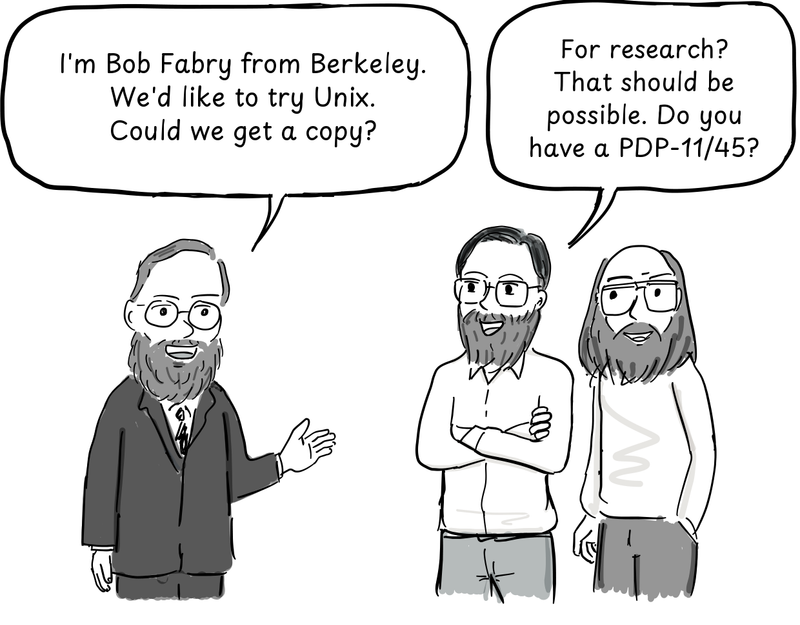

> I'm Bob Fabry from Berkeley. We'd like to try Unix. Could we get a copy?\
> For research? That should be possible. Do you have a PDP-11/45?

:::

:::panel rounded="true" style="border-width: 3px;border-color: black;"

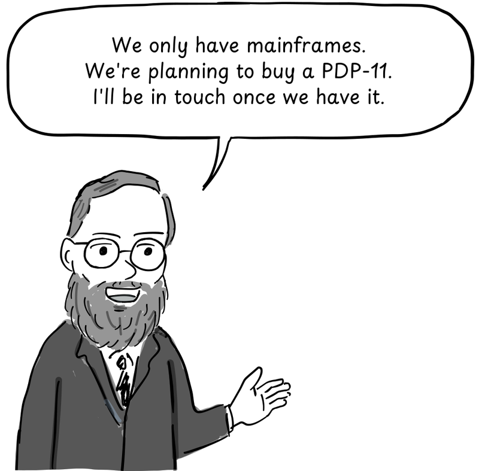

> We only have mainframes. We're planning to buy a PDP-11. I'll be in touch once we have it.

:::

:::panel rounded="true" style="border-width: 3px;border-color: black;"

Berkeley's computer science, mathematics, and statistics departments jointly purchased a PDP-11/45. A tape containing Unix Version 4 arrived in January 1974, and graduate student Keith Standiford installed it.[&lbrack;2&rbrack;][2]

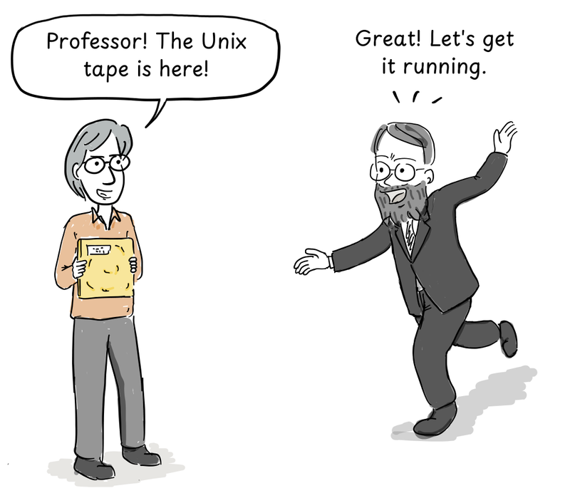

> Professor! The Unix tape is here!\
> Great! Let's get it running.

:::

:::panel rounded="true" style="border-width: 3px;border-color: black;"

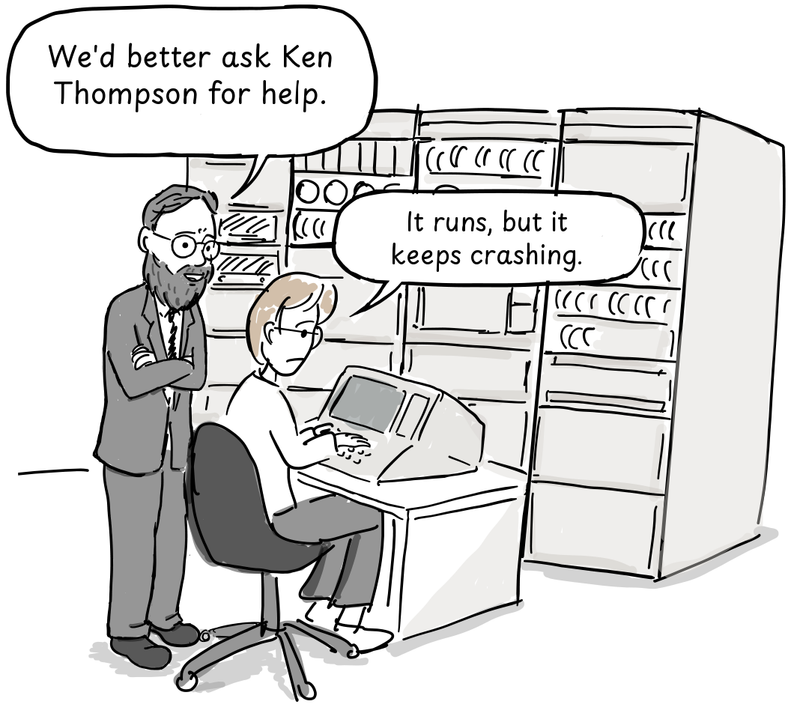

> We'd better ask Ken Thompson for help.\
> It runs, but it keeps crashing.

:::

:::panel rounded="true" style="border-width: 3px;border-color: black;"

Thompson dialed in by modem to help. The trouble came when both disks tried to seek at once—their shared controller couldn't handle it reliably. With his help, Unix was finally running smoothly.[&lbrack;2&rbrack;][2]

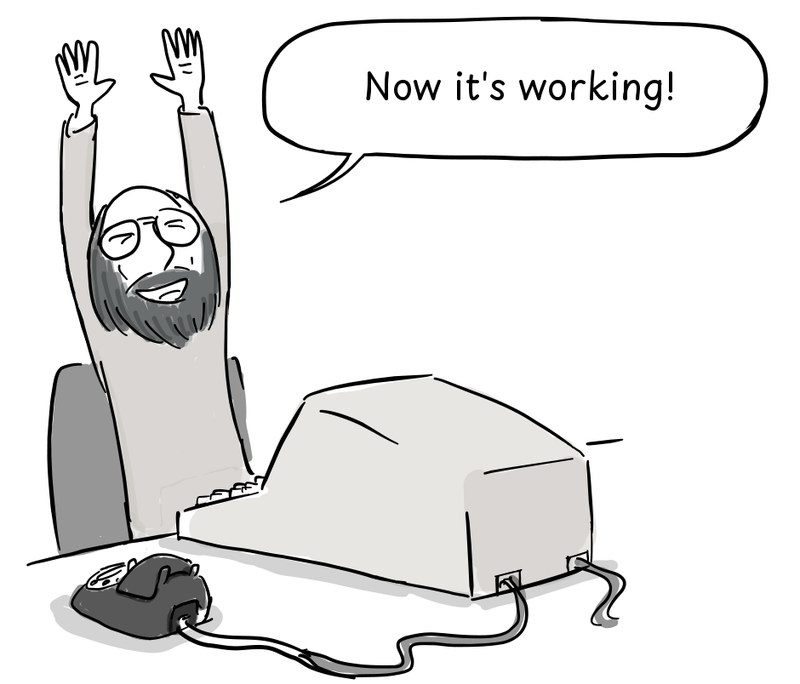

> Now it's working!

:::

:::panel rounded="true" style="border-width: 3px;border-color: black;"

The computer science students liked Unix, but the mathematics and statistics departments wanted DEC's RSTS. The compromise: eight hours a day for Unix, sixteen for RSTS. To keep things fair, the shifts rotated daily. Every third day, Unix got midnight to 8 a.m.[&lbrack;2&rbrack;][2]

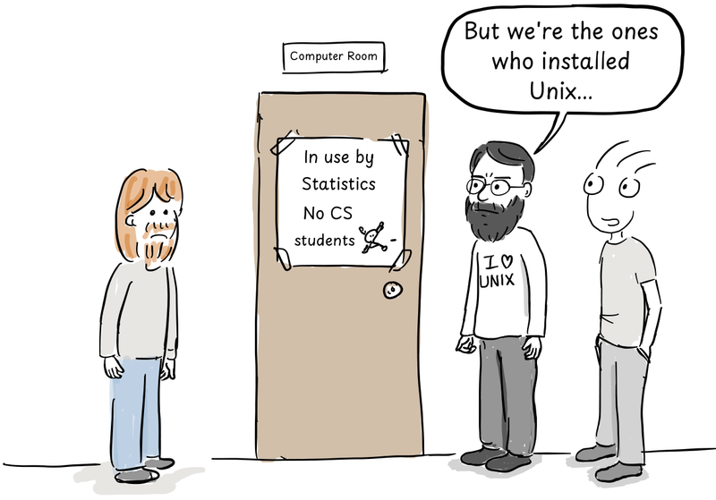

> But we're the ones who installed Unix...
>
> Door signs: Computer Room. In use by Statistics. No CS students.

:::

:::panel rounded="true" style="border-width: 3px;border-color: black;"

There still wasn't enough computer time. Berkeley bought a newer model, the PDP-11/70, which arrived in the fall of 1975.[&lbrack;2&rbrack;][2]

:::

::::panels columns="2" label=""

:::panel rounded="true" style="border-width: 3px;border-color: black;padding: 0;"

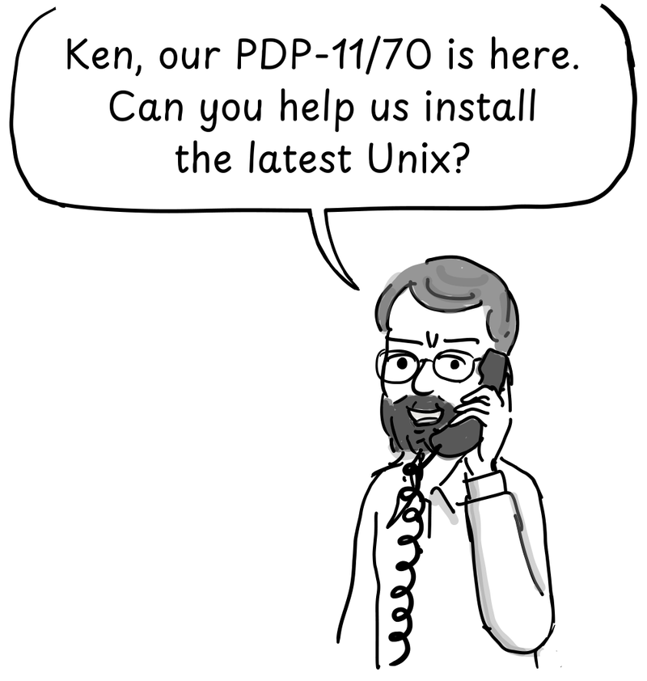

> Ken, our PDP-11/70 is here. Can you help us install the latest Unix?

:::

:::panel rounded="true" style="border-width: 3px;border-color: black;padding: 0;"

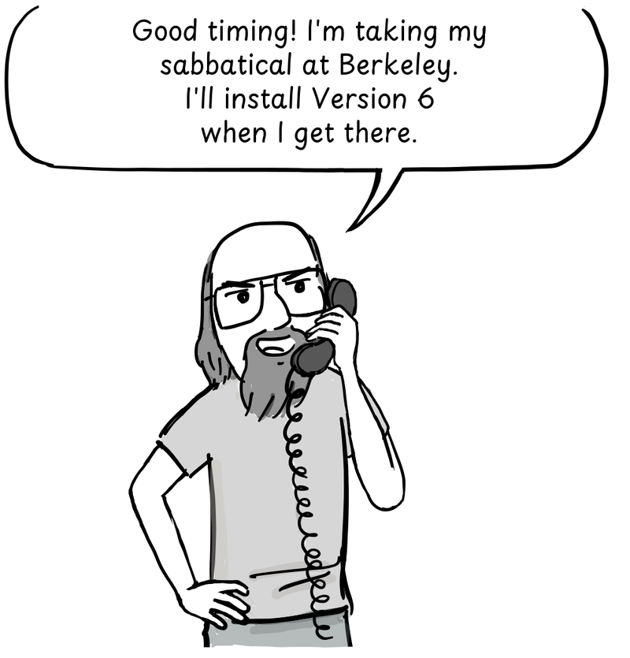

> Good timing! I'm taking my sabbatical at Berkeley. I'll install Version 6 when I get there.

:::

::::

:::panel rounded="true" style="border-width: 3px;border-color: black;"

In 1975, Thompson returned to his alma mater, Berkeley, for a sabbatical as a visiting professor. Together with Jeff Schriebman and Bob Kridle, he got Unix Version 6 running on the new PDP-11/70. The work that followed at Berkeley would eventually grow into BSD Unix.[&lbrack;2&rbrack;][2]

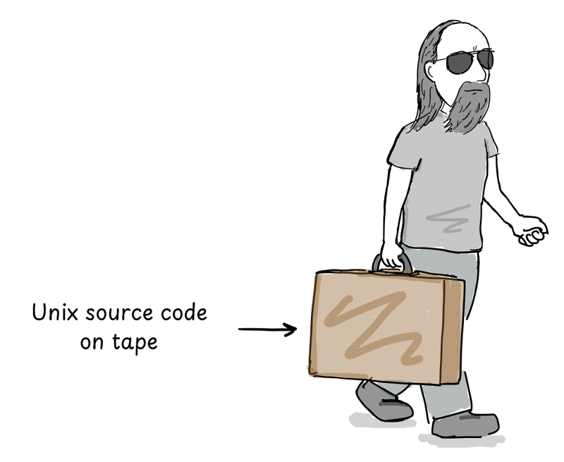

> Unix source code on tape

:::

**Next: the story of vi, the editor born at Berkeley.**

This comic is based on Marshall Kirk McKusick's "Twenty Years of Berkeley Unix." The dialogue is dramatized, not a verbatim record of what the participants said.

## References

1. D. M. Ritchie and K. Thompson, [The UNIX Time-Sharing System](https://people.eecs.berkeley.edu/~prabal/resources/osprelim/RT74.pdf), 1974.
2. Marshall Kirk McKusick, [Twenty Years of Berkeley Unix](https://www.oreilly.com/openbook/opensources/book/kirkmck.html), 1999.
3. Andrew Leonard, [BSD Unix: Power to the people, from the code](https://www.salon.com/2000/05/16/chapter_2_part_one/), 2000.
4. Marshall Kirk McKusick, "Twenty Years of Berkeley Unix," in the Korean edition of [Open Sources: Voices from the Open Source Revolution](http://www.hanbit.co.kr/store/books/look.php?p_code=E5329835060), Hanbit Media, 2013.

[1]: https://people.eecs.berkeley.edu/~prabal/resources/osprelim/RT74.pdf
[2]: https://www.oreilly.com/openbook/opensources/book/kirkmck.html
