[11\. BSD 유닉스 1화 – UC 버클리로 간 유닉스 코드](http://joone.net/2017/12/16/%EC%9E%90%EC%9C%A0%EB%A1%9C%EC%9D%98-%ED%88%AC%EC%9F%81-bsd-%EC%9C%A0%EB%8B%89%EC%8A%A4-1%ED%99%94/)

1975년 켄 톰슨은 모교인 버클리 대학에서 방문 교수로 안식년을 보내면서 최신 기기인 PDP-11/70에 유닉스 버전6를 포팅하고 있었다.

**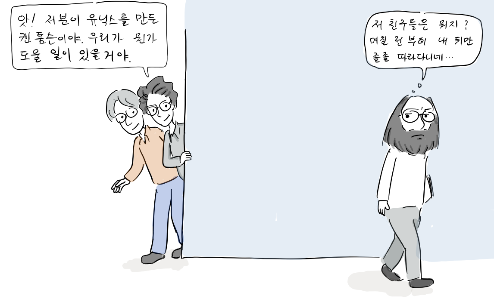**

빌 조이: 앗, 저분이 유닉스를 만든 켄 톰슨이야. 우리가 뭔가 도울 일이 있을거야.  
켄 톰슨: 저 친구들은 뭐지? 며칠 전부터 내 뒤를 졸졸 따라다니네.

PDP-11/70 기계실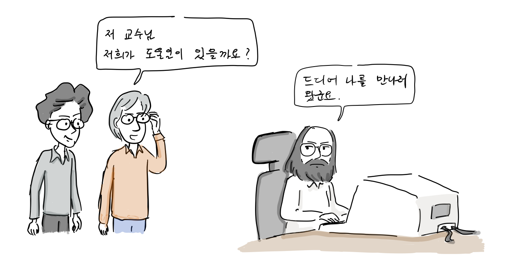

빌조이: 저 교수님 저희가 도울일이 있을까요?  
켄 톰슨: 드디어 나를 만나러 왔군요.

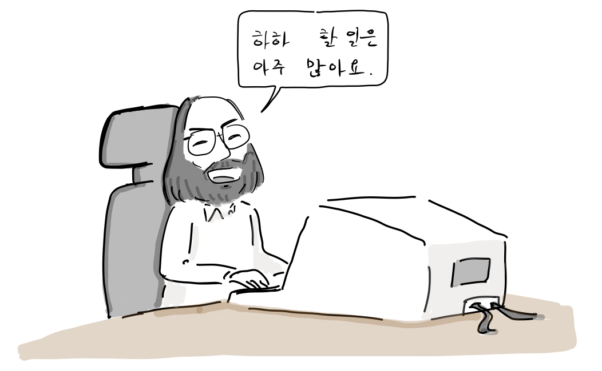

켄 톰슨: 하하, 할 일은 아주 많아요.

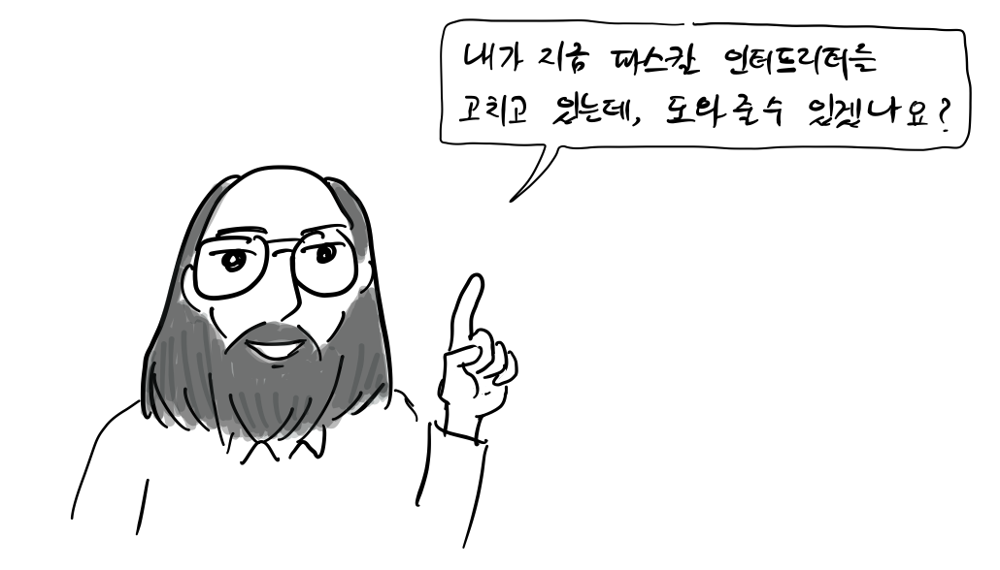

켄 톰슨: 내가 지금 파스칼 인터프리터를 좀 고치고 있는데, 도와줄 수 있겠나요?

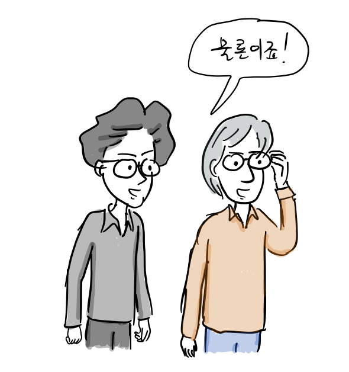

빌 조이와 척 핼리: 물론이죠!

이후, 이들이 확장하고 개선한 파스칼은 컴파일 시간을 줄여주고 프로그램을 빠르게 실행시켜서 학생들에게 인기가 많았다.

**VI 에디터의 탄생**

당시 유닉스는 [ed라는 에디터](https://ko.wikipedia.org/wiki/Ed_\(%EB%AC%B8%EC%84%9C_%ED%8E%B8%EC%A7%91%EA%B8%B0\))를 제공하고 있었다. 이는 1969년, 켄 톰슨이 유닉스를 개발할 때 추가한 최초의 에디터였다.

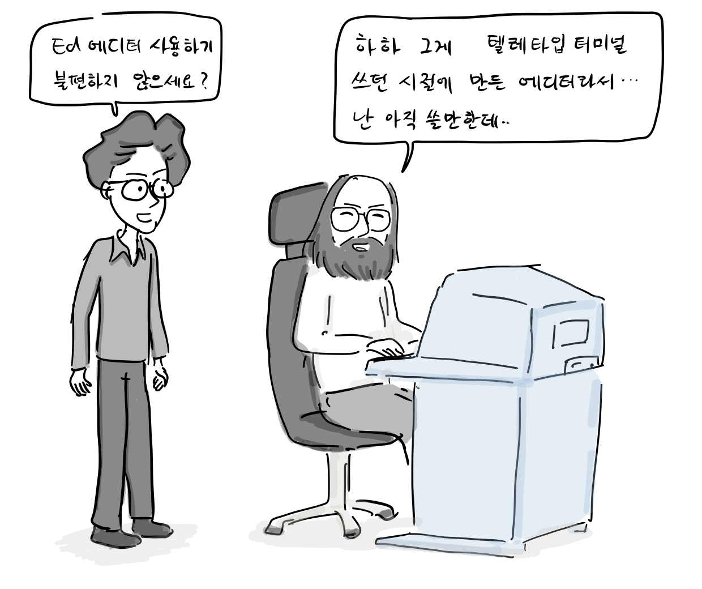

빌 조이: ed 에디터 사용하기 불편하지 않으세요?  
켄 톰슨: 하하, 그게 텔레타입 터미널 쓰던 시절에 만든거라.. 난 아직 쓸만한데…

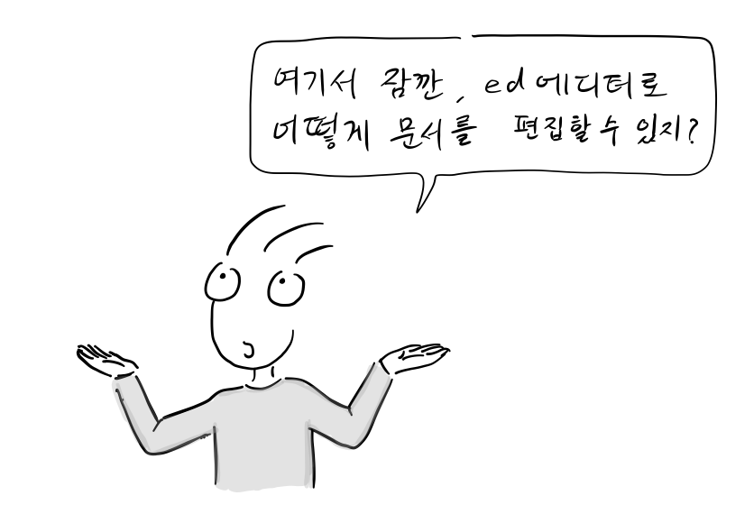

여기서 잠깐, ed 에디터로는 어떻게 문서를 편집할 수 있지?

다음은 ed 세션의 예제이다. 사용자가 입력한 명령어와 텍스트는 보통 글씨체로 되어있고, ed의 출력은 굵은 글씨로 표시되어 있다.

$ ed  
A  
ed is the standard Unix text editor.  
This is line number one.  
.  
,2  
**This is line number one.  
**2s/one/two/  
,2  
**This is line number two.  
**w text  
62  
Q  
$ cat text  
ed is the standard Unix text editor.  
This is line number two.

a명령어는 ed 에디터를 입력 상태로 만들어준다. 위 문서 편집에서는 두 줄을 입력한 후, 새로운 줄에서 마침표를 입력하면 입력 상태가 종료된다. 입력한 글을 보려면 쉼표(,) 명령과 줄 번호를 입력하면 원하는 줄을 볼 수 있다. 두번째 줄에 one을 two로 바꾸려면, vi처럼 커서를 이동해서 바꾸는 것이 아니라, 치환 명령어인 s를 이용해서 위와 같이 잘못된 글자를 원하는 글자로 변경할 있다. w명령어를 입력한 내용을 파일로 저정한 후, Q명령어로 ed 에디터를 종료할 수 있다.

최종 결과는 다음의 문자를 포함하는 텍스트 파일이다:  
ed is the standard Unix text editor.  
This is line number two.

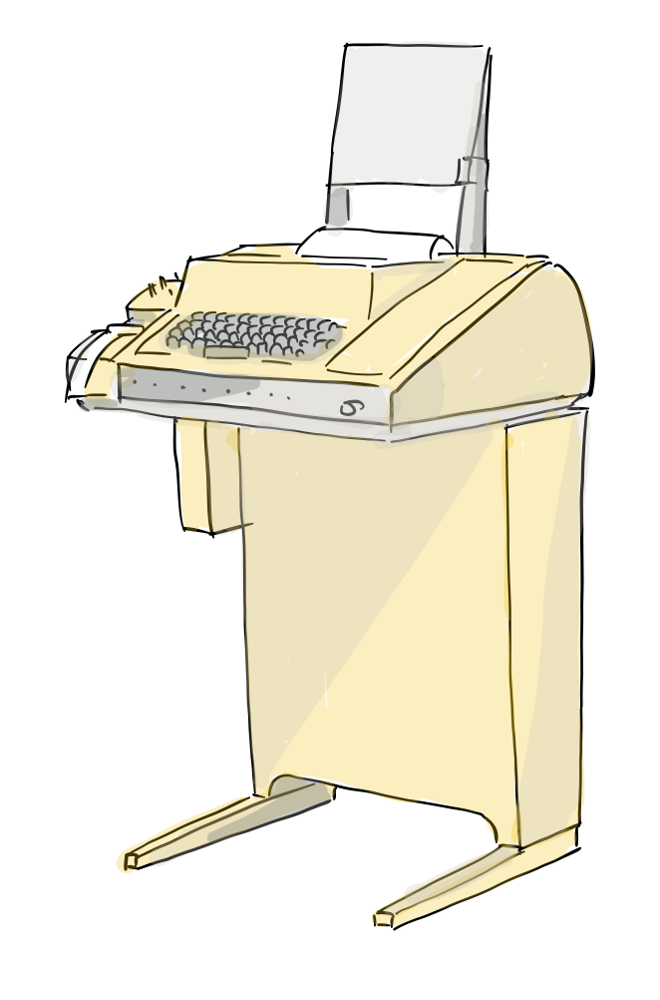

대표적인 텔레 프린터인 텔레타입 모델 33

ed에디터가 이렇게 만들어진 것은 1960년대 컴퓨터 메모리가 귀했고, 당시에는 지금과 같은 모니터가 아니라 종이에 출력을 프린트하는 텔레 프린터를 사용했기 때문이다. 모뎀 속도 역시 느렸다. 하지만, 1970년대 CRT 모니터가 달린 터미널이 보급된 이후에도 유닉스에서는 ed에디터가 계속 사용되고 있었다.

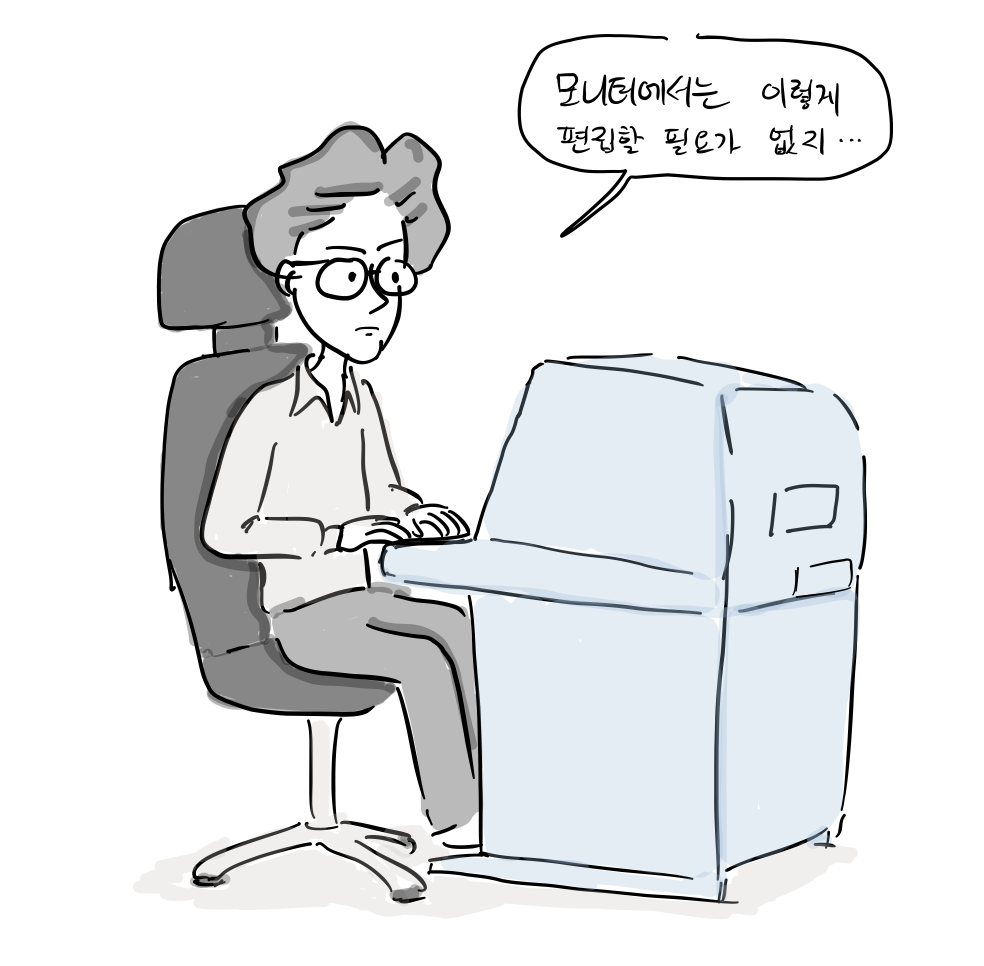

빌 조이: 모니터에서는 이렇게 편집할 필요가 없지.

어느 날,

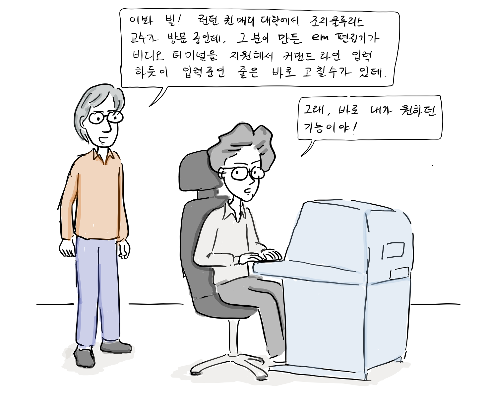

척 핼리: 이봐 빌! 퀸 매리 대학에서 조지 쿨루리스 교수가 방문 중인데, 그 분이 만든 em편집기가 비디오 터미널을 지원해서 커맨드 라인 입력하듯이 입력 중인 줄은 바로 고칠 수 있다는데?  
빌 조이: 그래, 바로 내가 원하는 기능이야.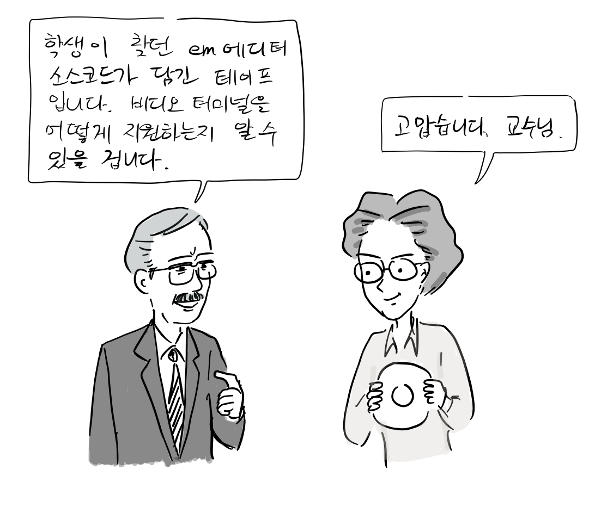

조지 쿨루리스 교수: 학생이 찾던 em에디터 소스코드가 담긴 테이프입니다. 비디오 터미널을 어떻게 지원하는지 알 수 있을겁니다.  
빌 조이: 고맙습니다. 교수님.

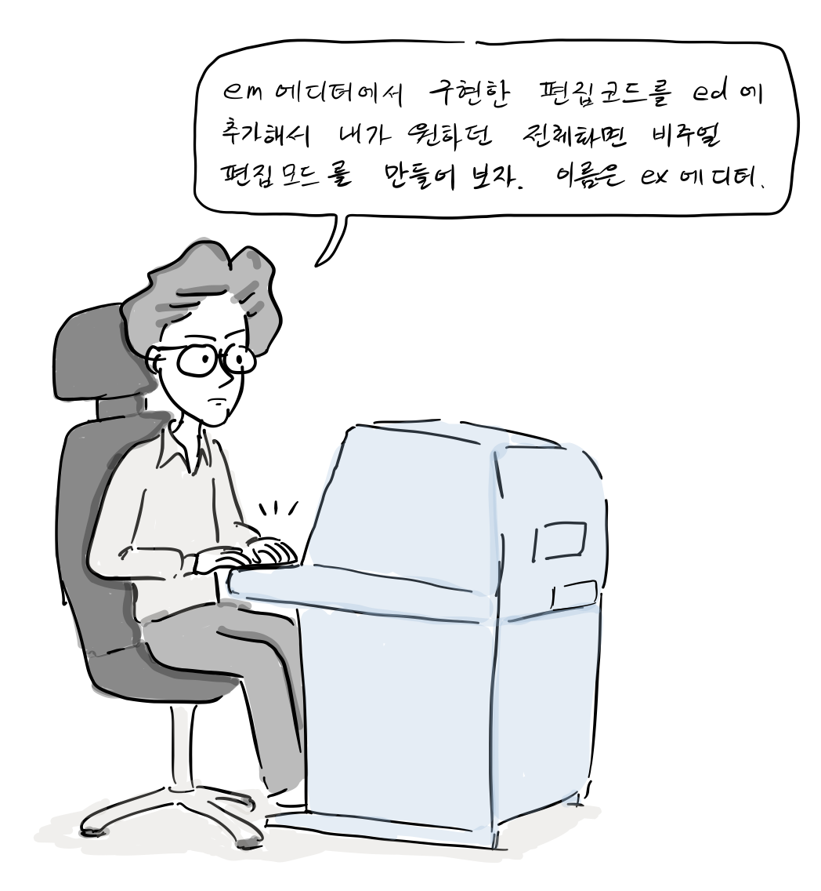

빌 조이: em에서 구현한 편집 코드를 ed에 붙여서 내가 원하던 전체 화면 비주얼 편집 모드를 만들어보자. 이름은 ex 에디터!

1977년 10월, 마침내 현재 우리가 사용하는 전체 화면 비주얼 편집 모드가 ex 에디터에서 구현되었다.

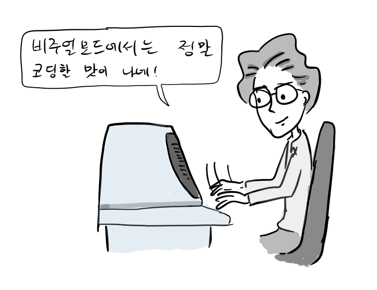

빌 조이: 비주얼 모드에서는 정말 코딩할 맛이 나네.

이후 BSD 유닉스 사용자들이 비주얼 편집 모드를 선호하게 되어 결국, vi라는 이름으로 비주얼 편집 모드가 바로 실행되도록 하였다. 참고로, 아직까지 vi에디터에는 ex모드를 지원하고 있다.

**서해안 유닉스 사용자 그룹**

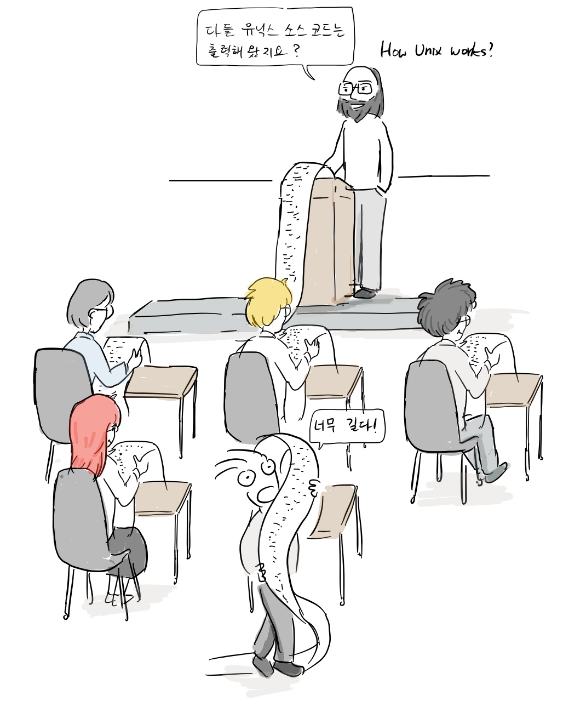

켄 톰슨: 다들 유닉스 소스코드는 출력해왔지요?

켄 톰슨은 또한 유닉스를 가르치는 일에도 앞장섰다. 서해안 유닉스 사용자 그룹이라는 모임을 만들어서 밤마다 유닉스 커널 소스코드를 한줄 한줄 설명하였다. 이처럼 소스 코드를 공유하고 지식을 나누는 정신이 BSD 유닉스를 거쳐 훗날 자유/오픈소스 소프트웨어 운동에 영향을 주게 된다.

**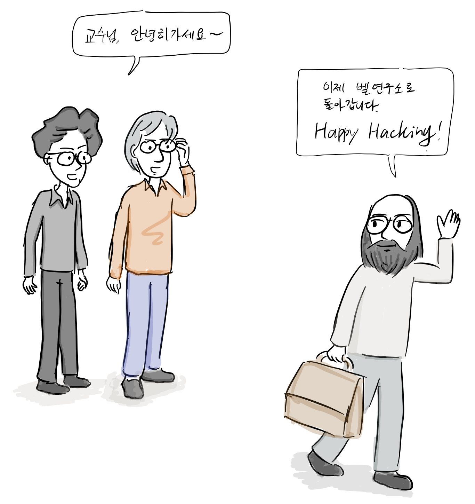**

켄 톰슨: 이제 벨 연구소로 돌아갑니다. “Happy hacking!”  
빌 조이: 교수님, 안녕히가세요~

2화 끝. [다음에 계속](http://joone.net/2018/01/02/11-bsd-%EC%9C%A0%EB%8B%89%EC%8A%A4-3%ED%99%94-bsd-%EC%9C%A0%EB%8B%89%EC%8A%A4-%EC%8B%9C%EC%9E%91/)…

참고 문헌

-   ANDREW LEONARD, [BSD Unix: Power to the people, from the code](https://www.salon.com/2000/05/16/chapter_2_part_one/), 2000
-   마샬 커크 맥퀴식, [버클리 유닉스의 20년, 오픈소스 혁명의 목소리, 한빛출판사](http://www.hanbit.co.kr/store/books/look.php?p_code=E5329835060), 2013
-   https://en.wikipedia.org/wiki/Vi
-   https://en.wikipedia.org/wiki/Ed\_(text\_editor)
