-   [BSD 유닉스 1화 – UC 버클리로 간 유닉스 코드](http://joone.net/2017/12/16/%EC%9E%90%EC%9C%A0%EB%A1%9C%EC%9D%98-%ED%88%AC%EC%9F%81-bsd-%EC%9C%A0%EB%8B%89%EC%8A%A4-1%ED%99%94/)
-   [BSD 유닉스 2화 – vi 에디터의 탄생](http://joone.net/2017/12/23/11-%EC%9E%90%EC%9C%A0%EB%A1%9C%EC%9D%98-%ED%88%AC%EC%9F%81-bsd-%EC%9C%A0%EB%8B%89%EC%8A%A4-2%ED%99%94/)

**BSD 유닉스의 시작  
**1976년 켄 톰슨이 벨 연구소로 돌아가자, 빌 조이와 척 핼리는 유닉스 커널 내부를 직접 해킹하기 시작한다.

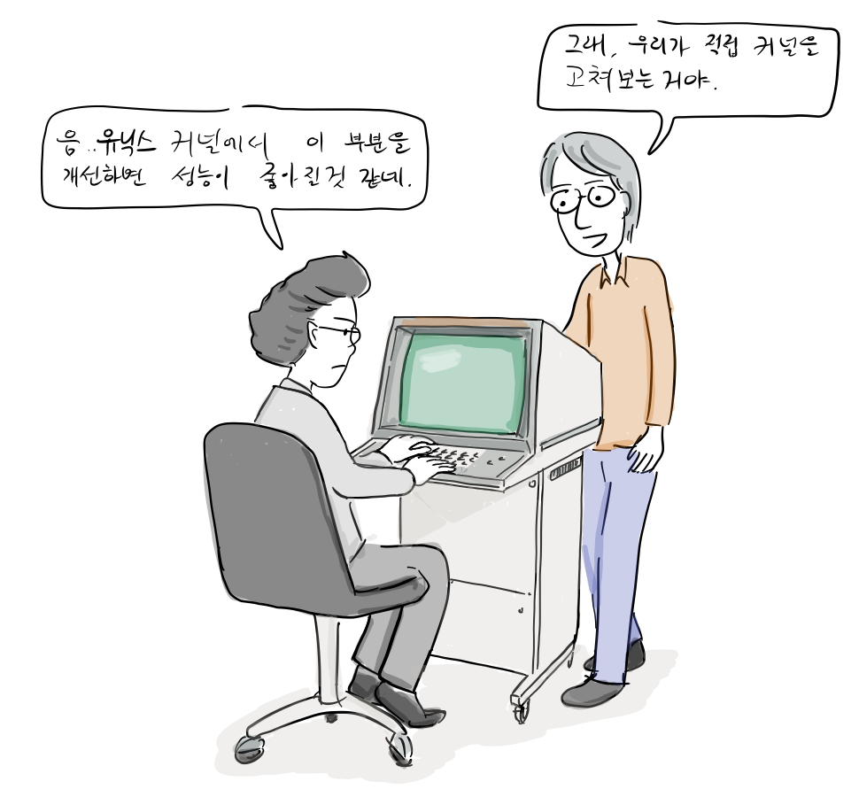

빌 조이: 음.. 유닉스 커널에서 이 부분을 개선하면 성능이 좋아질 것 같아.  
척 핼리: 그래? 우리가 직접 커널을 고쳐보는 거야.

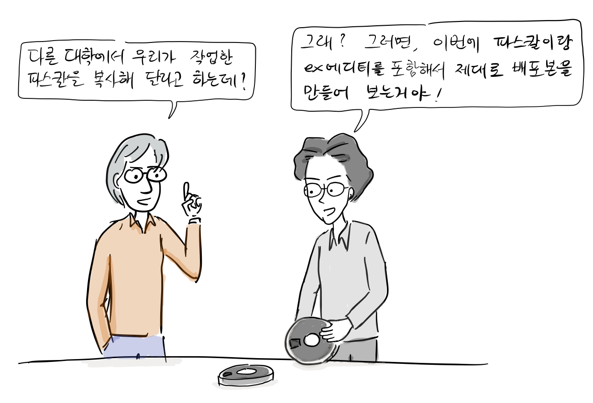

척 핼리: 그런데, 다른 대학에서 우리가 작업한 [파스칼](https://ko.wikipedia.org/wiki/%ED%8C%8C%EC%8A%A4%EC%B9%BC_\(%ED%94%84%EB%A1%9C%EA%B7%B8%EB%9E%98%EB%B0%8D_%EC%96%B8%EC%96%B4\)) 컴파일러를 복사해달라고 하는데?  
빌 조이: 그래? 그러면, 이번에 우리가 파스칼이랑 ex 에디터를 포함해서 제대로 유닉스 배포판을 만들어보자.

1977년 초, 빌 조이는 파스칼 시스템과 em 에디터에 비주얼 모드를 추가한 ex 에디터를 포함해서 배포판을 만들어 복사본 30여개를 발송하였다. 이것은 일종의 유닉스 확장판이였고 이름도 버클리 소프트웨어 배포판(BSD, Berkeley Software Distribution)였다.

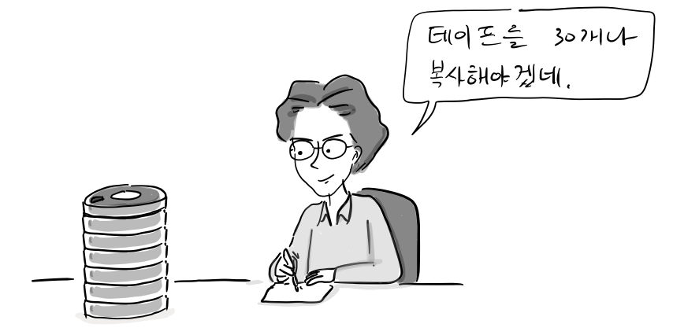

빌 조이: 테이프를 30개나 복사해야겠네.

당시 BSD는 지금과 같은 자유 소프트웨어는 아니었지만, 이미 UNIX를 구매한 기관이나 개인에게 저장 매체와 배송비만으로 제공되었다.

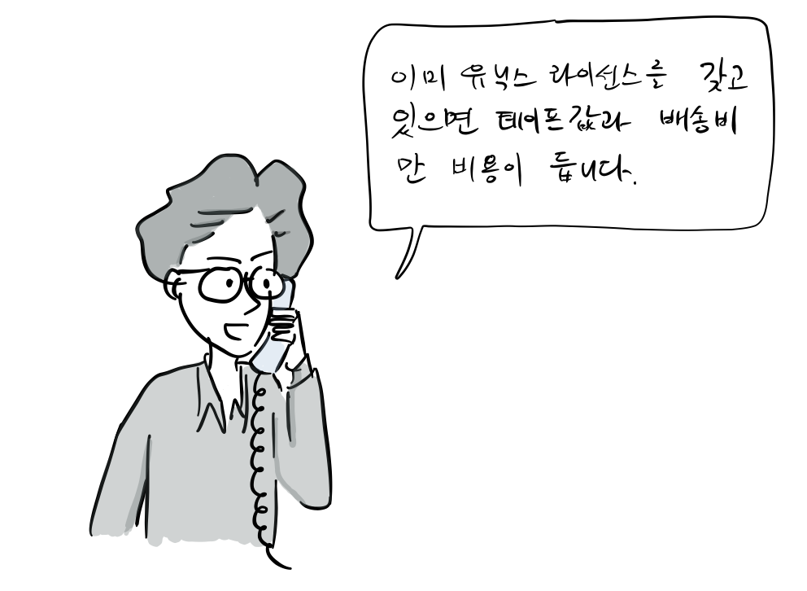

빌 조이: 이미 유닉스를 라이선스를 갖고 있으면 테이프값과 배송비만 비용이 듭니다.

이 당시 빌 조이가 BSD 유닉스를 실비만 받고 무료로 제공한 이유는 당시 버클리 대학이 갖고 있는 자유 스피치 운동, 히피 문화, 반전 운동에 영향을 받았다고 한다. 물론 유닉스가 소스코드와 함께 거의 무료로 제공된 부분도 큰 역할을 했다.

**두번째 배포판 2BSD**  
첫번째 BSD가 배포된 이후, 파스칼 사용자로 피드백을 받아 버그를 수정하였고, vi에디터(ex 에디터의 비주얼모드)와 C쉘을 포함해서 1979년 5월 75개의 2BSD를 배포하였다.

이 당시 빌 조이는 버그 수정 및 테이프 복사 및 발송 등 모든 일을 도맡아 했다.

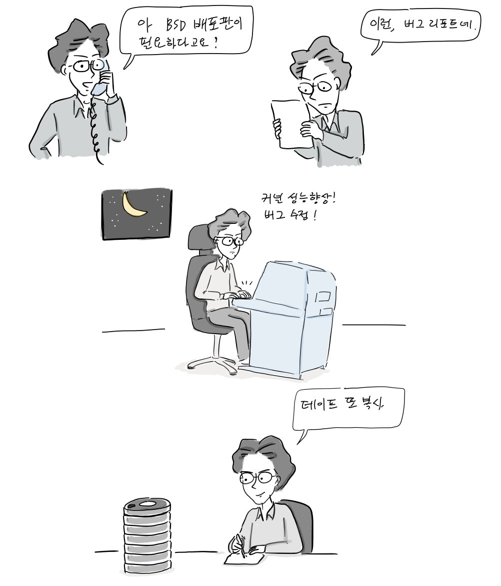

**가상 메모리 지원과 3BSD 탄생**

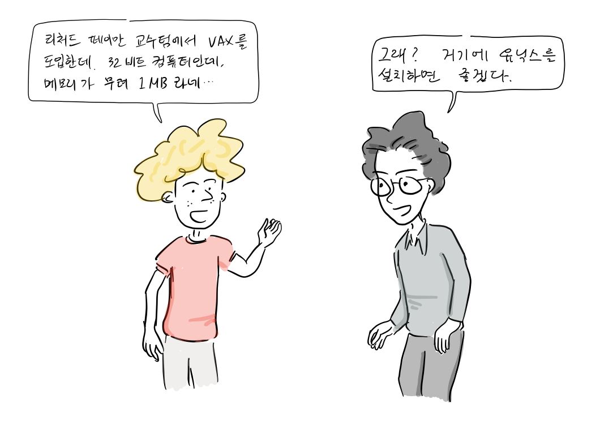

친구: 리처드 페이트만 교수팀에서 [VAX](https://ko.wikipedia.org/wiki/VAX)를 도입한데. 32 비트 컴퓨터인데, 메모리가 무려 1MB라네..  
빌 조이: 그래? 거기에 유닉스를 설치하면 좋겠다.

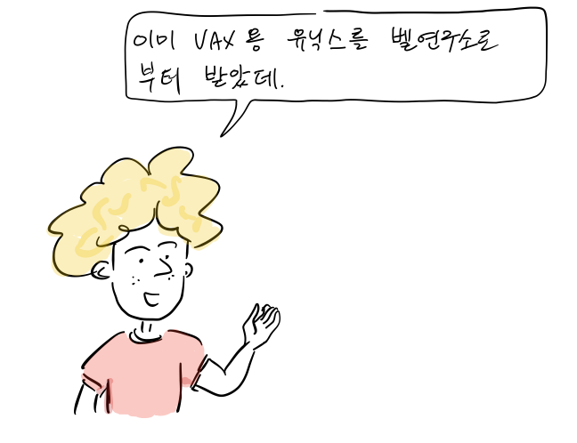

친구: 이미 VAX용 유닉스(32/V)를 벨 연구소로 부터 받았데.

얼마 후, 빌 조이는 VAX에서 작업할 기회를 갖게 된다.

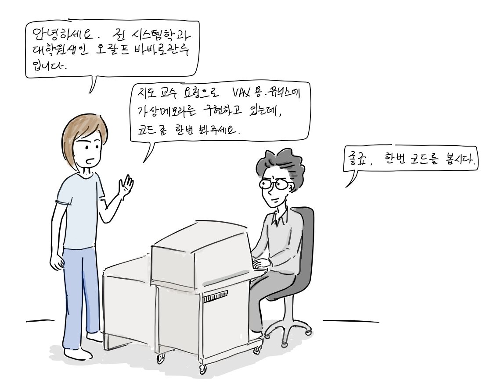

오잘프 바바로관루: 안녕하세요. 전 시스템학과 대학원생인 오잘프 바바로관루입니다. 지도 교수 요청으로 VAX용 유닉스에 [가상 메모리](https://ko.wikipedia.org/wiki/%EA%B0%80%EC%83%81_%EB%A9%94%EB%AA%A8%EB%A6%AC)를 구현하고 있는데, 코드 좀 한번 봐주시면 좋겠습니다.  
빌 조이: 좋죠, 한번 코드를 봅시다.

VAX용 유닉스는 아직 가상 메모리를 지원하고 있지 않았는데, 오잘프가 개발하고 있는 [컴퓨터 대수학 시스템(Computer algebra system)](https://ko.wikipedia.org/wiki/%EC%BB%B4%ED%93%A8%ED%84%B0_%EB%8C%80%EC%88%98%ED%95%99_%EC%8B%9C%EC%8A%A4%ED%85%9C)은 가상 메모리 기능을 반드시 필요로 했다.

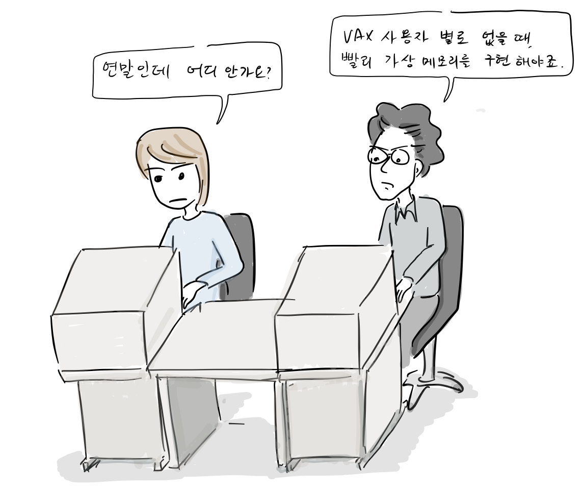

오잘프 바바로관루: 연말인데 어디 안가나요?  
빌 조이: VAX 사용자 별로 없을 때, 빨리 가상 메모리를 구현해야죠.

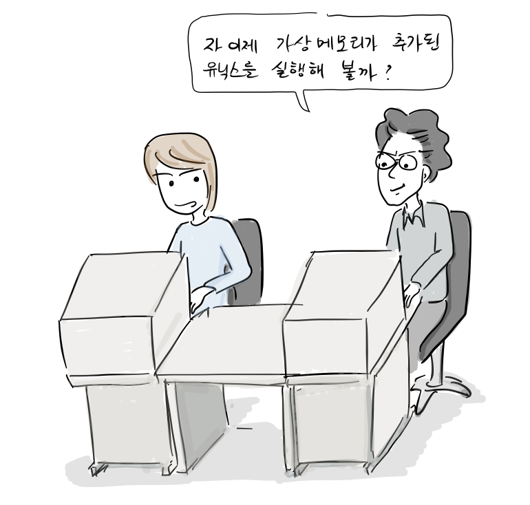

빌 조이: 자 이제 가상 메모리가 추가된 유닉스를 실행해볼까?

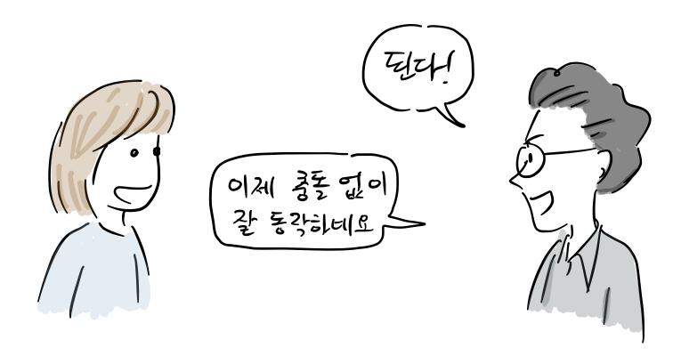

빌 조이: 된다. 이제 충돌없이 잘 동작하네요.

이후, 빌 조이는 32비트용 VAX에 맞게 2BSD에 추가된 vi 비롯한 각종 툴을 이식하고 가상 메모리 기능을 추가해서 1979년 12월 드디어 3BSD를 배포한다.

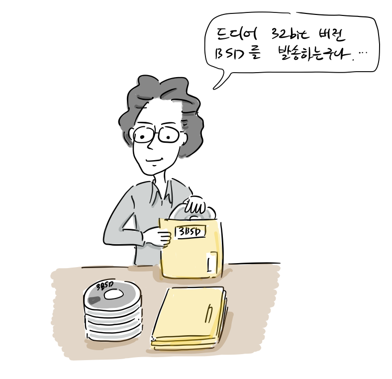

빌 조이: 드디어 32bit 버전 BSD를 발송하는구나.

3BSD는 명성은 정부 연구 기관에서 알려지고, 당시 미국 [방위고등연구계획국](https://ko.wikipedia.org/wiki/%EB%B0%A9%EC%9C%84%EA%B3%A0%EB%93%B1%EC%97%B0%EA%B5%AC%EA%B3%84%ED%9A%8D%EA%B5%AD)(DARPA , Defense Advanced Research Projects Agency)은 모든 컴퓨터를 하나로 묶는 네트워크(ARPANET)를 구축하려는 계획을 갖고 있었는데, 그 운영체제로 버클리 대학에서 만든 3BSD를 주목하기 시작했다.

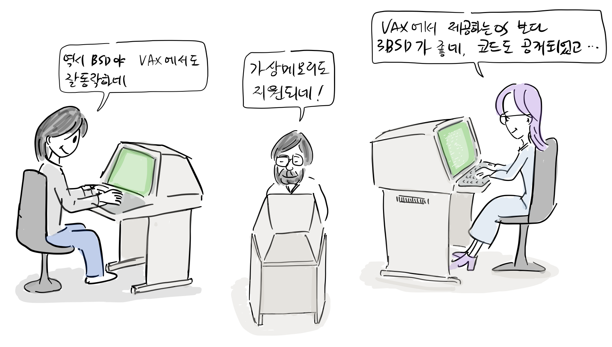

3화 끝. [다음](http://joone.net/2018/01/14/11-bsd-%EC%9C%A0%EB%8B%89%EC%8A%A4-4%ED%99%94-csrgcomputer-science-research-group-%EA%B2%B0%EC%84%B1/)에 계속…

참고 문헌

-   ANDREW LEONARD, [BSD Unix: Power to the people, from the code](https://www.salon.com/2000/05/16/chapter_2_part_one/), 2000
-   마샬 커크 맥퀴식, [버클리 유닉스의 20년, 오픈소스 혁명의 목소리, 한빛출판사](http://www.hanbit.co.kr/store/books/look.php?p_code=E5329835060), 2013
