-   [BSD 유닉스 1화 – UC 버클리로 간 유닉스 코드](http://joone.net/2017/12/16/%EC%9E%90%EC%9C%A0%EB%A1%9C%EC%9D%98-%ED%88%AC%EC%9F%81-bsd-%EC%9C%A0%EB%8B%89%EC%8A%A4-1%ED%99%94/)
-   [BSD 유닉스 2화 – vi 에디터의 탄생](http://joone.net/2017/12/23/11-%EC%9E%90%EC%9C%A0%EB%A1%9C%EC%9D%98-%ED%88%AC%EC%9F%81-bsd-%EC%9C%A0%EB%8B%89%EC%8A%A4-2%ED%99%94/)
-   [BSD 유닉스 3화 – BSD 유닉스 시작](http://joone.net/2018/01/02/11-bsd-%EC%9C%A0%EB%8B%89%EC%8A%A4-3%ED%99%94-bsd-%EC%9C%A0%EB%8B%89%EC%8A%A4-%EC%8B%9C%EC%9E%91/)

**미국방성 고등 방위 연구 계획국(DARPA, Defense Advanced Research Projects Agency)의 지원**

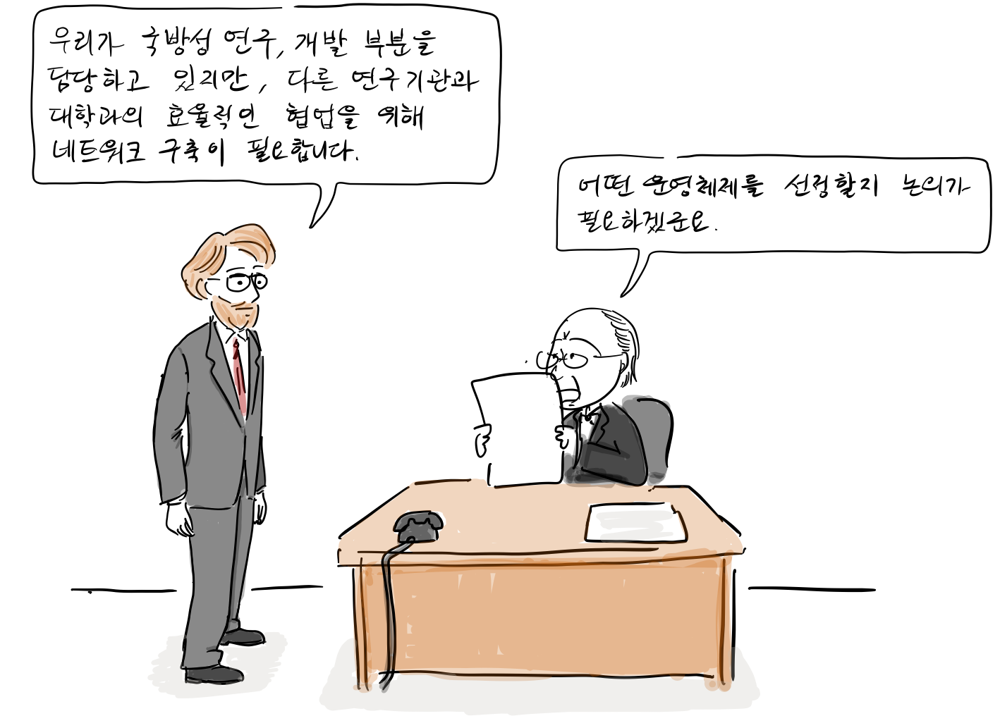

“우리가 국방성 연구, 개발 부분을 담당하고 있지만, 다른 연구 기관과 대학과의 효율적인 공동 연구를 위해 네트워크 구축이 필요합니다.”  
“어떤 운영체제를 선정할지 논의가 필요하겠군요.”

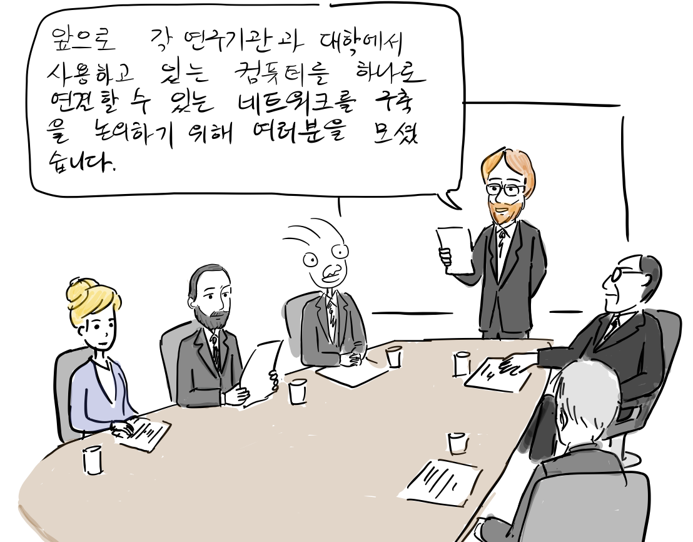

“앞으로 각 연구기관과 대학에서 사용하고 있는 컴퓨터를 하나로 연결할 수 있는 네트워크 구축을 논의하기 위해 여러분을 불렀습니다”

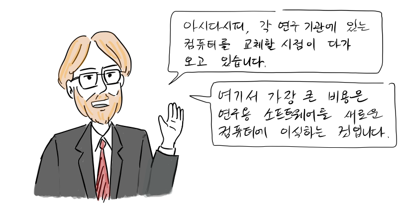  
“아시다시피, 각 연구 기관에 있는 컴퓨터를 교체할 시점이 다가오고 있습니다”  
“여기서 가장 큰 비용은 연구용 소프트웨어를 새로운 컴퓨터에 이식하는 것입니다.”

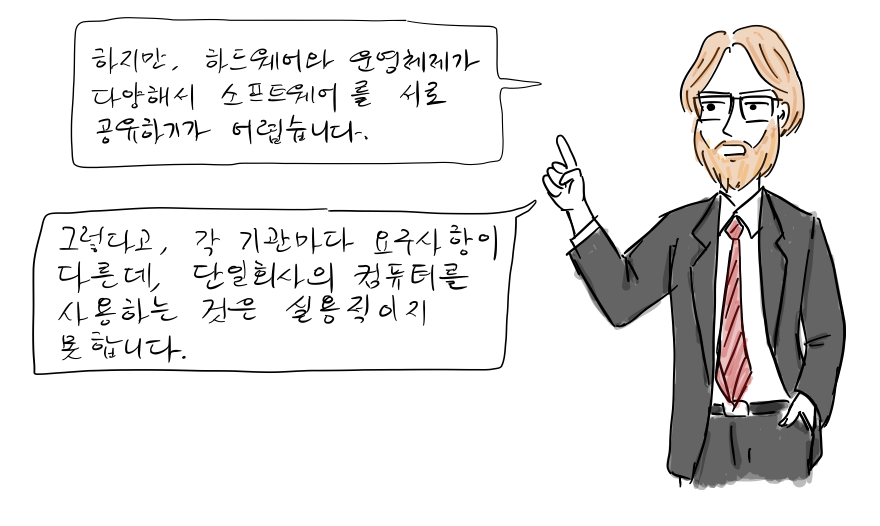  
“하지만, 하드웨어와 운영체제가 다양해서 소프트웨어를 서로 공유하기가 어렵습니다.” “그렇다고, 각 연구소 마다 요구사항이 다른데, 단일 회사의 컴퓨터를 사용하는 것은 실용적이지 못합니다”

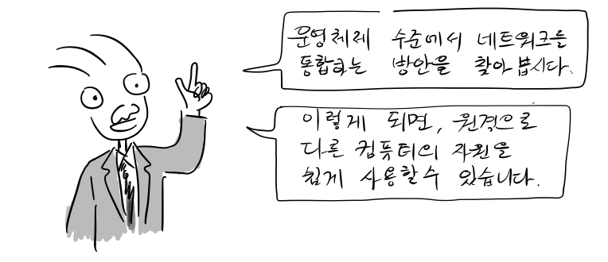  
“운영체제 수준에서 네트워크를 통합하는 방안을 찾아봅시다.”  
“이렇게 되면, 원격으로 다른 컴퓨터 소프트웨어를 쉽게 사용할 수 있습니다.”

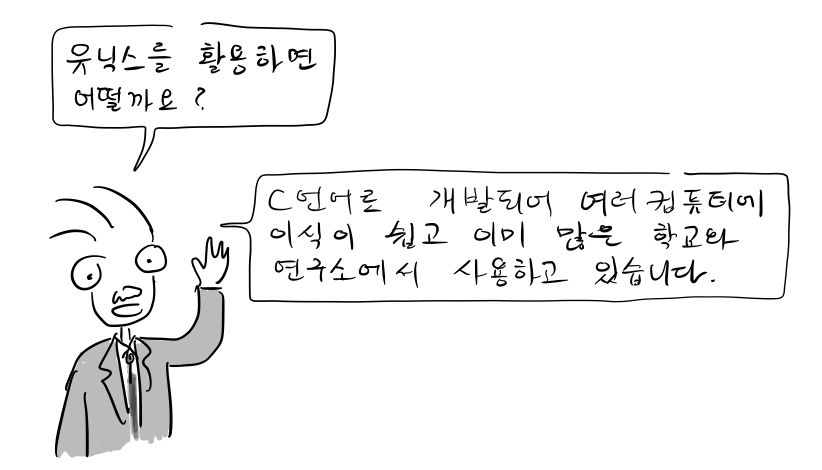  
“유닉스를 활용하는 어떨까요? C언어로 개발되어 여러 컴퓨터에 이식이 쉽고 이미 많은 학교와 연구소에서 사용하고 있습니다.”

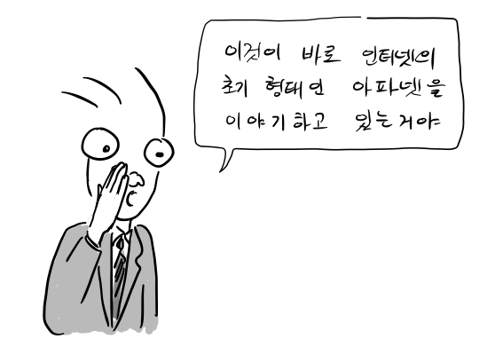  
“이것이 바로 인터넷의 초기 형태인 [아파넷(ARPANET)](https://ko.wikipedia.org/wiki/%EC%95%84%ED%8C%8C%EB%84%B7)을 이야기하는거야.”

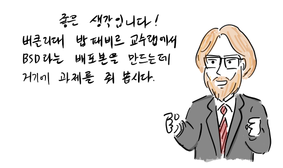  
“좋은 생각입니다. 버클리대 [밥 패브리](https://en.wikipedia.org/wiki/Bob_Fabry) 교수랩에서 BSD라는 유닉스 배포본을 만드는데, 과제를 맡겨봅시다.”

1979년 버클리대 밥 패브리 교수

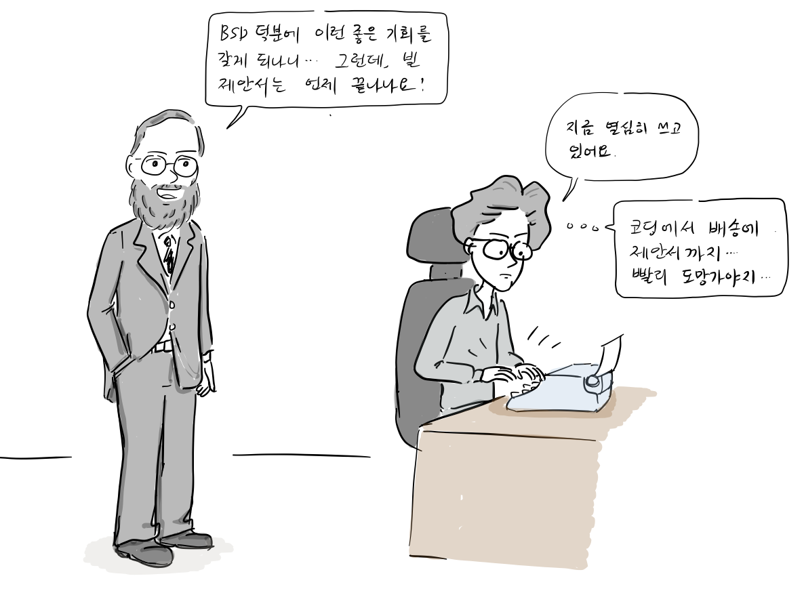

“BSD 덕분에 이렇게 좋은 기회를 갖게 되다니… 하하, 그런데, 빌, 제안서 다 썼나요?”  
“지금 열심히 쓰고 있어요.” “코딩에 배포본 배송에 제안서까지.. 빨리 도망가야지…”

마침내 1980년 4월 밥 패브리 교수는 미국방성 [고등 방위 연구 계획국(DARPA)](https://ko.wikipedia.org/wiki/%EB%B0%A9%EC%9C%84%EA%B3%A0%EB%93%B1%EC%97%B0%EA%B5%AC%EA%B3%84%ED%9A%8D%EA%B5%AD)과 유닉스 향상에 대한 계약을 체결한다.

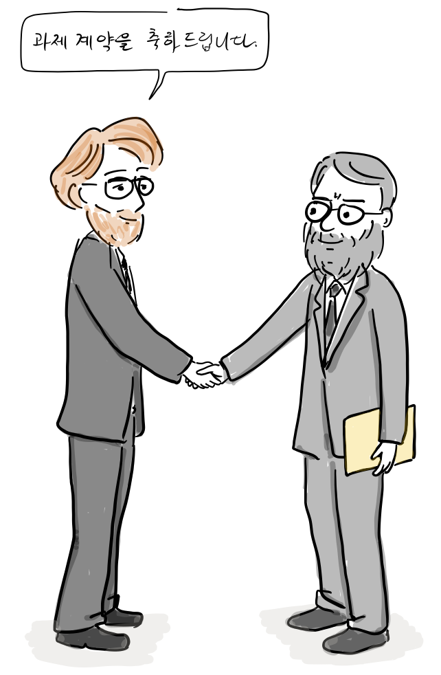

“과제 계약을 축하드립니다.”

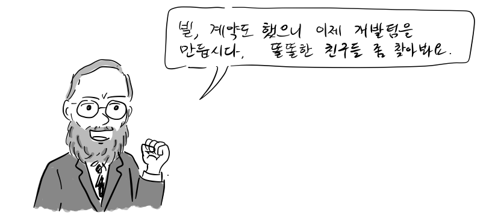

“빌, 계약도 했으니, 이제 개발팀을 만듭시다. 똘똘한 친구들 좀 찾아봐요.”

버클리대 밥 패브리 교수는 버클리대학내에 [CSRG(Computer Systems Research Group)](https://en.wikipedia.org/wiki/Computer_Systems_Research_Group)라는 연구 그룹을 만들어 과제를 수행하게 된다. 핵심 멤버로 [키스 보스틱(Keith Bostic)](https://en.wikipedia.org/wiki/Keith_Bostic), [빌 조이(Bill Joy)](https://ko.wikipedia.org/wiki/%EB%B9%8C_%EC%A1%B0%EC%9D%B4), [마셜 커크 매큐직(Marshall Kirk McKusick)](https://en.wikipedia.org/wiki/Marshall_Kirk_McKusick), [사무엘 J 래플러(Samuel J Leffler)](https://en.wikipedia.org/wiki/Samuel_J_Leffler), [마이클 J. 캐럴스(Michael J. Karels)](https://en.wikipedia.org/wiki/Michael_J._Karels) 등이 과제에 참여했다.

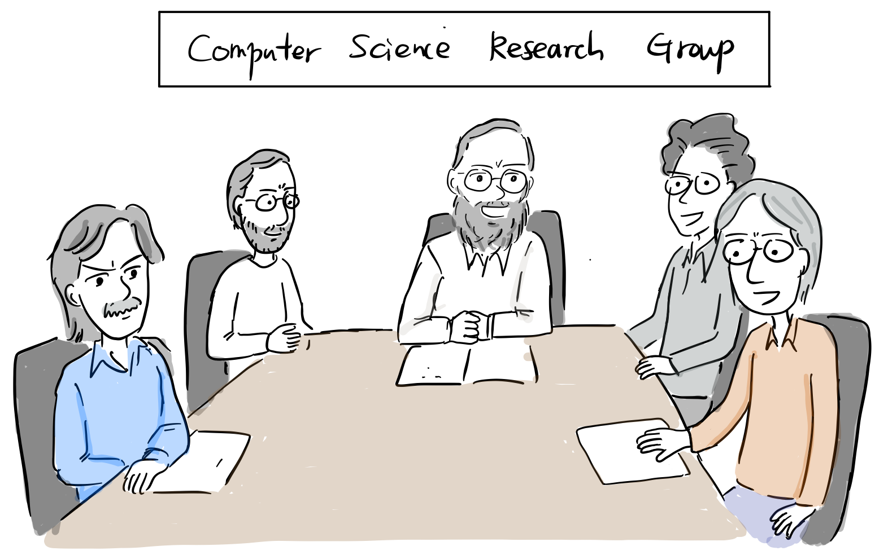

물론, 과제를 수행하는 일은 쉽지 않았다. 패브리 교수는 연구원들이 개발에 집중하도록 대학의 관료주의와 싸웠고 때로는 AT&T와 법적 문제 그리고 미국방성 [고등 방위 연구 계획국(DARPA)](https://ko.wikipedia.org/wiki/%EB%B0%A9%EC%9C%84%EA%B3%A0%EB%93%B1%EC%97%B0%EA%B5%AC%EA%B3%84%ED%9A%8D%EA%B5%AD)에서 계속 펀딩이 될 수 있도록 과제를 도왔다.

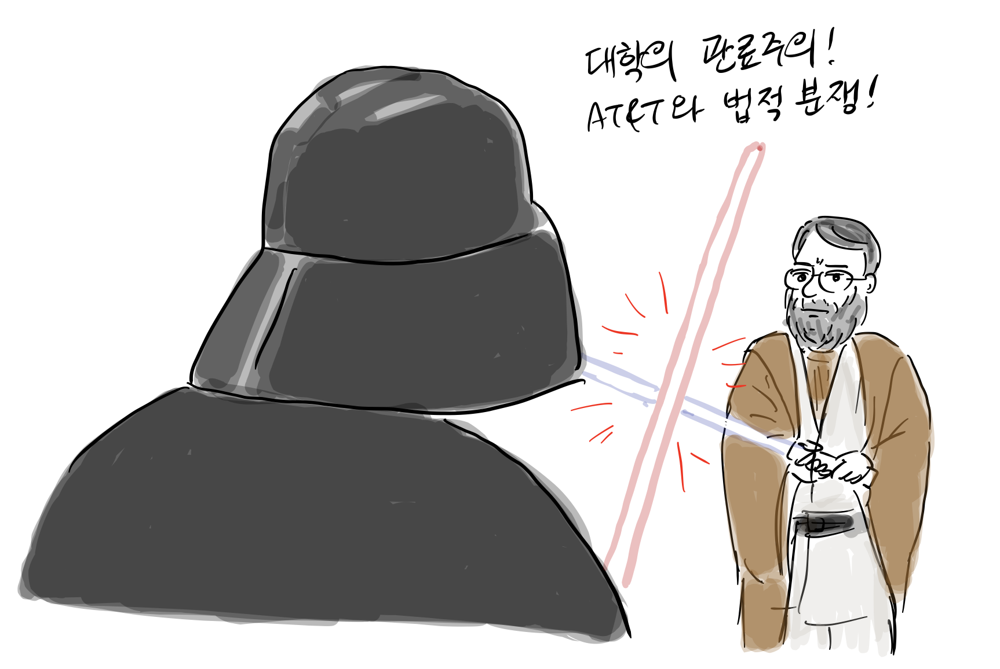

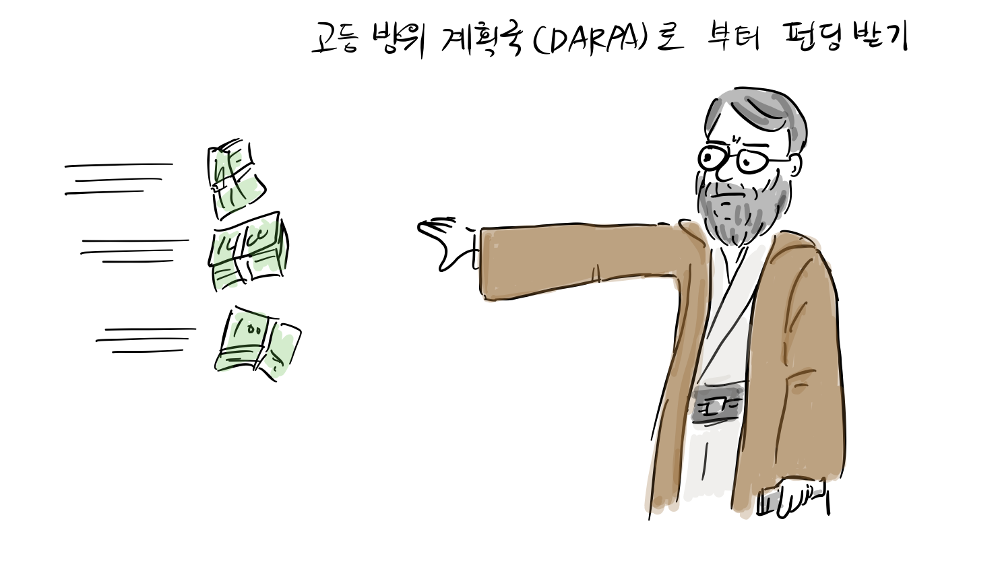

그리고, 작업 제어, 자동 리부팅, 1K블록 파일시스템 등을 포함해서 150개의 4BSD를 배포하였다. 4BSD에는 AT&T에 동의아래 유닉스 소스코드도 포함되었다.

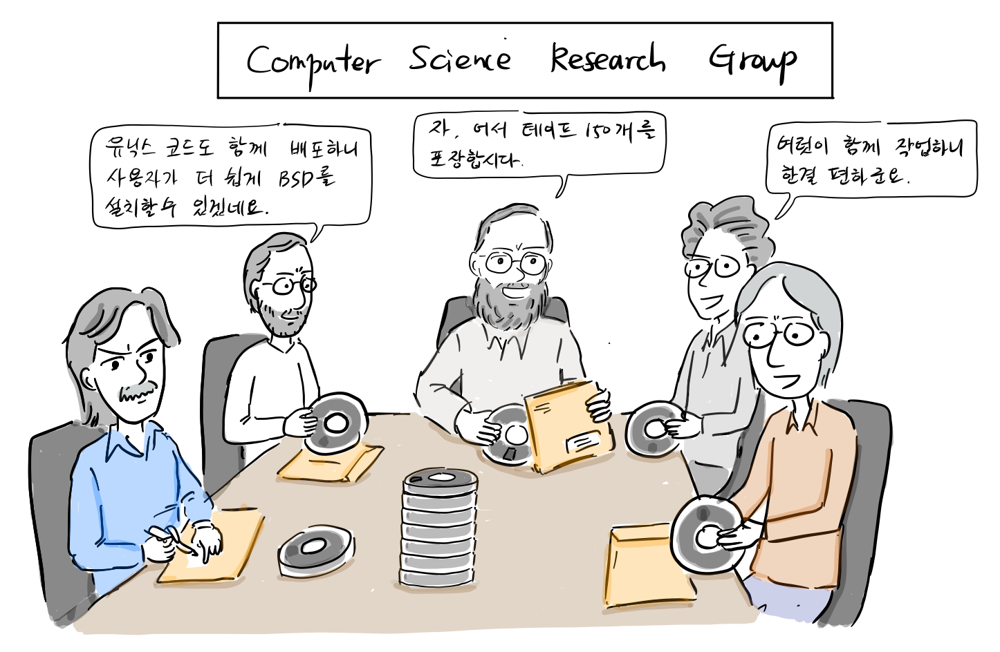

“자, 어서 테이프 150개를 포장합시다.”  
“유닉스 코드도 함께 배포하니 사용자가 더 쉽게 BSD를 설치할 수 있겠네요.”  
“여럿이 함께 작업하니 한결 편하군요.”

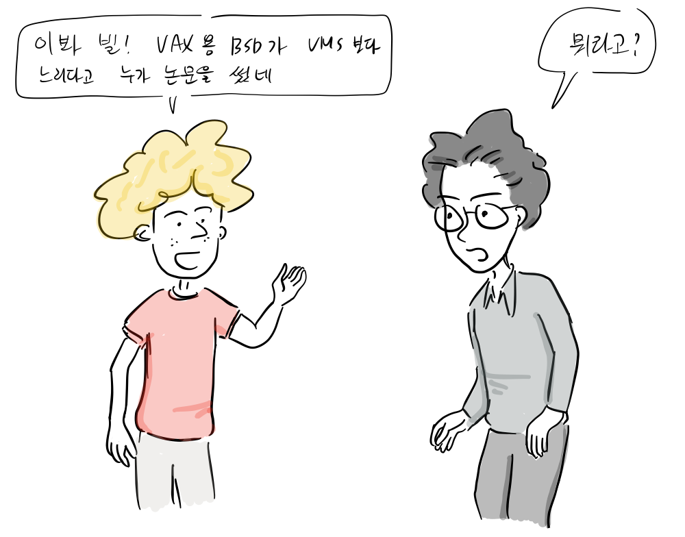

“이봐 빌, [VAX](https://ko.wikipedia.org/wiki/VAX)용 유닉스가 [VMS](https://en.wikipedia.org/wiki/OpenVMS)보다 느리다고 누가 논문을 썼네.”  
“뭐라고? “

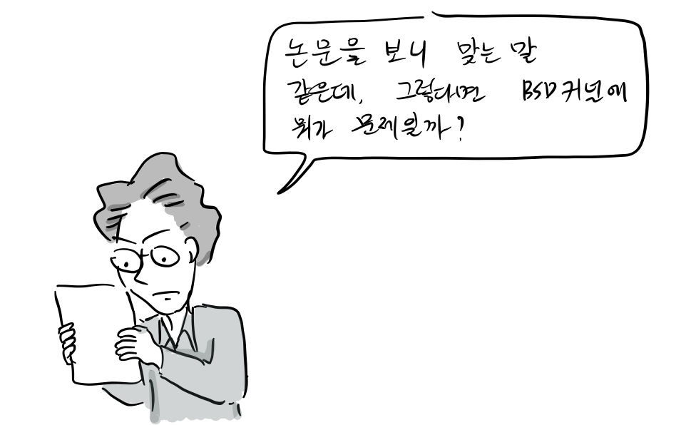

“논문을 보니 맞는 말 같은데, 유닉스 커널 코드 좀 봐야겠군.”

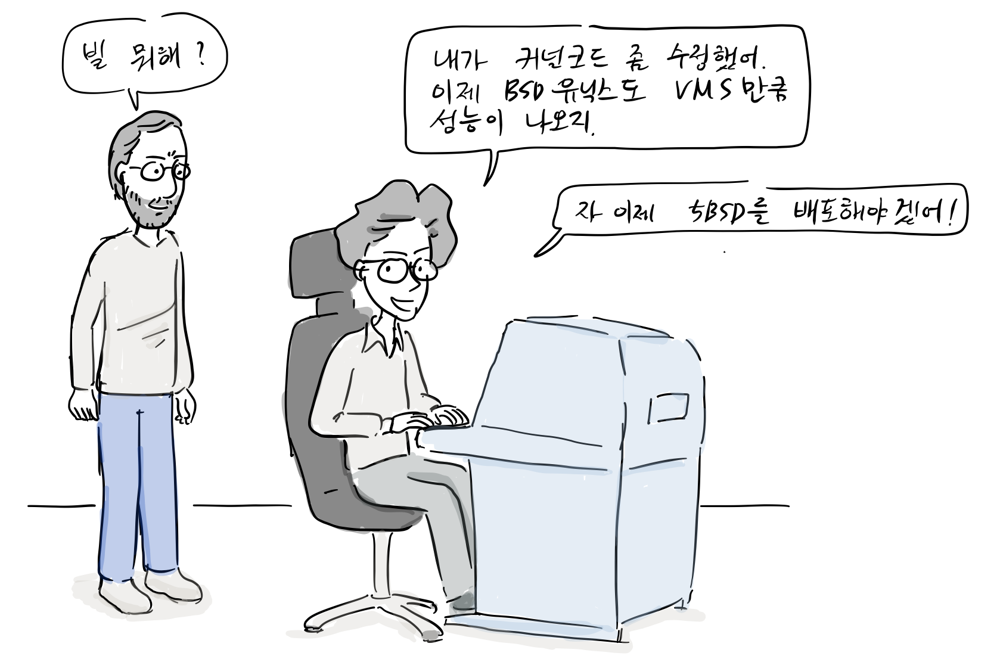

“뭐해?”  
“내가 커널 코드 좀 수정했어. 이제 BSD 유닉스도 VMS만큼 성능이 나와. 자 이제 5BSD를 배포해야겠어.”

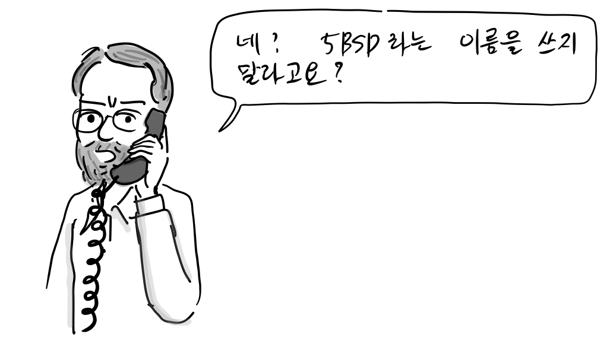

“네? 5BSD라는 이름을 쓰지 말라고요?”

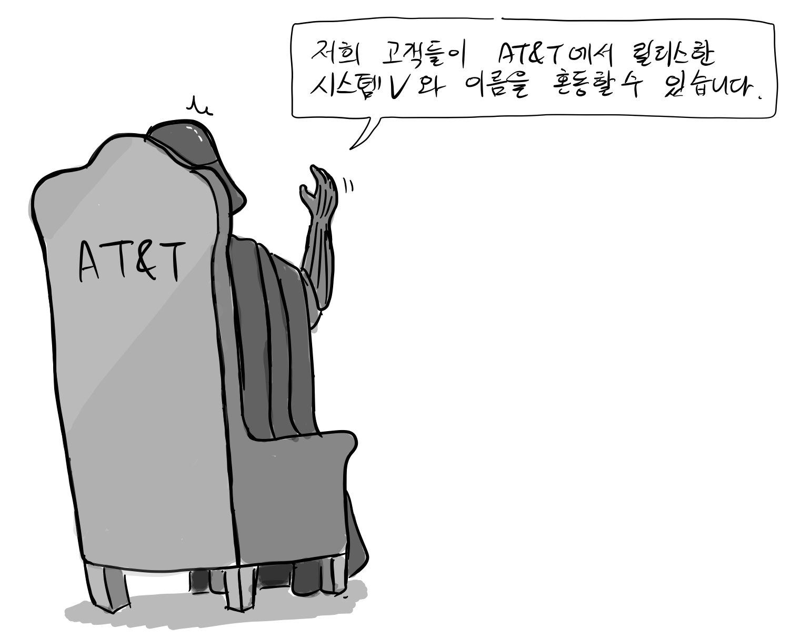

“저희 고객들이 AT&T에서 릴리스한 시스템V와 이름을 혼동할 수 있습니다.”

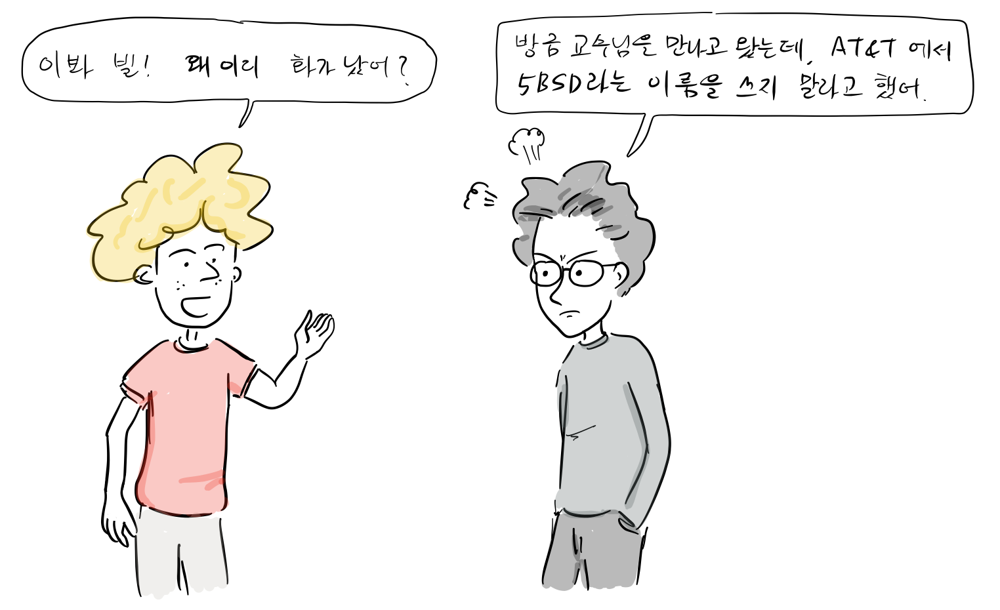

‘왜 이리 화가 났어?”  
“방금 교수님 만나고 왔는데, AT&T에서 5BSD라는 이름을 쓰지 말라고 했어.”

당시 BSD유닉스는 벨 연구소에서 만든 유닉스 코드를 기반으로 동작했다. 비록 많은 코드가 추가되고 수정되었어도 벨 연구소를 소유한 AT&T에서 언제라도 유닉스에 대한 권리를 주장할 수 있었다.

결국, 1981년 6월 버전5는 4.1BSD이라는 이름으로 출시된다.

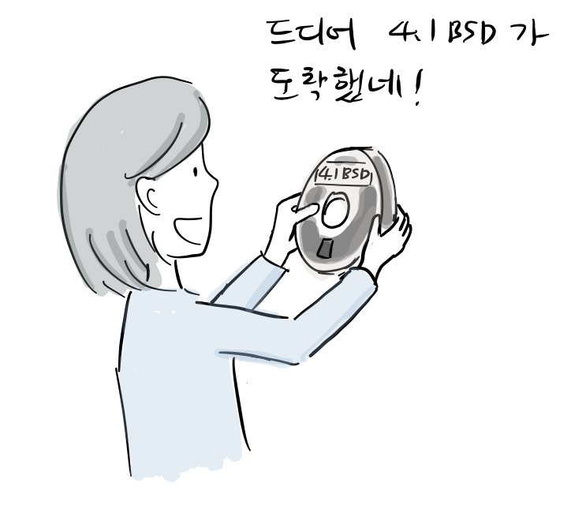  
“드디어 4.1BSD가 도착했네.”

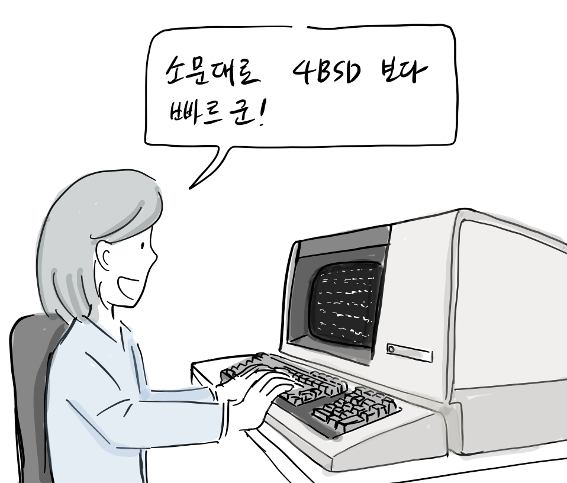

“소문대로 4BSD 보다는 훨씬 빠르군.”

이처럼 유닉스는 벨 연구소에서 개발되었지만, 소스코드와 함께 배포되었기 때문에 누구나 소스 코드를 고칠 수 있었다. 그 결과, 수 많은 외부 기여자에 의해 혁신이 이루어지고 유닉스 발전에 기여하게된다.

참고 문헌

-   ANDREW LEONARD, [BSD Unix: Power to the people, from the code](https://www.salon.com/2000/05/16/chapter_2_part_one/), 2000
-   마샬 커크 맥퀴식, [버클리 유닉스의 20년, 오픈소스 혁명의 목소리, 한빛출판사](http://www.hanbit.co.kr/store/books/look.php?p_code=E5329835060), 2013
-   https://en.wikipedia.org/wiki/Computer\_Systems\_Research\_Group

만화 중 잘못된 부분이나 추가할 내용이 있으면 [만화 원고](https://docs.google.com/document/d/1wOYXEvEPN7XQIys-z0ZPbXnxwcquRF229KG_YgJmpgo/edit?usp=sharing)에 직접 의견을 남겨주시면 고맙겠습니다. 그 외 전반적인 의견은 이 블로그에 바로 답글로 남겨주세요. [다음 5화에서는 TCP/IP 개발이 소개될 예정입니다.](http://joone.net/2018/01/21/11-bsd-%EC%9C%A0%EB%8B%89%EC%8A%A4-5-%ED%99%94-tcp-ip-%EA%B0%9C%EB%B0%9C/)
