-   [BSD 유닉스 1화 – UC 버클리로 간 유닉스 코드](http://joone.net/2017/12/16/%EC%9E%90%EC%9C%A0%EB%A1%9C%EC%9D%98-%ED%88%AC%EC%9F%81-bsd-%EC%9C%A0%EB%8B%89%EC%8A%A4-1%ED%99%94/)
-   [BSD 유닉스 2화 – vi 에디터의 탄생](http://joone.net/2017/12/23/11-%EC%9E%90%EC%9C%A0%EB%A1%9C%EC%9D%98-%ED%88%AC%EC%9F%81-bsd-%EC%9C%A0%EB%8B%89%EC%8A%A4-2%ED%99%94/)
-   [BSD 유닉스 3화 – BSD 유닉스 시작](http://joone.net/2018/01/02/11-bsd-%EC%9C%A0%EB%8B%89%EC%8A%A4-3%ED%99%94-bsd-%EC%9C%A0%EB%8B%89%EC%8A%A4-%EC%8B%9C%EC%9E%91/)
-   [BSD 유닉스 4화 – CSRG(Computer Systems Research Group) 결성](http://joone.net/2018/01/14/11-bsd-%EC%9C%A0%EB%8B%89%EC%8A%A4-4%ED%99%94-csrgcomputer-science-research-group-%EA%B2%B0%EC%84%B1/)

**TCP/IP 통합**  
[아파넷](https://ko.wikipedia.org/wiki/%EC%95%84%ED%8C%8C%EB%84%B7)에서 가장 중요한 부분은 바로 네트워크 프로토콜을 설계하고 구현하는 작업이였다. 미국방성 [고등 방위 연구 계획국(DARPA)](https://ko.wikipedia.org/wiki/%EB%B0%A9%EC%9C%84%EA%B3%A0%EB%93%B1%EC%97%B0%EA%B5%AC%EA%B3%84%ED%9A%8D%EA%B5%AD)은 군수업체 중 하나인 [BBN Technologies](https://en.wikipedia.org/wiki/BBN_Technologies)에게 여러 플랫폼에 [TCP/IP](https://ko.wikipedia.org/wiki/%EC%9D%B8%ED%84%B0%EB%84%B7_%ED%94%84%EB%A1%9C%ED%86%A0%EC%BD%9C_%EC%8A%A4%EC%9C%84%ED%8A%B8)를 구현하도록 했다. TCP/IP 구현이 어느 정도 진행된 후, UC 버클리대학 [CSRG(Computer Systems Research Group)](https://en.wikipedia.org/wiki/Computer_Systems_Research_Group)는 [BBN Technologies](https://en.wikipedia.org/wiki/BBN_Technologies)이 구현한 TCP/IP 코드를 BSD 유닉스에 통합하기 시작했다.

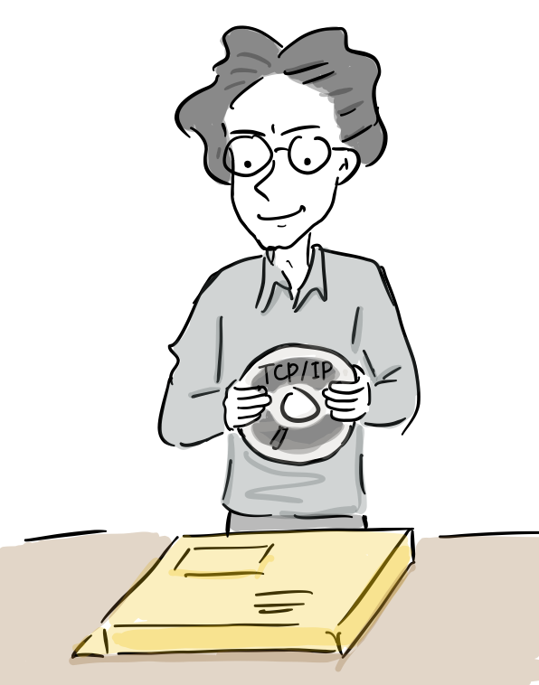

“드디어 TCP/IP 소스코드가 도착했네. 어디 BSD에 적용해볼까”

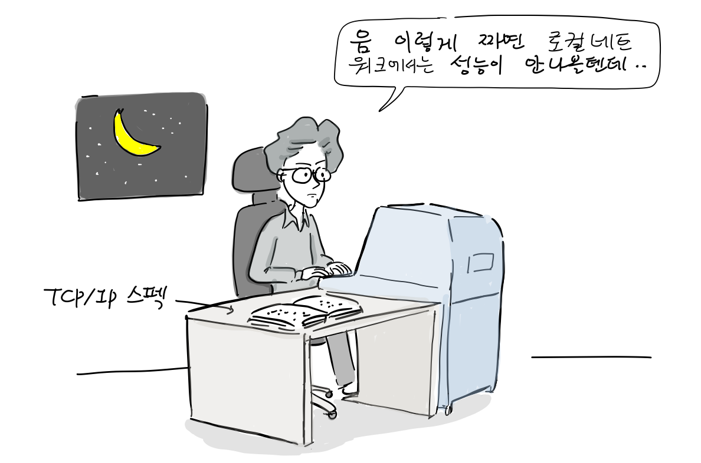

“이런식으로 구현하면 로컬 네트워크에서는 성능이 안나올 텐데.. 내가 좀 고쳐야겠다.”

**1980년 초 TCP/IP 회의**

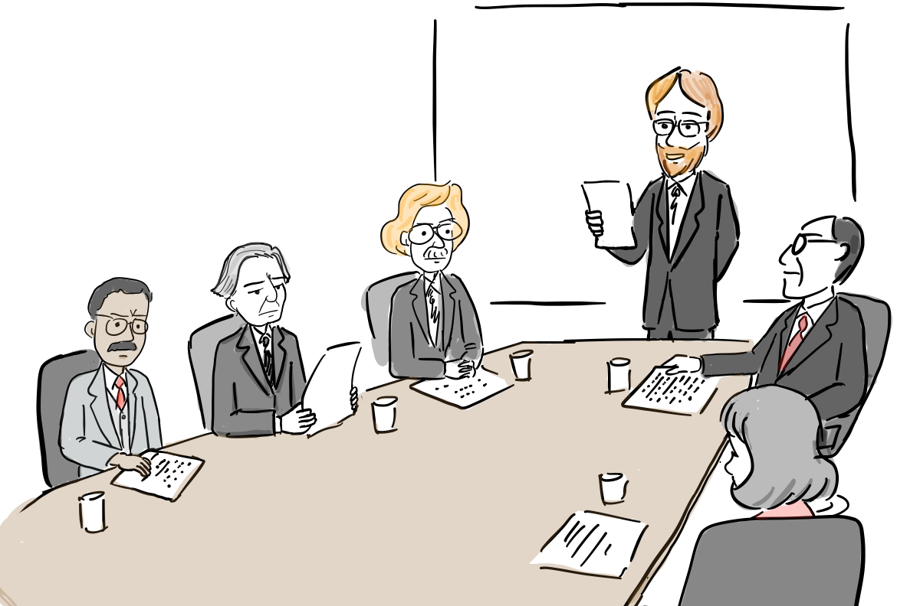  
“제가 모이자고 한 이유는 CSRG에서 BBN Technologies에서 개발 중인 TCP/IP 코드를 받아 일부 수정을 했는데, 성능이 무척 향상되었다는 보고를 받았기 때문입니다.”

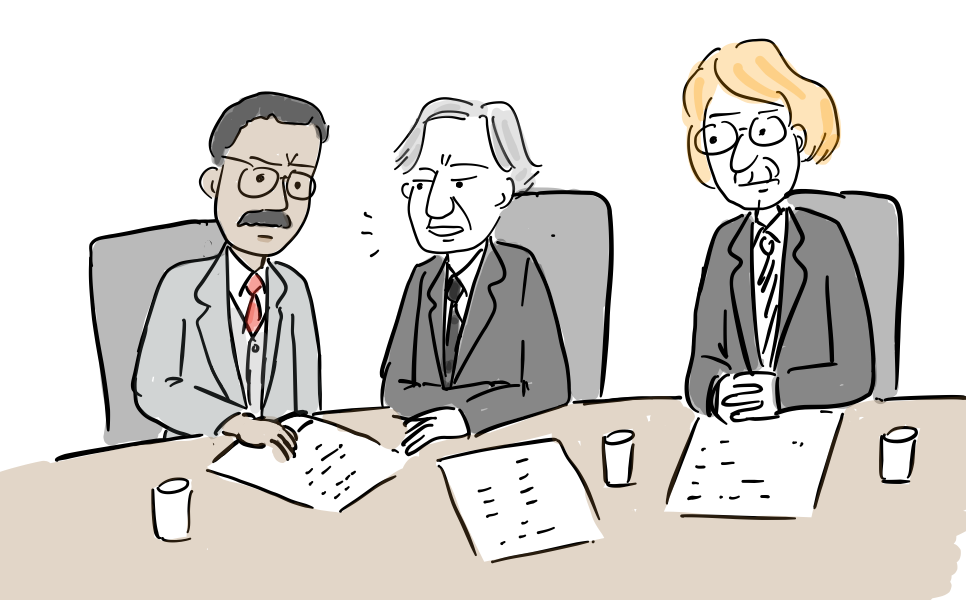  
“어떻게 이게 가능한가요?”

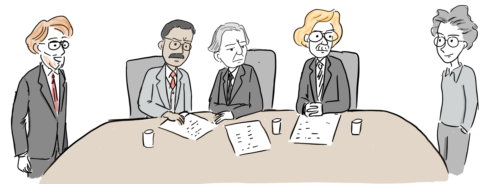  
“늦어져 죄송합니다. [빌 조이](https://ko.wikipedia.org/wiki/%EB%B9%8C_%EC%A1%B0%EC%9D%B4)입니다”  
“때 마침 잘 왔어요.”

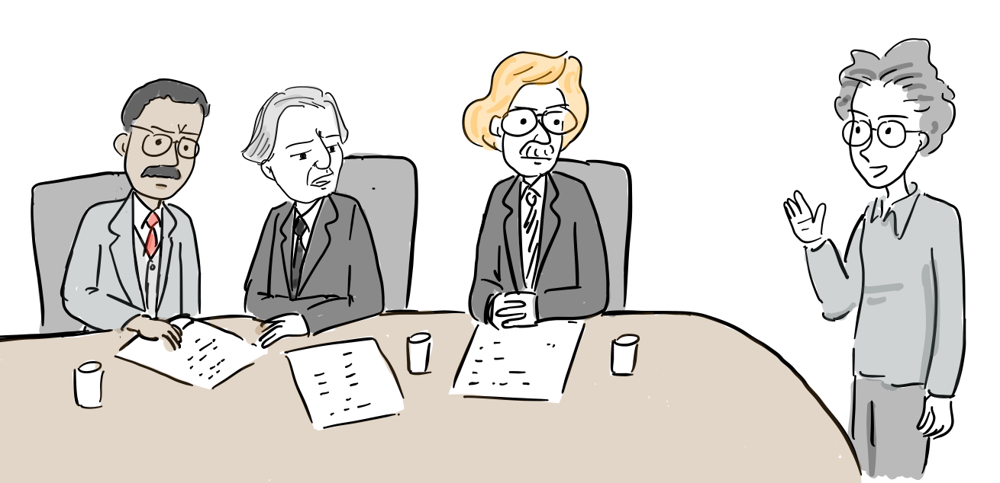  
“어떻게 이렇게 성능이 좋아졌나요?”  
“아, 제가 소스코드를 보니 이대로 적용해서는 안될 것 같더군요. 로컬 네트워크에서는 많은 컴퓨터가 동시에 사용해서 높은 대역폭이 필요해서 좀 더 성능을 높일 수 있는 방안을 구현했지요.”

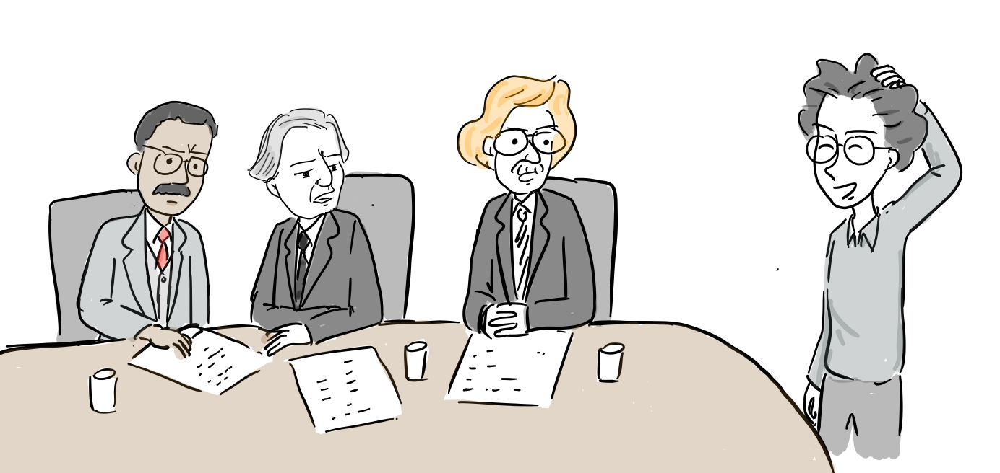  
“어떻게 구현했나요?”  
“아.. 그냥 TCP/IP 스펙을 보고 구현했어요.”

BBN Technologies가 BSD용 TCP/IP를 시작했지만, CSRG멤버들이 초기에 받아 구현한 TCP/IP 코드가 4.2BSD를 통해 릴리스되었다. BBN은 자신들이 개발한 TCP/IP를 4.3BSD에 적용하려고 했지만, CSRG가 구현한 TCP/IP가 더 안정적으로 동작하여 최종적으로 BSD에 적용되었다. 그리고, 1982년 빌 조이는 [썬 마이크로시스템스](https://ko.wikipedia.org/wiki/%EC%8D%AC_%EB%A7%88%EC%9D%B4%ED%81%AC%EB%A1%9C%EC%8B%9C%EC%8A%A4%ED%85%9C%EC%A6%88) 창업을 위해 CSRG를 떠난다.

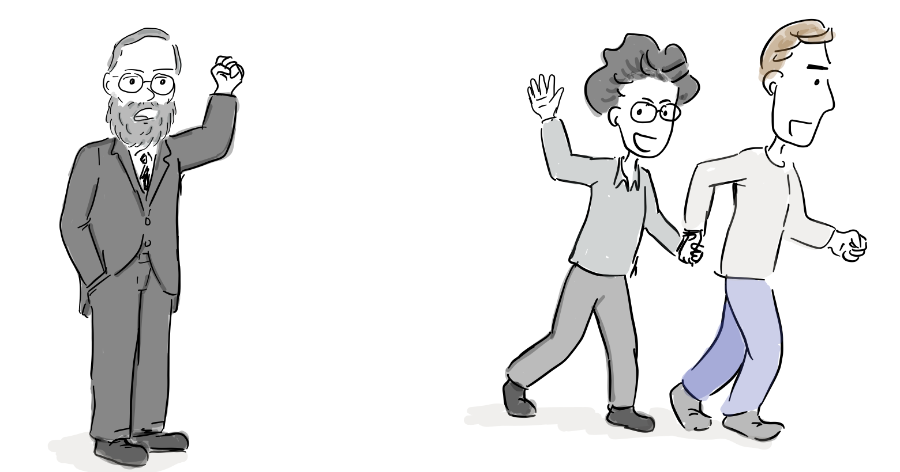

“과제는 끝내고 가야지!”  
“교수님 죄송합니다. 레플러가 저 대신 BSD유닉스 릴리스를 맡을 겁니다.”  
“자, 진짜 유닉스 머신을 만들러 가자!”

하지만, 빌 조이는 CSRG를 떠난 후에도, [IPC](https://en.wikipedia.org/wiki/Inter-process_communication) 구현과 커널 코드가 포팅이 용이하도록 수정하는 작업을 마무리 지었다.

“작업하던 IPC구현은 빨리 끝내자. 어차피 [SunOS](https://en.wikipedia.org/wiki/SunOS)에도 추가해야 하니까..”

빌 조이가 떠나자 [사무엘 J 래플러(Samuel J Leffler)](https://en.wikipedia.org/wiki/Samuel_J_Leffler)가 책임자가 되었다. 사무엘은 새 [시그널](https://en.wikipedia.org/wiki/Signal_\(IPC\))을 구현하고 [마셜 커크 매큐직(Marshall Kirk McKusick)](https://en.wikipedia.org/wiki/Marshall_Kirk_McKusick)가 구현한 파일시스템과 TCP/IP 등을 추가해서 1983년 8월 [4.2BSD](http://www.cilinder.be/docs/bsd/4.2BSD_Unix_system_manual.pdf)를 발표한다.

“4.2BSD의 주요 기능은 시그널과 TCP/IP!”

사무엘이 4.2BSD를 완성하고 [루카스아츠](https://ko.wikipedia.org/wiki/%EB%A3%A8%EC%B9%B4%EC%8A%A4%EC%95%84%EC%B8%A0)사로 떠나자, 후임으로 [마이클 J. 캐럴스(Michael J. Karels)](https://en.wikipedia.org/wiki/Michael_J._Karels)가 개발을 책임지게 된다.

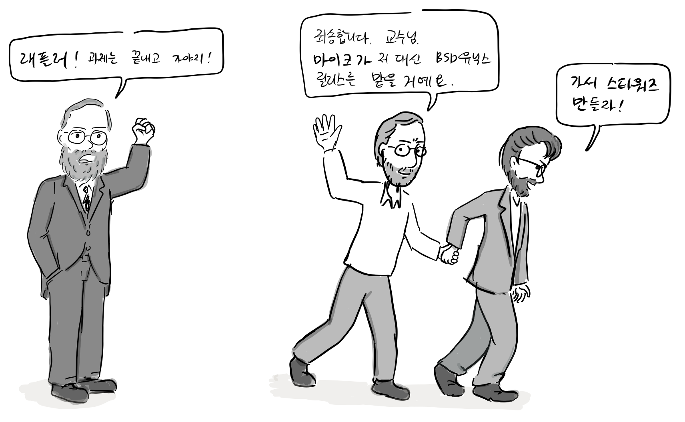

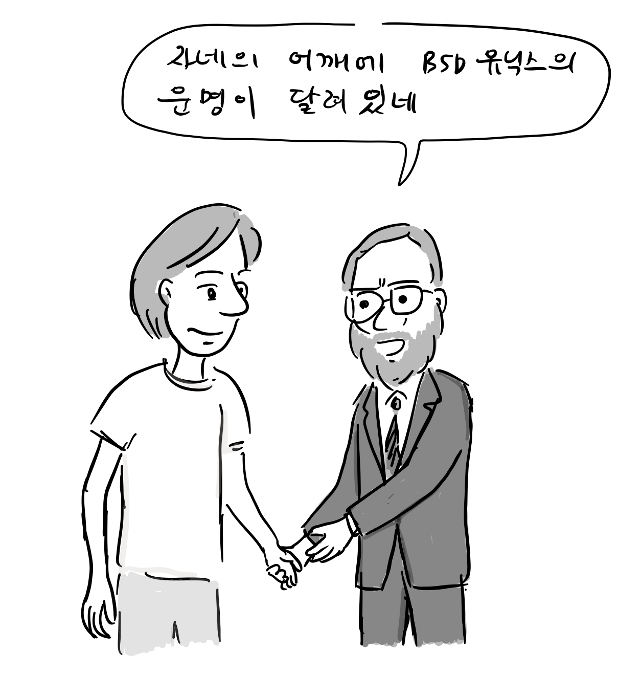

4.2BSD는 인기가 많아서 1000개 이상 라이선스 계약을 따냈는데, 당시 AT&T유닉스에 TCP/IP 기능이 없는 것도 큰 이유 중 하나였다.

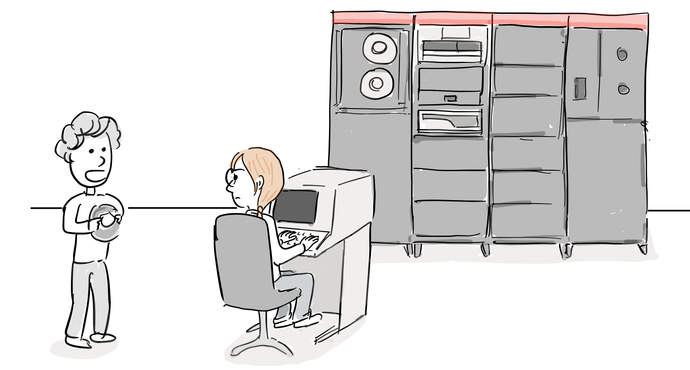

“아직도 TCP/IP가 안되는 AT&T 유닉스를 쓰고 있나요? 4.2BSD를 써보세요.”

곧바로 AT&T 유닉스도 BSD에서 추가된 네트워크 기능을 추가한다.

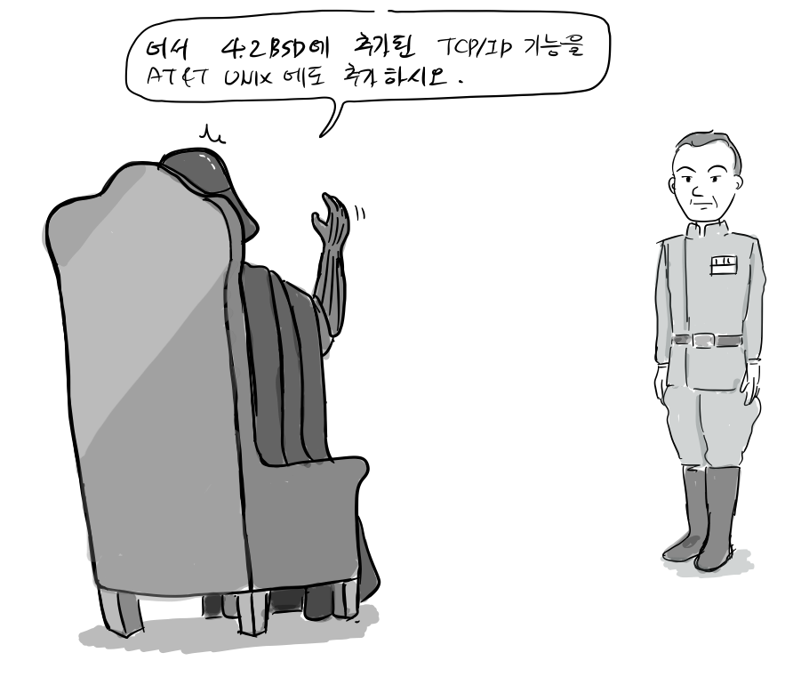  
“4.2BSD에 추가된 TCP/IP를 AT&T 유닉스에도 추가하시요.”

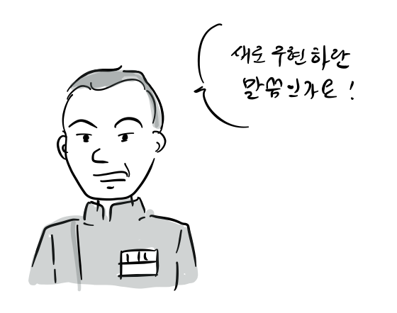  
“새로 구현하란 말씀인가요?”

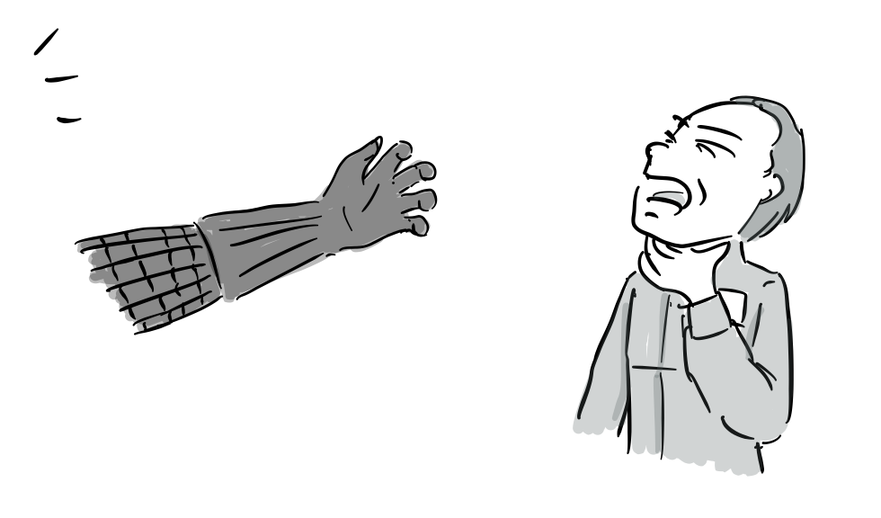  
“크… 당신이 TCP/IP를 새로 구현할 수 있겠는가?”  
“으…. 아닙니다. 4.2BSD에서 TCP/IP 코드를 가져와서 바로 적용하겠습니다.”

다음에 계속…

참고 문헌

-   ANDREW LEONARD, [BSD Unix: Power to the people, from the code](https://www.salon.com/2000/05/16/chapter_2_part_one/), 2000
-   마샬 커크 맥퀴식, [버클리 유닉스의 20년, 오픈소스 혁명의 목소리, 한빛출판사](http://www.hanbit.co.kr/store/books/look.php?p_code=E5329835060), 2013
-   https://en.wikipedia.org/wiki/Computer\_Systems\_Research\_Group
-   https://www.freebsd.org/doc/en/books/design-44bsd/overview-network-implementation.html

만화 중 잘못된 부분이나 추가할 내용이 있으면 [만화 원고](https://docs.google.com/document/d/17yt7X7nfoNI9tRy1wMjhAUk7oLw9WwzWu594jjVXikc/edit?usp=sharing)에 직접 의견을 남겨주시면 고맙겠습니다. 그 외 전반적인 의견은 이 블로그에 바로 답글로 남겨주세요. [다음 6화에서는 CSRG와 AT&T와의 법정 다툼과 어떻게 BSD가 자유롭게 배포가 가능했는지를 소개할 예정입니다.](http://joone.net/2018/01/29/11-bsd-%EC%9C%A0%EB%8B%89%EC%8A%A4-6%ED%99%94-%EC%9E%90%EC%9C%A0%EB%A1%9C%EC%9D%98-%ED%88%AC%EC%9F%81/)
