-   [BSD 유닉스 1화 – UC 버클리로 간 유닉스 코드](http://joone.net/2017/12/16/%EC%9E%90%EC%9C%A0%EB%A1%9C%EC%9D%98-%ED%88%AC%EC%9F%81-bsd-%EC%9C%A0%EB%8B%89%EC%8A%A4-1%ED%99%94/)
-   [BSD 유닉스 2화 – vi 에디터의 탄생](http://joone.net/2017/12/23/11-%EC%9E%90%EC%9C%A0%EB%A1%9C%EC%9D%98-%ED%88%AC%EC%9F%81-bsd-%EC%9C%A0%EB%8B%89%EC%8A%A4-2%ED%99%94/)
-   [BSD 유닉스 3화 – BSD 유닉스 시작](http://joone.net/2018/01/02/11-bsd-%EC%9C%A0%EB%8B%89%EC%8A%A4-3%ED%99%94-bsd-%EC%9C%A0%EB%8B%89%EC%8A%A4-%EC%8B%9C%EC%9E%91/)
-   [BSD 유닉스 4화 – CSRG(Computer Systems Research Group) 결성](http://joone.net/2018/01/14/11-bsd-%EC%9C%A0%EB%8B%89%EC%8A%A4-4%ED%99%94-csrgcomputer-science-research-group-%EA%B2%B0%EC%84%B1/)
-   [BSD 유닉스 5화 – TCP/IP 개발](http://joone.net/2018/01/21/11-bsd-%EC%9C%A0%EB%8B%89%EC%8A%A4-5-%ED%99%94-tcp-ip-%EA%B0%9C%EB%B0%9C/)

**자유로의 투쟁  
**초기 유닉스 라이센스 비용은 카피당 $99로 저렴했고 소스코드도 함께 제공되었다. 그 이유는 AT&T가 IBM과 50년대 맺은 협약 때문인데, IBM은 전화 사업에 그리고 AT&T는 컴퓨터 사업에 진출할 수 없었기 때문이다. 미국방성 [고등 방위 연구 계획국(DARPA)](https://ko.wikipedia.org/wiki/%EB%B0%A9%EC%9C%84%EA%B3%A0%EB%93%B1%EC%97%B0%EA%B5%AC%EA%B3%84%ED%9A%8D%EA%B5%AD)도 유닉스가 소스코드와 함께 배포되는 부분을 중요하게 생각했다. 이러한 이유로 인터넷 구축에 [DEC](https://ko.wikipedia.org/wiki/%EB%94%94%EC%A7%80%ED%84%B8_%EC%9D%B4%ED%81%85%EB%A8%BC%ED%8A%B8_%EC%BD%94%ED%8D%BC%EB%A0%88%EC%9D%B4%EC%85%98)가 개발한 [VMS](https://ko.wikipedia.org/wiki/OpenVMS) 대신 [BSD](https://ko.wikipedia.org/wiki/BSD) 유닉스를 선택했다\[1\].

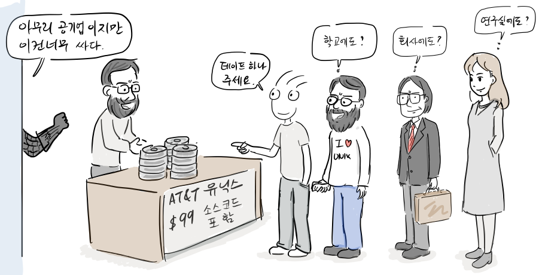

하지만, 1984년 AT&T가 여러 회사로 쪼개지면서 유닉스를 상업적으로 판매할 수 있는 길이 열렸고, AT&T는 갑자기 유닉스 가격을 $99에서 $250,000로 올렸다\[1\].

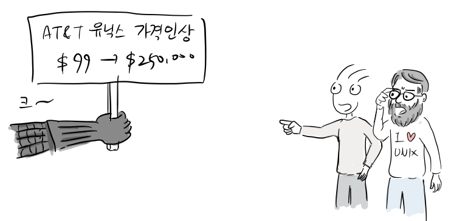

이때까지 BSD 사용하려면 AT&T 유닉스 라이선스를 갖고 있어야했다. 하지만, AT&T가 유닉스 라이선스 가격을 올리자, 몇몇 회사들이 BSD 유닉스에서 네트워킹 코드만을 배포하기를 요청했다.

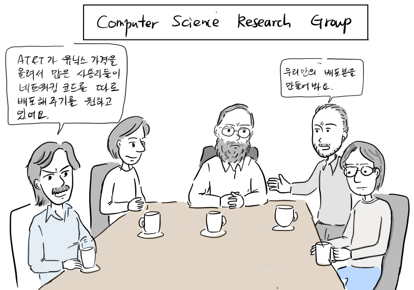

“AT&T가 유닉스 라이선스 가격을 올려서 많은 사용자들이 BSD의 네트워킹 코드와 관련 툴을 따로 배포해주기를 원하고 있어요.”  
“이번 기회에 한번 우리가 개발한 네트워킹 코드와 툴만 따로 배포본을 만들어봐요”

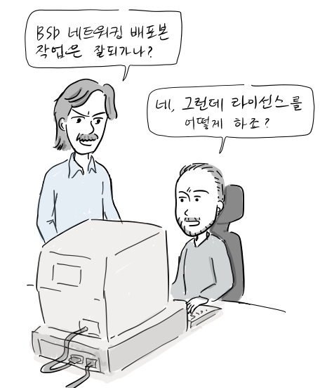

“BSD 네트워킹 배포본 작업은 잘 되가나?”  
“네, 그런데, 라이선스를 어떻게 하죠?”

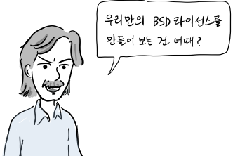

“우리만의 BSD라이선스를 만들어보는건 어때? 코드를 가져다가 맘대로하세요. 대신 이 코드로 제품을 만들거나 소스코드를 재배포하면 우리 저작권만 메뉴얼 같은데 표기하면 되는거지.”

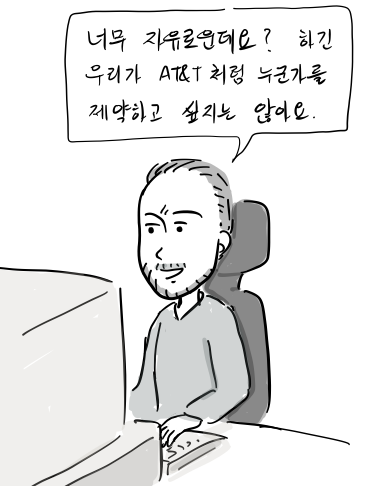

“너무 자유로운데요? 하긴, 우리가 AT&T처럼 누군가를 제약하고 싶지는 않아요.”

[CSRG(Computer Systems Research Group)](https://en.wikipedia.org/wiki/Computer_Systems_Research_Group)는 BSD에서 네트워킹 코드와 관련 유틸리티만을 묶어서 1989년 6월에 BSD Networking Release(Net/1)을 공개한다. 이는 AT&T 유닉스를 라이선스하지 않는 사용자를 위해 BSD라이선스로 배포한다. BSD라이선스는 아주 자유로운데, 로열티 없이 수정한 코드를 바이너리나 소스코드 형태로 배포할 수 있었고, 유일한 요구사항은 제품 문서에 BSD코드에 대한 저작권을 명시하기만 하면 됐다.

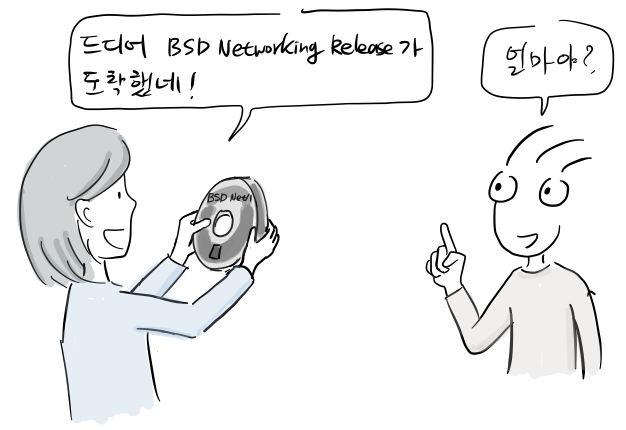

“드디어 BSD Networking Release를 받았어.“  
“얼마야?”

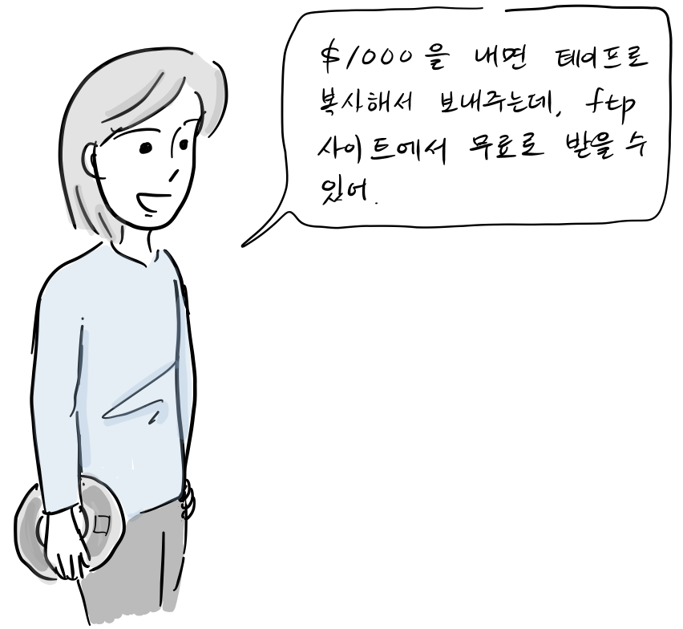

“$1000을 내면 테이프로 복사해서 보내주는데, ftp 사이트에서도 그냥 무료로 받을 수 있어. 놀라운 것은 별도의 로열티 없이 우리맘대로 코드를 수정해서 배포할 수도 있지.”

한편, CSRG에서는

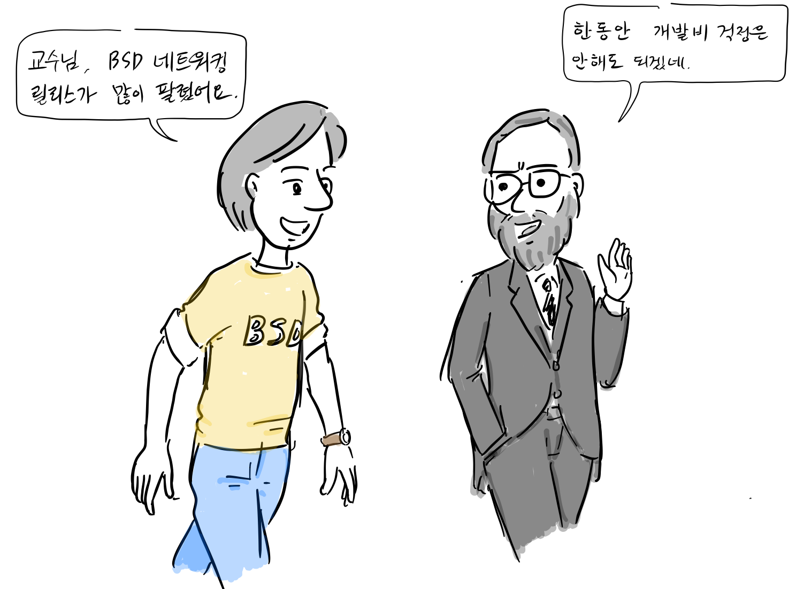

“교수님, BSD 네트워킹 릴리스가 많이 팔렸어요.”  
“과제비에 판매비까지 한동안 개발비 걱정은 안해도 되겠네.”

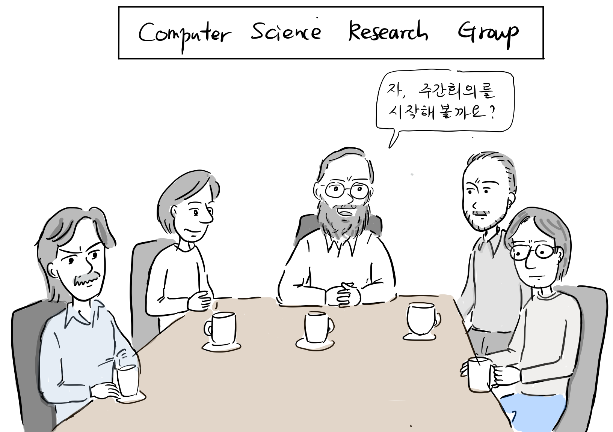

“자, 주간 회의를 시작해볼까?”

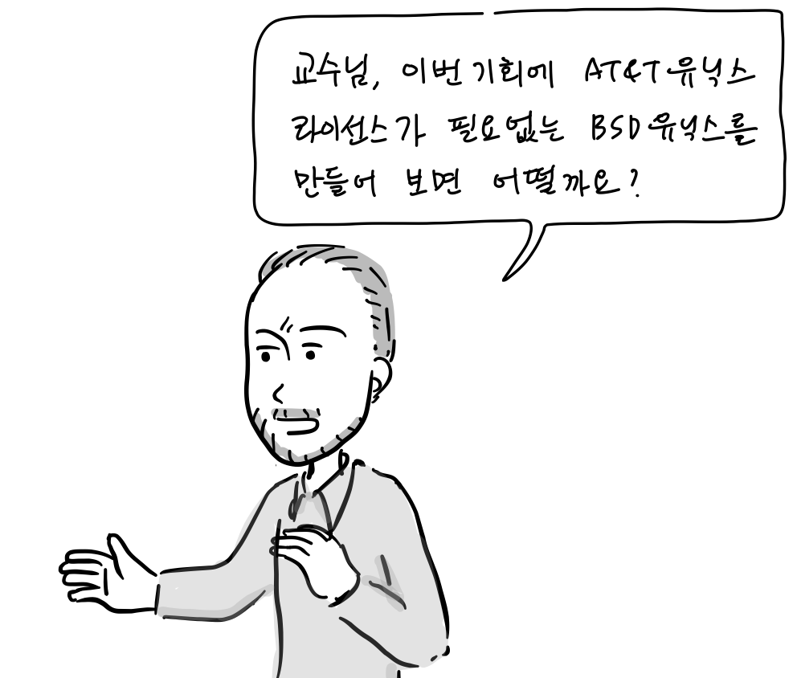

“교수님, 이번 기회에 AT&T 유닉스 라이선스가 필요 없는 BSD 유닉스를 만들어 보면 어떨까요?”

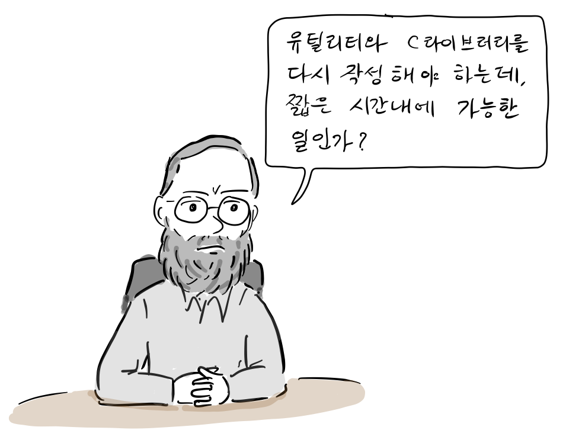

“더 이상 AT&T에 끌려다닐 수 없지. 어차피 커널은 우리가 많이 고쳐서 다르고 유틸리티와 C 라이브러리를 다시 만들어야 하는데, 짧은 시간내에 가능한 일인가?”

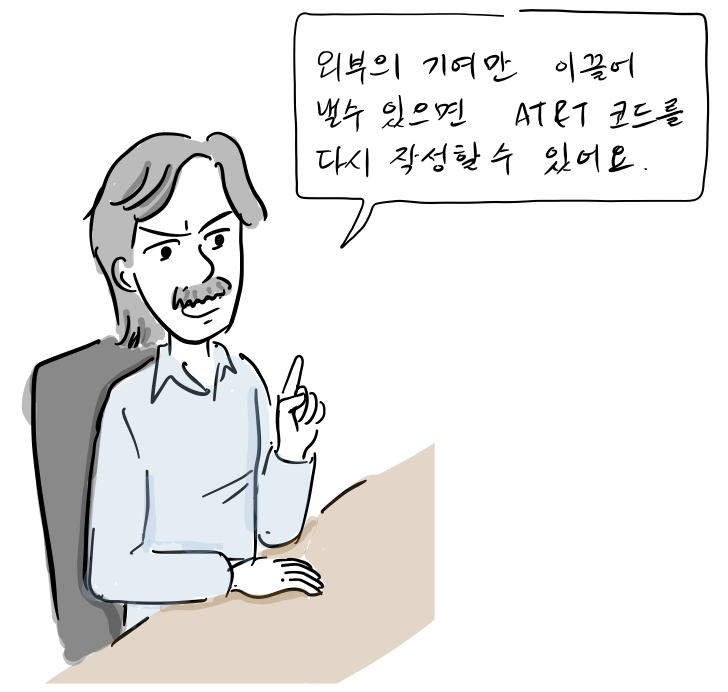

“한번 시도해 보죠. 외부의 기여만 이끌어낼 수 있으면 AT&T 코드를 다시 작성할 수 있어요.”

결국, CSRG는 AT&T가 작성한 툴과 C 라이브러리를 다시 작성하기로 결정한다. 다행히 외부 기여자의 참여로 18개월동안 대부분의 코드를 다시 작성할 수 있었다.

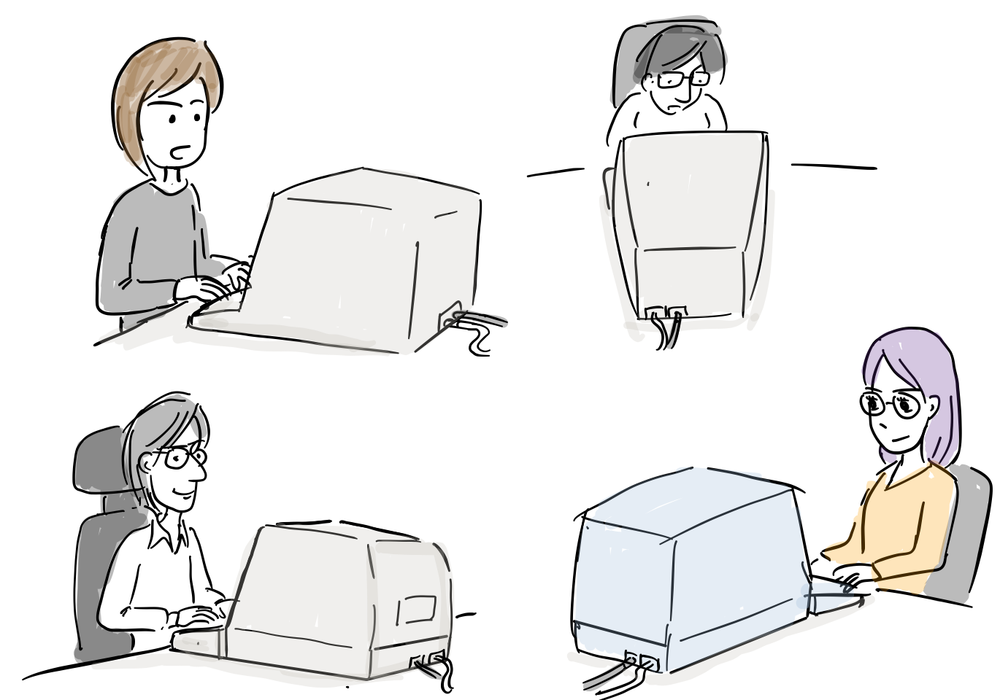

AT&T 유닉스에서 작성된 대부분의 코드를 제거한 후, 1991년 6월에 드디어 완전히 자유로운 BSD유닉스가 출시된다. 여전히 복사 비용인 1000$만 내면 BSD 유닉스 소스코드를 테이프로 받을 수 있었고, 심지어 ftp 사이트에서 무료로 다운로드 받을 수 있었다.

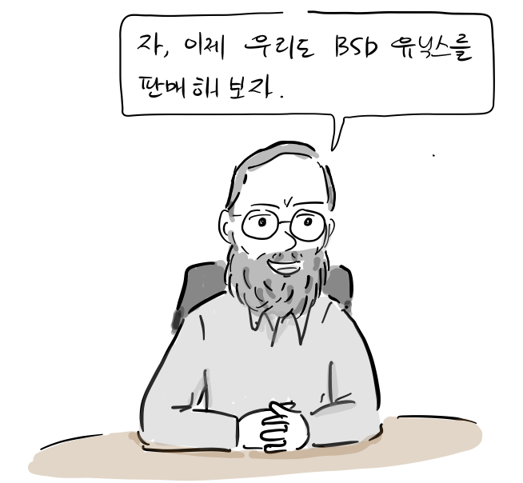

[CSRG](https://en.wikipedia.org/wiki/Computer_Systems_Research_Group)는 BSD유닉스를 본격적으로 판매하기 위해 [BSDi](https://en.wikipedia.org/wiki/Berkeley_Software_Design)라는 회사를 설립한다. 캘리포니아 대학도 90년대 초부터 BSD 유닉스를 판매하기 시작했다. 이 당시 AT&T유닉스 보다 95%싸다고 광고를 했는데, 결국, AT&T의 심기를 건드리고 만다.

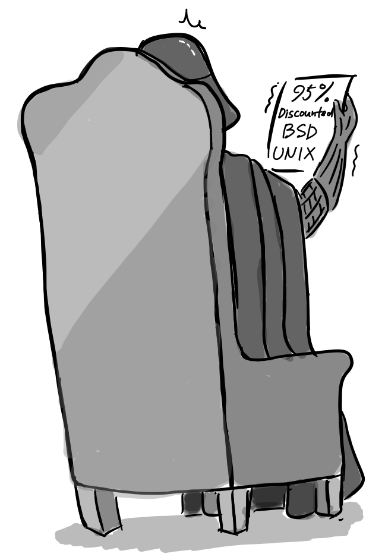

**제국의 역습**  
결국, 1991년 AT&T는 BSDi와 캘리포니아 대학을 유닉스에 대한 저작권 침해로 고소한다.

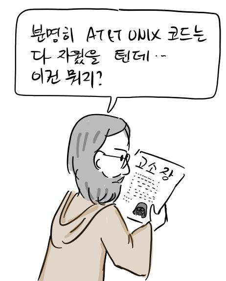

“분명히 AT&T 유닉스 코드는 다 지웠을 텐데.. 이건 뭐지?”

하지만, AT&T의 [유닉스 시스템V](https://ko.wikipedia.org/wiki/%EC%9C%A0%EB%8B%89%EC%8A%A4_%EC%8B%9C%EC%8A%A4%ED%85%9C_V) 역시 가상 메모리, TCP/IP, VI 등 BSD 유닉스 코드가 많이 포함되어 있었다. 애초에 BSD 라이선스는 저작권만 표기하면 누구나 맘대로 사용할 수 코드인데, AT&T는 소스코드에서 저작권 부분을 제거하고 자신들이 모든 코드를 만든 것 처럼 유닉스를 판매하였다.

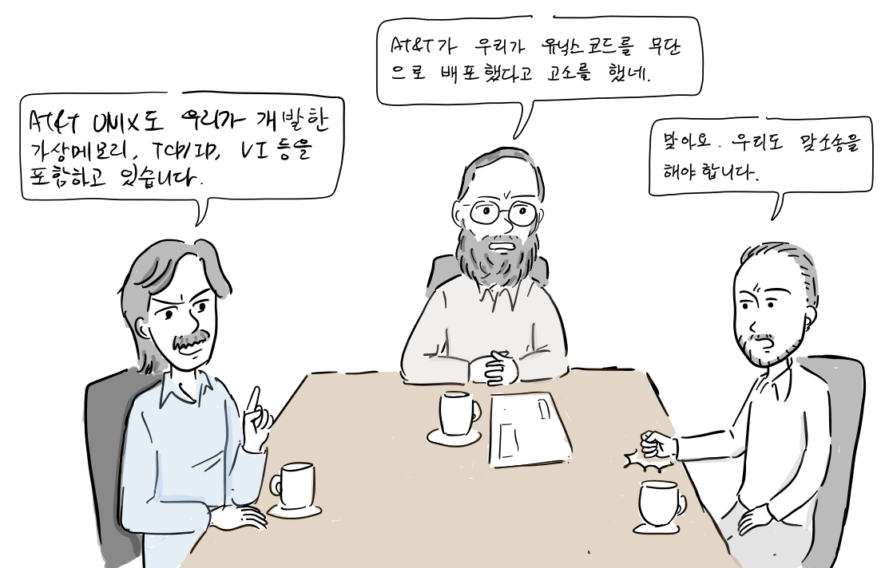

“AT&T가 우리가 유닉스 코드를 무단으로 배포했다고 고소를 했네”  
“말도 안됩니다. AT&T 시스템V는 우리가 개발한 가상 메모리, TCP/IP, VI 등 코드를 포함하고 있습니다.”  
“맞아요. 우리도 맞소송을 해야합니다.”

결국, BSD 유닉스 측도 AT&T를 상대로 맞고소를 한다.

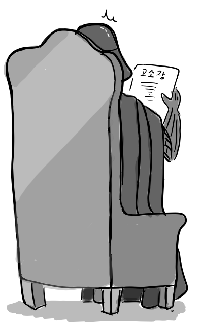

결국 1994년 1월, CSRG가 일부 남아있던 AT&T 유닉스 코드를 제거하는 조건으로 각자 유닉스를 판매할 수 있도록 합의가 이루어졌다.

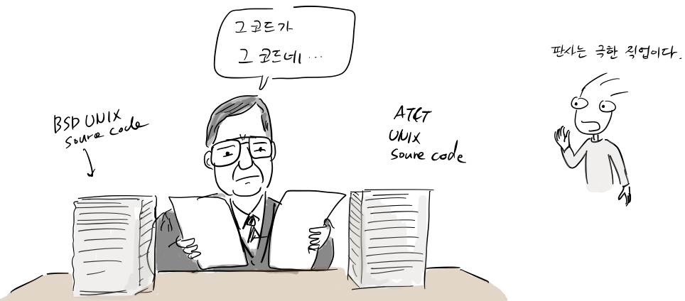

그 이유는 비록 BSD유닉스가 AT&T 유닉스 코드를 기반으로 개발되었지만 상당수 코드가 다시 개발되었고, AT&T 역시 BSD에서 개발한 TCP/IP, 가상 메모리, VI 코드를 가져다 쓰면서 임의로 저작권 표기를 삭제한 정황이 드러났기 때문이다. 하지만 소송 기간 동안 BSD유닉스는 배포될 수 없었고 완전한 자유 소프트웨어로된 BSD 유닉스가 나오기까지 2년여의 시간을 낭비한 탓에 그 사이 리눅스가 탄생할 여지를 주게 된다.

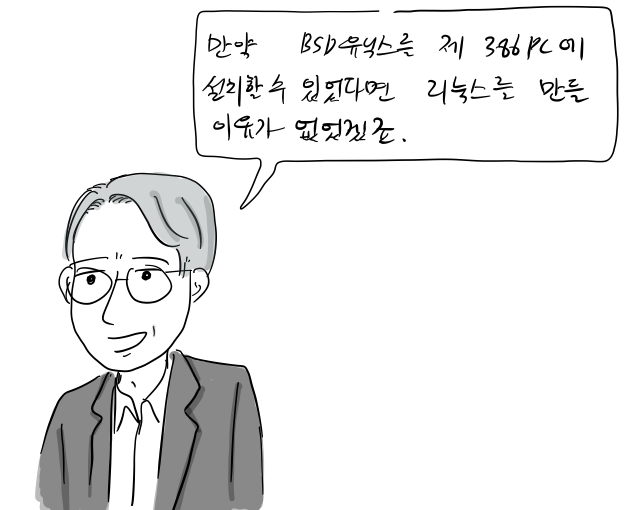  
리누스 토발즈

“만약 BSD 유닉스를 제 인텔 386 PC에 설치할 수 있었다면, 리눅스를 만들 이유는 없었겠죠.”

다음에 계속..

**참고 문헌**

1.  ANDREW LEONARD, [BSD Unix: Power to the people, from the code](https://www.salon.com/2000/05/16/chapter_2_part_one/), 2000
2.  마샬 커크 맥퀴식, [버클리 유닉스의 20년, 오픈소스 혁명의 목소리, 한빛출판사](http://www.hanbit.co.kr/store/books/look.php?p_code=E5329835060), 2013
3.  https://en.wikipedia.org/wiki/Computer\_Systems\_Research\_Group
4.  https://www.freebsd.org/doc/en/books/design-44bsd/overview-network-implementation.html

참고로, 등장 인물 간 대화는 자료를 바탕으로 재구성되었습니다.

만화 중 잘못된 부분이나 추가할 내용이 있으면 [만화 원고](https://docs.google.com/document/d/1y7aexRHveh17dKG6fpWz3FAcsCBSIrd46cnd_GZ4CEM/edit?usp=sharing)에 직접 의견을 남겨주시면 고맙겠습니다. 그 외 전반적인 만화 후기는 블로그에 바로 답글로 남겨주세요. [다음 이야기는 라이온스 교수의 유닉스 해설서에 대한 이야기를 소개합니다.](http://joone.net/2018/02/05/12-%EB%9D%BC%EC%9D%B4%EC%98%A8%EC%8A%A4-%EA%B5%90%EC%88%98%EC%9D%98-%EC%9C%A0%EB%8B%89%EC%8A%A4-%ED%95%B4%EC%84%A4%EC%84%9C/)

