[존 라이온스(John Lions)](https://en.wikipedia.org/wiki/John_Lions) 교수는 호주 뉴사우스웨일스 대학교에서 [운영체제](https://ko.wikipedia.org/wiki/%EC%9A%B4%EC%98%81_%EC%B2%B4%EC%A0%9C)를 가르치고 있었다.

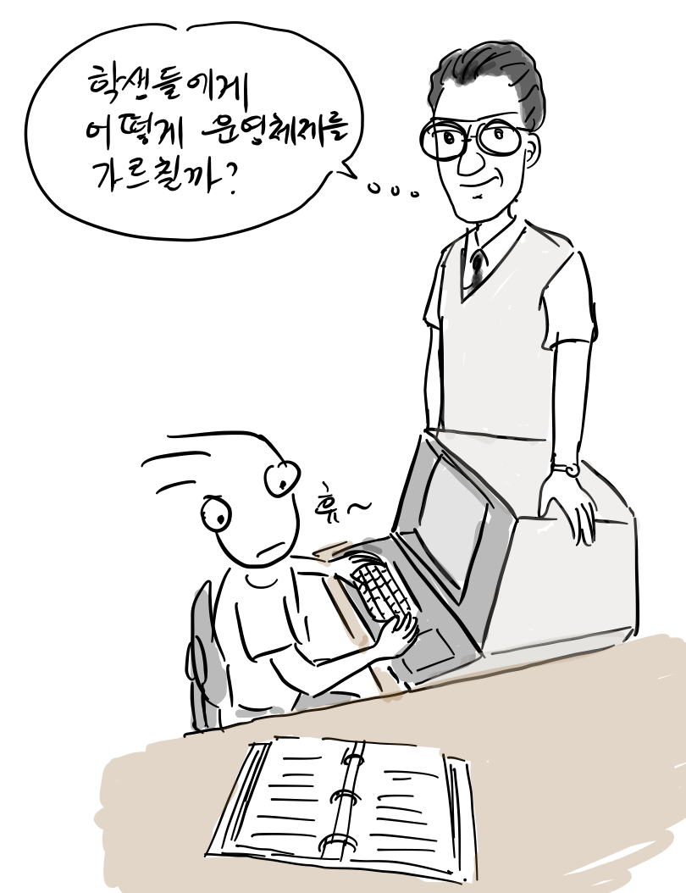

“학생들에게 운영체제를 가르치려면 유닉스 소스코드를 공부시켜야 하는데, 쉽지 않군.” ”내가 직접 교재를 만들어야겠다.”

1976년 5월, 라이온스 교수는 [AT&T 유닉스 버전6](https://en.wikipedia.org/wiki/Version_6_Unix)를 직접 분석해서 소스 코드를 설명하는 [유닉스 해설서](https://en.wikipedia.org/wiki/Lions%27_Commentary_on_UNIX_6th_Edition,_with_Source_Code)를 공개한다.

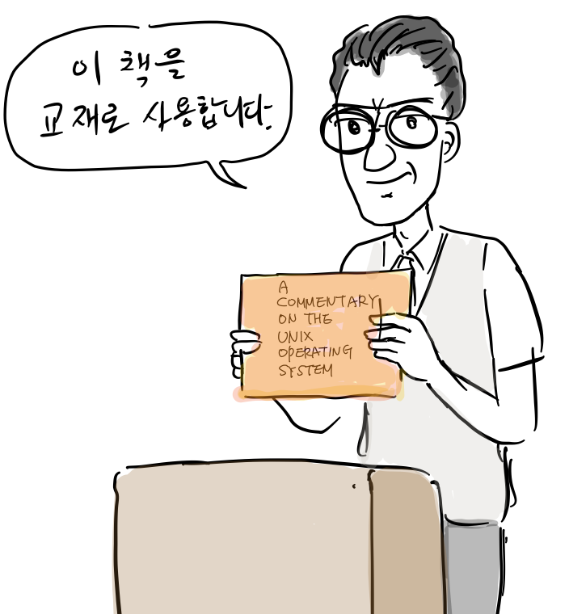

“학생 여러분, 운영체제를 제대로 배우려면 실제 OS 코드를 봐야합니다”  
“제가 직접 유닉스 커널 코드를 설명한 책을 만들었으니, 이제 부터 교재로 사용하겠습니다.”

해당 교재는 다른 학교와 연구기관에도 600본 이상 판매되었고, 특히, AT&T 벨 연구소도 200부를 주문할 정도로 인기가 있었다. 나중에는 벨 연구소가 직접 유닉스 해설서의 배포를 맡기도 했다\[2\].

당시만해도 AT&T는 유닉스 코드를 학교 수업에서 공부할 수 있도록 허용했다. 그러나, 1979년 6월 유닉스 버전7을 발표하면서 이를 금지시키고 책은 더 이상 배포되지 않았다.

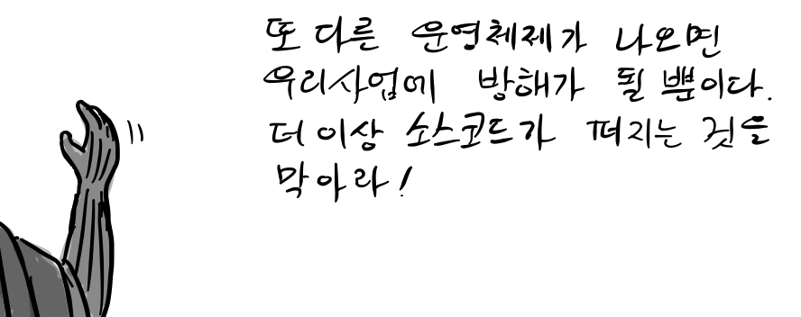

“또 다른 운영체제가 나오면 우리 사업에 방해가 될 뿐이다. 더 이상 소스코드가 퍼지는 것을 막아라.”

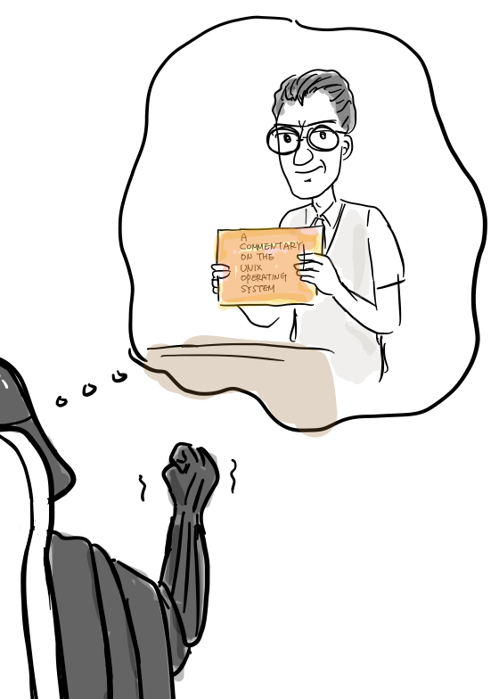

“우선 라이온스 교수가 쓴 유닉스 해설서부터 없애고 학교에서 유닉스 코드 공부를 금지하라.”

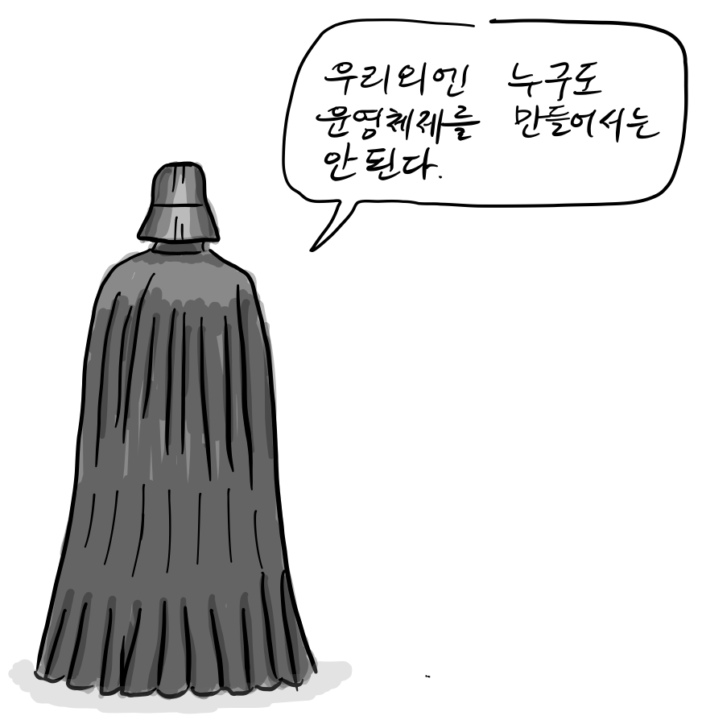

“우리외에 누구도 운영체제를 만들어서는 안된다.”

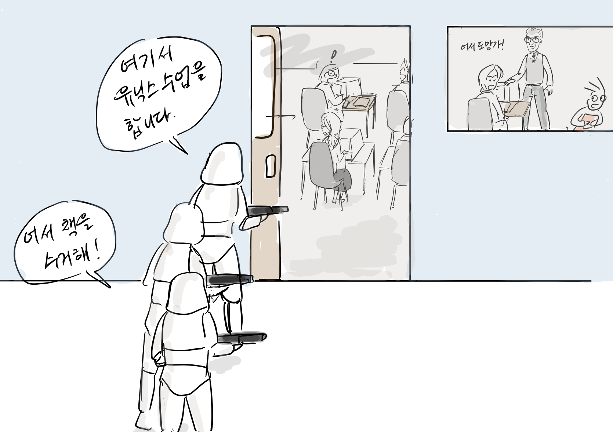

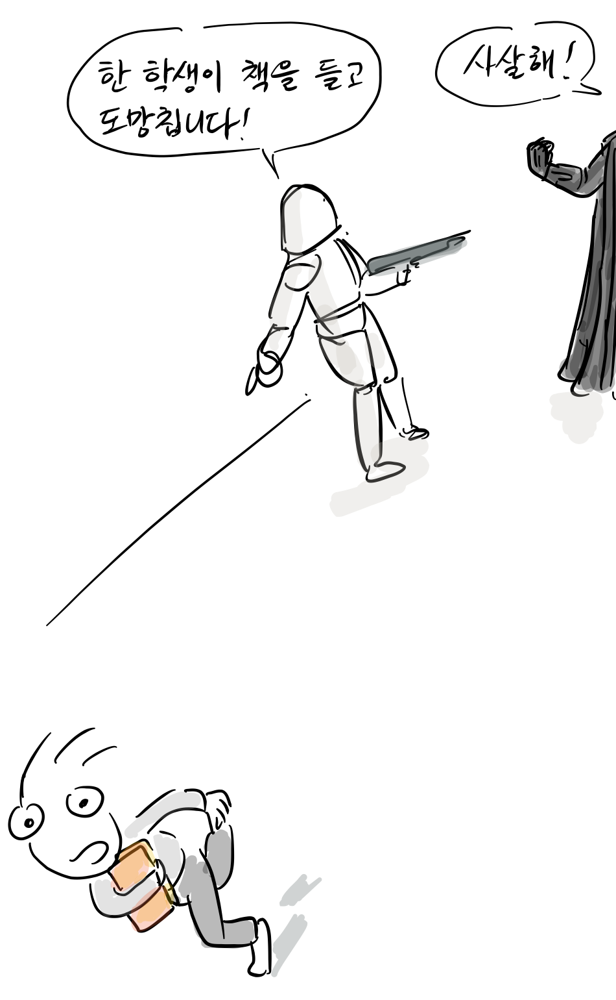

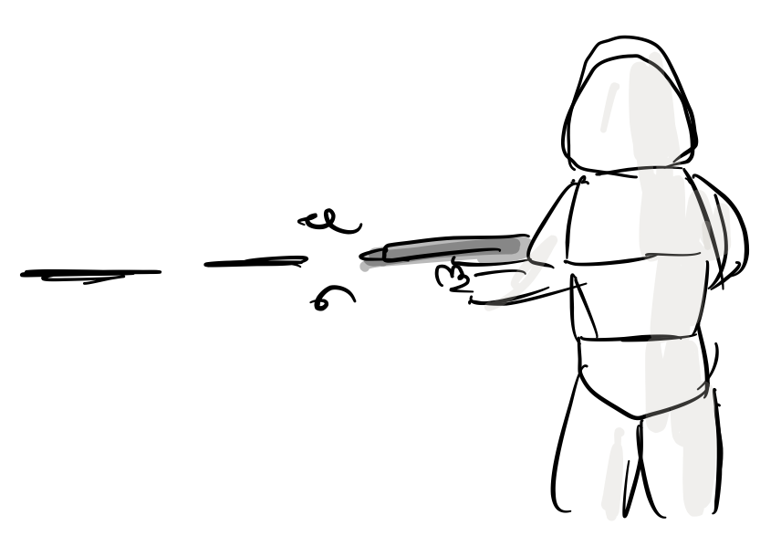

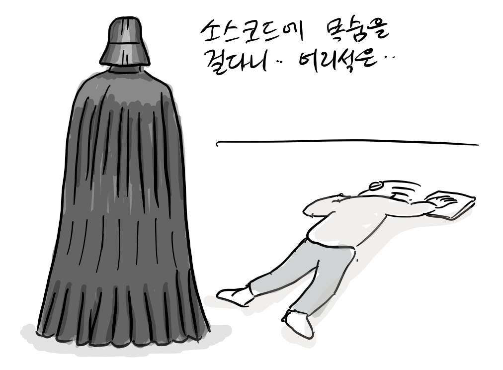

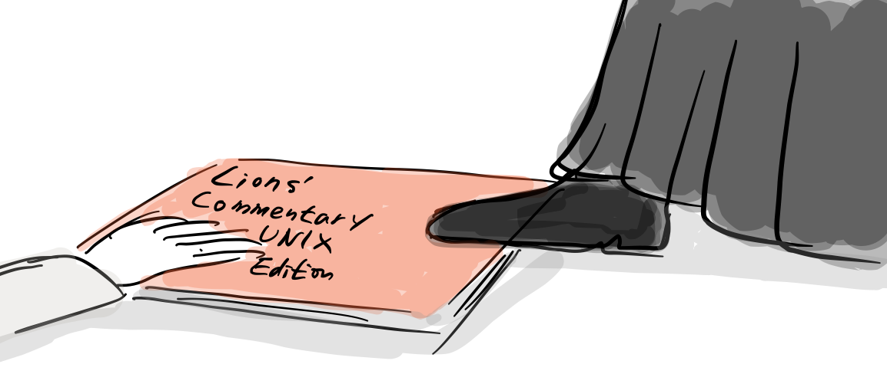

“너희들은 그냥 [시스템 호출(System call)](https://ko.wikipedia.org/wiki/%EC%8B%9C%EC%8A%A4%ED%85%9C_%ED%98%B8%EC%B6%9C)만 쓰면 되!. 대충 OS이론만 배우라고”

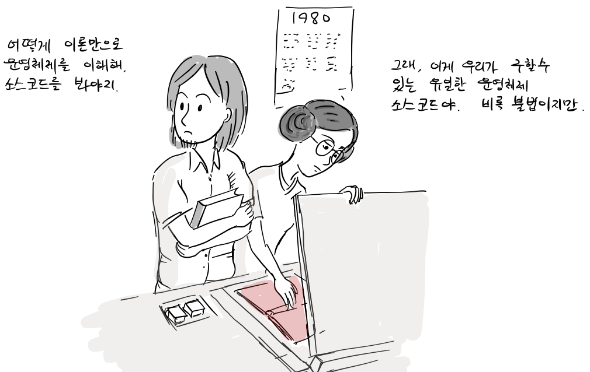

“어떻게 이론만으로 운영체제를 이해해. 소스코드를 봐야지. 어서 복사해”  
“그래, 이게 우리가 구할 수 있는 유일한 운영체제 소스코드야.”

이후 20여년간 전산학을 공부하는 수많은 학생들이 라이온스 교수의 유닉스 해설서를 불법으로 복사하여 공부하였고, 이는 또 다른 운영체제가 만들어지는 밑거름이 되었다.

그사이 여러 유닉스 관계자([Peter H. Salus](https://en.wikipedia.org/wiki/Peter_H._Salus), [Dennis Ritchie](https://ko.wikipedia.org/wiki/%EB%8D%B0%EB%8B%88%EC%8A%A4_%EB%A6%AC%EC%B9%98), Berny Goodheart 등)들이 책 출판을 허용해달라고 유닉스 소유 회사(AT&T, [Novell](https://en.wikipedia.org/wiki/Novell), [the Santa Cruz Operation](https://en.wikipedia.org/wiki/Santa_Cruz_Operation))를 설득했다. 마침내, 라이온스 교수가 쓴 유닉스 해설서는 이들 회사의 허락을 받아 1997년 정식으로 출판되었다.

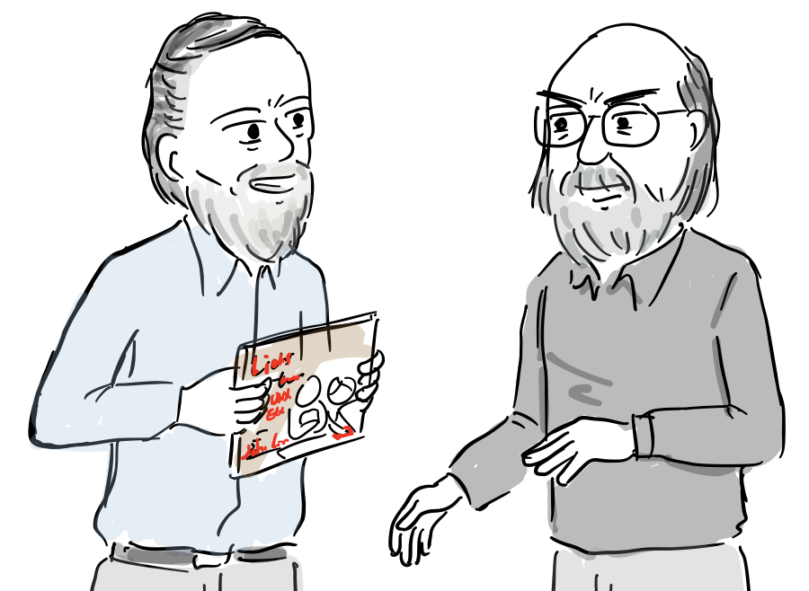

[데니스 리치](https://ko.wikipedia.org/wiki/%EB%8D%B0%EB%8B%88%EC%8A%A4_%EB%A6%AC%EC%B9%98), [켄 톰프슨](https://ko.wikipedia.org/wiki/%EC%BC%84_%ED%86%B0%ED%94%84%EC%8A%A8) .

“드디어 제 추천사가 들어간 라이온스 교수의 유닉스 해설서가 정식으로 출판되었네요.”  
“지난 20년간 불법으로 복사해서 이 책을 봤다니 정말 믿기지가 않아.”

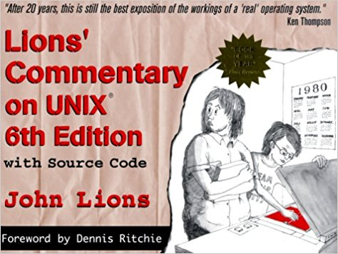

정식으로 출판된 책 표지.

현재는 [PDF](http://v6.cuzuco.com/)로 다운로드 받거나 [아마존](https://www.amazon.com/Lions-Commentary-Unix-John/dp/1573980137/)에서 구입할 수 있다. 참고로, Unix version 6 소스코드는 [여기](http://www.tuhs.org/Archive/Distributions/Research/Dennis_v6/)서 다운로드 받을 수 있다.

참고

1.  https://en.wikipedia.org/wiki/Lions%27\_Commentary\_on\_UNIX\_6th\_Edition,\_with\_Source\_Code
2.  Lions’ Commentary on Unix 6th Edition with source code, John Lions, 1996

참고로, 등장 인물 간 대화는 자료를 바탕으로 재구성되었습니다.

만화 중 잘못된 부분이나 추가할 내용이 있으면 [만화 원고](https://docs.google.com/document/d/1qOoNV3O4MC2G1hXxLy7bhHVDbmUwKfYkIUTaxI66caY/edit?usp=sharing)에 직접 의견을 남겨주시면 고맙겠습니다. 그 외 전반적인 만화 후기는 블로그에 바로 답글로 남겨주세요. 다음 이야기는 BSD 유닉스의 오늘을 소개합니다.
