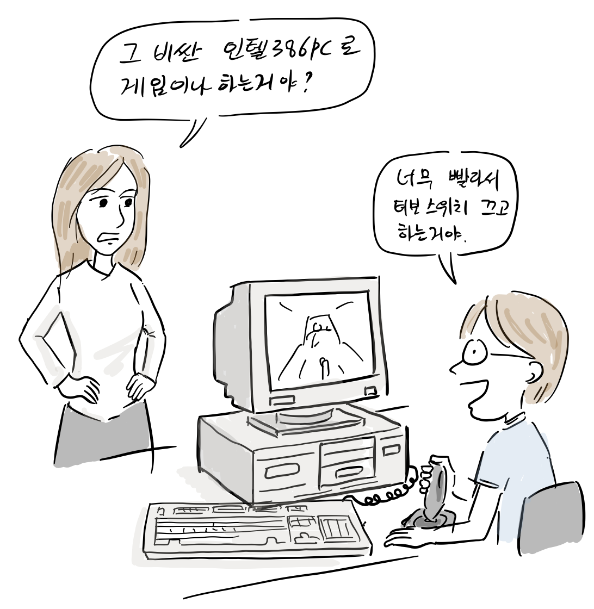
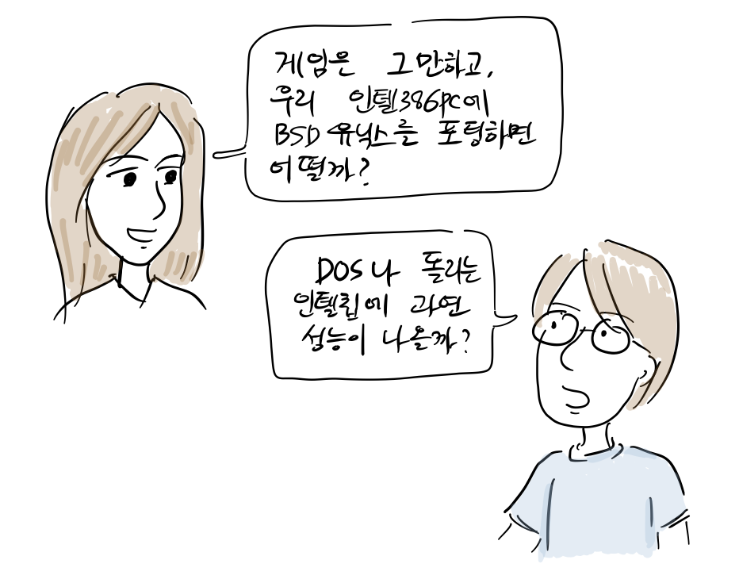
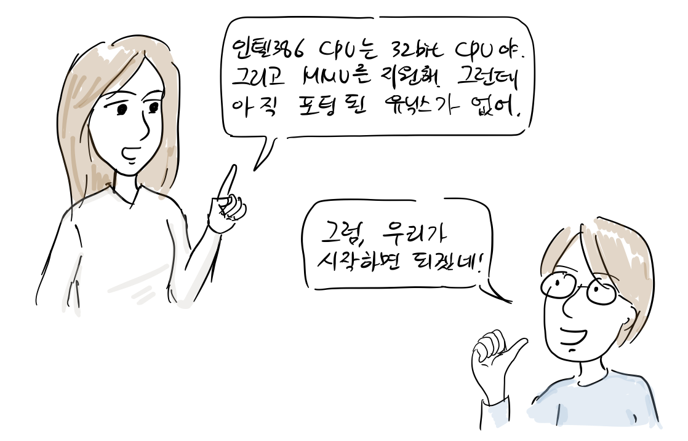
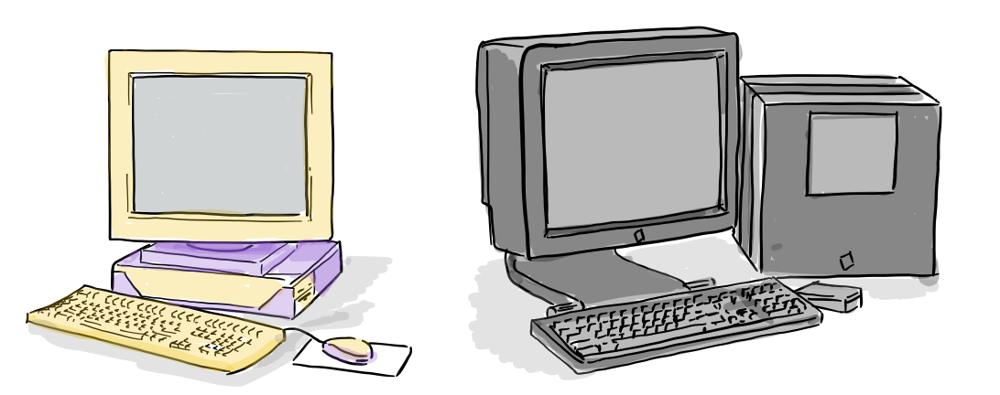
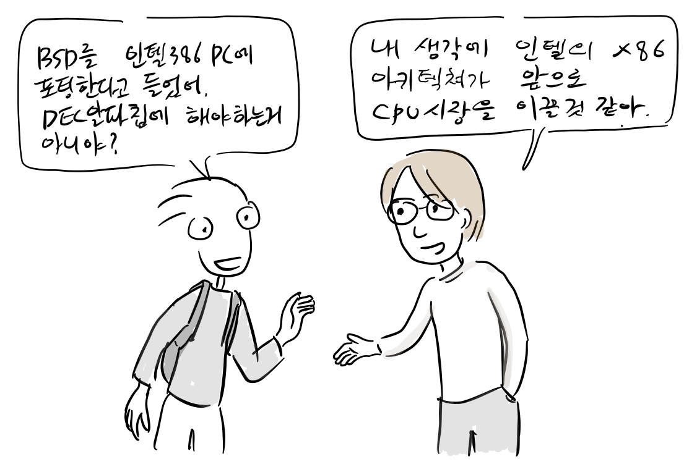
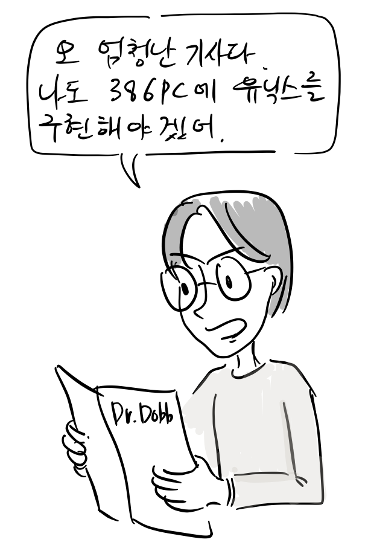
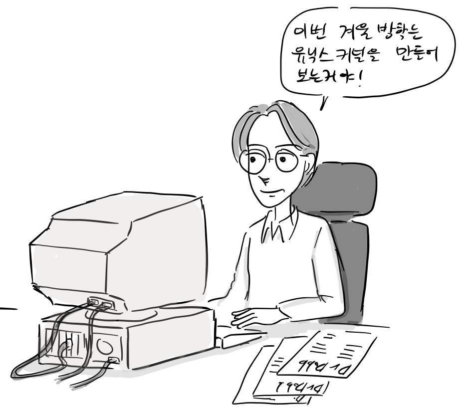
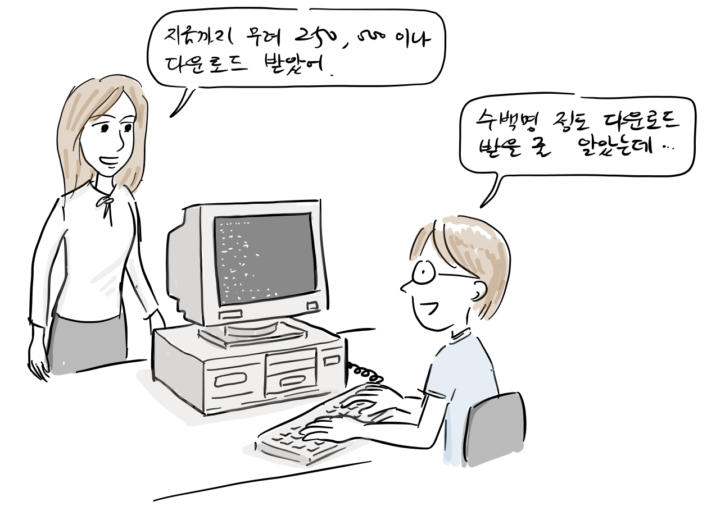
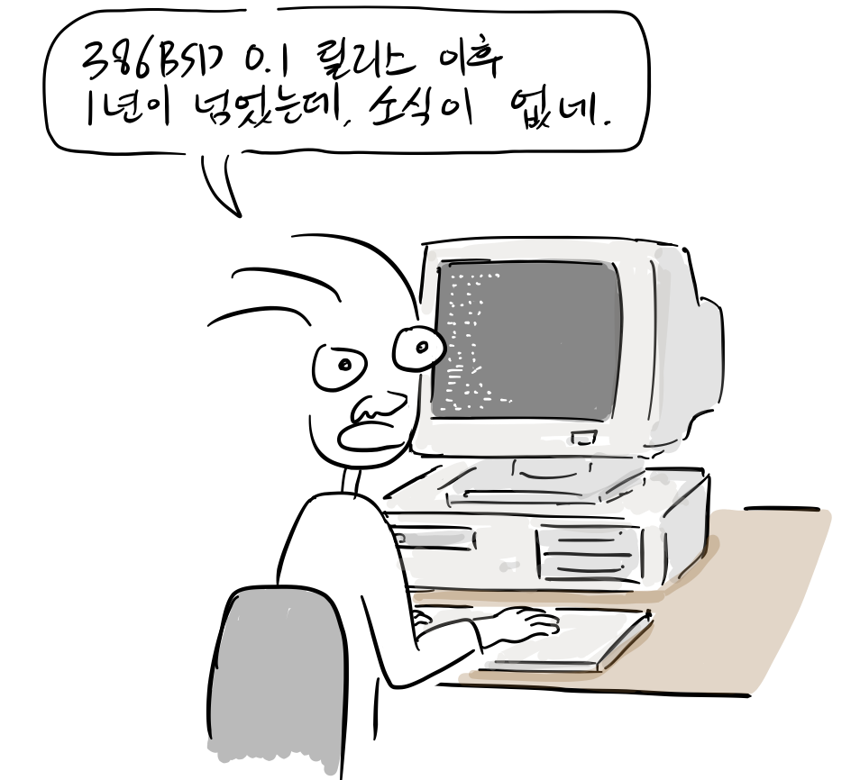

1989년 윌리암 졸리츠(William Jolitiz), 린 졸리츠(Lynne Jolitz) 커플은 인텔 386PC에 BSD유닉스를 포팅하기 시작한다.

“그 비싼 인텔386로 게임이나 하는거야?”  
“응, 게임이 너무 빨라서 터보 스위치는 끄고 있어..”

참고로 [인텔 80386 CPU](https://ko.wikipedia.org/wiki/%EC%9D%B8%ED%85%94_80386)를 채용한 [컴퓨터는 컴팩에서 1986년에 처음 출시했다](http://www.computerhistory.org/timeline/1986/#169ebbe2ad45559efbc6eb35720789b1).

“게임은 그만하고 우리 인텔386 PC에 BSD유닉스를 포팅하면 어떨까?”  
“도스나 돌리는 인텔칩에 유닉스를 돌릴 성능이 나올까?”

“인텔 80386는 32-bit CPU야, 그리고 [MMU](https://ko.wikipedia.org/wiki/%EB%A9%94%EB%AA%A8%EB%A6%AC_%EA%B4%80%EB%A6%AC_%EC%9E%A5%EC%B9%98)를 지원해서 가상 메모리 구현도 가능해. 그런데, 아직 포팅된 유닉스가 없어.”

80년대 말은 썬마이크로시스템스, IBM, 휴렛팩커드(HP), 실리콘 그래픽스, 넥스트 컴퓨터에서 워크스테이션이라는 고성능 컴퓨터를 만들고 있었다. 이는 개인용이 아니라 연구 개발용으로 사용되는 컴퓨터로 일반인이 구입하기에는 가격이 비쌌다. 대부분 RISC계열 32 비트 CPU와 주변기기 연결을 위해 SCSI 인터페이스를 사용했다. 이들 워크스테이션은 AT&T 유닉스 또는 BSD유닉스를 기반으로한 유닉스 계열 운영체제를 사용했다.

“BSD를 인텔 386 CPU에 포팅한다고 들었어. 그런데, 왜 [DEC가 만든 알파칩](https://ko.wikipedia.org/wiki/DEC_%EC%95%8C%ED%8C%8C)에 안해?”  
“내 생각 인텔의 X86 아키텍처가 앞으로 CPU 시장을 이끌 것 같아.”

“하하, X86은 그냥 DOS칩이잖아?”  
“인텔80386이 DEC 메인 프레임보다 빠른거 알어?

“내가 인텔 엔지니어들과 이야기를 나눈적이 있는데, 앞으로 10년동안 18개월마다 성능을 두배로 올릴 수 있다는군\[1\].”

80년말에 인텔 CPU는 개인용 컴퓨터를 위한 CPU였고, 누구도 유닉스를 실행할 것이라고 생각하지 못했다. 하지만, 결론적으로 이들의 선택은 옳았다.

이들은 코드를 공개하기전에 포팅에 대한 기술적인 내용을 미리 [Dr. Dobb’s Journal](https://en.wikipedia.org/wiki/Dr._Dobb%27s_Journal)를 통해 1991년 1월 부터 18개의 기사를 연재했다.

“우리가 하는 포팅 작업을 먼저로 글을 써보자. Dr. Dobb에 연재해보는거야.”  
“글쎄, 아직 릴리스도 안했는데, 먼저 쓸 필요가 있을까?”

“난 빨리 우리가 한 일을 널리 알리고 싶어”  
“그래, 하지만.. 왠지 내키지가 않네..”

참고로, 기사 내용은 아래와 같이 윌리암 졸리츠가 운영하는 [386bsd.org](https://386bsd.org/)에 공개되어 있다.

-   [Designing the Software Specification](https://386bsd.org/releases/porting-unix-to-the-386-a-practical-approach-designing-the-software-specification-article) In this first installment of a multipart series, the design specification for 386BSD, Berkeley UNIX for the 80386, is discussed.
-   [Three Initial PC Utilities](https://386bsd.org/releases/porting-unix-to-the-386-three-initial-pc-utilities-getting-to-the-hardware-article) Utilities to let you execute GCC- compiled programs in protected mode from MS-DOS and copy files to a shared portion of disk so MS-DOS and UNIX can exchange information.
-   [The Standalone System](https://386bsd.org/releases/porting-unix-to-the-386-the-standalone-system-creating-a-protectedmode-standalone-c-programming-environment-article) Using the protected mode program loader, a minimal 80386 protected mode standalone C programming environment for operating systems kernel development is created.
-   [Language Tools Cross Support](https://386bsd.org/releases/porting-unix-to-the-386-language-tools-cross-support-developing-the-initial-utilities-article) Developing the initial cross-tool utilities to bootstrap 386BSD.
-   [The Initial Root Filesystem](https://386bsd.org/releases/porting-unix-to-the-386-the-initial-root-filesystem-completing-the-toolset-article) The development of the initial root filesystem required for the 386BSD operating system kernel.
-   [Research & The Commercial Sector](https://386bsd.org/releases/porting-unix-to-the-386-research-the-commercial-sector-where-does-bsd-fit-in-article) A discussion of the various demands placed on research and commercial operating systems, and how they differ.
-   [A Stripped-Down Kernel](https://386bsd.org/releases/porting-unix-to-the-386-a-strippeddown-kernel-onto-the-initial-utilities-article) The 386BSD basic kernel, incorporating a unique ‘recursive’ paging feature that leverages resources and reduces complexity.
-   [The Basic Kernel](https://386bsd.org/releases/porting-unix-to-the-386-the-basic-kernel-overview-and-initialization-article) Initialization of the 386BSD kernel services and data structures
-   [Multiprogramming and Multitasking I](https://386bsd.org/releases/porting-unix-to-the-386-the-basic-kernel-multiprogramming-and-multiprogramming-and-multitasking-part-one-article) An overview of the multiprogramming paradigm in 386BSD. Conventions, definitions, and organization of multiprogramming.
-   [Multiprogramming and Multitasking II](https://386bsd.org/releases/porting-unix-to-the-386-the-basic-kernel-multiprogramming-and-multiprogramming-and-multitasking-part-ii-article) How multiprogramming is achieved via multitasking. A discussion of the process. Alternative implementations and trade-offs. A reflection on why it has been so difficult to add multiprogramming to non-UNIX operating systems such as MS- DOS.
-   [Device Autoconfiguration](https://386bsd.org/releases/porting-unix-to-the-386-the-basic-kernel-device-autoconfiguration-device-autoconfiguration-article) How 386BSD discovers hardware devices that are present and configures itself for operation with those devices.
-   [Unix Device Drivers I](https://386bsd.org/releases/porting-unix-to-the-386-device-drivers-drivers-for-the-basic-kernel-article) The structure of 386BSD device drivers, interfaces to the operating system, and minimal device drivers for the console, disk drive and scheduling clock of the PC.
-   [Unix Device Drivers II](https://386bsd.org/releases/porting-unix-to-the-386-device-drivers-entering-exiting-and-entering-exiting-and-masking-processor-interrupts-article) Interfaces to the operating system. Entering, exiting and masking processor interrupts.
-   [Unix Device Drivers III](https://386bsd.org/releases/porting-unix-to-the-386-device-drivers-getting-into-and-getting-into-and-out-of-interrupt-routines-article) Completion of basic 386BSD device drivers.
-   [Missing Pieces I](https://386bsd.org/releases/porting-unix-to-the-386-missing-pieces-part-1-completing-the-386bsd-kernel-article) Finishing the NET/2 release of Berkeley UNIX to obtain a complete, unencumbered system for the 386 PC. Describes the methodology and implementation of the remaining facilities necessary to generate a working operating system for the PC.
-   [Missing Pieces II](https://386bsd.org/releases/porting-unix-to-the-386-missing-pieces-part-ii-completing-the-386bsd-kernel-article) Finishing the NET/2 release of Berkeley UNIX to obtain a complete, unencumbered system for the 386 PC. Describes the methodology and implementation of the remaining facilities necessary to generate a working operating system for the PC.
-   [The Final Step](https://386bsd.org/releases/porting-unix-to-the-386-the-final-step-running-light-with-386bsd-article) Overview of the impact of Release 0.0 on the BSD community. Installation procedures for and highlights of Release 0.1. Final installment of series.

리누스 토발즈도 이 기사를 읽은 사람 중 하나였다.

“오.. 엄청난 기사네, 하지만 당장 코드를 구할 수 없으니 나도 386PC에 유닉스를 구현해야겠어.”

아이러니하게도 리누스 토발즈가 먼저 1991년 9월 리눅스 커널 0.01 버전을 공개한다\[2\].

두 커플도 오랜 작업 끝에 1992년 성 패트릭 날 386BSD 0.0버전을 공개한 후, 좀 더 보완해서 7월 14일 0.1버전을 공개한다. 30개의 플로피 디스크만 있으면 복사가 가능했다. 🙂

“지금까지 무려 250,000이나 다운로드 받았어.”  
“수백명 정도 다운로드 받을 줄 알았는데..”

당연히 BSD 라이선스를 따랐기 때문에 저작권 속성이 그대로 유지되는 한 자유롭게 배포 및 수정할 수 있었다. 하지만, 두 사람은 너무 완벽을 추구한 나머지, 다음 릴리스가 길어지고 말았다.

“드디어 버그 잡았다. 코드 좀 봐줘.”  
“음.. 이 방법 말고 더 좋은 방법이 있을 것 같아..”  
“알았서. 다른 방법을 생각해 볼게”

“386BSD는 0.1릴리스 이후 1년이 넘었는데, 소식이 없네. 안되겠다 내가 프로젝트를 만들어야지.”

이렇게 386BSD 사용자는 분열했고, 이후, FreeBSD, NetBSD가 탄생했으며, 일부는 리눅스로 넘어갔다.

이후 1993년 12월에 386BSD 1.0이 공개되었는데, 안타깝게도 0.1 이후 18개월만에 릴리스된 것이라 그만 모멘텀을 잃고 말았다.

386BSD는 1994년 버전 1.0으로 끝으로 사실상 개발이 중지되었고, 다른 X86 BSD공동체는 FreeBSD와 NetBSD 등으로 분열된 상태였다. 반면, 리누스 토발즈는 외부 패치를 적극 받아들이고 다소 문제가 있어도 자주 릴리스했는데, 이런 개발 방식으로 많은 외부 기여를 이끌어내 X86용 오픈소스 운영체제 개발을 주도한다. 비록, 386BSD가 주류 OS진입에 실패했지만, 이들 부부는 FreeBSD, NetBSD, Linux 탄생에 기여한 공로를 인정받고 있다. 그리고, 얼마전 386BSD의 최근 코드를 GitHub에 올리기도 했다\[3\].

**참고**

1.  [https://www.salon.com/2000/05/17/386bsd/](https://www.salon.com/2000/05/17/386bsd/)
2.  [https://en.wikipedia.org/wiki/Linux\_kernel](https://en.wikipedia.org/wiki/Linux_kernel)
3.  [https://bsd.slashdot.org/story/16/10/09/0230203/after-22-years-386bsd-gets-an-update](https://bsd.slashdot.org/story/16/10/09/0230203/after-22-years-386bsd-gets-an-update)

참고로, 등장 인물 간 대화는 자료를 바탕으로 재구성되었습니다.

만화 중 잘못된 부분이나 추가할 내용이 있으면 [만화 원고](https://docs.google.com/document/d/1RkiWPRl_GNu7cdZrTpur8Vbgds6yy-Ekua_C5d62RJQ/edit?usp=sharing)에 직접 의견을 남겨주시면 고맙겠습니다. 그 외 전반적인 만화 후기는 블로그에 바로 답글로 남겨주세요.
