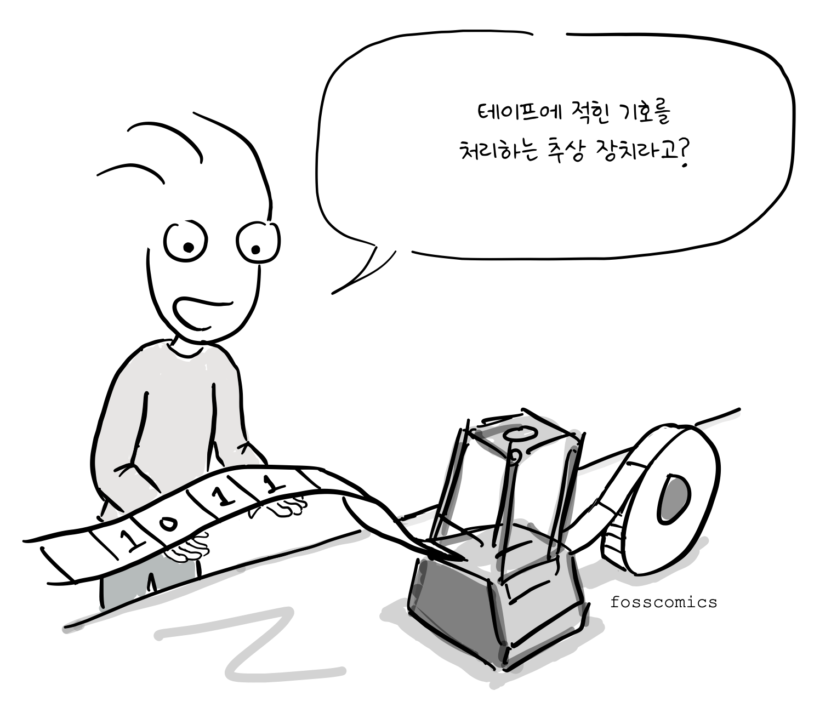
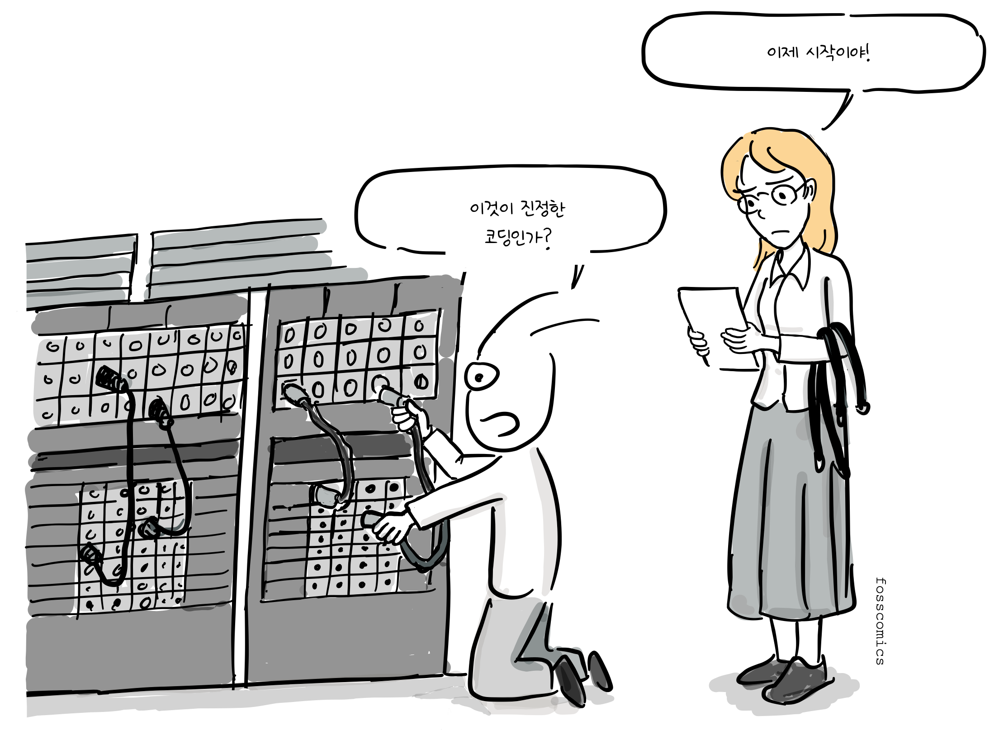
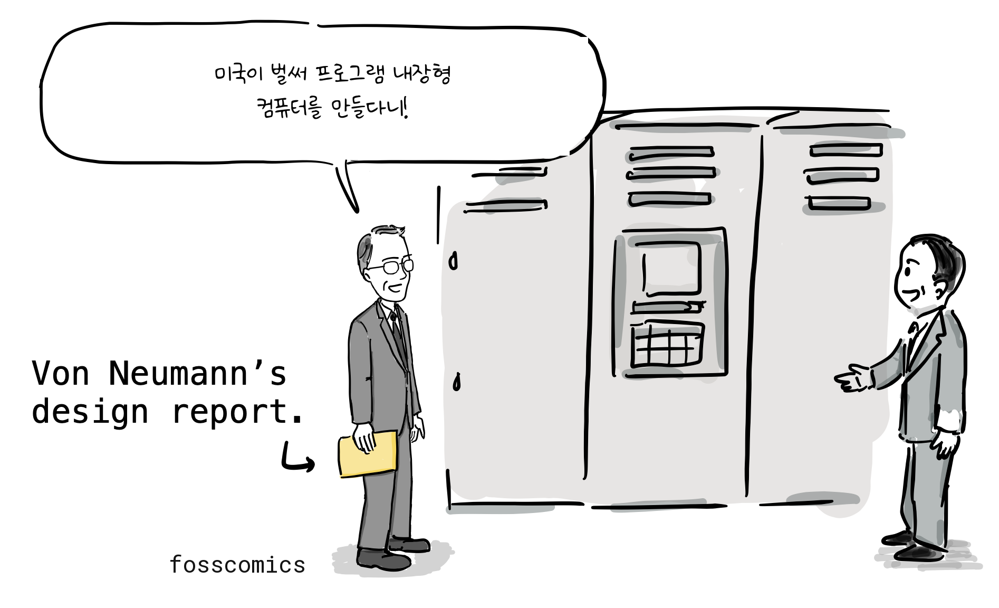
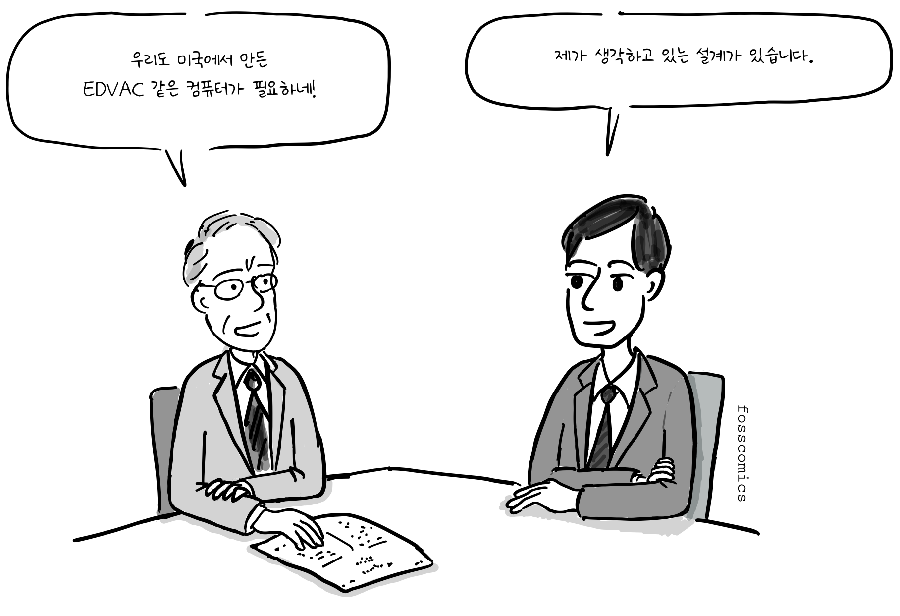
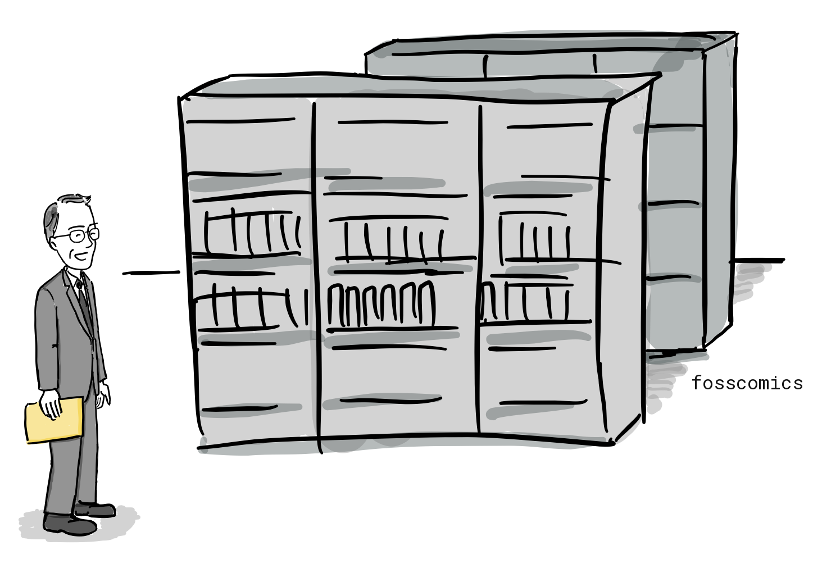
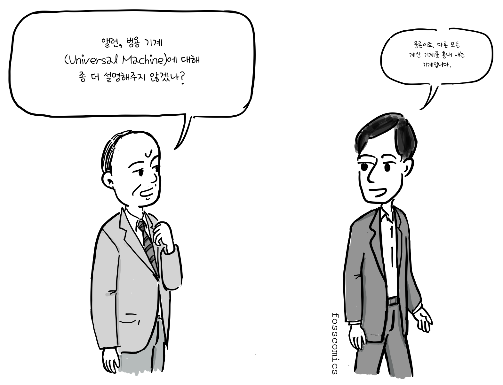

:::panels columns="2" label="앨런 튜링과 존 폰 노이만"
")
")
:::

누가 지금과 같은 형태의 컴퓨터를 처음 만들었을까? 제2차 세계대전 거치면서 여러 나라의 연구진이 주로 전쟁을 목적으로 전자식 컴퓨터를 개발하기 위해 노력했다. 그보다 앞서 영국의 수학자 [앨런 튜링](https://ko.wikipedia.org/wiki/앨런_튜링)은 하나의 기계가 테이프에 부호화된 설명을 읽어 계산 가능한 모든 절차를 수행할 수 있는 범용 수학 모델을 제시했다. 

> "괴델의 ‘불완전성의 정리’를 증명할 장치를 만들어야겠다."

그는 1937년에 발표한 "[On Computable Numbers, with an Application to the Entscheidungsproblem](https://www.cs.virginia.edu/~robins/Turing_Paper_1936.pdf)" 논문에서 [튜링 기계(Turing Machine)](https://ko.wikipedia.org/wiki/튜링_기계)을 소개하였다. 이는 표에 정의된 각 기호의 규칙대로 긴 테이프에 적힌 기호를 처리하는 추상 장치였는데, 이 개념은 훗날 등장한 프로그램 내장형 컴퓨터의 기본 원리를 이론적으로 앞서 보여주었다. 그리고 실제 프로그램 내장형 컴퓨터의 구조는 이후 여러 연구진의 공동 작업을 통해 개발되었다.

> "테이프에 적힌 기호를 처리하는 추상 장치라고?"

이후 앨런 튜링은 세계 2차대전 동안, 독일 암호문을 해독하는 Bombe라는 장치를 만들어 연합군 승리에 큰 기여를 한다[2]. 이처럼, 2차 대전 기간에 만들어진 컴퓨터는 특정 목적에서만 사용되었으나, 전쟁이 끝나갈 무렵 미국에서는 다용도 컴퓨터인 [에니악(ENIAC)](https://ko.wikipedia.org/wiki/에니악)을 만들기 시작했다. 에니악은 펜실베니아 대학 존 에커트와 존 모클리 교수팀이 1943년 부터 개발을 시작하여 1946년에 완성하였다. 이후, 미군에 배치되어 미사일 탄도 계산을 위해 사용되었다. 프로그래밍 방식이 지금과 아주 다른데, 일일히 배선을 연결해서 코딩을 해야 했고, 다른 프로그램을 실행하려면 배선판을 바꿔야 했다. 게다가 무게는 30톤이었으며, 18000개의 진공관을 사용했기 때문에 200KW의 전기를 소모해야만 했다[3].

> "이것이 진정한 코딩인가?" \
> "이제 시작이야!"

이후, 에니악을 만들었던 팀은 1944년 부터 세계 최초로 프로그램 내장 방식인 에드박(EDVAC) 개발 시작하여 1949년 미군 탄도 연구소(ballistic research laboratory)에 납품한다. 폰 노이만은 컨설턴트로 개발에 참여하여 1945년 [First Draft of a Report on the EDVAC](http://www.virtualtravelog.net/wp/wp-content/media/2003-08-TheFirstDraft.pdf) 보고서를 작성하는데, 여기서 같은 메모리에 프로그램과 데이터가 저장되는 컴퓨터 구조를 제안한다.

> "EDVAC은 최초로 2진수를 사용했습니다."

지금도 모든 컴퓨터는 이와 같은 컴퓨터 구조를 사용하고 있고, 이를 [폰노이만 구조](https://ko.wikipedia.org/wiki/폰_노이만_구조)라고 부른다.

그림에서 볼 수 있듯이, 폰노이만 구조는 크게 CPU, 메모리, 입출력 장치로 구성되어 있으며, CPU안에는 산술/논리장치, 프로세서 레지스터를 포함하고 있는 처리 장치(Processing Unit)와 명령어 레지스터와 프로그램 카운터를 포함하는 제어장치로 구성된다. 메모리는 데이터와 명령어를 함께 저장할 수 있다.

영국은 뒤늦게 미국에서 만든 에드박과 폰노이만이 작성한 보고서에 관해 알게 되었다.

> "미국이 벌써 프로그램 내장형 컴퓨터를 만들다니!"

그리고, 앨런 튜링에게 에드박과 같은 프로그램 내장 방식의 컴퓨터 개발을 주문했다. 알랜 튜링은 1945년 부터 국립 물리학 연구소에서 [ACE(Automatic Computing Engine)](https://en.wikipedia.org/wiki/Automatic_Computing_Engine)라는 프로그램 내장형 컴퓨터를 개발하면서 자신이 생각한 튜링 머신을 실제 구현해볼 수 있는 기회를 갖게 되었다.

> "우리도 미국에서 만든 EDVAC 같은 컴퓨터가 필요하네!" \
> "제가 생각하고 있는 설계가 있습니다."

1946년 공개된 [그의 논문](https://www.amazon.com/Turings-Report-1946-Other-Papers/dp/0262031140)을 보면 비록 폰노이만의 에드박 보고서 보다 늦게 작성되었지만, 프로그램 내장 방식 컴퓨터에 대한 자세한 설계가 담겨져 있다. 게다가 하드웨어는 최소한으로 구성하고 산술명령 조차 소프트웨어로 구현하도록 설계되어 있어 오늘날 RISC 방식의 CPU와 같은 설계 철학을 갖고 있었다.하지만, 예산 집행이 늦어져서 1947년 케임브리지 대학으로 돌아왔다[4].

> "도대체 영국 정부는 언제 개발비를 주는 거지?" \
> "이렇게 설계도도 있는데..."

결국, 케임브리지대학 수학 연구소는 앨런 튜링이 설계한 방식 보다 이미 검증된 폰노이만 방식으로 [에드삭(EDSAC)](https://ko.wikipedia.org/wiki/에드삭)이라는 컴퓨터를 개발하고 1949년 처음 사용하게 된다.

앨런 튜링이 1936년에 제시한 범용 기계(universal machine)는 하나의 기계가 부호화된 명령을 읽어 다양한 계산을 수행할 수 있음을 수학적으로 보여주었으며, 훗날 등장한 프로그램 내장형 컴퓨터의 중요한 이론적 토대가 되었다. 이후 미국에서는 존 폰 노이만, J. 프레스퍼 에커트, 존 모클리 등이 EDVAC 프로젝트를 통해 프로그램 내장형 아키텍처의 발전에 기여했으며, 영국의 연구진도 독자적으로 이를 구현하고자 했다.

흥미롭게도 튜링은 1936년부터 1938년까지 프린스턴 대학교에서 박사 과정을 밟았고, 당시 폰 노이만은 인근 고등연구소의 교수였다. 두 사람은 서로 알고 지냈으며, 튜링이 계산 가능한 것의 범위와 한계를 연구한 논문을 잘 알고 있던 폰 노이만은 훗날 튜링에게 연구 조교 자리를 제안하기도 했다. 이 때문에 일부 역사학자들은 튜링의 아이디어가 폰 노이만의 내장형 컴퓨터 설계에 영향을 주었을 가능성을 제기해 왔다. 그러나 그 영향이 어느 정도였는지는 확실하지 않으며, 폰 노이만의 1945년 EDVAC 보고서에는 튜링의 1936년 논문이 인용되지 않았다.

> "앨런, 범용 기계(Universal Machine)에 대해 좀 더 설명해주지 않겠나?" \
> "물론이죠. 다른 모든 계산 기계를 흉내 내는 기계입니다."

이런 대화가 오고 가지 않았을까? 🙂

사실, 영국은 세계 2차 대전 중에 독일 군 암호 해독을 위해 먼저 에니악과 같은 범용 컴퓨터를 만들었으나 기밀 보호를 위해 전쟁이 끝난 후, 모든 폐기처분 하여 그 기술을 잘 발전시키지 못했다. 독일도 마찬가지로 2차 대전 중에 컴퓨터를 만들었지만, 전쟁에 졌기 때문에 계속 연구를 지속할 수 없었다.

> "이 기계들을 다른 용도로 사용할 수 있지 않을까요?" \
> "이 장비는 국가 기밀이라서 폐기처분 됩니다"

하지만, 미국은 폰노이만 같은 이민자들이 초기 컴퓨터 개발에 많은 공헌을 하였고, 컴퓨터를 상업적으로 계속 발전시켜 컴퓨터 시대를 먼저 열게 되었다.

:::panels columns="3" label="앨런 튜링, 존 폰 노이만, 쿠르트 괴델"
은 프린스턴 대학교에서 박사 학위를 받았으며, 계산의 수학적 모델을 개발했다.")
은 헝가리 출신 이민자로, 프로그램 내장형 컴퓨터 설계에 참여했다.")
은 오스트리아-헝가리에서 태어나 훗날 미국 시민이 되었다. 그의 불완전성 정리는 튜링 기계가 탄생할 이론적 토대를 마련하는 데 기여했다.")
:::

- [1] https://ko.wikipedia.org/wiki/튜링_기계
- [2] https://ko.wikipedia.org/wiki/앨런_튜링
- [3] https://ko.wikipedia.org/wiki/컴퓨터의_역사
- [4] The universal computer, p.167~168, CRC press, 2012