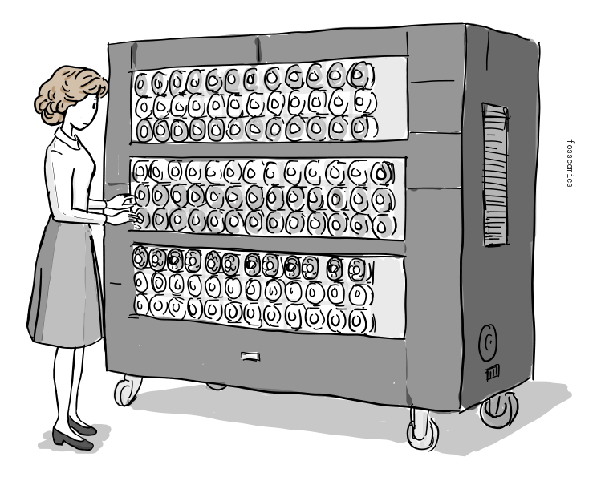
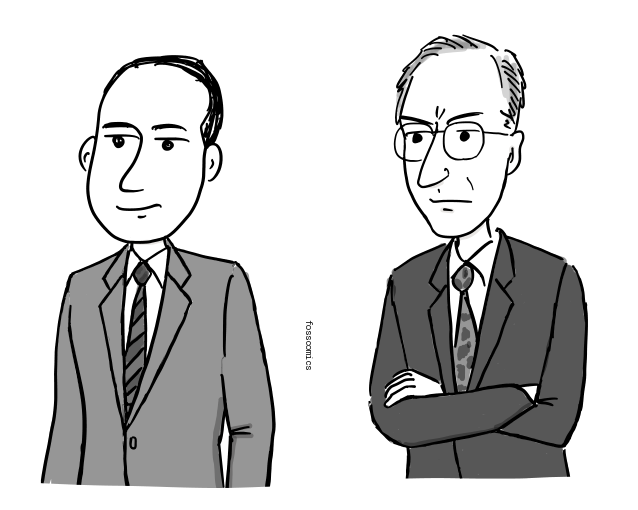
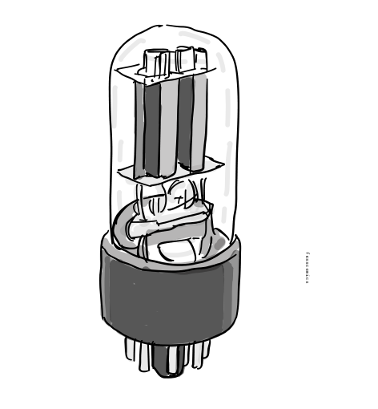
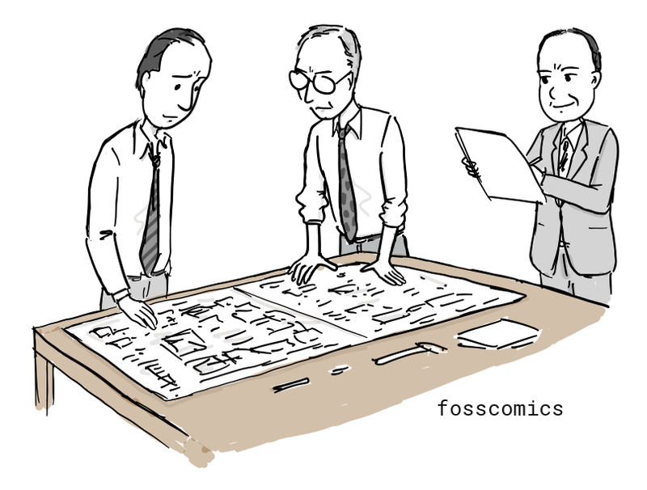
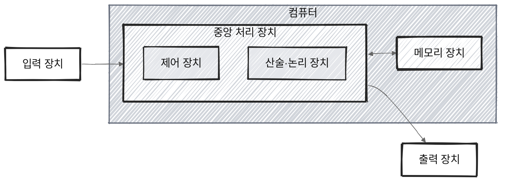
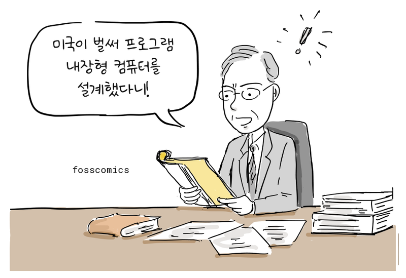
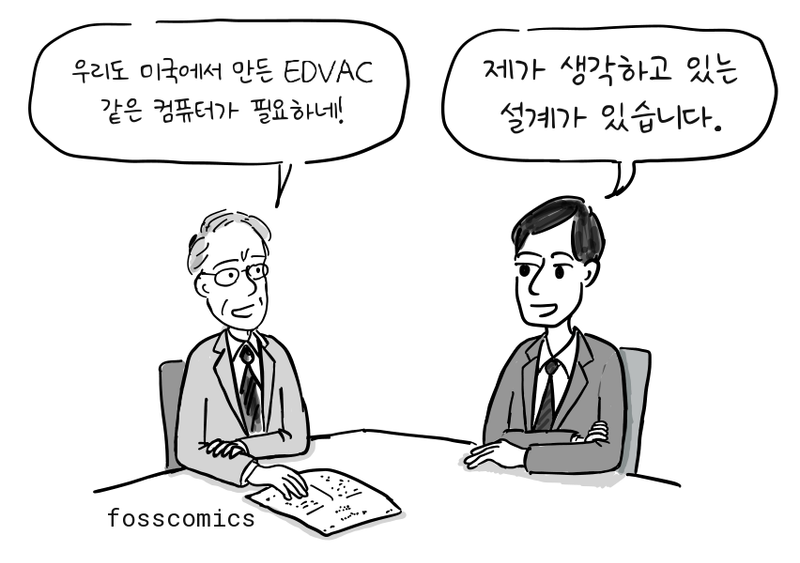
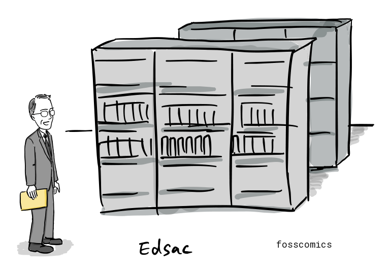
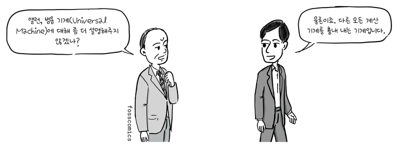

:::panels columns="2" label="앨런 튜링과 존 폰 노이만"
 size:80%")
 size:80%")
:::

누가 지금과 같은 형태의 컴퓨터를 처음 만들었을까? 제2차 세계대전 거치면서 여러 나라의 연구진이 주로 전쟁을 목적으로 전자식 컴퓨터를 개발하기 위해 노력했다. 그보다 앞서 영국의 수학자 [앨런 튜링](https://ko.wikipedia.org/wiki/앨런_튜링)은 하나의 기계가 테이프에 부호화된 설명을 읽어 계산 가능한 모든 절차를 수행할 수 있는 범용 수학 모델을 제시했다. 

누가 지금과 같은 형태의 컴퓨터를 처음 만들었을까?

제2차 세계대전을 거치면서 여러 나라의 연구진은 암호 해독과 탄도 계산 등 전쟁에 필요한 계산을 빠르게 처리하기 위해 전자식 컴퓨터 개발에 뛰어들었다.

## 튜링 머신, 계산의 가능성과 한계

하지만 실제 컴퓨터가 등장하기 전, 영국의 수학자 [앨런 튜링](https://ko.wikipedia.org/wiki/앨런_튜링)은 조금 다른 질문을 고민하고 있었다.

1928년 수학자들은 이런 질문을 던졌다.

")
> "모든 논리 문제를 정해진 절차만 따라가면 자동으로 풀 수 있을까?"

이를 결정 문제(Entscheidungsproblem)라고 한다.

그런데 이 질문에 답하려면 먼저 ‘정해진 절차에 따라 계산한다’는 것이 정확히 무엇인지 정의해야 했다.

1936년 튜링은 이를 설명하기 위해 아주 단순한 가상의 기계를 생각해냈다. 긴 테이프에 적힌 기호를 하나씩 읽고, 정해진 규칙에 따라 기호를 쓰거나 지우고, 테이프 위를 왼쪽이나 오른쪽으로 움직이는 기계였다.

> "기계가 모든 논리 문제의 답을 찾아낼 수 있을까?"

오늘날 우리는 이것을 [튜링 머신(Turing machine)](https://ko.wikipedia.org/wiki/튜링_기계)이라고 부른다.

튜링은 이 모델을 이용해 **어떤 기계적 절차로도 모든 논리 문제를 항상 판정할 수는 없다는 것**을 보여주었다. 다시 말해, 아무리 정교한 알고리즘을 만들더라도 **계산으로 해결할 수 없는 문제가 존재한다**는 것이다.

그런데 튜링의 연구에서는 또 하나의 중요한 아이디어가 등장했다.

각각의 계산을 위해 별도의 기계를 만드는 대신, **다른 기계의 동작 규칙을 부호화해 테이프에 기록하면 하나의 기계가 여러 종류의 계산을 수행할 수 있다**는 것이었다. 튜링은 이를 ‘universal machine’이라고 불렀다.

이 아이디어는 튜링이 1936년에 제출한 논문 [On Computable Numbers, with an Application to the Entscheidungsproblem](https://www.cs.virginia.edu/~robins/Turing_Paper_1936.pdf)에 등장한다.

> "동작 규칙을 테이프에 적으면 기계가 그대로 따라 한다고?"

이것은 실제 컴퓨터의 설계도는 아니었다. 튜링이 생각한 것은 어디까지나 **‘계산’을 설명하기 위한 추상적인 수학 모델**이었다.

하지만 하나의 기계가 저장된 명령에 따라 여러 종류의 계산을 수행한다는 발상은 훗날 등장한 범용 프로그램 내장형 컴퓨터(stored-program computer)와 중요한 이론적 연결점을 갖는다.

## 전쟁과 초기 컴퓨터

제2차 세계대전 전후로 수학자들의 이론은 실제 장치로 구현되기 시작했다. 미국과 영국을 비롯한 여러 나라의 연구진이 전자식 컴퓨터를 개발했고, 프로그램을 기억장치에 저장해 실행하는 실제 컴퓨터의 구조도 여러 연구진의 연구 개발을 통해 발전해 나갔다.

:::panel rounded="true"
제2차 세계대전 동안 튜링은 독일 에니그마 암호 해독에 쓰인 영국 봄브(Bombe)의 개선된 설계를 돕고, 연합군의 암호 분석에 중요한 기여를 했다[&lbrack;2&rbrack;][2].

:::

이처럼, 2차 대전 기간에 만들어진 컴퓨터는 특정 목적에서만 사용되었으나 전쟁이 끝나갈 무렵 미국에서는 범용 전자식 컴퓨터인 [에니악(ENIAC)](https://ko.wikipedia.org/wiki/에니악)을 개발하고 있었다. 펜실베이니아 대학교의 J. 프레스퍼 에커트와 존 모클리, 그리고 동료들은 1943년 개발을 시작해 1946년에 완성했다. 미 육군은 처음에 포병 사격표 계산에 이를 사용했다.

에니악의 프로그래밍 방식은 지금과 달랐다. 메모리에서 프로그램을 불러오는 대신 스위치를 설정하고 배선판의 케이블을 연결해야 했으며, 다른 프로그램을 실행하려면 배선판을 다시 구성해야 했다. 무게는 약 30톤이었고, 약 18,000개의 진공관을 사용하며 약 150킬로와트의 전력을 소비했다[&lbrack;3&rbrack;][3].

> "이것이 진정한 코딩인가?" \
> "이제 시작이야!"

## 에드박과 프로그램 내장 방식

에니악 팀은 이어 미 육군 탄도연구소를 위한 에드박(EDVAC)을 설계하기 시작했다. 이는 초기 프로그램 내장형 컴퓨터 프로젝트 가운데 하나였다. 존 폰 노이만은 컨설턴트로 참여했고, 1945년 그의 이름으로 작성된 [First Draft of a Report on the EDVAC](http://www.virtualtravelog.net/wp/wp-content/media/2003-08-TheFirstDraft.pdf) 보고서가 널리 배포되었는데, 여기서 같은 메모리에 프로그램과 데이터가 저장되는 컴퓨터 구조를 제안한다.

:::panel rounded="true"
오늘날 대부분의 컴퓨터는 이와 같은 컴퓨터 구조를 사용하고 있어서 이를 [폰 노이만 구조](https://ko.wikipedia.org/wiki/폰_노이만_구조)라고 부른다.

(출처: [위키백과](https://ko.wikipedia.org/wiki/폰_노이만_구조#/media/파일:Von_Neumann_Architecture.svg)를 바탕으로 작성)
:::

그림에서 볼 수 있듯이, 폰노이만 구조는 크게 CPU, 메모리, 입출력 장치로 구성되어 있으며, CPU안에는 산술/논리장치, 프로세서 레지스터를 포함하고 있는 처리 장치(Processing Unit)와 명령어 레지스터와 프로그램 카운터를 포함하는 제어장치로 구성된다. 메모리는 데이터와 명령어를 함께 저장할 수 있다.

## 영국의 프로그램 내장형 컴퓨터: ACE와 에드삭

영국 국립물리연구소는 1945년에 폰 노이만의 에드박 보고서를 입수했다.

> "미국이 벌써 프로그램 내장형 컴퓨터를 설계했다니!"

그리고, 앨런 튜링에게 에드박과 같은 프로그램 내장 방식의 컴퓨터 개발을 주문했다. 알랜 튜링은 1945년 부터 국립 물리학 연구소에서 [ACE(Automatic Computing Engine)](https://en.wikipedia.org/wiki/Automatic_Computing_Engine)라는 프로그램 내장형 컴퓨터를 개발하면서 자신이 생각한 튜링 머신을 실제 구현해볼 수 있는 기회를 갖게 되었다.

> "우리도 미국에서 만든 EDVAC 같은 컴퓨터가 필요하네!" \
> "제가 생각하고 있는 설계가 있습니다."

1946년 공개된 [그의 논문](https://www.amazon.com/Turings-Report-1946-Other-Papers/dp/0262031140)을 보면 비록 폰노이만의 에드박 보고서 보다 늦게 작성되었지만, 프로그램 내장 방식 컴퓨터에 대한 자세한 설계가 담겨져 있다. 게다가 하드웨어는 최소한으로 구성하고 산술명령 조차 소프트웨어로 구현하도록 설계되어 있어 오늘날 RISC 방식의 CPU와 같은 설계 철학을 갖고 있었다.하지만, 예산 집행이 늦어져서 1947년 케임브리지 대학으로 돌아왔다[&lbrack;4&rbrack;][4].

> "도대체 영국 정부는 언제 개발비를 주는 거지?" \
> "이렇게 설계도도 있는데..."

케임브리지에서 에드삭 프로젝트를 이끈 모리스 윌크스도 에드박 보고서를 읽었다.

> "이렇게 하면 디지털 컴퓨터를 만들 수 있겠구나."

:::panel rounded="true"
케임브리지 대학교 수학연구소는 에드박 보고서의 프로그램 내장형 설계를 참고해 [에드삭(EDSAC)](https://ko.wikipedia.org/wiki/에드삭)을 개발했고, 1949년에 완성했다. 한편 국립물리연구소에서는 튜링의 ACE 설계를 바탕으로  [파일럿 ACE](https://en.wikipedia.org/wiki/Pilot_ACE)를 개발해 1950년에 첫 프로그램을 실행했다.

:::

## 튜링과 폰 노이만

앨런 튜링이 1936년에 제시한 범용 기계(universal machine)는 하나의 기계가 부호화된 명령을 읽어 다양한 계산을 수행할 수 있음을 수학적으로 보여주었으며, 훗날 등장한 프로그램 내장형 컴퓨터의 중요한 이론적 토대가 되었다. 이후 미국에서는 존 폰 노이만, J. 프레스퍼 에커트, 존 모클리 등이 EDVAC 프로젝트를 통해 프로그램 내장형 아키텍처의 발전에 기여했으며, 영국의 연구진도 독자적으로 이를 구현하고자 했다.

흥미롭게도 튜링은 1936년부터 1938년까지 프린스턴 대학교에서 박사 과정을 밟았고, 당시 폰 노이만은 인근 고등연구소의 교수였다. 두 사람은 서로 알고 지냈으며, 튜링이 계산 가능한 것의 범위와 한계를 연구한 논문을 잘 알고 있던 폰 노이만은 훗날 튜링에게 연구 조교 자리를 제안하기도 했다. 이 때문에 일부 역사학자들은 튜링의 아이디어가 폰 노이만의 내장형 컴퓨터 설계에 영향을 주었을 가능성을 제기해 왔다. 그러나 그 영향이 어느 정도였는지는 확실하지 않으며, 폰 노이만의 1945년 EDVAC 보고서에는 튜링의 1936년 논문이 인용되지 않았다.

> "앨런, 범용 기계(Universal Machine)에 대해 좀 더 설명해주지 않겠나?" \
> "물론이죠. 다른 모든 계산 기계를 흉내 내는 기계입니다."

이런 대화가 오고 가지 않았을까? 🙂

## 컴퓨터의 상업적 가능성

:::panel rounded="true"
제2차 세계대전 동안 영국, 독일, 미국은 전기적 계산 장치를 각자 개발했다. 영국의 콜로서스는 독일 암호 해독을 위해 비밀리에 제작되었지만, 전쟁 후 대부분이 해체되었고, 프로젝트는 수십 년 동안 기밀로 남았다. 독일에서도 콘라트 추제의 기계들을 비롯한 선구적인 컴퓨터가 만들어졌으나, 전쟁 중의 파괴와 패전으로 후속 개발에 차질을 빚었다.

사실, 영국은 세계 2차 대전 중에 독일 군 암호 해독을 위해 콜로서스와 같은 컴퓨터를 만들었으나, 전쟁 후 대부분 해체되었고 프로젝트는 수십 년 동안 기밀로 남아, 그 기술을 민간에서 발전시킬 수 없었다. 독일도 마찬가지로 2차 대전 콘라트 추제라는 과학자가 컴퓨터를 만들었지만, 전쟁 후, 독일의 경제 사정으로 인해 연구가 중단되었다.

> "이 기계들을 다른 용도로 사용할 수 있지 않을까요?" \
> "이 장비는 국가 기밀이라서 폐기처분 됩니다"
:::

하지만, 미국은 폰노이만 같은 이민자들이 초기 컴퓨터 개발에 많은 공헌을 하였고, 컴퓨터를 상업적으로 계속 발전시켜 컴퓨터 시대를 먼저 열게 되었다.

:::panels columns="3" label="앨런 튜링, 존 폰 노이만, 쿠르트 괴델"
은 프린스턴 대학교에서 박사 학위를 받았으며, 계산의 수학적 모델을 개발했다.")
은 헝가리 출신 이민자로, 프로그램 내장형 컴퓨터 설계에 참여했다.")
은 오스트리아-헝가리에서 태어나 훗날 미국 시민이 되었다. 그의 불완전성 정리는 튜링 기계가 탄생할 이론적 토대를 마련하는 데 기여했다.")
:::

## 참고 자료

1. https://ko.wikipedia.org/wiki/튜링_기계
2. https://ko.wikipedia.org/wiki/앨런_튜링
3. https://ko.wikipedia.org/wiki/컴퓨터의_역사
4. [The universal computer, 167~168쪽, CRC 프레스, 2012](https://www.amazon.com/Universal-Computer-Road-Leibniz-Turing/dp/1466505192)
5. https://ko.wikipedia.org/wiki/괴델의_불완전성_정리
6. https://ko.wikipedia.org/wiki/중앙_처리_장치

[2]: https://ko.wikipedia.org/wiki/앨런_튜링 "앨런 튜링, 위키백과"
[3]: https://ko.wikipedia.org/wiki/컴퓨터의_역사 "컴퓨터의 역사, 위키백과"
[4]: https://www.amazon.com/Universal-Computer-Road-Leibniz-Turing/dp/1466505192 "The universal computer, 167~168쪽, CRC 프레스, 2012"