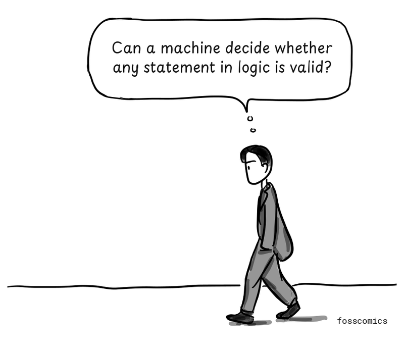
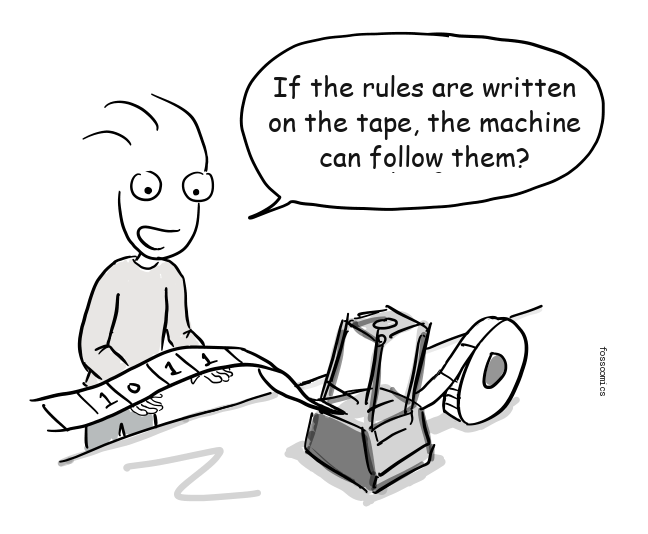
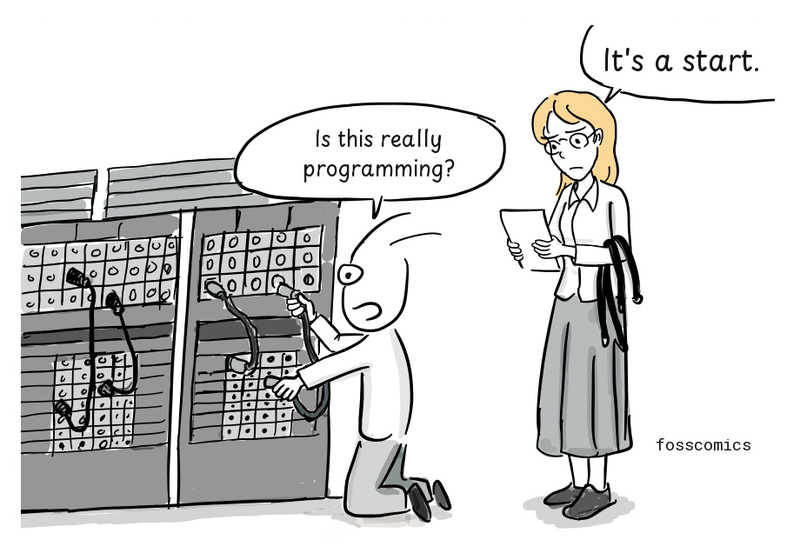
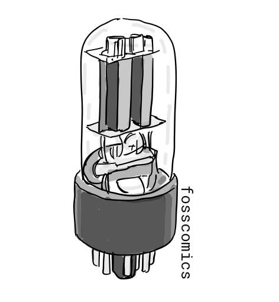
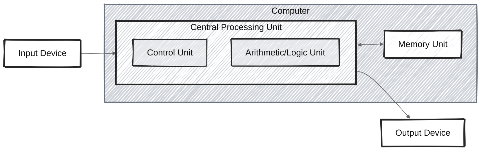
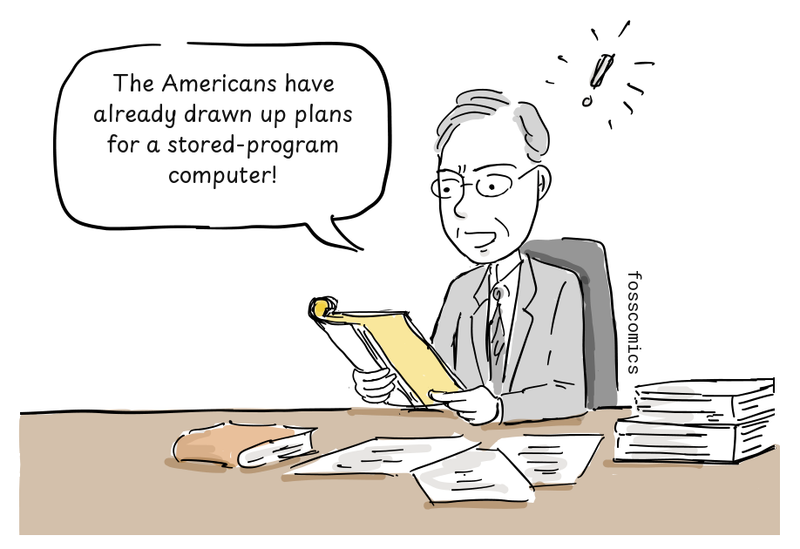
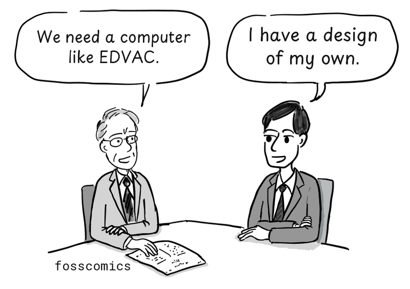
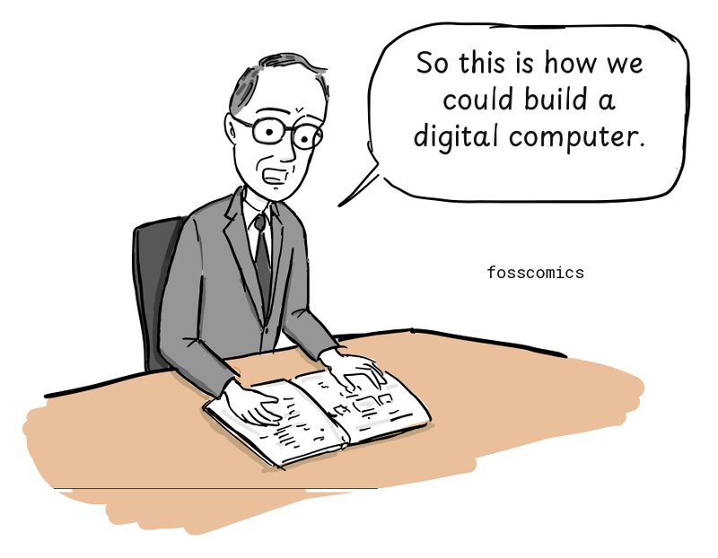
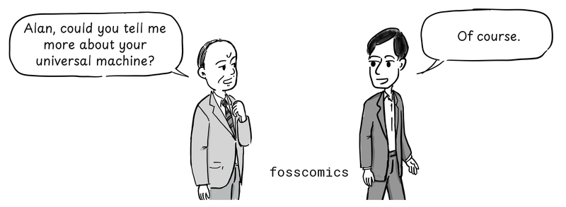
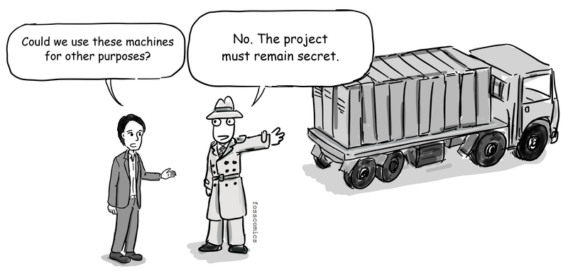

:::panels columns="2" label="Alan Turing and John von Neumann"
 size:80%")
 size:80%")
:::

Who first built a computer like the ones we use today?

During World War II, teams in several countries began developing electronic computers to speed up wartime calculations such as codebreaking and artillery tables.

## The Turing machine: possibilities and limits of computation

But before physical computers appeared, British mathematician [Alan Turing](https://en.wikipedia.org/wiki/Alan_Turing) was thinking about a different question.

In 1928, mathematicians David Hilbert and Wilhelm Ackermann posed what became known as the Entscheidungsproblem, or decision problem:

")
> "Could every problem in logic be solved automatically by a fixed procedure?"

More precisely, they asked whether an algorithm could determine whether any statement in first-order logic is valid. But answering that question first required a precise definition of what it means to calculate by following a fixed procedure.

In 1936, Turing proposed a remarkably simple imaginary machine: it would read one symbol at a time from a long tape, write or erase symbols according to a finite set of rules, and move left or right along the tape.

> "Can a machine decide whether any statement in logic is valid?"

Today, we call this model the [Turing machine](https://en.wikipedia.org/wiki/Turing_machine).

Turing used it to show that **no mechanical procedure can decide every problem in logic**. In other words, no matter how sophisticated an algorithm may be, **some problems cannot be solved by computation**.

His work also introduced another important idea. Instead of building a separate machine for each calculation, the rules describing another machine could be encoded on the tape, allowing a single machine to perform many kinds of computation. Turing called this a "universal machine."

This idea appeared in his 1936 paper, ["On Computable Numbers, with an Application to the Entscheidungsproblem"](https://www.cs.virginia.edu/~robins/Turing_Paper_1936.pdf).

> "If the rules are written on the tape, the machine can follow them?"

This was not a blueprint for a physical computer. Turing's machine was an abstract mathematical model intended to explain computation.

Still, the idea that one machine could perform many kinds of computation by following stored instructions became an important theoretical precursor to the general-purpose stored-program computer.

## War and the first computers

Around World War II, these mathematical ideas began to take physical form. Teams in the United States, Britain, and elsewhere developed electronic computers, while several groups helped advance practical architectures that stored programs in memory.

:::panel rounded="true"
During World War II, Turing helped design an improved British Bombe that was used to decipher messages encrypted by the German Enigma machine, making an important contribution to Allied cryptanalysis[&lbrack;2&rbrack;][2].

:::

Many computing machines built during the war were designed for specific tasks. As the war was nearing its end, however, the United States was developing [ENIAC](https://en.wikipedia.org/wiki/ENIAC), a general-purpose electronic computer. J. Presper Eckert, John Mauchly, and their team at the University of Pennsylvania began building it in 1943 and completed it in 1946. The U.S. Army initially used ENIAC to calculate artillery firing tables.

Programming ENIAC was very different from programming a modern computer. Instead of loading a program from memory, operators configured switches and connected cables on its plugboards. Running a different program required them to reconfigure the machine.

> "Is this really programming?" \
> "It's a start."

ENIAC weighed about 30 tons, contained roughly 18,000 vacuum tubes, and consumed around 150 kilowatts of power[&lbrack;3&rbrack;][3].

## EDVAC and the stored-program design

The ENIAC team next began designing EDVAC for the U.S. Army's Ballistic Research Laboratory, making it one of the earliest stored-program computer projects. John von Neumann joined the project as a consultant, and the widely circulated [First Draft of a Report on the EDVAC](http://www.virtualtravelog.net/wp/wp-content/media/2003-08-TheFirstDraft.pdf) appeared under his name. The design stored instructions and data in the same memory. EDVAC was delivered in 1949 but became fully operational later; meanwhile, the Manchester Baby had run a stored program in 1948.

Storing instructions in memory meant that a new program could be loaded without rewiring the computer for every task. Hardware and software still depended on one another, but changing the computation no longer required redesigning its physical connections.

:::panel rounded="true"
Most general-purpose computers still use variants of what became known as the [von Neumann architecture](https://en.wikipedia.org/wiki/Von_Neumann_architecture).

(Adapted from [Wikipedia](https://en.wikipedia.org/wiki/Von_Neumann_architecture#/media/File:Von_Neumann_Architecture.svg))
:::

As the diagram shows, a basic von Neumann architecture consists of a central processing unit (CPU), memory, and input/output devices. The CPU contains an arithmetic logic unit (ALU), which performs arithmetic and logical operations; processor registers, which hold values needed immediately; and a control unit. The control unit includes registers such as the instruction register and program counter. Memory stores both instructions and data. During the fetch-decode-execute cycle, the CPU retrieves an instruction, interprets it, performs the operation, and stores any result[&lbrack;6&rbrack;][6].

## Britain's stored-program computers: ACE and EDSAC

Britain's National Physical Laboratory obtained von Neumann's EDVAC report in 1945.

> "The Americans have already drawn up plans for a stored-program computer!"

The laboratory then asked Turing to design a stored-program computer along the lines of EDVAC. Beginning in 1945, Turing worked on the [Automatic Computing Engine (ACE)](https://en.wikipedia.org/wiki/Automatic_Computing_Engine), giving him an opportunity to turn ideas from his theoretical work into a practical computer design.

> "We need a computer like EDVAC." \
> "I have a design of my own."

Although Turing's [ACE report](https://www.amazon.com/Turings-Report-1946-Other-Papers/dp/0262031140), presented in 1946, came after von Neumann's EDVAC report, it contained a detailed design for a stored-program computer. Turing kept the hardware to a minimum and proposed implementing even some arithmetic operations in software. In this respect, ACE anticipated ideas later associated with reduced instruction set computer (RISC) processors. Delays in funding and construction frustrated Turing, and in 1947 he returned to Cambridge on leave before the full ACE could be built[&lbrack;4&rbrack;][4].

> "The design is ready. Why haven't they approved the funding?"

Maurice Wilkes, who led the EDSAC project at Cambridge, studied the EDVAC report.

> "So this is how we could build a digital computer."

:::panel rounded="true"
Elsewhere in Britain, Cambridge University's Mathematical Laboratory completed the [Electronic Delay Storage Automatic Calculator (EDSAC)](https://en.wikipedia.org/wiki/EDSAC) in 1949, drawing on the stored-program design described in the EDVAC report.
Meanwhile, Turing's ACE design continued to influence work at NPL, which built a smaller version called the [Pilot ACE](https://en.wikipedia.org/wiki/Pilot_ACE). It ran its first program in 1950.

:::

## Turing and von Neumann

Alan Turing's 1936 concept of a universal machine was an important theoretical precursor to the stored-program computer. In the United States, John von Neumann, J. Presper Eckert, John Mauchly, and others subsequently contributed to the development of the stored-program architecture through the EDVAC project, while British teams pursued their own implementations. Interestingly, Turing studied for his Ph.D. at Princeton University from 1936 to 1938, while von Neumann was a professor at the nearby Institute for Advanced Study. The two knew one another, and von Neumann, who was familiar with Turing's work on computability, later offered Turing a position. Some historians have therefore suggested that Turing's ideas may have influenced von Neumann's thinking. However, the extent of that influence is uncertain, and von Neumann's 1945 EDVAC report did not cite Turing's 1936 paper.

> "Alan, could you tell me more about your universal machine?" \
> "Of course."

They may have had a conversation like this, though no record of it survives.

## The commercial potential of computers

:::panel rounded="true"
During World War II, Britain, Germany, and the United States all developed pioneering computing machines, but the war shaped what happened to them afterward. In Britain, Colossus was built in secret to help break German ciphers. Most Colossus machines were dismantled after the war, and the project remained secret for decades. Germany also produced pioneering computers, including Konrad Zuse's machines, but wartime destruction and Germany's defeat disrupted further development.

> "Could we use these machines for other purposes?" \
> "No. The project must remain secret."
:::

In the United States, immigrants including von Neumann made major contributions alongside engineers, mathematicians, programmers, universities, companies, and government laboratories. Strong government support and a growing commercial market then helped the United States develop the world's largest early computer industry.

:::panels columns="3" label="Alan Turing, John von Neumann, and Kurt Gödel"
 earned a Ph.D. from Princeton University and developed a mathematical model of computation.")
, a Hungarian immigrant, worked on the design of the stored-program computer.")
 was born in Austria-Hungary and later became a U.S. citizen. His incompleteness theorems helped set the stage for the development of the Turing machine.")
:::

## References

1. [Turing_machine, Wikipedia](https://en.wikipedia.org/wiki/Turing_machine)
2. [Alan_Turing, Wikipedia](https://en.wikipedia.org/wiki/Alan_Turing)
3. [History_of_computing_hardware, Wikipedia](https://en.wikipedia.org/wiki/History_of_computing_hardware)
4. [The universal computer, p.167~168, CRC press, 2012](https://www.amazon.com/Universal-Computer-Road-Leibniz-Turing/dp/1466505192)
5. [Gödel's incompleteness theorems, Wikipedia](https://en.wikipedia.org/wiki/G%C3%B6del%27s_incompleteness_theorems)
6. [Central processing unit, Wikipedia](https://en.wikipedia.org/wiki/Central_processing_unit)

[1]: https://en.wikipedia.org/wiki/Turing_machine "Turing Machine, Wikipedia"
[2]: https://en.wikipedia.org/wiki/Alan_Turing "Alan_Turing, Wikipedia"
[3]: https://en.wikipedia.org/wiki/History_of_computing_hardware "History_of_computing_hardware, Wikipedia"
[4]: https://www.amazon.com/Universal-Computer-Road-Leibniz-Turing/dp/1466505192 "The universal computer, p.167~168, CRC press, 2012"
[6]: https://en.wikipedia.org/wiki/Central_processing_unit "Central processing unit, Wikipedia"
