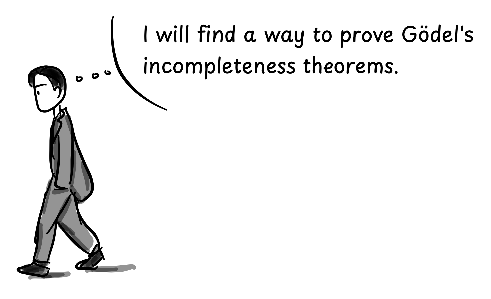
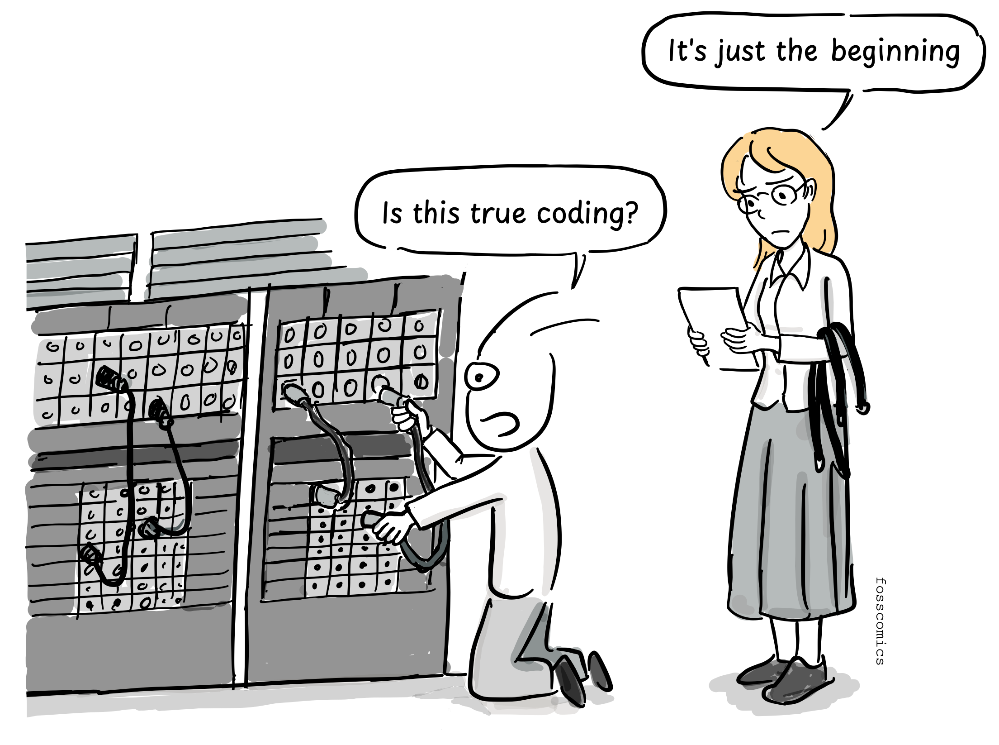
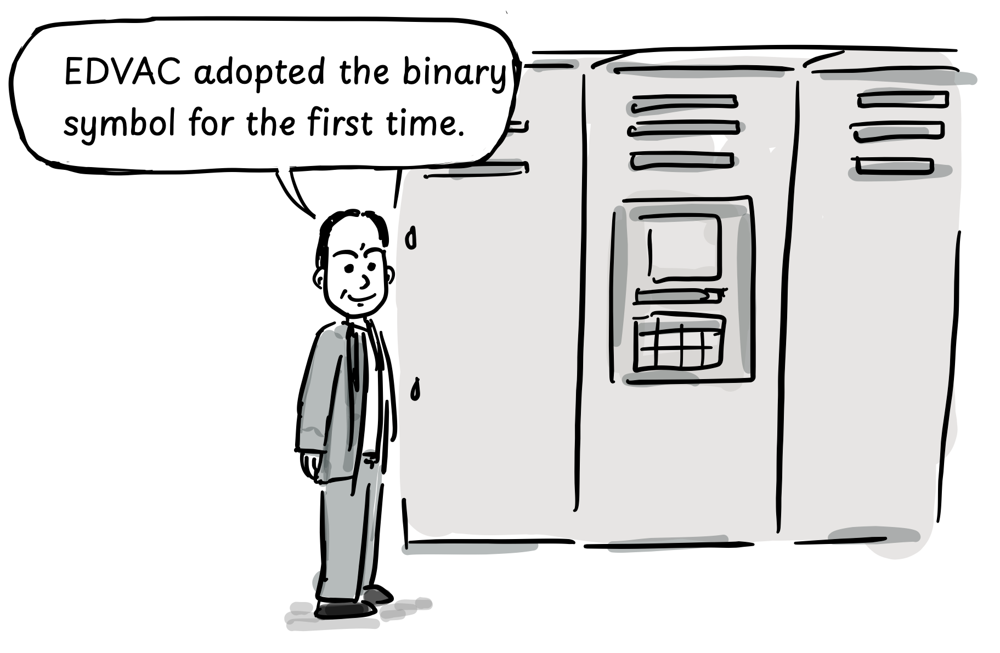
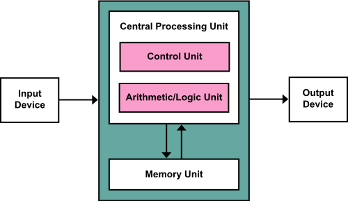
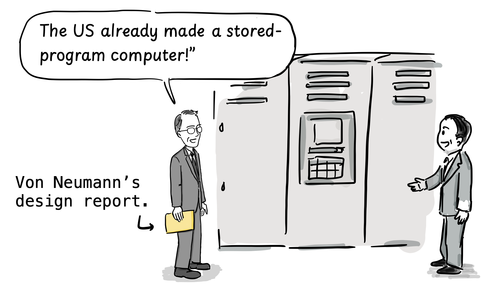
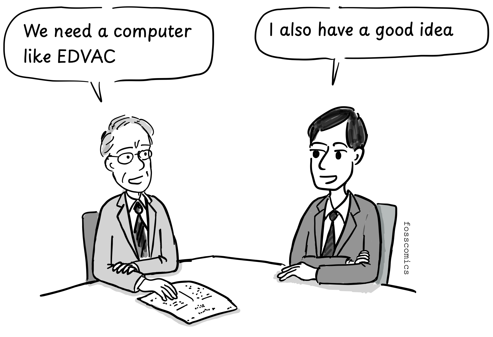
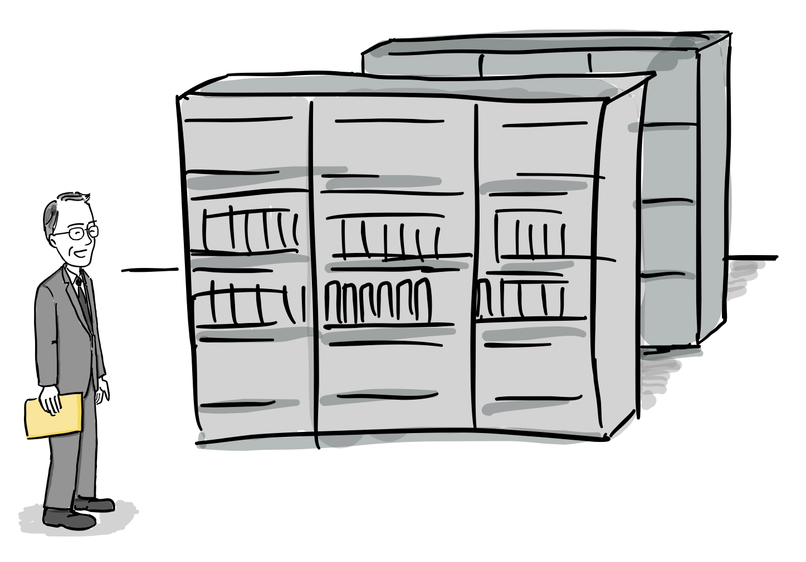
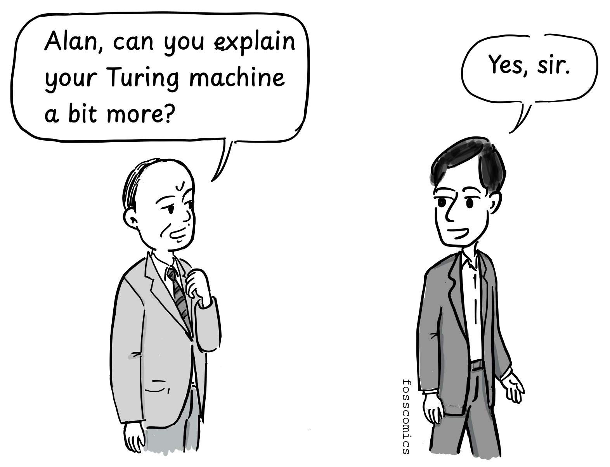

Who initially made the type of computer we use today? After the Second World War,  many countries tried to develop a computer, but Alan Turing, an English mathematician, was the first to propose a theoretical model of the computer.

> "I will find a way to prove Gödel's incompleteness theorems."

At the time, a famous mathematician, [David Hilbert](https://en.wikipedia.org/wiki/David_Hilbert), introduced [a problem](https://en.wikipedia.org/wiki/Hilbert%27s_second_problem), which is about whether we could find an algorithm (machine) that could solve all the mathematical problems. [Gödel's incompleteness theorems](https://en.wikipedia.org/wiki/G%C3%B6del%27s_incompleteness_theorems), proposed by the Austro-Hungarian mathematician, logician and philosopher Kurt Gödel, are widely interpreted as showing that Hilbert's program to find a complete and consistent set of axioms for all mathematics is impossible [5]. Turing wanted to prove if Gödel's incompleteness theorems were right using his own way by designing a machine. Finally, in 1937, he published a paper, ["On Computable Numbers, with an Application](https://www.cs.virginia.edu/~robins/Turing_Paper_1936.pdf) that mentioned the [Turing machine](https://en.wikipedia.org/wiki/Turing_machine). It was an abstract machine that processed the symbols written on a strip of tape as the rules of the symbols defined in the table, which defines the mathematical model of the computer[&#91;1&#93;][1]. The symbols written in the tape could be thought of as software.

> “Wow, rewriting this document by hand is like copying the program.”

Alan Turing contributed to the Allied victory by creating a device called Bombe designed for breaking German ciphers during the Second World War[&lbrack;2&rbrack;][2]. At the time, computers were made for specific purposes. By the end of the war, the United States began making a general purpose computer, called [ENIAC(ENIAC).](https://ko.wikipedia.org/wiki/%EC%97%90%EB%8B%88%EC%95%85) John Mauchly and his team began to develop ENIAC in 1943 and completed it in 1946 at the University of Pennsylvania. After that, the US military used ENIAC to calculate ballistics tables for missiles.

In 1940s, the programming was totally different from today’s programming. We needed to connect each switch to set an instruction and also had to replace the circuit board in order to run another program. In addition, it was too heavy (30 tons) and consumed too much energy: 200 KW of electricity because it used 18,000 vacuum tubes[&lbrack;3&rbrack;][3].

> “Is this true coding?” \
> "It's just the beginning"

Later, the team who made ENIAC began to develop EDVAC, the world's first stored-program computer, which was delivered to the US Ballistic Research Laboratory in 1949. Von Neumann was involved in the development of EDVAC as a consultant and wrote the [first draft of a report on EDVAC](http://www.virtualtravelog.net/wp/wp-content/media/2003-08-TheFirstDraft.pdf). He proposed a [computer architecture](https://en.wikipedia.org/wiki/Computer_architecture) that was designed to save a program and its data in the same memory.

> ”EDVAC adopted the binary symbol for the first time.”

Now, all computers are using the computer architecture he proposed. We call it [Von Neumann](https://ko.wikipedia.org/wiki/%ED%8F%B0_%EB%85%B8%EC%9D%B4%EB%A7%8C_%EA%B5%AC%EC%A1%B0) architecture.

(From [wikipedia](https://en.wikipedia.org/wiki/Von_Neumann_architecture#/media/File:Von_Neumann_Architecture.svg))

As you can see in the picture above, Von Neumann architecture consists of a CPU (Central Processing Unit), a memory unit, and input and output devices. The processing unit contains an arithmetic logic unit and processor registers. The control unit contains an instruction register and program counter. The memory unit may store data and instructions together. In general, the control unit executes an instruction by fetching it from memory, using its ALU(Arithmetic Logic Unit) to perform an operation, and then storing the result in its memory[&lbrack;6&rbrack;][6].

British government officials eventually found out about the EDVAC computer made in the United States and the report written by Von Neumann.

> “The US already made a [stored-program computer](https://en.wikipedia.org/wiki/Stored-program_computer)!”

They asked Alan Turing to make a stored-program computer like EDVAC. Finally, he had the opportunity to develop a stored-program computer using his ideas from ​designing the Turing machine starting in 1945 at the National Physical Laboratory. The name was [ACE (Automatic Computing Engine)](https://en.wikipedia.org/wiki/Automatic_Computing_Engine).

> “We need a computer like EDVAC” \
> “I also have a good idea”

When we look at [his paper,](https://www.amazon.com/Turings-Report-1946-Other-Papers/dp/0262031140) published in 1946, although the report was written later than the EDVAC report by Von Neumann, it also included a detailed design for the stored-program computer. Moreover, the hardware is minimally designed to run arithmetic instructions in software, which is the same design philosophy and approach of the RISC CPU today. However, the development of ACE was delayed due to his wartime work and the secrecy required, and he returned to Cambridge for a sabbatical year in 1947 without having finished working on ACE[&lbrack;4&rbrack;][4].

> "I already have a design. Why haven't they made a decision yet?"

Eventually, the mathematics institute at the University of Cambridge developed a computer called [Electronic Delay Storage Automatic Calculator (EDSAC)](https://ko.wikipedia.org/wiki/%EC%97%90%EB%93%9C%EC%82%AD) in 1949 with the proven design of the von Neumann computer.

Alan Turing was ahead of the idea and design of the stored-program computer, but the actual implementation was led by the United States. In fact, since Alan Turing spent a few years working on his Ph.D. at the Institute for Advanced Study in Princeton University in 1937, while von Neumann was a professor of mathematics there, von Neumann might have gotten ideas from Alan Turing. However, von Neumann did not mention it in his report.

> "Alan, can you explain your Turing machine a bit more?" \
> "Yes, sir."

They might have talked to each other like this.

In fact, Britain made the first computer, Colossus, in order to break German ciphers during World War II, but the machines and related information were destroyed after the war as part of the effort to maintain the secrecy of the project. Germany also built their own computers during World War II, but their research could not continue due to their defeat.

> “We can use the machine for other purposes” \
> “No, we can’t. They would be destroyed because of confidentiality”

In the United States, immigrants such as Von Neumann contributed greatly to the development of early computers and continued to develop commercial computers. Finally, the computer era began with their efforts.

## References

1. [Turing_machine, Wikipedia](https://en.wikipedia.org/wiki/Turing_machine) \
2. [Alan_Turing, Wikipedia](https://en.wikipedia.org/wiki/Alan_Turing) \
3. [History_of_computing_hardware, Wikipedia](https://en.wikipedia.org/wiki/History_of_computing_hardware) \
4. [The universal computer, p.167~168, CRC press, 2012](https://www.amazon.com/Universal-Computer-Road-Leibniz-Turing/dp/1466505192)\
5. [Gödel's incompleteness theorems, Wikipedia](https://en.wikipedia.org/wiki/G%C3%B6del%27s_incompleteness_theorems) \
6. [Central processing unit, Wikipedia](https://en.wikipedia.org/wiki/Central_processing_unit)

[1]: https://en.wikipedia.org/wiki/Turing_machine "Turing Machine, Wikipedia"
[2]: https://en.wikipedia.org/wiki/Alan_Turing "Alan_Turing, Wikipedia"
[3]: https://en.wikipedia.org/wiki/History_of_computing_hardware "History_of_computing_hardware, Wikipedia"
[4]: https://www.amazon.com/Universal-Computer-Road-Leibniz-Turing/dp/1466505192 "The universal computer, p.167~168, CRC press, 2012"
[6]: https://en.wikipedia.org/wiki/Central_processing_unit "Central processing unit, Wikipedia"
