[GNU Project](https://ko.wikipedia.org/wiki/GNU_%ED%94%84%EB%A1%9C%EC%A0%9D%ED%8A%B8)를 시작하기로 결심한 리차드 스톨만(이하 RMS)은 1984년 1월 [MIT AI Lab.](https://en.wikipedia.org/wiki/MIT_Computer_Science_and_Artificial_Intelligence_Laboratory)을 그만두기로 결심한다.

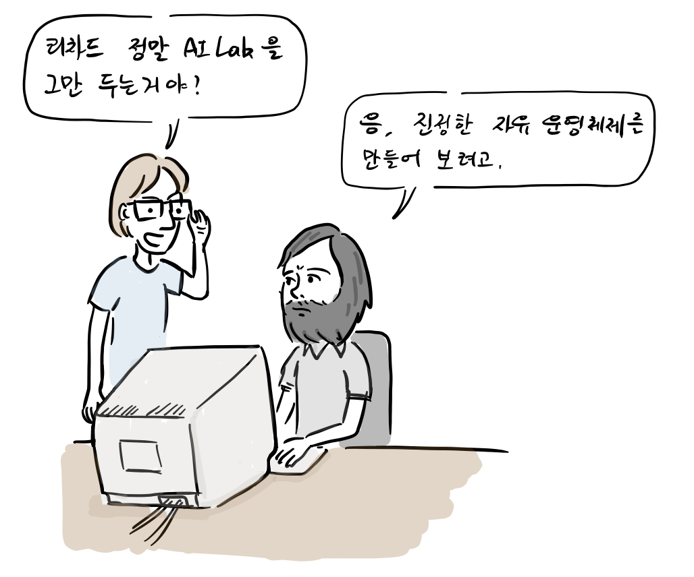

“리차드, 정말 AI Lab. 그만두는거야?”  
“응, 진정한 자유 운영체제를 만들어보려고.”

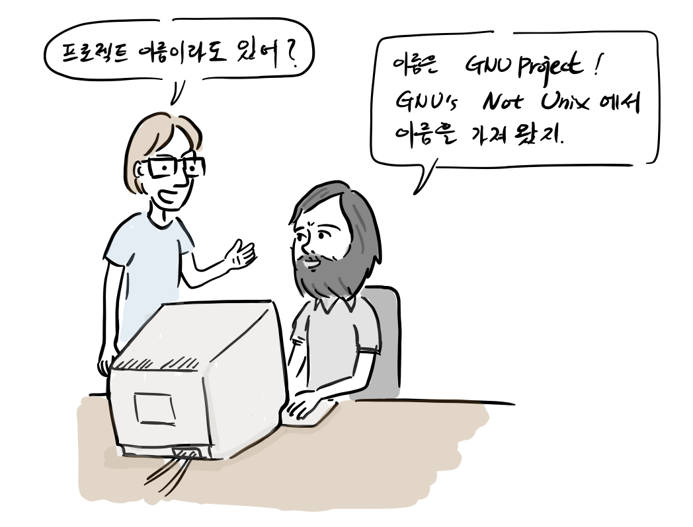

“프로젝트 이름이라도 있어?  
“이름은 ‘GNU’s Not Unix;에서 따왔지.”

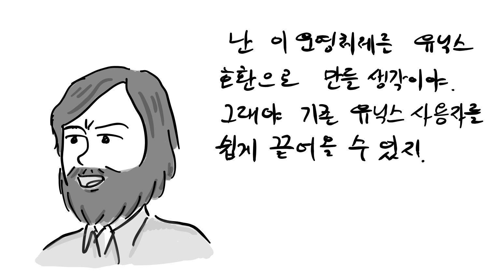

하지만, 난 이 운영체제를 UNIX 호환으로 만들 생각이야, 그래야 기존 유닉스 사용자가 쉽게 끌어올 수 있지. 어떤가 해커스럽지 않은가?

“커널 뿐만 아니라 어셈블러, 컴파일러, 인터프리터, 디버거, 텍스 편집기, 메일 프로그램 등 만들게 아주 많아. 어때, 프로젝트에 참여하겠나?”

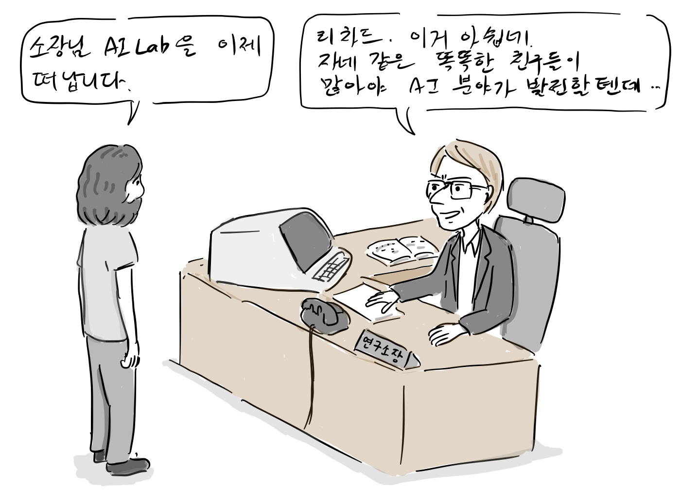

“소장님, AI Lab.을 이제 떠납니다. 그동안 고마웠습니다.”  
“이거 너무 아쉽네. 자네 같은 똑똑한 친구들이 많아야 인공지능 분야가 발전할텐데..”

“제가 뜻이 있어서.. 지금이 아니면, 다시 시작하기 어려울 것 같습니다.”

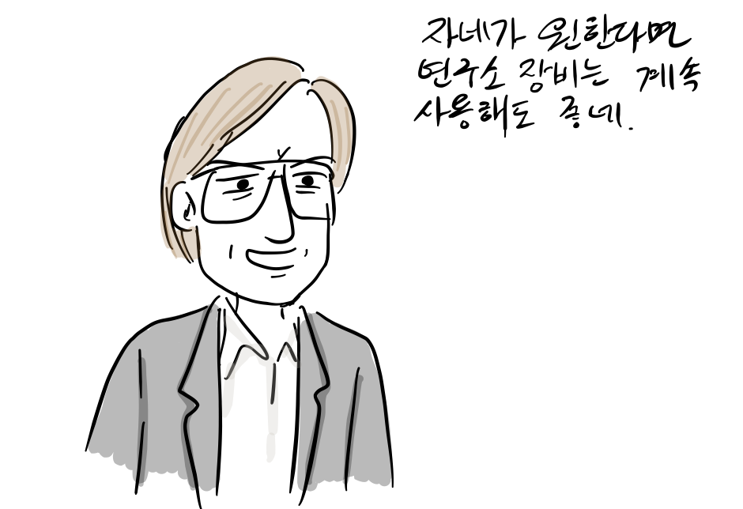

“내 익히 들어서 알고 있네. 자네가 원한다면 연구소 장비는 계속 사용하게나. 좋은 뜻으로 일을 그만둔다고하니 내가 도와야지.”

용기있게 AI Lab.을 나왔지만, 사실 운영체제 개발을 위해 준비된 것은 거의 없었다.

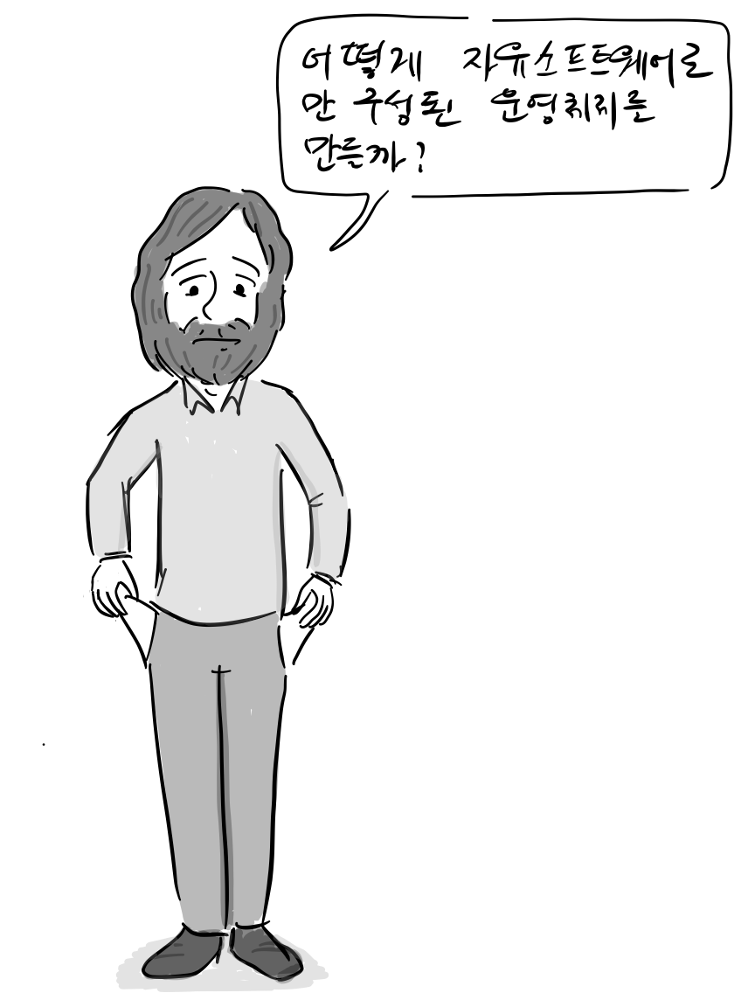

우선 소스 코드가 공개된 컴파일러를 확보하기 위해 VUCK(Free University Compiler Kit)를 개발한 [앤드루 타넨바움](https://ko.wikipedia.org/wiki/%EC%95%A4%EB%93%9C%EB%A3%A8_%ED%83%80%EB%84%A8%EB%B0%94%EC%9B%80) 교수에게 메일을 보내 GNU Project에서 사용할 수 있는지 여부를 문의했다.

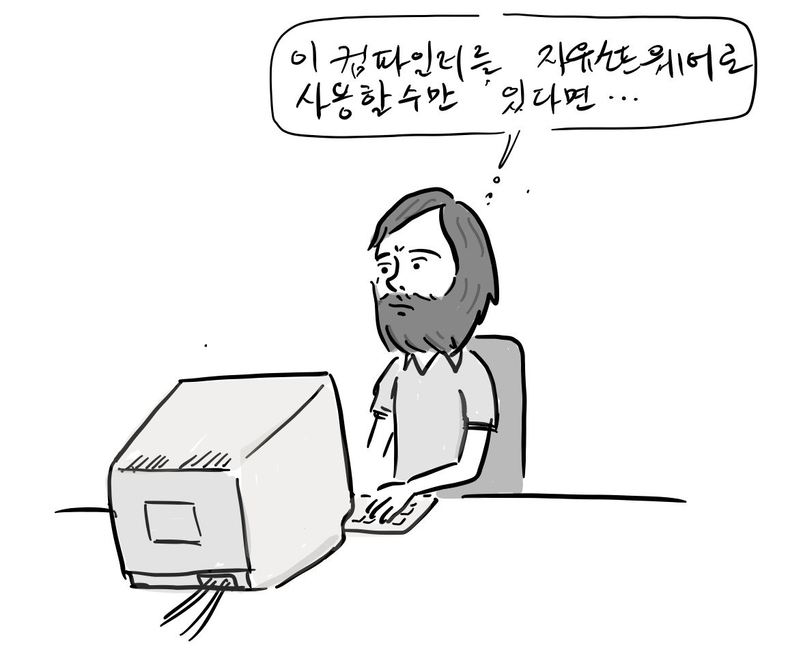

.

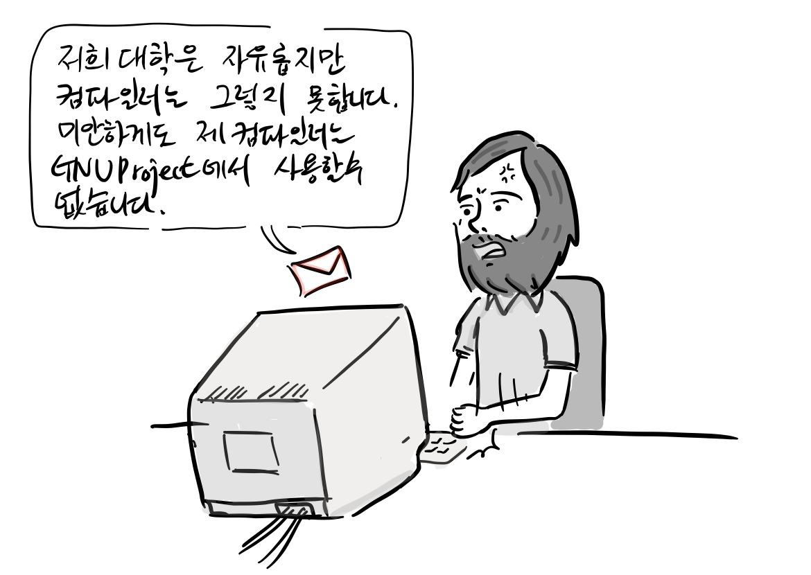

“대학은 무료지만, 컴파일러는 그렇지 못하네요. 미안하게도 제 컴파일러는 GNU Project에서 사용할 수는 없습니다.”

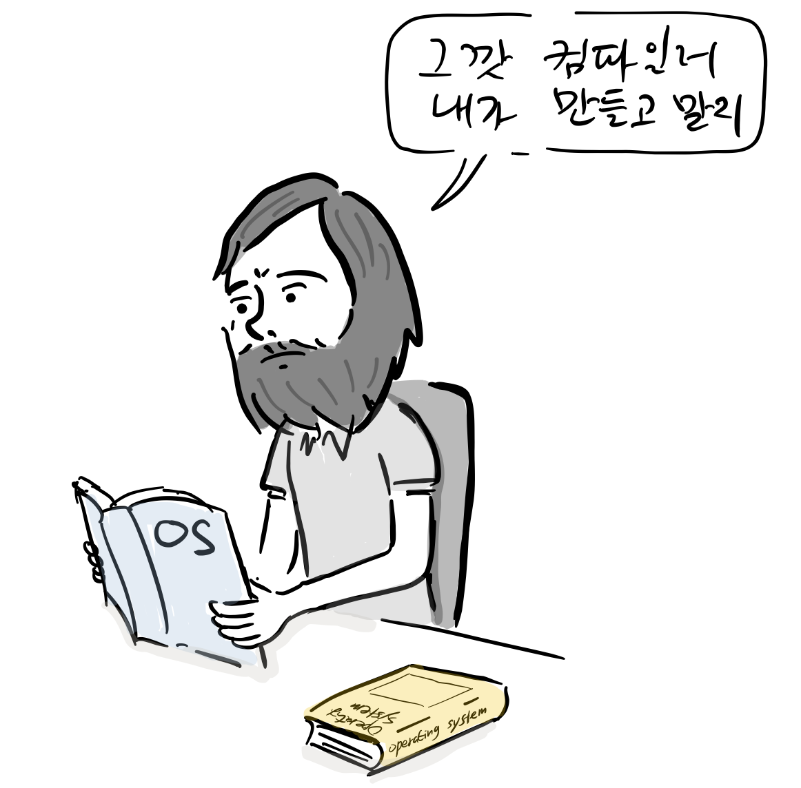

RMS는 GNU Project의 첫번째 프로젝트로 컴파일러를 만들기도 결심한다. 하지만, 컴파일러를 밑바닥 부터 만드는 것은 쉽지 않았고, 외부에서 컴파일러 소스코드를 입수한다.

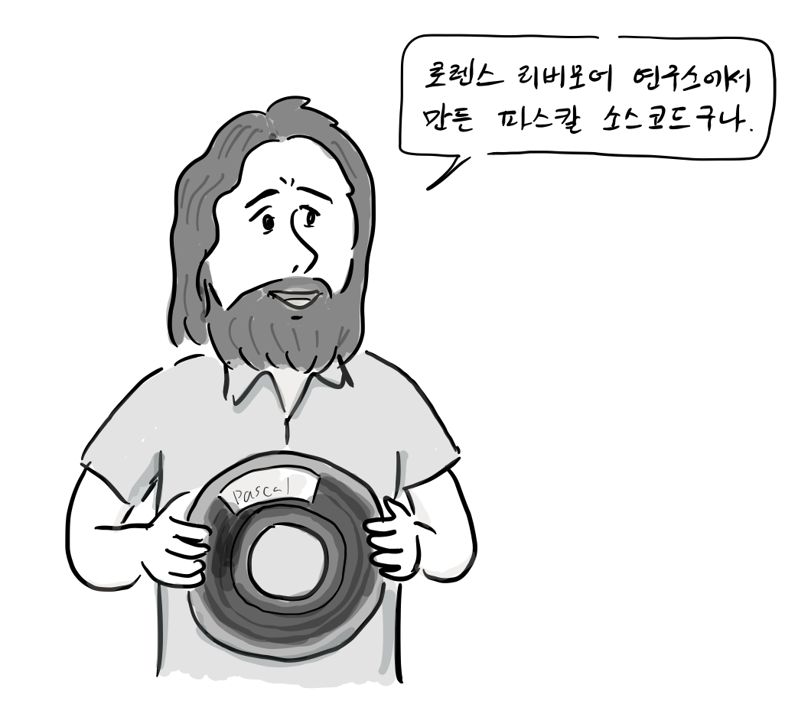

“로렌스 리버모어 연구소가 만든 파스칼 컴파일러 소스 코드구나… 이 코드를 기반으로 C언어 프론트 엔드를 개발하자.”

RMS는 이 컴파일러에 C 언어 프론트 엔드를 추가해서 [Motorola 68000](https://en.wikipedia.org/wiki/Motorola_68000) 컴퓨터에 이식하기 시작했다.

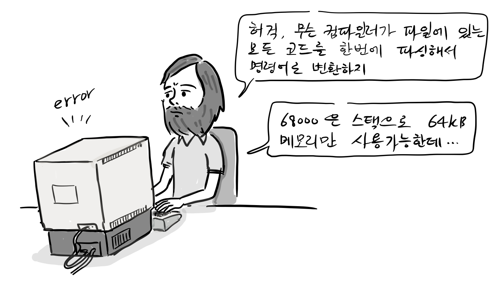

“허걱 무슨 컴파일러가 파일에 있는 모든 코드를 한번에 파싱해서 명령어로 변환하지..”  
“68000은 스택으로 64KB 메모리만 사용할 수 있는데…”

“안되겠다. 역시 바닥부터 컴파일러는 만들어겠다. 이름은 GCC(GNU C Compiler). 이미 C언어 프론트 엔드를 만들었으니, 이걸 재사용하면 되겠네… 하지만, 우선 에디터를 먼저 만들자.”

RMS는 1984년 9월 부터 MIT AI Lab.에서 사용되던 [이맥스(Emacs) 편집기](https://ko.wikipedia.org/wiki/%EC%9D%B4%EB%A7%A5%EC%8A%A4)의 GNU 버전을 개발하기 시작한다.

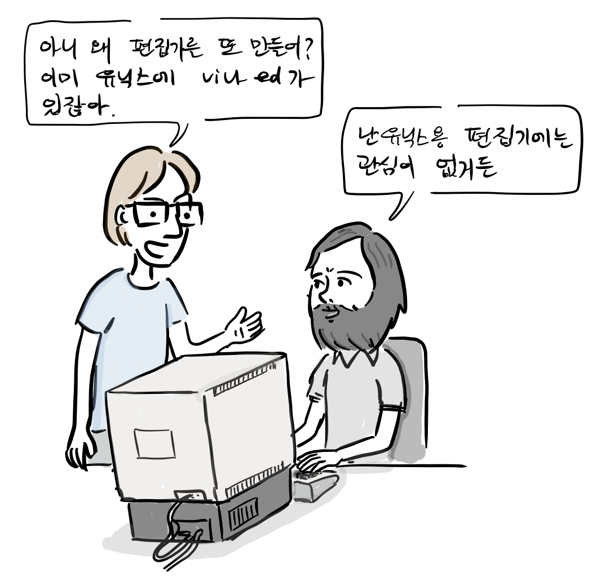

“아니 왜 따로 에디터를 만들어? 이미 유닉스에는 vi나 ed가 있잖아?”  
“난 유닉스용 텍스트 편집기에는 관심이 없거든.”

RMS는 개발한 이맥스 편집기를 ftp사이트에 올려 놓았고 $150에 이맥스 테이프를 배송하는 사업을 시작했다. 당시 수입이 없었던 RMS는 자유소프트웨어 판매를 통해 수입을 얻게 된 것이다.

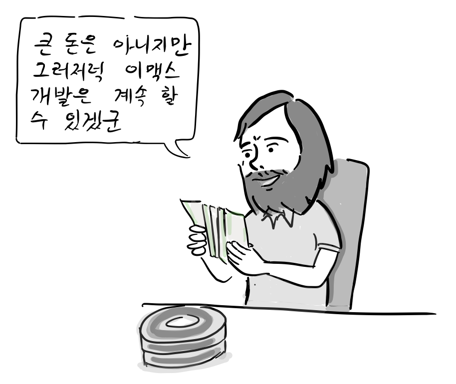

“큰 돈은 아니지만, 그럭저럭 이맥스 개발은 계속할 수 있겠군.”

참고

1.  리차드 스톨만, [GNU 운영체제와 자유소프트웨어 운동, 오픈소스 혁명의 목소리, 한빛출판사](http://www.hanbit.co.kr/store/books/look.php?p_code=E5329835060), 2013

참고로, 등장 인물 간 대화는 자료를 바탕으로 재구성되었습니다.

만화 중 잘못된 부분이나 추가할 내용이 있으면 [만화 원고](https://docs.google.com/document/d/12qvQzL9blro_aTfMGGY6cJVgzwqKKI5RSBzvRQSfus4/edit?usp=sharing)에 직접 의견을 남겨주시면 고맙겠습니다. 그 외 전반적인 만화 후기는 블로그에 바로 답글로 남겨주세요. 다음 이야기는 자유 소프트웨어 재단(Free Software Foundation)을 소개합니다.
