**자유 소프트웨어 재단** 리차드 스톨만(이하 RMS)이 [GNU 이맥스](https://en.wikipedia.org/wiki/GNU_Emacs) 편집기를 공개한 후, GNU 프로젝트에 참여하는 사람들이 생겨났다.

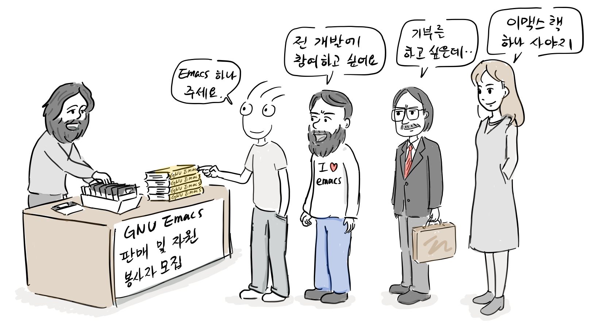

이후 자유 소프트웨어를 개발과 이용을 장려하기 위해 1985년 [자유 소프트웨어 재단(FSF: Free Software Foundation)](https://ko.wikipedia.org/wiki/%EC%9E%90%EC%9C%A0_%EC%86%8C%ED%94%84%ED%8A%B8%EC%9B%A8%EC%96%B4_%EC%9E%AC%EB%8B%A8)을 설립한다.

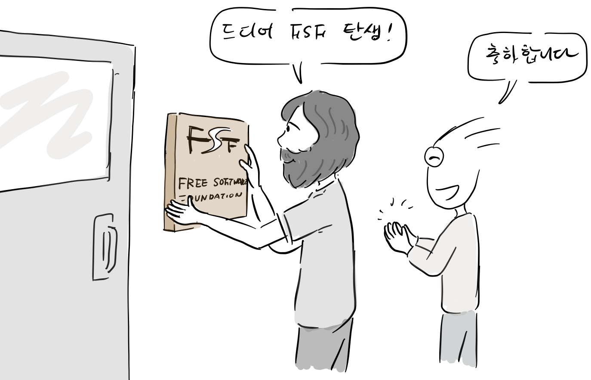

FSF는 이맥스 편집기 배포 사업과 메뉴얼 판매등 여러 사업을 진행했고 기부금도 받기 시작했다.

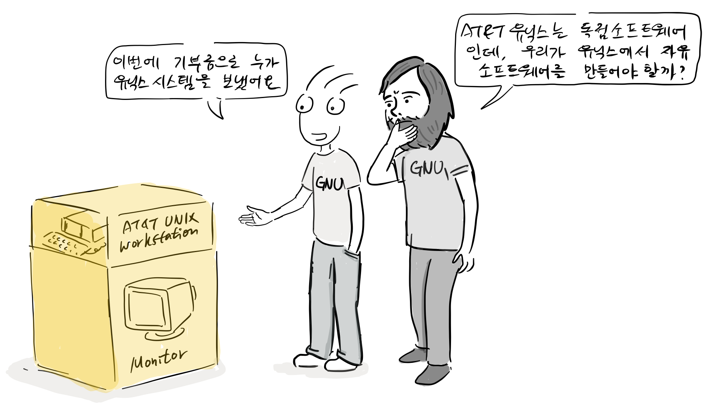

“이번에 기부금으로 유닉스 시스템을 보냈어요. ” “AT&T 유닉스는 독점 소프트웨어인데, 우리가 유닉스에서 자유 소프트웨어를 만들어야 할까?”

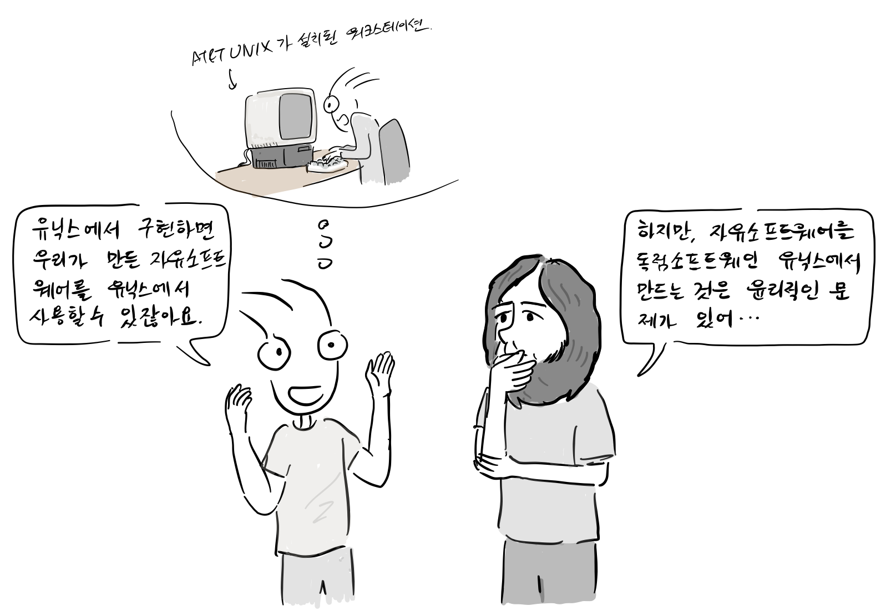

“유닉스에서 구현하면 우리가 만든 자유 소프트웨어를 유닉스에서 사용할 수 있잖아요” “하지만, 자유 소프트웨어를 독점 소프트웨어인 유닉스에서 만드는 것은 윤리적인 문제가 있어…”

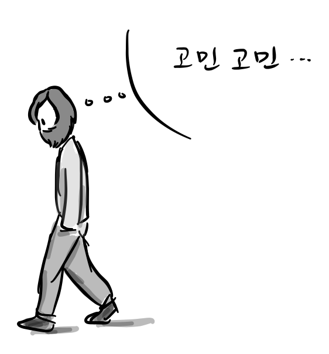

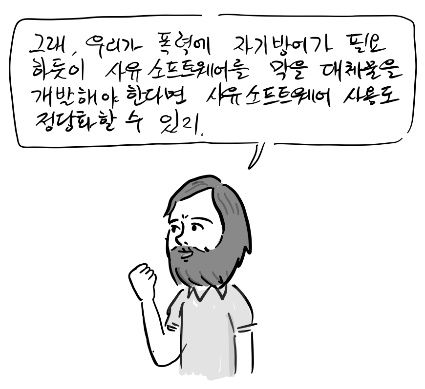

“그래, 우리가 폭력에 대해 자기방어가 필요하듯이, 독점 소프트웨어를 막을 대체물을 개발해야한다면 독점 소프트웨어 사용도 정당화할 수 있지. 자, 기증 받은 유닉스 컴퓨터도 개발에 사용합시다.”

**GCC 출시** FSF는 기부금과 여러 수익을 바탕으로 개발자를 고용했는데, 이들은 여러 종류의 GNU 소프트웨어 패키지를 만들고 관리했다. [GNU 컴파일러 모음(GCC)](https://ko.wikipedia.org/wiki/GNU_%EC%BB%B4%ED%8C%8C%EC%9D%BC%EB%9F%AC_%EB%AA%A8%EC%9D%8C)개발도 다시 진행할 수 있었고, 1987년 3월 첫번째 버전을 출시한다.

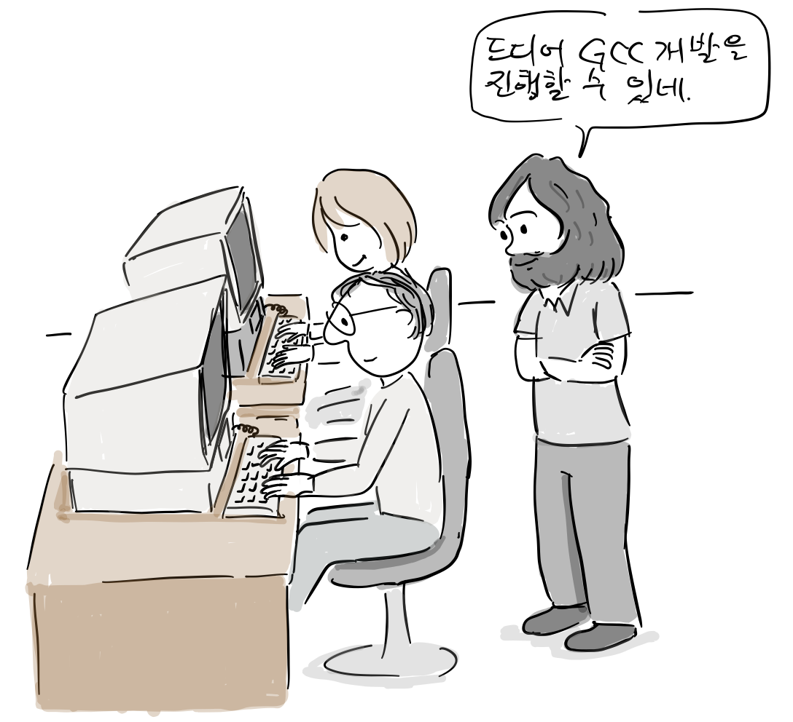

**GNU C 라이브러리와 배시 쉘 개발**

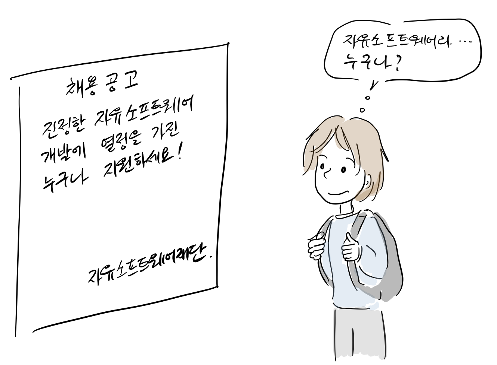

1988년 당시 15세였던 롤런드 맥 그래스(Roland McGrath)도 FSF에 채용되어 glibc개발을 시작하고\[3\], 같은해에 첫번째 버전을 릴리스한다. (참고로, 롤런드는 30년간 glibc를 개발했고, [2017년 공식적으로 프로젝트를 떠난다.](https://lwn.net/Articles/727383/))

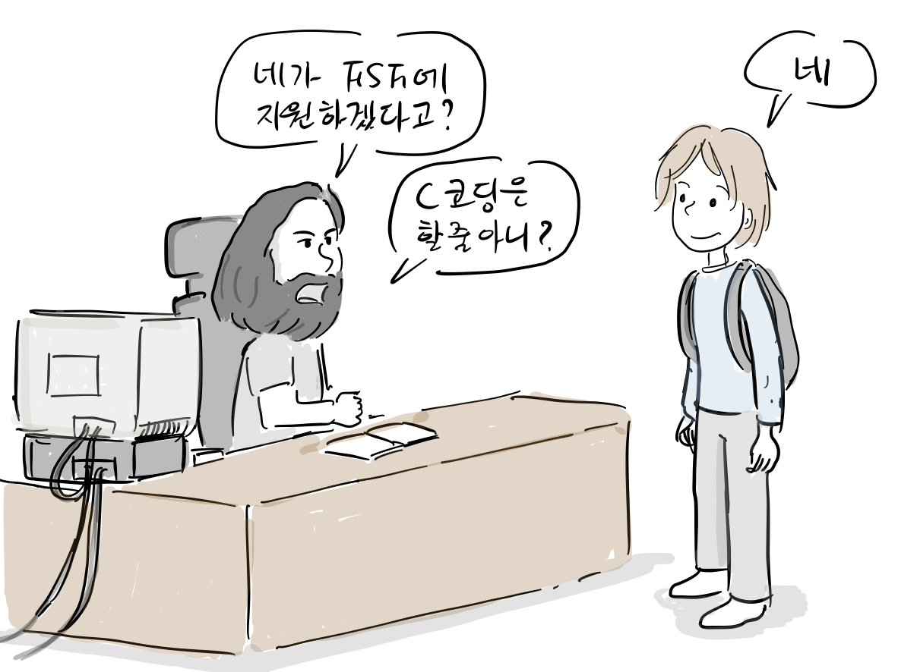

브라이언 폭스는 AT&T 유닉스에서 사용되고 있는 [본 셸](https://ko.wikipedia.org/wiki/%EB%B3%B8_%EC%85%B8)을 대치하기 위해 [배시 셸(Bash shell)](https://ko.wikipedia.org/wiki/%EB%B0%B0%EC%8B%9C_\(%EC%9C%A0%EB%8B%89%EC%8A%A4_%EC%85%B8\))을 개발했는데, 이렇게 만들어진 GNU C 라이브러리와 배시 셸은 리눅스에서 사용되었다. 이후, GNU 프로젝트는 GNU tar, GDB, GNU Make를 개발했다. gzip의 경우 [LZW](https://en.wikipedia.org/wiki/Lempel%E2%80%93Ziv%E2%80%93Welch)의 특허 문제를 피하기 위해 새롭게 개발한 압축 프로그램이였다,

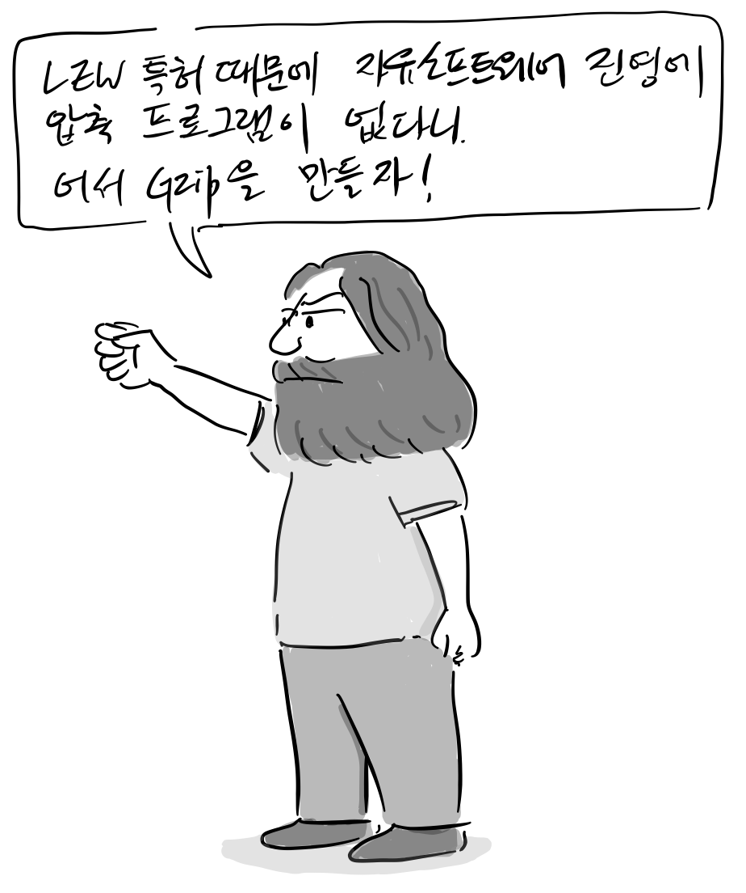

“LZW 특허 때문에 자유 소프트웨어 진영에 압축 프로그램이 없다니… 자 gzip을 만들자!”

이처럼 RMS는 FSF지원 아래 부족한 자유 소프트웨어를 하나 하나 개발하기 시작하였고, 1990년 마침내 꿈에 그리던 OS 커널 개발에 착수한다.

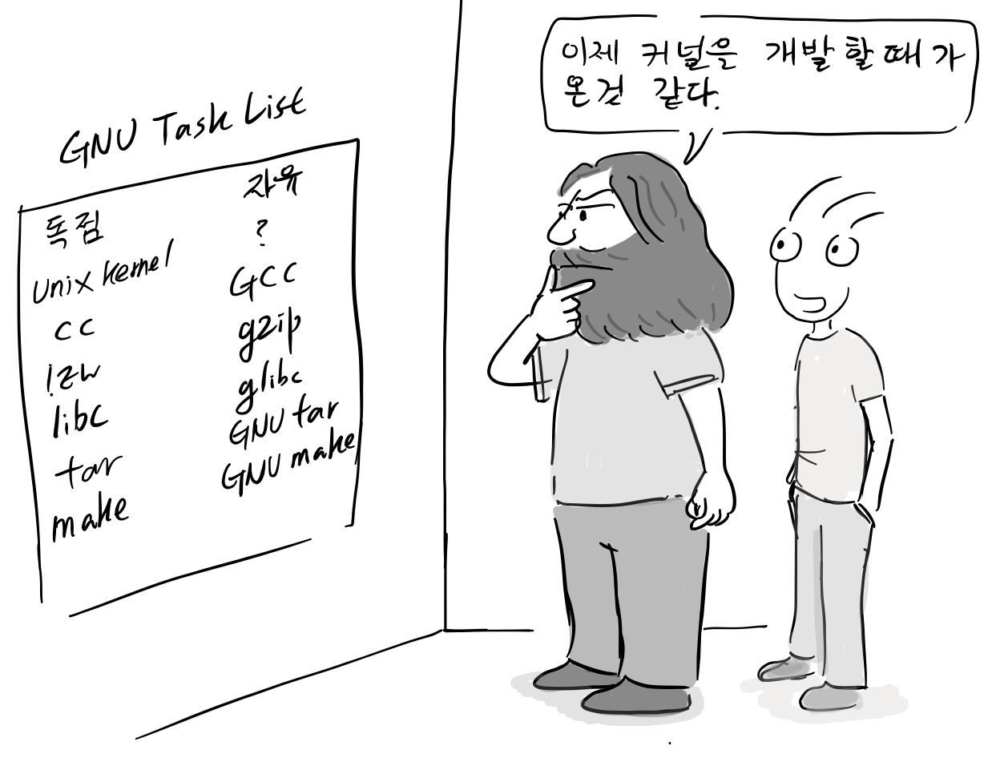

“이제 커널을 개발할 때가 온 것 같다.”

**Qt의 자유 소프트웨어 전환** 데스크탑 진영에도 자유 소프트웨어 바람이 불었는데, 당시 독점 소프트웨어였던 [CDE 데스크탑](https://ko.wikipedia.org/wiki/%EA%B3%B5%ED%86%B5_%EB%8D%B0%EC%8A%A4%ED%81%AC%ED%86%B1_%ED%99%98%EA%B2%BD)과 이를 구현한 [모티프](https://ko.wikipedia.org/wiki/%EB%AA%A8%ED%8B%B0%ED%94%84_\(%EC%9C%84%EC%A0%AF_%ED%88%B4%ED%82%B7\))를 대체할 툴킷을 찾기 시작했다. 그 결과, 1996년 [KDE 공동체](https://ko.wikipedia.org/wiki/KDE)가 생겨났고, Qt GUI 툴킷을 이용하여 KDE 데스크탑을 개발하기 시작했다. Qt는 소스코드가 공개되어 있었지만 2차 저작을 허용하지 않아 자유 소프트웨어 진영으로 부터 비판을 받았다.

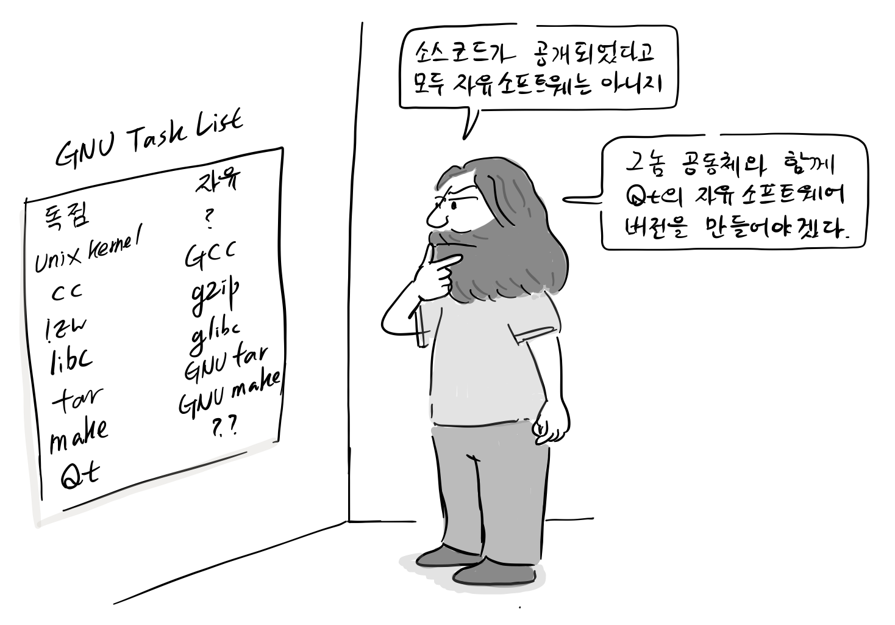

“소스코드가 공개되었다고 모두 자유 소프트웨어는 아니지. 그놈(GNOME) 공동체와 함께 Qt의 자유 소프트웨어 버전을 만들어야겠다.”

Qt 사용을 반대해온 사람들이 그놈 공동체를 만들었고 FSF와 함께 [하모니](https://en.wikipedia.org/wiki/Harmony_\(toolkit\))라는 Qt의 자유 소프트웨어 버전을 만들기 시작한다.

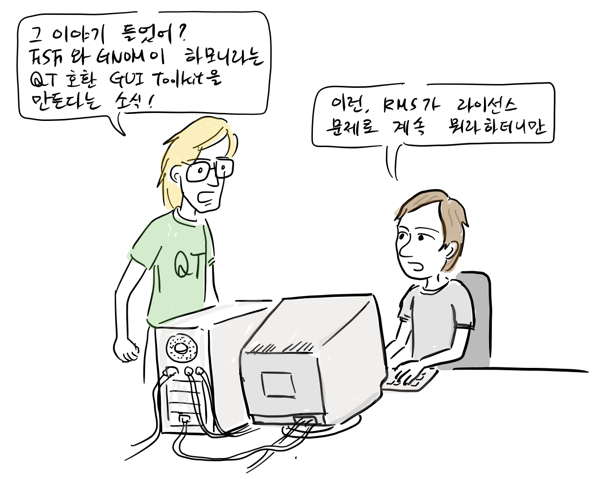

Qt를 만든 Haavard Nord와 Eirik Chambe-Eng

“그 이야기 들었어? FSF와 GNOME이 하모니라는 Qt 호환 GUI 툴킷을 만든다는 소식” “이런 RMS가 라이선스 문제로 계속 뭐라하더니만”

결국, 2000년 Qt도 GPL 라이선스를 지원하기로 결정한다.

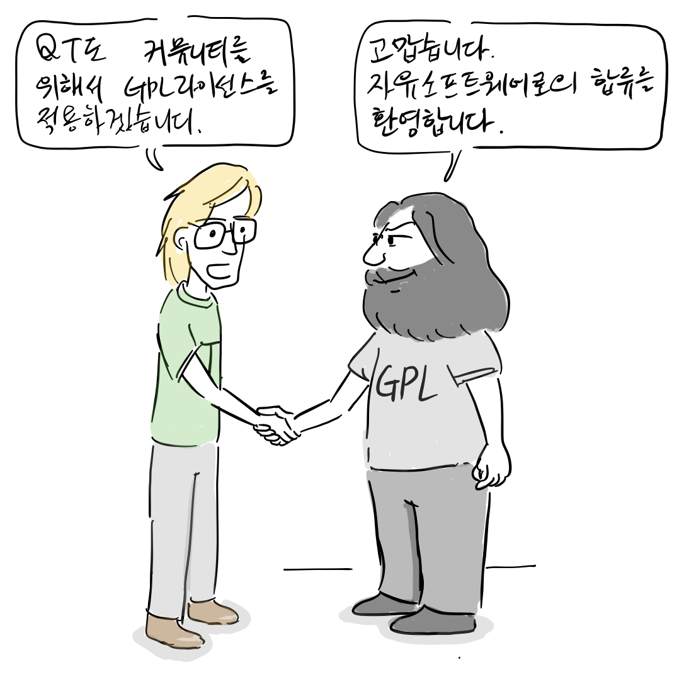

이처럼 RMS는 FSF지원 아래 부족한 자유 소프트웨어를 하나 하나 개발하기 시작하고, 회사들을 압박해서 독점 소프트웨어를 자유 소프트웨어로 만들었다.

참고

1.  리차드 스톨만, [GNU 운영체제와 자유 소프트웨어 운동, 오픈소스 혁명의 목소리, 한빛출판사](http://www.hanbit.co.kr/store/books/look.php?p_code=E5329835060), 2013
2.  [History of free and open-source software](https://en.wikipedia.org/wiki/History_of_free_and_open-source_software#Desktop_\(1984%E2%80%93\)), Wikipedia
3.  [Roland McGrath steps down as glibc maintainer after 30 years](https://www.theregister.co.uk/2017/07/10/glibc_maintainer_roland_mcgrath_steps_down/)

참고로, 등장 인물 간 대화는 자료를 바탕으로 재구성되었습니다.

만화 중 잘못된 부분이나 추가할 내용이 있으면 [만화 원고](https://docs.google.com/document/d/1aQXluFSjBu5FgIqlgRFNIgbPzKRmKmFsnlQi6DsDdq8/edit?usp=sharing)에 직접 의견을 남겨주시면 고맙겠습니다. 그 외 전반적인 만화 후기는 블로그에 바로 답글로 남겨주세요.
