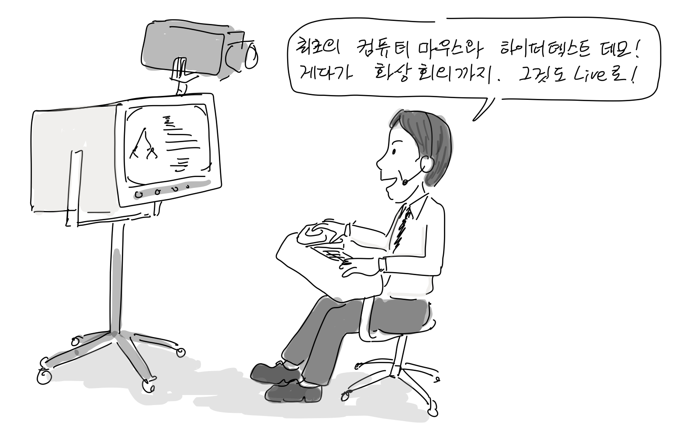
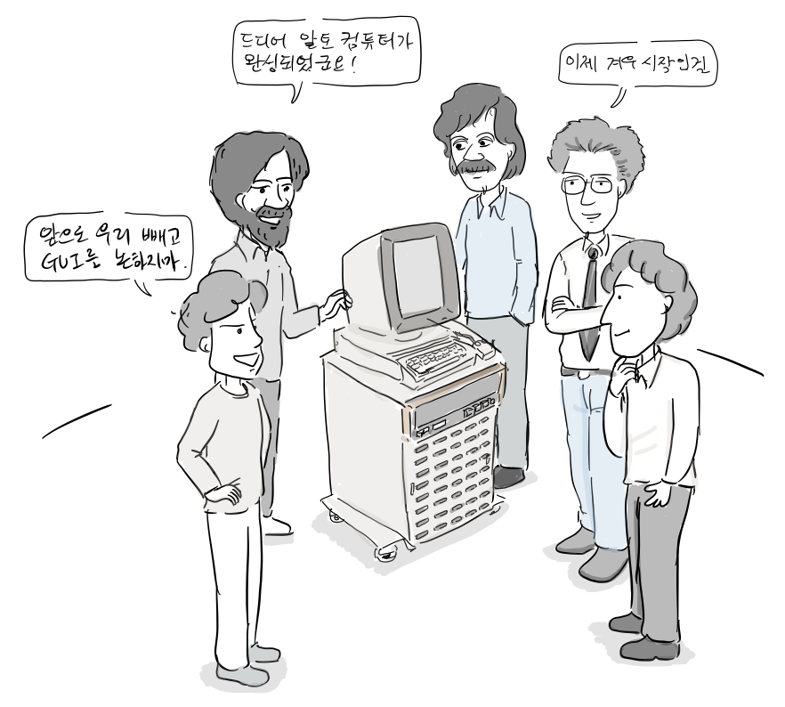
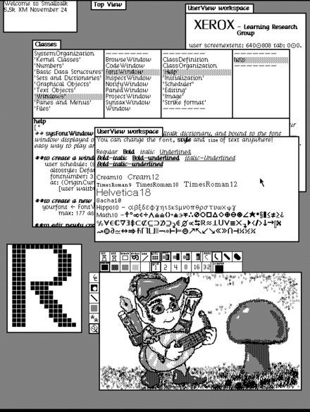
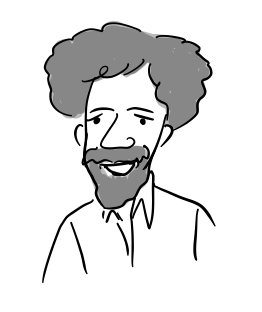
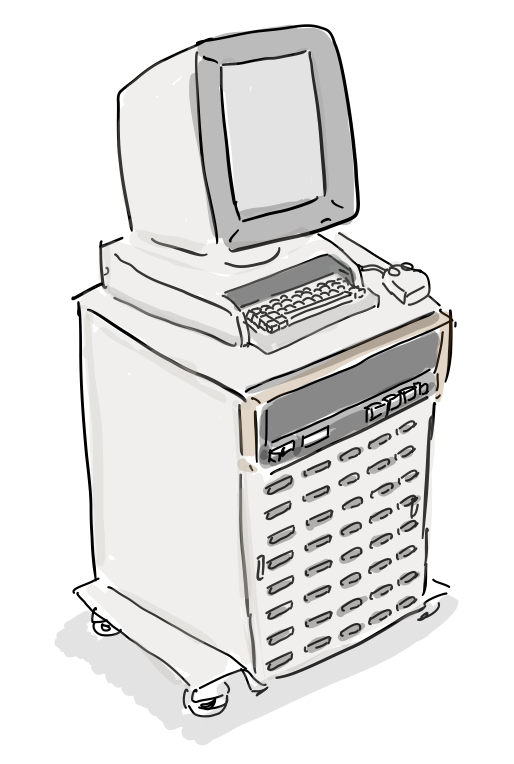
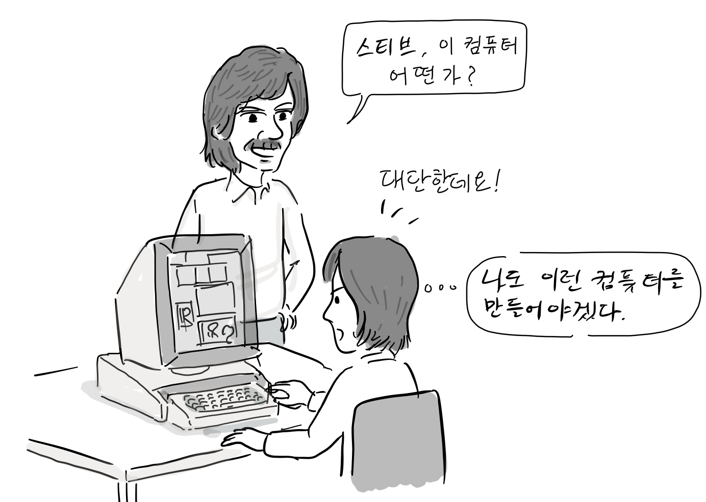
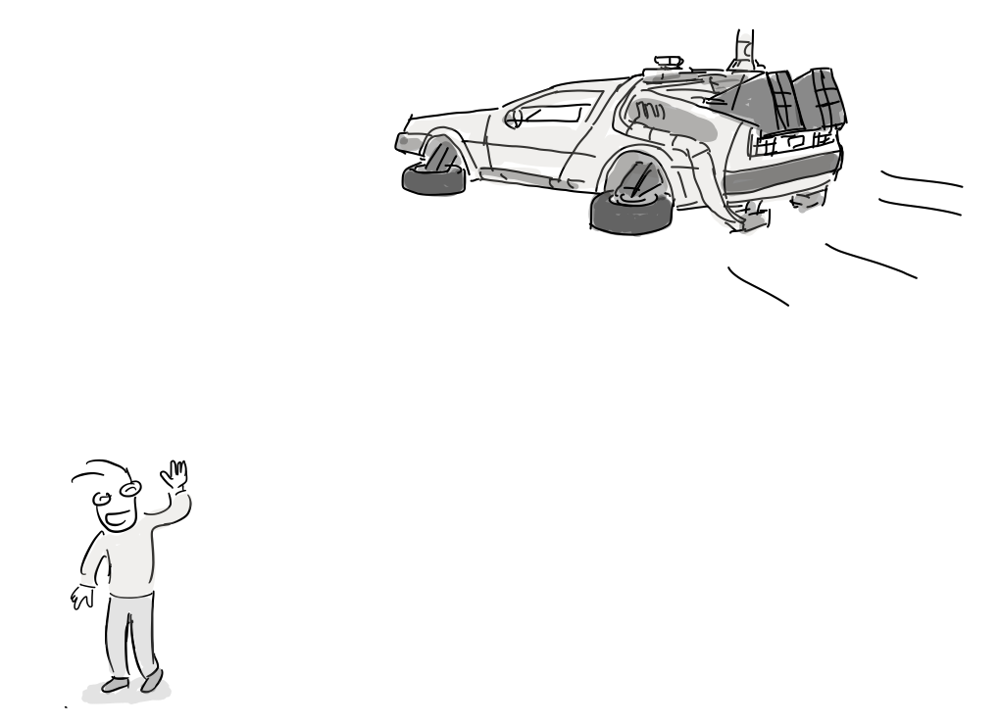
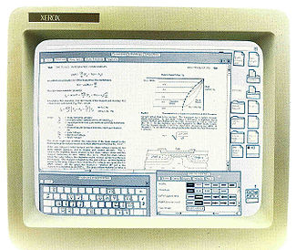
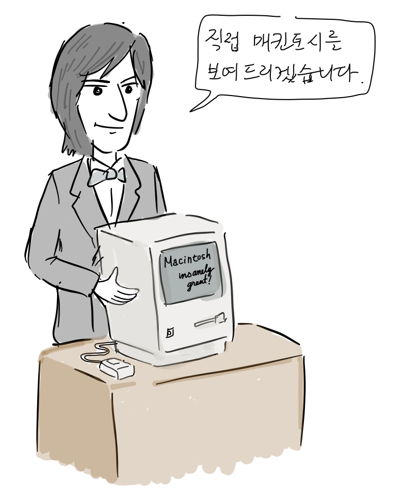

**모든 데모의 어머니**  

모든 데모의 어머니라는 별명을 가진 [더글러스 엥겔바트](https://ko.wikipedia.org/wiki/%EB%8D%94%EA%B8%80%EB%9F%AC%EC%8A%A4_%EC%97%A5%EA%B2%94%EB%B0%94%ED%8A%B8)는 1968년 [역사적인 데모](https://www.youtube.com/watch?v=yJDv-zdhzMY)에서 컴퓨터 마우스, GUI, 원격 화상 회의, 하이퍼텍스트, 워드프로세싱, 하이퍼미디어, 실시간 협업 편집 등을 보여주었다.

**오늘날의 GUI를 구현한 알토 컴퓨터 탄생**

제록스 팔로알토 연구소는 더글러스 엥겔바트 팀의 일부 연구원들을 영입하여 1973년 [알토(Alto) 컴퓨터](https://ko.wikipedia.org/wiki/%EC%A0%9C%EB%A1%9D%EC%8A%A4_%EC%95%8C%ED%86%A0)를 제작한다. 이 컴퓨터 최초로 데스크탑을 구현했는데, 당시 이미 윈도우, 아이콘, 메뉴, 드롭 다운 메뉴 등을 제공하였고, WYSWYG기반의 문서편집기를 구현하였다.

  
알토 컴퓨터 Smalltalk UI (출처: [위키피디아](https://en.wikipedia.org/wiki/Xerox_Alto#/media/File:Smalltalk-76.png))

당시 알토 컴퓨터의 운영체제와 소프트웨어 개발에 참여했던 앨런 케이([Alan Kay](https://en.wikipedia.org/wiki/Alan_Kay)), 래리 테슬러([Larry Tesler](https://en.wikipedia.org/wiki/Larry_Tesler)), 단 인갤스([Dan Ingalls](https://en.wikipedia.org/wiki/Dan_Ingalls)), 데이비드 스미스([David Smith](https://en.wikipedia.org/wiki/David_Canfield_Smith)), 클래런스 엘리스([Clarence Ellis](https://en.wikipedia.org/wiki/Clarence_Ellis_\(computer_scientist\)))는 만드는 것 마다 세계 최초라는 수식어가 붙게 된다.

  
앨런 케이: OOP 선구자, 최초 GUI 개발

  
래리 테슬러: 워드프로세서, 스몰토크 개발, 최초 copy & paste구현.  
애플에서 뉴턴 프로젝트 주도.

  
단 인갤스: 스몰토크 개발, 최초 bitblit 함수와 팝업 메뉴 개발

  
데이비드 스미스: 제록스 스타 컴퓨터와 비지칼크 UI 디자인.

  
클래런스 엘리스: 최초의 흑인 전산학 박사학위 소유자.  
최초의 그룹웨어인 OfficeTalk 개발.

알토 컴퓨터는 상업용 컴퓨터가 아니여서 수천개의 유닛만 생산되어 제록스 팔로알토 연구소에서만 사용되었지만, 이후 애플 매킨토시를 비롯한 많은 컴퓨터에 영향을 준다.

1979년 스티브 잡스도 직접 팔로알토 연구소를 방문해서 알토 컴퓨터 데모를 보게 되고, 여기서 얻은 아이디어로 나중에 리사와 매킨토시를 만들게 된다.

.

1981년 제록스는 알토 컴퓨터의 상업용 버전인 [스타](https://ko.wikipedia.org/wiki/%EC%A0%9C%EB%A1%9D%EC%8A%A4_%EC%8A%A4%ED%83%80)라는 컴퓨터를 세상에 내 놓는데, 미래의 사무실이라는 컨셉으로 네트워크 기능, 파일 공유, 워드프로세서, IDE 도구등을 제공했지만, 비싼 가격탓에 상업적으로 성공을 못했다.

  
제록스 스타의 데스크탑(출처: [위키피디아](https://en.wikipedia.org/wiki/Xerox_Star#/media/File:Xerox_8010_compound_document.jpg))

1984년 애플도 GUI를 사용한 매킨토시 컴퓨터를 출시한다. 이 컴퓨터는 마우스를 채용했고 알토 컴퓨터에서 많은 아이디어롤 가져왔다. 상업적으로도 성공해서 개인용 컴퓨터에서 본격적으로 GUI시대를 맞이했다.

매킨토시 개발자 [앤디 허츠펠드](https://en.wikipedia.org/wiki/Andy_Hertzfeld)

[

더 읽을 글

](https://en.wikipedia.org/wiki/Andy_Hertzfeld)

-   [From the vault: Watching (and re-watching) “The Mother of All Demos”](https://arstechnica.com/the-multiverse/2015/04/from-the-vault-watching-and-re-watching-the-mother-of-all-demos/), Wired, 2012
-   [Dead Media Beat: The Xerox Star](https://www.wired.com/2012/10/dead-media-beat-the-xerox-star/), Wired, 2012
-   [History of the graphical user interface](https://en.wikipedia.org/wiki/History_of_the_graphical_user_interface#Xerox_PARC), Wikipedia

참고로, 등장 인물 간 대화는 자료를 바탕으로 재구성되었습니다.

만화 중 잘못된 부분이나 추가할 내용이 있으면 [만화 원고](https://docs.google.com/document/d/1aQXluFSjBu5FgIqlgRFNIgbPzKRmKmFsnlQi6DsDdq8/edit?usp=sharing)에 직접 의견을 남겨주시면 고맙겠습니다. 그 외 전반적인 만화 후기는 블로그에 바로 답글로 남겨주세요. 다음 이야기는 X-Window입니다.
