**X윈도우의 시작**

1983년 미국 스탠포드 대학에 재학중인 Paul Asente & [Brian Reid](https://en.wikipedia.org/wiki/Brian_Reid_\(computer_scientist\))는 사용하고 있는 V 운영체제에 GUI를 구현하기로 결심한다.

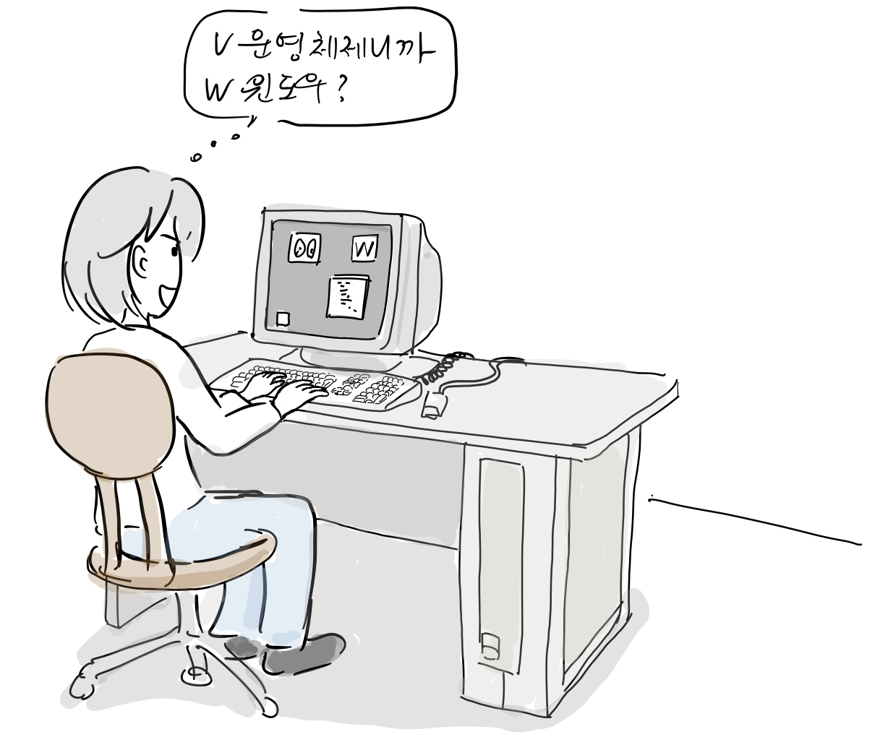

당시 이들은 스탠포드 대학교 분산 시스템 그룹 학생들이 만든 V라는 운영체제를 사용하고 이 운영체제에서 GUI 구현을 위해 [W 윈도우 시스템](https://en.wikipedia.org/wiki/W_Window_System)을 만들기 시작한다. 1983년 이를 [DEC(Digital Equipment Corporation)](https://ko.wikipedia.org/wiki/%EB%94%94%EC%A7%80%ED%84%B8_%EC%9D%B4%ED%81%85%EB%A8%BC%ED%8A%B8_%EC%BD%94%ED%8D%BC%EB%A0%88%EC%9D%B4%EC%85%98)에서 만든 [VS100](https://en.wikipedia.org/wiki/VAXstation#VAXstation_100)이란 컴퓨터에서 동작하는 유닉스에 포팅을 한다. W 윈도우 시스템은 오늘날의 X 윈도우 처럼 이미 서버가 디스플레이 리스트를 관리하였고, 그래픽 윈도우와 터미널을 지원하는 프로토콜을 사용했다.

이들은 우연한 기회에 MIT 컴퓨터 과학 연구소에 [W 윈도우 시스](https://en.wikipedia.org/wiki/W_Window_System)템을 소스코드를 복사해준다.

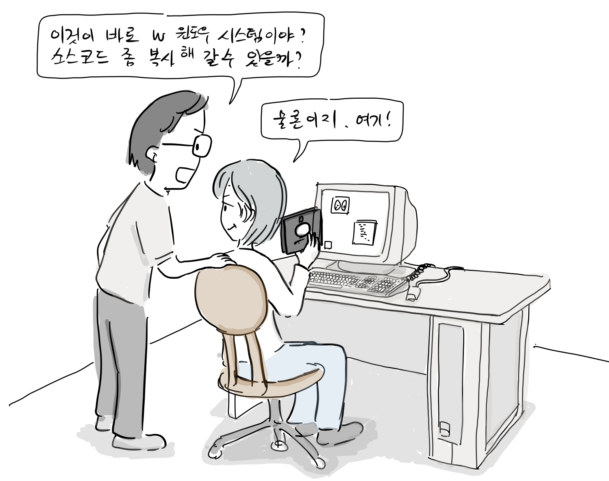

1984년 당시 MIT 컴퓨터 과학 연구소는 DEC, IBM과 공동으로 프로젝트 아데나(Project Athena)를 진행 중에 있었다.

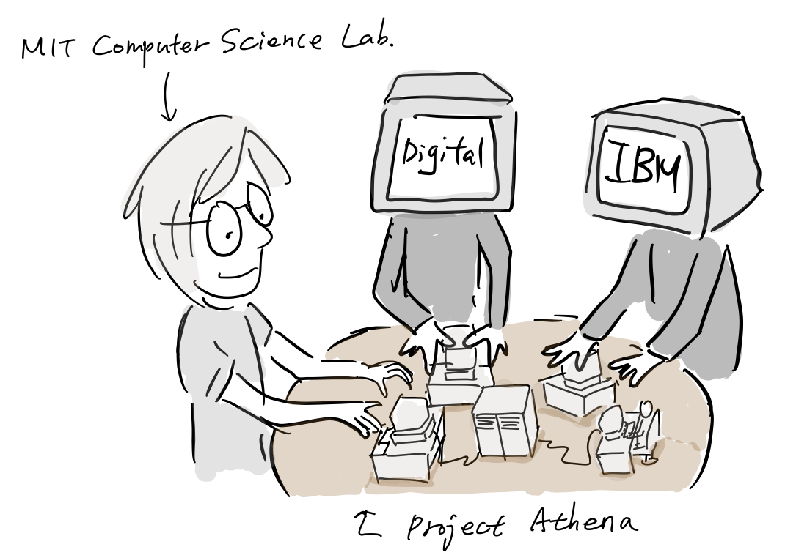

이들은 이 프로젝트를 통해 여러 학생이 독립적인 그래픽 시스템을 통해 중앙 컴퓨터에 접속해서 컴퓨터 자원을 사용하는 시스템을 개발하고 있었다.

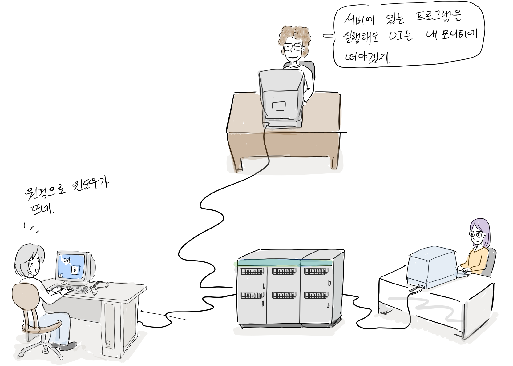

당시에는 텍스트 기반인 터미널로 서버에 원격으로 접속해서 프로그램을 사용할 수 있었는데, 이를 그래픽 사용자 환경으로 구현하는 것이였다. MIT 컴퓨터 과학 연구소 소속인 J[im Gettys](https://en.wikipedia.org/wiki/Jim_Gettys)와 Robert([Bob) Scheifler](https://en.wikipedia.org/wiki/Bob_Scheifler) 는 스탠포드 대학에서 복사해 온 W 윈도우 시스템에서 구현한 동기화 프로토콜을 비동기로 바꾼후, 아데나 프로젝트에 적용했다. 이름도 X 윈도우 시스템으로 변경했다.

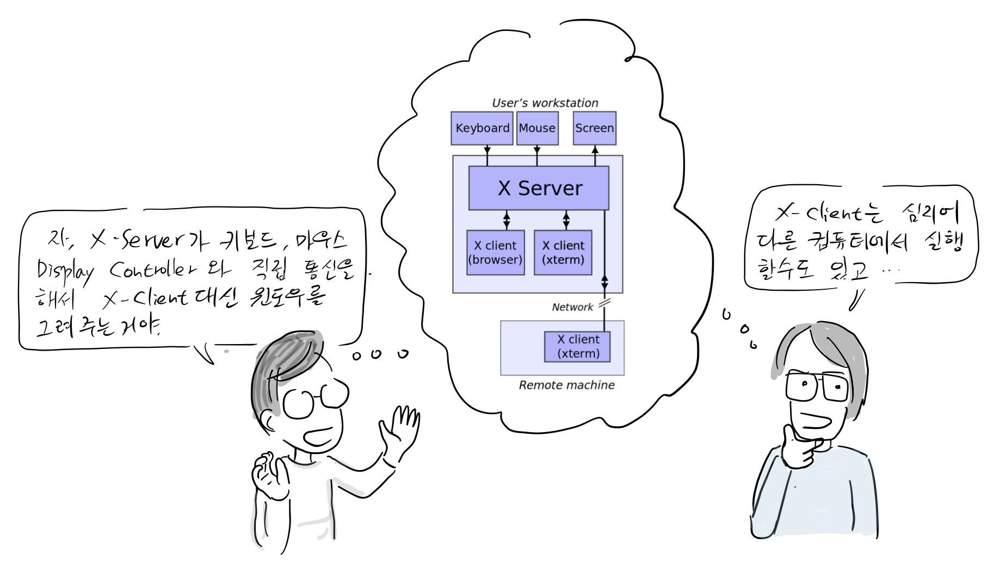

“자, X-Server가 키보드, 마우스, 디스플레이와 직접 통신을 하고 X-Client 대신 윈도우를 그려주는거야.” “X-Client는 심지어 다른 컴퓨터에 존재할 수 있어서 네트웍을 통해 통신을 할 수 있고.”

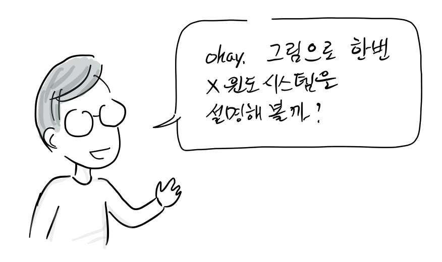

X는 네트워크 지향 윈도 시스템(Network-oriented Windowing System)으로서 클라이언트-서버 모델을 따르지. 즉, 클라이언트를 보통 X-Client라고 부르는데, 사용자가 실행하는 프로그램을 말하지. X-Server는 직접 Video Card에 있는 화면 제어기(Display Controller)와 입력장치와 통신하면서 모니터에 X-Client가 원하는 것을 그려. X-Client는 윈도를 그리는데 필요한 모든 명령어를 IPC를 통해 X-Server에 전달해.

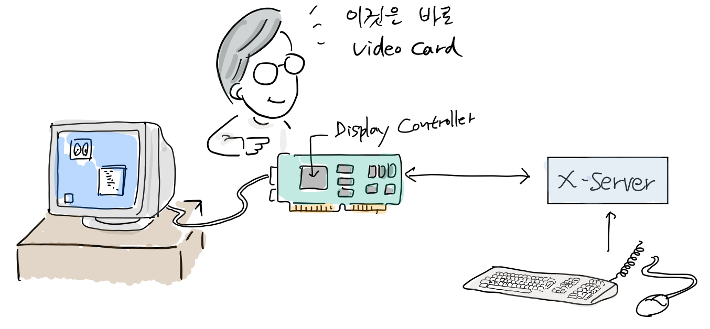

예를 들어 X Client 중 하나가 그림판이라면, X-Client는 페인팅 API로 직접 메모리에 픽셀을 만들지 않고, 대신 페인팅 명령어를 IPC로 X-Server에 전달하지.

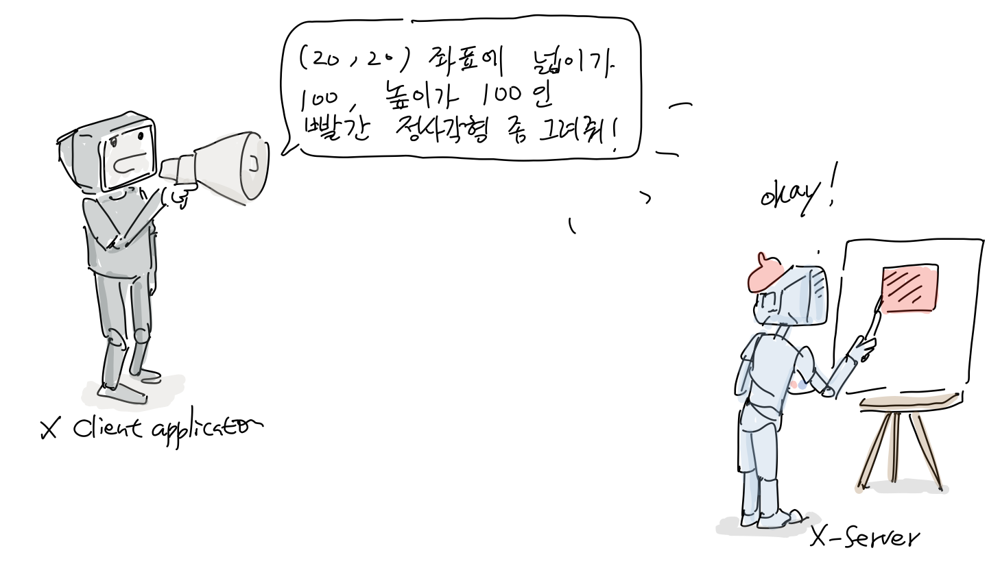

X-Server는 각각의 X Client가 보낼 페인팅 명령어를 전달 받아 메모리에 픽셀(비트맵 이라고도 부름)을 생성하는데, 이를 pixmap이라고 불러.

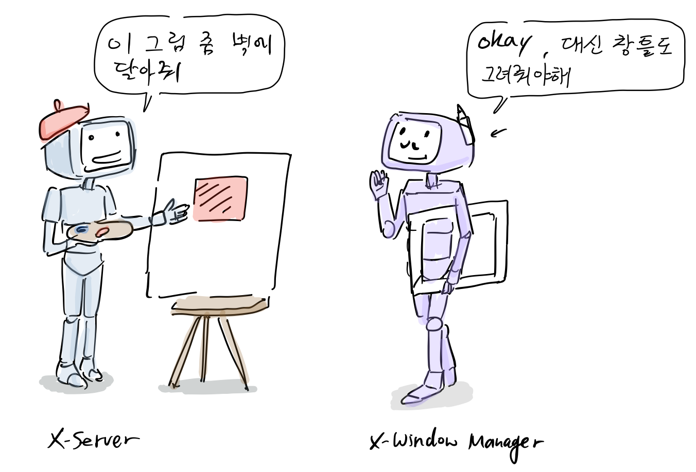

X 윈도우 시스템에서는 또 다른 프로세스가 필요한데, 바로 [X 윈도우 관리자](https://en.wikipedia.org/wiki/X_window_manager)야.

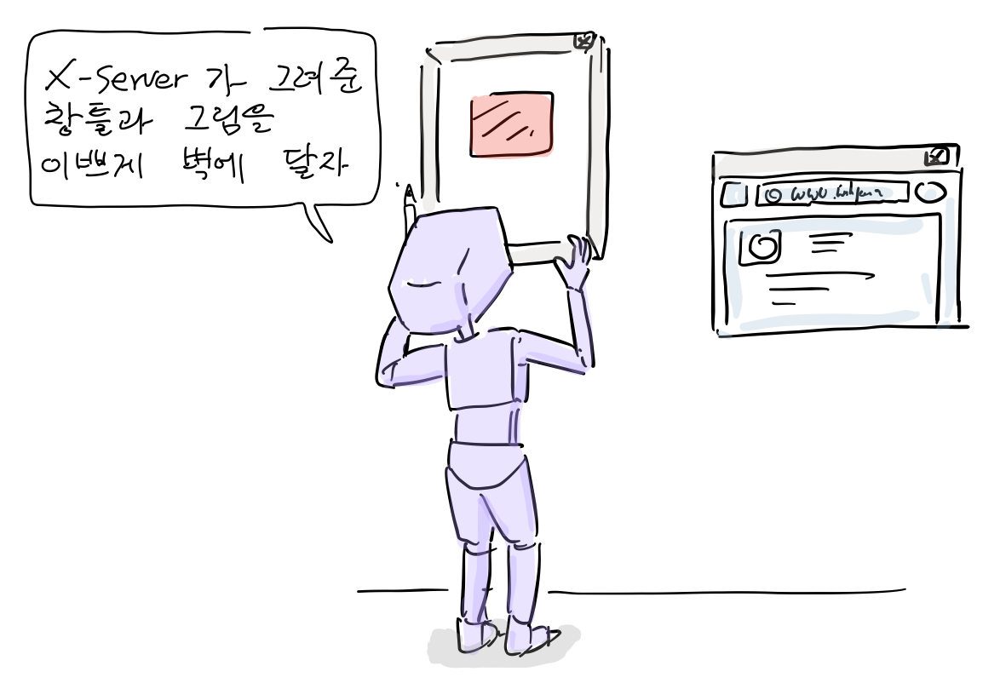

X 윈도우 관리자도 X-client로서 데스크탑을 보여주고 윈도우의 테두리 모양과 어떤 레이아웃으로 윈도우를 배치할 지를 결정하지. 또한 가상 데스크탑, 프로그램 런처 등을 제공해. 우리가 리눅스를 사용할 때, 다양한 윈도 관리자가 있는 이유가 바로 X에서는 윈도우 관리자가 별도의 프로그램으로 동작하도록 하였기 때문이야.

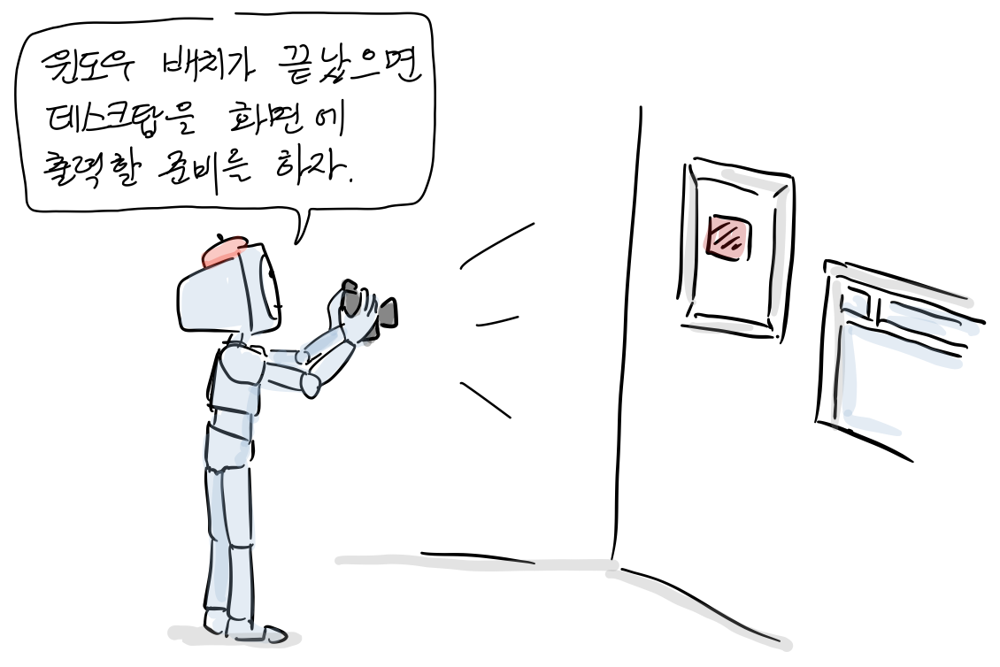

최종 화면은 다시 X-Server가 각 X-Client가 보낸 페인트 명령어로 생성한 pixmap을 X 윈도우 관리자가 배치한 형태대로 최종 비트맵을 만들어.

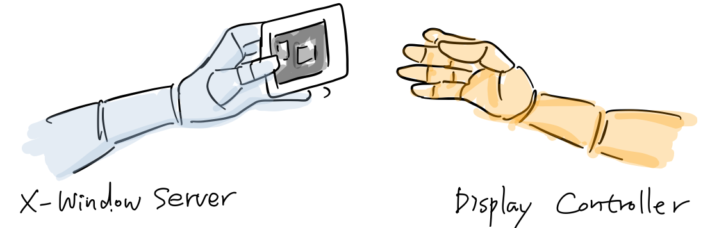

이를 디스플레이 컨트롤러에 있는 프레임 버퍼에 전송하지.

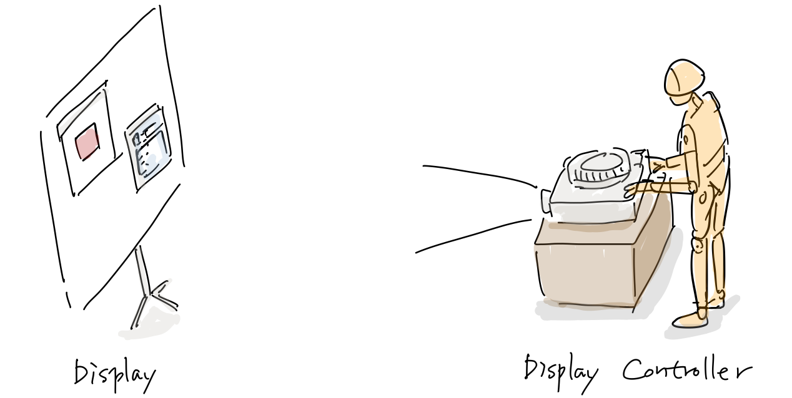

화면 제어기(Display controller)는 프레임 버퍼를 스캔해서 RGB 데이터를 실제 모니터에 나타나게 하지. 이때, X-Client와 X-Server가 반드시 같은 컴퓨터 장치에 있을 필요는 없어. X-Client와 X-Server간에 필요한 명령은 네트워크를 통해 서로 교환할 수 있기 때문이지.

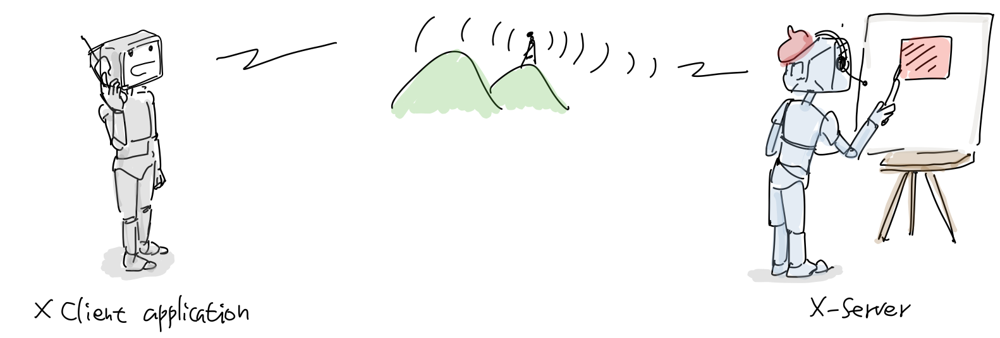

이것은 오리지널 X의 아키텍쳐이고 이후 GPU가 보급되면서 오히려 클라이언트-서버 모델은 GPU가속에 부담을 주게돼. 이 이야기는 다음 Wayland를 소개할 때, 다른분이 자세하게 소개할거야.  

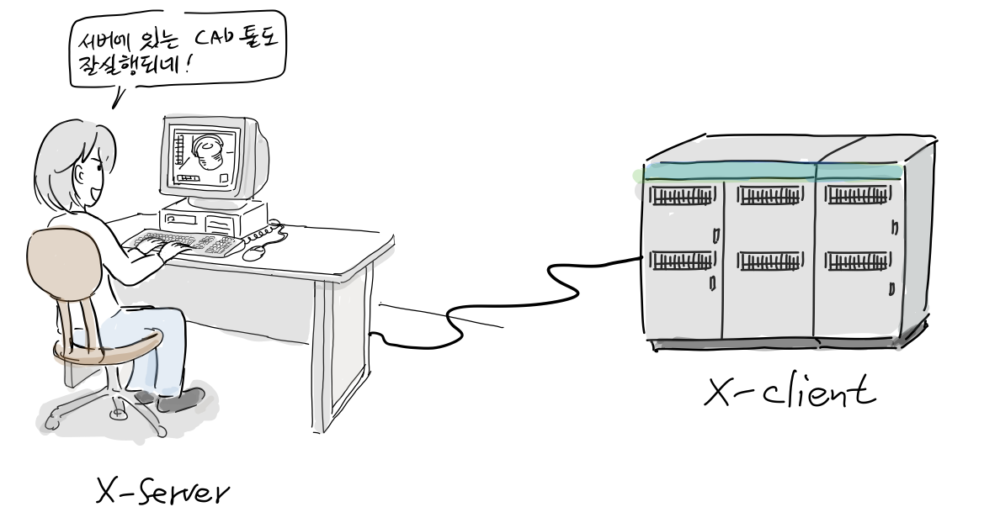

X 윈도 시스템이 빛이 나는 순간은 바로 컴퓨팅 자원이 많이 필요한 CAD및 과학계산용 프로그램을 고성능 서버에서 실행하고 이를 PC에서 X-Server를 통해 원격으로 사용하는 것이지. 이상 끝.

**더 읽을 글**

-   XLIB Programming Manual, Rel. 5, 3rd Edition, [http://shop.oreilly.com/product/9781565920026.do](http://shop.oreilly.com/product/9781565920026.do)
-   [X 윈도 시스템](https://ko.wikipedia.org/wiki/X_%EC%9C%88%EB%8F%84_%EC%8B%9C%EC%8A%A4%ED%85%9C), 위키피디아

참고로, 등장 인물 간 대화는 자료를 바탕으로 재구성되었습니다.

만화 중 잘못된 부분이나 추가할 내용이 있으면 [만화 원고](https://docs.google.com/document/d/1c56GVfPWpOgD70-znNexWF8vLSmszYcEIifRJpbXQeM/edit?usp=sharing)에 직접 의견을 남겨주시면 고맙겠습니다. 그 외 전반적인 만화 후기는 블로그에 바로 답글로 남겨주세요. 다음 이야기는 X-Window가 오늘날 처럼 어떻게 오픈소스로 운영되게 되었는지를 소개할 예정입니다.
