1985년 1월 [프로젝트 아테나](https://ko.wikipedia.org/wiki/%ED%94%84%EB%A1%9C%EC%A0%9D%ED%8A%B8_%EC%95%84%ED%85%8C%EB%82%98)는 X 윈도우 버전6를 릴리스한다. 함께 개발에 참여하고 있던 DEC도 [MicroVAX](https://en.wikipedia.org/wiki/MicroVAX)에 이를 포팅한다.

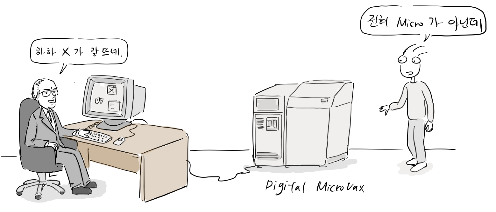

같은 해, MIT는 DEC가 VAXStation에 구현한 컬러 기능을 X에 추가해서 버전9를 릴리스한다.

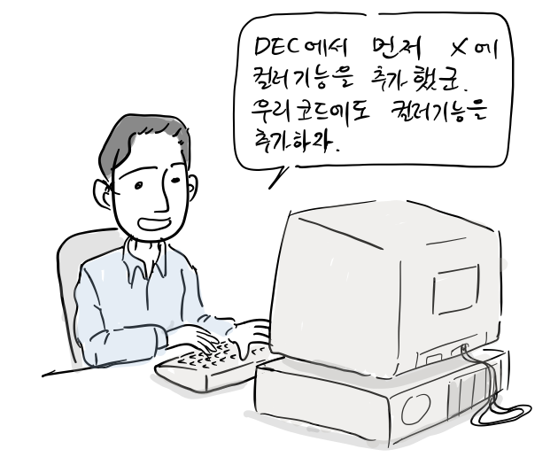

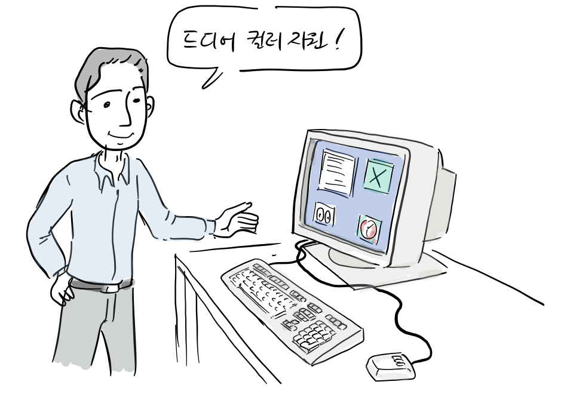

워크스테이션을 만드는 다른 회사들도 X 윈도우를 사용하보기를 원했다.

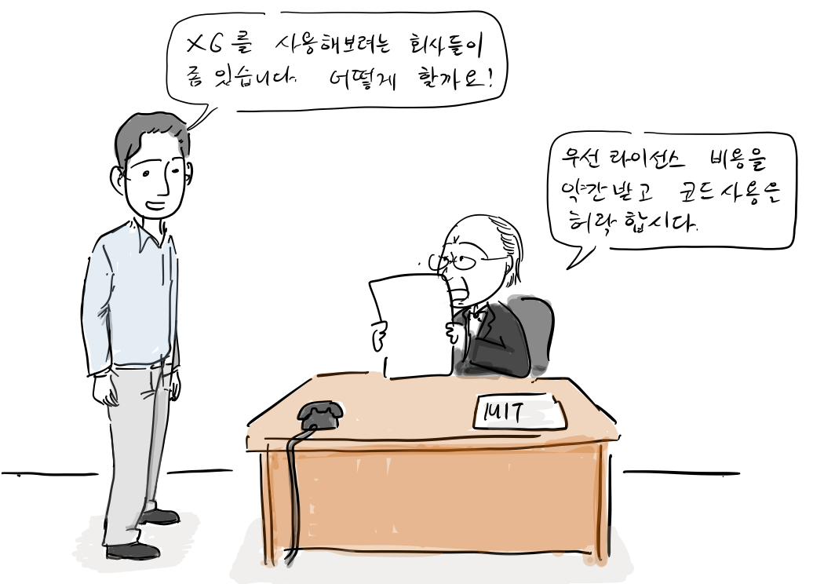

여러 기능이 개선되고 1985년 11월 드디어 X10버전이 릴리스 되었다. DEC 역시 이듬해 2월, 최초로 X을 상업적으로 출시했다. X10은 시장에서 큰 성공을 거두고 이 때 부터 많은 회사가 DEC를 접촉해서 X 라이선스 요청했다.

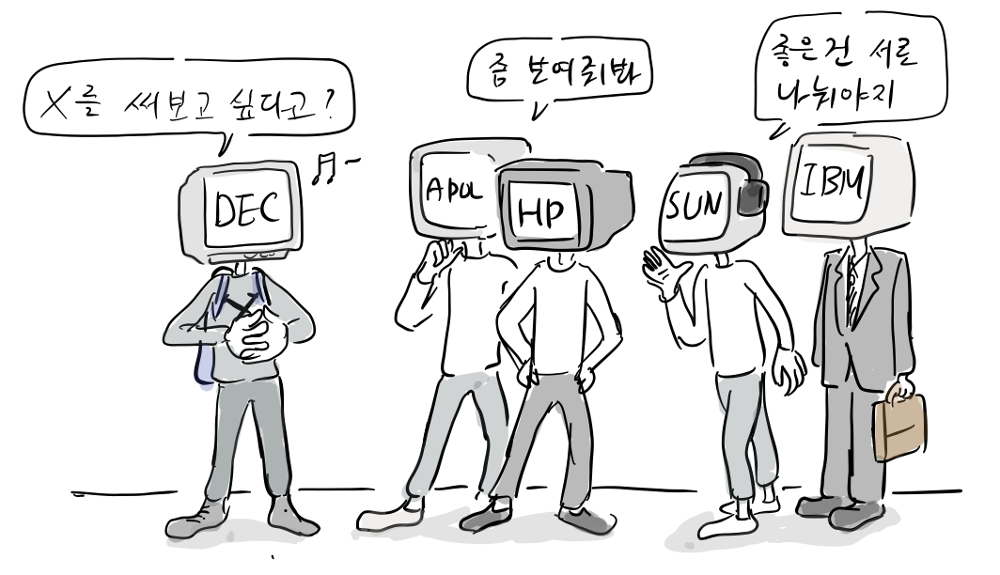

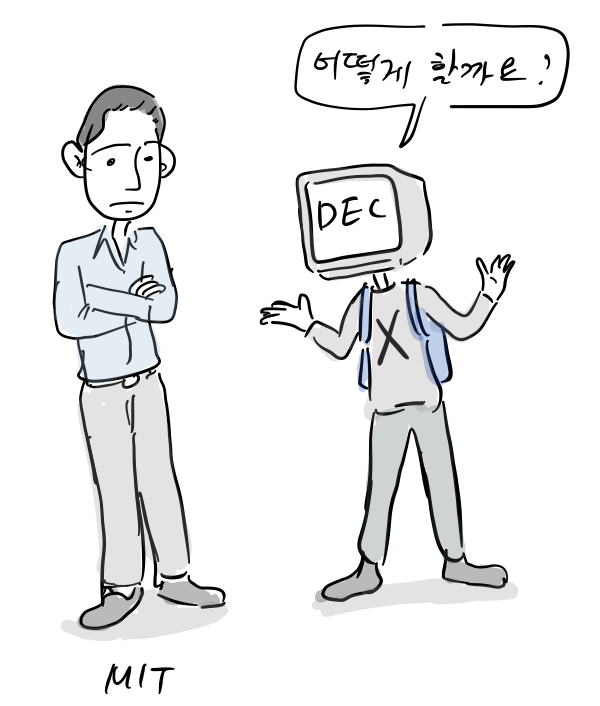

여기서 중요한 역사적 결정이 일어난다. MIT는 X 윈도우 소스코드를 누구나 제약없이 사용할 수 있도록 공개한다.

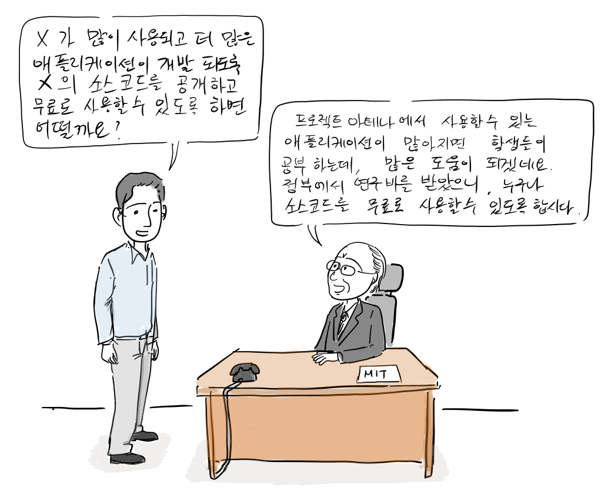

“X가 많이 사용되고 더 많은 애플리케이션이 개발될 수 있도록 X의 소스코드를 공개하고 무료로 사용할 수 있도록 하면 어떨까요?”  
“프로젝트 아테나에서 사용할 수 있는 애플리케이션이 많아지면 학생들이 공부하는데 많은 도움이 될 것 같군요. 정부에서 연구비를 받았으니 누구나 소스코드를 무료로 사용할 수 있도록 합시다.”

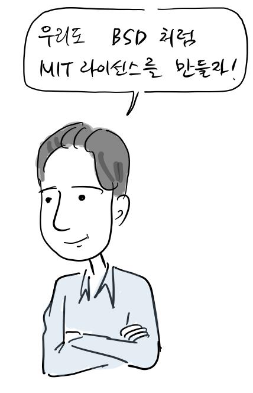

참고로, MIT라이선스는 BSD 라이선스와 유사해서 저작권 표기만 지켜주면 제약 없이 상업적 이용이 가능하다.

**X 윈도우 MIT 라이선스로 공개  
**이렇게 1986년 1월 X10R3는 MIT 라이선스로 공개된다. 이때 부터 X 윈도우는 HP, Apollo, Sun Workstaion, IBM PC/AT에 포팅되기 시작한다.

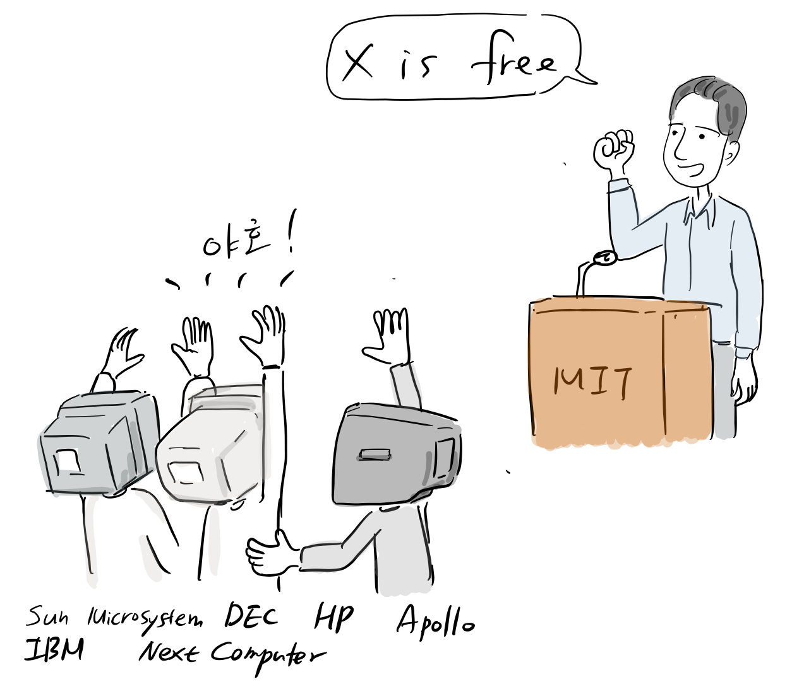

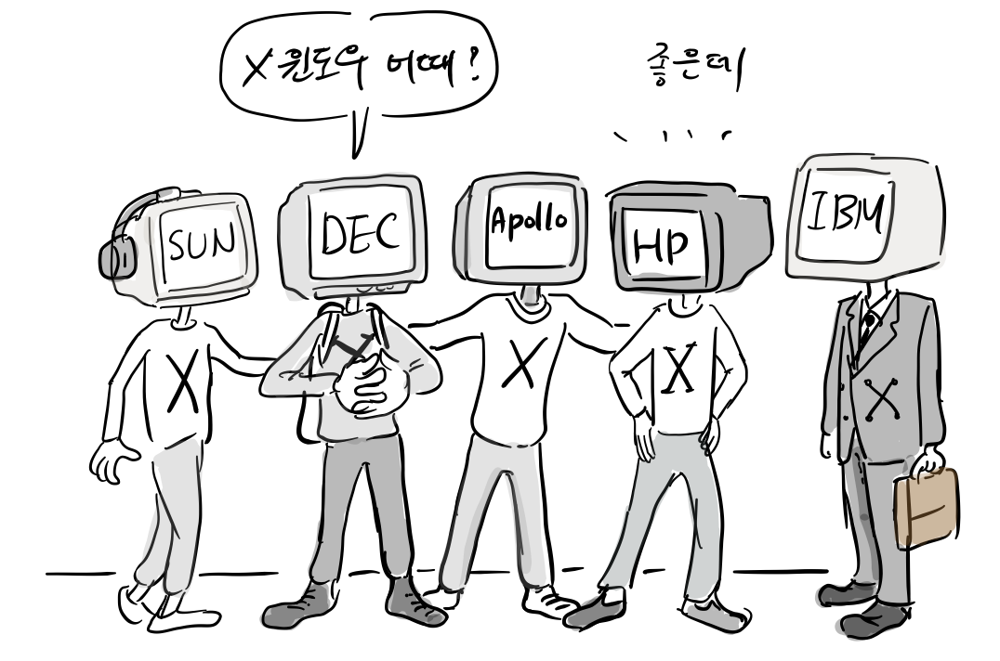

이처럼 X윈도우 소스코드는 MIT라이선스로 회사에 제공되었는데, 소스코드에 대한 상업적 이용이 가능하였고, 각 회사에서 수정한 소스 코드를 공개할 의무도 없었다. 이후, 여러 컴퓨터 회사에 X 윈도우를 기반으로 다양한 윈도우 시스템을 개발하게 된다.

**X11 구현  
**하지만, X윈도우가 다양한 하드웨어와 운영체제에서 동작하기 위해서는 X 프로토콜이 하드웨어에 독립적인 새로운 디자인을 사용해야했다. 하지만, MIT는 이를 구현한 충분한 개발 인력을 갖고 있지 못했다.

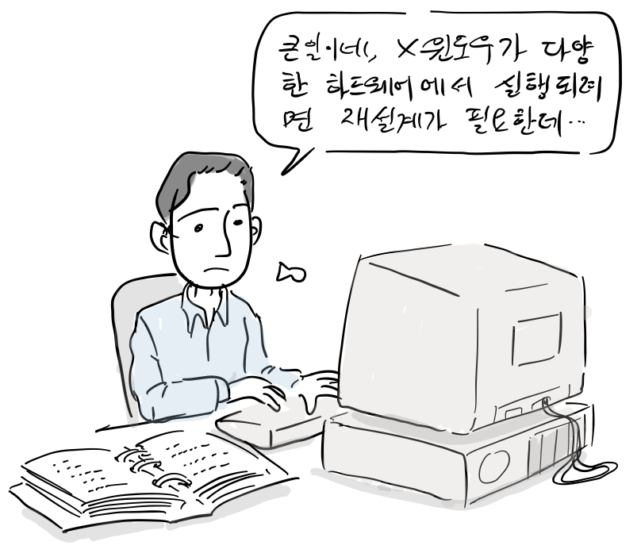

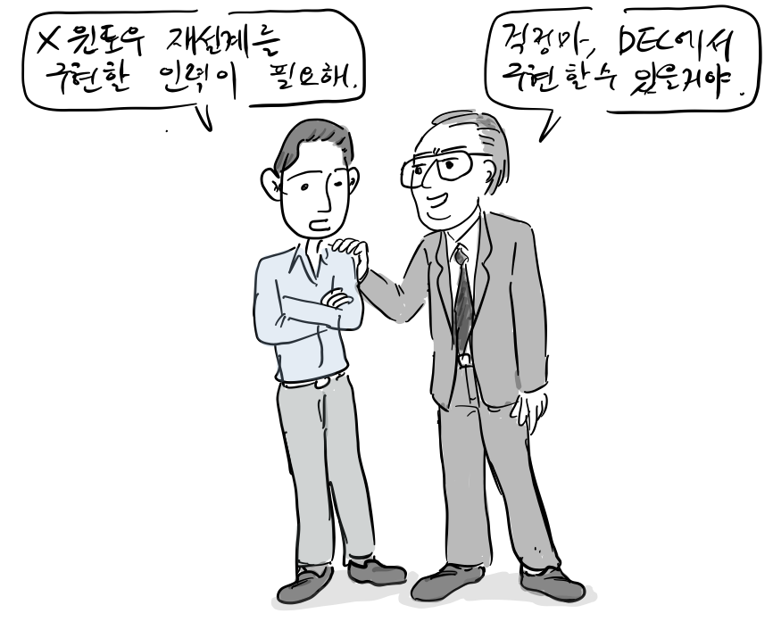

MIT의 밥 쉐이플러(Bob Scheifler)는 X11 프로토콜 설계를 주도했는데, 개발 단계에서도 유즈넷 뉴스그룹을 통해 설계에 대한 토론이 이루어졌다.

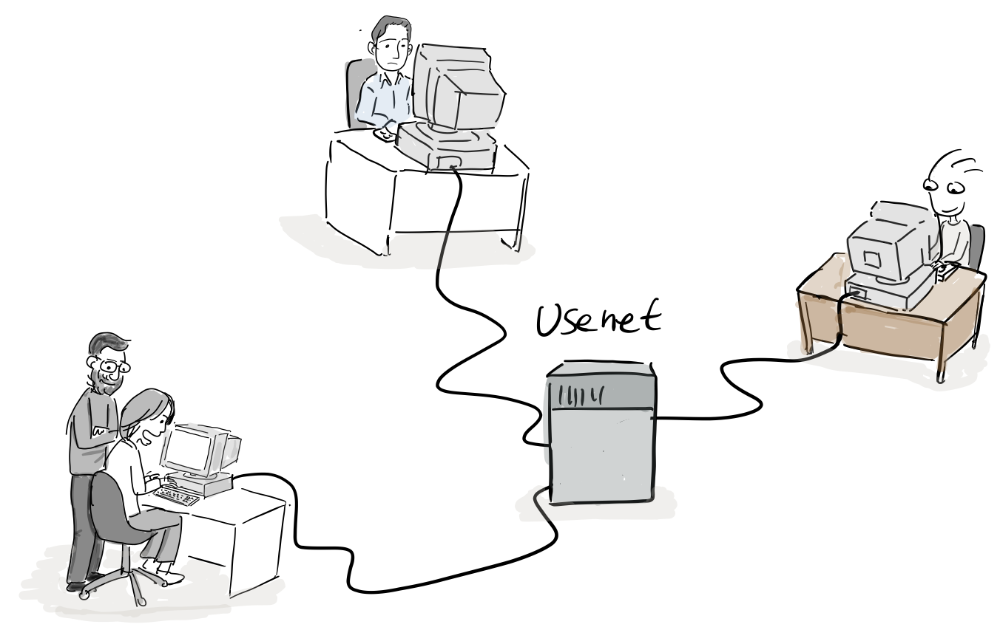

스모키 월래스(Smokey Wallace)와 짐 게티스(Jim Gettys)는 DEC 웨스턴 소프트웨어 연구소가 X 윈도우 재설계를 구현하고 이 코드를 X10과 같은 MIT라이선스로 공개할 것을 DEC에 제안하였다.

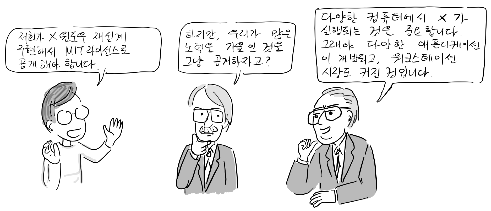

스모키 월래스: 저희가 X윈도우 재설계를 구현해서 MIT라이선스로 공개해야합니다.  
DEC 책임자: 하지만 우리가 많은 노력을 기울인 것을 그냥 공개하자고?  
짐 게티스: 다양한 컴퓨터에서 X가 실행되는 것은 중요합니다. 그래야 다양한 애플리케이션이 개발되고 워크스테이션 시장도 커질 것입니다.

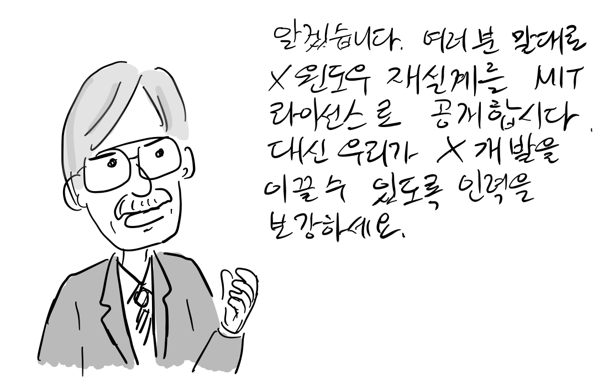

DEC 책임자: 알겠습니다. X윈도우 재설계를 MIT 라이선스로 공개합시다. 대신 우리가 X개발을 이끌 수 있도록 인력을 보강하세요.

테스트를 걸쳐 1987년 9월 15일 드디어 X11이 세상에 공개되었다.

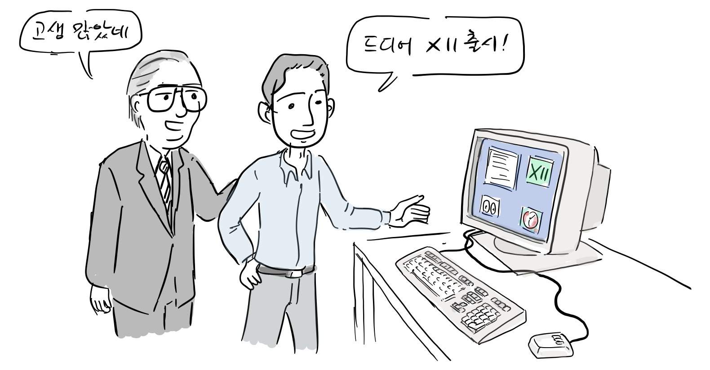

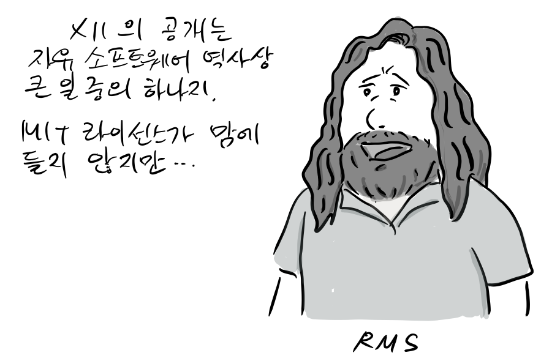  
“X11의 공개는 자유 소프트웨어 역사상 큰 일중 하나지. MIT 라이선스가 맘에 들지 않지만…”

참고

-   https://en.wikipedia.org/wiki/X\_Window\_System#History
-   http://www.catb.org/esr/writings/taouu/html/ch02s06.html
-   http://archive.oreilly.com/pub/a/linux/2005/08/25/whatisXwindow.html
-   https://www.x.org/releases/X11R7.7/doc/libX11/libX11/libX11.pdf
-   https://www.youtube.com/watch?v=KdmNHM9BKY0

참고로, 등장 인물 간 대화는 자료를 바탕으로 재구성되었습니다.

만화 중 잘못된 부분이나 추가할 내용이 있으면 [만화 원고](https://docs.google.com/document/d/1gYP7wMsFfNBZP2lnla2AsqNYYt-zLIEjPuuUS5VG3fk/edit?usp=sharing)에 직접 의견을 남겨주시면 고맙겠습니다. 그 외 전반적인 만화 후기는 블로그에 바로 답글로 남겨주세요. 다음 이야기는 XFree86관한 이야기입니다.
