MIT는 1987년 9월 15일에 [X11](https://en.wikipedia.org/wiki/X_Window_System)(X 윈도우 버전11)을 공개했다. [워크스테이션](https://ko.wikipedia.org/wiki/%EC%9B%8C%ED%81%AC%EC%8A%A4%ED%85%8C%EC%9D%B4%EC%85%98) 제조 회사들은 앞다투어 X11을 자신들의 워크스테이션에 적용했고, 많은 투자를 하기 시작하기 했다. 특히 [DEC](https://en.wikipedia.org/wiki/Digital_Equipment_Corporation)는 1200여명의 엔지니어를 고용해서 [Ultrix](https://en.wikipedia.org/wiki/Ultrix)와 [VMS](https://en.wikipedia.org/wiki/OpenVMS)에 X11를 포팅했다.

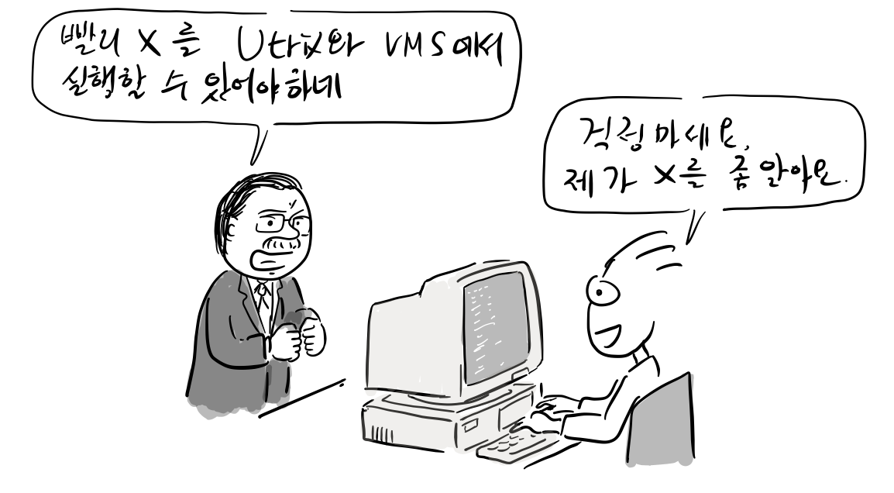

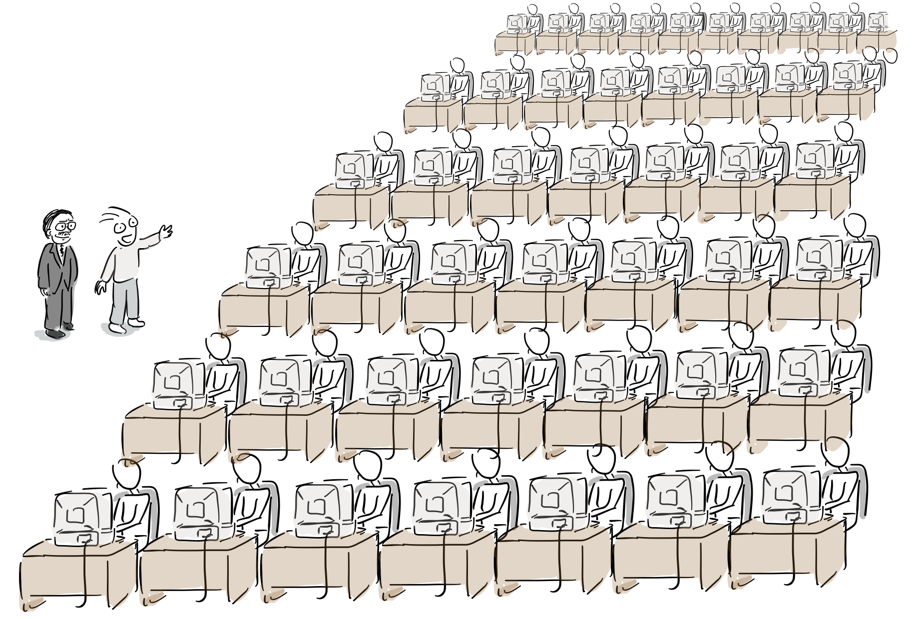

하지만, 각 회사에서 X윈도우를 따로 개발하다보니, 호환성에 문제가 생기기 시작했다.

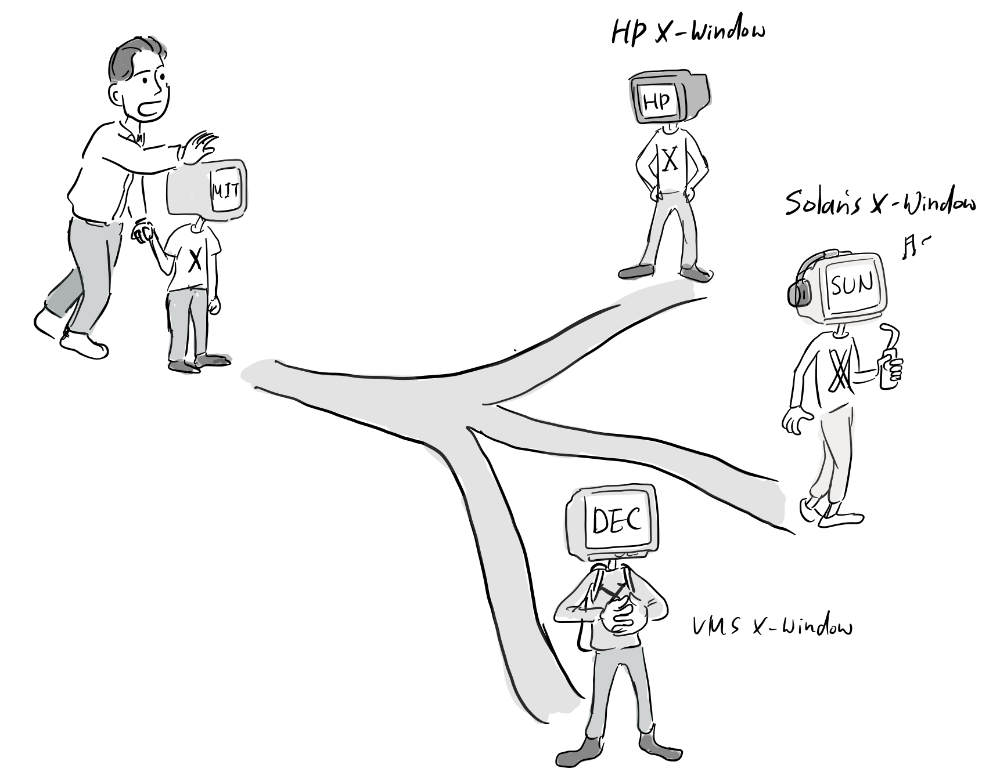

MIT는 더 이상 X윈도우 개발을 감당하기 어려웠고, 1988년 여러 회사들이 [X 컨소시엄](https://en.wikipedia.org/wiki/X_Window_System#The_MIT_X_Consortium_and_the_X_Consortium.2C_Inc.)을 구성해서 X 파편화를 막기 위해 공동으로 개발을 진행한다.

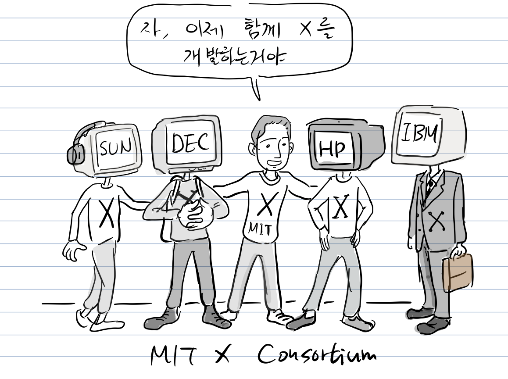

이때부터 새로운 개발자들이 X개발에 참여하기 시작한다.

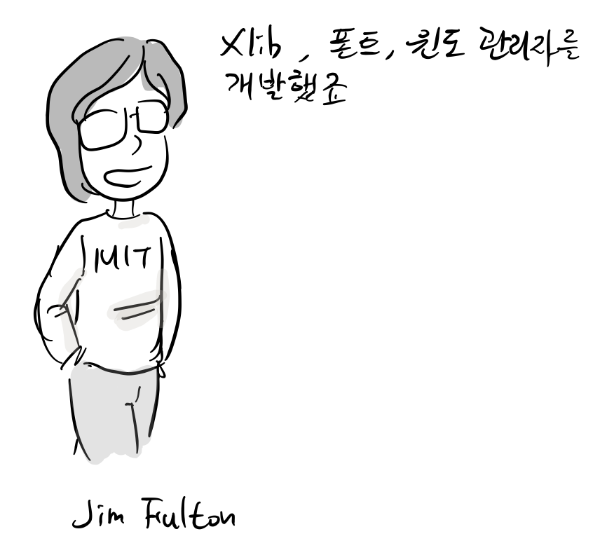

1988년 1월, 짐 풀톤(Jim Fulton)이 참여했고, 3월에는 키스 패커드([Keith Packard](https://en.wikipedia.org/wiki/Keith_Packard))가 참여했다.

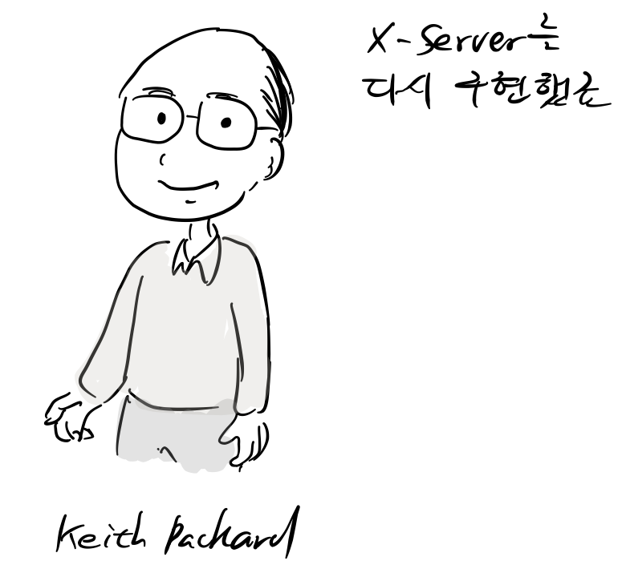

짐은 Xlib, 폰트, 윈도 관리자와 유틸리티를 맡았고, 키스 패커드는 X서버를 다시 구현했다. 이후 도나 컨버스(Donna Converse), 크리스 피더슨(Chris D. Peterson), 스테판 길데아(Stephen Gildea)가 합류했고, 이들은 [프로젝트 아테나(Project Athena)](https://ko.wikipedia.org/wiki/%ED%94%84%EB%A1%9C%EC%A0%9D%ED%8A%B8_%EC%95%84%ED%85%8C%EB%82%98)를 개발한 랄프 스윅(Ralph Swick)와 함께 UI 툴킷과 [위젯](https://ko.wikipedia.org/wiki/GUI_%EC%9C%84%EC%A0%AF)(widget)을 개발했다.

위젯 전쟁  
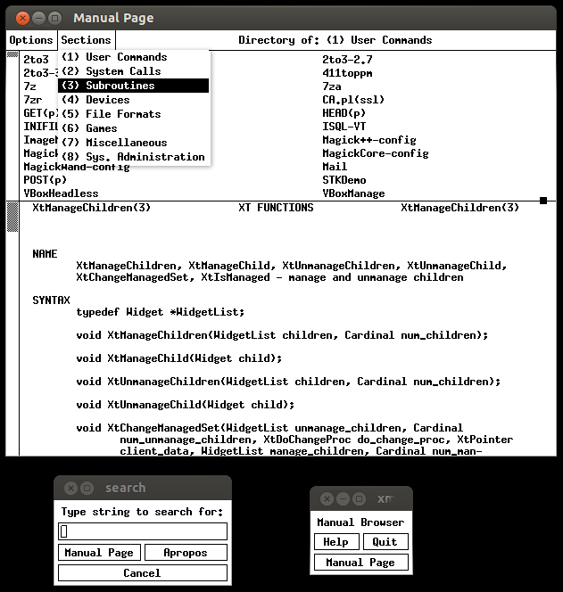  
X Athena Widgets (출처: [위키피디아](https://en.wikipedia.org/wiki/X_Athena_Widgets#/media/File:Screenshot_of_%22Xman%22_program.png), [개발 문서](https://www.x.org/releases/X11R7.7/doc/libXaw/libXaw.pdf))

당시 X윈도우에서 응용 애플리케이션을 개발하는 것은 쉽지 않았다. 특히, X 윈도우가 기본적으로 제공하는 UI 툴킷은 프로젝트 아데나에서 사용된 X 아데나 위젯인데, 레퍼런스로 구현된 위젯이라서 많이 사용되었다. 하지만, 디자인이 단순하고 기능이 부족했다.

[오픈 소프트웨어 재단](https://ko.wikipedia.org/wiki/%EA%B0%9C%EB%B0%A9_%EC%86%8C%ED%94%84%ED%8A%B8%EC%9B%A8%EC%96%B4_%EC%9E%AC%EB%8B%A8)(Open Software Foundation)은 비영리 단체로 유닉스 표준화 및 구현을 위해 1988년 미정부에 의해 섭립되었다. 이 단체는 X 윈도우용 [모티프(motif)](https://ko.wikipedia.org/wiki/%EB%AA%A8%ED%8B%B0%ED%94%84_\(%EC%9C%84%EC%A0%AF_%ED%88%B4%ED%82%B7\))라는 UI 툴킷을 개발하기 시작한다.

1989년 모티프가 처음 릴리스되었지만, 당시는 독점 소프트웨어였다. 게다가 [썬 마이크로시스템즈](https://ko.wikipedia.org/wiki/%EC%8D%AC_%EB%A7%88%EC%9D%B4%ED%81%AC%EB%A1%9C%EC%8B%9C%EC%8A%A4%ED%85%9C%EC%A6%88)과 AT&T는 독자적인 툴킷인 [오픈룩(OpenLook)](https://en.wikipedia.org/wiki/OPEN_LOOK)을 개발하고 있었다.

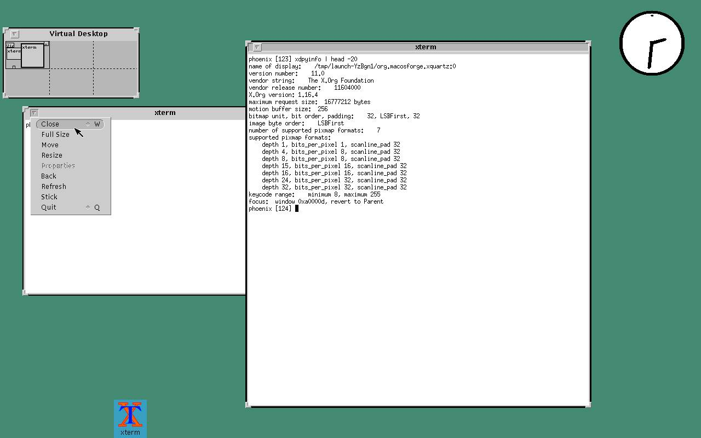  
썬 마이크로시스템스과 AT&T가 개발한 OpenLook (출처: [위키피디아](https://en.wikipedia.org/wiki/OPEN_LOOK#/media/File:Olvwm-desktop.jpg))

문제는 개발자 그룹이 양분되고 추가 비용도 발생해서 일부 개발자는 X윈도우에서 기본 제공하는 아데나 툴킷을 사용하기도 했다.

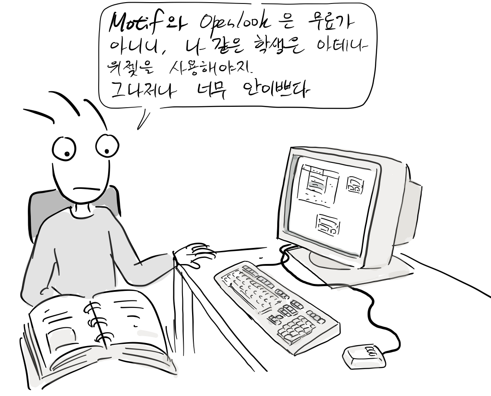

이처럼 1990년 초까지 유닉스 업계는 과도한 경쟁으로 마이크로소프트 윈도우가 일반 사용자 시장의 인기를 기반으로 서버까지 넘보게 만드는 실수를 범한다.

**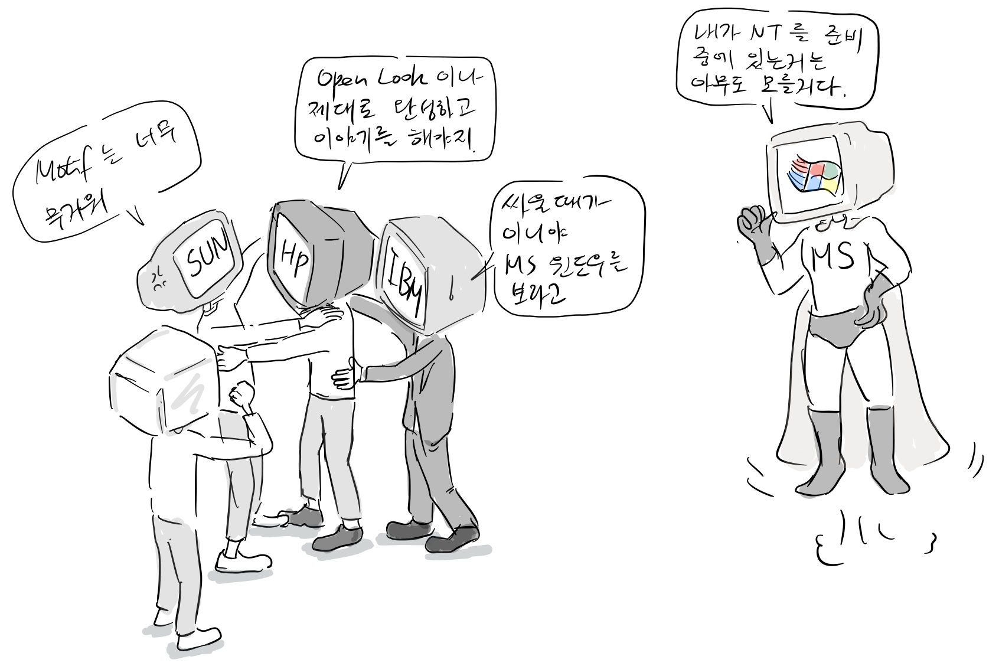**

유닉스 진영: “Motif 너무 무거워”, “OpenLook이나 제대로 완성하고 이야기를 해야지”, “싸울 때가 아니야, MS윈도를 보라고”  
MS: 내가 NT를 준비중에 있는거는 모를거다.

결국, 유닉스 진영이 MS윈도와 경쟁하기 위해서는 공통의 데스크탑 환경이 필요하다는 것을 느끼고 모티프를 기반으로 새로운 데스크탑 환경을 개발하기 시작한다. 썬 마이크로시스템스도 오픈룩 개발을 중단하고 이에 동참한다.

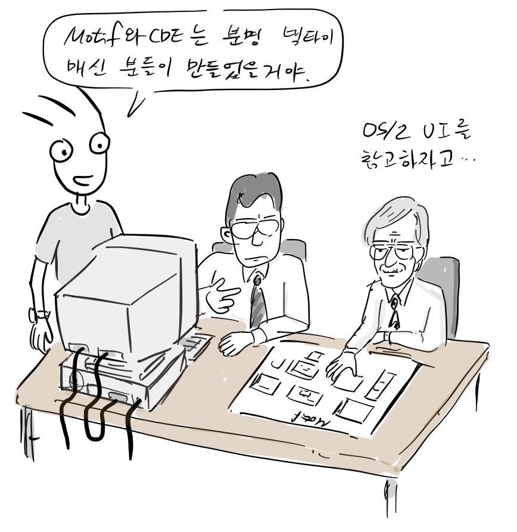

1993년 6월, [HP](https://en.wikipedia.org/wiki/Hewlett-Packard), [IBM](https://en.wikipedia.org/wiki/IBM), [썬소프트](https://en.wikipedia.org/wiki/SunSoft,_Inc.), [USL](https://en.wikipedia.org/wiki/Unix_System_Laboratories)는 [CDE(Common Desktop Environment)](https://en.wikipedia.org/wiki/Common_Desktop_Environment)를 발표한다.

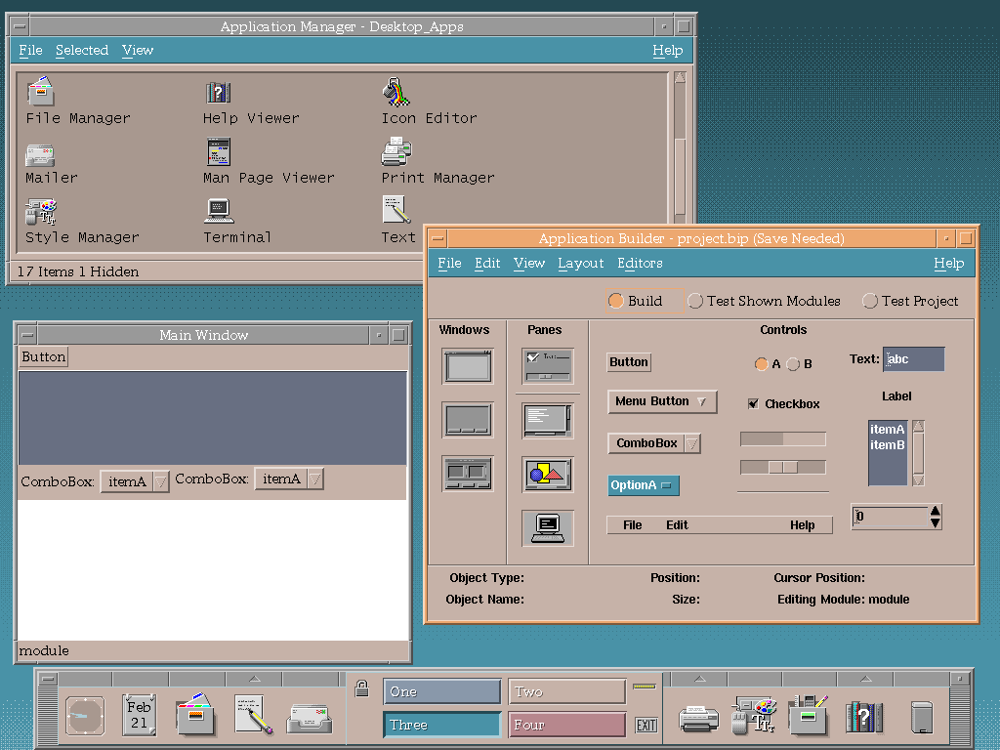  
CDE(Common Desktop Environment) 모습 (출처: [위키피디아](https://en.wikipedia.org/wiki/Common_Desktop_Environment#/media/File:CDE_Application_Builder.png))

1994년 개발 그룹은 CDE를 유닉스 표준 데스크탑환경으로 만들기 위해서 오픈 소프트웨어 재단에 프로젝트를 이관하고 모티프와 함께 하나의 프로젝트로 만든다.

**오픈그룹 결성과 X 유료화의 실패**  
1997년 유닉스 업계는 마이크로소프트와 효과적인 경쟁을 위해 유닉스 기술 표준화와 인증 업무를 총관할하는 오픈 그룹(Open Group)을 창립한다. 580여개 멤버 회사가 참여한 이 단체는 유닉스 상표권 관리와 기존 [X/Open](https://en.wikipedia.org/wiki/X/Open)에 하던 유닉스 표준화 업무를 이어받고 CDE와 모티프 개발하는 오픈 소프트웨어 재단도 합병한다.

**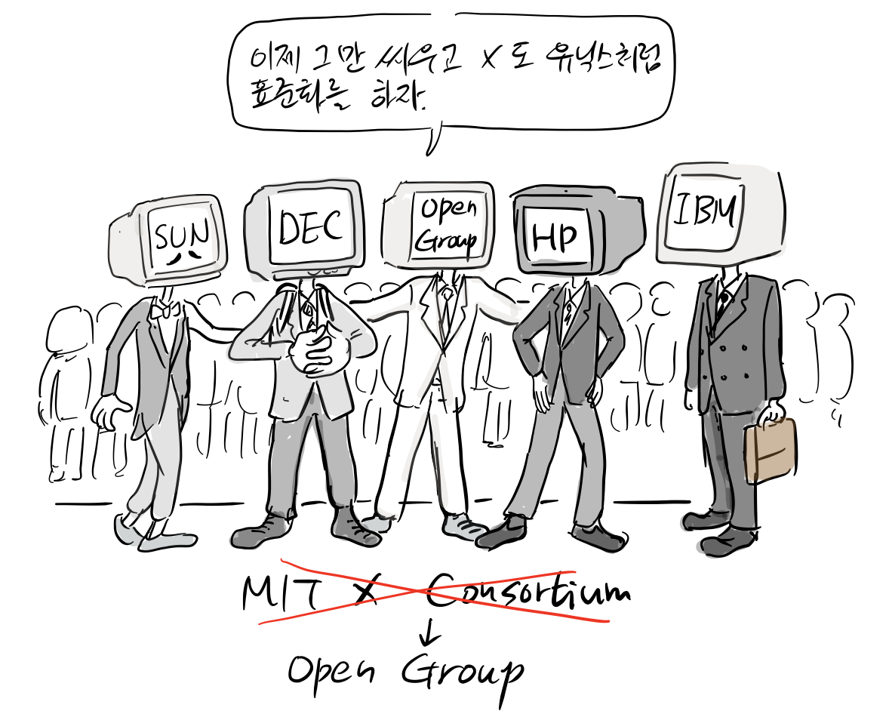**

X 개발 역시도 오픈그룹으로 이관되었고, 1998년초 X11R6.4릴리스한다. 이때 X가 유료화되는데, 비상업적 이용이외에는 라이선스 비용을 내야했다.

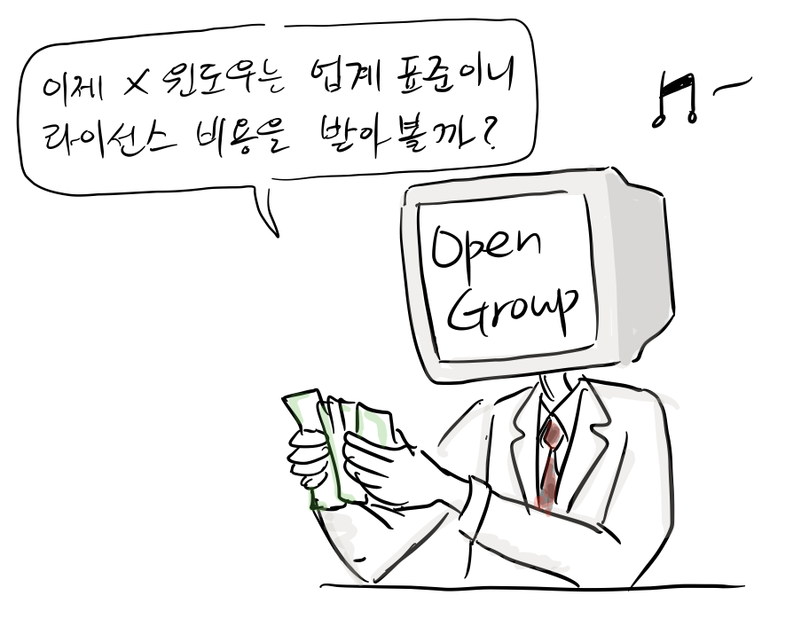

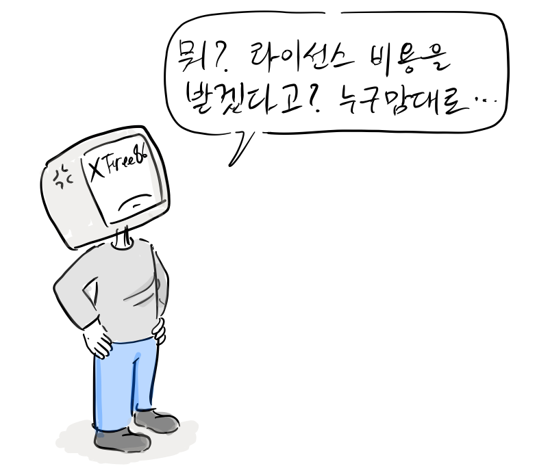

[XFree86](https://ko.wikipedia.org/wiki/XFree86)은 당시 인기가 높은 인텔 CPU를 기반으로한 리눅스에 X윈도우를 포팅하는 개발자 공동체였다. 이들은 오픈그룹의 X 유료화 정책에 반대했고 X11 소스코드를 [포킹](https://ko.wikipedia.org/wiki/%ED%8F%AC%ED%81%AC_\(%EC%86%8C%ED%94%84%ED%8A%B8%EC%9B%A8%EC%96%B4_%EA%B0%9C%EB%B0%9C\))하려고 했다. 이에 놀란 오픈그룹은 바로 바로 유료화를 포기하고 예전 라이선스로 돌아가서 1998년 8월 X11R6.4를 릴리스 한다.

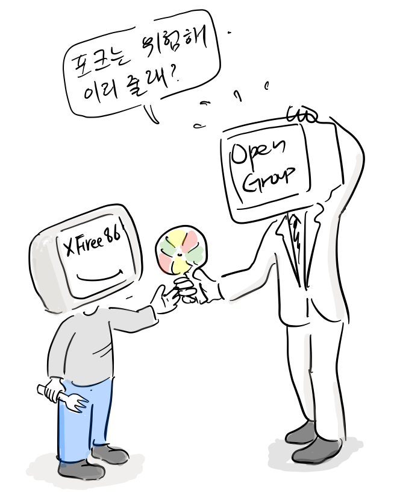

하지만, 이미 마음이 뜬 개발자와 사용자들이 자유를 찾아 XFree86 프로젝트로 모여들기 시작한다. 오픈 그룹은 결국 X11R6.4 patch 3를 마지막으로 릴리스하고 사실상 X윈도우 개발을 포기한다. 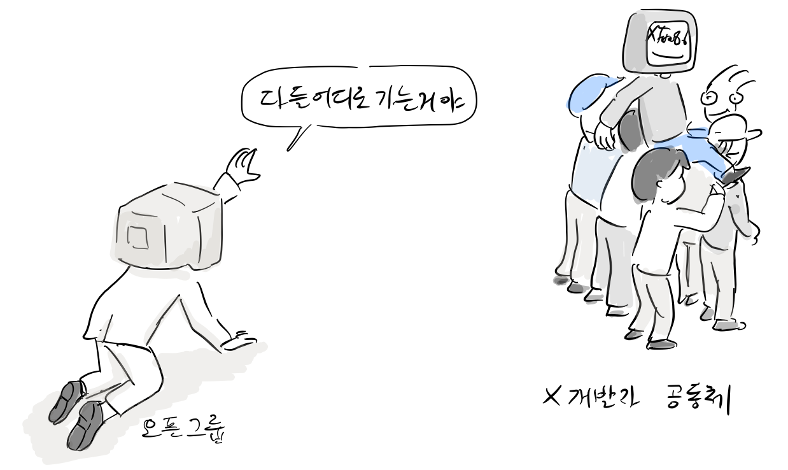

**X.Org와 XFree86  
**XFree86 프로젝트는 X11R5를 기반으로 1991년 시작되었고 이름에서 볼 수 있듯이, 386 PC에 X를 적용하기 위해 시작된 프로젝트였지만, 리눅스 열풍과 함께 실제 X개발의 주도권 가져가져서 X의 de-facto 표준이된다.

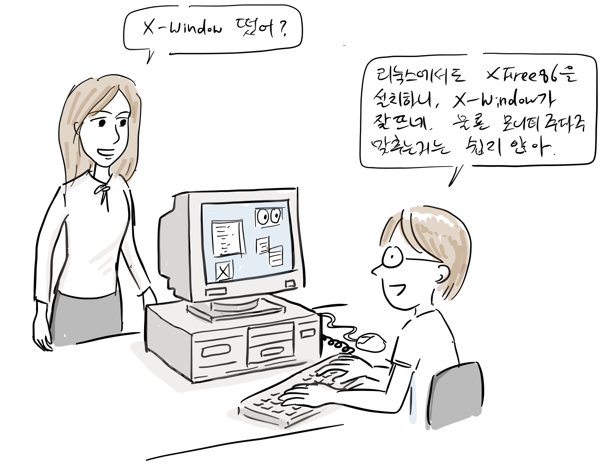

.

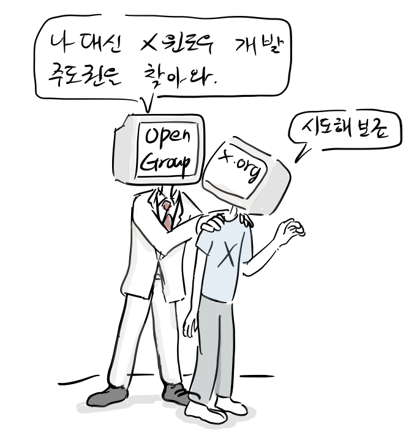

오픈그룹은 1999년 다시 X.Org팀을 만들고 X11R6.5.1를 릴리스한다. XFree86 개발그룹도 회원비가 없는 명예 멤버로 초대된다.

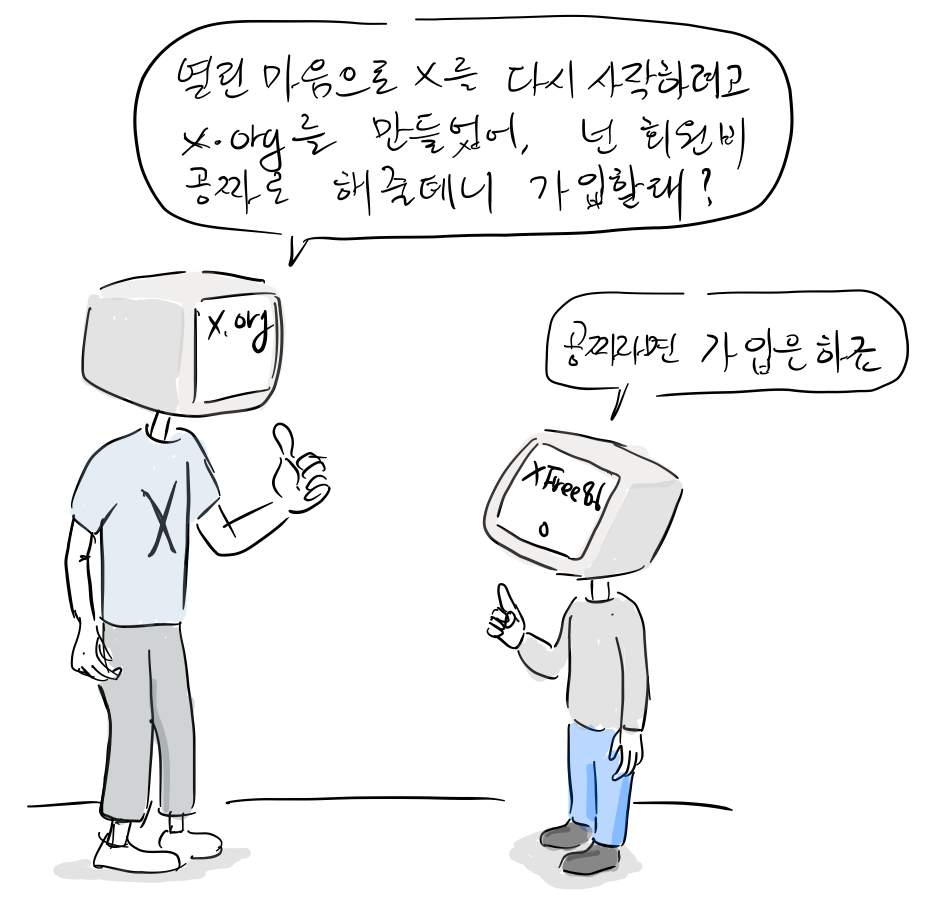

하지만, X.Org에서 X 개발은 소멸 상태였고, 여전히 대부분의 개발은 XFree86에서 이루어진다.

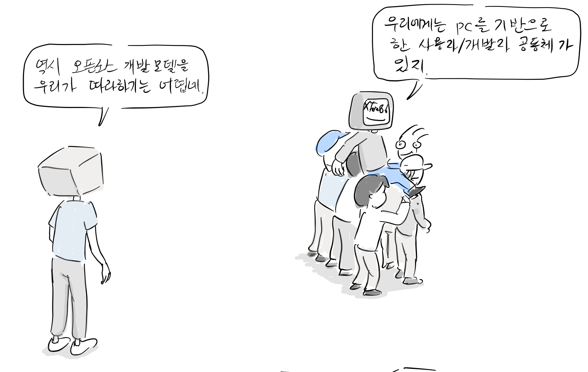

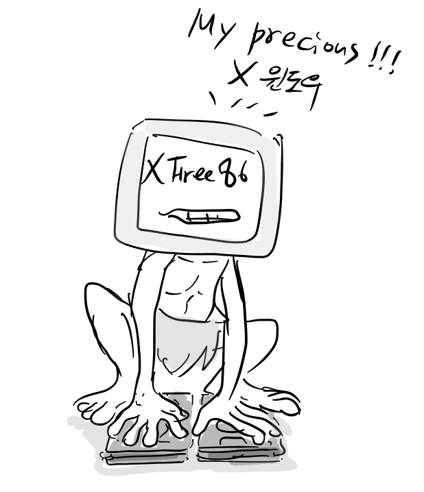

하지만, XFree86은 [성당 스타일](https://ko.wikipedia.org/wiki/%EC%84%B1%EB%8B%B9%EA%B3%BC_%EC%8B%9C%EC%9E%A5)의 폐쇄적인 개발 모델을 유지했다. 개발자들은 [CVS](https://ko.wikipedia.org/wiki/CVS) commit 권한이 없었고, 유닉스 업체들도 자신들의 패치를 업스트림에 적용하지 못해 각자 따로 관리했어야했다.

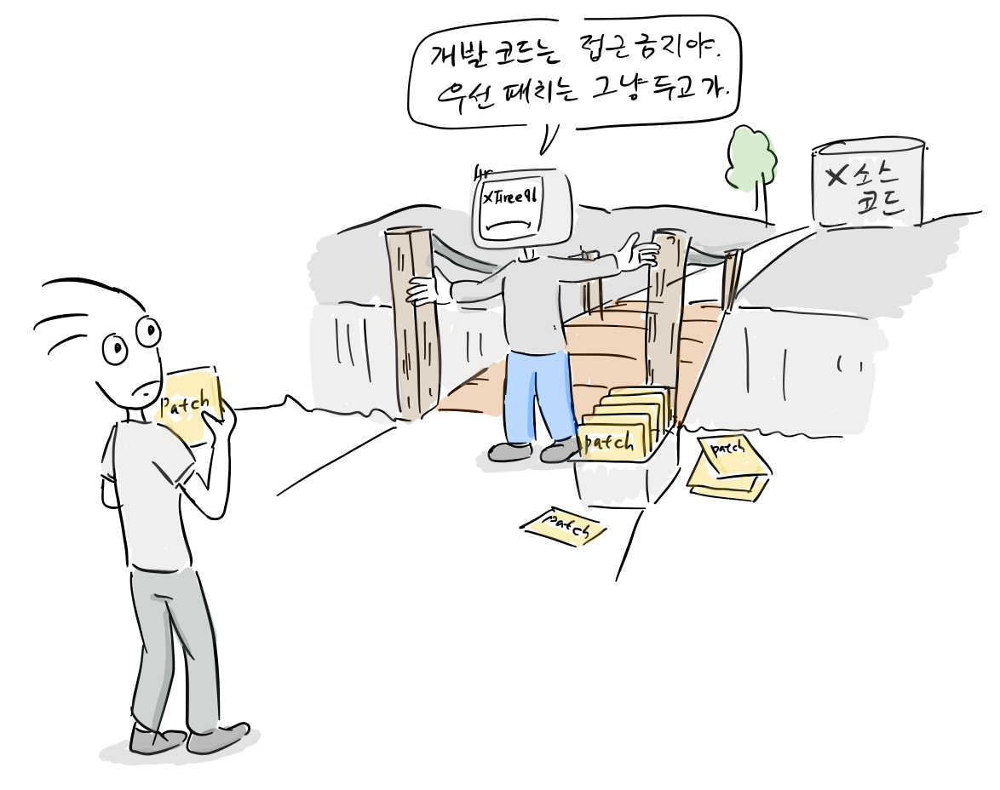

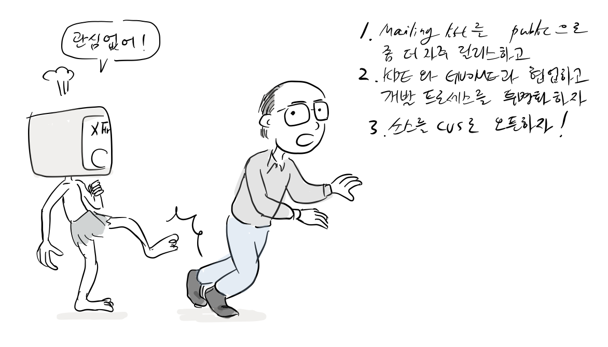

이에 [반기](https://web.archive.org/web/20050212012809/http://www.xfree86.org/pipermail/forum/2003-March/002165.html)를 든 [키스 패커드는 XFree86 코어 개발팀에서 쫓겨나고 만다](https://web.archive.org/web/20050212013104/http://www.xfree86.org:80/pipermail/forum/2003-March/001997.html).

2004년에는 기존 MIT 라이선스에 별도로 BSD 라이선스와 같은 광고 조항을 추가해서 라이선스를 더 제한적으로 바꾸었다. 많은 사람들이 이를 반대했는데, 특히, [자유 소프트웨어 재단(FSF)](https://ko.wikipedia.org/wiki/%EC%9E%90%EC%9C%A0_%EC%86%8C%ED%94%84%ED%8A%B8%EC%9B%A8%EC%96%B4_%EC%9E%AC%EB%8B%A8)와 [데비안(Debian)](https://ko.wikipedia.org/wiki/%EB%8D%B0%EB%B9%84%EC%95%88) 프로젝트에서 [GPL 라이선스](https://ko.wikipedia.org/wiki/GNU_%EC%9D%BC%EB%B0%98_%EA%B3%B5%EC%A4%91_%EC%82%AC%EC%9A%A9%EA%B6%8C)과 호환되지 않는다고 이의를 제기했고, 몇몇 개발 그룹은 XFree86의 원래 X 정신에 반한다며 프로젝트를 [포크](https://ko.wikipedia.org/wiki/%ED%8F%AC%ED%81%AC_\(%EC%86%8C%ED%94%84%ED%8A%B8%EC%9B%A8%EC%96%B4_%EA%B0%9C%EB%B0%9C\))하겠다고 협박아닌 협박을 하기도 했다.

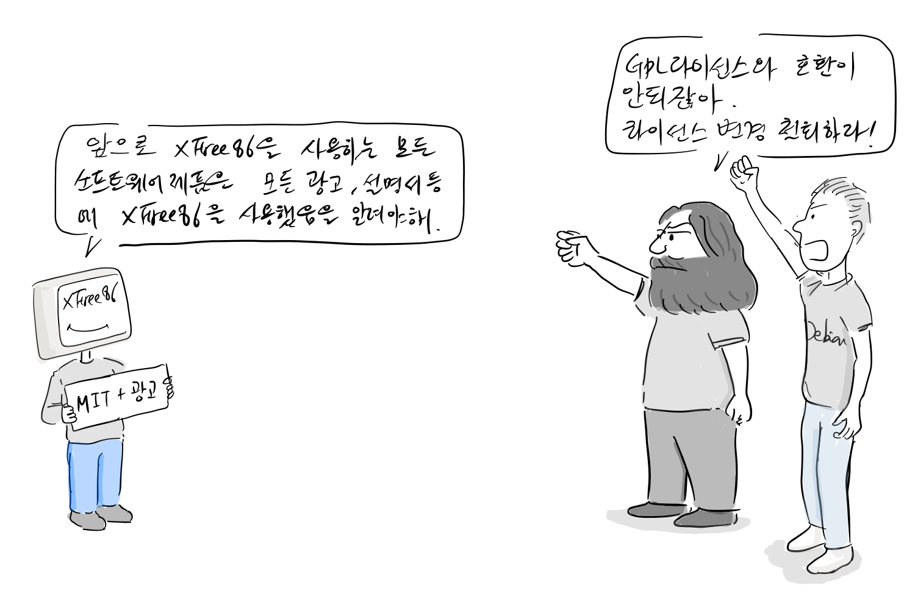

XFree86: 앞으로 XFree86을 사용하는 모든 소프트웨어 제품은 모든 광고, 메뉴얼 등에 반드시 XFree86를 사용했다고 알려야해.  
FSF & Debian: GPL 라이선스와 호환이 안되잖아. 라이선스 변경 철회하라!

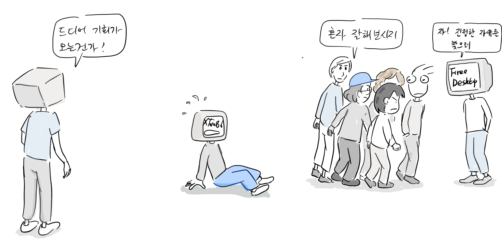

결국, 2004년 X.Org와 [freedesktop.org](https://en.wikipedia.org/wiki/Freedesktop.org) 구성원들이 XFree86 코드를 포크하여 [X.Org 파운데이션](https://en.wikipedia.org/wiki/X.Org_Foundation)을 조직한다. 지금까지 회사 주도로 프로젝트가 진행되었다면, 이제는 누구나 쉽게 개발에 참여할 수 있도록 개발 공동체에 의해 프로젝트가 운영되기 시작했다. 참고로, [freedesktop.org](https://en.wikipedia.org/wiki/Freedesktop.org)는 2000년 오픈소스 데스크탑 기술 개발을 위해 [레드햇](https://ko.wikipedia.org/wiki/%EB%A0%88%EB%93%9C%ED%96%87)이 만든 프로젝트이다.

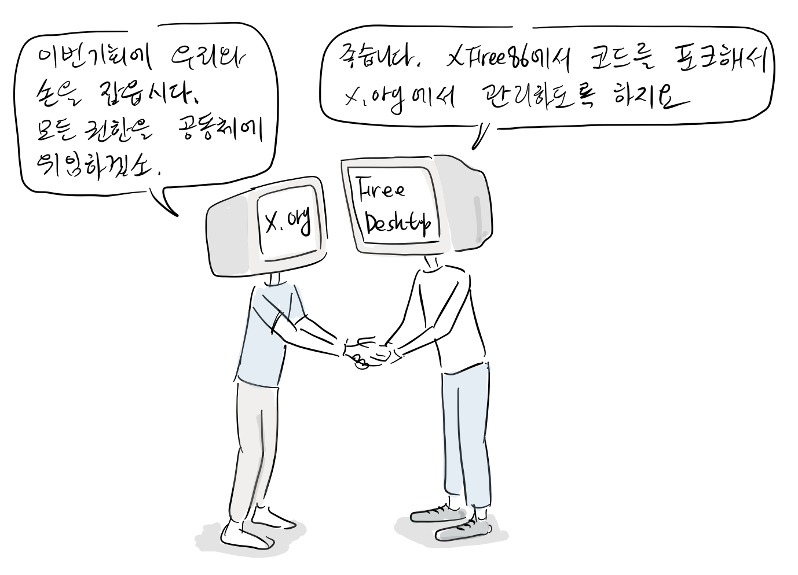

두 그룹은 기존에 X.Org이 유지하던 X11R6.6에 XFree86 4.4RC2를 통합해서 2004년 4월 X11R6.7을 릴리스한다.

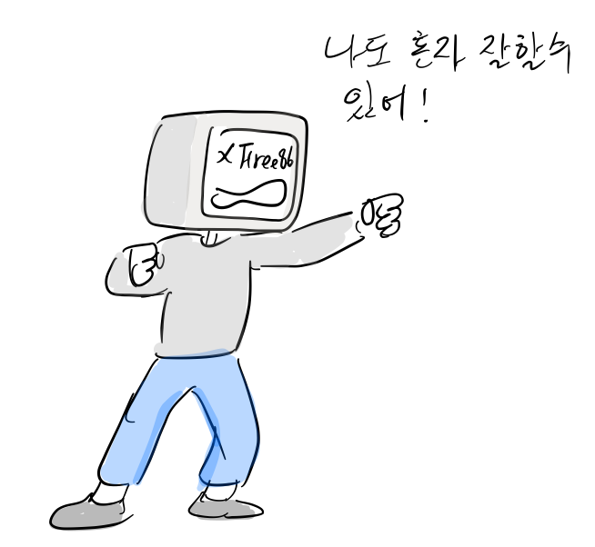

XFree86도 2008년까지 계속 개발을 진행했다.

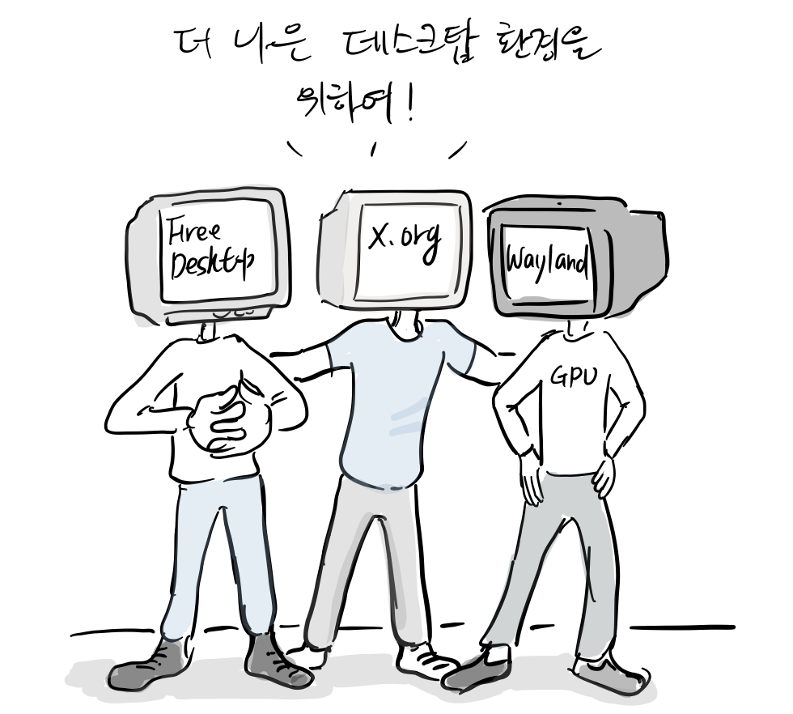

이후 X.Org은 [DRI(Direct Rendering Infrastructure)](https://en.wikipedia.org/wiki/Direct_Rendering_Infrastructure) 확장을 통한 GPU 가속 지원, Wayland 개발 등 유닉스/리눅스 데스크탑 개발을 진행하고 있고 1년에 한번씩 [X 개발자 컨퍼런스](https://www.x.org/wiki/Events/History/)를 열고 계속 데스크탑 혁신을 고민하고 있다.

더 읽을 글

-   http://www.catb.org/esr/writings/taouu/html/ch02s06.html
-   http://www.catb.org/esr/writings/taouu/html/ch02s05.html
-   http://archive.oreilly.com/pub/a/linux/2005/08/25/whatisXwindow.html
-   https://www.x.org/releases/X11R7.7/doc/libX11/libX11/libX11.pdf
-   https://www.usenix.org/legacy/publications/library/proceedings/usenix2000/invitedtalks/gettys\_html/Talk.htm
-   https://en.wikipedia.org/wiki/OPEN\_LOOK
-   https://en.wikipedia.org/wiki/XFree86
-   [Freedesktop.org: its past and its future](https://lwn.net/Articles/767258/), lwn.net, 2018

참고로, 등장 인물 간 대화는 자료를 바탕으로 재구성되었습니다.

만화 중 잘못된 부분이나 추가할 내용이 있으면 [만화 원고](https://docs.google.com/document/d/19dF7_U0TKjgqslbtfEqozBarW3kjEd0i2JY8cfpJq8I/edit?usp=sharing)에 직접 의견을 남겨주시면 고맙겠습니다. 그 외 전반적인 만화 후기는 블로그에 바로 답글로 남겨주세요.
