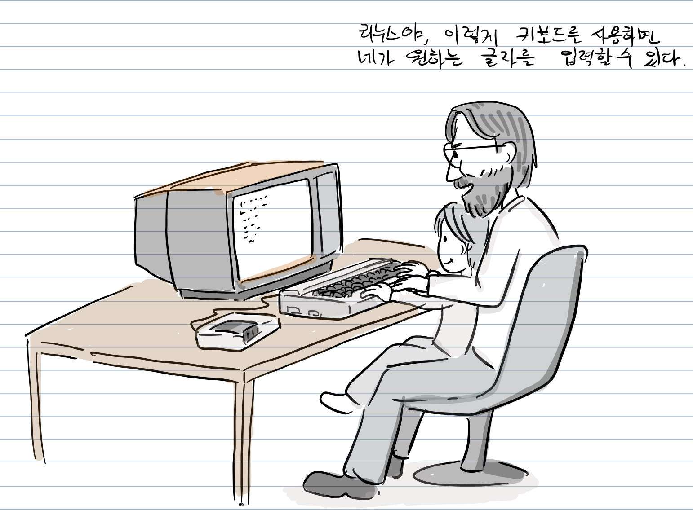
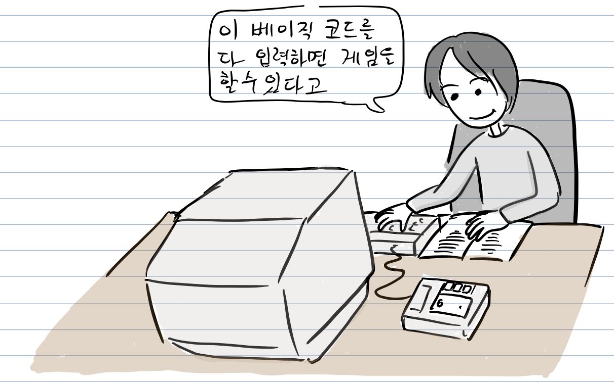
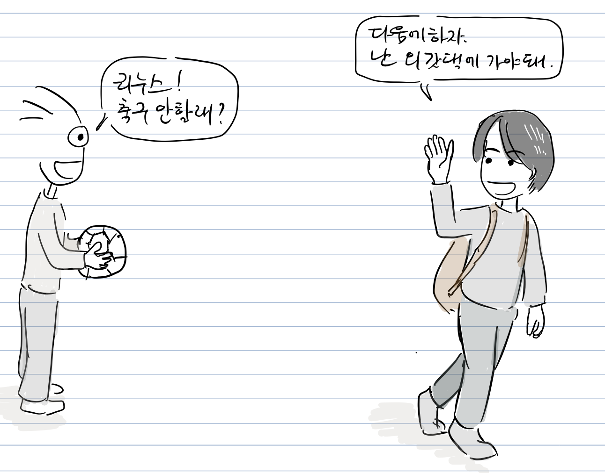
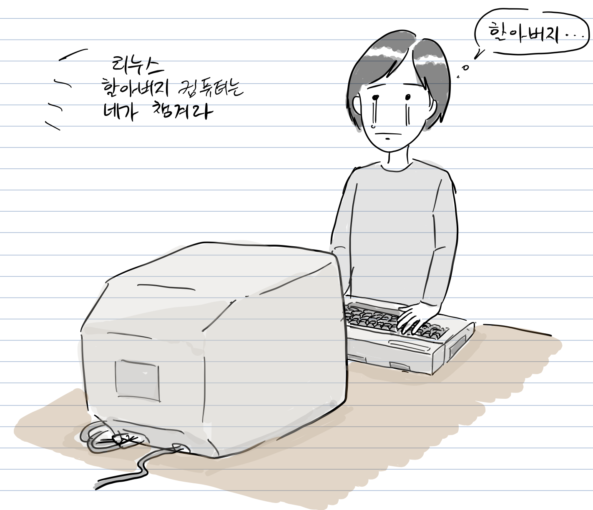
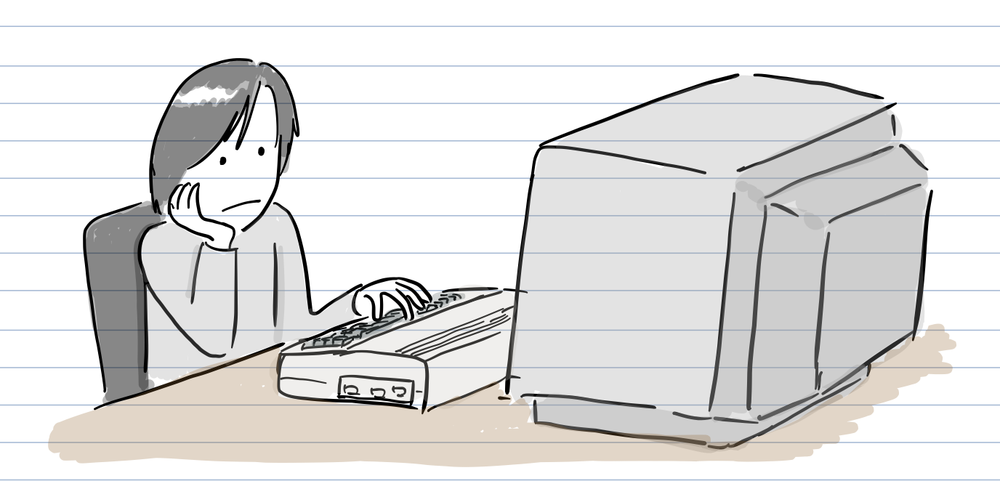
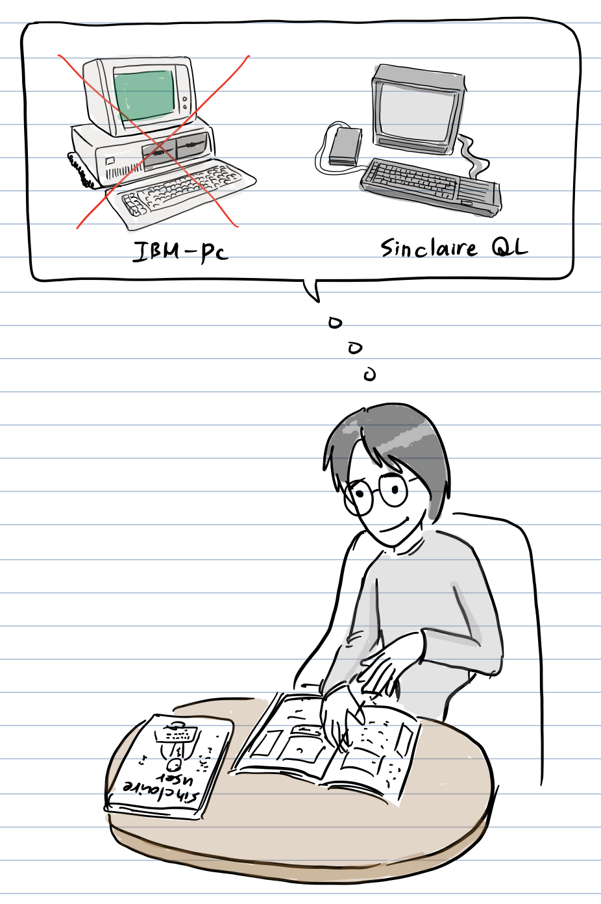
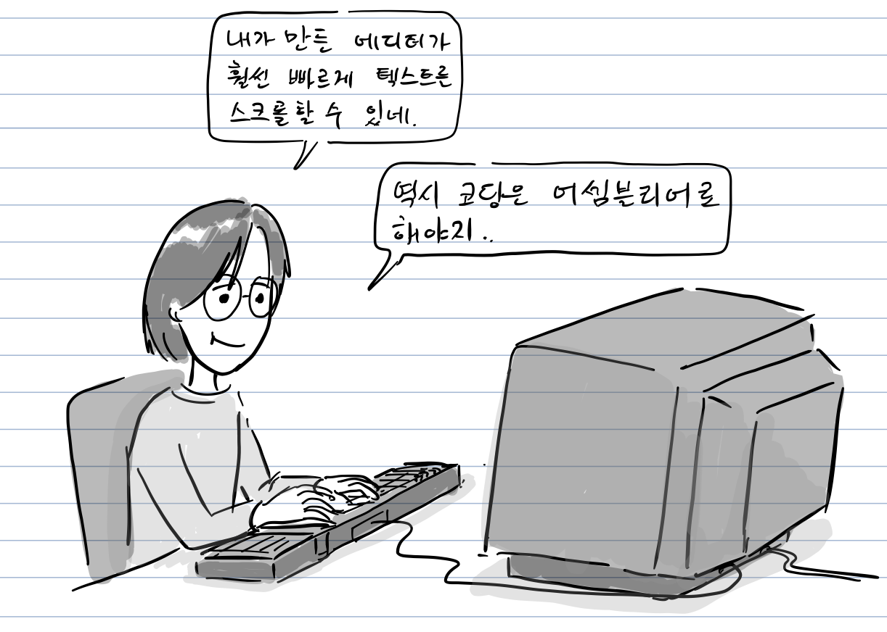
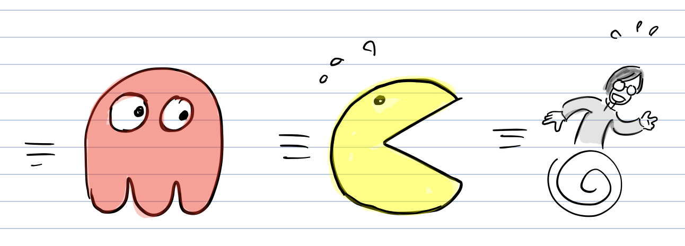
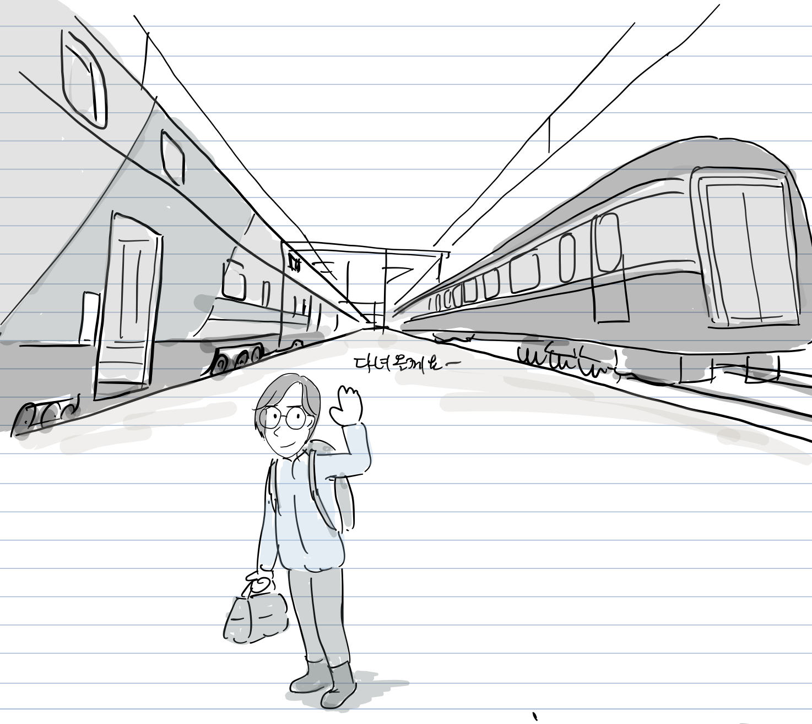

오늘날 수 많은 컴퓨터와 여러 장치를 움직이는 리눅스는 1991년 핀란드에 사는 리누스 토발즈라는 대학생이 공개한 운영체제 커널 코드로 시작한다.

#### 리누스의 어린 시절

리누스는 외할아버지 영향으로 어릴 적부터 컴퓨터를 접할 수 있었다. 당시 외할아버지는 헬싱키 대학 통계학과 교수였고, [코모도어 VIC-20](https://en.wikipedia.org/wiki/Commodore_VIC-20)이라는 가정용 컴퓨터를 사용하고 있었다. 외할아버지는 가끔 종이에 써 놓은 자신의 [베이직](https://ko.wikipedia.org/wiki/%EB%B2%A0%EC%9D%B4%EC%A7%81) 코드를 리누스에게 입력을 시키곤 했다.

때때로 리누스는 컴퓨터 메뉴얼에 있는 간단한 게임 코드를 직접 입력해보기도 했고, 자신만의 프로그램을 만들기도 했다.

외할아버지 컴퓨터에 취미를 붙인 리누스는 학교 수업이 끝나면 곧바로 외할아버지 집에 놀러가곤 했다.

그리고 외할아버지가 돌아가신 후, 컴퓨터는 유품이 되어 리누스에게 돌아왔다.

**두번째 컴퓨터**

고등학생이 된 리누스에게 코모도어는 더 이상 매력적인 컴퓨터가 아니었다.

“아.. 코모도어로는 이제 할만한 게 없구나…”

리누스는 새로운 컴퓨터를 살 계획을 하기 시작한다.

당시 컴퓨터는 상당히 비쌌기 때문에, 가정 형편상 부모님의 도움으로만 컴퓨터를 살 수는 없었다. 다행히 수학 천재 장학금을 받았고, 크리스마스 때 일가 친척들에게 받은 용돈을 모아 컴퓨터를 살만한 돈을 모을 수 있었다.

리누스가 16살이 되던 1987년 IBM-PC 대신 좀 더 성능이 좋은 [싱클레어 QL](https://en.wikipedia.org/wiki/Sinclair_QL)을 선택한다. 싱클레어 QL는 모토롤라가 만든 [68008](https://en.wikipedia.org/wiki/Motorola_68008)를 사용했는데, 레지스터는 32비트였고 멀티태스킹을 지원하는 CPU였다.

리누스는 플로피 디스크가 가끔 동작하지 않아서 직접 플로피 디스크 콘트롤러를 구현하면서 운영체제 구현에 관심을 갖게 된다. 특히, 역어셈블리를 통해 싱클레어 QL에서 사용하는 [Q-DOS](https://en.wikipedia.org/wiki/Sinclair_QDOS) 운영체제 코드를 분석했으나 코드가 롬에 저장되어 수정은 불가능했다.

프로그래밍을 위해 어셈블러와 에디터를 구입했지만, 마이크로 드라이브만 지원하고 [EEPROM (Electrically Erasable and Programmable Read)](https://ko.wikipedia.org/wiki/EEPROM) 카드는 지원하지 않았다. EEPROM은 다시 쓰기가 가능한 메모리로서 컴퓨터 전원을 꺼도 저장한 데이터가 그대로 유지되었다. 결국, 에디터와 어셈블러를 모두 어셈블리어로 다시 만들었다. ( 참고: [68008 어셈블리어 코드](https://github.com/anachrocomputer/UK108/blob/master/test.asm))

리누스는 때때로 상용 게임과 유사한 복제 게임을 만들었는데, 어셈블리어로 [팩맨](https://ko.wikipedia.org/wiki/%ED%8C%A9%EB%A7%A8)을 만들기도 했다.

대학을 진학한 이후에는 싱클레어 OS가 가진 결점으로 인해 새로운 운영체제를 만들 결심을 하게 된다. 운영체제 자체는 멀티태스킹이 가능했지만, 메모리 보호 기능이 없었다. 프로그램을 잘못 만들면 전체 시스템이 다운되는 현상이 발생했다.

“메모리 보호 기능이 있는 68020 CPU로 업그레이드하면 좋은데, 내 가 운영체제를 새로 만들 수 있을까?”

새로운 싱클레어는 [68020 CPU](https://en.wikipedia.org/wiki/Motorola_68020)를 사용하는데, 메모리 관리 및 페이지 기능을 제공했다. 하지만, 그 당시 핀란드는 시장이 작아서 컴퓨터 부품을 영국에서 주문을 해야했는데, 쉬운 일이 아니었고, 운영체제 개발 계획은 더 이상 진행되지 못했다. 결국, 싱클레어 주변기기를 컴퓨터 잡지 광고를 통해 팔았다. 그 후 컴퓨터에 흥미를 잃은 리누스는 대학교 1학년을 마치고 군복무를 위해 라플랜드행 열차에 몸을 싣는다.

**더 읽을 글**

-   [리눅스 그냥 재미로](http://www.aladin.co.kr/shop/wproduct.aspx?ItemId=274630), 한겨레 신문사 , 2001

참고로, 등장 인물 간 대화는 자료를 바탕으로 재구성되었습니다.

만화 중 잘못된 부분이나 추가할 내용이 있으면 [만화 원고](https://docs.google.com/document/d/1fYRtP-M1tUaL2hCfl4ohwcAKE5f2opUSQuD2j_F-zOo/edit?usp=sharing)에 직접 의견을 남겨주시면 고맙겠습니다. 그 외 전반적인 만화 후기는 블로그에 바로 답글로 남겨주세요. 다음 이야기는 리눅스 커널의 시작입니다.
