“책을 통해 차츰 유닉스를 이해하게 되면서, 나는 커다란 열정에 휩싸이게 되었다. 솔직히, 한번 일기 시작한 열정은 이후 잦아들 줄을 몰랐다.(이처럼 잦아들 줄 모르는 열정을 느낄 수 있는 대상이 당신에게도 있길 진심으로 바란다)” – 리누스 토발즈 – 그냥 재미로(Just a fun)

1990년 5월에 군대를 제대한 리누스는 가을 학기에 수강 신청에 “C언어 및 유닉스 운영체제”라는 과목을 추가한다. 복학을 기다리면서 미리 교재인 [앤드류 타넨바움](https://ko.wikipedia.org/wiki/%EC%95%A4%EB%93%9C%EB%A3%A8_%ED%83%80%EB%84%A8%EB%B0%94%EC%9B%80)이 쓴 “[운영체제: 디자인 및 구현](https://en.wikipedia.org/wiki/Operating_Systems:_Design_and_Implementation)”을 구해 읽게된다. 이 책은 [미닉스](https://ko.wikipedia.org/wiki/%EB%AF%B8%EB%8B%89%EC%8A%A4)라는 교육용 유닉스를 다루고 있다.

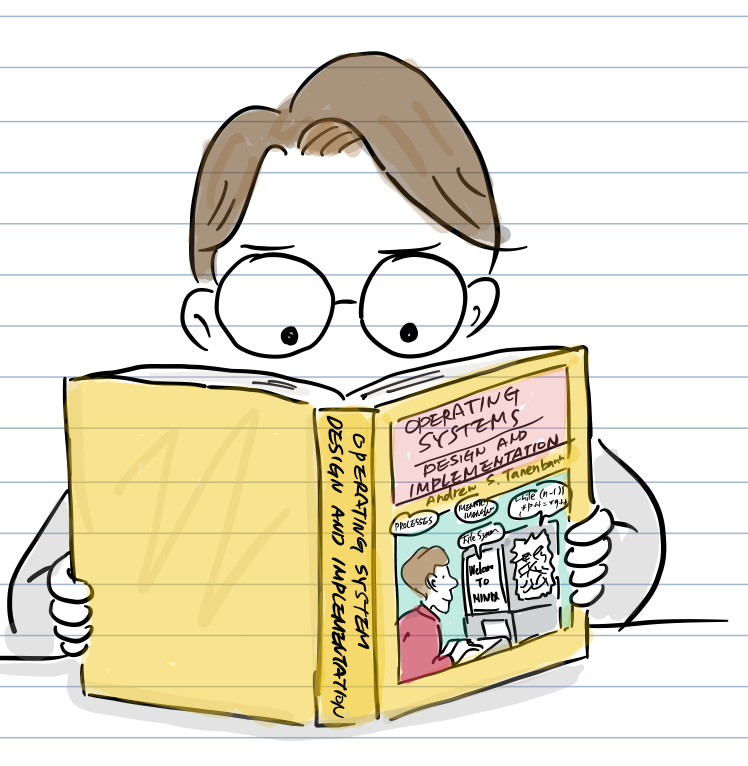

책의 1장에서 소개된 운영체제의 역사, 미닉스 개발 동기, 운영체제 개념을 읽고 유닉스가 가진 철학과 유닉스가 얼마나 강력하고 간결하고 아름답게 디자인되었는지를 배우게 된다. 결국, 유닉스가 동작하는 컴퓨터를 갖기로 결심한다.

미닉스는 교육용이라 상용 유닉스 비해 가격이 저렴했지만, 이를 실행하려면 [인텔 80386 CPU](https://ko.wikipedia.org/wiki/%EC%9D%B8%ED%85%94_80386)가 장착된 컴퓨터가 필요했다. 당장 비싼 386 PC를 살수 없었던 리누스는 돈을 모으기 시작했다.

결국, 그해 여름 방학 기간 동안 리누스가 할 수 있는 일은 오직 두가지였다.

“미닉스 책 읽기” 또는 아무 것도 안하기…

드디어 새학기가 시작되었다. 유닉스는 학생들 뿐만 아니라 강의를 맡은 조교에게도 새로운 것이였다.

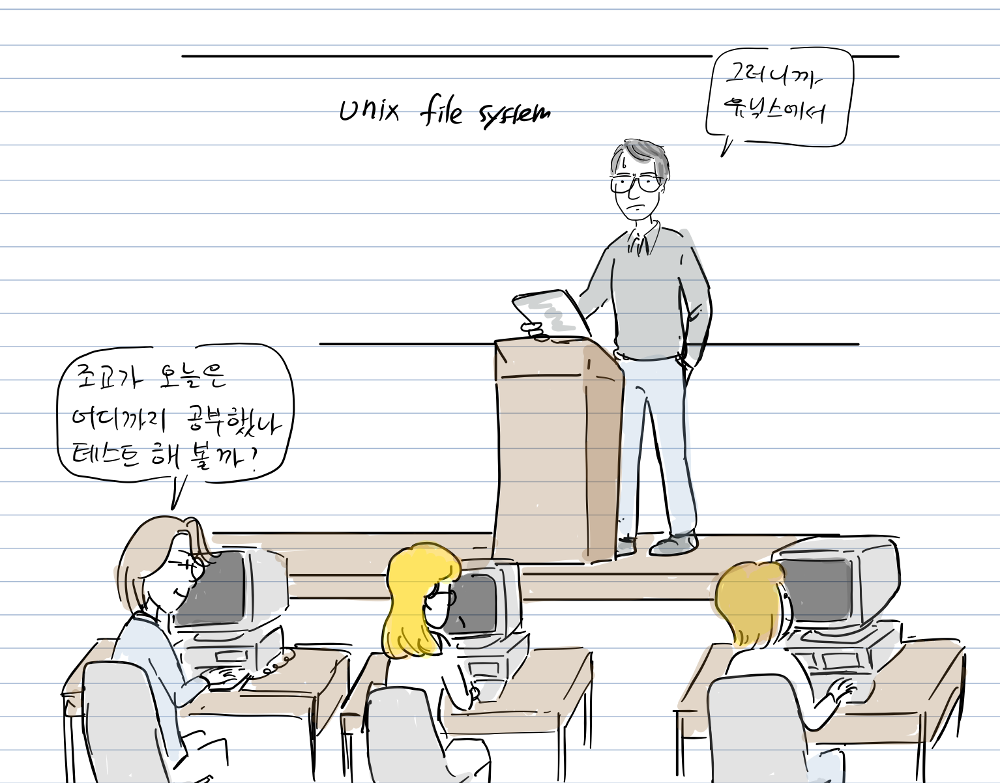

핀란드의 긴 겨울이 시작되었고 리누스도 가을 학기가 끝나고 겨울 방학을 맞이한다.

그리고, 마침내 은행에서 빌린 학자금과 크리스마스 용돈을 모아 1991년 1월에 18,000 FIM(약 $3,500) 돈을 주고 386 PC를 산다.

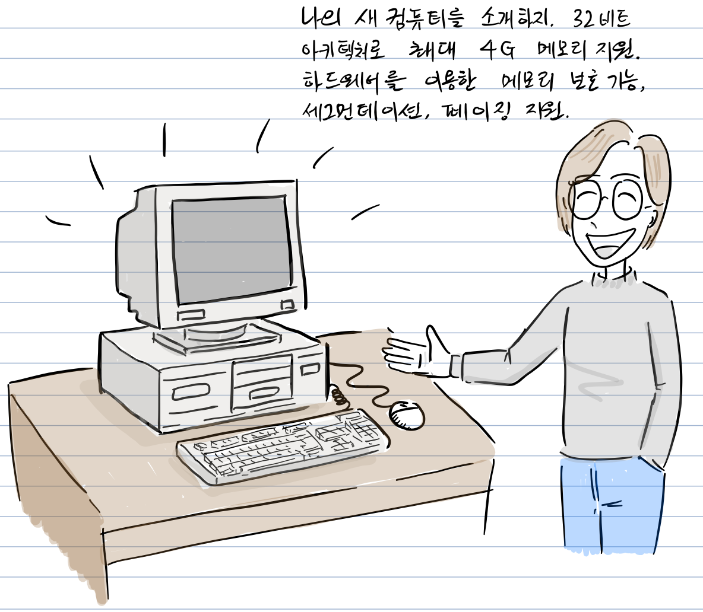

“나의 새 컴퓨터를 소개하지. 32비트 아키텍처로 최대 4G 메모리 지원!  
하드웨어를 이용한 [메모리 보호](https://ko.wikipedia.org/wiki/%EB%A9%94%EB%AA%A8%EB%A6%AC_%EB%B3%B4%ED%98%B8), [세그먼테이션](https://ko.wikipedia.org/wiki/X86_%EB%A9%94%EB%AA%A8%EB%A6%AC_%EB%B6%84%ED%95%A0), [페이징](https://ko.wikipedia.org/wiki/%ED%8E%98%EC%9D%B4%EC%A7%95) 기능 지원!”

컴퓨터에는 [MS 도스](https://ko.wikipedia.org/wiki/MS-DOS)가 설치되어 있지만, 미닉스를 빨리 쓰고 싶어서 서점에서 지난 학기에 배운 “운영체제: 디자인 및 구현”책을 주문한다. 책에는 미닉스 소스 코드 디스켓이 함께 포함되어 있었다.

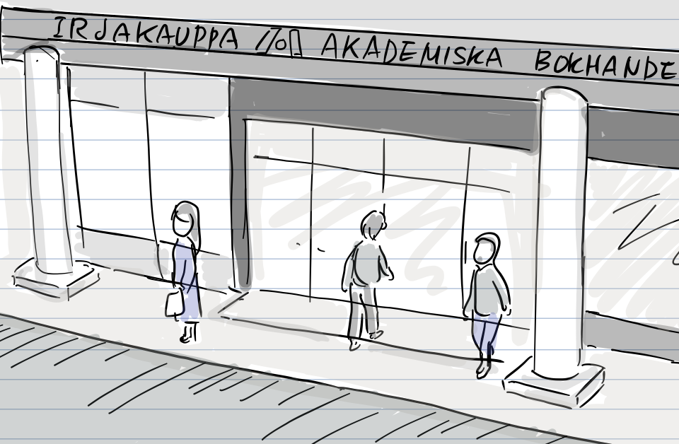

“앤드류 타넨바움이 쓴 “운영체제: 디자인 및 구현”라는 책을 주문하려고 합니다.”  
“미닉스 OS 디스켓과 세금 포함해서 $169입니다. 약 한달 정도 기다려야 합니다.”

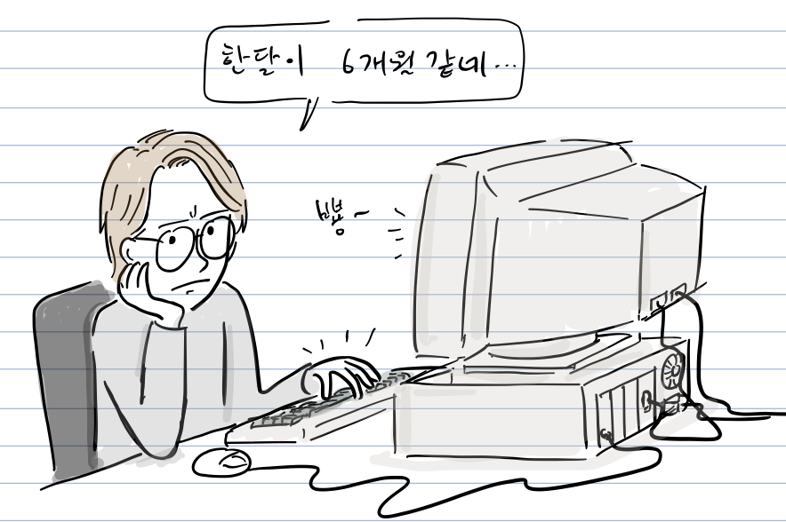

그리고, 한달 후에 책과 함께 12장의 디스켓으로 구성된 미닉스가 도착한다.

미닉스를 개발한 앤드류 탄넨바움(Andrew Tanenbaum) 교수는 학생들을 위해 다른 워크스테이션 보다 가격이 저렴한 인텔 CPU 8086/8286 기반으로 미닉스를 개발했다. 게다가 운영체제 교육이 주 목적이므로 미닉스를 다소 불완전하게 만들어 놓았다. 그래서 미닉스에 호주 출신인 브루스 에반스가 개발한 패치를 적용해야 인텔 80386 CPU에서 32비트 [보호 모드](https://ko.wikipedia.org/wiki/%EB%B3%B4%ED%98%B8_%EB%AA%A8%EB%93%9C)를 지원할 수 있었다.

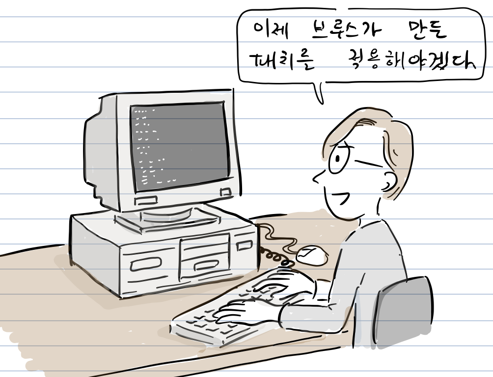

하지만, 브루스 에반스는 라이선스 문제로 자신 만든 패치를 적용한 미닉스를 배포할 수 없었다. 그래서 따로 패치를 다운로드 받아 기존 미닉스에 적용해야 하는 번거로운 과정을 거쳐야했다.

리누스는 브루스의 패치를 적용한 미닉스를 자신의 386PC에서 실행시킬 수 있었다. 하지만, 터미널 기능이 완전하지 않아 헬싱키 대학에 있는 VAX시스템을 사용하는데 어려움을 겪었다.

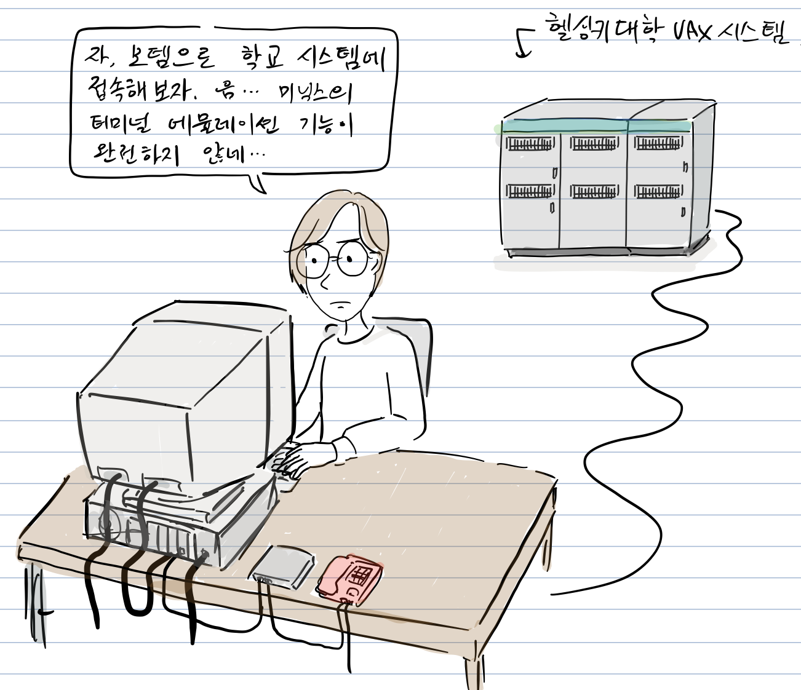

“자, 모뎀으로 학교 시스템에서 접속해 보자. 음.. 미닉스의 [터미널 에뮬레이션](https://ko.wikipedia.org/wiki/%EB%8B%A8%EB%A7%90_%EC%97%90%EB%AE%AC%EB%A0%88%EC%9D%B4%ED%84%B0) 기능이 완전하지 않네..”

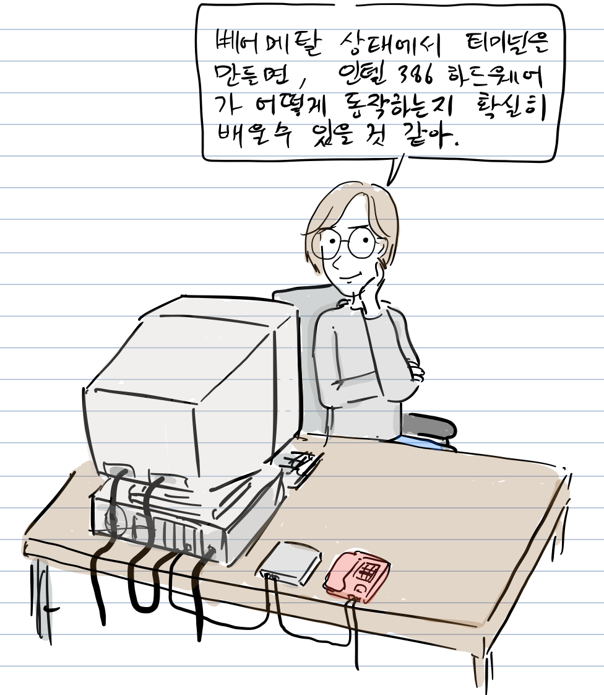

“베어 메탈(운영체제가 설치되어 있지 않은 하드웨어) 상태에서 터미널을 만들면, 인텔 386 하드웨어가 어떻게 동작하는 확실히 배울 수 있을 것 같아..”

참고로, 인텔 하드웨어는 [바이오스](https://ko.wikipedia.org/wiki/%EB%B0%94%EC%9D%B4%EC%98%A4%EC%8A%A4)를 통해 키보드/마우스, 디스크, 프린터 등 모든 하드웨어를 바로 제어할 수 있으므로, 터미널 에뮬레이션 기능을 운영체제 없이 구현할 수 있다.

“[멀티스레드](https://ko.wikipedia.org/wiki/%EB%A9%80%ED%8B%B0%EC%8A%A4%EB%A0%88%EB%94%A9)를 쓰려면 [리얼 모드](https://ko.wikipedia.org/wiki/%EB%A6%AC%EC%96%BC_%EB%AA%A8%EB%93%9C)에서 보호 모드로 전환을 해야겠지”

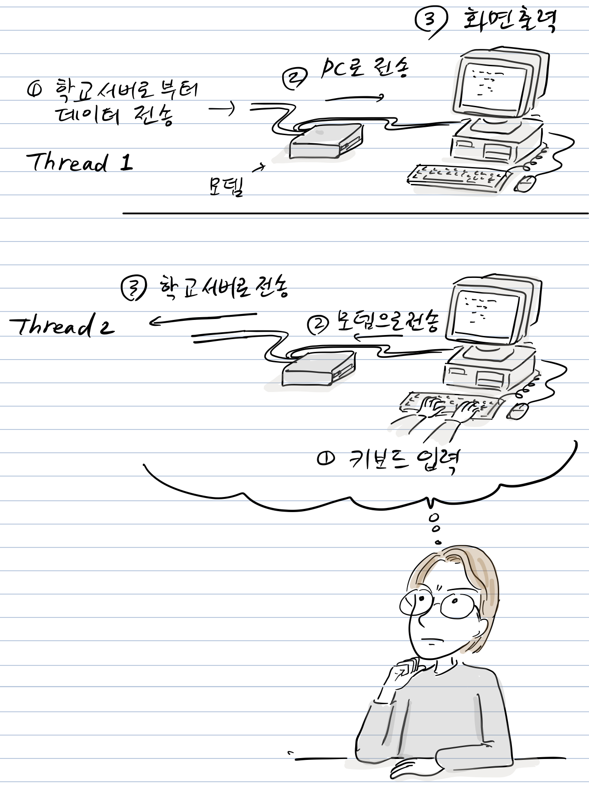

“이 스레드는 모뎀으로 부터 데이터를 받아 화면에 뿌리고, 또 다른 쓰레드는 키보드 입력을 받아서 [모뎀](https://ko.wikipedia.org/wiki/%EB%AA%A8%EB%8E%80)에 쓰면 되겠네…” “자 [컨텍스트 스위칭](https://ko.wikipedia.org/wiki/%EB%AC%B8%EB%A7%A5_%EA%B5%90%ED%99%98)도 필요하고..”

이제 리누스는 직접 만든 터미널로 학교 시스템에서 접속해서 메일도 확인하고 미닉스 뉴스 그룹에 올라온 글도 읽게되었다.

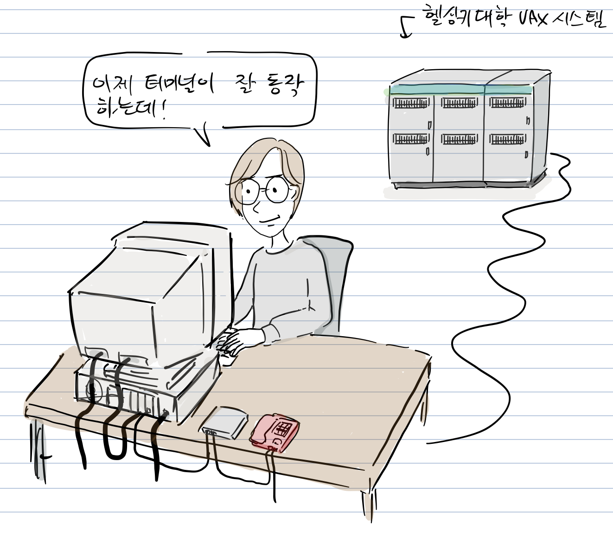

문제는 파일로 다운로드 받거나 업로드하는 것이었다.

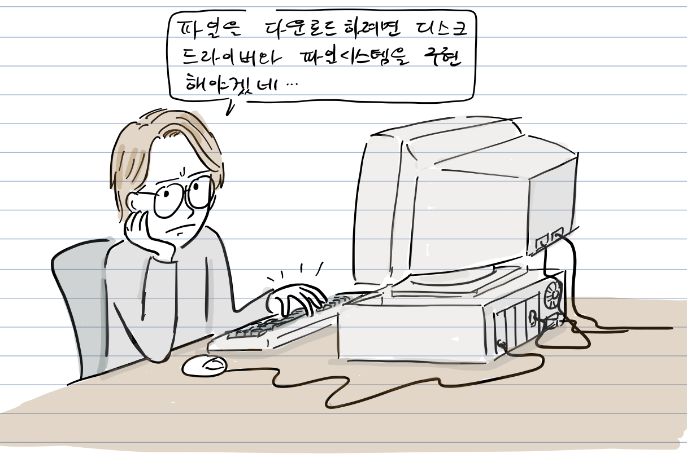

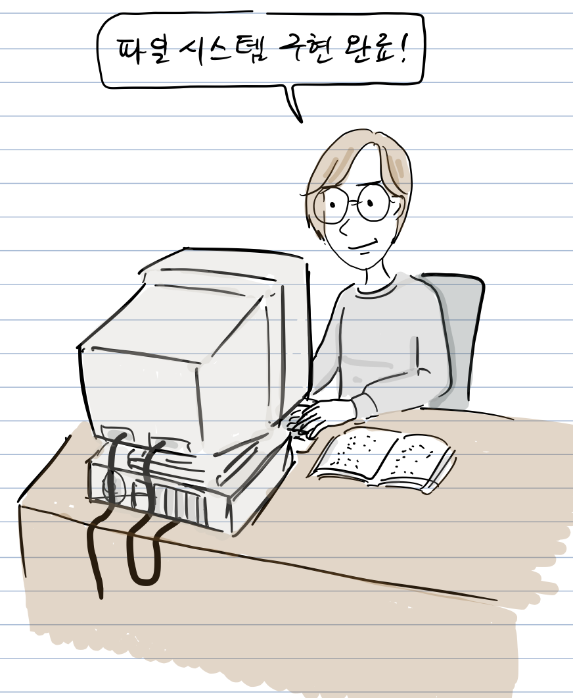

“와우, Minix 파일시스템 구현 완료!” “책이 있으니 구현이 생각보다는 쉽네.. 이제 파일 저장이 가능하다”

“음.. 그러고보니, 내가 만든 터미널이 점점 운영체제에 가까워지고 있네 “

“유닉스와 호환되는 운영체제를 만들려면 POSIX를 알아야하는데, 어디서 문서를 구할 수 있을까?” “미닉스 뉴스그룹에 물어봐야겠다”

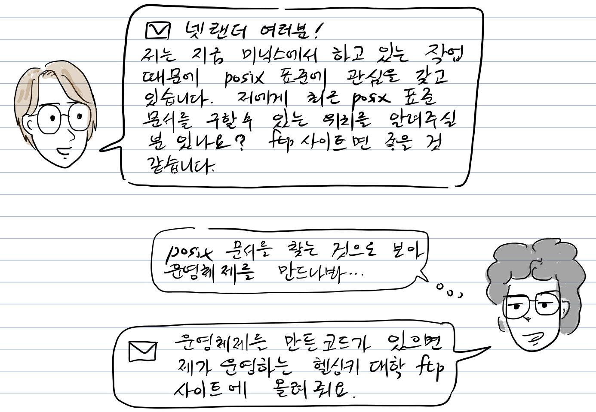

“넷랜더(netlanders) 여러분께  
지금 현재 미닉스에서 하고 있는 작업 때문에 저는 [posix 표준](https://ko.wikipedia.org/wiki/POSIX)에 관심을 갖고 있습니다. 저에게 최근 posix 표준 문서를 구할 수 있는 위치를 알려주실 분 있나요? ftp사이트면 좋을 것 같습니다.”

“posix 문서를 찾는 것으로 보아 운영체제를 만드나봐..”  
“운영체제를 만든 코드가 있으면 제가 운영하는 헬싱키 대학 ftp사이트에 올려줘요.”

이처럼 리누스의 터미널 프로그램은 점차 커널로서의 면모를 갖추어나가기 시작했다.

**더 읽을 글**

-   [리눅스 그냥 재미로](http://www.aladin.co.kr/shop/wproduct.aspx?ItemId=274630), 리누스 토발즈, 한겨레 신문사 , 2001
-   [Lessons Learned from 30 Years of Minix](https://cacm.acm.org/magazines/2016/3/198874-lessons-learned-from-30-years-of-minix/fulltext), 앤드류 타넨바움, ACM

참고로, 등장 인물 간 대화는 자료를 바탕으로 재구성되었습니다.

만화 중 잘못된 부분이나 추가할 내용이 있으면 [만화 원고](https://docs.google.com/document/d/1Mp3314bv-2S-uYK50bJUr7Au4PWH6uO8fajFthDE8Tk/edit?usp=sharing)에 직접 의견을 남겨주시면 고맙겠습니다. 그 외 전반적인 만화 후기는 블로그에 바로 답글로 남겨주세요. 다음 이야기는 리눅스 커널의 시작입니다.
