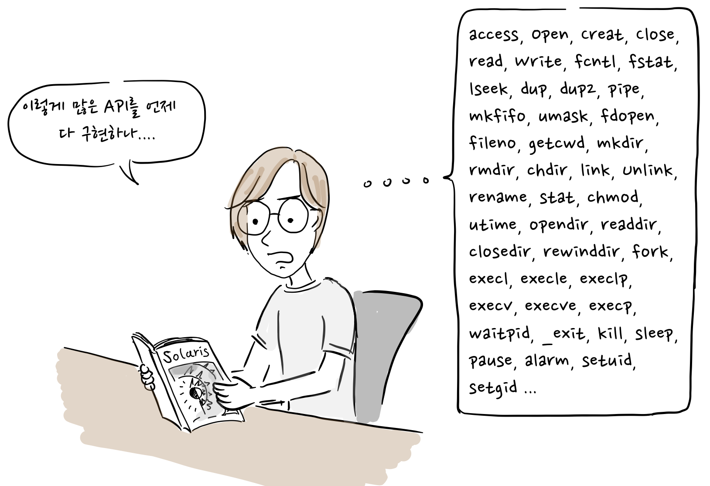
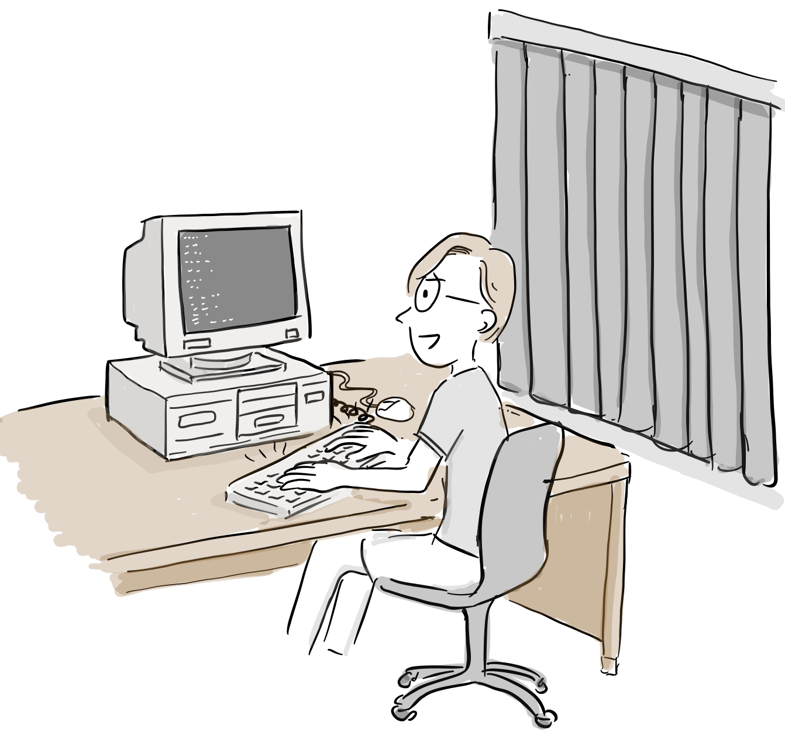
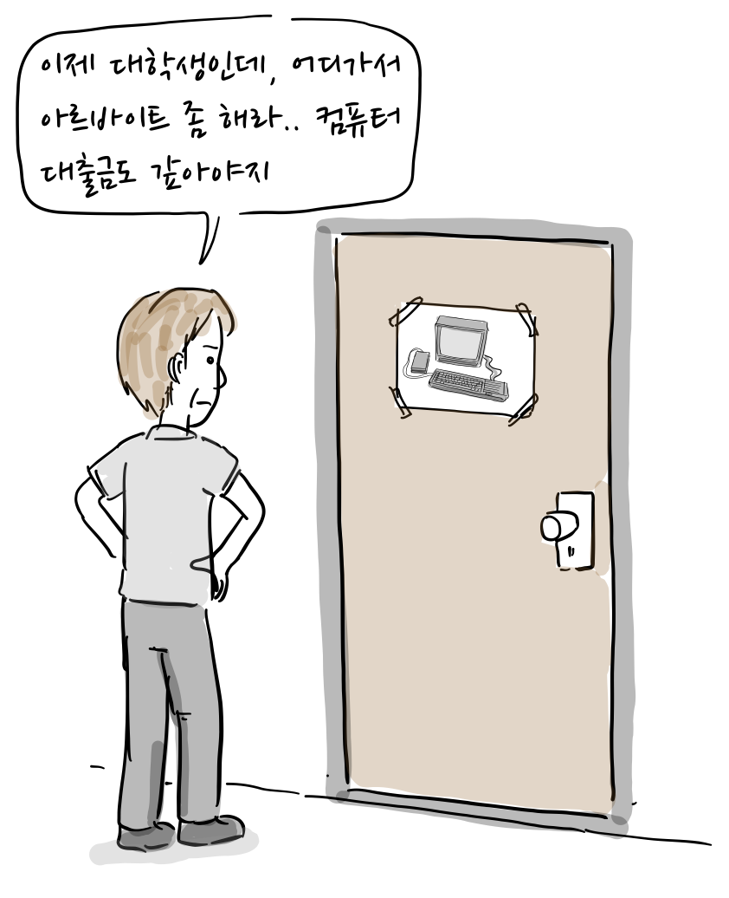
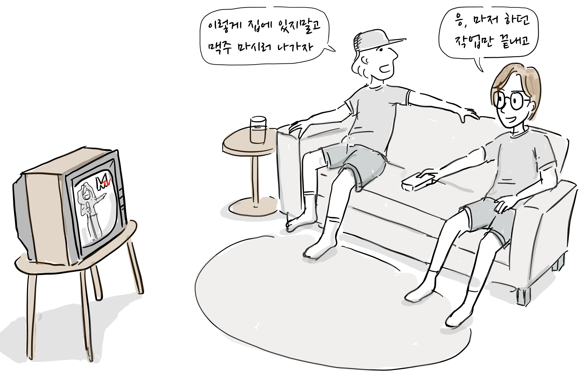
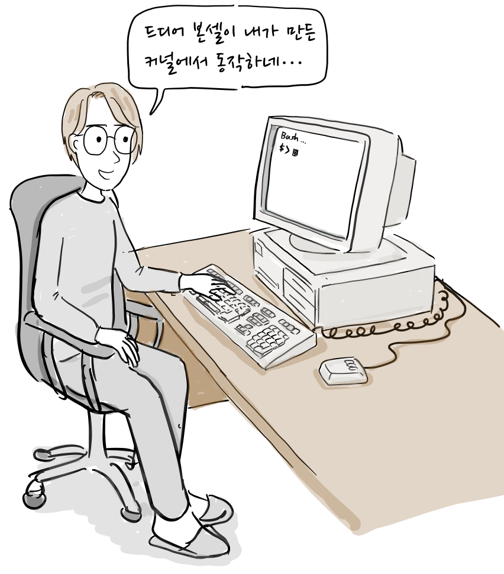
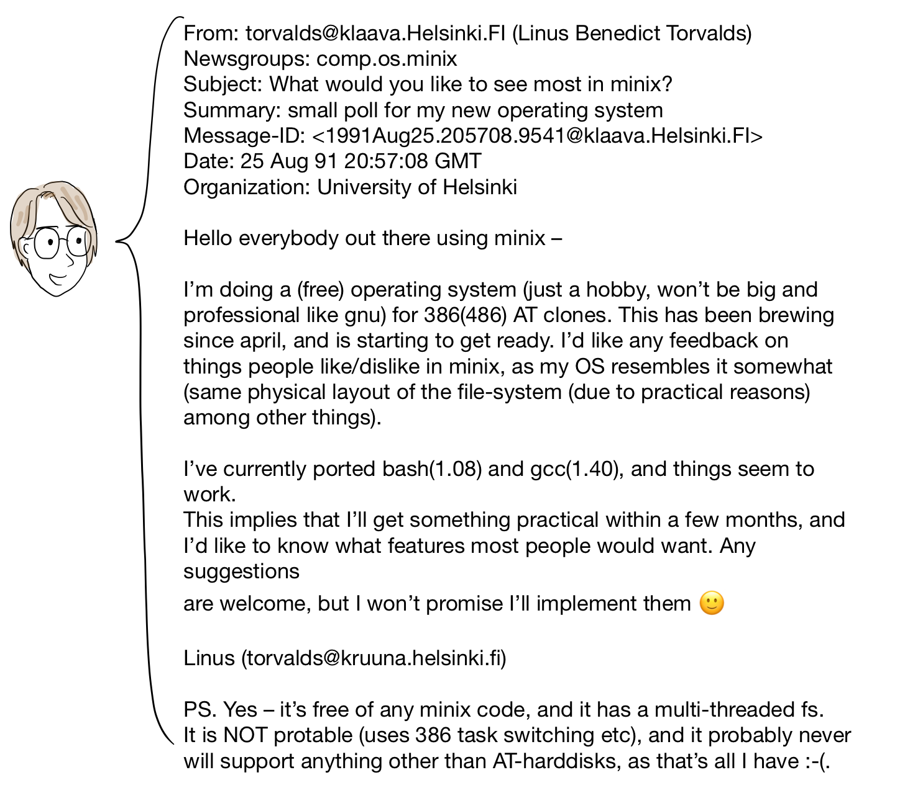
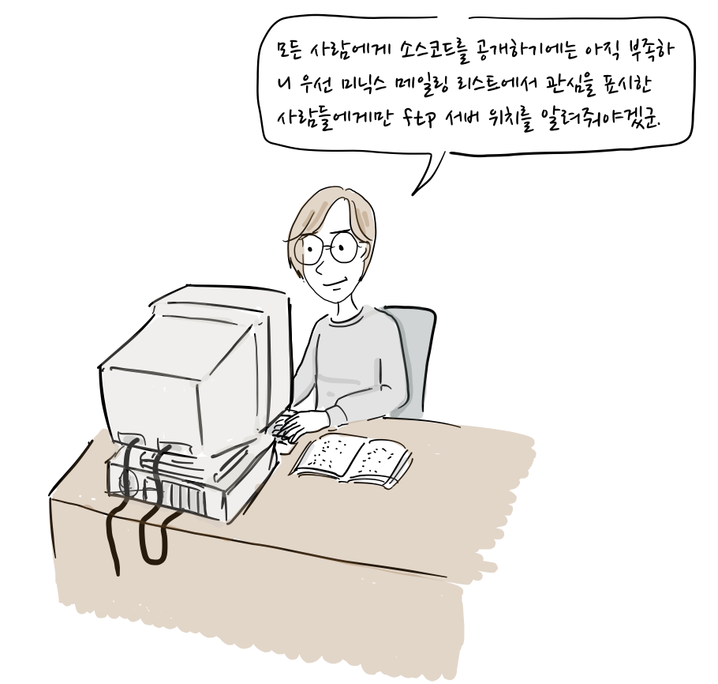
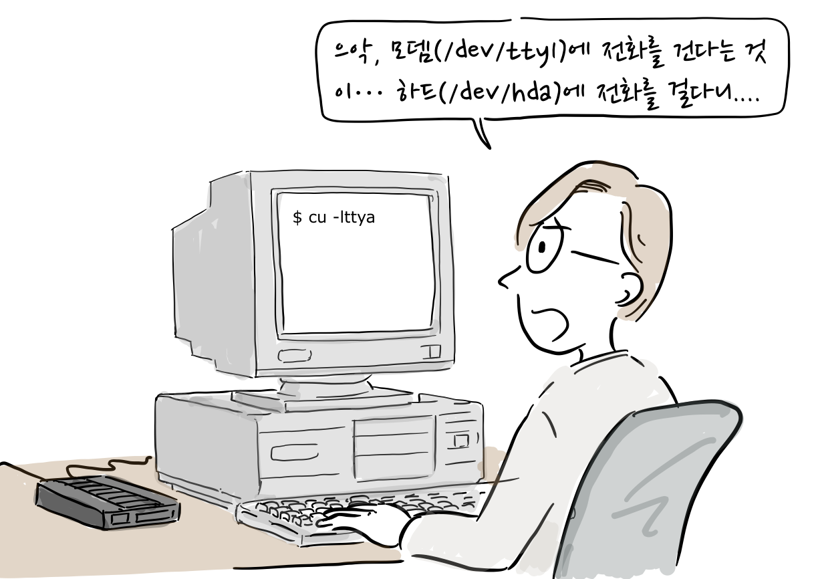
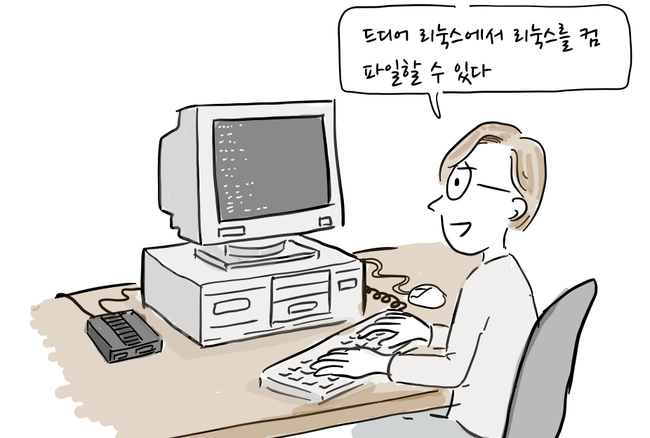
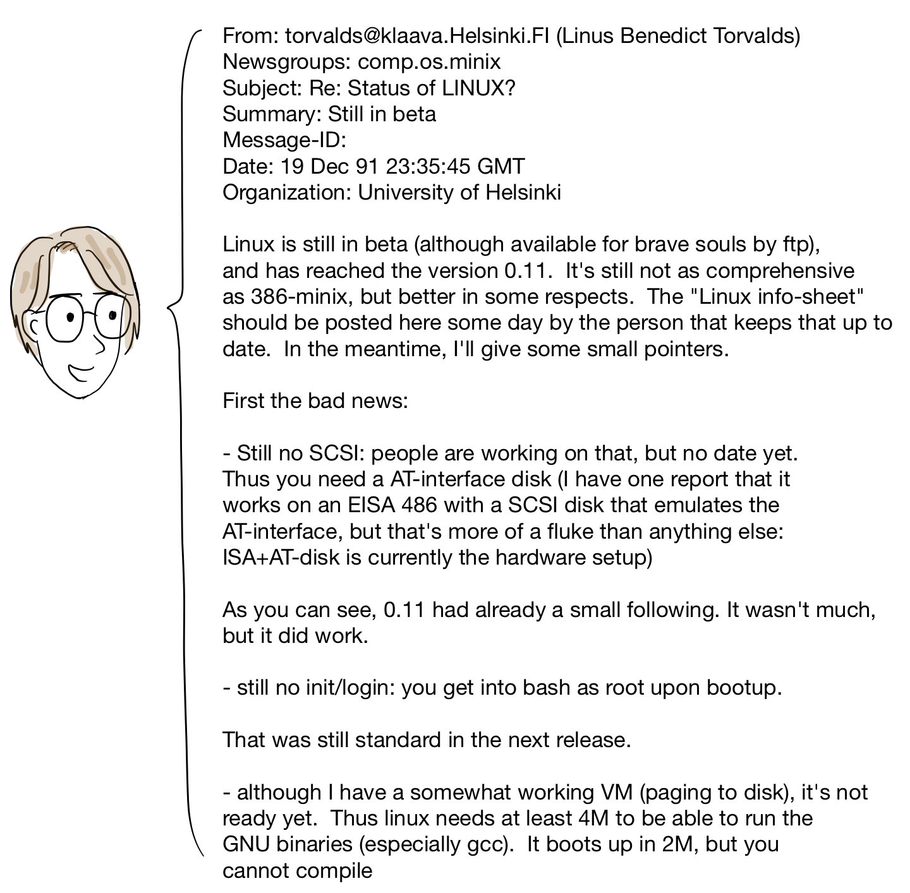

*“12월 25일, 마침내 디스크 페이징 기능이 완료되었고, 이는 내가 다른 사람 요청으로 리눅스에 추가한 첫번째 기능이였다.”* – 리눅스 그냥 재미로(2001) / 리누스 토발즈

인텔386 PC에서 터미널 구현을 마친 리누스는 본격적인 유닉스 표준(posix) API를 구현하기로 마음을 먹는다. 하지만, posix API를 구현하는 일은 생각만큼 쉬운 일이 아니였다.

“이렇게 많은 API를 언제 다 구현하나…”

참고로, [OpenGroup 사이트](http://pubs.opengroup.org/onlinepubs/9699919799/toc.htm)에 posix API를 pdf 또는 html로 볼 수 있다.

“우선 [쉘](https://ko.wikipedia.org/wiki/%EC%9C%A0%EB%8B%89%EC%8A%A4_%EC%85%B8)을 구현해야해…” 그래야 로그온이 가능하지…

“우선 리눅스는 init 대신 쉘을 실행하도록 하자. 25개 정도  
시스템 콜을 구현하면 쉘을 실행할 수 있을거야…”

“다행히 누가 본쉘(Borune Shell)의 클론(Bash)을 자유 소프트웨어로  
개발했으니, 그걸 다운로드 받아서 실행해보자.”

핀란드에도 여름이 왔다. 백야 현상으로 밤 늦도록 날이 밝지만, 리누스는 커튼으로 햇빛을 가린채 코딩에 몰두한다.

또 코딩.. 또 코딩..

“리누스야 여름인데, 친구들하고 어디 안나가니?”

“이제 대학생인데, 어디가서 아르바이트 좀 해라..  
컴퓨터 대출금도 갚아야지”

“오빠.. 나 전화좀 하게 모뎀 좀 꺼줘..”

“이렇게 집에 있지말고 맥주 마시러 나가자”  
“응, 마저 하던 작업만 끝내고”

여름 방학이 거의 끝나갈무렵.

“드디어 본셀이 내가 만든 커널에서 동작하네…”

리눅스 커널 개발에 한줄기 서광이 비치기 시작했다. 그리고 [이 사실을 미닉스 메일링 리스트에 알린다](https://groups.google.com/forum/#!topic/comp.os.minix/dlNtH7RRrGA%5B1-25%5D).

몇몇 사람이 질문을 했다.

참고로, [MMU(Memory Management Unit)](https://en.wikipedia.org/wiki/Memory_management_unit)은 인텔386 CPU에서 제공되는 기능으로 CPU에서 메모리에 접근할 때, 가상 메모리 주소를 실제 메모리 주소로 변환해준다. 메모리 보호, 페이징 구현에 반드시 필요하다.

“얼마나 많은 부분이 C언어로 되어 있나요? 포팅은 가능한가요? 제 [아미가](https://ko.wikipedia.org/wiki/%EC%95%84%EB%AF%B8%EA%B0%80)에 설치하고 싶어요.”

“아직은 인텔 386에서만 동작해요. 하지만 포팅이 어렵지는 않을겁니다”

그리고 91년 9월 17일에 0.01 버전을 ftp 사이트에 공개했다. 1만줄도 안되는 운영체제 커널 코드였다. 참고로, [github에 소스코드가 있고](https://github.com/zavg/linux-0.01) 빌드도 가능하다.

다시 겨울 방학이다. 이제 리눅스를 개발한지도 1년이 되었구나.

그해 12월까지 리눅스 버전은 0.03까지 릴리스 되었지만, 아직까지는 리눅스를 빌드하는데, 미닉스가 필요했다. 그러던 어느날, 리눅스에서 하드 디스크 장치를 열어서 모뎀 명령어를 쓰는 바람에 미닉스 파티션이 깨지고 말았다.

“으악, 모뎀(/dev/tty1)에 전화를 건다는 것이…  
하드(/dev/hda)에 전화를 걸다니….”

“미닉스가 더 이상 부팅이 안되네…  
이제 리눅스에서 리눅스를 개발할 수 있도록해야겠어”

리누스는 리눅스 파일 시스템에서 gcc를 실행해서 리눅스 코드를 컴파일할 수 있도록하였다.

“드디어 리눅스에서 리눅스를 컴파일할 수 있다”

이에 고무된 리누스는 리눅스 버전을 0.10으로 올리고, 미닉스 메일링 리스트를 통해 0.11버전을 공개한다.

[0.11 버전도 github에서 찾을 수 있다.](https://github.com/yuanxinyu/Linux-0.11)

그리고, 어느날, 램 용량이 2메가인 컴퓨터를 사용하는 독일인 리눅스 사용자가 메모리 부족으로 gcc가 동작하지 않는다고 메모리가 덜 필요한 컴파일로러 빌드할 방법이 있는지 문의해왔다. 리누스는 그를 위해 페이징이라는 기능을 구현했다. 이는 디스크를 마치 메모리 처럼 사용하도록 하여 컴퓨터가 더 많은 메모리를 사용하도록 하는 기능이다.

“페이징을 구현하면 gcc가 2M 메모리에서 실행이 될텐데, 한번 시도해볼까?”

리누스는 크리스마스를 즐길 새도 없이 다시 코딩에 몰두한다.

12월 23일 페이징 기능 구현에 전력을 다했다.

12월 24일 아직 페이징 기능이 잘 동작하지 않았다.

“어.. 이제 동작하는가.. 아.. 커널 패닉이네.”

12월 25일 크리스마스 선물인 듯, 페이징 기능이 동작하기 시작했다.

페이징 기능은 리누스가 다른 사람 요청으로 리눅스에 추가한 첫번째 기능이였다.

**더 읽을 글**

-   [리눅스 그냥 재미로](http://www.aladin.co.kr/shop/wproduct.aspx?ItemId=274630), 한겨레 신문사 , 2001

참고로, 이번 만화는 “리눅스 그냥 재미로” 일부 내용을 만화로 재구성하였고, 등장 인물 간 대화도 자료를 바탕으로 만들어졌습니다.

만화 중 잘못된 부분이나 추가할 내용이 있으면 [만화 원고](https://docs.google.com/document/d/1eToKCgDhSOwqLGZgZSrXJR1HRlcwWc3zzN8QWYnmqHU/edit?usp=sharing)에 직접 의견을 남겨주시면 고맙겠습니다. 그 외 전반적인 만화 후기는 블로그에 바로 답글로 남겨주세요. 다음 이야기는 리눅스 커널의 시작입니다.
