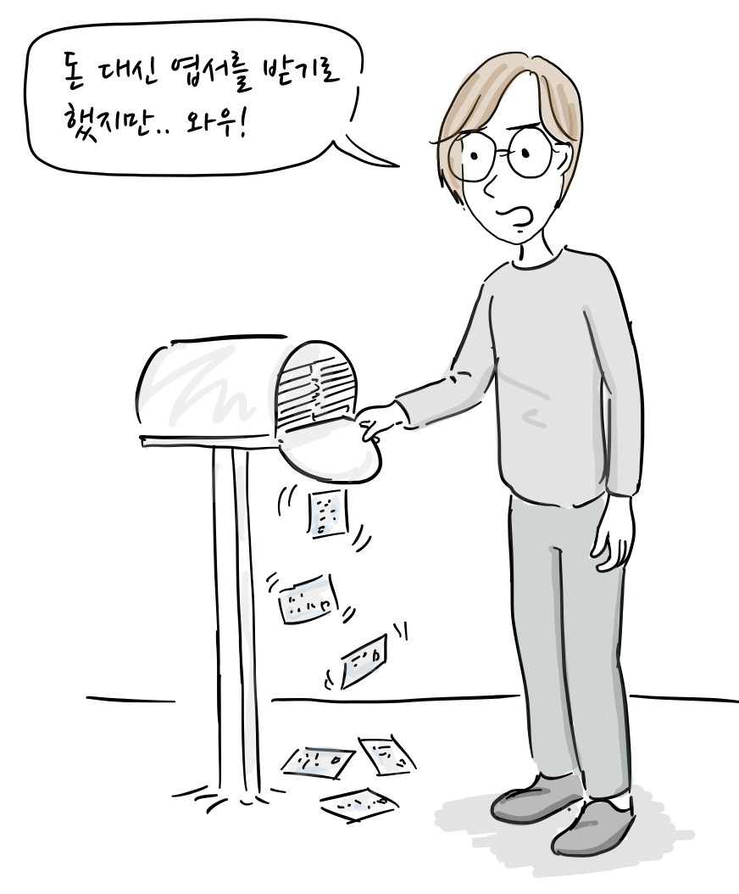
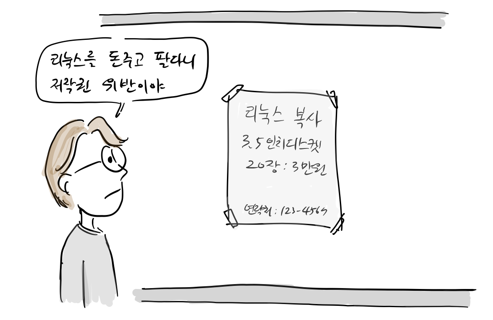
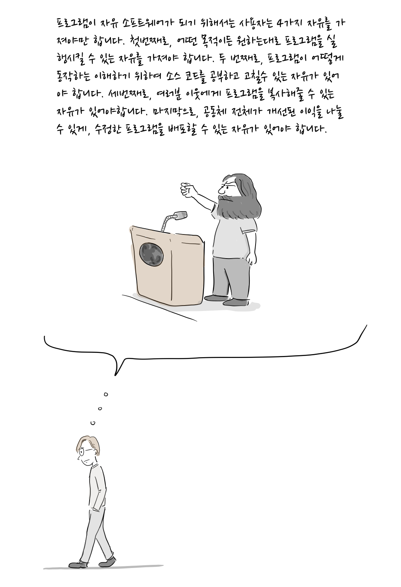
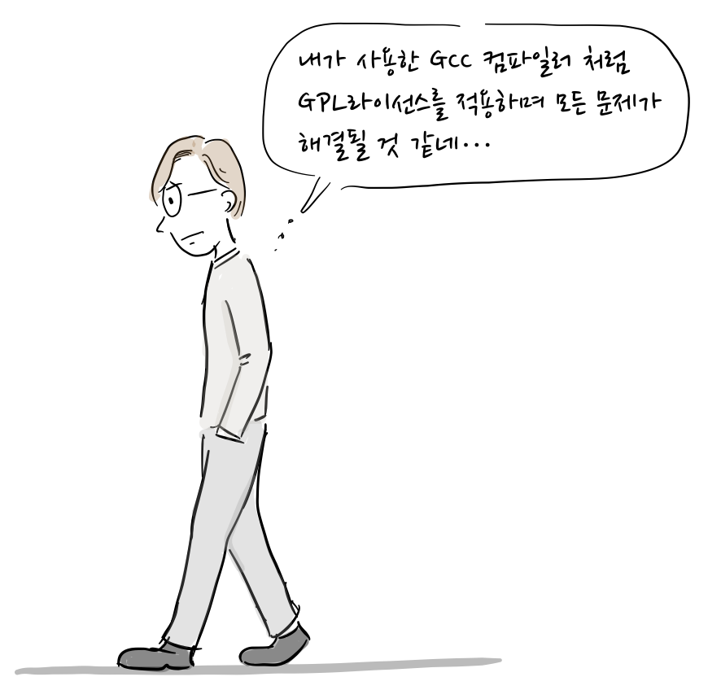
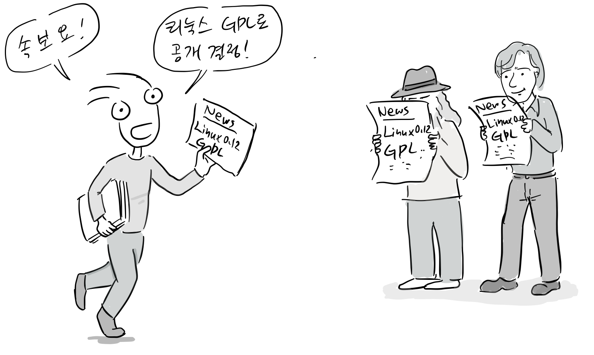
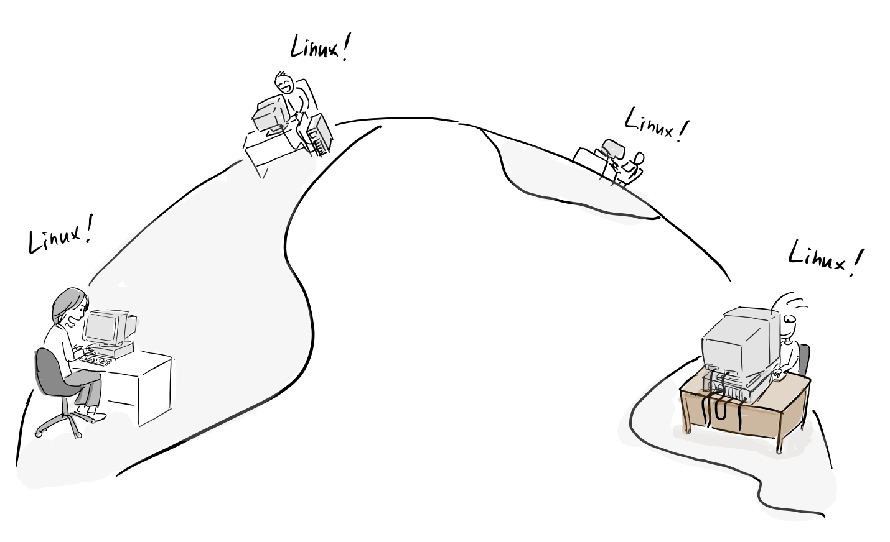
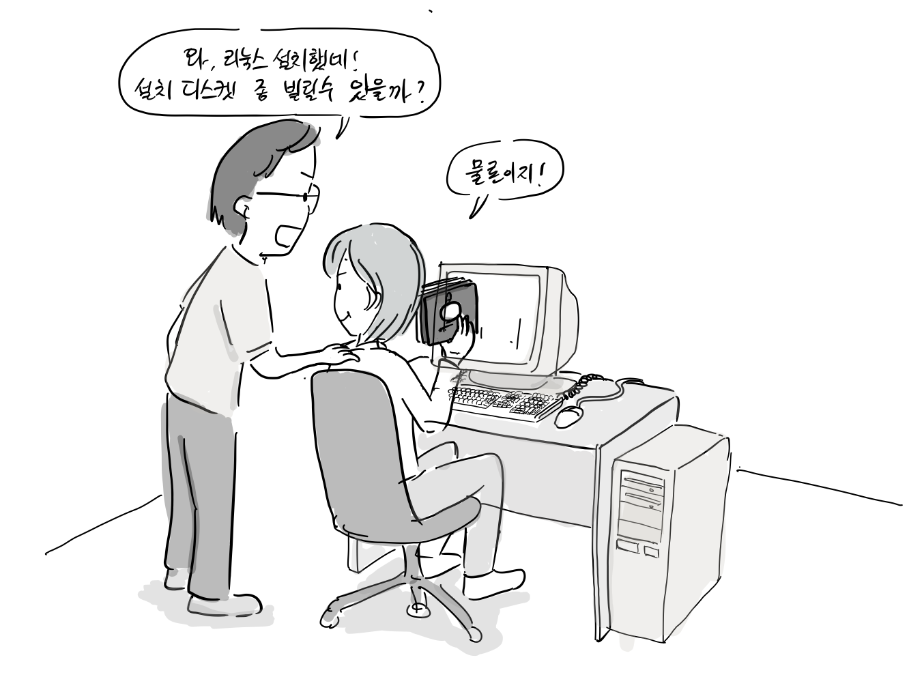

*“솔직히 리차드 스톨만의 연설을 들으며 내가 어떤 ‘빛’을 본 것은 아니었다. 하지만, 추측컨대 그의 연설을 듣는 가운데 무엇인가가 내 마음속을 파고들었던 것 같다. 훗날 내가 리눅스에 GPL을 적용한 걸 보면 말이다.”* – 리눅스 그냥 재미로(2001) / 리누스 토발즈

리눅스의 초기 라이선스는 간단했는데, 리눅스를 다른 사람에게 판매하지 않고, 코드를 향상 시키면 모든 사람이 볼 수 있도록 코드를 공개하는 조건이 전부였다.

리누스: 리눅스를 설치해본 사람들이 점점 늘고 있어.  
친구: 와~ 그거 돈주고 팔면 부자가 되겠는데.

리누스: 돈 대신 엽서만 받기로 했어.  
친구: 뭐라고?

“나도 다른 과학자들 처럼 내 업적을 사람들과 나누고 싶어. 사실, 우리 할아버지가 공산주의자라서.. 하하, 하여간, 난 리눅스를 팔고 싶지는 않고 다른 사용자들도 나와 생각이 같으면 좋겠어.”

“돈 대신 엽서를 받기로 했지만.. 와우!”

하지만, 일부 사람들은 돈을 받고 리눅스 디스켓을 복사해주기도 했다.

“리눅스를 돈주고 팔다니.. 저작권 위반이야.”

결국, 어떤 사람이 배포용 디스켓을 만들어 기본적인 비용만 받고 팔아도 되냐고 물어왔다.

소스 코드를 공개하고 다른 사람의 참여를 유도하는 것은 좋았지만, 누군가 리눅스 코드를 가져다가 자신들의 이름으로 커널을 상용화할 수도 있었다. 그렇다고 복사하는데 드는 비용만 받고 리눅스를 판매하는 것을 막는 것도 좋은 생각이 아니였다.

리차드 스톨만: 프로그램이 자유 소프트웨어가 되기 위해서는 사용자는 4가지 자유를 가져야만 합니다. 첫번째로, 어떤 목적이든 원하는대로 프로그램을 실행시킬 수 있는 자유를 가져야 합니다. 두 번째로, 프로그램이 어떻게 동작하는 이해하기 위하여 소스 코드를 공부하고 고칠수 있는 자유가 있어야 합니다. 세번째로, 여러분 이웃에게 프로그램을 복사해줄 수 있는 자유가 있어야합니다. 마지막으로, 공동체 전체가 개선된 이익을 나눌 수 있게, 수정한 프로그램을 배포할 수 있는 자유가 있어야 합니다.

“내가 사용한 GCC 컴파일러 처럼 GPL라이선스를 적용하며 모든 문제가 해결될 것 같네…”

“그래 리눅스에 GPL라이선스를 적용하자. 누군가 리눅스 코드를 가져다가 마음대로 상용화를 한다면 리눅스 해커들이 가만히 있지는 않을거야” 나야 돈버는데는 관심이 없지만 내 코드를 훔쳐가는 것은 반대니까..”

이제 누구나 GPL 라이선스만 지키면 누구나 리눅스를 상업적으로 판매할 수 있게 되었다. 대신 수정한 코드는 반드시 공개를 해야만 했다.

1992년 1월 첫주, 드디어 GPL 라이선스가 적용된 리눅스 0.12 릴리스 한다. 특히, 이 때 부터 미닉스에 없는 페이징 기능이 추가되었는데, 이는 미닉스와의 경쟁이 시작되었다는 신호탄이였다. 인터넷을 통해 리눅스는 빠르게 퍼져나갔고 사람들은 자신들이 소유한 인텔386 PC에 직접 리눅스를 설치해서 사용하기 시작했다.

드디어, 개인용 유닉스 호환 운영체제의 시대가 열리게 된 것이다.

이제 유닉스 사용자 모임에서 리눅스를 서로 복사하는 일은 흔한 일이 되었다

하지만, 그러던 어느날, 미닉스를 만든 앤드류 타넨바움이 미닉스 메일링 리스트에 리눅스에 관한 글을 올리게 된다.

다음에 계속…

**더 읽을 글**

-   [리눅스 그냥 재미로](http://www.aladin.co.kr/shop/wproduct.aspx?ItemId=274630), 한겨레 신문사 , 2001
-   Rebel Code, Glyn Moody, 2002
-   https://www.gnu.org/philosophy/nit-india.html

참고로, 등장 인물 간 대화도 자료를 바탕으로 만들어졌습니다.

만화에서 고치거나 추가할 내용이 있으면 [만화 원고](https://docs.google.com/document/d/1JfeBcgWZQQOvueOkyw_BPVIyMonAJs8qChgaUmcl5JY/edit?usp=sharing)에 직접 의견 주시고, 만화에 대한 후기는 블로그에 바로 답글로 남겨주세요. 다음 이야기는 리눅스 vs. 미닉스입니다.
