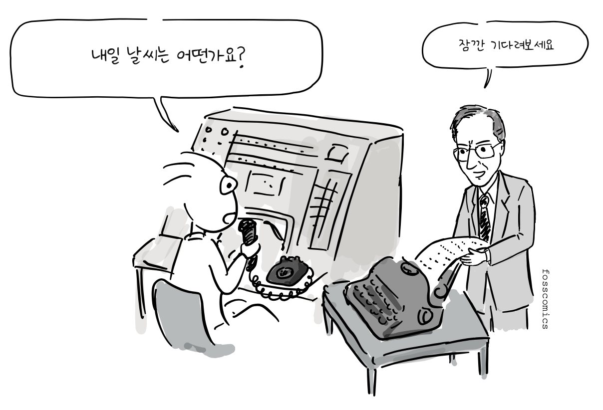
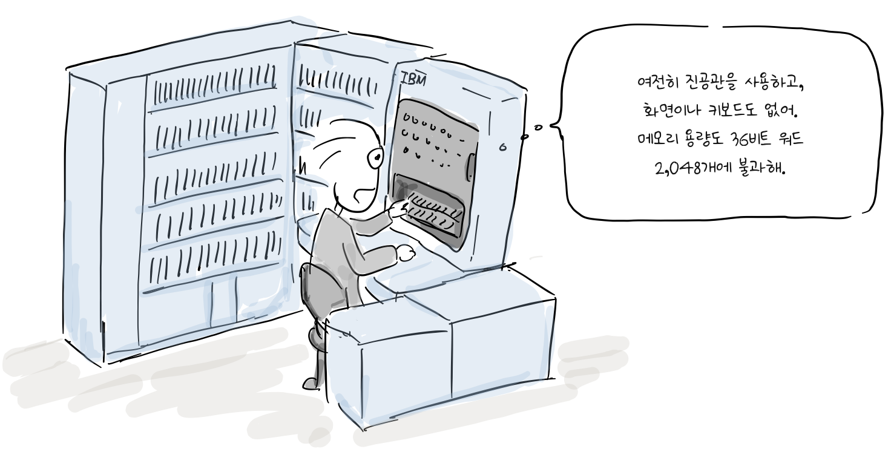
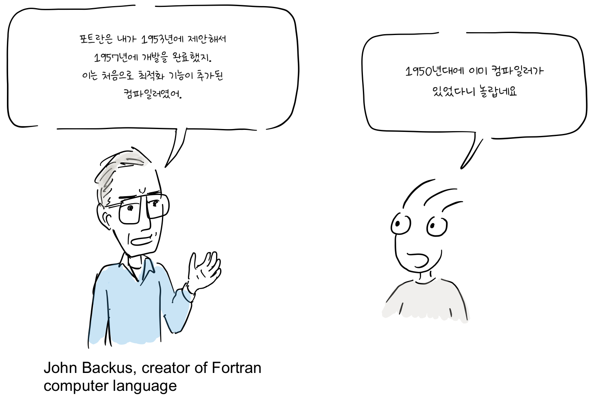
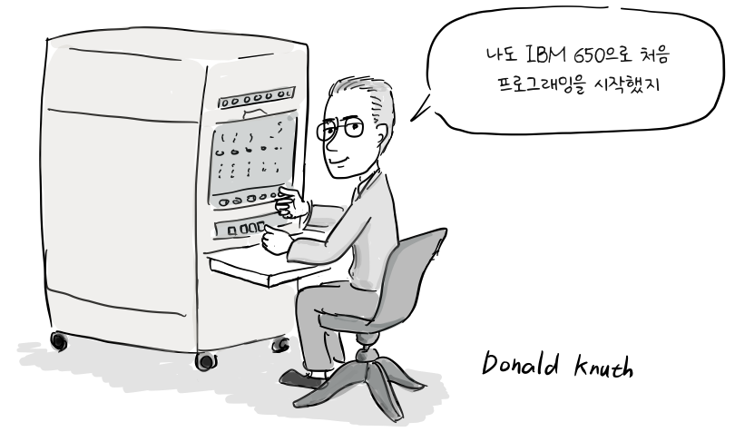

컴퓨터는 2차 대전 중에 본격적으로 개발되었고, 주로 군사적 목적으로 사용되기 시작했다. 독일군의 암호 해독, 포탄의 탄도 계산 등이 예이다.

> "포탄의 탄도 계산은 완료되었나요?" \
> "계산결과는 아직 안나왔어요."

전쟁이 끝난 뒤, 이 컴퓨터 개발에 참여한 엔지니어 중에서 일찍이 컴퓨터의 상업적 가능성을 미리 예측한 사람들도 있었는데, 컴퓨터가 정부 기관과 기업을 비롯한 민간 조직에도 유용할 수 있다고 생각했다.

> "에드박을 군이 아닌 다른 정부기관에도 팔 수 있지 않을까?" \
> "좋은 생각인데, 이번 기회에 회사를 만들면 어떨까요?"

에니악(ENIAC)과 [에드박(EDVAC)](https://ko.wikipedia.org/wiki/에드박) 개발팀의 주요 구성원이었던 J. 프레스퍼 에커트와 [존 모클리](https://ko.wikipedia.org/wiki/존_모클리)는 1946년 펜실베이니아 대학교를 떠나 일렉트로닉 컨트롤 컴퍼니(Electronic Control Company)를 설립했다. 1947년 12월에는 법인으로 전환하면서 회사 이름을 [에커트-모클리 컴퓨터 회사(EMCC: the Eckert-Mauchly Computer Corporation)](https://en.wikipedia.org/wiki/Eckert%E2%80%93Mauchly_Computer_Corporation)로 바꾸었다. 두 사람은 데이터 처리를 위한 범용 상업용 컴퓨터인 [유니박 I(UNIVAC I)](https://ko.wikipedia.org/wiki/유니박)을 개발했고, 첫 번째 유니박 I은 1951년 [미국 인구조사국](https://en.wikipedia.org/wiki/U.S._Census_Bureau)에 납품되었다.

> "내일 날씨는 어떤가요?" \
> "잠깐 기다려보세요"

회사는 이후 미 육군, 해군, 공군과의 계약을 통해 유니박을 공급할 예정이었다. 하지만 [매카시즘](https://ko.wikipedia.org/wiki/매카시즘) 시기에 일부 직원이 공산주의자로 의심받으면서 이 계약들은 결국 1950년에 취소되었다.

> “빨갱이가 군을 위해 컴퓨터를 만든다고?” \
> “그건 오해요. 우리 직원 중에 공산주의자는 없소”

모클리 역시 의심을 받아 회사를 떠나야 했고, 다시 업무에 복귀하는 데 2년이라는 시간이 걸렸다.

> “빨갱이 어서 꺼져!”

보안 문제만이 회사의 유일한 어려움은 아니었다. EMCC는 앞서 진행한 BINAC 프로젝트의 비용과 납품 기간을 과소평가했고, 유니박 개발에는 작은 회사가 쉽게 조달하기 어려운 자금이 필요했다. 자금이 부족하고 정부 사업 수주에도 어려움을 겪던 EMCC는 1950년 2월 [레밍턴 랜드](https://en.wikipedia.org/wiki/Remington_Rand)에 인수되었다[&lbrack;1&rbrack;][1][&lbrack;3&rbrack;][3]. 에커트와 모클리는 회사에 남았고, 레밍턴 랜드는 이듬해 첫 번째 유니박을 완성했다.

### 프로그램 내장식 설계의 공로는 누구에게 돌아가야 할까?

역사적 기록을 보면 일명 폰 노이만 컴퓨터 아키텍처를 어느 한 사람의 공으로만 돌리기에는 충분치 않다. 이 구조는 에커트와 모클리를 포함한 에니악 팀이 에드박을 개발하는 과정에서 나왔고, 존 폰 노이만도 컨설턴트로 기여를 했다. 그러나 널리 배포된 [「EDVAC에 관한 보고서 초안」(First Draft of a Report on the EDVAC)](https://en.wikipedia.org/wiki/First_Draft_of_a_Report_on_the_EDVAC)에 폰 노이만만이 저자로 기재되어 있었기 때문에, 오늘날에도 이 컴퓨터 구조를 폰 노이만 아키텍처라고 부르고 있다. 하지만 폰 노이만이 이 설계를 혼자 고안한 것은 아니며, 누구에게 공로를 돌려야 하는지는 여전히 논쟁거리다. 에커트와 모클리는 상업용 컴퓨팅 시대를 여는 데 기여했지만, 그들이 세운 회사는 재정적 어려움으로 다른 회사에 인수되었고 두 사람 모두 일반 대중에게 널리 알려지지 않았다. 또한 이들 공로에 대한 평가 역시 수십 년간의 특허 분쟁으로 당대에 평가받지 못했다.

1950년대에는 여러 회사에서 다양한 상업용 컴퓨터를 만들기 시작했다. 펀치 카드 장비 시장을 이미 지배하고 있던 IBM도 1952년 최초의 대형 전자식 컴퓨터인 [IBM 701](https://en.wikipedia.org/wiki/IBM_701)을 발표했다.

> “여전히 진공관을 사용하고, 화면이나 키보드도 없어. 메모리 용량도 36비트 워드 2,048개에 불과해.”

1954년에 발표된 후속 기종 [IBM 704](https://en.wikipedia.org/wiki/IBM_704)를 위해 [존 배커스](https://en.wikipedia.org/wiki/John_Backus)가 이끄는 IBM 팀은 [포트란](https://en.wikipedia.org/wiki/Fortran)을 개발했다. 포트란은 1953년에 제안되었고 첫 컴파일러는 1957년에 완성되었다. 고급 언어로 작성한 프로그램을 효율적인 기계어로 최적화하는 능력은 컴파일러의 실용성을 프로그래머들에게 입증했다[&lbrack;4&rbrack;][4]. 존 매카시는 1950년대 후반에 [LISP](https://en.wikipedia.org/wiki/Lisp_\(programming_language\))를 설계했고, 스티브 러셀은 IBM 704에서 작동하는 초기 구현을 만들었다.

> “포트란은 내가 1953년에 제안해서 1957년에 개발을 완료했지. 이는 처음으로 최적화 기능이 추가된 컴파일러였어.” \
> “1950년대에 이미 컴파일러가 있었다니 놀랍네요”

1953년 IBM은 [IBM 650](https://en.wikipedia.org/wiki/IBM_650)을 발표했고, 1954년에 첫 시스템을 납품했다. 흔히 최초로 대량 생산된 컴퓨터로 불리는 이 컴퓨터는 주기억장치로 회전식 자기 드럼을 사용했다. 자기 드럼은 당시 대형 컴퓨터에 사용되던 메모리보다 느렸지만 훨씬 저렴했기 때문에, IBM 650의 가격을 상대적으로 낮출 수 있었다. IBM은 결국 약 2,000대를 설치했으며, 그중 많은 수가 대학에 설치되어 학생들이 처음으로 프로그래밍을 접하는 데 사용되었다[&lbrack;5&rbrack;][5].

> “나도 IBM 650으로 처음 프로그래밍을 시작했지”

[컴퓨터 프로그래밍의 예술](https://ko.wikipedia.org/wiki/컴퓨터_프로그래밍의_예술)로 널리 알려진 [도널드 커누스](https://ko.wikipedia.org/wiki/도널드_커누스)도 케이스 공과대학 재학 중 IBM 650을 접하고 1956년부터 이 컴퓨터에서 프로그램을 작성하기 시작했다[&lbrack;2&rbrack;][2]. 1950년대 말에는 많은 회사가 상업용 컴퓨터를 생산하고 대학에서도 학생들에게 컴퓨터 사용법을 가르치면서 프로그래밍이 독립된 직업으로 자리 잡기 시작했다.

## 참고 자료

1. [존 모클리, 위키백과](https://ko.wikipedia.org/wiki/존_모클리)
2. [도널드 커누스의 첫 컴퓨터](http://www.catonmat.net/blog/donald-knuths-first-computer)
3. [에커트-모클리 컴퓨터 회사(EMCC), 미국 컴퓨터 역사 박물관](https://www.computerhistory.org/brochures/d-f/eckertmauchly-computer-corporation-emcc/)
4. [포트란, IBM 역사](https://www.ibm.com/history/fortran)
5. [IBM 650, IBM 역사](https://www.ibm.com/history/650)

[1]: https://ko.wikipedia.org/wiki/존_모클리 "존 모클리, 위키백과"
[2]: http://www.catonmat.net/blog/donald-knuths-first-computer "도널드 커누스의 첫 컴퓨터"
[3]: https://www.computerhistory.org/brochures/d-f/eckertmauchly-computer-corporation-emcc/ "에커트-모클리 컴퓨터 회사(EMCC), 미국 컴퓨터 역사 박물관"
[4]: https://www.ibm.com/history/fortran "포트란, IBM 역사"
[5]: https://www.ibm.com/history/650 "IBM 650, IBM 역사"

### 더 읽을 글

- [초기 컴퓨터의 진화](http://blog.lgcns.com/1042), LG CNS 블로그