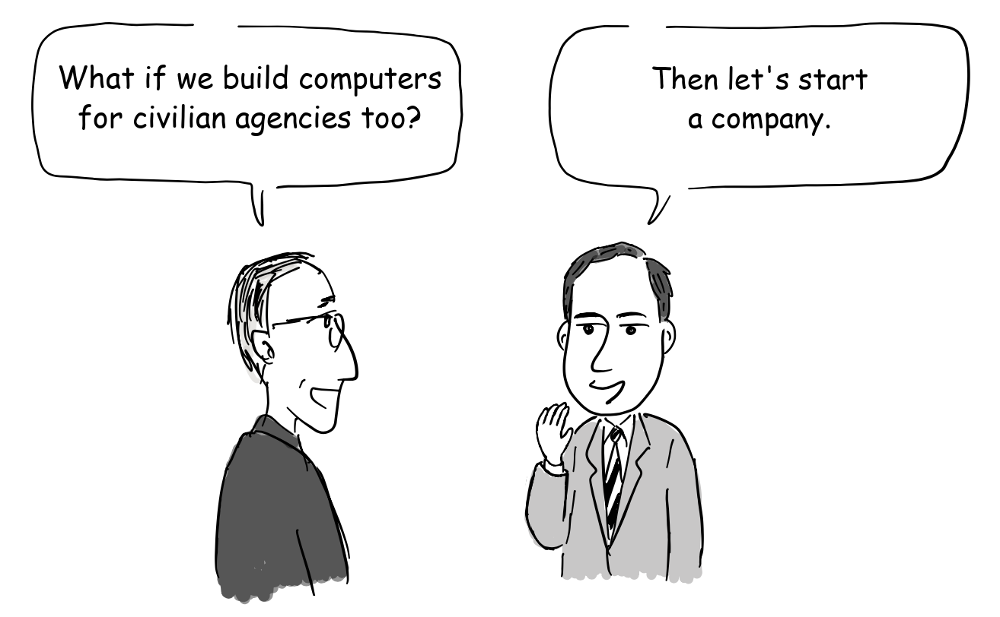
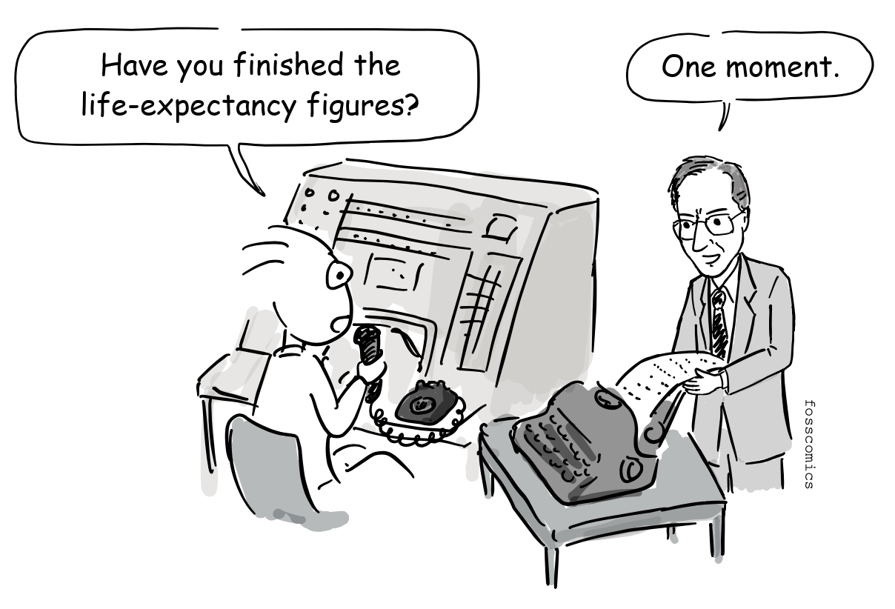
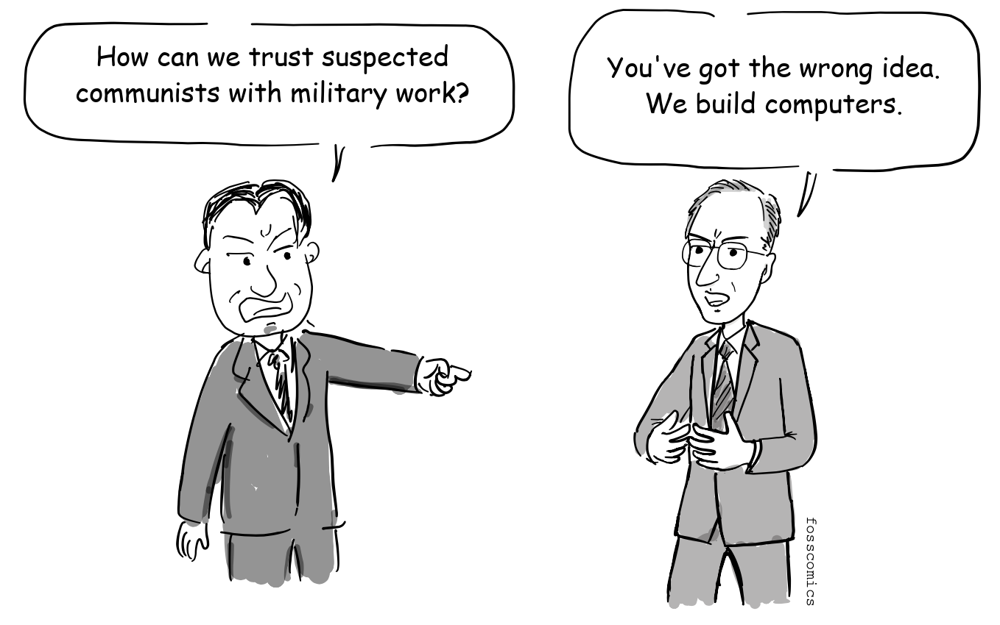
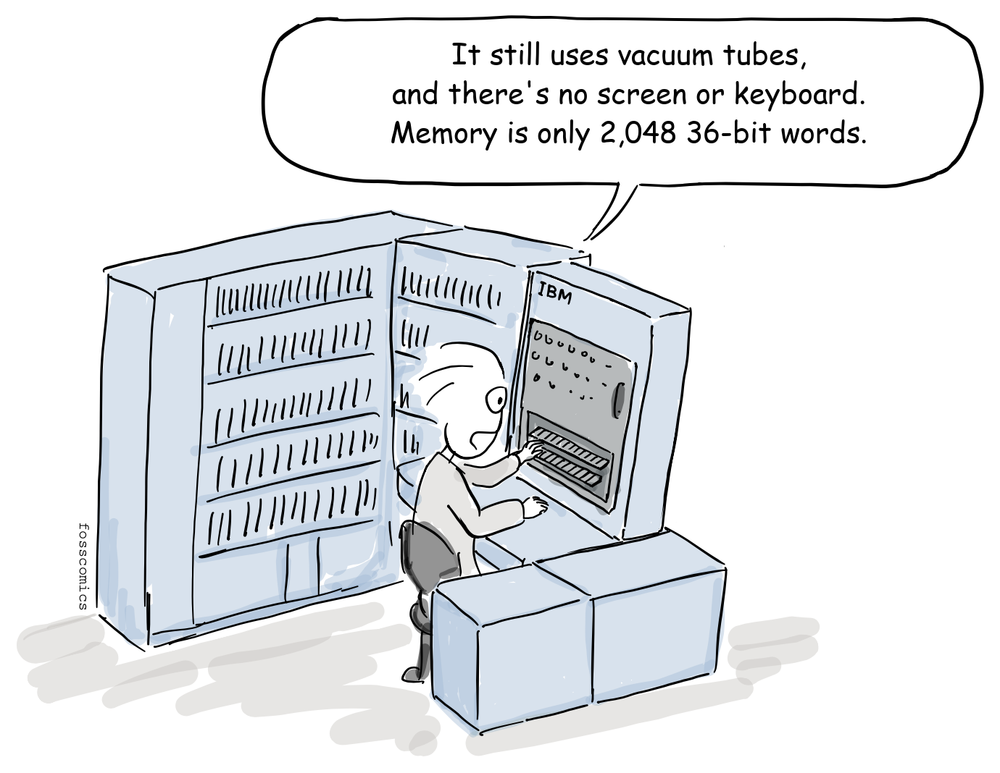
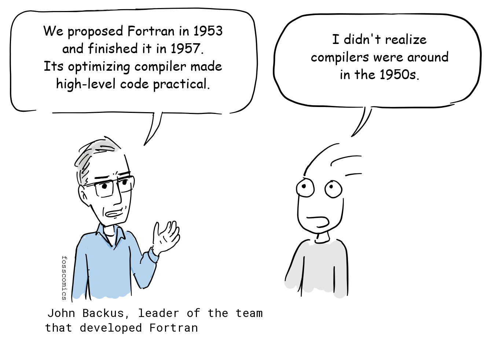
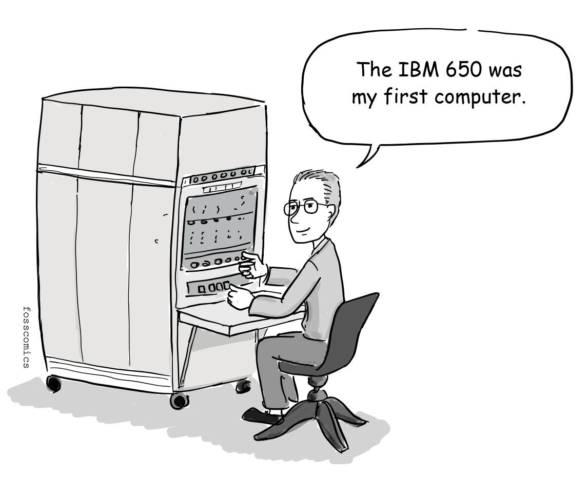

Electronic computing advanced rapidly during World War II, driven partly by military needs such as breaking German ciphers and calculating artillery firing tables. After the war, some of the engineers who had built these machines began to see that computers could also be useful to government agencies, businesses, and other civilian organizations.

> "Are the firing-table calculations ready?" \
> "Not yet."

Some of the early computer engineers who recognized the commercial potential of computers were J. Presper Eckert and John Mauchly.

> "What if we build computers for civilian agencies too?" \
> "Then let's start a company."

In 1946, Eckert and Mauchly, leading members of the ENIAC and EDVAC teams, left the University of Pennsylvania and founded the Electronic Control Company. In December 1947, they incorporated and renamed the business [the Eckert-Mauchly Computer Corporation (EMCC)](https://en.wikipedia.org/wiki/Eckert%E2%80%93Mauchly_Computer_Corporation). They developed UNIVAC I, a general-purpose commercial computer designed for data processing. The first UNIVAC I was delivered to the [U.S. Census Bureau](https://en.wikipedia.org/wiki/U.S._Census_Bureau) in 1951.

> "Have you finished the life-expectancy figures?" \
> "One moment."

The company was then expected to supply UNIVAC via contracts with the Army, Navy, and Air Force.  However, those contracts were eventually cancelled in 1950 after some employees were suspected as communists during the [McCarthy](https://en.wikipedia.org/wiki/McCarthyism) era.
Mauchly was also suspected and forced to leave the company, and it took him two years to get back to work. 

> "How can we trust suspected communists with military work?" \
> "You've got the wrong idea. We build computers."

The security dispute was not the company's only problem. EMCC had underestimated the cost and delivery time of its earlier BINAC project, and developing UNIVAC required more money than the small company could readily raise. Short of cash and struggling to secure government work, EMCC was acquired by [Remington Rand](https://en.wikipedia.org/wiki/Remington_Rand) in February 1950[&lbrack;1&rbrack;][1][&lbrack;3&rbrack;][3]. Eckert and Mauchly remained with the business, and Remington Rand completed the first UNIVAC the following year.

> "Get the Reds out!"

## Who should receive credit for the stored-program design?

The historical record does not support attributing the architecture to any one person. It grew out of collaborative work on EDVAC by the ENIAC team, including Eckert and Mauchly, with important contributions from John von Neumann. However, because the widely circulated [First Draft of a Report on the EDVAC](https://en.wikipedia.org/wiki/First_Draft_of_a_Report_on_the_EDVAC) listed only von Neumann as its author, we still call this computer architecture the von Neumann architecture, even though he did not devise the design entirely on his own and the allocation of credit remains controversial. Eckert and Mauchly helped usher in the era of commercial computing, but their company was not financially successful, neither man became widely known to the general public, and recognition of their contributions was complicated by decades of disputes over patents and historical credit.

Commercial computer production expanded during the 1950s. IBM, already dominant in [punched-card](https://en.wikipedia.org/wiki/Punched_card%23IBM_punched_card_manufacturing) equipment, announced its first large-scale electronic computer, the [IBM 701](https://en.wikipedia.org/wiki/IBM_701), in 1952.

> "It still uses vacuum tubes, and there's no screen or keyboard. Memory is only 2,048 36-bit words."

For the [IBM 704](https://en.wikipedia.org/wiki/IBM_704), announced in 1954, [John Backus](https://en.wikipedia.org/wiki/John_Backus) led the IBM team that developed [Fortran](https://en.wikipedia.org/wiki/Fortran). The language was proposed in 1953, and its first compiler was delivered in 1957. Its ability to optimize high-level programs helped convince programmers that a compiler could produce efficient machine code[&lbrack;4&rbrack;][4]. John McCarthy designed [Lisp](https://en.wikipedia.org/wiki/Lisp_(programming_language)) later in the decade, and Steve Russell created an early working implementation on an IBM 704.

> "We proposed Fortran in 1953 and finished it in 1957. Its optimizing compiler made high-level code practical." \
> "I didn't realize compilers were around in the 1950s."

IBM announced the [IBM 650](https://en.wikipedia.org/wiki/IBM_650) in 1953 and delivered the first systems in 1954. Often described as the first mass-produced computer, it used a rotating magnetic drum as main memory. The drum was less expensive than the faster memory technologies used in larger machines, helping make the IBM 650 comparatively affordable. IBM eventually installed nearly 2,000 systems and placed many at universities, where students first encountered programming[&lbrack;5&rbrack;][5].

> "The IBM 650 was my first computer."

Donald Knuth, later known for [The Art of Computer Programming](https://en.wikipedia.org/wiki/The_Art_of_Computer_Programming), encountered an IBM 650 as a student at Case Institute of Technology and began writing programs for it in 1956[&lbrack;2&rbrack;][2]. By the late 1950s, many companies were producing commercial computers, universities were teaching students to use them, and programming was emerging as a distinct profession.

## References

1. John Mauchly, [wikipedia](https://en.wikipedia.org/wiki/John_Mauchly)
2. Donald Knuth's First Computer, [blog](http://www.catonmat.net/blog/donald-knuths-first-computer)
3. [Eckert-Mauchly Computer Corporation (EMCC), Computer History Museum](https://www.computerhistory.org/brochures/d-f/eckertmauchly-computer-corporation-emcc/)
4. [Fortran, IBM History](https://www.ibm.com/history/fortran)
5. [The IBM 650, IBM History](https://www.ibm.com/history/650)

[1]: https://en.wikipedia.org/wiki/John_Mauchly "John Mauchly, wikipedia"

[2]: http://www.catonmat.net/blog/donald-knuths-first-computer "Donald Knuth's First Computer"

[3]: https://www.computerhistory.org/brochures/d-f/eckertmauchly-computer-corporation-emcc/ "Eckert-Mauchly Computer Corporation (EMCC), Computer History Museum"

[4]: https://www.ibm.com/history/fortran "Fortran, IBM History"

[5]: https://www.ibm.com/history/650 "The IBM 650, IBM History"