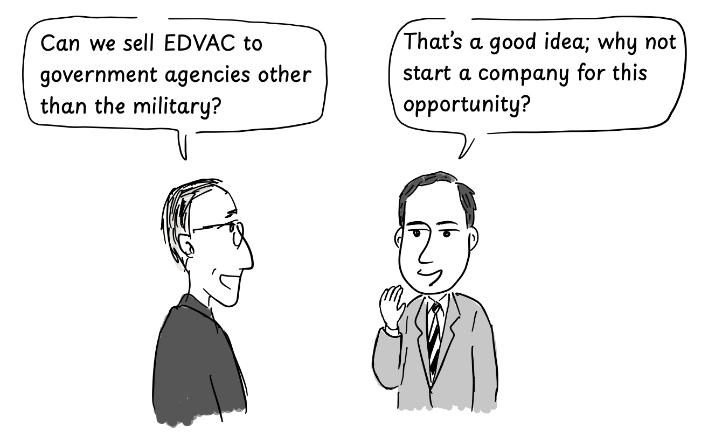

The computer was developed in earnest during World War II and was mainly used for military purposes: breaking German ciphers and calculating the ballistic range of missiles.

> "Has the ballistics calculation been completed?" \
> "I have not gotten the results yet."

Some engineers involved in early computer development had predicted the commercial potential of computers earlier.

> "Can we sell EDVAC to government agencies other than the military?" \
> "That’s a good idea; why not start a company for this opportunity?"

In 1947, John Eckert and John Mauchly, who developed ENIAC and EDVAC, founded the world's first computer manufacturing company called [the Eckert-Mauchly Computer Corporation (EMCC)](https://en.wikipedia.org/wiki/Eckert%E2%80%93Mauchly_Computer_Corporation). After that, they developed UNIVAC, the newer version of EDVAC, and delivered it to the [U.S. Census Bureau](https://en.wikipedia.org/wiki/U.S._Census_Bureau),

> “Are you getting the average life expectancy?”
> “Wait a minute.”

The company was then expected to supply UNIVAC via contracts with the Army, Navy, and Air Force.  However, those contracts were eventually cancelled in 1950 after some employees were suspected as communists during the [McCarthy](https://en.wikipedia.org/wiki/McCarthyism) era.

> “How do communists develop a computer for the US military?” \
> “That’s a misunderstanding. We do not have any communist employees."

Mauchly was also suspected and forced to leave the company, and it took him two years to get back to work. In the meantime, the company was in financial difficulty and it was eventually sold to [Remington Rand](https://en.wikipedia.org/wiki/Remington_Rand) in early 1950[&lbrack;1&rbrack;][1].

> “Get Bolsheviks out!”

In fact, the idea for the von Neumann architecture was initiated by Mockley and Eckert, but their credits were removed from von Neumann's paper, [First Draft of a Report on the EDVAC](https://en.wikipedia.org/wiki/First_Draft_of_a_Report_on_the_EDVAC), dated June 30, 1945. Their business was not successful, also due to political reasons.

In the 1950s, a number of companies began to make commercial computers. IBM produced [punch card](https://en.wikipedia.org/wiki/Punched_card%23IBM_punched_card_manufacturing) systems and also released its first computer, the [IBM 701](https://en.wikipedia.org/wiki/IBM_701), in 1952.

> “Hmm, this machine is still using vacuum tubes and doesn’t have a monitor and keyboard yet. The memory size is only 36 bits x 2048.”

In particular, IBM developed the [Fortran ](https://en.wikipedia.org/wiki/Fortran)and [LISP](https://en.wikipedia.org/wiki/Lisp_\(programming_language\)) computer languages for its successor, the [IBM 704](https://en.wikipedia.org/wiki/IBM_704), released in 1954.

> “I proposed Fortran in 1953 and completed its development in 1957. This was the first [compiler](https://en.wikipedia.org/wiki/Compiler) with optimization.” \
“I was surprised to learn that there were compilers in the 1950s.”

Note: [John Backus](https://en.wikipedia.org/wiki/John_Backus) is the creator of Fortran computer language.

In 1953, IBM introduced the [IBM 650](https://en.wikipedia.org/wiki/IBM_650) computer, the first mass-produced computer. This computer used magnetic drums to store programs, which provided a faster access time than [drum-based storage devices](https://en.wikipedia.org/wiki/Drum_memory). This model was relatively inexpensive and became popular in universities, so many students started to learn computer programming with this machine.

> “I also started computer programming with IBM 650 for the first time.”

Professor Donald Knuth, widely known for his book series, [The Art of Computer Programming](https://en.wikipedia.org/wiki/The_Art_of_Computer_Programming), first learned computer programming with the IBM 650[&lbrack;2&rbrack;][2]. After this, a number of companies began to make commercial computers In the 1950s, and software engineers first made their appearance.

## References

1. John Mauchly, [wikipedia](https://en.wikipedia.org/wiki/John_Mauchly)
2. Donald Knuth's First Computer, [blog](http://www.catonmat.net/blog/donald-knuths-first-computer)

[1]: https://en.wikipedia.org/wiki/John_Mauchly "John Mauchly, wikipedia"

[2]: http://www.catonmat.net/blog/donald-knuths-first-computer "Donald Knuth's First Computer"