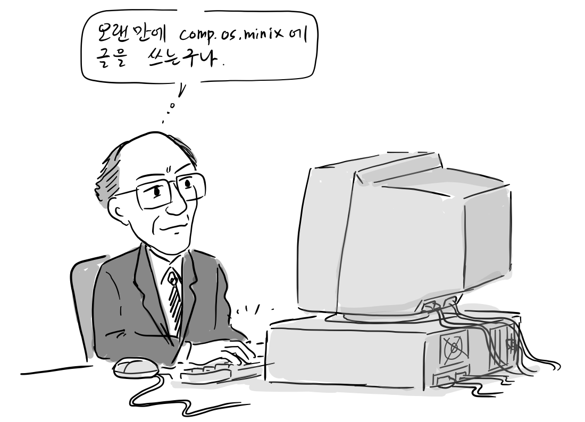
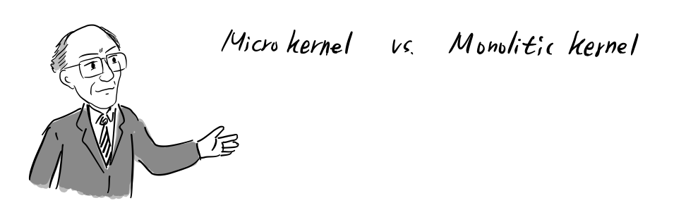
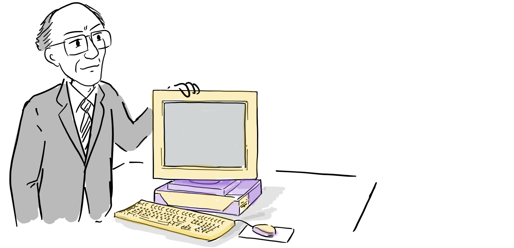
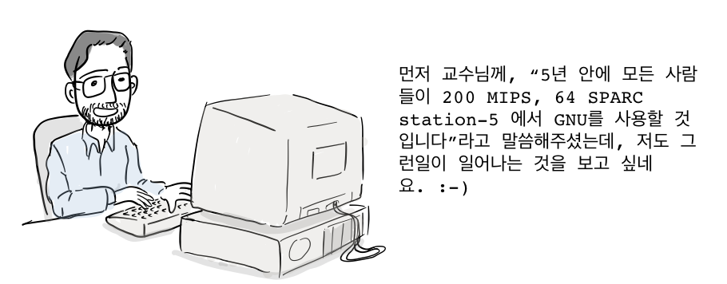

“그런데, 최근에 페이징 메모리도 지원하고 여러 사람이 개발에 참여하면서 인기가 많아요.”  
“너희들이 잘 모르는데, 리눅스는 모노리식 커널이란다. 이는 오래된 기술이다. 미래의 운영체제는 미닉스와 같은 마이크로 커널 디자인을 가질 것이다. 그러니, 리눅스에 대한 관심은 끊는 것이 좋다.”

  
“음.. 사람들이 이런 커널에 관심을 갖는 것은 학문적으로 좋지 않아. 아무래도 모노리식 커널에 대하여 한마디 해야겠어.”

리누스와 타넨바움 교수는 커널 디자인에 관한 논쟁을 메일링 리스트(comp.os.minix)통해 주고 받기 시작했고, 전세계 여러 사람이 이 논쟁에 참여했습니다.다.

참고: 메일 내용을 대화식으로 간단하게 구성했습니다. 메일링 리스트에 올라온 모든 글은 [여기](https://www.oreilly.com/openbook/opensources/book/appa.html)를 참고하세요.

  
아시다시피, 저에게 미닉스는 책 쓰는 일이 지루하고 CNN TV에서 전쟁이나 혁명 또는 의회 청문회를 방송하지 않는 저녁에나 하는 취미입니다. 저의 실제 직업은 운영체제 분야를 연구하는 교수입니다.

교수님은 미닉스를 취미로 개발하신다고 하셨는데, 누가 미닉스로 돈을 벌고 누가 무료로 리눅스를 쓰게 하는지 보세요. 그리고 나서 취미에 관해 이야기하세요. 미닉스를 자유롭게 사용할 수 있도록 해주시다면, 제가 가진 큰 고민은 사라질 것입니다. 그리고 교수라는 직업이 미닉스가 가진 한계에 대한 변명이 될 수는 없습니다.

  
미닉스의 한계는 부분적으로 제가 교수인 것과 최소한 관련이 있습니다. 즉, 미닉스의 설계 목표 중 하나는 학생들이 구입할 수 있는 저렴한 하드웨어에서도 실행 가능하게 하는 것입니다. 이러한 노력으로, 미닉스는 하드디스크가 없는 4.77 MHZ PC에서도 동작했습니다. 그렇다보니 보니 기능적으로 한계를 갖고 있습니다. 어쨌든, 운영체제 교수로서 리눅스에 관해 두가지 관점을 가지고 이야기해보려고 합니다.

  
먼저 리눅스가 모노리식 커널 디자인을 갖고 있는 부분을 지적하고 싶군요. 대부분의 과거 운영체제는 리눅스와 마찬가지로 모노리식 디자인을 갖는데, 이는 운영체제 전체가 하나의 a.out 파일로 이루어져 있고 ‘커널 모드’에서 실행됩니다. 이 바이너리는 프로세스 관리, 메모리 관리, 파일 시스템과 나머지 기능을 포함하고 있습니다. 그러한 시스템의 예로는 UNIX, MS-DOS, VMS, MVS, OS/360, MULTICS 등이 있습니다.

그 대안인 마이크로 커널 기반 시스템은 OS의 대부분 기능이 커널이 아닌 개별적인 사용자 프로세스로 실행됩니다. 또한 메시지 전달을 통해 서로 통신합니다. 이 커널의 임무는 메시지 전달, 인터럽트 핸들링, 저수준 프로세스 관리이며, I/O를 포함할 수도 있습니다. 그 예로, RC4000, Amoeba, Chorus, Mach가 있으며 윈도우NT는 아직 출시가 되지 않았습니다.

미닉스는 마이크로 커널에 기반을 둔 시스템입니다. 파일 시스템과 메모리 관리는 분리된 프로세스로 커널 밖에서 실행됩니다. I/O 드라이버 역시 개별적인 프로세스로 수행됩니다. 하지만, 리눅스는 모노리식 스타일의 시스템입니다. 이는 1970년대로 퇴보하는 것으로 마치 C로 된 프로그램을 베이직으로 다시 작성하는 것과 다를 바가 없습니다.

  
사실, [GNU 커널(Hurd)](https://www.gnu.org/software/hurd/hurd.html)이 지난 봄에 준비가 되었다면, 제가 귀찮게 리눅스를 시작할 필요도 없었겠죠. 하지만, 아쉽게도 GNU 커널은 아직까지 존재하지 않고, 리눅스는 현재 사용 가능한 것만으로도 많은 것을 얻고 있습니다. 마이크로 커널이 커널 장점에 대한 유일한 기준이라면, 교수님의 의견이 맞지만, 먼저 미닉스가 마이크로 커널로서 제대로 동작하지 않고 있으며 멀티태스킹에 문제가 있다고 언급하셔야했습니다. 제가 교수님처럼 멀티스레딩에 문제가 있는 파일시스템을 만들었다면, 다른 사람들을 그렇게 쉽게 비난하지는 못했을 겁니다.

  
여러 사용자를 지원할 만큼 충분히 빠른 머신에서는, 아마도 캐시 히트율을 유지하는 충분한 버퍼 캐시를 가졌을 것이고, 이 경우도 멀티스레딩은 아무 장점이 없습니다. 오직 여러 프로세스가 실제로 디스크I/O를 수행할 때만 유효하다고 할 수 있습니다. 이 경우 시스템을 더욱 복잡하게 만들 가치가 있는가에 대해서는 적어도 논쟁의 여지가 있습니다.

어찌되었던 1991년 현재, 아직도 커널을 모노리식 시스템으로 설계하는 것이 근본적인 오류라는 점을 고수합니다. 리누스님이 제 학생이 아닌 것이 고마운 일이네요. 그러한 설계로는 아마도 좋은 학점을 받지 못할 것입니다 🙂

  
이식성에 관한 것입니다. 오래전에 [인텔 4004 CPU](https://en.wikipedia.org/wiki/Intel_4004)가 있었습니다. 이 CPU는 [8086](https://ko.wikipedia.org/wiki/%EC%9D%B8%ED%85%94_8086), [80286](https://ko.wikipedia.org/wiki/%EC%9D%B8%ED%85%94_80286)을 거쳐 [80386](https://ko.wikipedia.org/wiki/%EC%9D%B8%ED%85%94_80386)과 [80486](https://ko.wikipedia.org/wiki/%EC%9D%B8%ED%85%94_80486)까지 개발되었습니다. 그리고 앞으로 세대가 계속되겠죠. 그 사이 RISC 칩이 나왔는데, 일부는 100 MIPS이상에서 실행됩니다. 앞으로 RISC칩은 점차적으로 80×86 라인을 대체할 것이고, 소프트웨적으로 80386을 에뮬레이션해서 오래된 MS-DOS 프로그램을 실행할 것입니다. 저는 이미 C로 IBM-PC 시뮬레이터를 작성했습니다. 그러므로, 리눅스 처럼 하나의 아키텍처만을 위해 OS를 설계하는 것은 심각한 오류라고 생각합니다. 왜냐하면 그 아키텍처가 오랫동안 존재하기는 어려우니까요. 반면, 미닉스는 이식성을 충분히 염두에 두고 설계했으며 인텔 CPU 계열부터 [모토롤라 680×0](https://en.wikipedia.org/wiki/Motorola_68000_series)(Atari, Amiga, Macintosh), [SPARC](https://ko.wikipedia.org/wiki/SPARC), [NS32016](https://en.wikipedia.org/wiki/NS320xx)에 포팅되었습니다. 하지만, 리눅스는 80×86에 아주 가깝게 묶여 있는데, 이는 가서는 안될 길입니다.(ast@cs.vu.nl)

리눅스에서는 다른 OS 커널보다 386 기능을 많이 사용합니다. 물론 이는 커널의 이식성을 떨어뜨리지만 설계를 훨씬 단순화시킵니다. 여기에는 각각 장단점이 있지만, 이것이 리눅스를 정상에 설수 있게 한 이유 중 하나입니다. 또한, 소스를 공개했기에 누구나 그 코드를 이식할 수 있습니다. 결코 쉬운 일은 아니지만 말입니다. (torvalds@klaava.Helsinki.FI)

정확한 숫자를 갖고 있는 것은 아니지만, 제 추축으로 현재 존재하는 6천만 대의 PC중 8088/286/680×0와 비교하면 386/486의 비중은 작습니다. 학생들 사이에는 그 숫자가 더 작습니다. 제일 좋은 하드웨어를 살 돈이 있는 사람들만을 위해 소프트웨어를 무료로 만드는 것은 재미있는 생각입니다. 물론, 지금부터 5년후에는 달라질 것입니다. 아마도 모든 이들은 200 MIPS, 64 [SPARC station-5](https://en.wikipedia.org/wiki/SPARCstation_5) 에서 자유 운영체제인 GNU를 사용할 것입니다.

제 요점은 하드웨어의 특정 부분이, 특히 인텔 계열과 같이 이상한 하드웨어와 밀접하게 연관된 새로운 운영체제를 개발하는 것이 기본적으로 잘못되었다는 것입니다. OS 자체는 새로운 하드웨어 플랫폼에 쉽게 포팅될 수 있어야 합니다. 1991년에 386에서만 실행되는 새로운 OS를 작성한다면, 이번 학기에 두 번째 ‘F’를 줄 것입니다. 다만 기말 시험을 잘 본다면 이 과목은 통과 할수 있습니다.(ast@cs.vu.nl)

  
대부분의 사용자는 자신이 사용하는 운영체제 내부가 낡은 것인지 거의 신경을 쓰지 않아요. 오히려 사용자 수준에서 성능과 기능성에 더 관심을 갖고 있습니다. 저는 마이크로 커널이 아마도 미래의 물결이 될 수 있다고 대체로는 동의할겁니다. 그렇지만, 개인적인 의견으로는 모노리식 커널이 구현이 쉽다고 봅니다. 물론, 모놀리식 커널을 수정하다 보면, 금새 쉽게 복잡해지지요 (kt4@prism.gatech.EDU)

  
켄 톰프슨님은 그러한 종류의 노력을 할 때 어떤 부류의 함정에 마주치나요? 그리고 그러한 문제를 다루는데 어떤 조언을 할 수 있나요?

제가 묻고자 하는것은 다음과 같습니다. 커널 자체가 모놀리식이지만 커널에 대한 대부분의 변경 사항이 범위내에 국한되도록 소스를 구성하는 것이 얼마나 어렵습니까?  
저는 켄 톰프슨님이 모노리식 커널에 수년간의 경험이 있다고 알고 있습니다. 🙂 따라서 이런 질문에 답할 때, 켄 톰프슨님이 최고의 답을 갖고 있으리라 생각합니다. (kevin@taronga.taronga.com)

우선, 교수님께서 리눅스가 특정 아키텍쳐에 최적화된 부분이 문제라고 지적하셨는데, 사실 리눅스에서 80×86에 최적화된 부분은 커널과 디바이스 드라이버입니다. 제가 보기에 리눅스가 GNU 소프트웨어를 돌리기 위한 임시방편 일지라도, 가장 많이 사용하는 CPU 아키텍처에 리눅스 커널을 최적화하는 것은 여전히 가치가 있습니다.

물론, OS 자체는 새로운 플랫폼에 쉽게 이식할 수 있어야 합니다. 사실, 리눅스에서 포팅하기 어려운 부분은 커널과 디바이스 드라이버 뿐입니다. 컴파일러, 유틸리티, 윈도우 시스템과 비교하면 이는 매우 작은 노력의 일부분에 불과합니다. 저는 리눅스로 버클리 대학, 자유소프트웨재단, 카네기 멜론 대학 등에서 개발된 소프트웨어를 사용할 수 있게 되어 개인적으로 무척 고맙게 생각하고 있습니다. 2∼3년 안에 무지 저렴한 BSD 또는 GNU Hurd가 확산되면 리눅스는 별로 쓸모가 없게 될 수 있지만, 지금 당장 리눅스를 사용하면 gcc, bison, bash와 같은 도구를 사용하는데 드는 비용을 줄일 수 있기 때문에, 이러한 운영체제 개발은 유용합니다. ([rburns@finess.Corp.Sun.COM](mailto:rburns@finess.Corp.Sun.COM))

  
이때문에, 미닉스가 강력한 이식성을 갖게 되었고, 결국, 교수님은 유닉스를 실행하도록 설계하지 않은 머신도 지원하였습니다. 그 결과, 미닉스는 페이징과 같은 기능을 갖도록 쉽게 확장될 수 없습니다. 심지어 페이징을 지원하는 머신에서도 마찬가지입니다. “미닉스는 포팅하기 쉽다”라는 말도 맞지만, 이는 “어떤 기능도 사용하지 말것”이라고 다시 이야기할 수 있습니다. 물론 미닉스의 그런 정책 역시 여전히 옳은 방향입니다.

말이 길어졌네요. 하지만, 멀티스레딩 파일 시스템에 대한 이야기도 하려고 합니다. 교수님께서 멀티스레딩 파일 시스템은 성능을 올리기 위한 해킹에 불과하다고 하셨는데, 이는 사실이 아닙니다. 즉, 마이크로 커널에서는 성능상의 해킹이지만, 모노리식 형태로 커널을 구현할때는 자동적으로 되는 기능입니다. 그리고 제가 개인적으로 보낸 메일에서 언급했듯이, 마이크로 커널에서는 잘 안되는 부분 중 하나입니다. 유닉스를 ‘구식’으로 제작하면, 자동적으로 멀티스레딩 커널을 얻게 됩니다. 모든 프로세스가 자기가 소유한 작업을 스스로 처리하므로, 여러분께서는 커널이 효율적으로 동작하도록 메시지 큐와 같은 조잡한 것을 만들 필요가 없습니다.  
게다가 ‘오직 성능상의 해킹’이 중요하다고 생각하는 사람들이 있습니다. 여러분이 cray-3 을 다루지 않는 한, 저는 모든 사람들이 늘 컴퓨터 앞에서 기다리는데 지쳐 있다고 생각합니다. 저도 미닉스 앞에서도 기다렸고, 물론, 리눅스에서도 마찬가지이지만, 훨씬 낫습니다. (torvalds@klaava.Helsinki.FI)

  
제 생각에 교수님이 한가지 중요한 점을 놓치고 있습니다. 미닉스가 교수님께 취미인 것 처럼, 모두는 아니지만, 많은 사람들이 리눅스에 참여하는 것도 사실입니다. 물론, 우리가 운영체제 시장을 장악하기 위해 리눅스를 만드는 것이 아닙니다. 그냥 즐거운 시간을 보내는 거죠.

교수님 말대로 미닉스는 이식성을 고려했고 많은 머신에 포팅이 되었습니다. 그래서 그러한 머신을 갖고 있는 사람들에게는 미닉스가 좋겠지만, 공짜 점심은 없습니다. 미닉스는 386 일부 성능과 몇가지 기능을 희생에서 그러한 이식성을 얻었습니다.

먼저 우리는 리눅스가 가야할 길이 아니라고 결정하기 전에, 리눅스가 어떻게 사용될 것인지를 생각해야 합니다. 저는 제 486에서 메모리 및 연산이 많이 필요한 그래픽 프로그램을 실행하는데 이를 사용할 것입니다. 저에게 있어서, 속도와 메모리는 최첨단 기술이나 이식성 보다 중요합니다.

교수님께서 다른 마이크로커널 기반이고 무료인 현대적인 운영체제를 쓰고 싶다면 GNU Hurd나 다른 것을 찾아보라고 하셨는데, GNU Hurd는 아직 말만 무성하고 미래가 불확실하며, 다른 대안은 못찾았습니다. 교수님께서 하나 추천해주실 수 있나요? 아니면 저희를 놀리고 있나요?

교수님은 OS는 설계 자체가 끝이라고 보고 있습니다. 미닉스는 이식성이 높고 마이크로 커널이라서 좋고, 리눅스는 모노리식 커널이고 인텔 아키텍처에 단단히 묶여있어서 안좋다고 하셨는데, 저는 이 생각에 동의하지 않습니다. 리눅스는 교육용 도구 또는 연습용으로 쓰여진 것이 아니라, 사람들이 GNU 유형의 소프트웨어를 지금 실행하도록 하기 위해 만들어진 것입니다. 5년안에 사용되지 않을 수도 있다는 사실은 그다지 중요하지 않습니다(어쩌면 4 월까지). 저는 실행하고 싶은 모든 종류의 소프트웨어를 리눅스에서 실행할 수 있습니다. 교수님께서는 미닉스가 더 뛰어나다고 말씀하지만, 제가 원하는 소프트웨어가 실행되지 않는다면 정말 별로입니다.

같은 점을 이야기하면, 마이크로소프트가 운영체제 연구의 미개척분야를 탐구하려고 도스를 출시한 것은 아닙니다. 시장을 장악하여 돈을 벌기 위해 MS-DOS를 판매하고 있습니다. 그리고 여전히 다른 운영체제를 압도하고 있고, 교수님도 마이크로소프트가 실패했다고 생각하지는 않을 것입니다. MS-DOS는 어떤 측면으로도 최고의 운영체제는 아니며, 그저 자신들이 준비한 요구사항을 만족시킨 것입니다. ([kaufman@eecs.nwu.edu](mailto:kaufman@eecs.nwu.edu))

**더 읽을 글**

-   [리눅스 그냥 재미로](http://www.aladin.co.kr/shop/wproduct.aspx?ItemId=274630), 한겨레 신문사 , 2001
-   [타넨바움과 토발즈의 논쟁, 위키피디아](https://en.wikipedia.org/wiki/Tanenbaum%E2%80%93Torvalds_debate)
-   [LINUX is obsolete, 뉴스그룹 원문](https://groups.google.com/forum/#!topic/comp.os.minix/wlhw16QWltI%5B1-25%5D)
-   [The Tanenbaum-Torvalds Debate,Open Sources: Voices from the Open Source Revolution, 1999](https://www.oreilly.com/openbook/opensources/book/appa.html)

참고로, 이번 만화는 앤드류 타넨바움과 리누스 토발즈의 미닉스와 리눅스에 관한 논쟁 일부 내용을 만화로 재구성하였습니다.

잘못된 부분이나 추가할 내용이 있으면 [만화 원고](https://docs.google.com/document/d/1Y8yebEqFdLTa9JDpK35q1S9kCN6GnOlJHXzbPpNu4L0/edit)에 직접 의견을 남겨주시면 고맙겠습니다. 그 외 전반적인 만화 후기는 블로그에 바로 답글로 남겨주세요. 다음 이야기는 리눅스 vs. 미닉스 2부 입니다.
