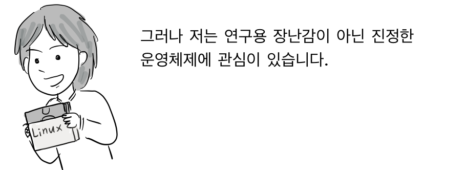
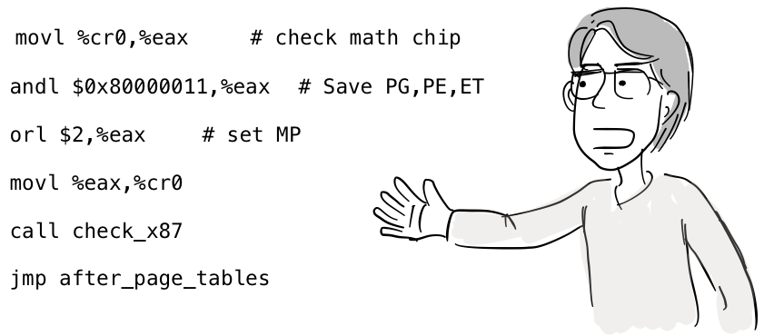
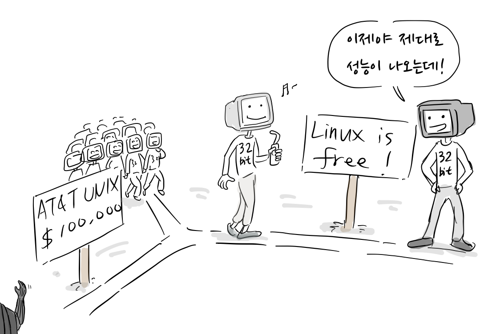
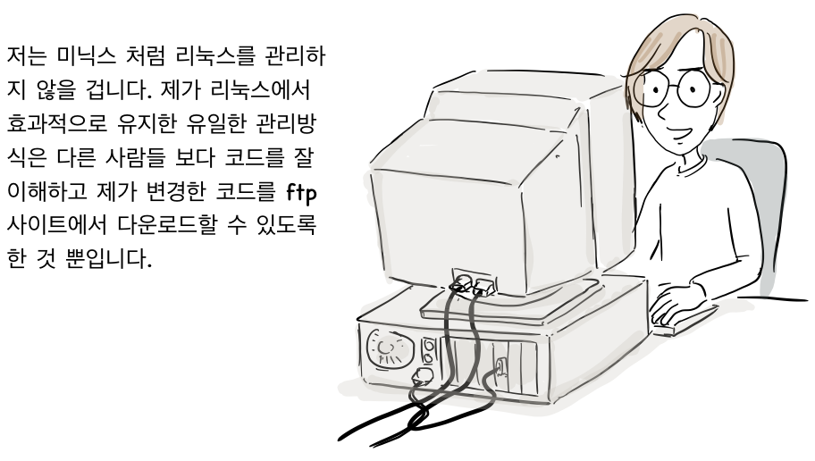
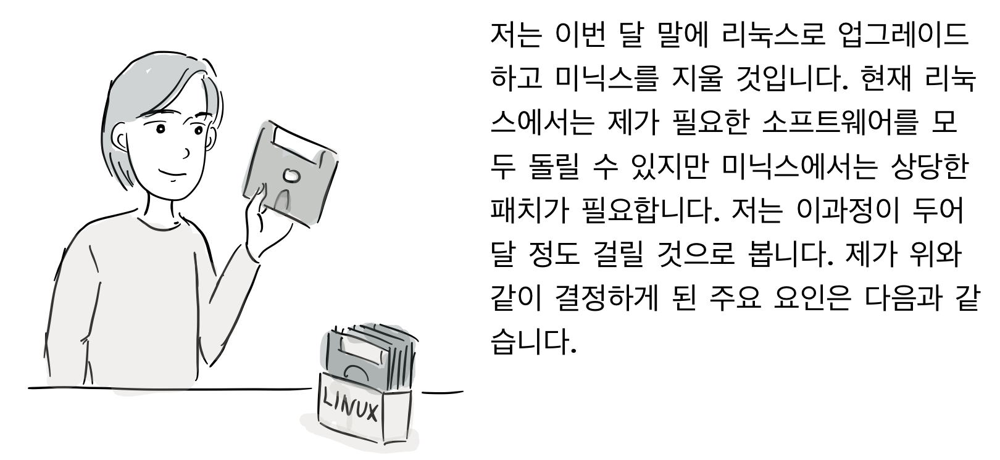

[1부](https://joone.net/2019/02/09/30-%eb%a6%ac%eb%88%85%ec%8a%a4-%ec%9d%b4%ec%95%bc%ea%b8%b0-%eb%a6%ac%eb%88%85%ec%8a%a4-vs-%eb%af%b8%eb%8b%89%ec%8a%a4-1%eb%b6%80/)에서 이어집니다.

물론, 잘 동작하지 않았고, 쉘 연산자 &는 필요가 없었습니다. 게다가 미닉스는 가상 메모리를 지원하지 않아서 사람들이 미닉스로는 이 분야를 공부할 수 없고, 덩치가 큰 프로그램도 실행할 수 없습니다. 문제는 미닉스에서 실험적인 작업을 하는 것이 어렵다는 것입니다 패치를 얻거나 적용하는 것도 쉽지 않으며, 추후 업그레이드도 불가능합니다.

정말 좋은 운영체제를 만드는데, 많은 것이 부족해서 아쉽네요. 교수님이 하신 일에 대해서는 감사를 드리지만, 그렇다고 리눅스가 교수님께 그런 비판을 받을 만하지는 않습니다. 보통 사람들에게는 미닉스 보다는 리눅스로 할 수 있는 일이 많거든요. (julien@incal.inria.fr)

  
저는 미닉스를 사용하면서 단일 스레드 파일 시스템에 문제가 있다는 것을 알게 되었습니다. 플로피 디스크를 읽는 동안 때때로 다른 작업을 하면 좋겠지요. C 또는 Lisp 소스 컴파일을 기다리는 동안 [Rogue 게임](https://en.wikipedia.org/wiki/Rogue_\(video_game\))을 하면 어떨까요?

물론, 기본적으로 미닉스는 가상 콘솔이 없고 Emacs도 실행할 수 없는데, 이는 큰 문제가 아니지만, 대부분의 사람들은 이를 장점이 아니라 단점으로 받아들입니다. 이런 생각은 많은 사람이 사양이 낮은 머신에서 빈약한 운영체제를 사용하는데 익숙해서 그럴 듯해 보이지, 사실, 단일 사용자 머신에서도 여러 프로세스를 실행할 필요는 있습니다.

미닉스는 욕심이 없어서 이식성에 관해서만 우월합니다. 여러분이 페이징, 작업 제어, 윈도우 시스템 등과 같은 모든 기능을 갖춘 유닉스를 사용하려면 미닉스에서 시작해서 이러한 기능을 추가하는 것이 빠를까요, 아니면 리눅스에서 시작해서 386에 종속적인 기능을 수정하는 것이 빠를까요? 미닉스와 목적이 아주 다른 리눅스를 비난하는 것은 공정하지 않다고 생각합니다. 여러분이 교육용 시스템을 원한다면, 미닉스가 해답이지만, 가정용 컴퓨터에서 썬마이크로시스템에서 만든 워크스테이션과 비슷한 환경을 바란다면, 미닉스로는 부족합니다.(richard@aiai.ed.ac.uk)

  
모든 기능을 갖춘 유닉스를 미닉스와 리눅스에서 찾는 대신 또 다른 방법으로 여기서는 완전히 잊혀진 듯 한데, 그냥 유닉스 또는 그 클론을 구입하는 것입니다. [Coherent](https://en.wikipedia.org/wiki/Coherent_\(operating_system\))는 단 99불이며, 다양한 기능을 원한다면 그보다 조금 더 많은 비용을 지불하면 됩니다. 실제로 사용할 수 있는 여러 종류의 유닉스가 있습니다. 진정한 해커에게 소스 코드가 없다는 것은 중대한 문제지만, 단순히 유닉스 시스템을 사용하려는 것이라면, 대안은 많습니다(무료는 아니지만 말입니다). (ast@cs.vu.nl)

안타깝게도, 내부를 해킹하는 것은 여기 있는 많은 이들이 원하는 것입니다. 라이선스 문제가 해결된 BSD나 GNU Hurd가 나오게 되면 교수님은 저희들로 부터 벗어날 수 있는데, 앞으로 몇 달안에 이런 일이 일어날 것입니다. (richard@aiai.ed.ac.uk)

탄네바움 교수님, 저는 교수님이 이 그룹에 처음으로 메시지를 올렸을 때부터 미닉스의 개발을 지켜보았습니다. 현재는 1.5.10에 브루스 에반스(Bruce Evans)의 386 패치를 적용해 사용하고 있습니다.

여러 해 전에, 저는 AT&T 유닉스 7버전의 소스코드 라이센스가 있어서 행복한 위치에 있었습니다. 그런데, 교수님의 결정으로 미닉스 소스를 AT&T 저작권의 족쇄로부터 자유롭게 하는 것을 보았습니다!! 이처럼 교수님의 ‘취미’가 ‘개인용’ 유닉스를 사용하는데 중대한 영향을 미쳤는데, 때때로 그 사실을 때때로 잊고 지나치시나 봅니다. 하여간 제 8086 PC에서는 미닉스 1.2를 실행하는데 386/SX보다 상당한 비용이 더 들고 있습니다. 그리고, 교수님께서 유닉스 클론인 Coherent를 구입해서 써보라고 하셨는데, 교수님이 어떤 말을 해도 제가 Coherent을 사용해야 한다는 확신을 갖지 못했습니다.(ajt@doc.ic.ac.uk)

제게 SPARC 머신이 있었다면 솔라리스를 사용할 것입니다. 저는 리눅스와 함께 gcc, emacs 18.57, kermit와 모든 GNU 유틸리티를 어떤 문제 없이 그대로 설치했습니다. 패치를 적용할 필요도 없었습니다. 저는 설치 설명서를 그대로 따랐을 뿐입니다. 전산학과 숙제를 하는 데 이 정도의 가격으로 OS를 얻는 것은 어디에서도 불가능합니다. 그리고 리눅스에서 곧 네트워크 지원이 될 것으로 보이고 X 윈도우가 미닉스보다 먼저 포팅될 것입니다. 이로써 많은 이들에게 아주 유용할 것입니다. 저는 표준 유닉스 소프트웨어의 이식성도 또한 중요하다고 봅니다. 저 또한 커널을 모노리식 시스템으로 설계하는 것이 마이크로커널 만큼 좋지 않다는 것을 압니다. 그러나 가까운 미래에(제 386을 업그레이드할 수 없지만), 리눅스가 저에게 완벽하게 맞을 것 같습니다. (pwu@unixg.ubc.ca)

소프트웨어의 역사는 가용성이 기술적인 품질 보다 매번 우수하다는 것을 보여줍니다. 이것이 리눅스의 가장 큰 장점입니다. 리눅스는 386 기반의 작은 시스템으로 일반 유닉스와 상당히 호환되며, 자유롭게 사용할 수 있습니다. 저는 2년 전, (1) 미닉스가 가까운 미래에 8086을 능가할 수 없는 것이 분명해졌을 때, 미닉스 공동체를 탈퇴했습니다. (2) 라이선스는 놀랍도록 친근하지만, 386 버전을 만드는 데 관심있는 사람들에게는 여전히 어려웠습니다. 몇몇 사람들은 386지원을 위해 좋은 일을 했지만, 그들이 배포할 수 있는 것은 diffs 뿐입니다. 지금까지 이러한 방식으로 386 시스템에서 미닉스를 지원했지만, 새로운 사용자에게 실용적이지 못하며, 사실 저도 그 일을 하고 싶지 않습니다.

저의 이상적인 OS는 4.4BSD입니다. 하지만, 4.4BSD는 극심한 내리막의 역사를 갖고 있습니다(역자: AT&T와 소송으로 4.4BSD가 마지막 버전이된다). 대부분의 BSD 개발자들이 BSDI로 옮겨가면서 이러한 상황이 개선되리라 믿기는 어렵습니다. 제 개인적 관점에서 볼 때, BSDI 시스템은 훌륭할 것입니다.

(hedrick@klinzhai.rutgers.edu)

리누스를 비롯한 많은 리눅스 지지자들이 리눅스가 80386 아키텍처에 묶여있다고 언급을 했기때문에, 교수님이 이를 믿는 것은 잘못이 아닙니다. 하지만, 80386에 특화된 코드는 미닉스가 사용한 것 보다 결코 많지 않고 리눅스에서 사용된 80386용 특정 코드는 BSD 4.3에서 사용된 VAX 아키텍쳐에 특화된 코드보다도 훨씬 적습니다.

물론, 아직은 리눅스가 다른 아키텍처로 이식된 사례는 없습니다. 그렇지만 저는 유닉스 계열의 시스템을 새로운 아키텍처로 이식할 때 미닉스보다는 리눅스로 시작할 것입니다. 물론, 가상 머신과 디바이스 드라이버 계층의 많은 부분을 새롭게 다시 작성해야 할 것입니다. 그렇지만, 그것은 다른 OS에서도 마찬가지입니다. 아마도 미닉스를 새로운 아키텍처로 이식하는 것보다는 리눅스가 좀 더 어려겠지만, 이것은 리눅스를 첫 번째 아키텍처에 포팅할 때만 해당할 뿐입니다.

교수님께서 말씀하신대로, 저 역시도 마이크로커널 접근 방식의 장점을 압니다. 그런데 리눅스는 현재 존재하지만, GNU Hurd는 존재하지 않습니다. 그리고 Hurd를 개발하는 사람들은 리누스가 리눅스를 개발한 것 보다 더 오래 작업을 해왔습니다. 미닉스는 자유 OS가 아니므로 여기서 고려하지 않겠습니다. 🙂

마이크로커널 VS 모노리식 커널의 균형은 당신이 무엇을 하느냐에 달렸다고 생각합니다. 당신이 연구하는 것에 관심이 있다면, 마이크로커널에서 모듈을 빼내고 교체하는 것이 훨씬 쉬울 것입니다. 그리고 연구원들만 운영체제에 대한 논문을 쓰기 때문에, 사실상 마이크로커널이 올바른 접근 방법임에 틀림없습니다. 그러나 저는 연구원이 아니면서도 커널 프로그래머인 사람들을 많이 알지만, 그들은 마이크로커널 구조에서 일어나는 메모리 복사와 컨텍스트 스위치 비용에 대해 많이 우려합니다.

그런데 저는 교수님이 단일 사용자 시스템에서 멀티스레딩 파일 시스템이 필요없다는 주장을 받아들일 수 없습니다. 교수님도 성능 좋은 파일 시스템을 원할것이고, 심지어 단일 사용자 시스템에서도 마찬가지입니다. 아마도 이론가에게는 그건 불필요한 최적화이고, 교수님 말을 빌리자면, 성능상의 해킹입니다.

 (tytso@athena.mit.edu)

여러분, 교수님이 말한 것처럼 미닉스 이식성을 고려해서 설계되었고, 리닉스는 80×86에 밀접한 연관이 있다는 이야기는 소스 코드를 살펴본다면, 사실이 아니라는 것을 알게 될 것입니다. 리누스가 이미 인정한 대로, 약간의 계획이 시스템을 더 깔끔하게 하지만, 단지 386 어셈블리 코드를 주변에 추가한 것은 죄가 아닙니다!

그리고 죄송한 말씀이지만:  
\-미닉스 책은 이식성에 대하여 문제를 제기하지 않았습니다(몇 개의 ‘#ifdef M8088’을 제외하고).  
\-미닉스 책이 나왔을 때, 미닉스는 몇가지 8086만의 기능에 의존해 68000 사용자들이 소란을 피우게 만들었습니다. (joe@jshark.rn.com)

교수님이 주장하는 것처럼, 저는 마이크로커널이 반드시 더 좋은지 확실하지는 않지만, 교수님도 타당성을 갖고 있다고 생각합니다. 마이크로 커널과 모노리식 방식을 조합하는 것이 더 합리적 일 수도 있습니다.

사실 OS 이론가에게 있는 주된 문제는 그들이 아이디어를 전혀 테스트하지 않는다는 것입니다. 그 아이디어 중 어떤 것도(MACH에서는 부분적 예외가 있지만) 빛을 본 것이 없습니다.

32비트 가정용 컴퓨터는 거의 10년간 사용 가능했으며 리누스는 AT&T에 100,000달러를 지불하지 않고도 그 컴퓨터에서 사용할 수 있는 OS를 개발한 첫 번째 인물이 되었습니다. 우리 손에 있는 소프트웨어 한조각이 10개의 베이퍼웨어 가치가 있습니다. OS 이론가는 이 OS에서 저 OS로 쉽게 점프하지만, 그들이 기꺼이 대안을 제시한 적은 없습니다.

마이크로 커널이 가야할 길이라는 일반적인 합의는, 실제 응용 프로그램이 결코 실행되지 않을 때, 아무런 의미가 없습니다.

리눅스 출시 덕분에 저는 몇 년 동안 실험하기를 원하는 아이디어를 시도할 수 있습니다. 그러나 저는 아직까지 동작하는 OS에서 소스 코드를 가지고 작업할 수 있는 기회를 얻은 적은 없습니다. (entropy@wintermute.WPI.EDU)

저는 결코 이론가가 아닙니다! 어제 저희 학과 회의에 참석한 누구에게나 물어보세요(농담입니다).

사실 이러한 아이디어는 충분히 검증된 것입니다. [OSF(Open Software Foundation)](https://ko.wikipedia.org/wiki/%EA%B0%9C%EB%B0%A9_%EC%86%8C%ED%94%84%ED%8A%B8%EC%9B%A8%EC%96%B4_%EC%9E%AC%EB%8B%A8)에서는 전체 사업을 마이크로커널(MACH 3.0)에, [USL](https://en.wikipedia.org/wiki/Unix_System_Laboratories)에서는 그들의 사업을 [Chorus](https://en.wikipedia.org/wiki/ChorusOS)에 배팅하고 있습니다. 이들 모두 많은 소프트웨어를 실행하고, 둘다 모노리식 시스템에 광범위하게 비교되었습니다. [Amoeba](https://en.wikipedia.org/wiki/Amoeba_\(operating_system\))는 여러 가지 애플리케이션을 실행하기 위해 완벽하게 구현되었고 테스트되었습니다. [QNX](https://en.wikipedia.org/wiki/QNX)도 마이크로커널 기반의 시스템으로, 누군가 저에게 말했는데, 설치된 수가 20만대가 된다고 합니다. 마이크로커널은 꿈같은 이야기가 아닙니다. 그들이 검증된 기술을 보여준 것입니다.

MACH를 개발하는 친구들이 “[UNIX as an application program](https://pdfs.semanticscholar.org/980b/46ec731b3048fe40113212df5d67aa6cf313.pdf)” 라는 논문을 썼습니다. 이 논문은 Golub 외 여러 명이 썼고, 1990년 하계 USENIX 컨퍼런스에서 발표했습니다. Chorus를 개발하는 사람들은 또한 마이크로커널 성능에 관한 기술 보고서를 썼고, 그 주제에 대해서 저와 다른 논문을 함께 썼는데, 그 논문(Dec. 1991 Computing Systems)은 어제 언급한 것이니 확인 바랍니다. (ast@cs.vu.nl)

제가 이 미닉스 VS 리눅스의 토론 초기 메시지 중 하나를 올렸다고 생각이 들기 때문에, 제가 미닉스에서 리눅스로 바꾼 이유를 설명해야 할 압박을 느낌니다. 중요도 순서에 따라,

  
운영체제가 무료이면, 많은 사람이 사용하고/지원하고/개선할 것입니다. PC는 저렴하고 널리 보급되어서, 많은 사람이 구입/사용함에 따라 저렴하거나 무료인 뛰어난 소프트웨어가 많아질 것입니다.

타넨바움은 일반적으로 미닉스에 대한 개선 사항을 받아들이지 않고 있습니다. 타넨바움은 이에 대해 정당하고 합당한 이유를 가졌지만, 저는 이를 논쟁거리로 만들지 않습니다. 그러나 미닉스에는 더 이상 존재하기 어려운 몇가지 한계를 갖고 있고, 이러한 정책으로 인해, 합리적인 시간안에 그러한 문제가 해결될 것이라는 전망은 기대하기는 어렵습니다. 그 제한은 다음과 같습니다.

-   386 지원 안함
-   가상콘솔 지원안함
-   소프트 링크 지원 안함
-   select 시스템 콜 지원 안함
-   ptys(의사 터미널 장치) 지원 안함
-   demand paging/swapping/공유 텍스트/공유 라이브러리… (효율적인 mm) chmem(불변의 mm)
-   X 윈도우 지원 안함(이러한 이유로 386과 리눅스를 지지함)
-   TCP/IP 지원 안함
-   GNU/SysV 통합 지원 안함(이식성)

이 문제 중 일부는 패치로 수정할 수 있지만(당신이 스스로 패치를 했더라도, 제가 얼마나 만족스러운지 알려줄 필요는 없습니다), 최소한 마지막 다섯가지 항목은 합리적으로 기대하기 어렵습니다.

저는 모노리식 커널의 메시지 전달 방식에서 의견을 가지고는 있지만 지금 표현하지는 않겠습니다. 물론 표현하려 했던 것도 아닙니다. 제 목표는 완전히 단기간에 (최소 시간/비용/번거로움에서 최대의 기능을) 필요로하고, 그 결과 이에 대한 제 견해는 부적절할 수 있고 잘못 해석되어서는 안됩니다. 미닉스가 위와 같은 기능이 없다는 점에 놀라지 않고, 비용이 드는 것에 신경을 쓰지 않는한, 미닉스를 고려해볼만 합니다. 🙂 (pmacdona@sanjuan)

리눅스 vs. 미닉스 논의에 대한 몇가지 의견이 모노리식 VS 마이크로커널 토론으로 발전했습니다.

저는 각 개념을 옹호하는 사람들이 리눅스와 미닉스는 전혀 다른 용도로 설계되었다는 점을 인정하지 않는다면, 두 진영간에 합의가 없을 것으로 생각합니다. 저는 저렴하고, 강력하면서 강화된 유닉스 시스템을 단일 머신에서 실행하고 표준 유닉스 소프트웨어를 어렵지 않게 실행하기 원하는 분께는 리눅스를 권합니다. 반면에 현대적인 운영체제 개념에 관심이 있고 마이크로커널에 기반을 둔 시스템이 어떻게 동작하는지 알고 싶다면 미닉스가 더 나은 선택입니다.

마이크로 커널에 기반을 둔 시스템에 대한 논쟁을 부채질하려는 의도는 아닙니다만, 당분간 PC에서 구현된 모노리식 유닉스가 더 나은 성능을 보입니다. 즉, 이는 최소한 유닉스를 단일 머신에서 실행하는 한, 모노리식으로 더 잘 구현될 수 있습니다. 사용자 입장에서 OS의 내부 설계는 중요하지 않습니다. 최소한 네트워크에 연결할 때까지는 그렇습니다. 모노리식 접근 방식에서 파일 서버는 이더넷과 같은 하드웨어 장치를 기반으로 한 사용자 프로세스가 됩니다.

이러한 장치를 사용하려는 프로그램은 서버와의 통신을 제공하는 특수한 라이브러리를 사용해야 할 겁니다. 마이크로 커널시스템에서는 OS에서 새로운 ‘시스템’ 호출 없이도 서버를 OS로 통합이 가능합니다. 사용자 입장에서는 (예를 들자면, 더 많은 디스크 공간을 통해서) 변경없이 좀 더나은 성능을 얻을 수 있습니다. 개발자 입장에서, 마이크로커널 시스템은 하드웨어 설계 변경에 더 빠르게 적응할 수 있습니다.

타넨바움이 미닉스에 대한 개선을 거부한 것은 비판받을 만한 일입니다. 그의 관심은 미닉스의 교육적 가치에 있었기 때문에, 그가 코드를 최대한 간단하게 유지하고 기능으로 부담이 되는 것을 원치 않는다는 그의 주장을 이해합니다. 비록 미닉스가 모노리식 OS에서 아마도 더 잘 동작하는 하드웨어 플랫폼에서 실행되고 있지만, 교육용 수단을 위해 마이크로커널로 작성된 것입니다.

그러나, 네트워크 애플리케이션 영역이 커지고 있으며 Amoeba나 [Plan 9](https://ko.wikipedia.org/wiki/%ED%94%8C%EB%9E%9C_9_\(%EC%9A%B4%EC%98%81_%EC%B2%B4%EC%A0%9C\))와 같은 최신 OS는 모노리식 시스템으로 작성 될 수 없습니다. 그래서 미닉스는 학생들이 태스크와 메시지를 다룰 수 있도록, 마이크로 커널 OS의 실용적인 예를 제공하려는 의도로 개발된 것입니다. 이것은 [Unix System V](https://ko.wikipedia.org/wiki/SysV) 또는 BSD보다 1/10 정도 가격에 저렴하고 강력한 OS를 만들어 많은 사람들에게 제공하려는 생각이 아니였습니다.

  
요약: 리눅스가 미닉스보다 더 좋은 것도 아니고 그 반대도 아닙니다. 둘은 좋은 이유로 서로 다릅니다. (olaf@oski.toppoint.de)

음, 흥미로운 토론이였습니다. 저는 타넨바움 교수께서 마이크로 커널이 옳은 방향이라고 한 것에 전적으로 확신을 합니다. 그렇지만 미닉스 소스 코드를 보면 볼수록 이것이 마이크로커널인지 의심이 갑니다.

저는 아마도 M68000에 리눅스를 포팅하는 것을 걱정하지 않겠지만, 미닉스가 더 많은 기능을 제공하기를 원합니다. (meggin@epas.utoronto.ca)

저는 최근에 저에게 불만있는 사람들로 부터 메일을 몇 통 받았고, 아래와 같은 불만이 많이 있었습니다.

  
사람들이 마이크로커널 vs. 모노리식 커널에 관해 진지한 토론을 하고 싶다면, 좋습니다. 이는 [comp.os.research](https://groups.google.com/forum/#!forum/comp.os.research)라는 뉴스 그룹에서 할 수 있습니다. 그러나, 여러분이 무슨 말을 하는지 전혀 모른다면, 말씀을 자제해주길 바랍니다. 저는 세 개의 운영체제에 대해 설계와 구현을 도왔습니다. 하나는 모노리식 커널이고 두 개는 마이크로 커널이며, 다른 것들도 자세하게 연구했습니다.

지금까지 이식성에 대해서는 이 이상 심각한 논의는 없었습니다. 유닉스는 PC 부터 [크레이 슈퍼 컴퓨터](https://ko.wikipedia.org/wiki/%ED%81%AC%EB%A0%88%EC%9D%B4_\(%EA%B8%B0%EC%97%85\))까지 포팅되었습니다. 이식 가능한 OS를 제작하는 것이 그렇지 않은 OS를 제작하는 것보다 결코 어려운 일은 아닌데, 이는 오늘날 모든 시스템이 이식성을 염두하면서 개발되기 때문입니다. 이는 리누스의 운영체제 교수도 분명히 강조했을 것입니다. OS 코드를 이식 가능하게 만드는 것은 1987년에 제가 발명한 뭔가가 아닙니다.

많은 사람이 커널 설계와 이식성에 대해서는 이성적으로 이야기 하지만, 소스코드가 무료로 배포되는 부분에 대해서는 100% 감정적입니다. 여러분은 제가 미닉스를 판매로 최근 제가 얼마나 버는지 못 믿을 것입니다. 미닉스는 169불이지만, 이 라이선스는 두 벌의 복사본을 만드는 것을 허용하므로 실제로 거래되는 가격은 60불 이하입니다. 더욱이 교수에게는 학생들에게 \*무제한\* 배포를 허용합니다. Coherent 유닉스는 99불입니다. 자유소프트웨어재단(FSF)에서는 ‘자유 소프트웨어를 테이프에 담아 100불이 넘는 가격에 판매합니다. 4.4BSD 는 800불입니다. 저는 가격이 그렇게 큰 문제가 된다고는 생각하지 않습니다. 게다가 이 그룹을 구독하는 대부분의 사람들은 미닉스를 갖고 있습니다.

모든 이들이 인정한다고 생각하는 것은 아니지만, FTP에 뭔가를 공개하는 것이 널리 배포하는 데 필수적인 것은 아닙니다. 인터넷은 여전히 상위 엘리트 그룹입니다, 대부분의 컴퓨터 사용자들은 인터넷에 없습니다.

“Free”가 무엇을 의미하는지로 되돌아와서, 소스 코드 공개는 어떻습니까? Coherent는 바이너리만 제공하지만 미닉스는 리눅스와 마찬가지로 소스 코드를 제공합니다. 여러분은 미닉스를 마음대로 고칠 수 있고, 고친 내용을 여기에 올릴 수 있습니다. 사람들은 이 일을 5년 동안 아무런 문제 없이 잘 해왔습니다. 저도 해마다 무료 업데이트를 제공하고 있습니다.

제 생각에 진짜 문제는 다른 것에 있습니다. 저는 가상 메모리, 페이징, 심볼릭 링크, 윈도우 시스템과 같은 기능을 구현한 패치를 계속해서 제안 받았습니다. 그러나 저는 학생들이 쉽게 시스템을 이해할 수 있도록 시스템 간단하게 유지하는 중이라서 이를 거부했습니다. 여러분이 이러한 기능을 여러분 버전에 추가할 수 있지만 저는 제 미닉스에는 추가하지 않을 겁니다. 저는 이 점이 미닉스 가격($60)을 불평하는 사람들이 아니라 자유가 없다라는 이야기하는 사람들을 화나게 한다고 생각합니다.

재미있는 질문은 리누스가 리눅스를 그의 통제에서 기꺼이 놔줄 수 있는가 하는 것입니다. 아마 사람들이 리눅스를 수정해서 (실행하고) 판매하지 않나요?

프레드 반 켐펜(Fred van kempen)이 다시 되살아나서 리눅스를 빼앗아 프레드의 리눅스와 리누스의 리눅스가 만들어졌다고 칩시다. 둘 다 쓸만하지만 그 둘은 서로 다른 것입니다. 이게 괜찮은가요? 상당한 규모의 사람들이 리누스가 원하지 않는 어떤 방식으로 리눅스를 발전시켜 나가기를 원할 때 시험이 찾아옵니다. 실제로 이러한 일이 일어나기전까지는 우리가 이 일로 토론을 할 수는 없습니다.

여러분이 제 철학보다 리누스의 철학을 더 좋아한다면 부디 그를 따르십시오. 그러나 그것이 리눅스가 ‘공짜’이기 때문에 그렇게 했다고 주장하지는 마세요. 그냥 벨도 많고 호루라기가 많은 시스템을 원한다고 이야기하세요. 저는 괜찮습니다. 바로 당신의 선택입니다. 저는 이에 대해 논쟁하고 싶지 않습니다. 진실을 말하기 바랍니다.

또 다른 반론을 해야겠군요. 앞에서 누군가 프랜티스 홀 출판사에서 배포를 독점하지 않았더라면, 미닉스에 관심 있는 많은 해커 그룹을 조직하고 더 나은 미닉스를 만드는 것이 가능했을지도 모른다고 하셨는데, 이것은 충분히 가능한 일입니다. 이 일을 하고자 하는 그룹이 결성된다면, 그것은 괜찮습니다. 나는 전세계에 사는 1000명의 프리마돈나와 협력하는 것이 고양이를 기르는 것만 큼 쉽다고 생각하지만, 법적인 문제는 없습니다. 새로운 발표가 준비되면 1.5 버전에 대한 패치 리스트를 만들고 올리거나 FTP로 공개하십시오.

물론, 제 버전에 이러한 변경 사항을 반영하지는 않을 것입니다. 따라서 공식 버전과 향상된 버전을 동기화된 상태로 유지하는 작업이 필요하며, 이 일을 최소화하기 위해 협력하고 싶습니다. 물론, 저는 이미 브루스 에반스, 프란스 뮬렌브 로엑스와 오랫동안 이 일을 했습니다.

리누스가 공식 버전을 계속 관리하기를 원하고 어떤 해커 집단은 다른 방향으로 가기를 원한다면, 미닉스와 같은 문제가 일어납니다. 저는 저작권이 정말 문제가 된다고는 생각하지 않습니다. 문제는 조정하는 것에 있습니다. GNU나 미닉스 또는 리눅스와 같은 프로젝트는 한 사람이 담당할 때만 유지가 됩니다. 1970년대 구조적 프로그래밍이 소개되었을 때, 할란 밀스는 프로그래밍 팀이 외과 팀처럼 조직되어야 한다고 지적했습니다. 이 는 모든 사람에게 도끼를 주고 휘두르게 만드는 돼지 도살자팀이 아니라 외과 의사 한명과 여러 보조자 형태가 되어야합니다.

수많은 사람이 복잡한 코드를 해킹하는데도 무정부 상태를 피할 수 있다고 이야기하는 사람은 소프트웨어 프로젝트 해 본적이 절대로 없는 사람입니다. (ast@cs.vu.nl)

이것이 공식버전이 되어버렸고, 이러한 상황이 당분간은 변하지 않을 것으로 예상합니다. 왜냐하면 제게 도덕적인 권리가 있어서가 아니라 지금까지 별다른 불평을 듣지 못해서이고, 두어 달은 지나야 커널에서 일어난 변화에 대해 공감하는 사람을 찾을 수 있기 때문입니다(글쎄, 어쩌면 사람들이 거기에 도달했을 수도 있습니다. tytso님이 확실히 0.10까지 약간의 큰 변경을 추가했고, 다른 사람들도 역시 해킹을 잘했습니다).

사실 저는 릴리스 관한 의사 결정을 하기 위해‘리눅스 커널’ 메일링 리스트에서 이에 대한 의견을 구해왔습니다. 왜나하면 제가 SCSI 와 같은 장비를 갖고 있지 않아서 모든 기능을 완벽하게 지원하는 것은 어렵다고 예상하기 때문입니다. 이에 대한 반응이 없었는데, 사람들은 아직 이 방식을 바꿀 마음이 없는 것으로 보입니다(음, 어떤 분은 제가 장치를 지원할 수 있도록 협찬을 요청하라고 하기도 하는데, 썩혀둔 흥미로운 하드웨어를 갖고 있는 분이 있다면, 저는 기쁘게 받도록 하겠습니다 🙂

저작권이 금지하는 유일한 것은 (그리고 제가 무척 합리적이라고 느낀 것은) 다른 사람이 리눅스 커널로 돈을 벌면서 소스 코드 공개는 거부하는 것입니다.

이것은 논리의 문제가 아닐지 모르지만, 제가 사람들이 개인 프로젝트로 놀 수 있도록 리눅스 코드를 확실하게 공개했을 때, 누군가는 오직 돈을 위해 제 작업물을 팔 수 있다면 기분이 아주 좋지는 않을 겁니다. 나는 대부분의 사람들이 제 요점을 이해한다고 생각합니다.

화제를 바꾸어 프레드 반 켐펜이 더 뛰어난 리눅스를 만들고자 한다면 환영받을 일입니다. 그는 (배포 수수료 외에) 많은 돈을 벌 수는 없을 것입니다. 저는 또 다른 리눅스가 생기는 것이 좋다고는 생각하지 않지만, 심지어 저작권이 허락한다해도 그를 막고 싶지는 않을겁니다.

교수님께서 “저는 저작권이 정말 문제가 된다고는 생각하지 않습니다. 문제는 조정하는 것에 있습니다. GNU나 미닉스 또는 리눅스와 같은 프로젝트는 한 사람이 담당할 때만 유지가 됩니다”라고 하셨는데, 그렇습니다. 조정은 큰 문제입니다. 그래서 저는 리눅스 커널 개발에서 당분간 부분적으로 ‘외과 과장’ 자리에 머물러 있을 것입니다. 왜냐하면 대부분의 사람이 이 문제를 이해하기 때문입니다.(리누스)

– 미닉스에는 현재 버전이라는 것이 없습니다. 이 버전은 패치를 만들 기준으로 쓰이지만 아무도 모릅니다. 현재 1.6.17이 있습니다.  
– 라이브러리에는 몇 가지 버그가 있는데 수정된 것이 없습니다. 새로운 컴파일러는 나오지 않을 것이고 16비트 사용자는 여전히 버그가 있는 컴파일러를 사용해야 할 것입니다.  
– 1.6.17에서는 POSIX보다 더욱 많은 기능을 지원하기는 하지만 아직도 termios가 완전하지 않습니다.  
– 16 비트 사용자를 위해 계속 개발될 것인지 의심스럽습니다.

그렇지만, 미닉스는 다음과 같은 장점을 가지고 있습니다.  
– 하드디스크가 없는 시스템에서도 사용할 수 있고 프로그램을 컴파일할 수도 있습니다. 저는 이 일을 몇 년 전부터 해왔습니다.  
– 미닉스는 아주 작고 어느 시스템에서나 잘 돌아갑니다.  
– 책이 있습니다. 1.3 내용을 다루고 있기는 하지만, 대부분의 내용이 유효합니다.  
– 미닉스는 모노리식이 아닌 커널의 예가 됩니다. 이를 마이크로커널 또는 멍청한 하드웨어를 극복하는 해킹이라고 부릅니다. 미닉스는 장단점을 가지고 마이크로커널의 교과서적인 개념을 보여줍니다.

제가 보기에 미닉스는 유닉스와 시스템 프로그랭 첫단계를 위해 좋은 시스템입니다. 저는 미닉스를 통해 유닉스에 대해 제가 아는 모든 것을 배웠습니다. 여기에는 유닉스에서의 C 프로그래밍 부터 시스템 관리와 보안 구멍도: ) 까지 모든 영역이 포함됩니다. 저는 미닉스에서 1.5.xx 업그레이드, 가상 콘솔, 메일과 뉴스, 텍스트 프로세싱, 크로스 컴파일 등을 경험하면서 함께 성장했습니다. 하지만 이러한 것만으로는 저에게 부족합니다. 제게 더 이상 교육용 시스템은 필요치 않습니다. 좀 더 복잡하고 풍부한 기능을 갖춘 유닉스가 필요로 합니다. 그것이 바로 리눅스입니다.

이제 논쟁을 중단했으면 합니다. 미닉스와 리눅스는 서로 다른 목적을 가진 시스템입니다. 하나는 교육용 도구로서 좋다고 생각하고, 다른 하나는 진짜 해커를 위한 진정한 유닉스입니다.  
(michael@gandalf.informatik.rwth-aachen.de)

dingbat@diku.dk

**더 읽을 글**

-   [리눅스 그냥 재미로](http://www.aladin.co.kr/shop/wproduct.aspx?ItemId=274630), 한겨레 신문사 , 2001
-   [타넨바움과 토발즈의 논쟁, 위키피디아](https://en.wikipedia.org/wiki/Tanenbaum%E2%80%93Torvalds_debate)
-   [LINUX is obsolete, 뉴스그룹 원문](https://groups.google.com/forum/#!topic/comp.os.minix/wlhw16QWltI%5B1-25%5D)과 [한글 번역](https://docs.google.com/document/d/1ygYM1CGwnp55cybI6gofLcBMmvwdp4R5xQOr4GuUJNA/edit#heading=h.yat2dkf3g3d2)
-   [The Tanenbaum-Torvalds Debate,Open Sources: Voices from the Open Source Revolution, 1999](https://www.oreilly.com/openbook/opensources/book/appa.html)

참고로, 이번 만화는 앤드류 타넨바움과 리누스 토발즈의 미닉스와 리눅스에 관한 논쟁 일부 내용을 만화로 재구성하였습니다. 반드시 [원문](https://www.oreilly.com/openbook/opensources/book/appa.html) 또는 [원문 번역](https://docs.google.com/document/d/1ygYM1CGwnp55cybI6gofLcBMmvwdp4R5xQOr4GuUJNA/edit?usp=sharing)을 읽어보시기 바랍니다.

잘못된 부분이나 추가할 내용이 있으면 [만화 원고](https://docs.google.com/document/d/1uTryzygIxWbCEitzcJmsf7KJg7sniLq4o2ZzV187JB4/edit?usp=sharing)에 직접 의견을 남겨주시면 고맙겠습니다. 그 외 전반적인 만화 후기는 블로그에 바로 답글로 남겨주세요. 다음 이야기는 리눅스의 발전입니다.
