리눅스 커널이 공개된 이후 많은 해커들이 리눅스에 코드를 기여하기 시작했다. 하지만, 1991년 9월 리눅스 코드가 처음 공개된 이후, 1년여 시간이 지났지만 아직까지 네트워킹은 지원하지 않았다.

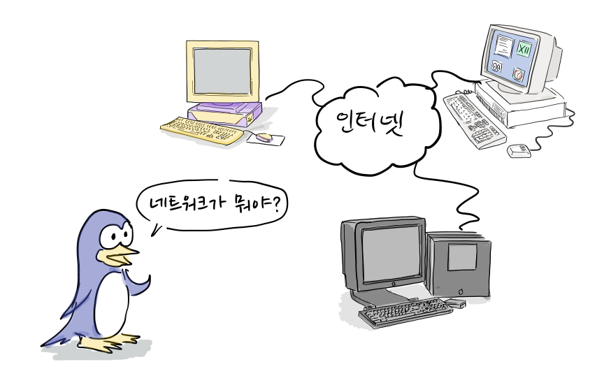

리눅스 커널에 처음으로 네트워크 코드를 기여한 사람은 로스 비로(Ross Biro)였다. 로스는 비록 간단하고 불완전하지만, 실행 가능한 TCP/IP 코드를 구현하였다. 이 코드는 당시 WD-8003 네트워크 카드용 이더넷 드라이버와 동작이 가능했다. 이 정도 코드만으로 사람들은 자신들의 네트워크 애플리케이션을 테스트할 수 있었고 일부 사람들은 인터넷에 연결할 수 있었다. 아직은 완전한 수준이 아니었지만, 1992년 10월 18일, 리눅스 커널에 TCP/IP 알파버전으로 포함되었고 NET-1으로 알려졌다\[3\]. 당시까지만해도 386BSD가 BSD에서 구현된 TCP/IP를 포함해서 훨씬 경쟁력이 있었다. 단, 인텔 [387 코프로세서](https://en.wikipedia.org/wiki/Intel_80387SX)가 필요했다.

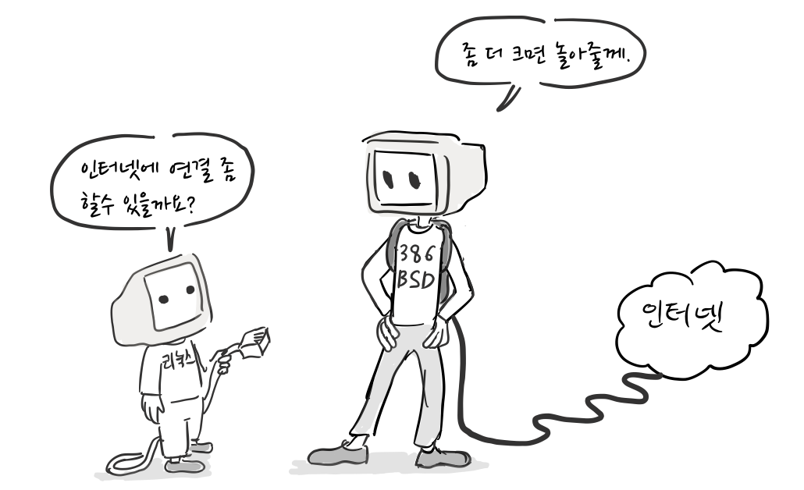

하지만, 리눅스 공동체는 BSD에서 구현된 네트워크 코드를 포팅하지 않기로 결정한다.

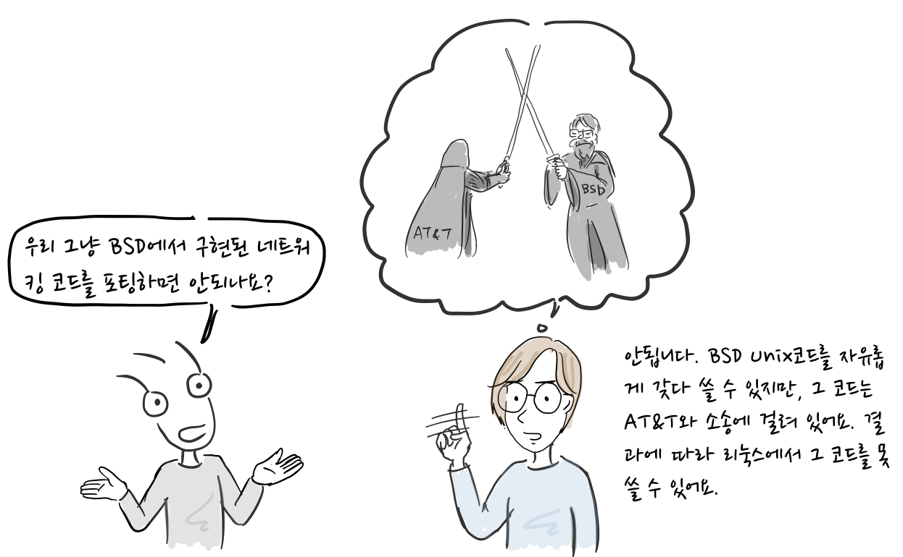

“우리 그냥 BSD에서 구현된 네트워크 코드를 포팅하면 안되나요?”  
“안됩니다. 우리가 BSD 네트워크 코드를 자유롭게 갖다 쓸 수 있지만, [그 코드는 AT&T와 소송에 걸려 있어요.](https://joone.net/2018/01/29/11-bsd-%ec%9c%a0%eb%8b%89%ec%8a%a4-6%ed%99%94-%ec%9e%90%ec%9c%a0%eb%a1%9c%ec%9d%98-%ed%88%ac%ec%9f%81/) 결과에 따라 리눅스에서 그 코드를 못쓸 수 있어요\[1\].”

초기에 이렇게 네트워크 기능을 구현하려고 노력했던 이유는 네트워크 기능 자체 구현 보다는 X-윈도우를 실행하고자 하는 바램이 컸기 때문이다\[1\]. X-윈도우는 X 서버와 클라이언트가 [TCP/IP](https://ko.wikipedia.org/wiki/%EC%9D%B8%ED%84%B0%EB%84%B7_%ED%94%84%EB%A1%9C%ED%86%A0%EC%BD%9C_%EC%8A%A4%EC%9C%84%ED%8A%B8) [소켓(socket) 인터페이스](https://en.wikipedia.org/wiki/Berkeley_sockets)로 통신이 필요했고 이를 위해서는 네트워크 기능이 반드시 필요했다.

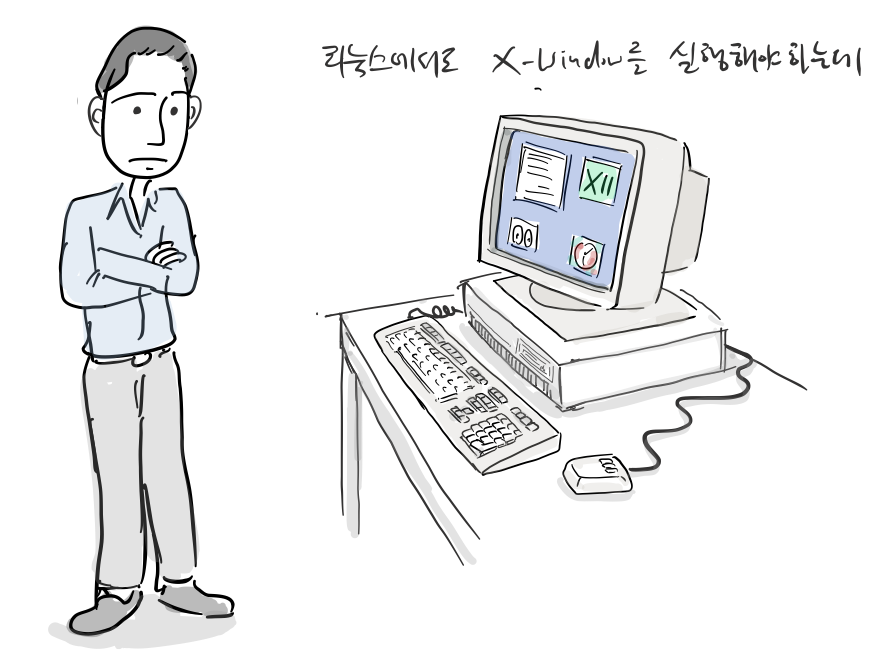

오레스트 즈보로스키(Orest Zborowski)는 X-윈도우를 리눅스에 포팅하면서 간단하게 [BSD 소켓 프로그래밍 인터페이스(socket programming interface)](https://en.wikipedia.org/wiki/Berkeley_sockets)를 구현했다\[2\].

“리눅스에서 X-윈도우를 실행하려면 간단하게라도 소켓 인터페이스가 필요하겠군.”

이 덕분에 많은 네트워크 애플리케이션이 별다른 수정없이 포팅될 수 있었다\[2\].

이제 리눅스에서 소켓 프로그래밍이 가능하네. ftp나 포팅해볼까?

1992년 봄, 리치 스래드키(Rich Sladkey)도 처음으로 리눅스를 설치했다.

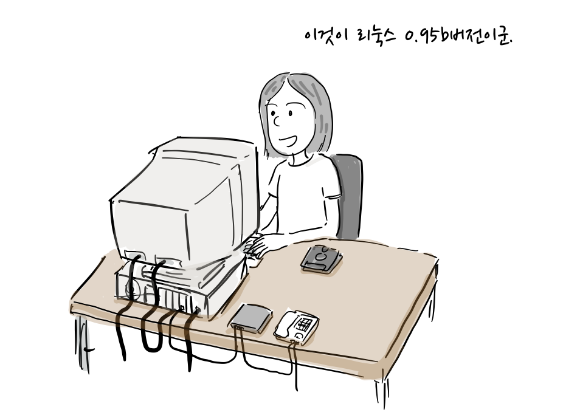

“이것이 리눅스 0.95b버전이군.”

그도 리눅스에 구현된 소켓 인터페이스를 이용해서 NFS 클라이언트 코드를 작성했다.

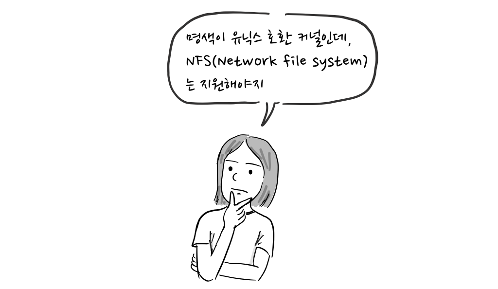

“명색이 유닉스 호환 커널인데, NFS(Network file system)는 지원해야지”

리치는 본격적으로 리눅스에서 NFS 클라이언트를 구현했다. 무엇보다 리눅스에서 원격으로 다른 유닉스 파일시스템을 사용하는 것이 급했다.

“제가 구현한 NFS 클라이언트 알파 버전를 공개합니다. 많이 테스트해주세요.”

“우와. 이제 리눅스에서 원격으로 유닉스 파일시스템에 접근할 수 있다..”  
“우리가 테스트해줄께요.”

이처럼 리치 스래드키가 NFS 클라이언트 코드를 공개하자 호응이 컸고, 비록 알파버전이지만 리눅스 사용자들이 기꺼이 테스트를 도왔다. 왜냐면 그들에게 꼭 필요한 기능이였기 때문이다\[1\].

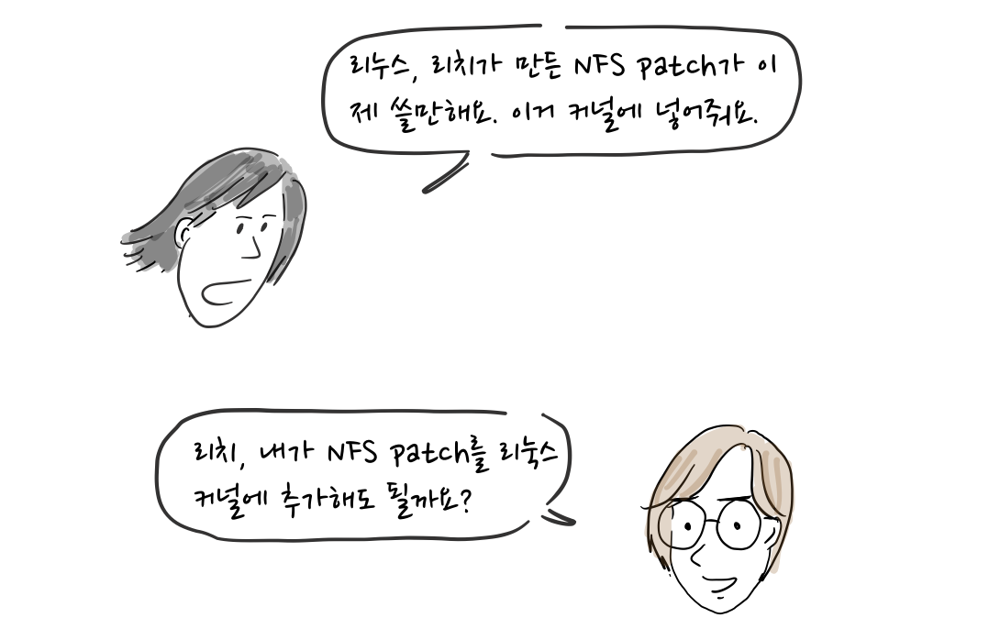

“리누스, 리치가 만든 NFS 패치가 이제 쓸만해요. 이거 커널에 넣어줘요.”

“리치, 내가 리눅스 커널에 NFS 패치를 추가해도 될까?”

“아직 쓸만한지 모르겠지만, 추가하세요.”

리누스는 교육용 OS커널을 만든 타넨바움 교수와 달리 새로운 기능 추가를 언제나 환영했다.

이처럼 리눅스 네트워킹에 대한 기여가 활발해지면서 TCP/IP를 구현한 로스 비로(Ross Biro)가 리눅스 커널 네트워크 코드 개발을 이끌게 된다.

그러나, 그는 리눅스 공동체의 요청과 불만을 감당할 수 없었다.

“버그 언제 잡아요?” “이 API도 필요해요.” “코드가 좀 복잡해요”

“로스, 졸업은 언제하려고 하나? 박사 논문에 집중해야지..”

결국 로스는 리눅스 네트워크 메인테이너에서 물러나고, 이 과정에서 리눅스 네트워킹 코드에 활발히 기여하던 프레드 반 켐펜(Fred van Kempen)이 자청해서 그 자리를 대신했다.

“오.. 이번 기회에 내가 리눅스 네트워킹 모듈 메인테이너가 되자.”

프레드는 리눅스 네트워킹 소프트웨어를 사용하고자하는 방향에 대해 몇 가지 야심찬 계획을 갖고 있었고 이를 실행에 옮겼다.

“여러분 저에게는 비전이 있어요. 리눅스 네트워크 서브 시스템에 계층형 아키텍처(Layered Architecture)를 구현하면 TCP/IP뿐만 아니라 다른 네트워크 프로토톨도 지원할 수 있어요.“

프레드는 NET-2라는 커널 코드(참고로 NET-1은 로스가 작성한 네트워킹 코드)를 작성했고 많은 사람들이 사용하기 시작했다. 여기에 동적 장치 인터페이스, 아마추어 무선 AX.25 프로토콜 지원 및 모듈 식으로 설계된 네트워킹 구현과 같은 혁신적인 기능을 추가했다.

“우선 로스가 만든 코드를 고쳐서 내가 만든 네트워킹 코드를 NET-2라고 부르자.”

프레드가 만든 NET-2 코드는 상당히 많은 수의 매니아들에 의해 사용되었는데, 잘 작동한다는 소문이 퍼지면서 사용자가 늘었다.

“프레드가 만든 NET-2 코드가 잘 동작해. 너도 써봐.”  
“나도 써봤는데, 패치 적용하는게 어렵더라.”

그 당시 프레드가 작성한 NET-2는 리눅스 공식 릴리스에는 포함되지 않았다. 그래서 리눅스 사용자들은 NET-2를 사용하기 위해 NET-FAQ와 [NET-2-HOWTO](https://www.krsaborio.net/linux-kernel/research/1993/0913.html)에 설명된 복잡한 절차를 따라야했다.

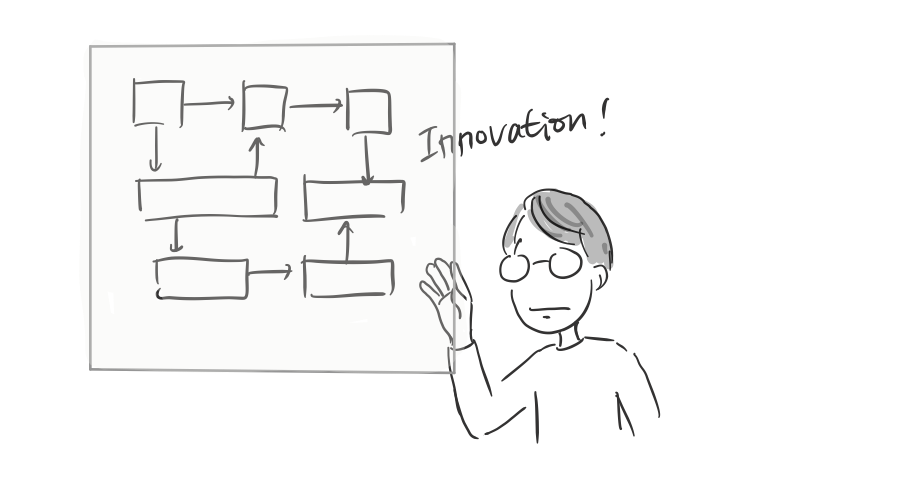

당시 프레드의 초점은 리눅스 커널을 통해 혁신적인 표준 네트워크 구현에 있었고 이는 시간이 걸리는 작업이였다. 이로 인해 구현이 언제 끝날지 알수 없었고, 리눅스 공동체 안에 불안전한 네트워킹 기능에 대한 불만이 커져가고 있었다.

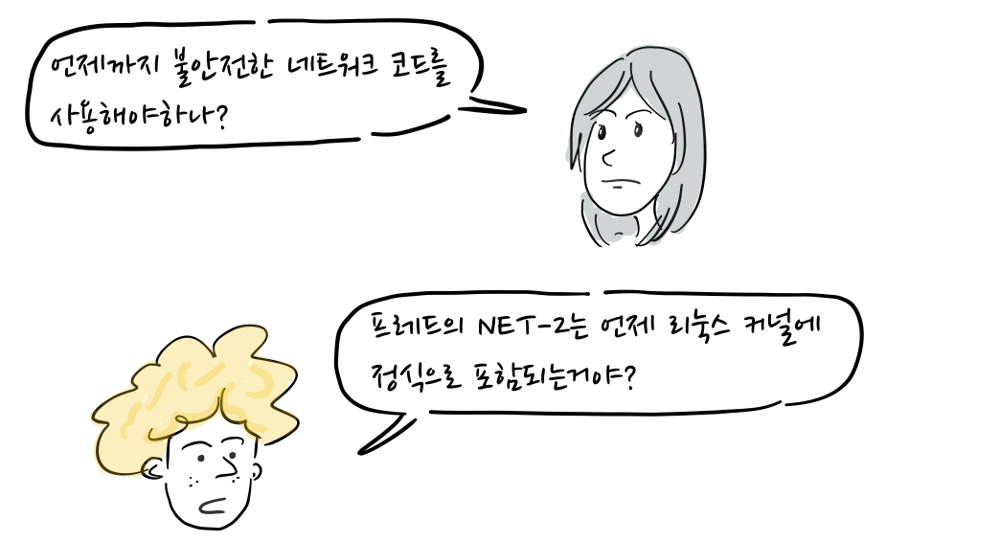

“언제까지 불안전한 네트워크 코드를 사용해야하나?”  
“프레드의 NET-2는 언제 리눅스 커널에 정식으로 포함되는거야?”  
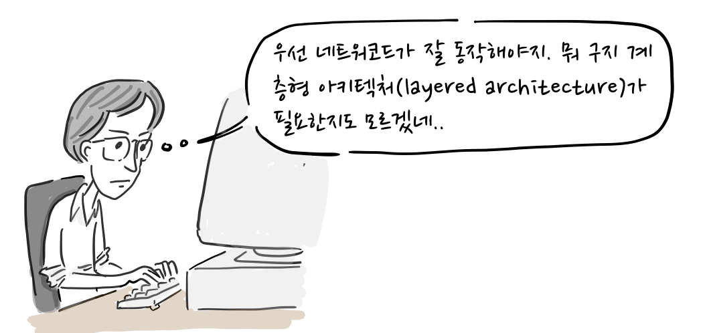

“우선 네트워킹 코드가 잘 동작해야지. 뭐 굳이 계층형 아키텍처(layered architecture)가 필요한지도 모르겠네..”

“음.. 네트워킹 코드가 여전히 문제군. 뭐 해결방안이 없나. 프레드는 감감 무소식이구…”

당시에 [앨런 콕스(Alan Coax)](https://ko.wikipedia.org/wiki/%EC%95%A8%EB%9F%B0_%EC%BD%95%EC%8A%A4)는 리눅스 커널에 기여를 하고 있었는데, 이 상황을 해결하기로 마음을 먹는다.

“프레드가 구현한 NET-2 코드가 쓸만하긴한데, 버그가 많군. 이 친구는 버그 잡는거는 신경을 못쓰고 있고..”

“리누스 내가 프레드가 작업한 NET-2 코드를 디버깅해보지. 우선 리눅스 사용자들의 불만을 잠재우고 프레드가 자기 계획대로 작업을 진행할 수 있도록 해야겠어.”  
“프레드가 패치를 보내기전까지 당분간 그렇게하는 것이 좋겠네.”

물론, 이런 결정을 모두가 환영한 것은 아니였다.

”이렇게 두 사람이 동시에 작업을 하면 나중에 어떻게 머지하려고 하지.”  
“한쪽 방향으로 정리해야하는것 아닌가?”

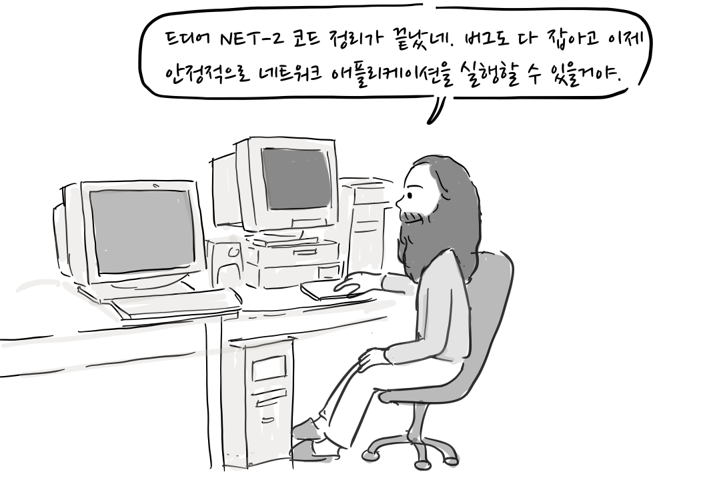

“드디어 NET-2 코드 정리가 끝났네. 버그도 다 잡았고 이제 안정적으로 네트워크 애플리케이션을 실행할 수 있을거야. 이 코드를 NET-2D라 불러야겠군.”

“우와! 드디어 네트워킹 코드가 잘 동작한다.”

앨런 콕스는 자신의 아이디어와 기술로서 NET-2 프로젝트에 기여했으며 NET-2 코드가 나아갈 방향에 관해서 공동체와 많은 토론을 가졌다. 하지만, 프레드의 코드는 여전히 늦어졌고, 공동체와의 토론은 없었다.

결국, 리누스는 궁극적으로 앨런의 개발을 지원했고 중재를 통해 앨런의 네트워크 코드인 NET-2D를 표준 커널 소스 배포판에 포함시켰다. 이후 리눅스 1.0에서 NET-3로 이름을 변경했다\[3\].

프레드는 이러한 상황에 당황했는데, 이는 그의 코드를 테스트해 줄 사용자가 더 이상 없게 된다는 것을 의미했다, 그럼에도 불구하고, 그도 NET-2E 작업을 완료했지만, 그의 코드는 리눅스에 정식으로 반영될 수 없었다\[3\].

“이미 앨런의 NET-2D 코드가 머지된 이상, 내가 계층형 아키텍처를 다 완성해도 코드 머지는 쉽지 않겠구나.”

이로써 앨런 콕스는 리눅스 네트워킹 커널 개발를 이끌게 되었다.

  
리누스 토발즈

“저는 설계에 관심을 가져본적이 없습니다. 항상 실용적인 접근방식을 가졌는데, 잘동작하고 사람들이 사용하기 원하는 것이 좋은 것입니다. 그리고 사람들이 쓰지도 않는데, 누가 그 설계에 관심이나 갖을까요?”

“먼저 동작하게 해야합니다. 그리고 나서 더 좋게 만들면 됩니다.\[1\]”

참고 문헌

\[1\] [Rebel code](https://en.wikipedia.org/wiki/Rebel_Code), Glyn Moody, Perseus publishing, 2001  
\[2\] [Linux Networking-HOWTO](http://tldp.org/HOWTO/NET3-4-HOWTO-4.html#ss4.1)  
\[3\] [https://www.oreilly.com/library/view/linux-network-administrators/1565924002/ch01s04.html](https://www.oreilly.com/library/view/linux-network-administrators/1565924002/ch01s04.html)

[참고로, 등장 인물 간 대화는 자료를 바탕으로 만들어졌습니다. 잘못된 부분이나 추가할 내용이 있으면](https://www.oreilly.com/library/view/linux-network-administrators/1565924002/ch01s04.html) [만화 원고](https://docs.google.com/document/d/1uvgyI3TaOs-ezYYiW9n4elF-oVkFlc22_u83vTDTLFk/edit?usp=sharing)에 직접 의견을 남겨주시면 고맙겠습니다. 그 외 전반적인 만화 후기는 블로그에 바로 답글로 남겨주세요.
