[1992년 1월 리눅스 V0.12가 공개되었을 때](https://mirrors.edge.kernel.org/pub/linux/kernel/Historic/old-versions/RELNOTES-0.12), 리눅스 설치는 지금과 같이 쉽지 않았다. 모든 사람이 리눅스 커널 소스코드를 직접 빌드할 수 없었기 때문에, 리누스 토발즈는 리눅스 커널 바이너리가 포함된 부팅 디스켓과 루트 파일 시스템 디스켓을 자신이 다니고 있는 헬싱키 대학 ftp 서버에 올려놓고 자유롭게 다운로드 받도록 했다.

“이제 집에 있는 386PC에도 유닉스를 사용할 수 있다.”  
“정말?”

“물론 진짜 유닉스는 아니고, 리눅스라고 유닉스의 일종이지.”

“리누스 토발즈가 직접 빌드한 리눅스 커널 바이너리와 루트파일 시스템을 핀란드 대학 ftp 서버에 올려놓았어. 누구나 다운로드 받아서 한번 실행해볼 수 있지.”  
“그래? 한번 시도해보자.”

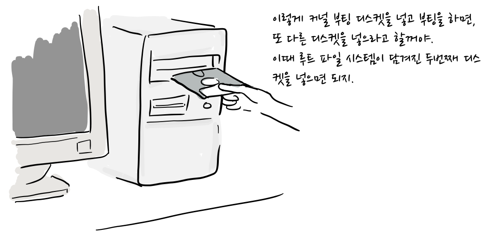

“이렇게 커널 부팅 디스켓을 넣고 부팅을 하면, 또 다른 디스켓을 넣으라고 할꺼야. 이때 루트 파일 시스템이 담겨진 두번째 디스켓을 넣으면 되지.”

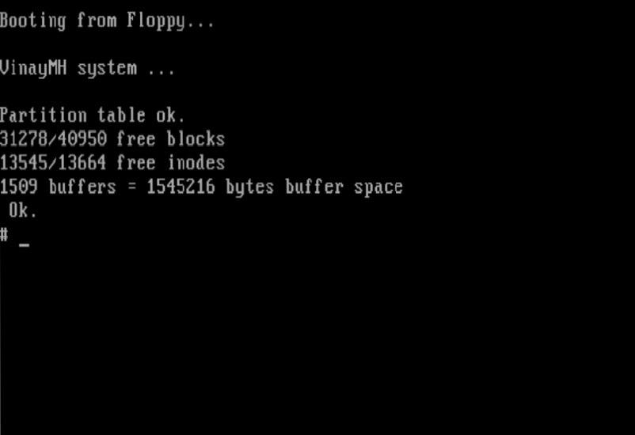

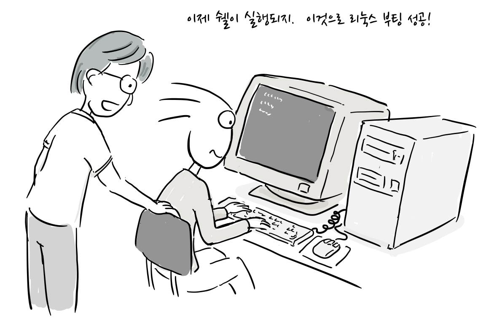

“이제 쉘이 실행되지. 이것으로 리눅스 부팅 성공!”

“그럼, X-Window는 어떻게 설치해?”

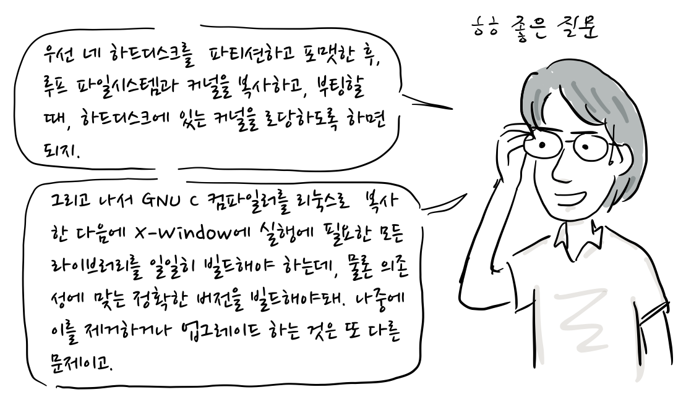

“우선 네 하드디스크를 파티션하고 포맷한 후, 루프 파일시스템과 커널을 복사하고, 부팅할 때, 하드디스크에 있는 커널을 로딩하도록 하면 되지.”

“그리고 나서 GNU C 컴파일러를 리눅스로 복사한 다음에 X-Window에 실행에 필요한 모든 라이브러리를 일일히 빌드해야 하는데, 물론 의존성에 맞는 정확한 버전을 빌드해야돼. 나중에 이를 제거하거나 업그레이드 하는 것은 또 다른 문제이고.”

너무 복잡하다!!

이처럼 초기에는 리눅스 커널을 설치한 후, 원하는 소프트웨어를 설치하려면 직접 소스코드를 구해서 빌드해서 설치하는 것이 유일한 방법이었다. 이 문제를 해결하기 위해 오늘날의 우분투 배포본과 같이 리눅스 설치 디스켓을 만드는 사람들이 나타났다.

영국 맨체스터 대학 소속의 Machester computing centre(MCC)는 리누스 토발즈가 올린 리눅스 설치 파일을 미러링하다가, 1992년 2월 처음으로 리눅스 커널 0.12를 가지고 설치 디스켓을 만들었다.

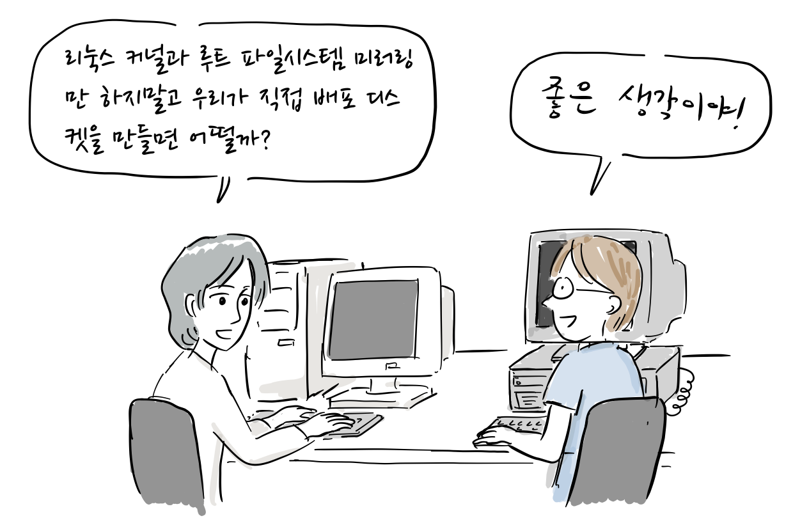

“리눅스 커널과 루트 파일시스템 미러링만 하지말고 우리가 직접 배포 디스켓을 만들면 어떨까?”

데이브 사포드(Dave Safford)도 이와 비슷한 TAMU(Texas A&M University) 릴리스를 만들었다.

마틴 주니어스(Martin Junius)는 MJ라는 리눅스 설치 디스켓을 만들었는데, 이를 기반으로 피터 맥도널드(Peter MacDonald)가 SLS(Softlanding Linux System)이라는 배포본을 만든다.

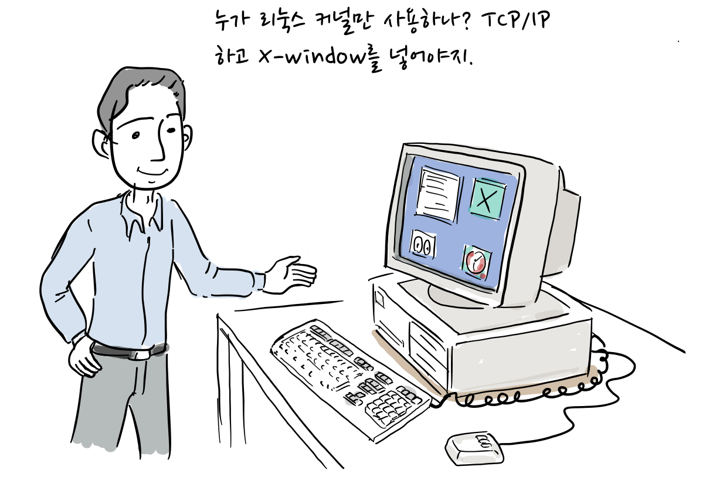

“누가 리눅스 커널만 사용하나? TCP/IP하고 X-window를 넣어야지.”

SLS는 큰 인기를 끌었고 훗날 [슬랙웨어](https://ko.wikipedia.org/wiki/%EC%8A%AC%EB%9E%99%EC%9B%A8%EC%96%B4)로 발전한다. SLS가 인기있었던 이유는 오늘날의 배포본 처럼 기본 유틸리티와 X-Window와 TCP/IP를 포함하고 있었기 때문이다.

하지만 리눅스 커널이 빠른 속도로 발전함에 따라 최신 버전으로 커널을 업데이트하기가 어려워졌고, 완전한 솔루션이지만, 테스트가 충분히 이루어지지 않아 버그도 많았다.

미국 퍼듀 대학의 학부생이였던, [이안 머독(Ian Murdock)](https://ko.wikipedia.org/wiki/%EC%9D%B4%EC%96%B8_%EB%A8%B8%EB%8F%85)은 SLS 배포본의 문제를 심각하게 생각하고 있었다.

“SLS는 버그가 많고 제대로 관리가 안되고 있는데, 안타깝게도 인기가 많아. 만든 사람은 분명 좋은일을 하고 있지만, 문제가 많아.”

“그래도 이만한 배포본이 어디 있어? 모든 것을 다 제공하잖아? 어떻게 한 사람이 모든 것을 다 테스트해? 현 상황에서 SLS은 거의 유일한 리눅스 배포본이야. 그냥 쓸 수 밖에…”

“리눅스 배포본 개발도 리눅스 커널과 같은 개발 모델을 따라야해. 공동체를 만들어 함께 패키지를 만들고 테스트하는거지. 그래, 리눅스는 그냥 소프트웨어가 이니라 개발 방법론이지.”

“좋은 아이디어라도 있어?”

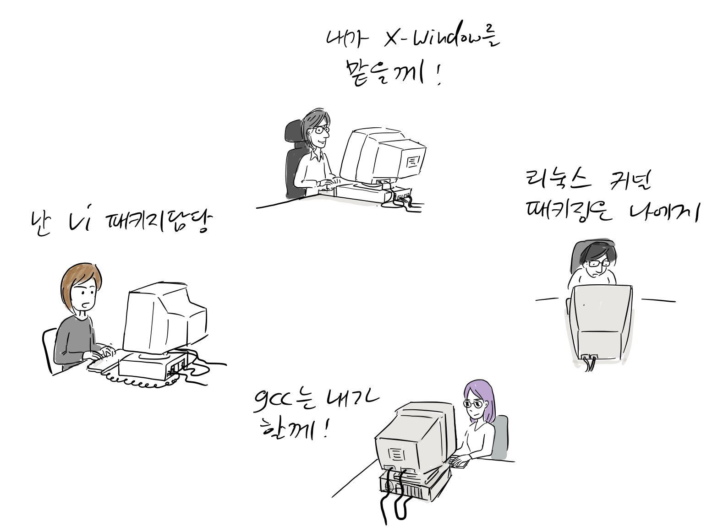

“개발 공동체는 모두 인터넷에 연결되어 있고,  
각자 하나의 패키지를 맡아 릴리스하고 사용자가 테스트하는 거야.”

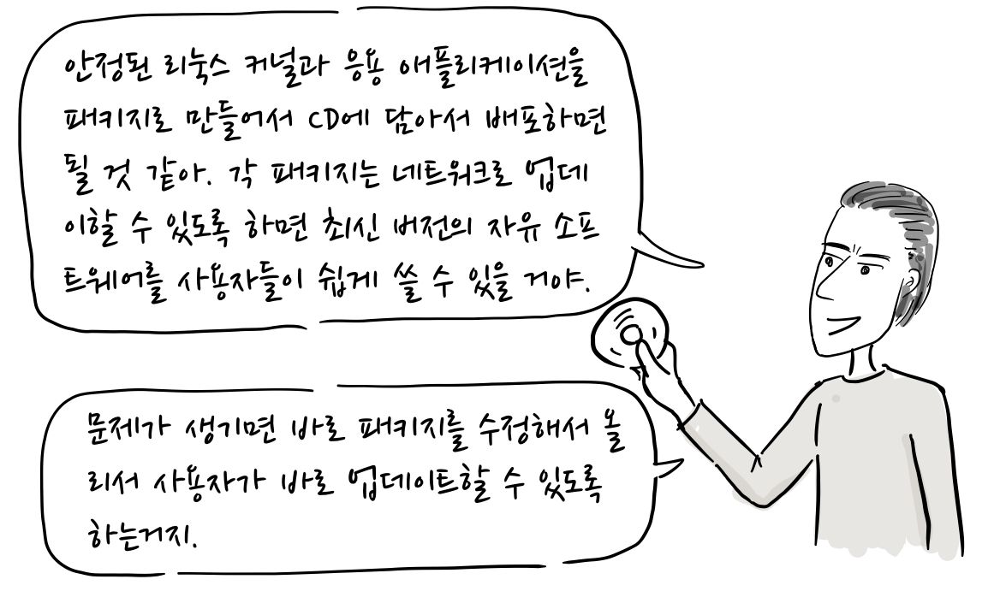

“안정된 리눅스 커널과 응용 애플리케이션을 패키지로 만들어서 CD에 담아서 배포하면 될 것 같아. 각 패키지는 네트워크로 업데이트할 수 있도록 하면 최신 버전의 자유 소프트웨어를 사용자들이 쉽게 사용할 수 있을 거야.”

“문제가 생기면 바로 패키지를 수정해서 올려서 사용자가 바로 업데이트할 수 있도록 하는거지.”

“좋은 생각이긴한데, 누가 이 일을 시작할 수 있겠어?”

“내가 프로젝트를 만들어서 시작하면 되지. 흠.. 프로젝트 이름은 뭘로할까? 네 이름과 내 이름을 합하면, 데브라 + 이안 => 데비안.”

1993년 8월, 이안 머독은 누구나 쉽게 리눅스를 PC에 설치할 수 있는 배포판을 만들기 위해 데비안 프로젝트 시작하고, 이를 인터넷 공개 포럼에 알린다.

“제가 데비안이라는 리눅스 배포본 프로젝트를 시작하려고 하는데, 패키징 작업을 도와줄 사람이 있나요?”

이것이 바로 공동체에 의한 최초의 리눅스 배포판인 데비안 프로젝트의 시작이다. 데비안 프로젝트는 기본적으로 같은 리눅스 커널과 비슷한 개발 모델을 공유하고 있다.

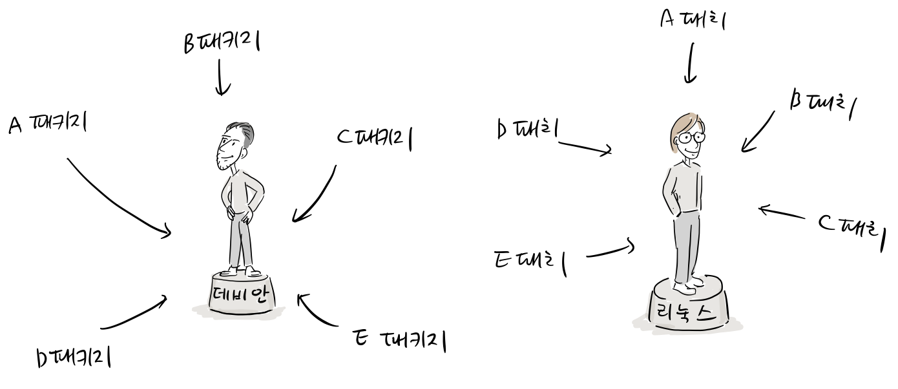

데비안: 패키지라는 아이디어를 기반으로 각 개발자는 패키지의 책임자가 된다.  
리눅스: 리눅스 역시 각 모듈을 책임지는 커미터가 있고, 이들이 각 모듈의 개발과 테스트 및 통합을 책임진다.

이 모든 작업은 한 사람에 의해 지휘된다. 물론, 공동체의 의견에 귀를 기울이지만, 최종 결정은 한 사람에 의해 결정된다.

새로운 배포본을 바닥 부터 개발하는 것은 시간이 오래 걸리는 작업이였다. 프로젝트 시작을 알린 8월 부터 그해 12월까지 데비안 0.01부터 데비안0.90이 릴리스 되었고, 94년 1월에 0.91이 릴리스되었지만, 아주 기본적인 패키징 시스템이었다.

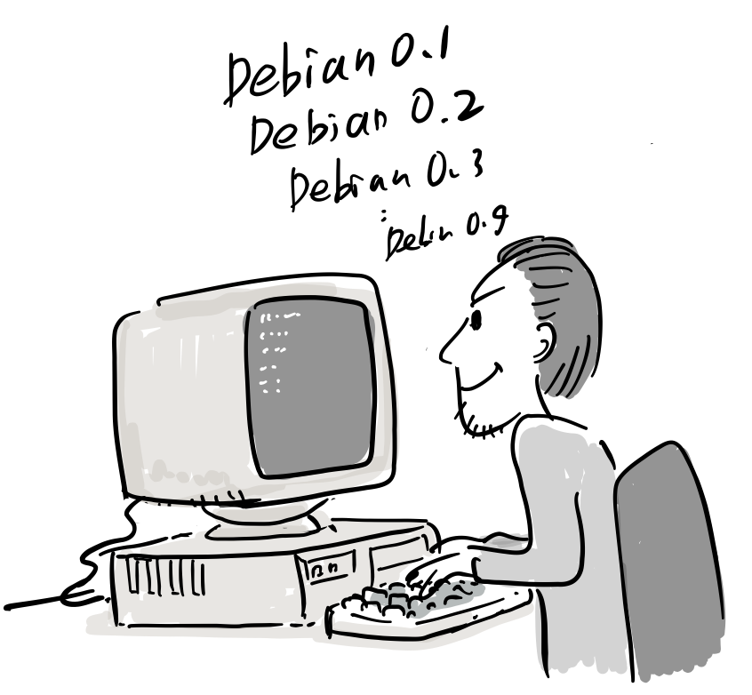

오늘날 처럼 의존성이 확인되는 기능은 없었고 12명 정도가 개발에 참여하고 있었다. 1994년 이안은 대부분의 시간을 [dpkg(데비안 패키지 관리도구)](https://ko.wikipedia.org/wiki/Dpkg)을 개발을 진행했다. 패키지 릴리스는 이안 젝슨(Ian Jackson)이 맡았고 그 해에는 공식 릴리스는 없이 내부 릴리스만 있었다.

당시 데비안 프로젝트는 개발자와 사용자들이 기여할 수 있는 유일한 공개 배포본 프로젝트였고, 이 소식은 FSF에도 알려졌다. FSF는 초기(1994.11 ~ 1995.11)에 프로젝트가 자리를 잡을 수 있도록 후원을 하게 된다.

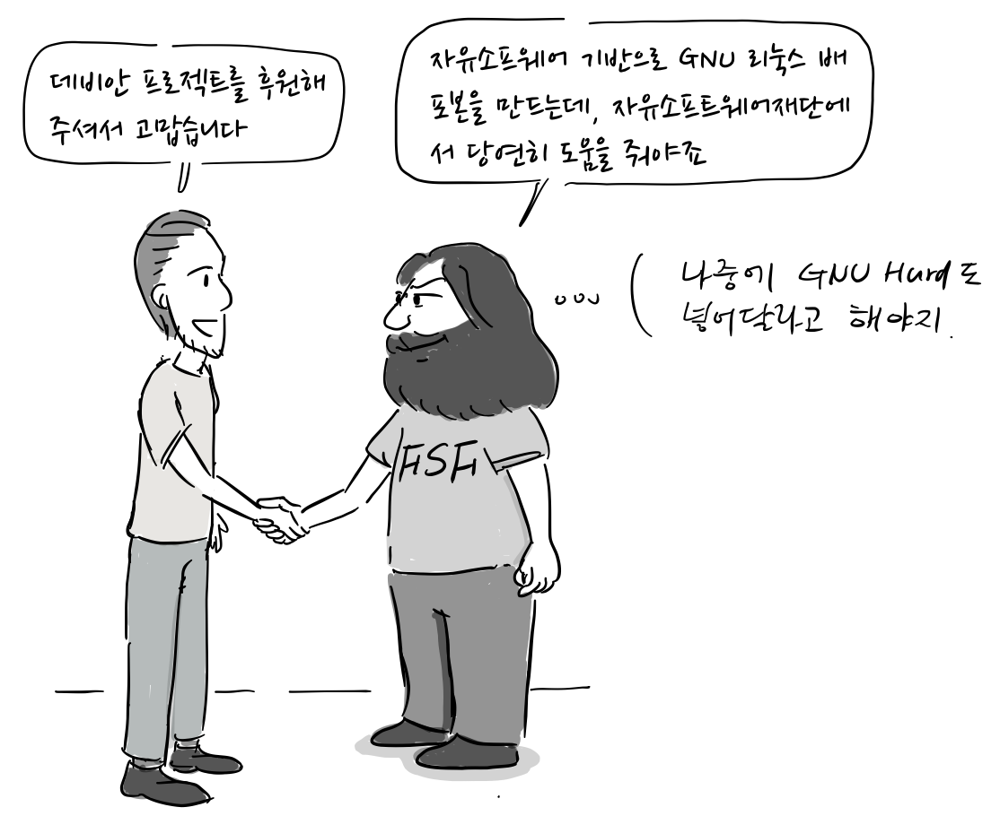

“데비안 프로젝트를 후원해주셔서 고맙습니다”  
“자유소프트웨어 기반으로 GNU 리눅스 배포본을 만드는데, 자유소프트웨어재단에서 당연히 도움을 줘야죠”

1995년 3월, 0.93 R5가 공식적으로 릴리스되었고 드디어 오늘날과 같은 현대적인 패키징 시스템이 탄생했다. 이때가 되어서야 비로서 각 패키지마다 책임자가 있었고 dpkg 툴을 이용해서 패키지를 설치할 수 있었다. 그해 11월, 0.93 R6가 릴리스될때는 60여명의 패키지 관리자가 있었고, 패키지 관리툴인 [dselect](https://en.wikipedia.org/wiki/Dselect)가 처음 선보였다.

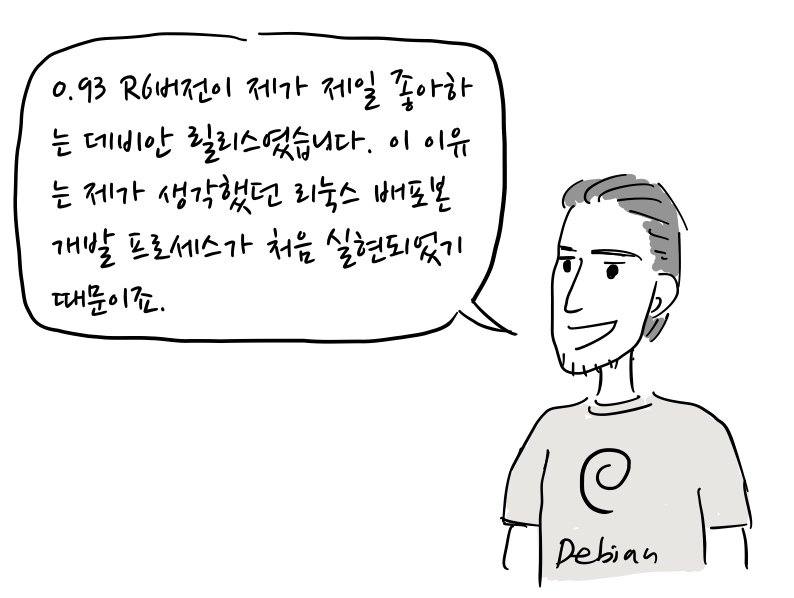

“0.93 R6버전이 제가 제일 좋아하는 데비안 릴리스였습니다. 이 이유는 제가 생각했던 리눅스 배포본 개발 프로세스가 처음 실현되었기 때문이죠.”

이후 이안은 결혼과 함께 자신의 학위를 끝내기 위해 데비안 리더 자리에서 물러나고 후임으로 초기 부터 데비안 프로젝트에 참여해온 [브루스 페렌스(Bruce Perens)](https://en.wikipedia.org/wiki/Bruce_Perens)를 지명한다.

당시 데비안은 업그레이드 될때 시스템의 일관성을 보장하기 위해 패키지 간의 의존성을 확인해서 의존성이 있는 패키지 함께 설치되거나 업데이트 되는 패키징 시스템이었다. 무엇보다는 일체의 상업성을 배제했고 순수 공동체에 의해 개발되고 관리되었다.

**오늘날의 데비안 패키지**

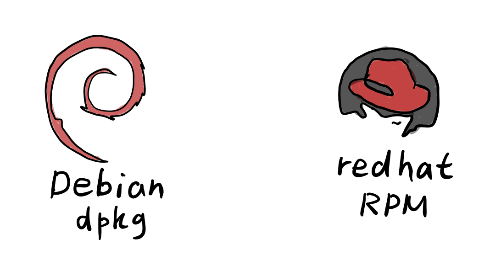

오늘날의 데비안 패키지는 [레드햇](https://ko.wikipedia.org/wiki/%EB%A0%88%EB%93%9C%ED%96%87)의 [RPM](https://ko.wikipedia.org/wiki/RPM_%ED%8C%A8%ED%82%A4%EC%A7%80_%EB%A7%A4%EB%8B%88%EC%A0%80)과 더불어 리눅스의 양대 패키지 시스템으로 자리잡았다.

우분투를 비롯한 많은 리눅스 배포판이 바로 데비안 패키지를 기반으로 하고 있고, 윈도10과 크롬OS도 데비안 패키지를 지원한다. 데비안 배포본은 안정성을 중요시해서, 충분히 검증된 Stable 패키지를 공식 배포본에 사용한다.

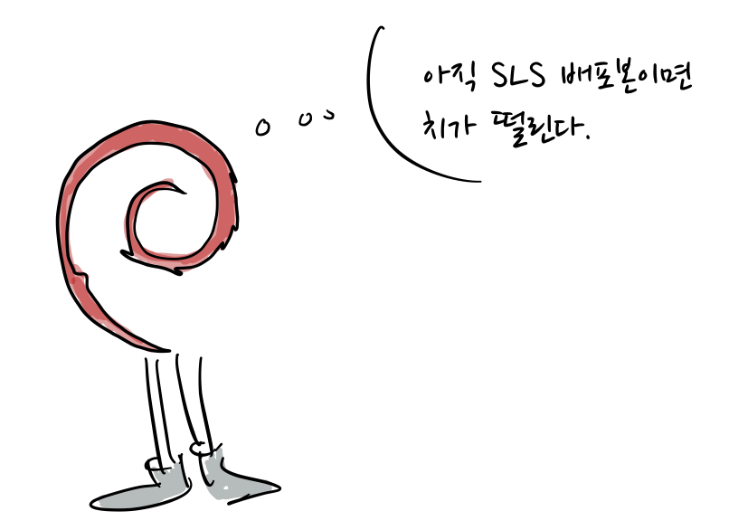

“아직 SLS 배포본이면 치가 떨린다”

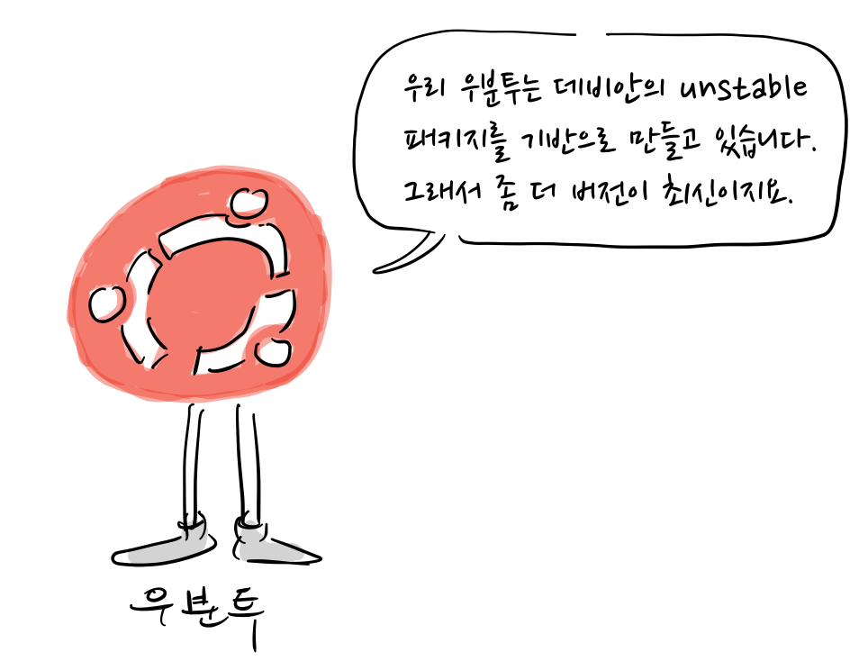

“우리 우분투는 데비안의 unstable 패키지를 기반으로 만들고 있습니다. 그래서 좀 더 버전이 최신이지요. 물론, 약간 불안정할 수 있어요.”

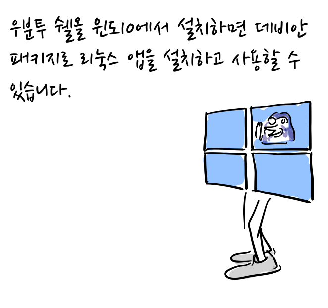

“[데비안이나 우분투 쉘을 윈도10에서 설치하면 데비안 패키지로  
리눅스 앱을 설치하고 사용할 수 있습니다.](https://docs.microsoft.com/en-us/windows/wsl/install-win10)”

“[우리도 데비안 패키지를 지원합니다](https://support.google.com/chromebook/answer/9145439?hl=en). 리눅스 앱을 바로 실행할 수 있습니다.”

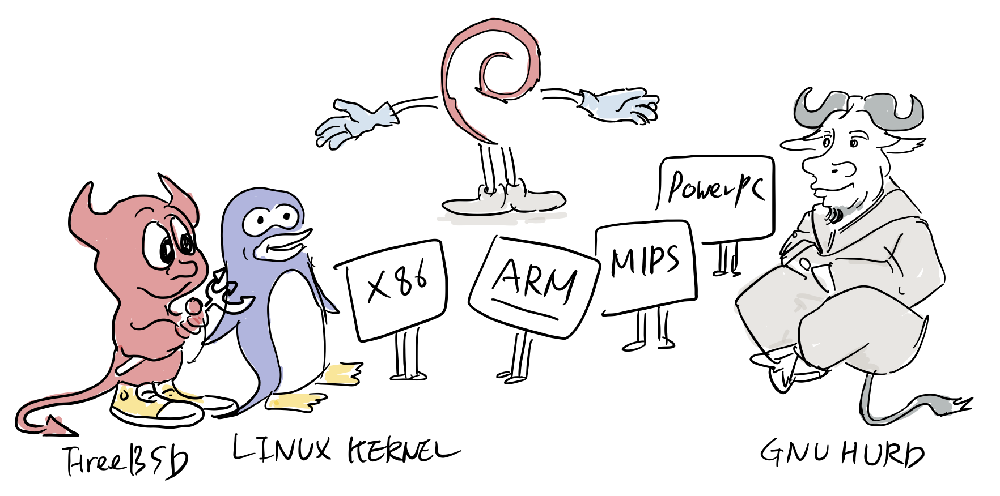

현재 데비안은 리눅스 커널 뿐만 아니라, BSD, GNU 허드와 같은 OS커널을 지원한다. 또한 X86과 ARM 뿐만 아니라 MIP와 PowerPC 등 다양한 CPU 아키텍쳐를 지원하고 있다. 매년 [DebConf](https://www.debconf.org/)를 열어 개발자들이 함께 모여 아이디어를 공유하고 데비안 프로젝트 발전 방향을 토론하는 자리를 마련하고 있다.

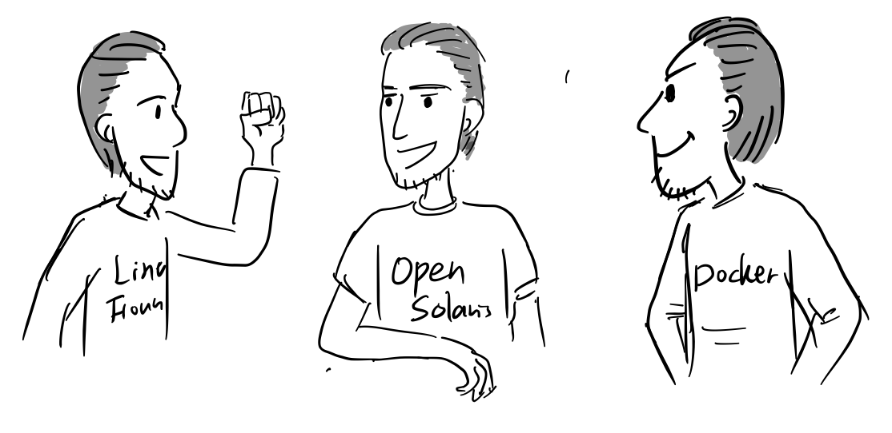

이안 머독은 데비안 프로젝트를 떠난 후, [리눅스 재단](https://www.linuxfoundation.org/) 최고 기술 책임자로 10년간 일을 했고, 썬 마이크로시스템에서 [오픈 솔라리스](https://ko.wikipedia.org/wiki/%EC%98%A4%ED%94%88%EC%86%94%EB%9D%BC%EB%A6%AC%EC%8A%A4)와 공동체를 만드는 일을 했고, 42세에 세상을 떠나기전까지 [도커(Docker)](https://ko.wikipedia.org/wiki/%EB%8F%84%EC%BB%A4_\(%EC%86%8C%ED%94%84%ED%8A%B8%EC%9B%A8%EC%96%B4\))에서 일을 했다.

Docker CEO는 공식으로 다음과 같이 그의 죽음을 애도하였다.

“데비안은 현재까지 진행된 최초 리눅스 배포판 중 하나로, 성공한 오픈소스프로젝트 중 하나로 꼽힙니다. 이안은 오픈 디자인, 오픈 컨트리뷰션을 통해 오픈 프로젝트와 공동체 개념을 개척했습니다. “

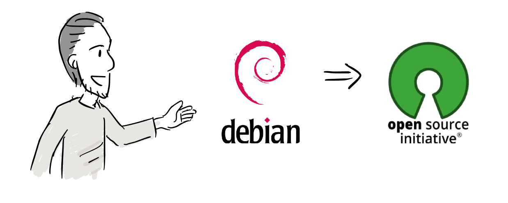

“사실, 오픈소스 개념을 개념을 정립한 [The Open Source Definition](https://opensource.org/osd)이라는 문서는 데비안에서 가져온 것입니다.”

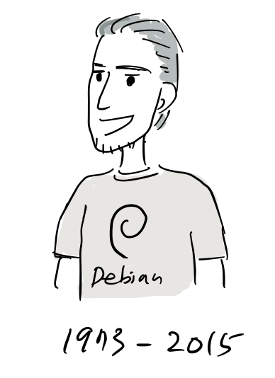

“현재 데비안 개발에 1,000명 이상이 참여하고 있는데, 이는 개방성과 공동체에 대한 이안의 약속에 대한 증거로 볼 있습니다.”

참고

\[1\] [Rebel Code](https://en.wikipedia.org/wiki/Rebel_Code), Glyn Moody, 2001  
\[2\] [A Brief History of Debian](https://www.debian.org/doc/manuals/project-history/) ([한글](https://www.debian.org/doc/manuals/project-history/index.ko.html))  
\[3\] [데비안 리눅스 창시자, 이안 머독 사망](http://www.zdnet.co.kr/view/?no=20151231094603), ZDNet  
\[4\] [In Memoriam: Ian Murdock](https://www.docker.com/blog/ian-murdock/), Docker  
\[5\] [The Open Source Definition](https://opensource.org/osd)  
\[6\] [Debian Project](https://www.debian.org/)

