#### Qt의 시작

1990년 하바드 노드(Haavard Nord)와 아이릭 참베(Eirik Chambe-Eng)는 노르웨이 공과대학에서 전산학을 공부하는 대학원생이였다.

“아이릭, 나하고 프로그램 하나 개발 안할래?” “뭔데?”

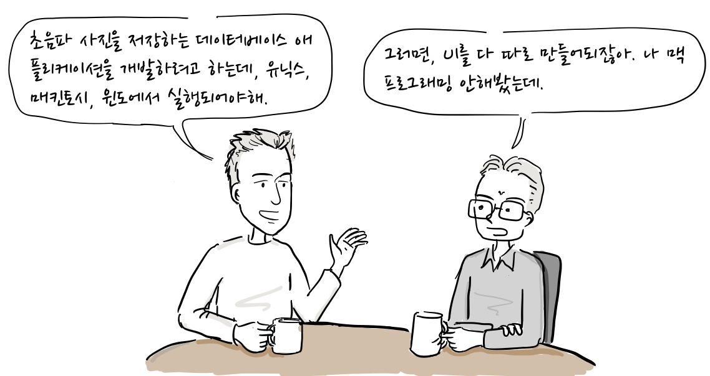

“초음파 사진을 저장하는 데이터베이스 애플리케이션을 개발하려고 하는데, 유닉스, 매킨토시, 윈도에서 실행되어야해.” “그러면, UI를 전부 따로 만들어야 되잖아. 나 맥 프로그래밍 안해봤는데..”

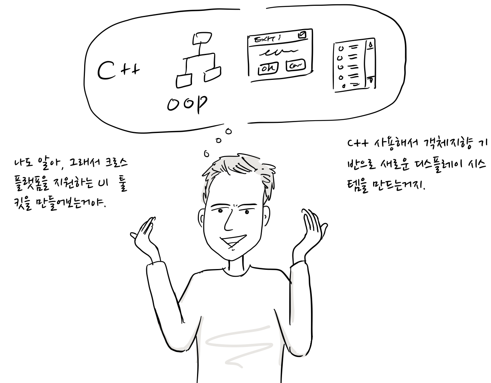

“나도 알아, 그래서 크로스 플랫폼을 지원하는 UI 툴킷을 만들어보는거야. C++ 사용해서 객체지향 기반으로 새로운 디스플레이 시스템을 만드는거지.”

두 사람은 이 때 부터 C++으로 GUI 툴킷 개발을 시작한다.

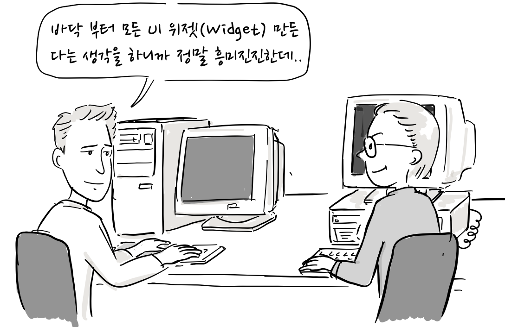

“바닥 부터 모든 UI 위젯(Widget) 만든다는 생각을 하니까 정말 흥미진진한데..”

“드디어 개발이 끝났네.”

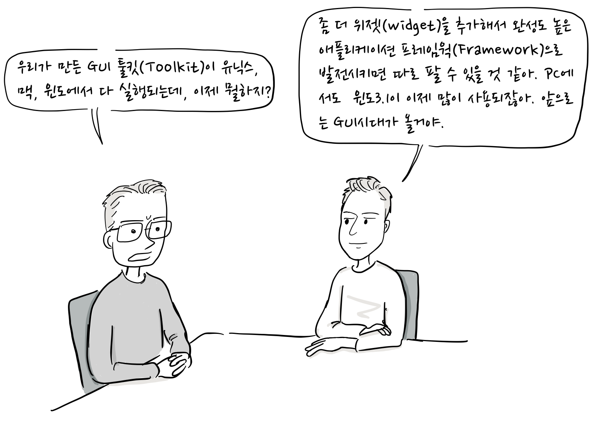

“우리가 만든 GUI 툴킷(Toolkit)이 유닉스, 맥, 윈도에서 다 실행되는데, 이제 뭘하지?” “좀 더 위젯(widget)을 추가해서 완성도 높은 애플리케이션 프레임웍(Framework)으로 발전시키면 따로 팔 수 있을 것 같아. PC에서도 윈도3.1이 이제 많이 사용되잖아. 앞으로는 GUI시대가 올거야.”

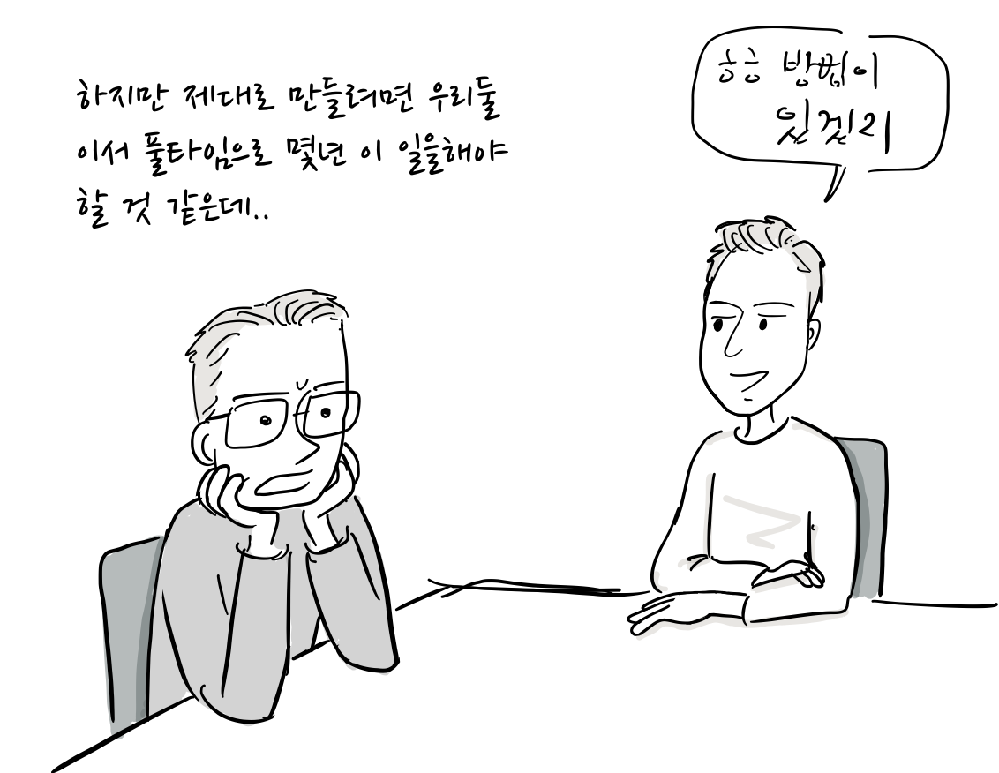

“하지만 제대로 만들려면 우리둘이서 전업으로 몇년 이 일을해야할 것 같은데..” “ㅎㅎ 방법이 있겠지.”

1994년 3월 4일 하바드와 아이릭은 Quasar Technologies라는 회사를 차리고 본격적으로 개발에 몰두한다. (나중에 Trolltech로 회사 이름을 변경한다)

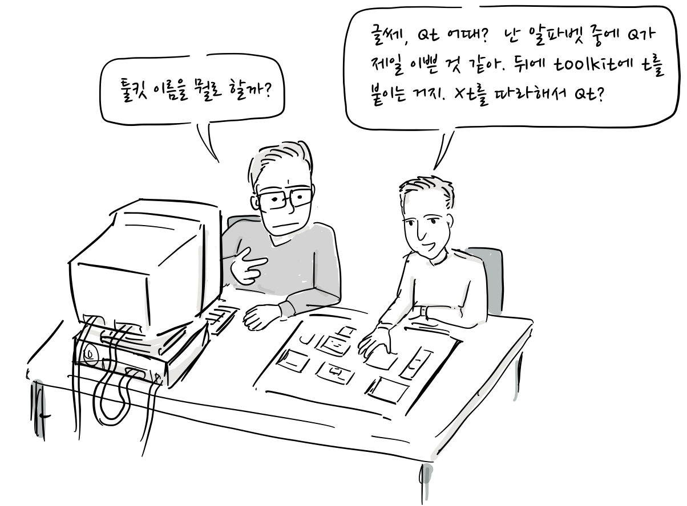

“툴킷 이름을 뭘로 할까?” “글쎄, Qt 어때? 난 알파벳 중에 Q가 제일 이쁜 것 같아. 뒤에 toolkit에 t를 붙이는 거지. Xt를 따라해서 Qt?”

어느날 모교 교수로 부터 전화가 왔다.

“하바드군 자네가 창업을 했다고 들었네, 내가 아는 분이 소프트웨어 개발을 원하는데 가능한가?”

“물론이죠 교수님”

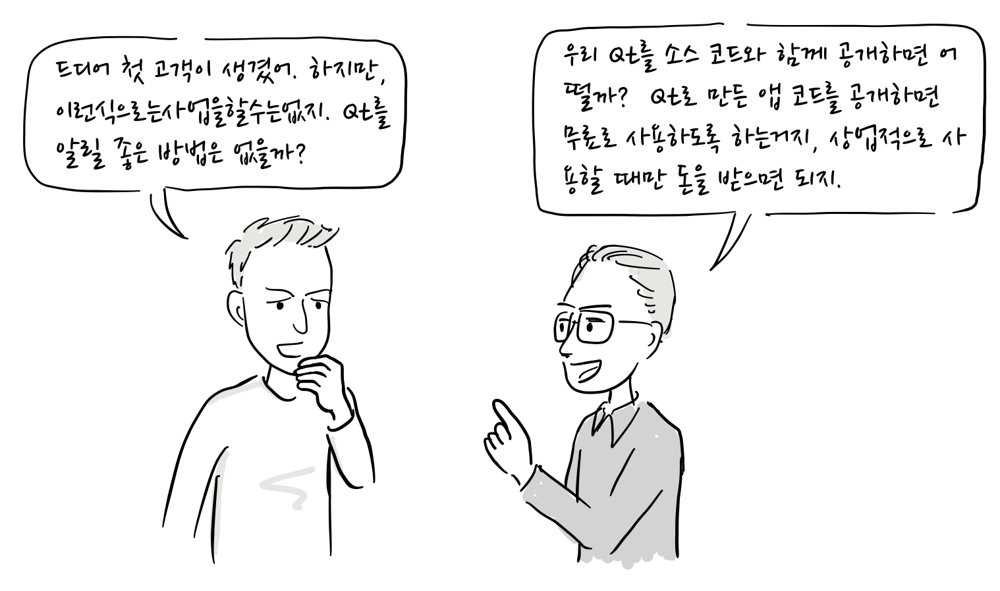

“드디어 첫 고객이 생겼어. 하지만, 이런식으로는사업을할수는없지. Qt를 알릴 좋은 방법은 없을까?” “우리 Qt를 소스 코드와 함께 공개하면 어떨까? Qt로 만든 앱 코드를 공개하면 무료로 사용하도록 하는거지, 상업적으로 사용할 때만 돈을 받으면 되지.”

1995년 5월 20일 Qt 0.90 버전이 sunsite.unc.edu 에 업로드되었고, 6일 후에 comp.os.linux.announce에 그 사실을 알렸다. 이것이 바로 Qt의 첫번째 공개 릴리스였고, Qt Free edition 라이선스로 공개되었다. 이 라이선스는 비록 소스코드는 공개되었으나, 재배포를 허락하지 않아 [자유 소프트웨어 재단(FSF)](https://ko.wikipedia.org/wiki/%EC%9E%90%EC%9C%A0_%EC%86%8C%ED%94%84%ED%8A%B8%EC%9B%A8%EC%96%B4_%EC%9E%AC%EB%8B%A8)가 정의한 [자유 소프트웨어 정의](https://ko.wikipedia.org/wiki/%EC%9E%90%EC%9C%A0_%EC%86%8C%ED%94%84%ED%8A%B8%EC%9B%A8%EC%96%B4%EC%9D%98_%EC%A0%95%EC%9D%98)와는 호환되지 않았고, 이 문제는 1.45버전까지 계속된다.

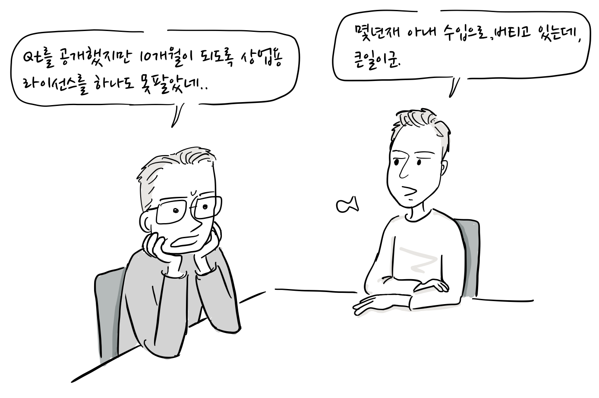

“Qt를 공개했지만 10개월이 되도록 상업용 라이선스를 하나도 못팔았네..” “몇년째 아내 수입으로 버티고 있는데, 큰일이군.”

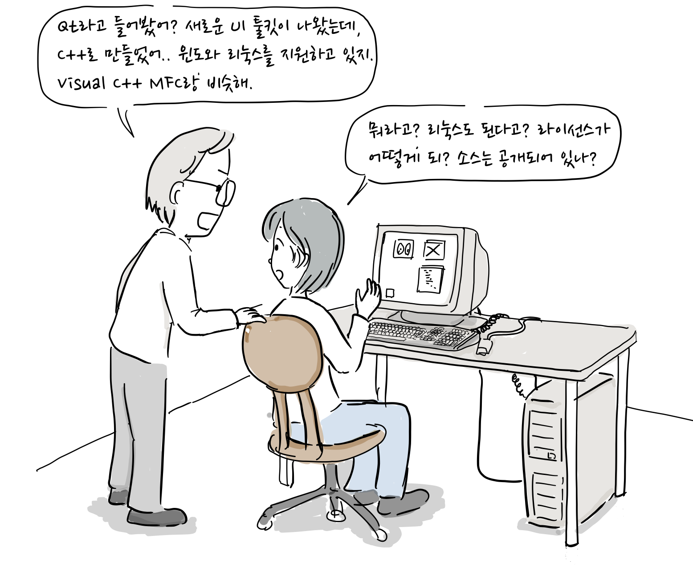

“Qt라고 들어봤어? 새로운 UI 툴킷이 나왔는데, C++로 만들었어.. 윈도와 리눅스를 지원하고 있지. Visual C++ MFC랑 비슷해.” ”뭐라고? 리눅스도 된다고? 라이선스가 어떻게 되? 소스는 공개되어 있나?”

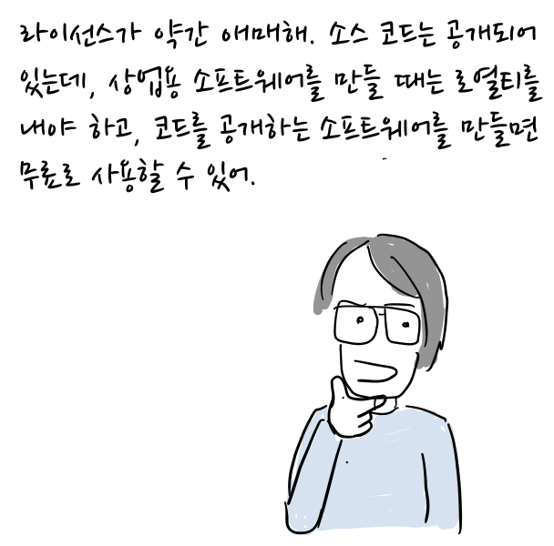

“라이선스가 약간 애매해. 소스 코드는 공개되어 있는데, 상업용 소프트웨어를 만들 때는 로열티를 내야 하고, 코드를 공개하는 소프트웨어를 만들면 무료로 사용할 수 있어.”

1996년 3월, 유럽 우주국(the European Space Agency)이 Qt의 두번째 고객이 된다.

“드디어 두번째로 Qt 라이선스를 파는구나.“

1996년 Qt 1.0이 출시되고 그해말, Qt가 1.1이 될때까지 18개의 라이선스를 판매한다.

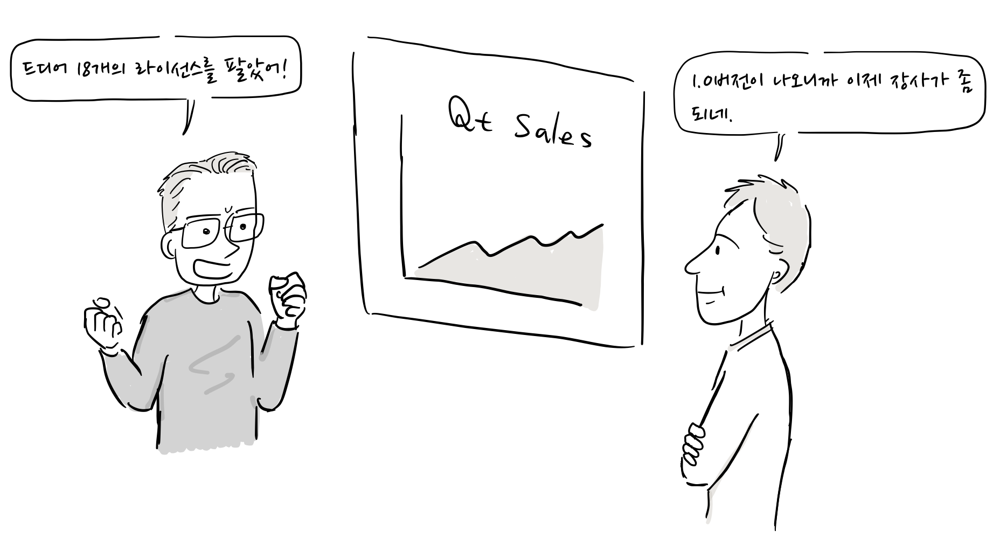

“드디어 18개의 라이선스를 팔았어!” “1.0버전이 나오니까 이제 장사가 좀 되네.”

#### KDE 프로젝트 시작

독일 출신의 마티아스 에트리히(Matthias Ettrich)는 LyX 프로젝트를 진행하다가, GUI를 만들 목적으로 Qt를 접하게 된다.

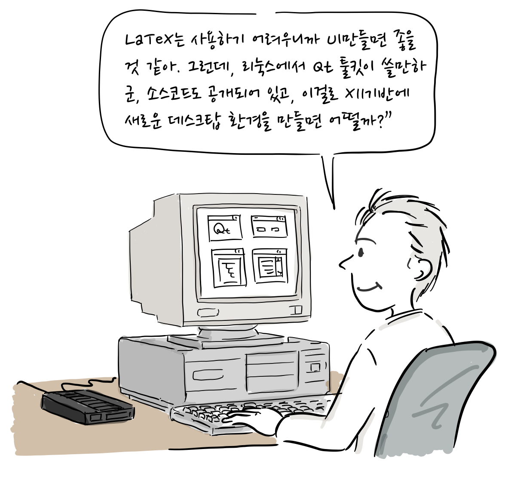

“LaTeX는 사용하기 어려우니까 UI만들면 좋을 것 같아. 그런데, 리눅스에서 Qt 툴킷이 쓸만하군, 소스코드도 공개되어 있고, 이걸로 X11기반에 새로운 데스크탑 환경을 만들면 어떨까?”

그는 이러한 생각을 여러 인터넷 뉴스 그룹에 공유했고, 반응은 폭발적이였다.

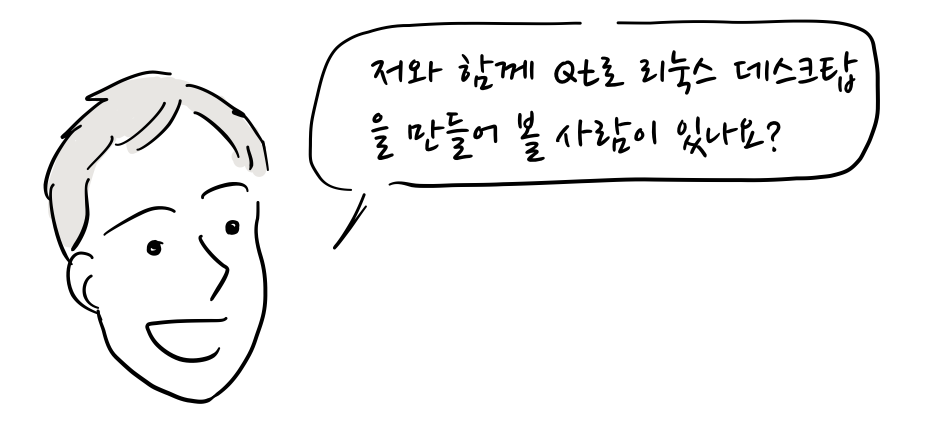

“저와 함께 Qt로 리눅스 데스크탑을 만들어 볼 사람이 있나요?”

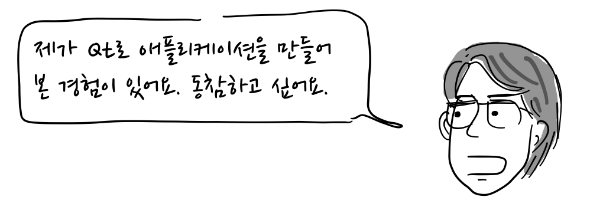

“제가 Qt로 애플리케이션을 만들어 본 경험이 있어요. 동참하고 싶어요.”

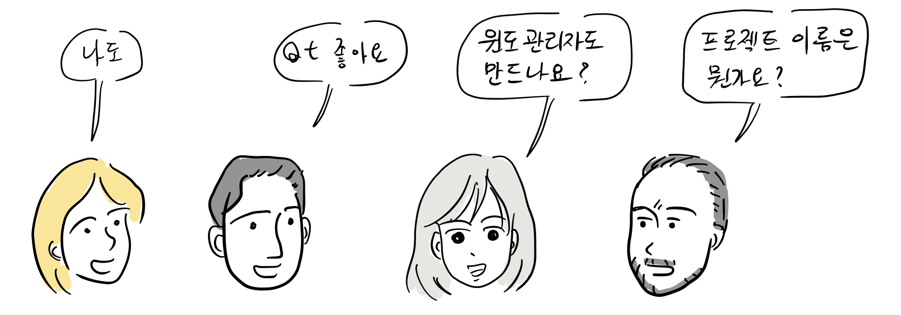

“나도”, “Qt 좋아요.”, “윈도 관리자도 만들어요?”, “프로젝트 이름이 뭔가요?”

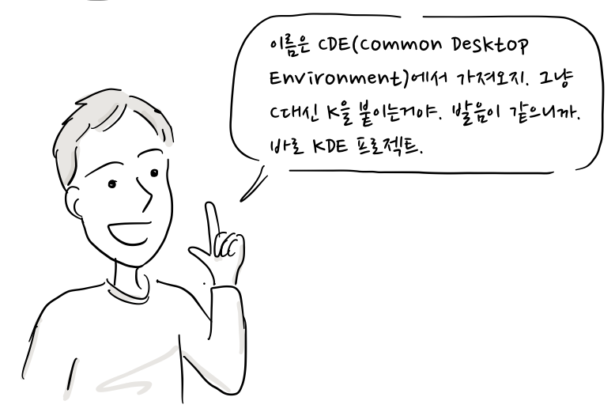

“이름은 CDE(Common Desktop Environment)에서 가져오지. 그냥 C대신 K을 붙이는거야. 발음이 같으니까. 바로 KDE 프로젝트.”

1996년 이렇게 KDE 프로젝트는 시작된다

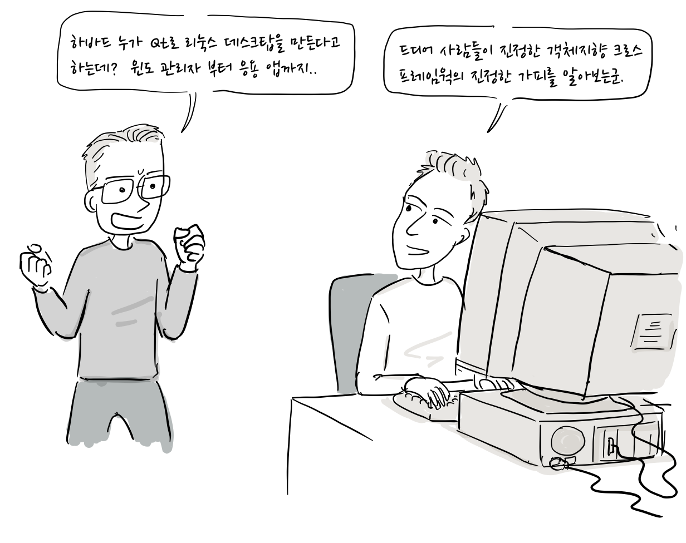

“누가 Qt로 리눅스 데스크탑을 만든다고 하는데? 윈도 관리자 부터 응용 앱까지..” “드디어 사람들이 진정한 객체지향 크로스 프레임웍의 진가를 알아보는군..”

하지만, 이러한 상황에 불편을 느끼는 사람들도 있었다.

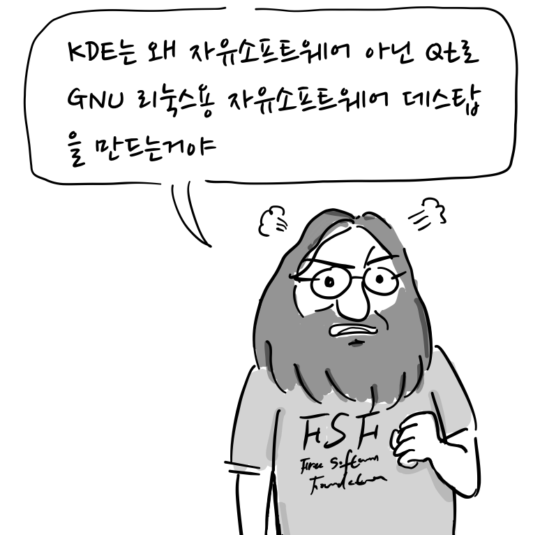

“KDE는 왜 자유소프트웨어가 아닌 Qt로 GNU 리눅스용 데스크탑을 만드는거야”

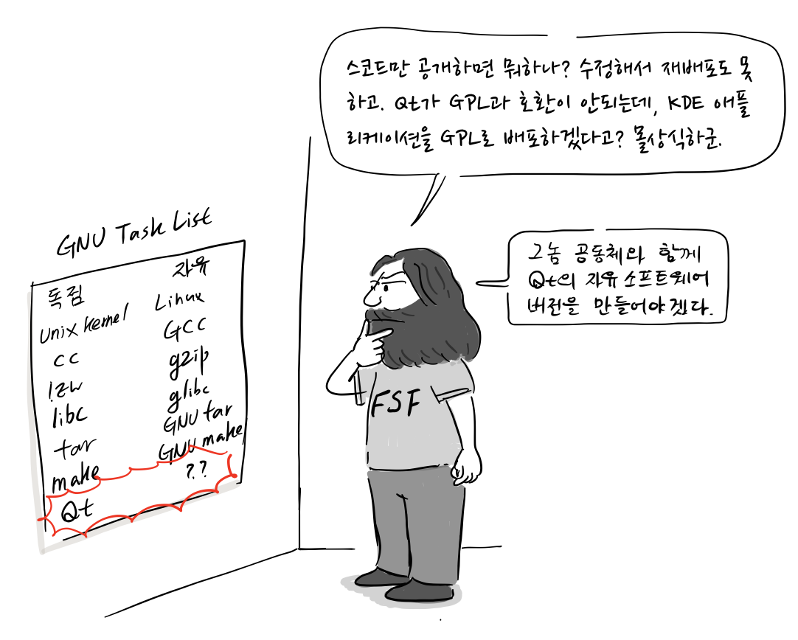

“소스코드만 공개하면 뭐하나? 수정해서 재배포도 못하고. Qt가 GPL과 호환이 안되는데, KDE 애플리케이션을 GPL로 배포하겠다고? 몰상식하군” “그놈(GNOME) 공동체와 함께 Qt의 자유 소프트웨어 버전을 만들어야겠다.”

Qt 사용을 반대해온 사람들이 그놈 공동체를 만들었고 FSF와 함께 [하모니](https://en.wikipedia.org/wiki/Harmony_\(toolkit\))라는 Qt의 자유 소프트웨어 버전을 만들기 시작한다.

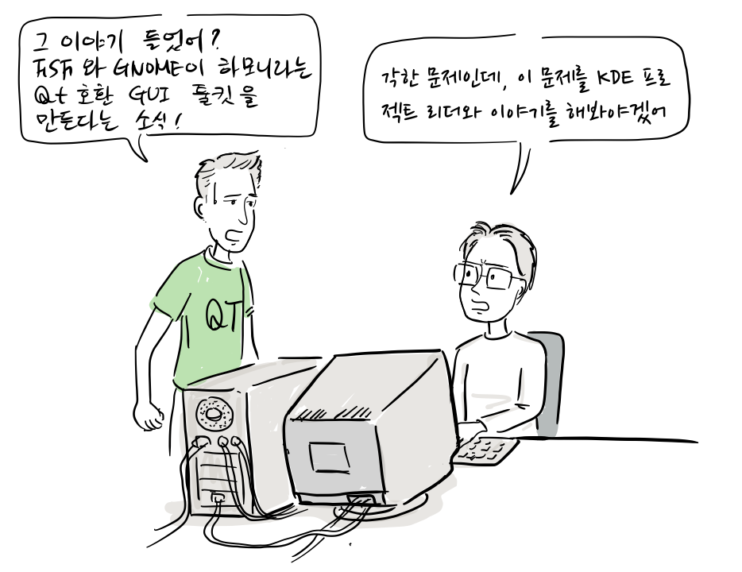

“그 이야기 들었어? FSF와 GNOME이 하모니라는 Qt 호환 GUI 툴킷을 만든다는 소식” “심각한 문제인데, 이 문제를 KDE 프로젝트 리더와 이야기를 해봐야겠어.”

1998년, 결국 두 사람은 이 문제를 해결하기 위해 KDE 프로젝트 리더인 마티아스 에트리히((Matthias Ettrich)를 영입한다. 그리고 Qt의 라이선스는 Qt 2.0 릴리스와 함께 자유소프트웨어 정의와 호환되는 QPL(the Q Public License)를 채택한다. 마침내, 2000년 Qt/X11 2.2부터는 GPL v2로 릴리스되어 GPL 호환 문제를 모두 해결한다.

“Qt도 KDE 커뮤니티를 위해 이제 부터 GPL 라이선스로 공개됩니다.” “고맙습니다. 이제 자유롭게 Qt를 가지고 GPL라이선스를 가진 애플리케이션을 만들 수 있겠군요.”

하지만, Qt의 이러한 실책은 GNOME과 Gtk+를 탄생시켰고 이후, 리눅스 데스크탑은 GNOME과 KDE로 양분되는 결과를 만들고 만다.

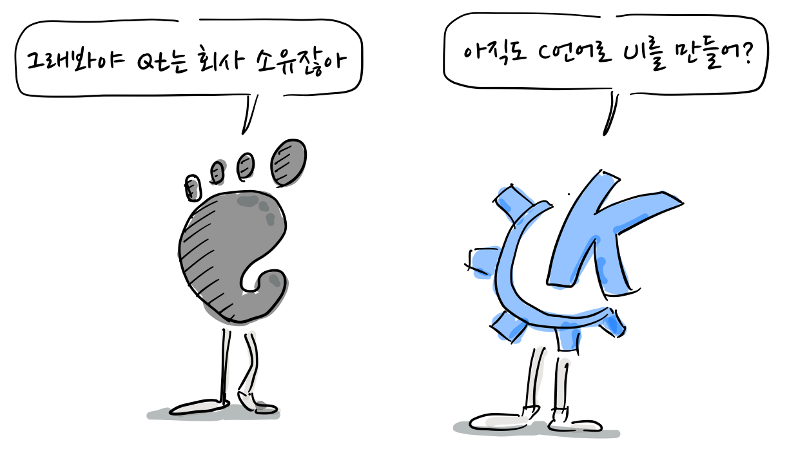

“그래봐야 Qt는 회사 소유잖아” “아직도 C언어로 UI를 만들어?”

#### Qt의 현재

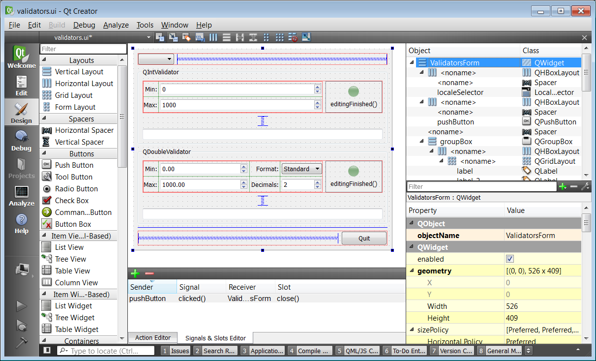

Qt 공식 개발도구인 Qt Creator 모습 (출처: [위키피디아](https://en.wikipedia.org/wiki/Qt_Creator#/media/File:Qt_Creator_3.1.1_editing_a_sample_UI_file_from_Qt_5.3_using_Designer.png))

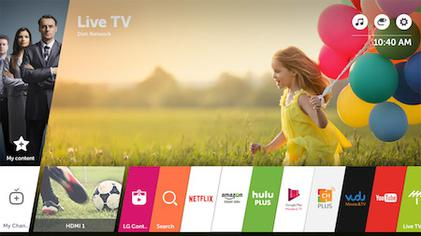

Qt로 만들어진 LG webOS UI(출처: [위키피디아](https://en.wikipedia.org/wiki/WebOS#/media/File:LG_webOS.jpg))

Qt는 Qt Embedded 버전을 만들어, [최초의 리눅스 기반의 스마트폰에 사용](https://linuxdevices.org/korean-linux-smartphone-stack-achieves-new-release/)되었고, 노키아에서 만든 [Maemo 플랫폼](https://wiki.maemo.org/Qt-Maemo)과 [블랙베리 10](https://en.wikipedia.org/wiki/BlackBerry_10)에도 사용되었다. [LG webOS도 Qt를 사용](https://www.qt.io/lg-electronics-built-with-qt)하고 있다.

#### 참고

-   Qt(Software), 위키피디아 ([한국어](https://ko.wikipedia.org/wiki/Qt_\(%ED%94%84%EB%A0%88%EC%9E%84%EC%9B%8C%ED%81%AC\)), [영문](https://en.wikipedia.org/wiki/Qt_\(software\)))
-   A brief history of Qt ([link1](https://rtime.felk.cvut.cz/osp/prednasky/gui/the-qt-story/), [link2](https://books.google.com/books?id=tSCR_4LH2KsC&pg=PR15&lpg=PR15&dq=history+of+QT&source=bl&ots=E903iU12yi&sig=ACfU3U3F5Ao3efSHcKpGNIrWH9Z4aw4t1Q&hl=en&sa=X&ved=2ahUKEwiq9b7QtKrpAhWpJDQIHTckDWAQ6AEwFXoECA4QAQ#v=onepage&q=history%20of%20QT&f=false))
-   Qt History, [wiki.qt.io](https://wiki.qt.io/Qt_History)
-   Interview: Trolltech’s President Eirik Eng, [KDE](https://dot.kde.org/2001/09/24/interview-trolltechs-president-eirik-eng), 2001/09/24
-   Interview with Matthias Ettrich, [Linux Journal](https://www.linuxjournal.com/article/6834), 2003/04/28

P.S. 다음 만화에서는 Gtk+와 GNOME에 관해서 이야기 나누려고 합니다.
