### 김프(GIMP)의 탄생

1995년 [스펜서 킴벨(Spencer Kimball)](https://en.wikipedia.org/wiki/Spencer_Kimball_\(computer_programmer\))과 [피터 매티스(Peter Mattis)](https://en.wikipedia.org/wiki/Peter_Mattis)는 UC 버클리에서 전산학을 공부하고 있었다.

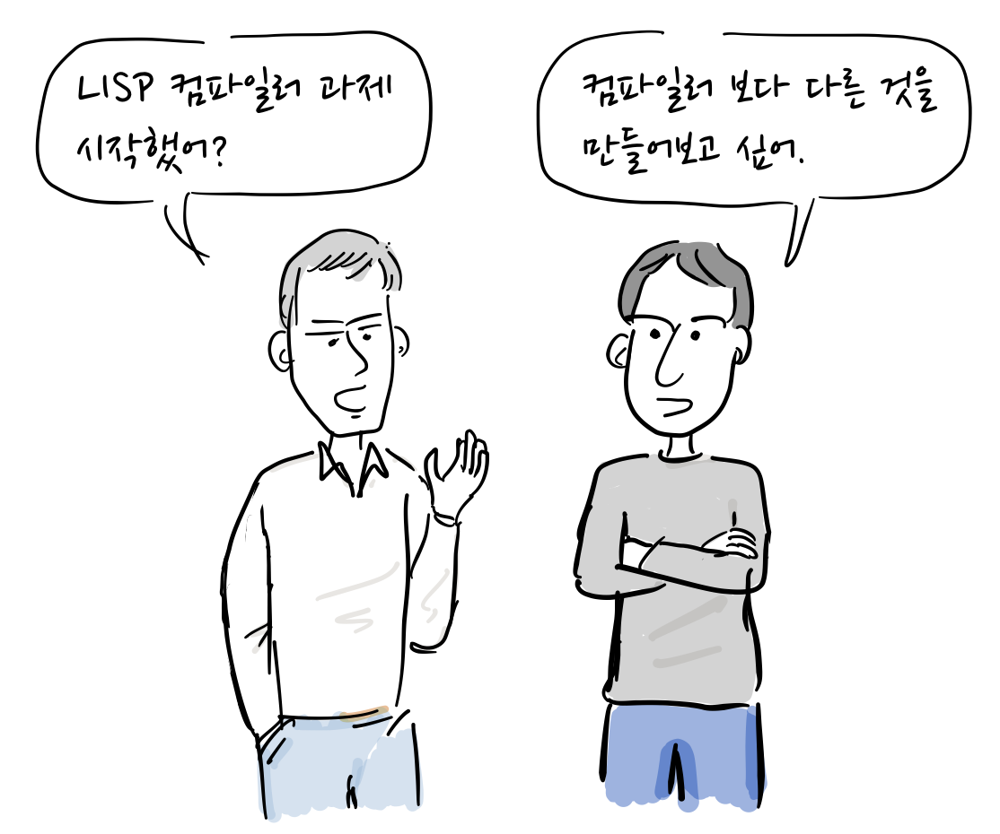

“LISP 컴파일러 과제 시작했어?”  
“컴파일러 보다 다른 것을 만들어보고 싶어.”

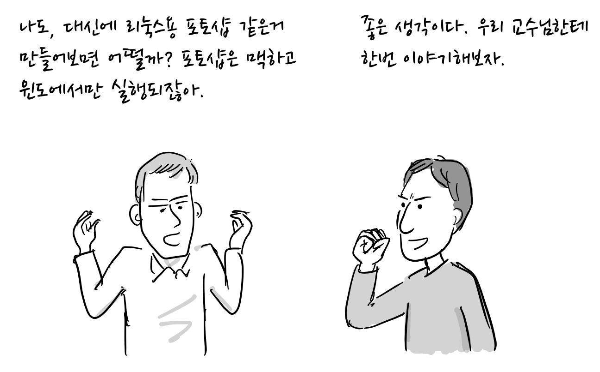

“나도, 대신에 리눅스용 포토샵 같은거 만들어보면 어떨까? 포토샵은 맥하고 윈도에서만 실행되잖아.”  
“좋은 생각이다. 우리 교수님한테 한번 이야기해보자.”

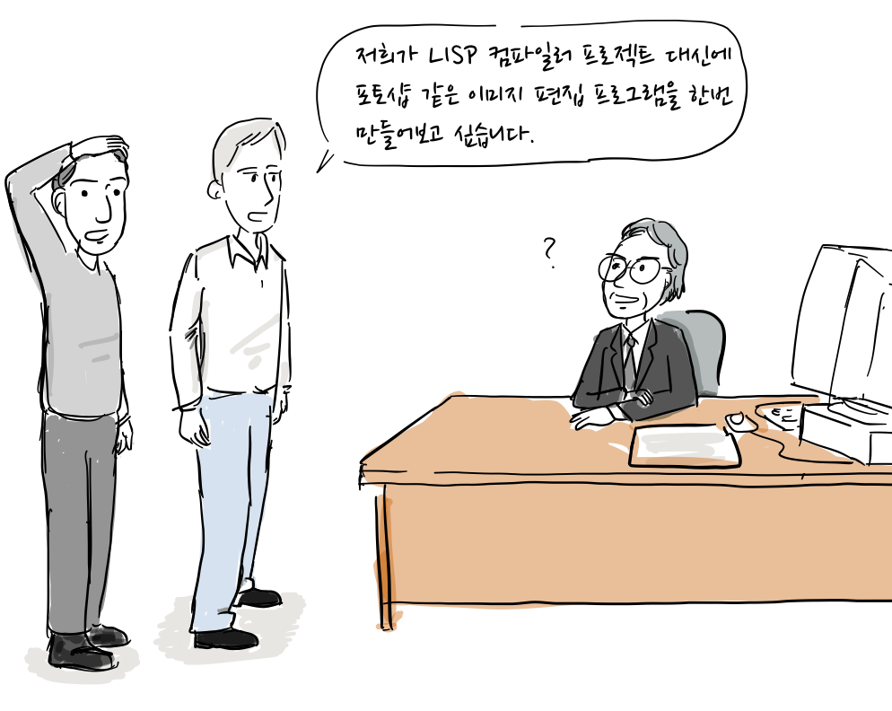

“저희가 LISP 컴파일러 프로젝트 대신에 포토샵 같은 이미지 편집 프로그램을 한번 만들어보고 싶습니다.”

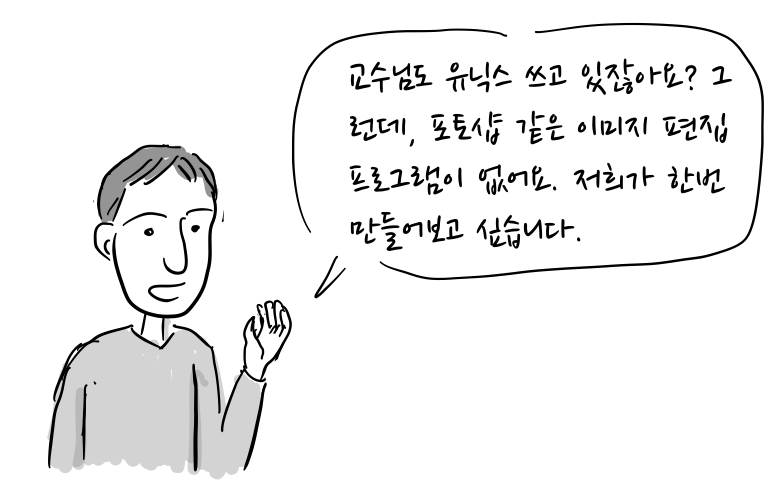

“교수님도 유닉스 쓰고 있잖아요? 그런데, 포토샵 같은 이미지 편집 프로그램이 없어요. 저희가 한번 만들어보고 싶습니다.”

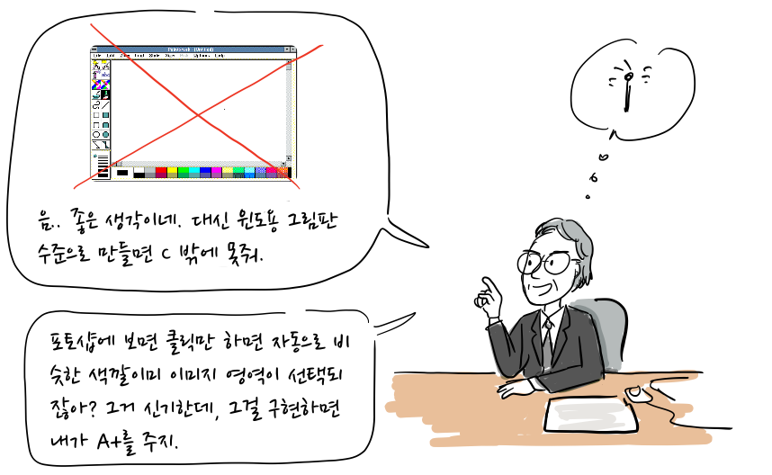

“음.. 좋은 생각이네. 대신 윈도용 그림판 수준으로 만들면 C 밖에 못줘.”  
“포토샵에 보면 클릭만 하면 자동으로 비슷한 색깔 영역이 선택되잖아? 그거 신기한데, 그걸 구현하면 내가 A+를 주지.”

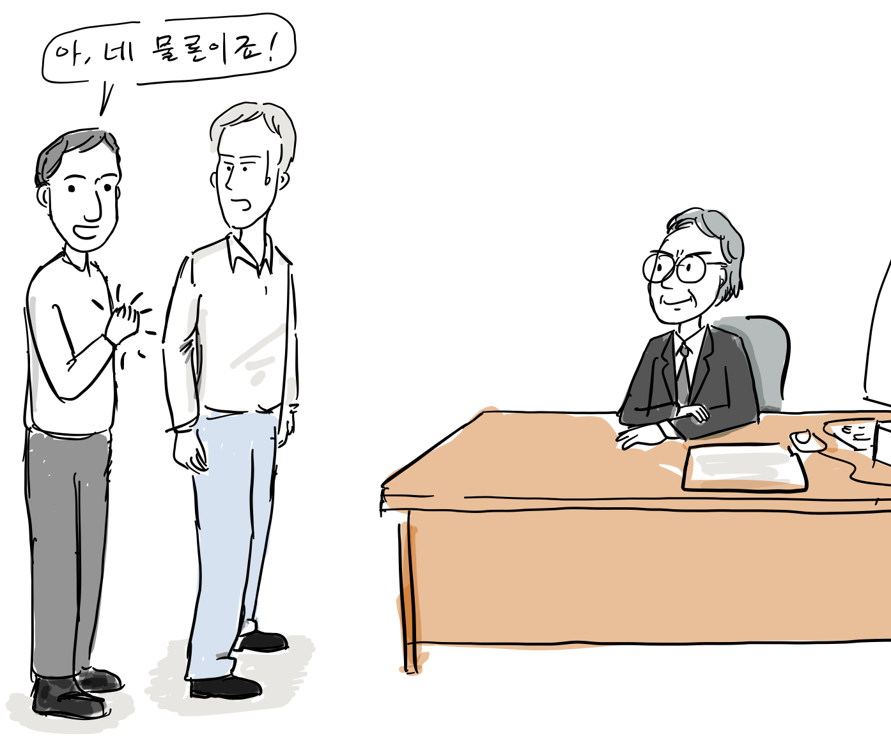

“아, 네 물론이죠.”

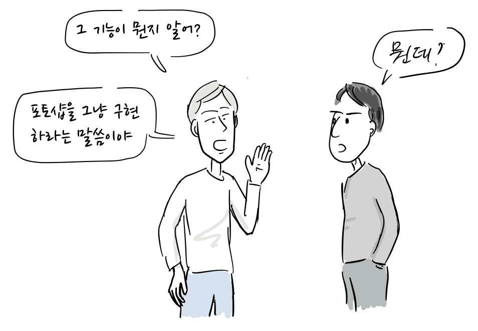

“그 기능이 뭔지 알어?” “뭔데?”  
“포토샵을 그냥 구현하라는 말씀이야.”

두 사람은 이미지 편집 프로그램 이름을 김프 GIMP(General Image Manipulation Program)라고 짓고, 거의 10개월 정도 개발에 몰두한다.

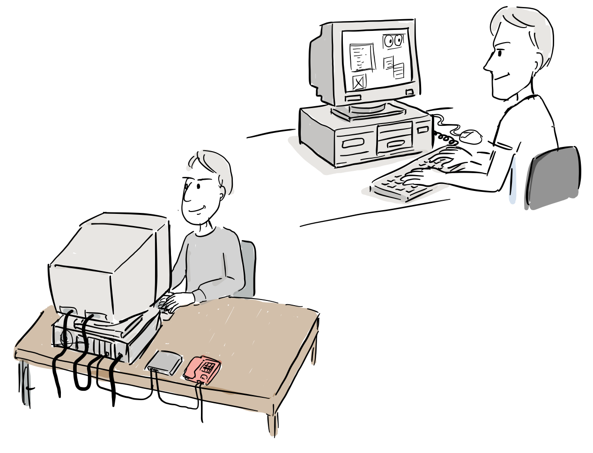

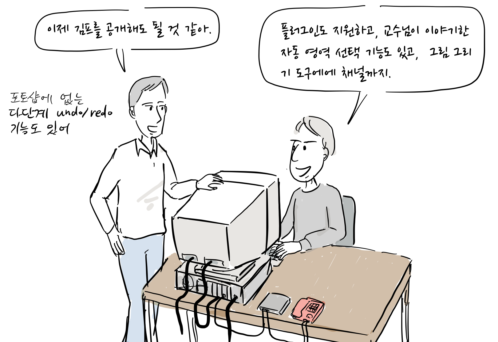

“이제 김프를 공개해도 될 것 같아.”  
“플러그인도 지원하고, 교수님이 이야기한 자동 영역 선택 기능도 있고, 그림 그리기 도구에에 채널까지.”  
“게다가 포토샵에 없는 다단계undo/redo 기능까지.”

1996년 김프 0.54가 소스코드와 함께 공개되었고, 리눅스, [SGI-IRIX](https://ko.wikipedia.org/wiki/IRIX), [HP 유닉스](https://ko.wikipedia.org/wiki/HP-UX)를 지원했다. 주요 기능은 다음과 같다.

-   8, 15, 16, 24 비트 컬러 지원
-   8 비트 디스플레이를 위한 디더링([dithering](https://en.wikipedia.org/wiki/Dithering)) 지원
-   [RGB](https://en.wikipedia.org/wiki/RGB_color_model), 흑백, 인덱스 컬러로 그림 보기 지원
-   동시 여러 이미지 파일 편집 가능
-   실시간 줌(zoom)과 스크롤 지원.
-   [GIF](https://en.wikipedia.org/wiki/Graphics_Interchange_Format), [JPEG](https://en.wikipedia.org/wiki/JPEG), [PNG](https://en.wikipedia.org/wiki/Portable_Network_Graphics), [TIFF](https://en.wikipedia.org/wiki/Tagged_Image_File_Format), [XPM](https://en.wikipedia.org/wiki/X_PixMap) 이미지 포맷 지원
-   사각형, 타원형, 자유, 퍼지(fuzzy), 베지어(bezier), 자동 선택 도구를 이용한 영역 선택 지원
-   회전, scale, shear and flip images.
-   bucket, brush and airbrush painting tools
-   이미지 복사, convolve, 블렌딩 지원
-   텍스트 툴, 필터 효과(blur와 edge detect), 지원
-   채널과 컬러 조작 지원(add, composite, decompose).
-   플러그-인 시스템 지원 (새로운 파일 포맷 및 새로운 필터 추가 가능).
-   다단계 undo와 redo 지원

김프가 공개되지 마자, 수 많은 사용자들이 생겨났다.

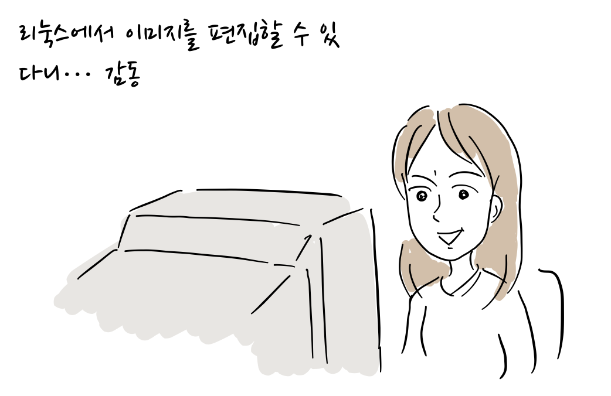

“리눅스에서 이미지를 편집할 수 있다니… 감동”

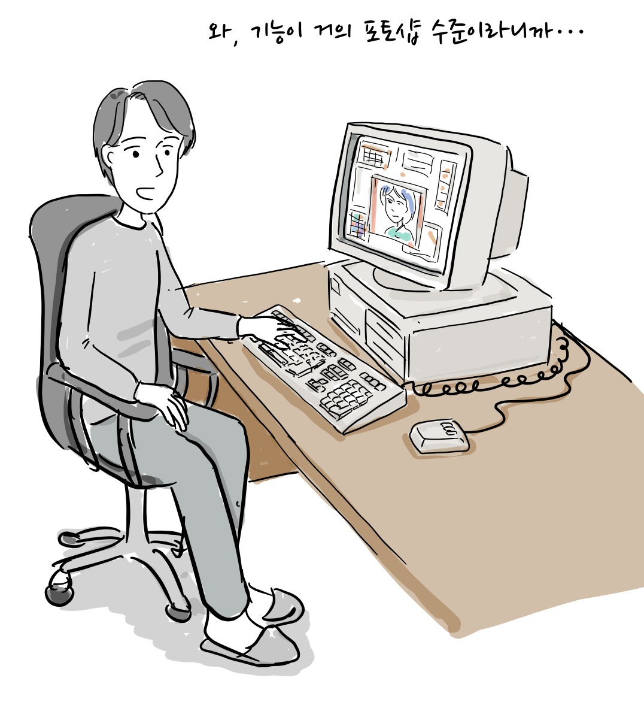

“와, 기능이 거의 포토샵 수준이라니까…”

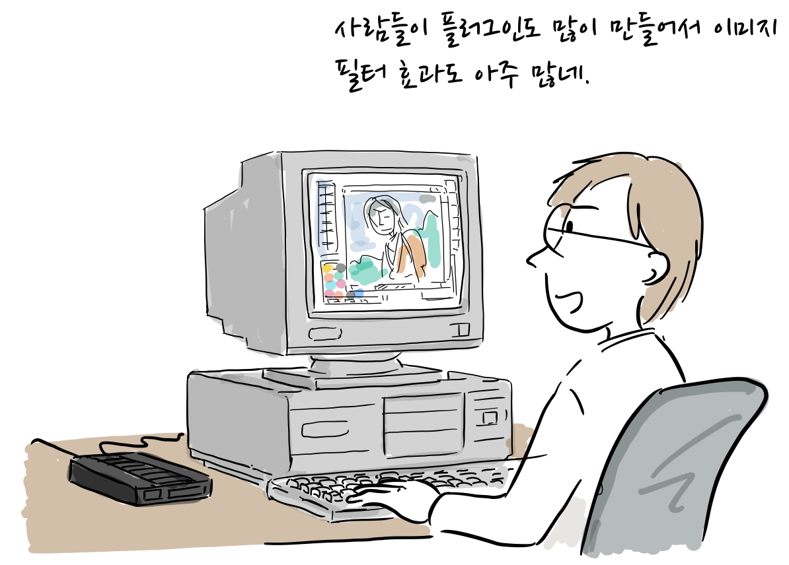

“사람들이 플러그인도 많이 만들어서 이미지 필터 효과도 아주 많네.”

당시 김프 사용자였던 자흐 빈(Zach Beane)는 자신의 홈페이지에 [사용자 튜토리얼](https://web.archive.org/web/19990116231504/http://xach.dorknet.com/xach.html)을 만들어 공유했다.

다른 사용자들도 김프로 만든 작품과 자신만의 테크닉을 공유했고. 이를 통해 더 많은 사람들이 김프를 사용하기 시작했다.

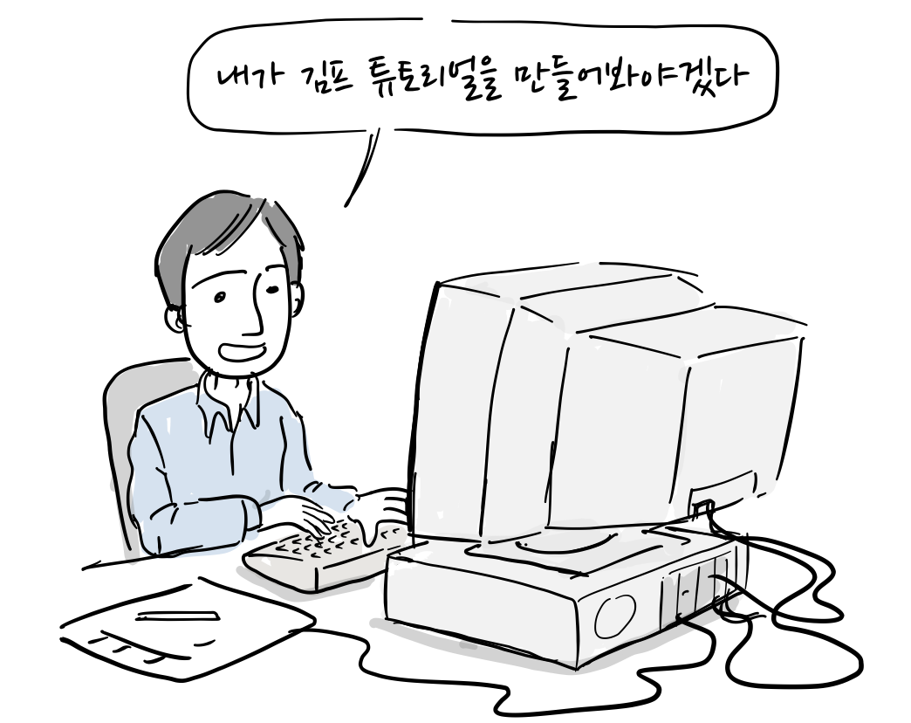

“내가 김프 튜토리얼을 만들어봐야겠다.”

당시 튜토리얼 페이지 일부(출처: [archive.org](https://web.archive.org/web/19990116231504/http://xach.dorknet.com/xach.html))

### 리눅스 마스코트 펭귄 턱스

[레리 이윙(Larry Ewing)](https://en.wikipedia.org/wiki/Larry_Ewing)은 김프 0.54 버전을 이용해서 [리눅스 마스코트인 펭귄 턱스](https://en.wikipedia.org/wiki/Tux_\(mascot\))(tux)를 그렸다.

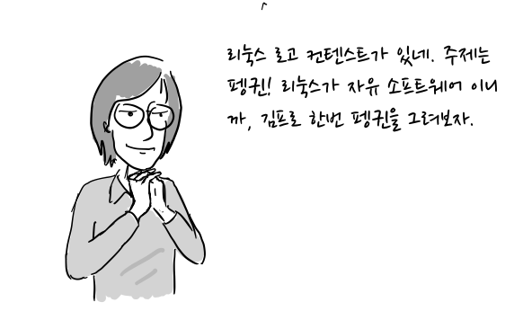

“리눅스 [로고 컨텐스트가](https://www.sjbaker.org/wiki/index.php?title=The_History_of_Tux_the_Linux_Penguin) 있네. 주제는 펭귄! 리눅스가 자유 소프트웨어이니까, 김프로 한번 펭귄을 그려보자.”

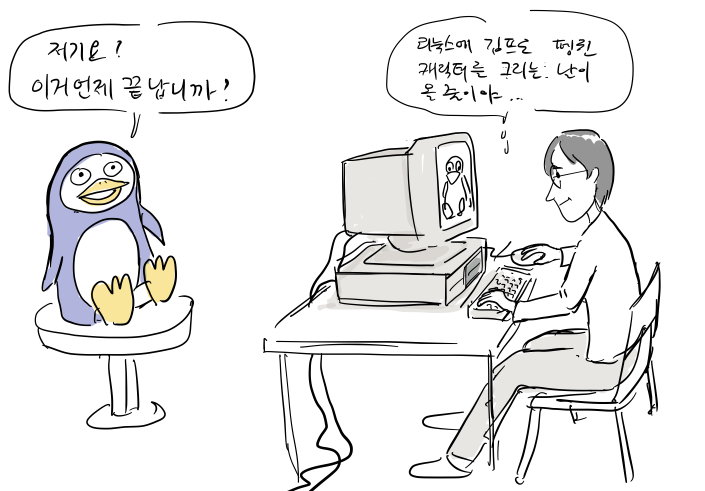

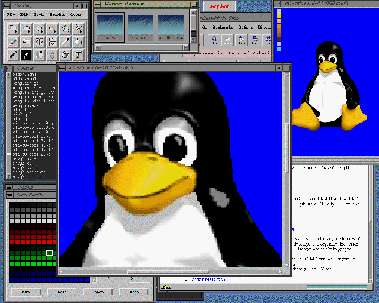

레리가 작업하던 김프 화면(출처: [레리 홈페이지](https://isc.tamu.edu/~lewing/linux/notes.html))

사람들의 투표로 레리가 그린 펭귄이 선정되었지만, 로고 대신 리눅스 마스코트로 현재까지 사용되고 있다. 당시에 이 그림이 김프로 그려진 사실 때문에 김프가 많은 조명을 받았다.

### GTK 위젯

하지만, 사용자들이 플러그인을 추가하면서 김프가 불안해지는 현상이 나타났다.

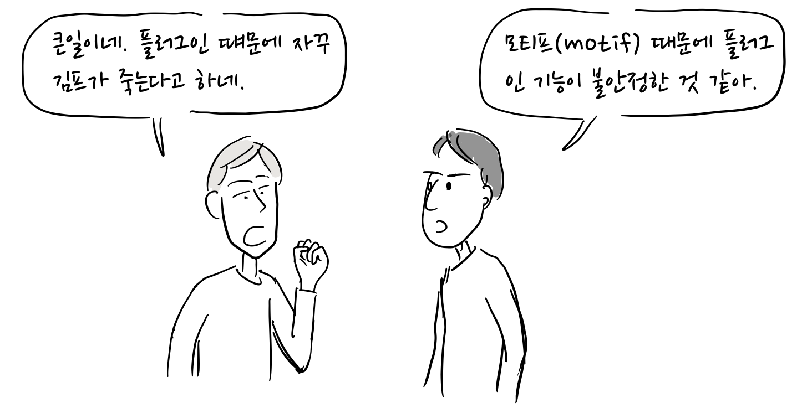

“큰일이네. 플러그인 떄문에 자꾸 김프가 죽는다고 하네.”  
“[모티프(motif)](https://ko.wikipedia.org/wiki/%EB%AA%A8%ED%8B%B0%ED%94%84_\(%EC%9C%84%EC%A0%AF_%ED%88%B4%ED%82%B7\)) 때문에 플러그인 기능이 불안정한 것 같아.”

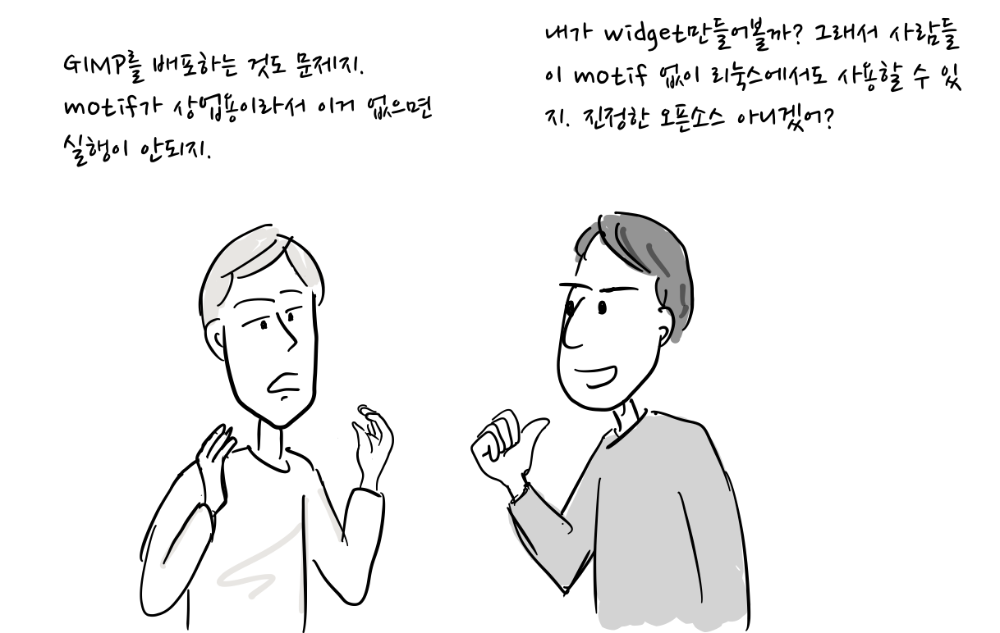

“김프가 상용 위젯인 모티프에 의존성이 있는 것도 문제야.”  
“내가 위젯을 만들어볼까? 그래야 사람들이 리눅스에서도 쉽게 사용할 수 있지.”

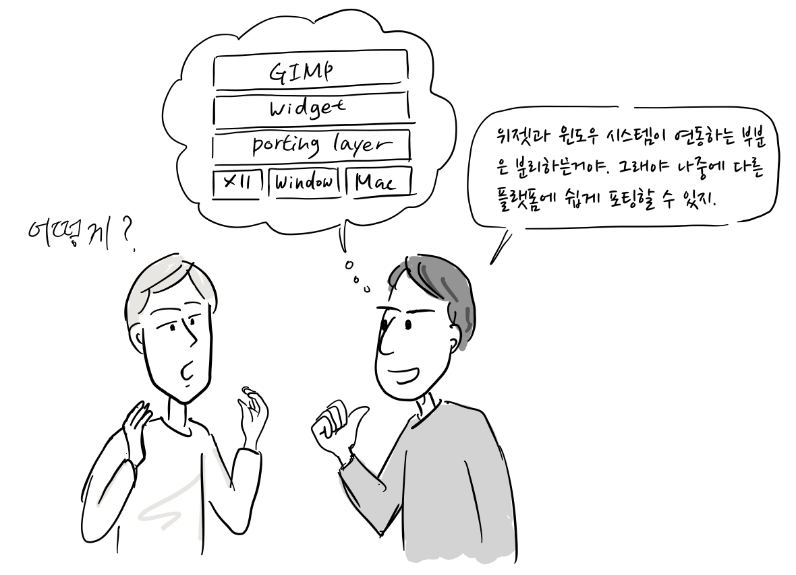

“어떻게?”  
“위젯과 윈도우 시스템이 연동하는 부분은 분리하는거야. 그래야 나중에 다른 플랫폼에 쉽게 포팅할 수 있지.”

나중에 위젯은 GTK(GIMP toolkit)로, 윈도 시스템과 연동하는 포팅 레이어는 GDK(GIMP drawing kit)로 부르게 된다.

이때 부터 피터는 주로 위젯을 개발하고 스펜서는 김프 자체에 주력한다.

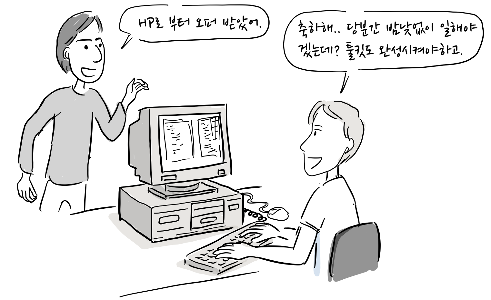

“나 HP로 부터 오퍼 받았어.”  
“축하해.. 당분간 밤낮없이 일해야겠는데? 툴킷도 완성시켜야하고.”

### GPL 적용

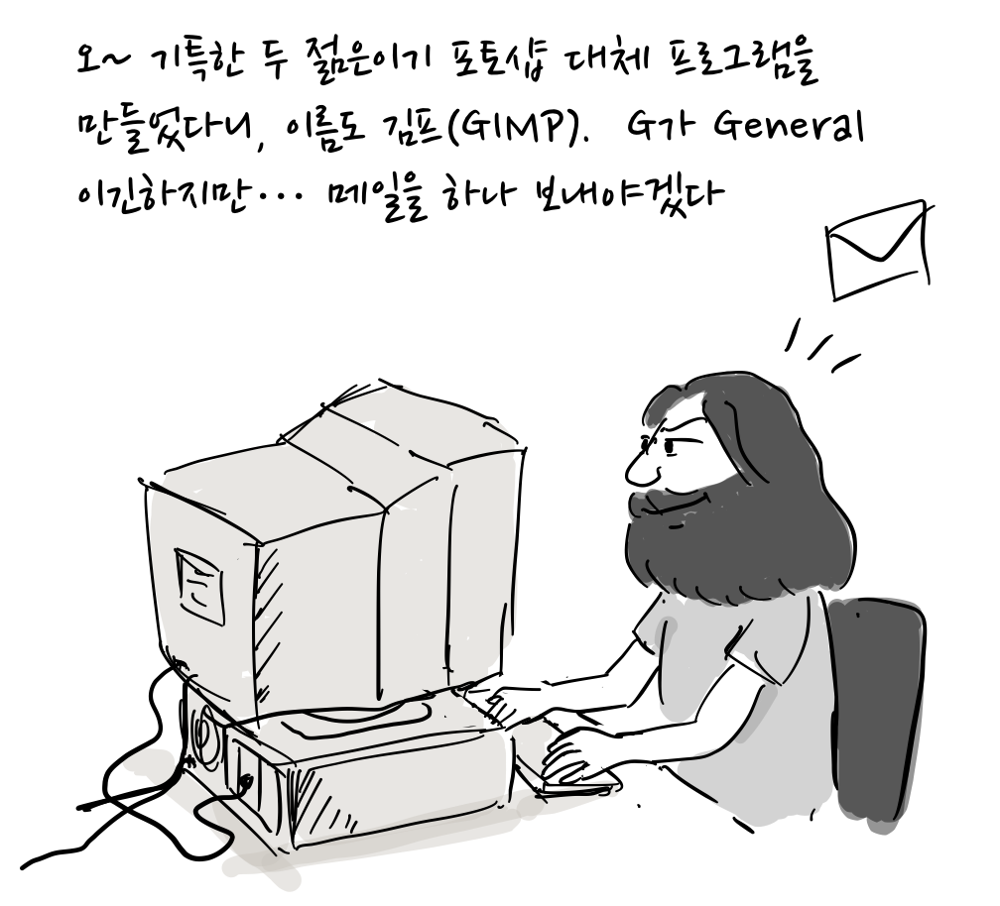

“오~ 기특한 두 젊은이기 포토샵 대체 프로그램을 만들었다니, 이름도 김프(GIMP). G가 General이긴하지만… 메일을 하나 보내야겠다.”

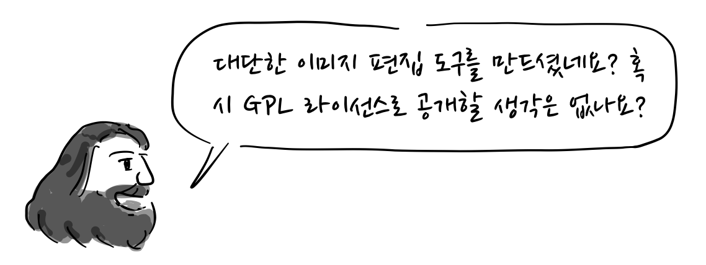

“대단한 이미지 편집 도구를 만드셨네요? 혹시 GPL 라이선스로 공개할 생각은 없나요?

“네, 현재 모티프 의존성을 없애는 작업을 하고 있습니다. 그러면 GPL로 코드를 공개할 수 있을 것 같습니다?”

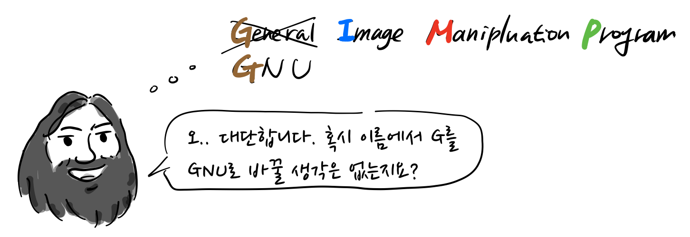

“오.. 대단합니다. 혹시 이름에서 G를 GNU로 바꿀 생각은 없는지요?”

“네, 물론이죠. 저희도 이맥스 에디터를 잘 쓰고 있고 GCC, 리눅스와 같은 자유 소프트웨어 덕에 이렇게 김프도 만들었는데…”

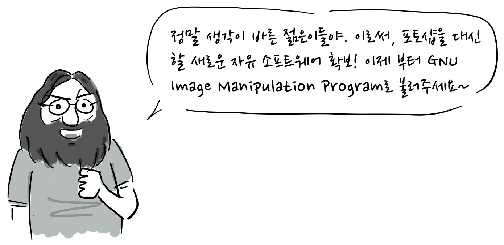

“정말 생각이 바른 젊은이들야. 이로써, 포토샵을 대신할 새로운 자유 소프트웨어 확보!”  
“이제 부터 GNU Image Manipulation Program로 불러주세요~”

1997년 6월 김프 0.60이 릴리즈 되었다. 더 이상 모티프 툴킷에 대한 의존성이 없었고 처음으로 GPL 라이선스가 적용되었다.

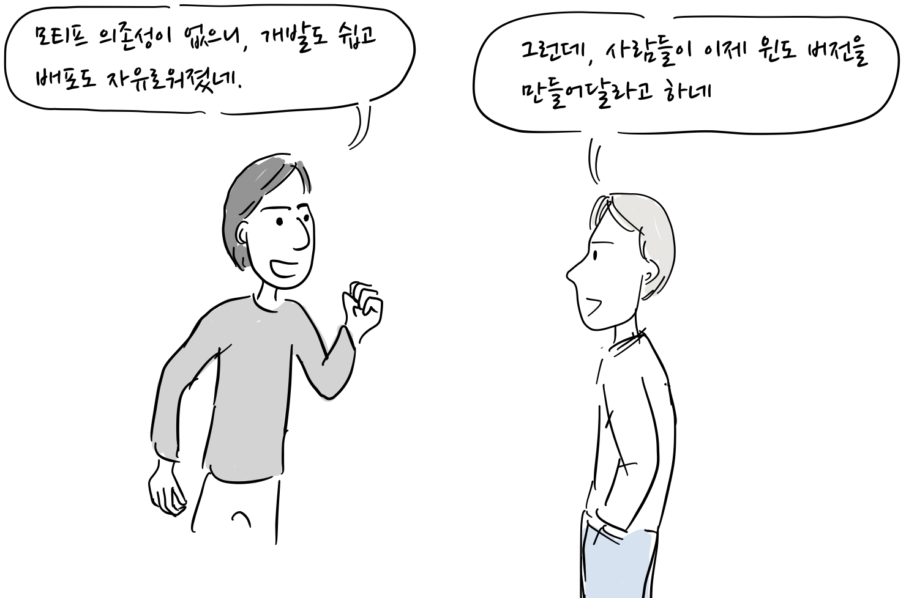

“모티프 의존성이 없으니, 개발도 쉽고 배포도 자유로워졌네.”  
“그런데, 사람들이 이제 윈도 버전을 만들어달라고 하네”

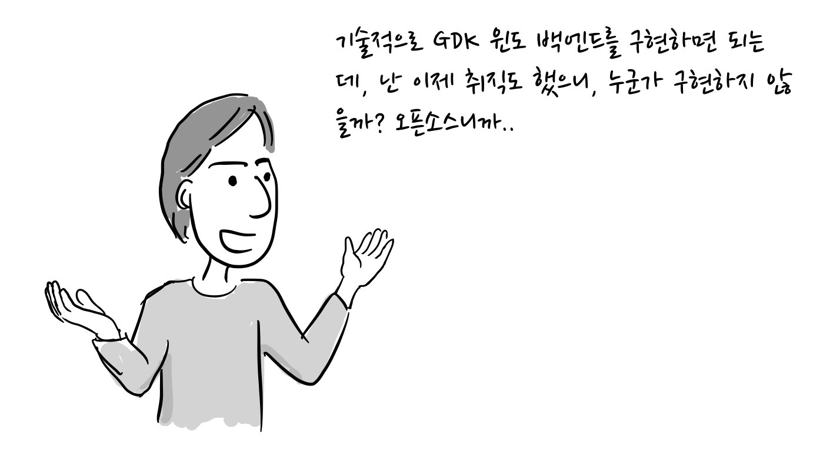

“기술적으로 GDK 윈도 백엔드를 구현하면 되는데, 난 이제 취직도 했으니, 누군가 구현하지 않을까? 오픈소스니까..”

1998년 토어 릴크비스트(Tor Lilqvist)가 드디어 김프를 윈도용으로 포팅하기 시작한다.

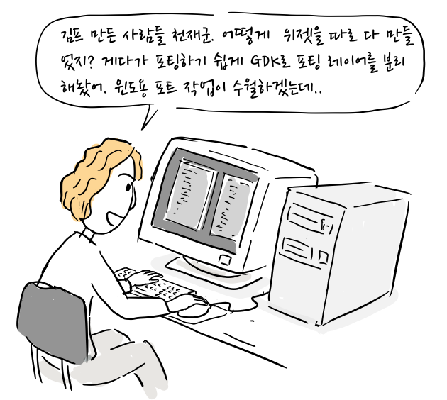

“김프 만든 사람들 천재군. 어떻게 위젯을 따로 다 만들었지? 게다가 포팅하기 쉽게 GDK로 포팅 레이어를 분리해놨어. 윈도용 포트 작업이 수월하겠는데..”

1997년 2월 26일 두 사람은 김프 0.99 버전을 릴리스 한다. 이때 부터 GTK에 객체지향(OOP) 개념을 추가해서 GTK+라고 부르기 시작했다. 1997년 6월 9일 0.99.10을 마지막으로 두 사람 모두 취직을 하면서 더 이상 개발을 진행하지 못하게된다.

“김프 새 버전은 안나오는거야?”

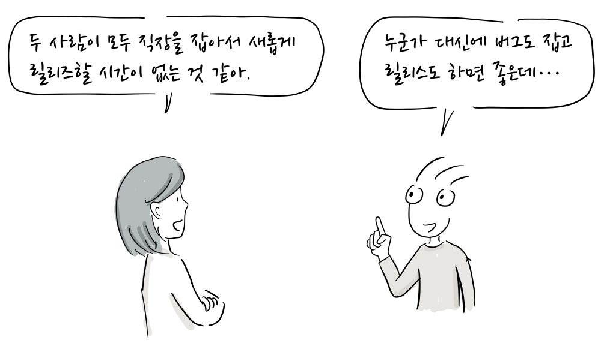

“두 사람이 모두 직장을 잡아서 새롭게 릴리즈할 시간이 없는 것 같아.”  
“누군가 대신에 버그도 잡고 릴리즈도 하면 좋은데…”

페데리코(Federico Mena Quintero)는 여러 버그 픽스를 모아서 간헐적으로 릴리즈를 진행했다. 하지만 새로운 기능이 추가되지는 않았다.

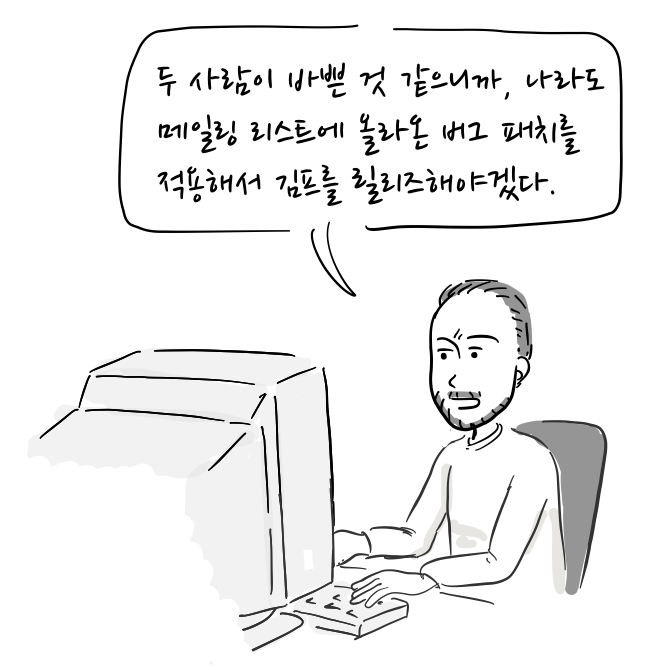  
“두 사람이 바쁜 것 같으니까, 나라도 메일링 리스트에 올라온 버그 패치를 적용해서 김프를 릴리즈해야겠다”

1997년 2월 김프 공동체의 원활한 소통을 위해 IRC채널이 만들어졌고, 자연스럽게 몇몇 사람이 나서서 프로젝트를 계속 진행시켰다.

마니시(Manish Singh, yosh)는 릴리스를 맡았고, 안드리안(Adrian Likins)은 서버를 관리하고 김프 캐릭터를 그렸던 래리(Larry Ewing, lewing)와 메튜(Matthew Wilson, msw)외 사람들이 버그를 잡고 새로운 기능을 구현했다.

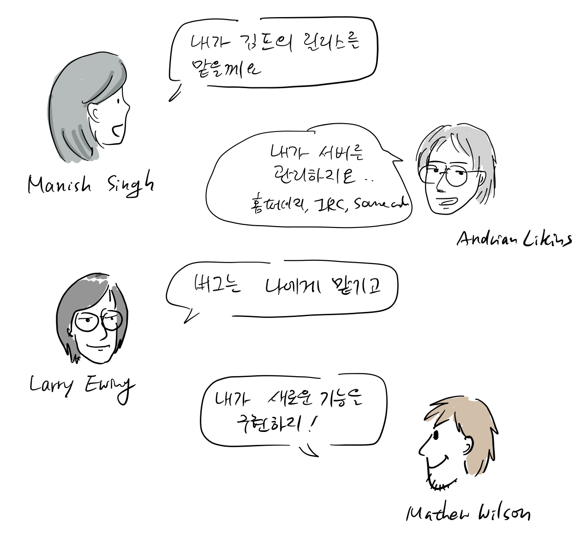

“내가 김프의 릴리즈를 맡을께요”, “내가 서버를 관리하지요”, “버그는 나에게 맡기고”, “내가 새로운 기능을 구현하지”

1998년 6월 2일 마침내 김프 1.0이 정식으로 출시되었고, 이 때 부터 GTK+는 별도의 프로젝트로 독립을 한다.

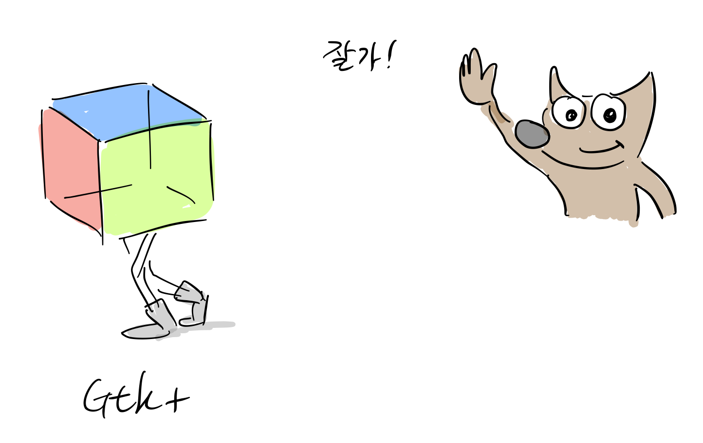

### 오늘날의 김프

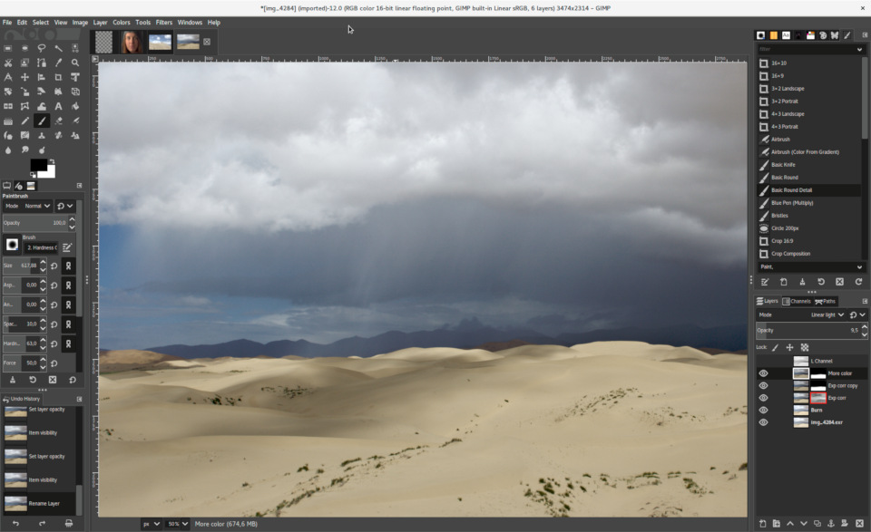

김프 2.0 (출처: [위키피디아](https://ko.wikipedia.org/wiki/%EA%B9%80%ED%94%84#/media/%ED%8C%8C%EC%9D%BC:GIMP_2.10.jpg))

현재 김프는 리눅스, 맥OSX, 윈도, BSD, 솔라리스를 지원하며 대표적인 오픈소스 그래픽 소프트웨어로 자리잡았다.

### 그놈(GNOME) 프로젝트

일부 김프 개발자가 독자적인 프로젝트로 GTK+를 분리시켰고 이를 기반으로 또다른 오픈소스 데스크탑 프로젝트인 그놈(GNOME) 프로젝트가 탄생하게 된다. 이에 대한 이야기는 다음에 소개할 예정이다.

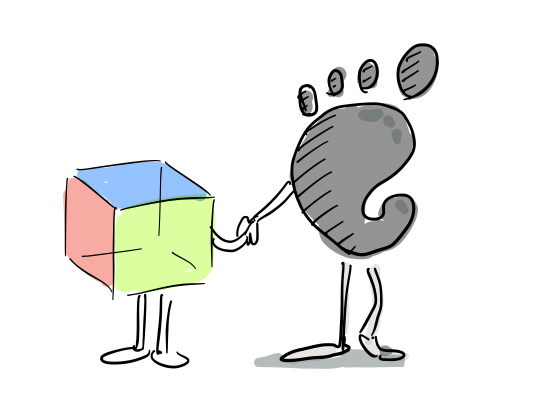

두 사람은 이후 구글에서 함께 일하면서 구글 파일시스템, 서블릿 엔진 등 개발에 참여했고 Viewfinder라는 스타업을 만들어 스퀘어에 매각했다. 현재는 함께 새로운 스타트업에서 [구글 빅테이블](https://en.wikipedia.org/wiki/Bigtable)의 오픈소스 버전인 [CockroachDB](https://github.com/cockroachdb/cockroach)를 만들고 있다.

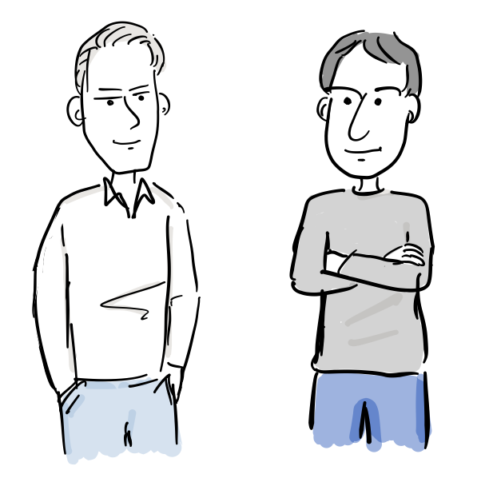

참고

-   A Brief (and Ancient) History of GIMP, [gimp.org](https://www.gimp.org/about/ancient_history.html)
-   [김프, 위키피디아 (](https://www.gimp.org/about/ancient_history.html)[한국어](https://ko.wikipedia.org/wiki/%EA%B9%80%ED%94%84), [영문](https://en.wikipedia.org/wiki/GIMP))
-   인터뷰 기사, 1997년 1월, [https://www.xach.com/gg/1997/1/profile/1/](https://www.xach.com/gg/1997/1/profile/1/)
-   [김프 튜토리얼(](https://www.xach.com/gg/1997/1/profile/1/)[링크](https://web.archive.org/web/19990116231504/http://xach.dorknet.com/xach.html))
