1994년 미겔(Miguel de Icaza)은 멕시코 씨티에 위치한 멕시코 국립 대학에서 수학을 공부면서, 대학 전산실에서 시스템 관리자로도 일하고 있었다.

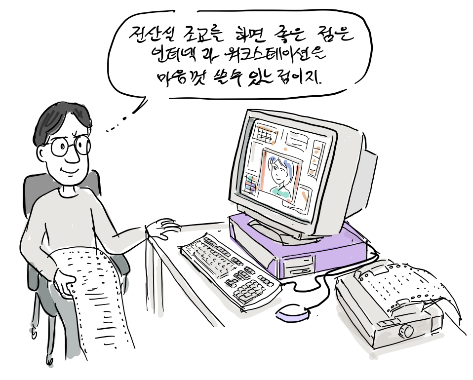

어느날 친구로 부터 GNU 프로젝트에 대한 이야기를 듣는다.

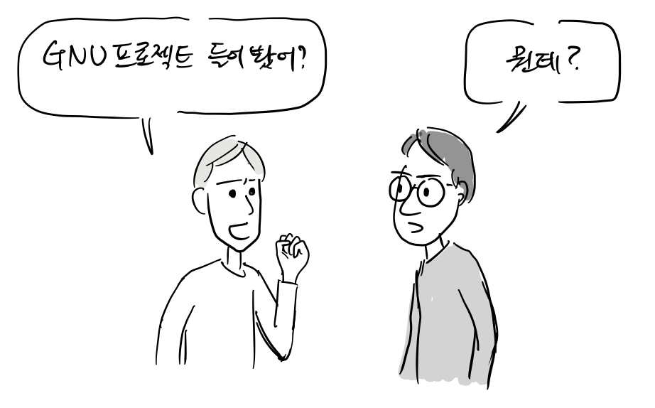

“리차드 스톨만이라는 사람이 만든 프로젝트인데, 운영체제 커널 부터 모든 유틸리티와 응용 애플리케이션을 자유 소프트웨어로 만드는 프로젝트야. 소소코드가 공개되고 무료로 사용할 수 있으며 고쳐서 재배포도 가능하다고 하네”  
“그래? 컴파일러도 있어?”

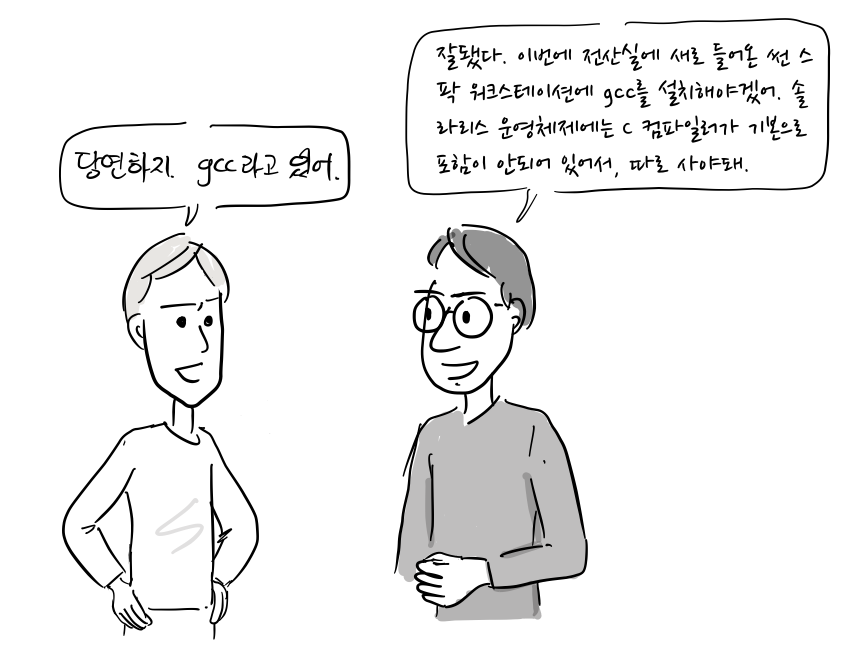

“당연하지. GCC(GNU C compiler)가 있어.”  
“잘됐다. 이번에 전산실에 새로 들어온 썬 스팍 워크스테이션에 GCC를 설치해야겠어. 솔라리스 운영체제에는 C 컴파일러가 기본으로 포함이 안되어 있어서, 따로 사야돼.”

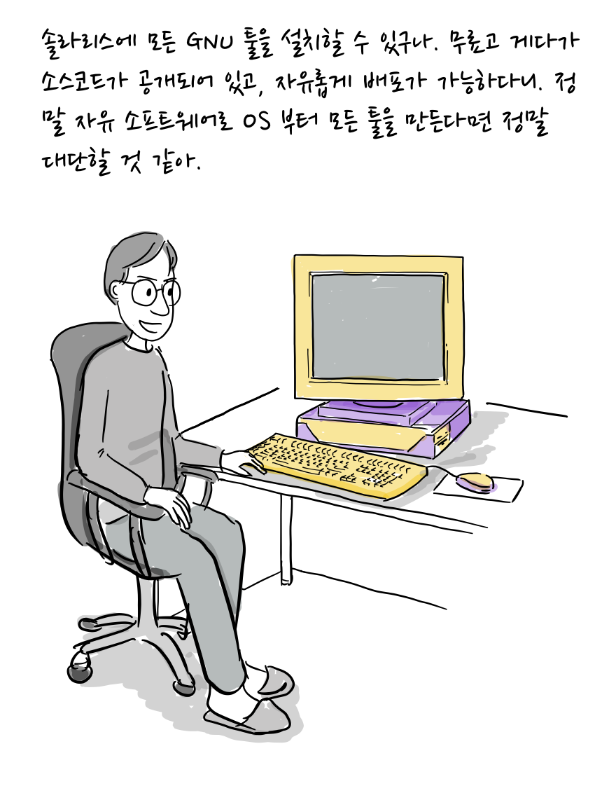  
“솔라리스에 모든 GNU 툴을 설치할 수 있구나. 무료고 게다가 소스코드가 공개되어 있고, 자유롭게 배포가 가능하다니⋯ 정말 자유 소프트웨어로 OS 부터 모든 툴을 만든다면 정말 대단할 것 같아.”

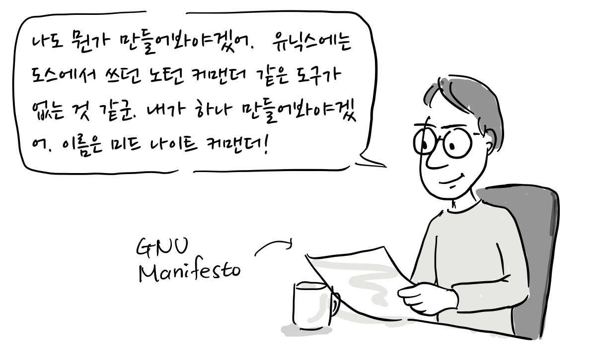

([GNU Manifesto](https://www.gnu.org/gnu/manifesto.ko.html)를 읽으면서..)

“나도 뭔가 만들어봐야겠어. 유닉스에는 도스에서 쓰던 노턴 커맨더 같은 도구가 없는 것 같군. 내가 하나 만들어봐야겠어. 이름은 미드 나이트 커맨더(Midnight Commander)!”

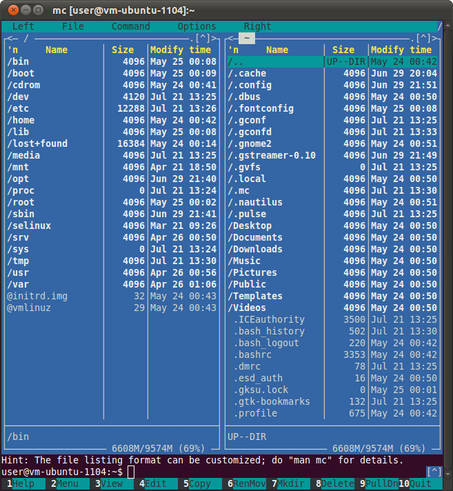  
미드 나이트 커맨더 (출처: [위키피디아](https://en.wikipedia.org/wiki/Midnight_Commander#/media/File:Midnight_Commander_4.7.0.9_on_Ubuntu_11.04.png))

1994년 미겔은 미드 나이트 커맨더 프로젝트를 시작하고, [현재까지도 다른 사람들이 프로젝트를 이어 받아 계속 업데이트하고 있다.](https://midnight-commander.org/)

이후 그의 관심은 리눅스로 향했고, 리눅스 RAID 디바이스 드라이버에 기여를 시작했다.

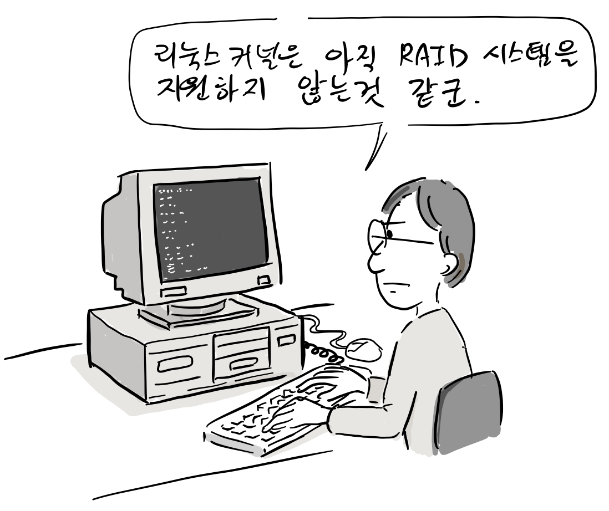

그리고 나서, 리눅스 커널을 다른 CPU에 포팅하는 것에 관심을 갖게 된다.

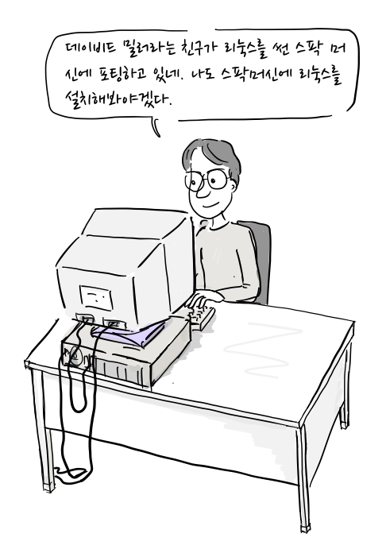

데이비드 밀러(Dave S. Miller)라는 친구가 리눅스를 썬 스팍 머신에 포팅하고 있네. 나도 전산실에 있는 스팍 머신에 리눅스를 설치해봐야겠다.

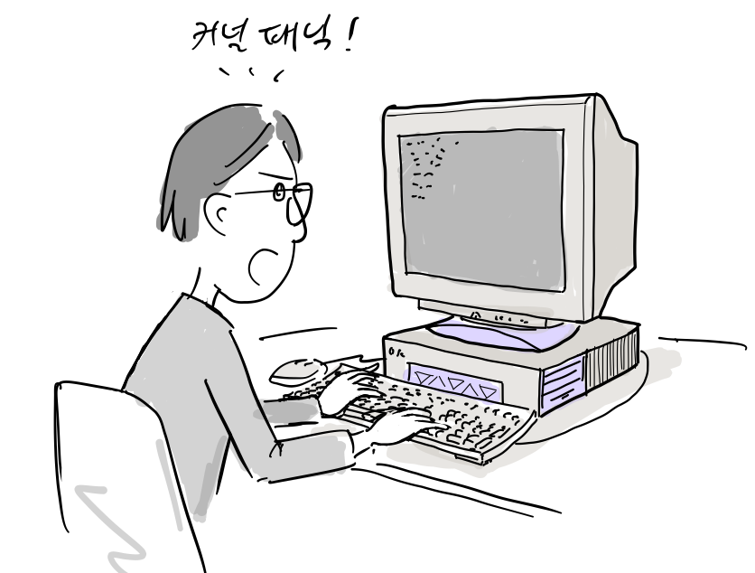  
“앗! 커널 패닉이…”

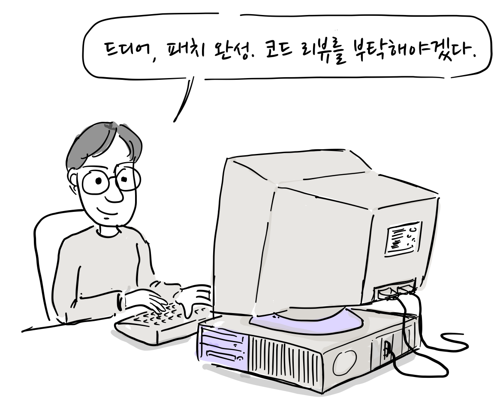

“드디어, 패치 완성. 코드 리뷰를 부탁해야겠다.”

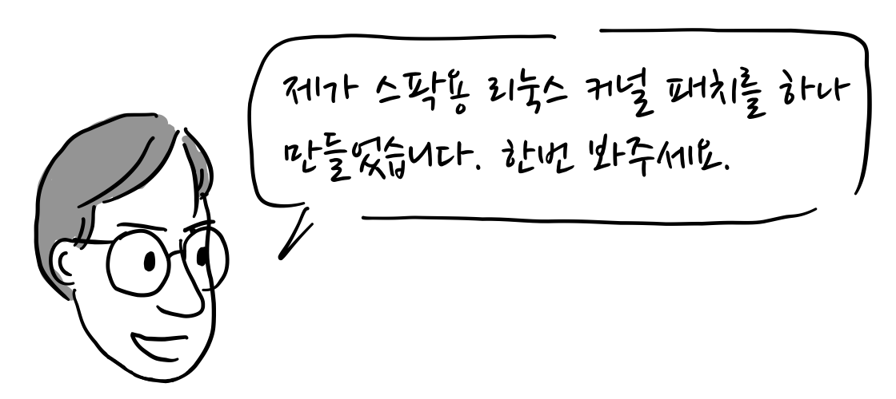  
“제가 스팍용 리눅스 커널 패치를 하나 만들었습니다. 한번 봐주세요.”

“물론이죠. 그런데, 궁금한게 있어요. 리눅스 RAID쪽에 기여를 하고 있는데, RAID 디바이스가 있어요? 그 장비가 비싼데 어느 회사에서 도움을 주나요?”

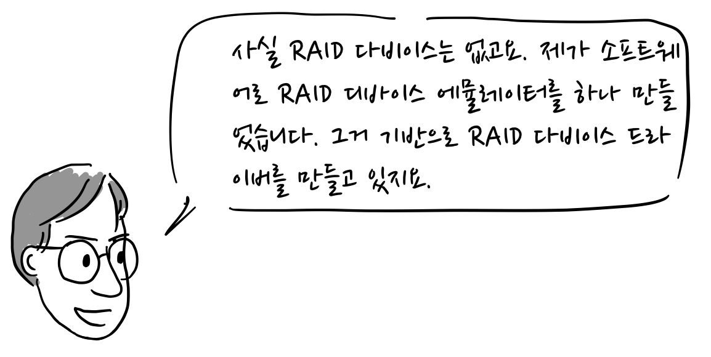  
“사실 RAID 디바이스는 없고요. 제가 소프트웨어로 에뮬레이터를 하나 만들었습니다. 이를 기반으로 RAID 디바이스 드라이버를 만들고 있지요.”

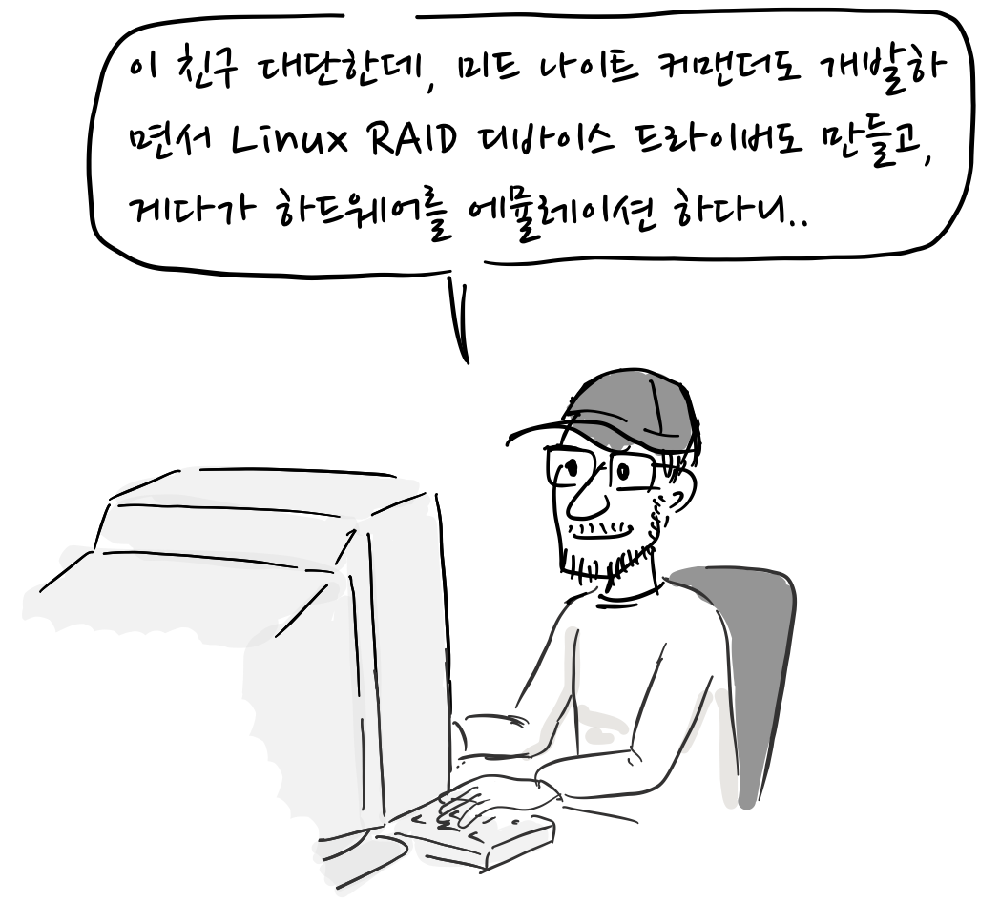

“이 친구 대단한데, 미드 나이트 커맨더도 개발하면서 리눅스 RAID 디바이스 드라이버도 만들고, 게다가 하드웨어를 에뮬레이션 하다니..”

리눅스 RAID 작업을 마친후, 여름 방학 동안 리눅스 커널을 SGI 워크스테이션에 포팅하는 기회를 갖게 된다.

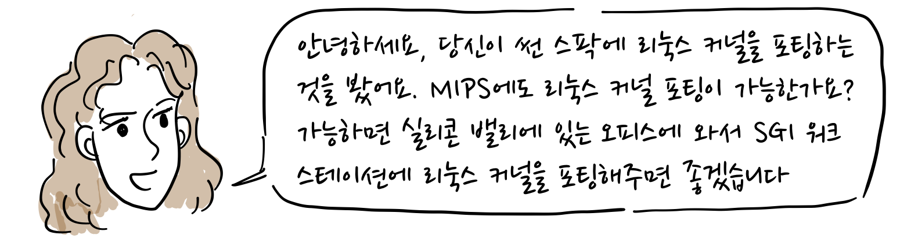“안녕하세요, 당신이 썬 스팍에 리눅스 커널을 포팅하는 것을 봤어요. MIPS에도 리눅스 커널 포팅이 가능한가요? 가능하면 실리콘 밸리에 있는 오피스에 와서 SGI 워크스테이션에 리눅스 커널을 포팅해주면 좋겠습니다.”

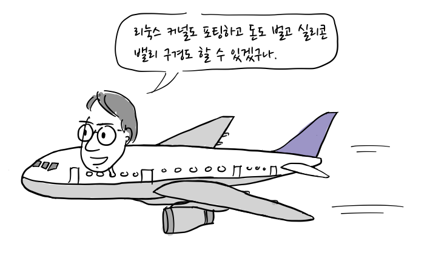  
“리눅스 커널도 포팅하고 돈도 벌고 실리콘 밸리 구경도 할 수 있겠구나.”

실리콘 밸리에서 일하던 어느날 KDE 프로젝트 소식을 접하게 된다.

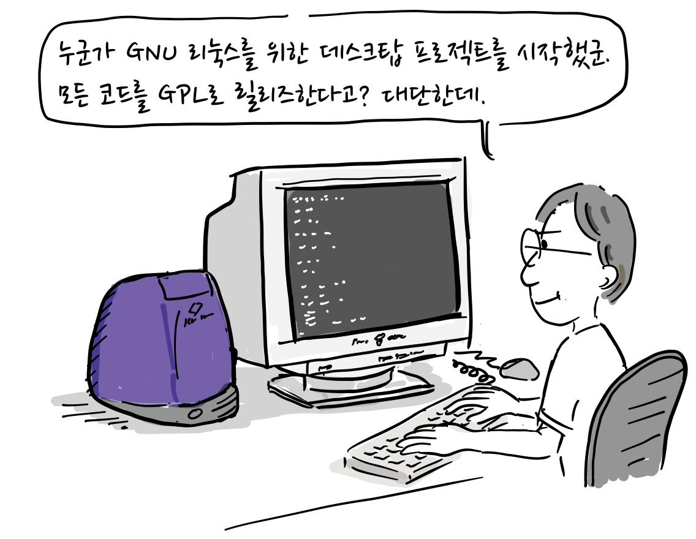  
“누군가 GNU 리눅스를 위한 데스크탑 프로젝트를 시작했군. 모든 코드를 GPL로 릴리즈한다고? 대단한데.”

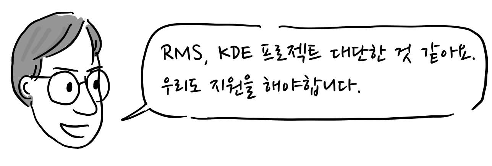  
“RMS, KDE 프로젝트 대단한 것 같아요. 우리도 지원을 해야합니다”

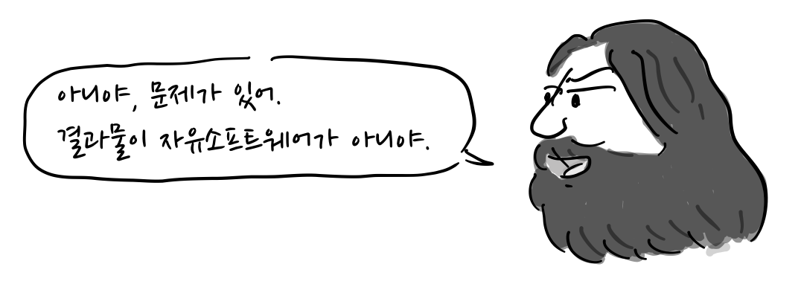  
아니야, 문제가 있어. 결과물이 자유소프트웨어가 될 수 없어.

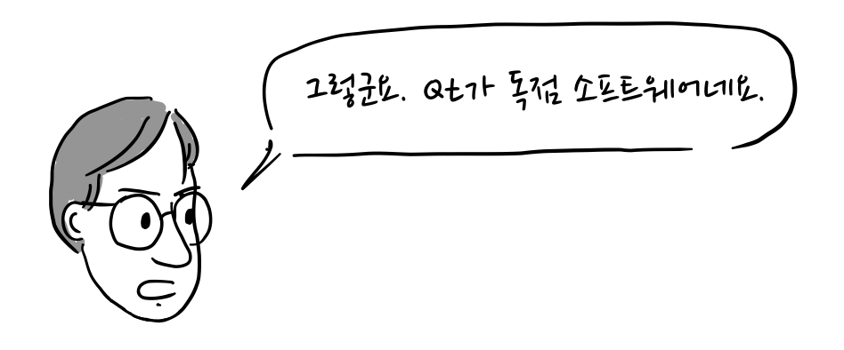  
“그렇군요. Qt가 독점 소프트웨어네요.”([34화 참고](https://joone.net/2020/05/20/34-%ec%98%a4%ed%94%88%ec%86%8c%ec%8a%a4-gui-%ed%88%b4%ed%82%b7-qt%ec%99%80-kde-%ed%94%84%eb%a1%9c%ec%a0%9d%ed%8a%b8%ec%9d%98-%ec%8b%9c%ec%9e%91/))

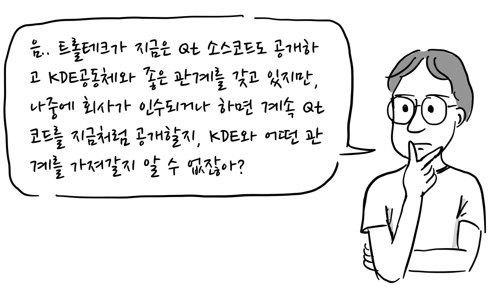  
“음.. 트롤테크가 지금은 Qt 소스 코드도 공개하고 KDE 공동체와 좋은 관계를 갖고 있지만,나중에 회사가 인수되거나 하면 계속 Qt 코드를 지금처럼 공개할지, KDE와 어떤 관계를 가져갈지 알 수 없잖아?”

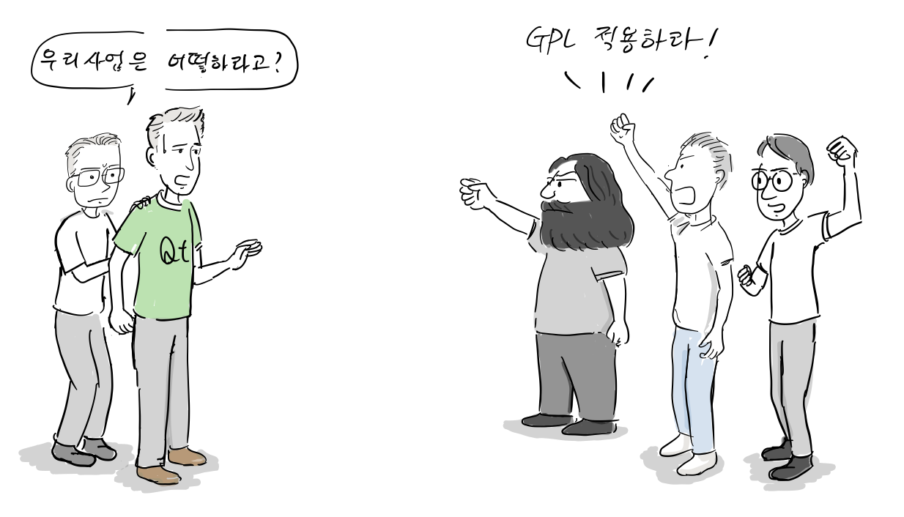

자유 소프트웨어 진영은 트롤테크에 Qt 소스코드를 GPL로 공개할 것을 요구했다. 하지만, 사업을 하는 트롤테크 입장에서 누군가 Qt를 코드를 [포크](https://ko.wikipedia.org/wiki/%ED%8F%AC%ED%81%AC_\(%EC%86%8C%ED%94%84%ED%8A%B8%EC%9B%A8%EC%96%B4_%EA%B0%9C%EB%B0%9C\))해서 새로운 사업을 진행해도 막을 방법이 없었기 때문에 쉽게 결정할 수 없었다.

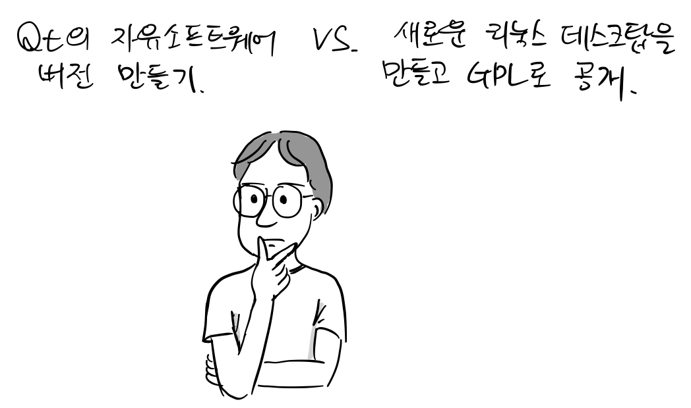

“더 이상 트롤테크의 결정을 기다릴 수가 없네. 결국, 우리에게는 두가지 선택지가 있군. Qt의 자유 소프트웨어 버전을 만들거나, 새로운 리눅스 데스크탑을 만들어 GPL로 공개하는 것.”

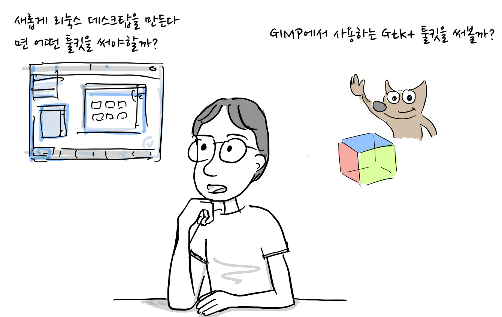

“새롭게 리눅스 데스크탑을 만든다면 어떤 툴킷을 써야할까?”  
“GIMP에서 사용하는 Gtk+ 툴킷을 써볼까?”

Gtk+ 툴킷은 원래 GIMP에서만 사용하기 위해 만든 위젯이였다. 하지만, 별도로 다른 애플리케이션을 만드는데 사용할 수 있도록 설계되었다.

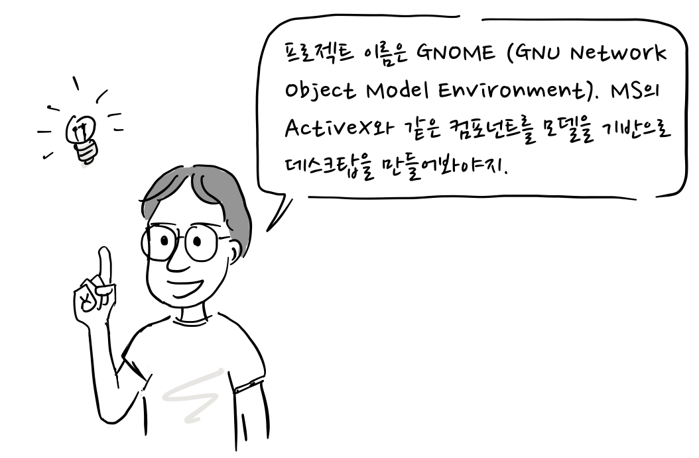

“프로젝트 이름은 GNOME (GNU Network Object Model Environment). MS의 [ActiveX](https://ko.wikipedia.org/wiki/%EC%95%A1%ED%8B%B0%EB%B8%8CX)과 같은 컴포넌트를 모델을 기반으로 데스크탑을 만들어봐야지.”

1997년 8월 17일, 미겔은 [그놈 프로젝트의 시작을 정식으로 발표](http://lwn.net/2001/0816/a/gnome.php3)한다.

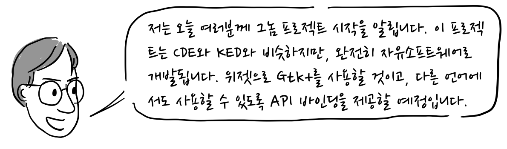

“저는 오늘 여러분께 그놈 프로젝트 시작을 알립니다. 이 프로젝트는 CDE와 KDE와 비슷하지만, 완전히 자유소프트웨어로 개발됩니다. 위젯으로 Gtk+를 사용할 것이고, 다른 프로그래밍 언어에서도 사용할 수 있도록 API 바인딩을 제공할 예정입니다.”

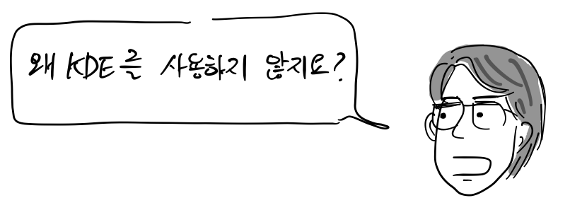

“왜 KDE를 사용하지 않지요?”

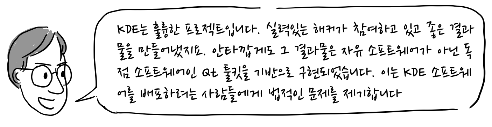“KDE는 훌륭한 프로젝트입니다. 실력있는 해커가 참여하고 있고 좋은 결과물을 만들어냈지요. 안타깝게도 그 결과물은 자유 소프트웨어가 아닌 독점 소프트웨어인 Qt 툴킷을 기반으로 구현되었습니다. 이는 KDE 소프트웨어를 배포하려는 사람들에게 법적인 문제를 제기합니다.

  
“대신에 Qt의 자유 소프트웨어 버전을 만들면 되지 않을까요?”

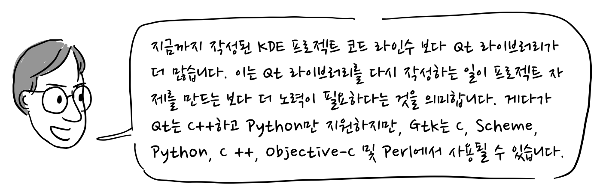“지금까지 작성된 KDE 프로젝트 코드 라인수 보다 Qt 라이브러리가 더 많습니다. 이는 Qt 라이브러리를 다시 작성하는 일이 프로젝트 자제를 만드는 것 보다 더 노력이 필요하다는 것을 의미합니다. 게다가 Qt는 C++하고 Python만 지원하지만, Gtk+는 C, Scheme, Python, C++, Objective-C 및 Perl에서 사용될 수 있습니다.”

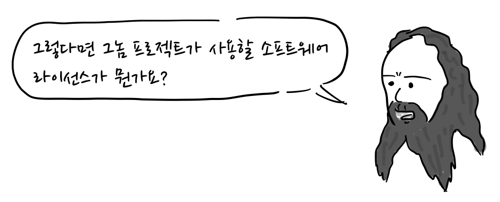  
“그렇다면 그놈 프로젝트가 사용할 소프트웨어 라이선스가 뭔가요?”

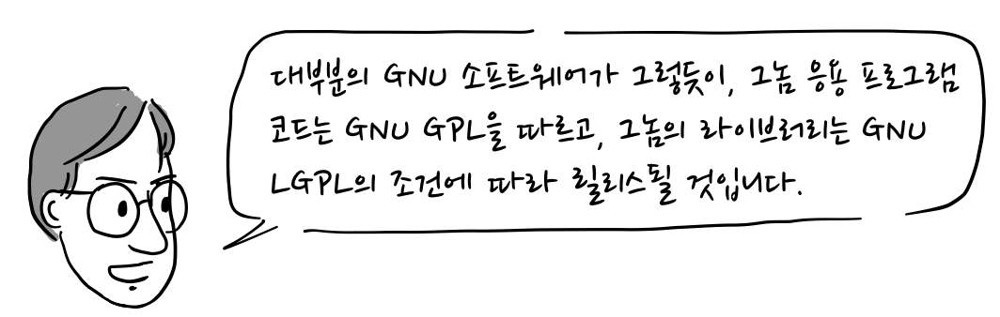“대부분의 GNU 소프트웨어가 그렇듯이, 그놈 프로젝트에서 개발한 소프트웨어는 GNU GPL을 따르고, 라이브러리는 GNU LGPL의 조건에 따라 릴리스될 것입니다.

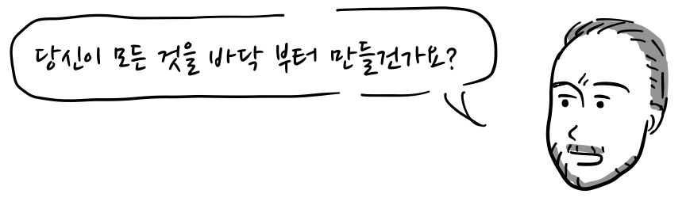  
“당신이 모든 것을 바닥 부터 만들건가요?”

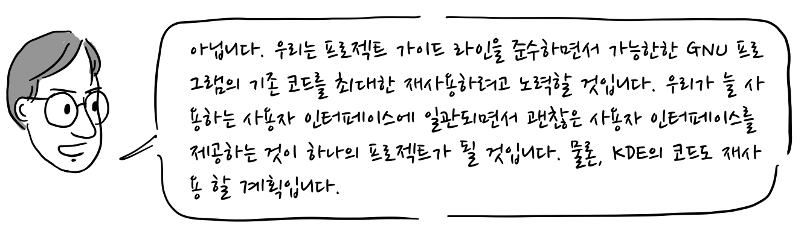

아닙니다. 우리는 프로젝트 가이드 라인을 준수하면서 가능한한 GNU 프로그램의 기존 코드를 최대한 재사용하려고 노력할 것입니다. 또한, 일관되면서 편리한 사용자 인터페이스를 제공하는 것도 하나의 프로젝트가 될 것입니다. 물론, KDE의 코드도 재사용 할 계획입니다.

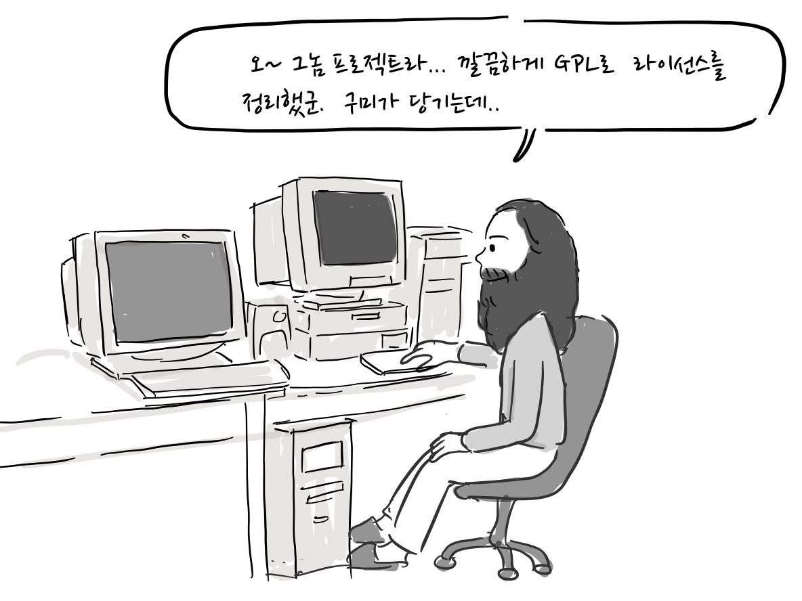  
“오~ 그놈 프로젝트라… 깔끔하게 GPL로 라이선스를 정리했군. 구미가 당기는데..”

리눅스 커널 해커인 알랜 콕스(Alan Cox)도 초기 그놈 프로젝트가 자리를 잡는데, 많은 기여를 한다. 회사로서는 레드헷도 그놈 프로젝트에 참여한다.

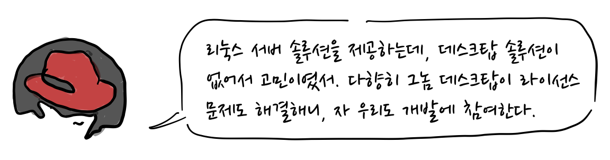“리눅스 서버 솔루션을 제공하는데, 데스크탑 솔루션이 없어서 고민이였는데, 다행히 그놈 데스크탑이 라이선스 문제도 해결해니, 자 우리도 개발에 참여한다.”

이외에도 많은 해커들이 그놈 프로젝트에 기여를 하기 시작한다.

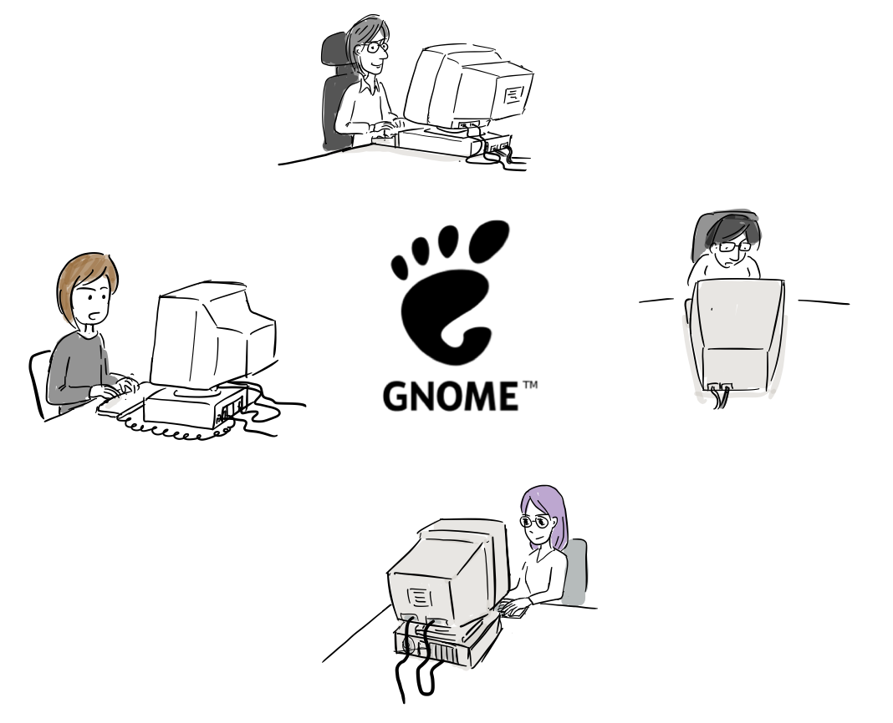

Gtk+ 역시 크로스 플랫폼을 지원하기 때문에 그놈 프로젝트의 탄생은 Qt에게 위협이 되었다. 결국, 트롤테크는 1998년 QPL 라이선스를 발표했다.

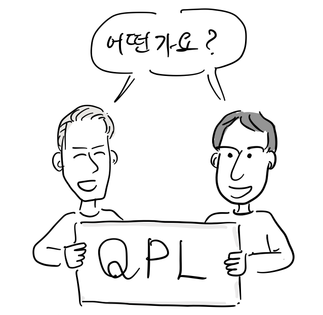  
QPL를 통해 KDE 애플리케이션의 재배포 문제를 해결했지만, 여전히 자유 소프트웨어 진영을 만족시킬 수 없었다.

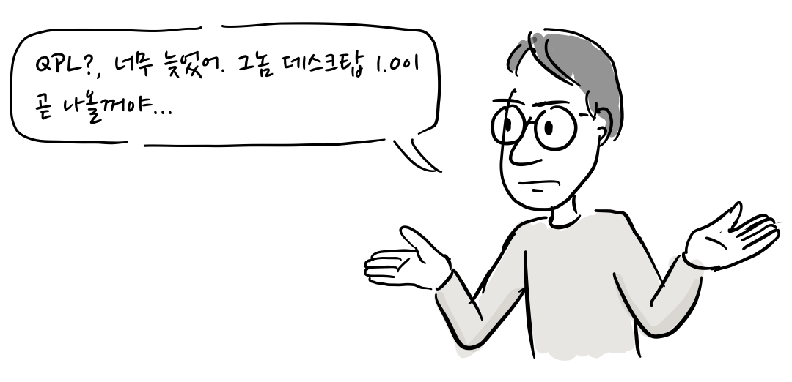

“QPL?, 너무 늦었어. 그놈 데스크탑 1.0이 곧 나올꺼야.”

그놈 데스크탑 0.3 출처: [A Brief History of GNOME](https://blogs.gnome.org/jrb/files/2017/07/A-Brief-History-of-GNOME-1.pdf), GUADEC, 2017

1998년 9월 0.3 버전을 출시한다.

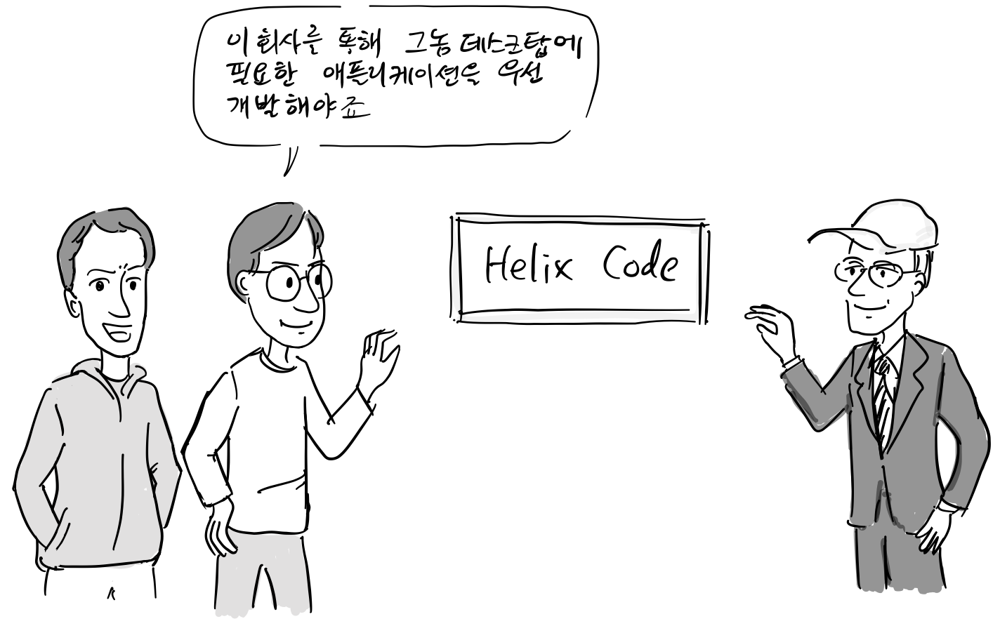

1999년 10월, 미겔은 레드헷 창업자 밥 영의 도움으로 [넷 프라이드맨(Nat Friedman)](https://en.wikipedia.org/wiki/Nat_Friedman)과 함께 그놈 애플리케이션을 개발하는 헬릭스 코드(Helix Code)라는 회사를 창업한다.

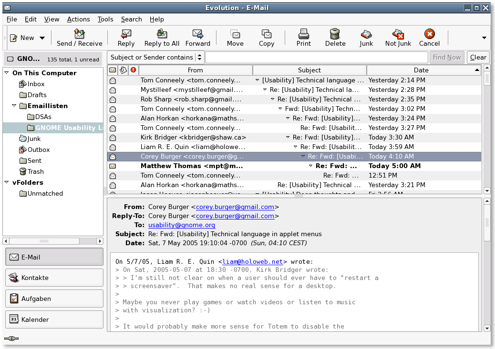에벌루션의 이메일 클라이언트([출처: 위키피디아)](https://commons.wikimedia.org/wiki/File:Evolution_mail.png)

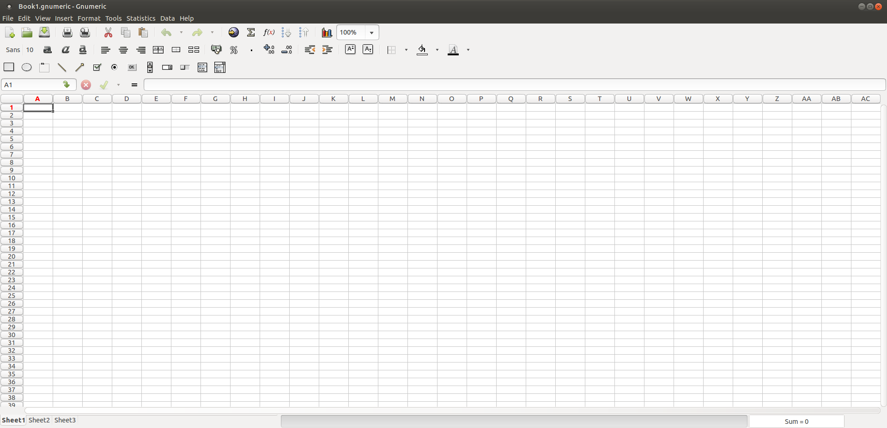[위키피디아](https://en.wikipedia.org/wiki/Gnumeric#/media/File:Gnumeric_1.12.9.png))

여기서 엑셀과 호환되는 [지뉴메릭(Gnumeric](https://en.wikipedia.org/wiki/Gnumeric))과 아웃룩과 호환되는 [에벌루션(Evolution)](https://ko.wikipedia.org/wiki/%EC%97%90%EB%B2%8C%EB%A3%A8%EC%85%98_\(%EC%86%8C%ED%94%84%ED%8A%B8%EC%9B%A8%EC%96%B4\))을 개발한다. 이 회사는 많은 그놈 프로젝트 해커를 고용해서 개발을 지원했고 이는 그놈 프로젝트가 안정적으로 발전하는데 도움을 준다.

1999년 8월 매킨토시 초기 개발자로 유명한 [앤디 헤르츠펠트](https://en.wikipedia.org/wiki/Andy_Hertzfeld)가 세운 [Eazel](https://en.wikipedia.org/wiki/Eazel)이라는 회사는 그놈 데스트탑용 파일 관리자인 [노틸러스](https://ko.wikipedia.org/wiki/%EB%85%B8%ED%8B%B8%EB%9F%AC%EC%8A%A4_\(%ED%8C%8C%EC%9D%BC_%EA%B4%80%EB%A6%AC%EC%9E%90\))를 개발한다. 회사는 나중에 문을 닫았지만, 노틸러스는 현재까지도 그놈 데스크탑에서 사용되고 있다.

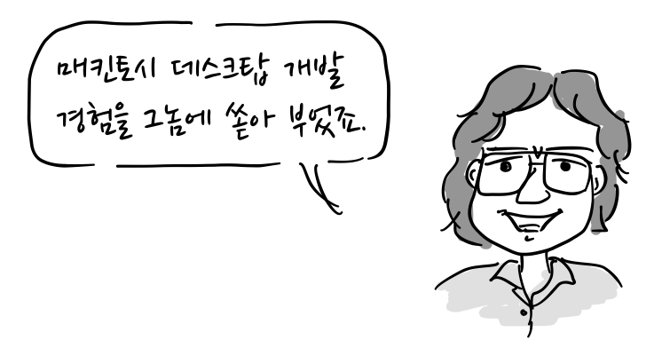  
“매킨토시 데스크탑 개발 경험을 그놈에 쏟아 부었죠.”

또한 썬 마이크로시스템즈도 GNOME Accessbility 프로젝트를 시작한다.

마침내 그놈 공동체는 1999년 9월 그놈 데스크탑 1.0을 출시한다.

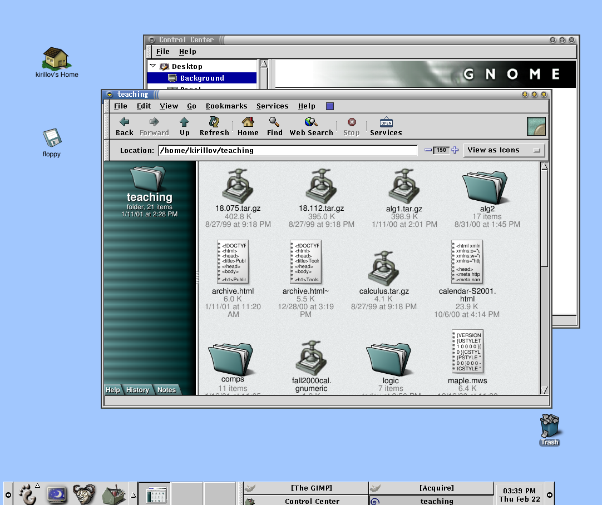  
그놈 데스트탑 1.0 (출처: [위키피디아](https://en.wikipedia.org/wiki/GNOME#/media/File:GNOME_1.0_\(1999,_03\)_with_GNOME_Panel_1_and_File_Manager.png))

결국, 트롤테크는 2000년 Qt에 GPL 라이선스를 추가한다. 하지만, 이는 너무 늦은 대처였고, 결과적으로 오픈소스 데스크탑은 GNOME과 KDE 공동체로 분열되고, 데스크탑 전쟁이라고 부를 만큼 서로 경쟁하게 된다.

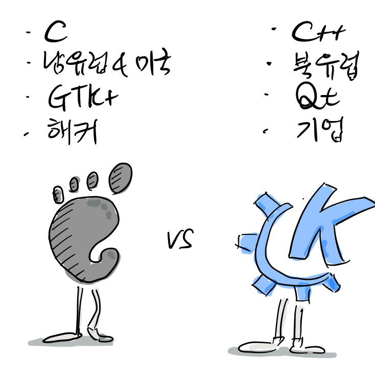

-   C vs. C++
-   미국 & 남유럽 vs. 북유럽
-   해커 vs. 기업
-   GTK+ vs. Qt

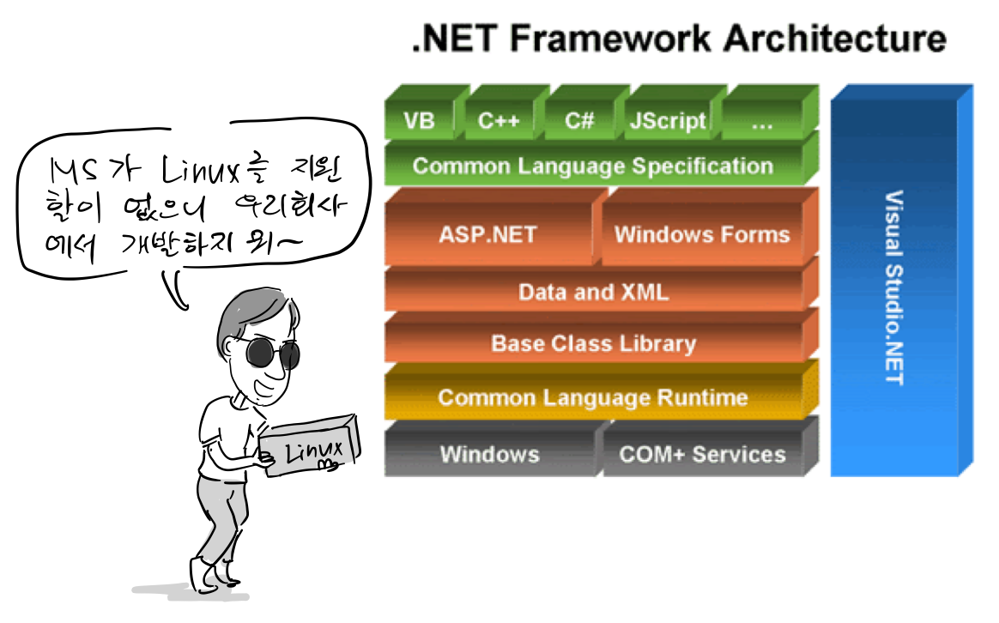

이후, 미겔은 회사 이름을 Ximian으로 변경하고 닷넷 프레임워크(.Net Framework)의 오픈소스 버전인 모노(Mono)를 개발한다. Ximain은 그놈 재단 멤버로 그놈 프로젝트를 후원했고, 데스트탑 리눅스 콘서시엄 멤버이기도 했다. 이후 2003년 4월 노벨에 인수됐지만, 노벨을 인수한 Attachmat Group에서 모노팀을 해고하자, 미겔은 팀을 이끌고 2011년 Xarmarin이라는 회사를 설립하고 모노 개발을 지속한다. 2016년 MS는 Xamarin을 인수하고 공식적으로 모노를 통해 리눅스용 닷넷 프레임워크를 지원하기 시작한다.

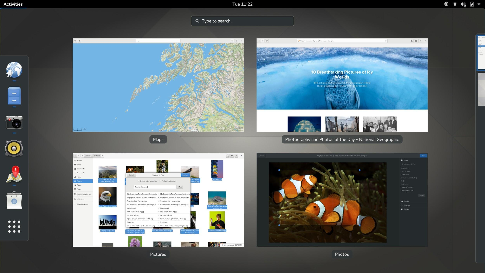  
그놈 데스크탑 3.0 (출처: gnome.org)

현재 그놈 데스크탑은 레드헷에서 주요 개발팀을 이끌고 있고 그놈 공동체와 개발하고 있다. 현재 3.0 버전이 나와 있으며 레드헷, 우분투, 페도라 등 여러 리눅스 배포본에서 사용하고 있다.

참고

-   [Rebel Code](https://en.wikipedia.org/wiki/Rebel_Code), Glyn Moody, 2001
-   [A Brief History of GNOME](https://blogs.gnome.org/jrb/files/2017/07/A-Brief-History-of-GNOME-1.pdf), GUADEC, 2017
-   [The GNOME Desktop Project announcement](http://lwn.net/2001/0816/a/gnome.php3), lwn.net
-   [Helix Code, Eazel the revelations of LinuxWorld](https://www.zdnet.com/article/helix-code-eazel-the-revelations-of-linuxworld/), zdnet, 2000
-   [Think KDE is ahead of GNOME? Try Helix Code, and think again](https://www.techrepublic.com/article/think-kde-is-ahead-of-gnome-try-helix-code-and-think-again/), TechRepublic, 2000
-   http://world4study.blogspot.com/2012/05/net-framework.html
