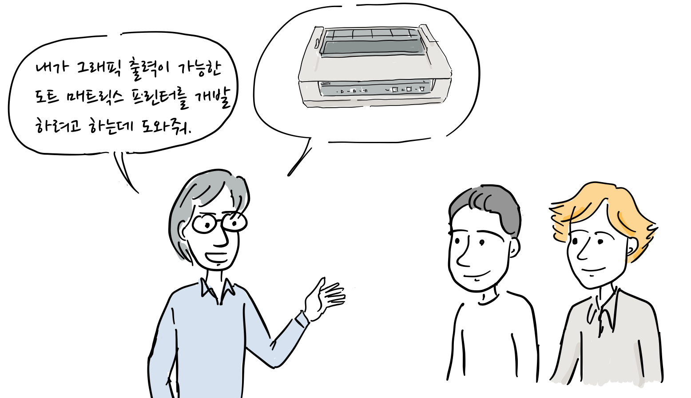
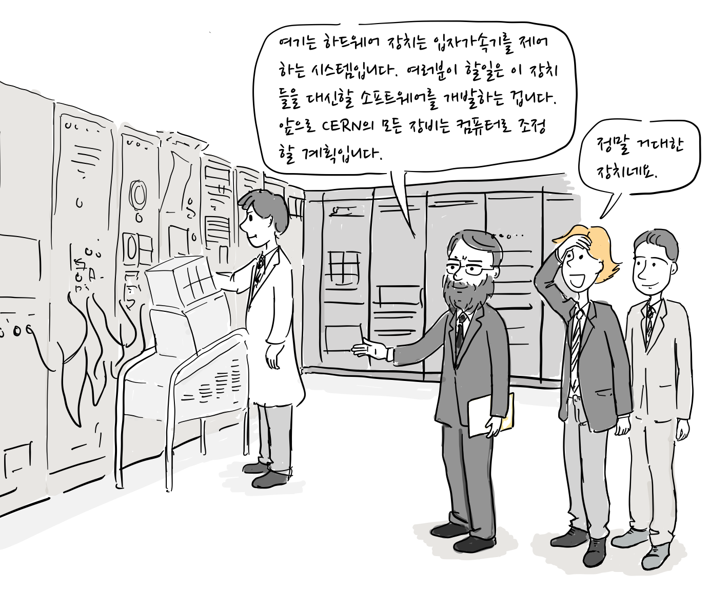
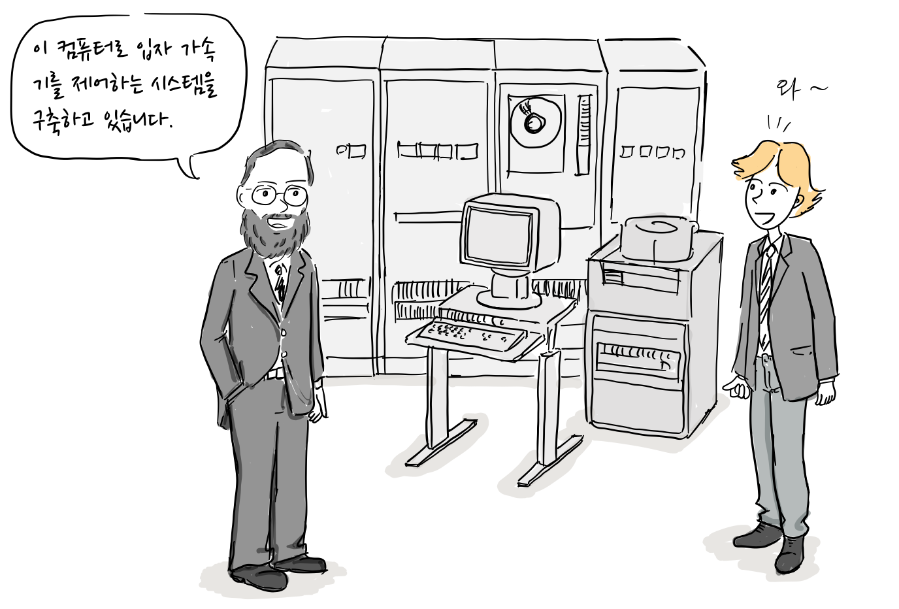
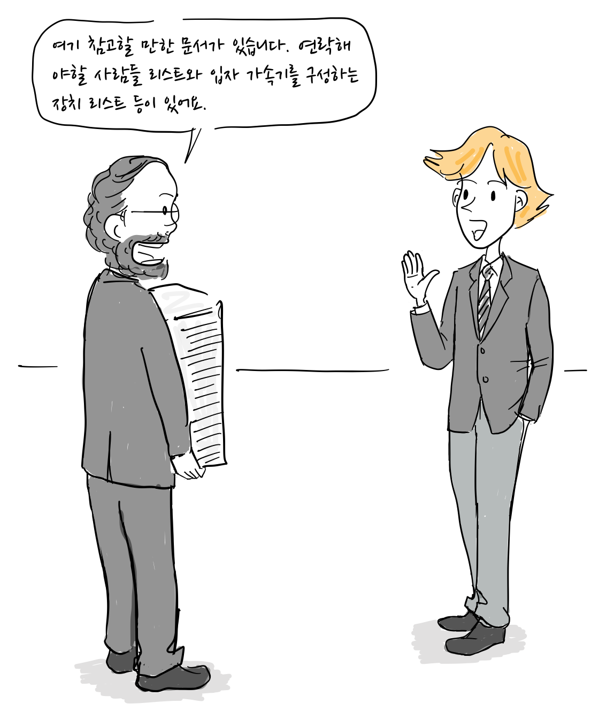
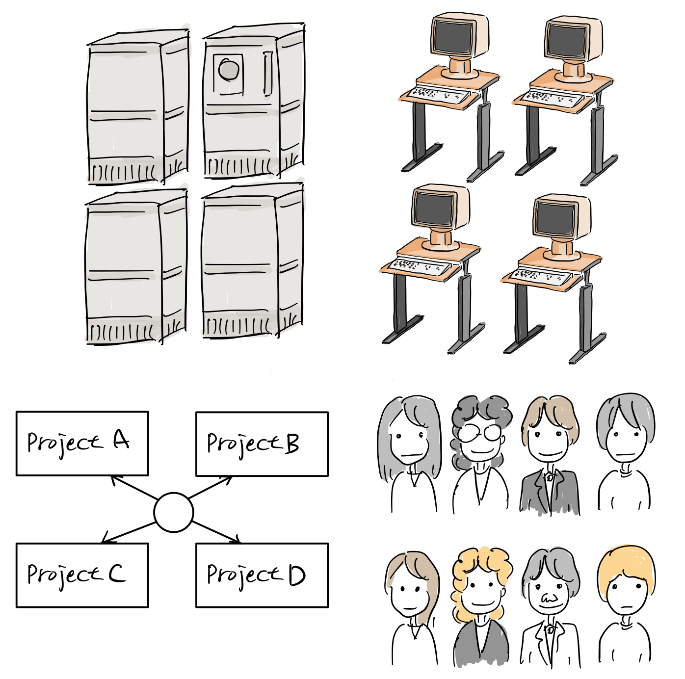
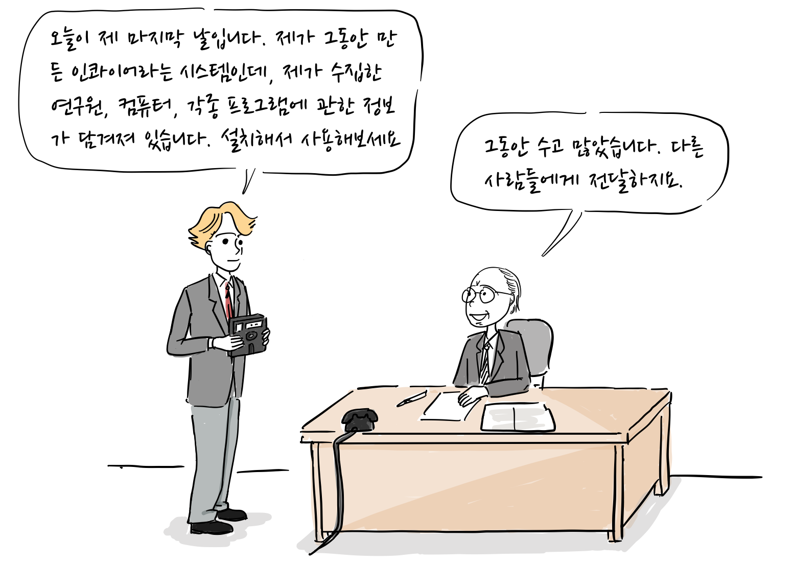

#### 팀 버너스 리의 어린 시절

팀 버너스 리(이하 팀)는 1955년 영국 런던에서 태어났다. 그의 부모님은 모두 수학을 전공했고 최초의 상업용 프로그램 내장식 컴퓨터인 [맨체스터 마크1](https://ko.wikipedia.org/wiki/%EB%A7%A8%EC%B2%B4%EC%8A%A4%ED%84%B0_%EB%A7%88%ED%81%AC_1)에서 소프트웨어를 개발했다\[1\]. 팀의 어머니 메리 리 버너스 리(Mary Lee Berners-Lee)는 1950년대에 [페란티 마크1(Ferranti Mark I)](https://ko.wikipedia.org/wiki/%ED%8E%98%EB%9E%80%ED%8B%B0_%EB%A7%88%ED%81%AC_1) 개발에 참여했고 최초의 프리랜서 컴퓨터 프로그래머였다. 그녀는 앨런 튜링([Alan Turing](https://www.theguardian.com/science/alan-turing))이 작성한 설명서를 보고 프로그램을 작성하도록 교육을 받았다. 아버지 또한 같은 회사인 페란티(Ferranti)에서 프로그래머로 일했다\[2\].

이러한 집안 분위기로 팀은 어려서 부터 모형 기차 선로를 만들면서 전자학을 배웠고, 옥스포드 대학 퀸스 칼리지에서 물리학을 공부했다. 팀은 초기 마이크로 프로세서를 사용하여 개인용 컴퓨터를 만들기도 했다.

1976년 대학을 졸업한 후, 한 통신회사에서 소프트웨어 엔지니어로 일을 하다가, 그래픽 출력이 가능한 도트 매트릭스 프린터 개발에 참여한다.

“내가 그래픽 출력이 가능한 도트 매트릭스 프린터를 개발하려고 하는데 도와줘.”

도트 매트릭스 프린터는 기본적으로 문자만 출력할 수 있었다. 하지만 프린터에 마이크로프로세서를 추가해서 도형 등 그래픽이 출력 가능한 프린터를 개발하려고 하였다, 하지만, 개발 자금이 금새 바닥이 나고 팀과 그의 동료 케빈은 다른 일자리를 구할 수 밖에 없었다.

“미안, 자금 사정이 여의치가 않아서 더 이상 급여를 줄 수가 없네.”

“잠시 다른 일을 알아봐야겠어.” “다행히 난 스위스에 컨설팅 일이 있어서 일단 거기서 잠깐 일을 하려고해.”

팀이 스위스에서 컨설팅 일을 하는 동안 옛 동료인 케빈에게 연락을 받는다.\[3\]

“팀, CERN에서 계약직 소프트웨어 엔지니어를 뽑는데, 같이 지원하지 않을래?” “입자가속기를 직접 볼 수 있겠군!”

유럽 입자 물리 연구소(CERN)은 1980년 당시 입자 가속기 제어 장치를 컴퓨터로 변경하는 작업을 진행 중이였고, 이 일을 할 엔지니어가 필요했다. 결국, 두 사람은 1980년 6월 24일 부터 스위스에 위치한 CERN에서 계약직 소프트웨어 엔지니어로 일하게 된다.

인터뷰가 끝난 후, 팀과 케빈은 CERN 내부를 구경할 기회를 갖게 된다.

“여기 하드웨어 장치는 입자가속기를 제어하는 시스템입니다. 여러분이 할일은 이 장치들을 대신할 소프트웨어를 개발하는 겁니다. 앞으로 CERN의 모든 장비는 컴퓨터로 조정할 계획입니다.” “정말 거대한 장치네요.”

#### CERN에서 인콰이어(Enquire) 개발

CERN은 유럽 20개 회원국의 투자로 만들어진 거대한 입자 가속기를 운영하고 있었고, 2016년 기준으로 2500명의 과학자, 기술자, 관리 직원이 상시적으로 일하고 있으며, 전세계 대학과 연구소에서 12000여명의 과학자가 방문했다.

출처: [위키피디아](https://en.wikipedia.org/wiki/Large_Hadron_Collider#/media/File:CERN_LHC.jpg)

팀은 첫 업무로 [노스크 컴퓨터(Norsk Data Computer)](https://en.wikipedia.org/wiki/Norsk_Data)에서 동작하는 입자 가속기 사용자 인터페이스 구현하게 된다.

“이 컴퓨터로 입자 가속기를 제어하는 시스템을 구축하고 있습니다.”

계약직 프로그래머에게 가장 어려운 문제는 전체 시스템을 이해하는 것이였다. 기존 제어 시스템 사용법과 새로 도입한 컴퓨터 프로그래밍을 함께 배워야했다. 중요 정보는 문서화되어 있지 않아 일일히 담당자에게 물어봐야했다.

“여기 참고할 만한 문서가 있습니다. 연락해야할 사람들 리스트와 입자 가속기를 구성하는 장치 리스트 등이 있어요.”

“각 담당자들을 명단을 다시 정리해야 하고 장치 설명서도 종류가 많으니 목록을 정리해야겠어. “

그에게는 1 만명 정도의 연구원과 그들의 프로젝트 및 컴퓨터 시스템 간의 연결 관계를 분류 할 방법이 필요했다.

“CERN에서는 정말 많은 사람들이 일하고 장치들도 많군. 이를 관리하는 프로그램을 하나 만들어야겠어”

그리고 6개월 계약기간동안 그가 처리해야하는 모든 시스템, 프로그램, 장치 및 사람을 기억할 수 있도록 하이퍼텍스트 기반의 인콰이어(INQUIRE)라는 시스템을 구현했다. 이는 그가 어렸을 적 봤던 ” Enquire Within Upon Everything”에서 이름을 따왔다.

“그래 마치 ” [Enquire Within Upon Everything](https://en.wikipedia.org/wiki/Enquire_Within_upon_Everything)” 같은 것을 만들어서 필요한 정보를 빨리 접근할 수 있도록 해야겠어.”

이 책은 1850년경에 처음 출판되었는데, 모든 생활의 팁을 정리한다는 목적으로 요리법 부터 투자까지 다양한 분야를 정리한 책이다.

팀은 그 책을 떠올리며, CERN에서 그가 일하는데 필요한 정보를 쉽게 찾아볼 수 있는 시스템을 생각해낸 것이다. 각 페이지가 일종의 노드가 되고 새로운 노드는 기존 노드에 생성할 수 있는 하이퍼링크 시스템이였다. 오늘날 보면 위키와 비슷하다.

그는 [Norsk Data SINTRAN-III](https://en.wikipedia.org/wiki/Sintran_III) 운영체제에서 파스칼 언어를 이용해서 짧은 시간 동안 인콰이어(Enquire)를 개발했다. 하지만, 계약이 끝나고 그가 만든 인콰이어는 8인치 플로피 디스켓으로 저장해서 남겼지만 나중에 소실되고 만다.

“오늘이 제 마지막 날입니다. 제가 그동안 만든 인콰이어라는 시스템인데, 제가 수집한 연구원, 컴퓨터, 각종 프로그램에 관한 정보가 담겨져 있습니다. 설치해서 사용해보세요” “그동안 수고 많았습니다. 다른 사람들에게 전달하지요.”

다음편에 이어집니다.

\[1\] [Weaving the Web](https://www.w3.org/People/Berners-Lee/Weaving/Overview.html), Tim Berners-Lee, 1999 \[2\] [Mary Lee Berners-Lee obituary | Technology](https://www.theguardian.com/technology/2018/jan/23/mary-lee-berners-lee-obituary) \[3\] How the web was born, Gillies & Cailliau, Oxford university press, 2000
