팀 버너리스 리(이하 팀)은 다시 영국으로 돌아와 프린터 개발을 이어갔다.

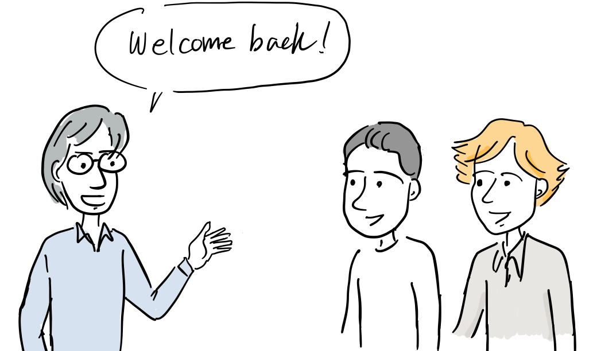

“다들 환영해. 그동안 프린터를 팔기시작했고 계약도 좀 체결했어. 이제 함께 소프트웨어를 개발하면 돼.”

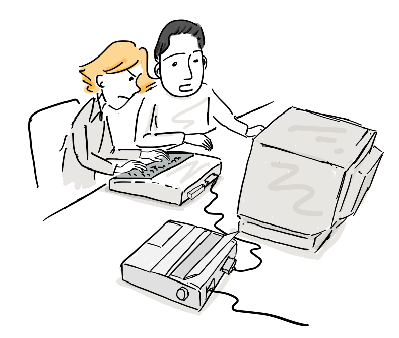

다시 모인 셋은 프린터 헤드 구동부 코드를 재작성하고 아랍 문자와 3차원 도형을 출력할 수 있도록 하였다. 하지만, 어느새 시간이 지나고 팀에게는 영국에서의 삶에 변화가 필요했다.

“잠깐이였지만, CERN에서 일할 때가 즐거웠던 것 같아. CERN에 일할 자리가 없을까?

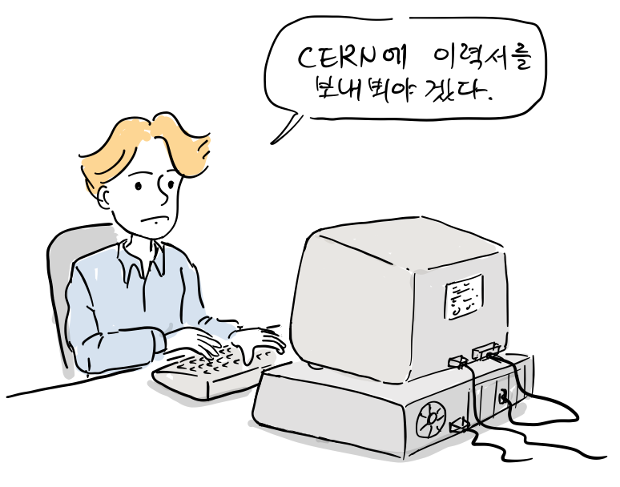

결국, CERN에 특별 연구원 자리에 지원했고, 1984년 9월에 다시 CERN에 복귀하여 실험 데이터를 수집하고 처리하는 Data acquisition and control 그룹에서 일을 하게 된다.

“다시 CERN에서 가서 일하기로 했어요” “그동안 프린터 개발에 참여해줘서 고마워, 이직 선물로 컴팩에서 새로 출시한 휴대용 컴퓨터를 줄께.”

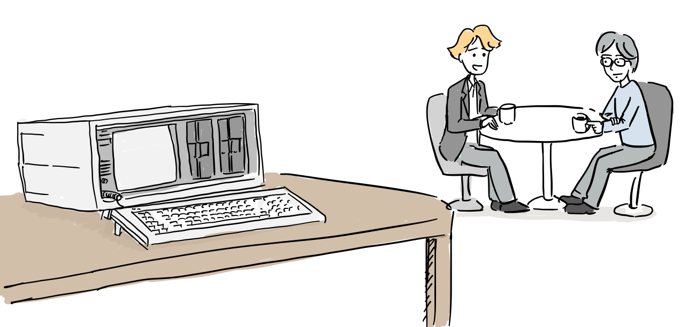

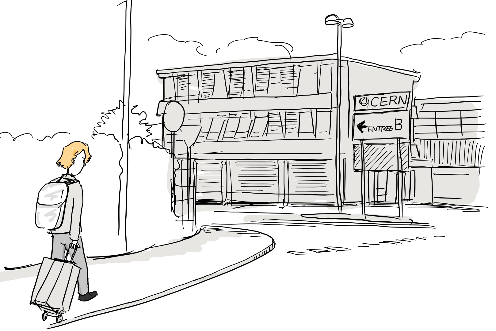

팀을 뽑은 페기 림머(Peggie Rimmer)는 그에게 CERN에서 필요한 각종 표준을 작성하는 일을 맡겼다.

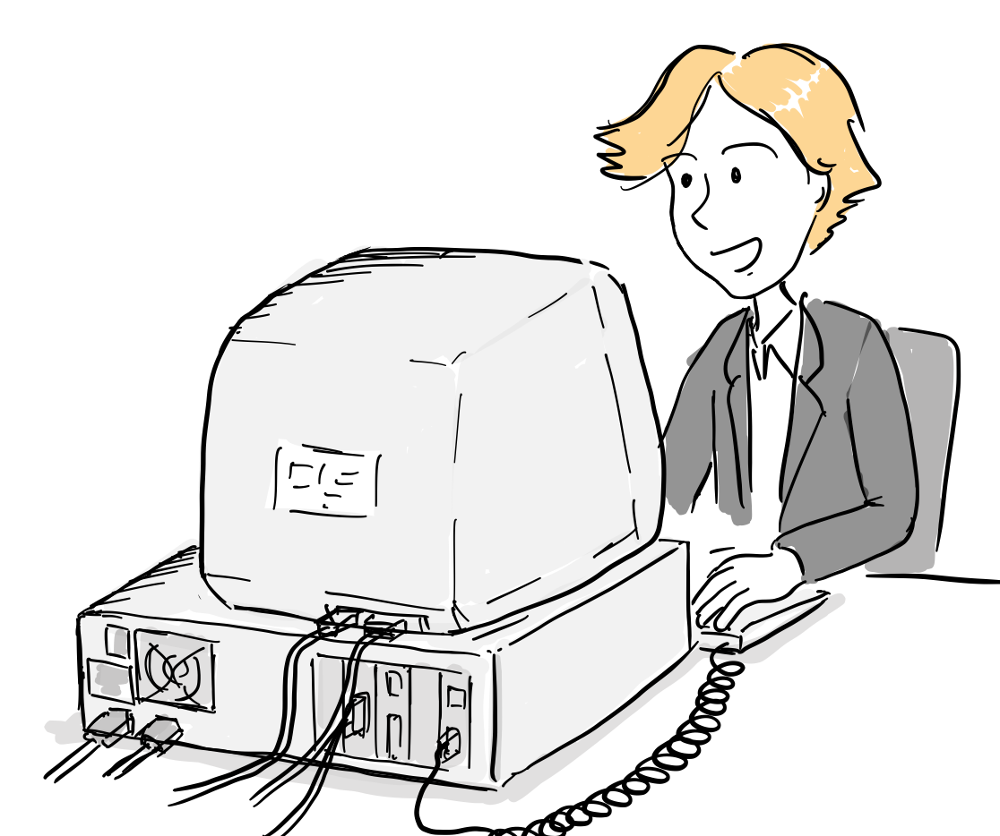

“시작부터 문서화 작업이네…. 언젠가는 도움이 되겠지..”

CERN은 각국의 투자로 만들어진 거대한 입자 가속기를 운영하고 있었고, 세계 여러나라에서 온 많은 과학자들이 CERN 연구소에서 일하거나 원격으로 연구하면서 정기적으로 연구소를 방문하고 있었다. 1984년까지 CERN은 계속 확장 중이였고, 27KM의 크기로 새로운 입자 가속기도 지하 백미터에 건설되고 있었다.

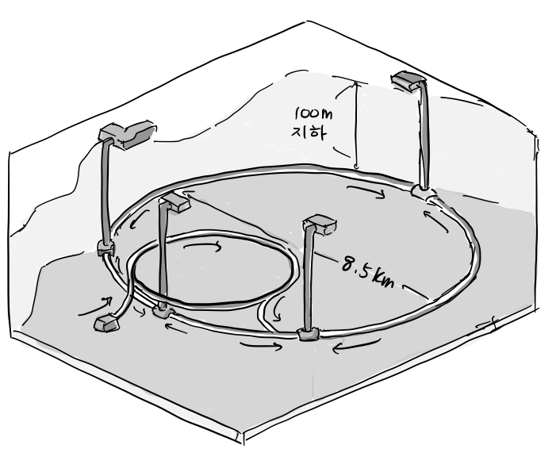

참고([링크](https://www.arnnet.com.au/slideshow/429544/pictures-higgs-boson-phenomenon/))

이 당시 CERN에는 새로운 세대의 운영체제, 컴퓨터, 프로그래밍 언어가 도입되고 있었고, 이들 컴퓨터는 다양한 네트워크 프로토콜을 통해 이 거대한 장치에 연결되어 있었다.

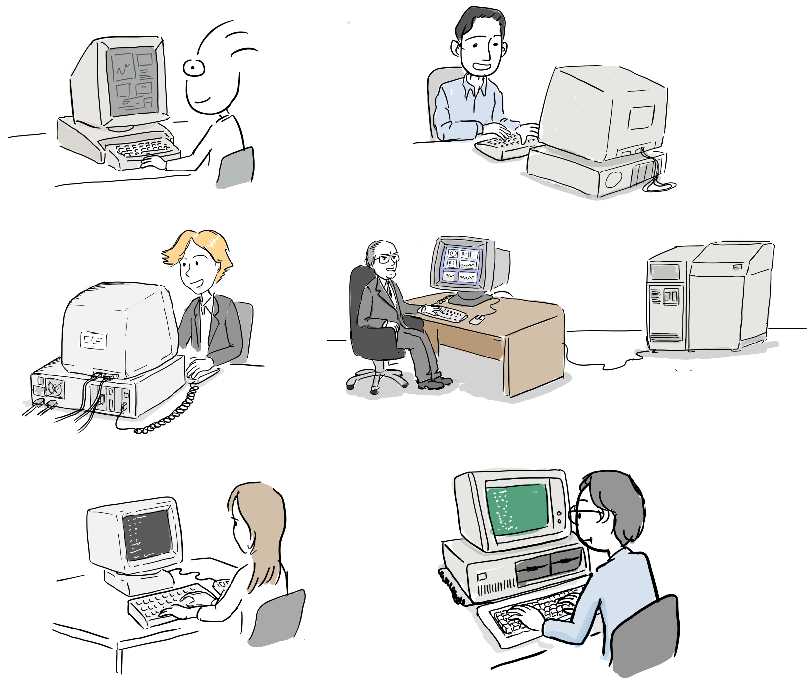

이 당시에는 IBM과 DEC에서 만든 대형 컴퓨터부터 PC나 매킨토시와 같은 개인용 컴퓨터까지 다양한 유형의 컴퓨터가 있었으며, 여러 워드 프로세서가 사용되었다.

이들이 사용하는 컴퓨터와 장비로 서로 상호 연동해야할 필요가 있었고, 데이터와 문서도 효과적으로 관리되고 접근 가능해야했다. 이를 위해 팀은 CERN의 다양한 시스템이 상호 작용할 수 있도록 원격 프로 시저 호출 (RPC) 프로그램을 작성하게 된다.

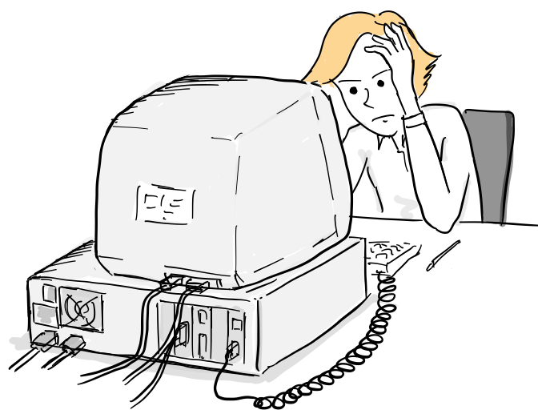

“전에 만들었던 인콰이어가 있었으면 좋으련만..”

그러면서, 전에 만들던 인콰이어를 컴팩 포터블에서 다시 만들었고 VAX 미니 컴퓨터에서도 동작할 수 있도록 하였다.

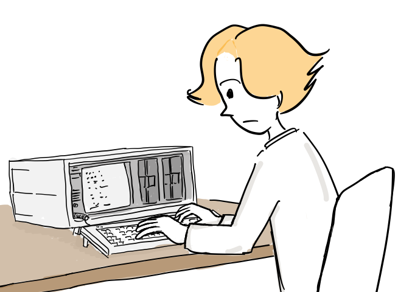

“뭐, 새로 하나 만들지”

이번에는 하나의 컴퓨터에 있는 파일을 접근하는 것이 아니라 RPC를 구현하면 얻은 경험으로 네트워크에 연결된 여러 컴퓨터간의 사용할 수 있는 아이디어를 생각해냈다.

“그래, 그동안 경험한 네트웍 프로그래밍을 바탕으로 네트워크 버전의 인콰이어를 다시 만들어보는거야.”

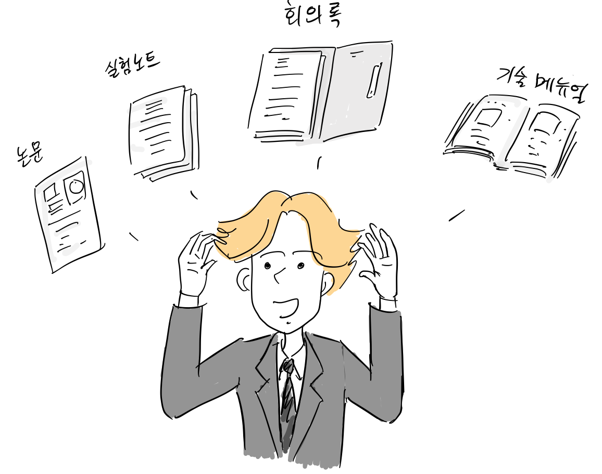

“그런데, 연구원들의 논문이나 소프트웨어 대한 기술 메뉴얼, 회의록, 실험 노트등 서로 다른 정보에 쉽게 접근하는 방법은 없을까?”

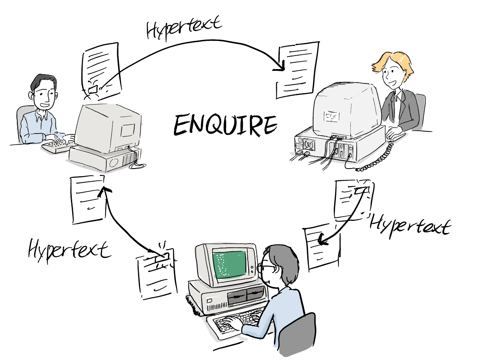

“인콰이어도 하이퍼텍스트를 구현하면 되겠군. 하이퍼텍스트로 다른 컴퓨터에 있는 저장된 정보를 접근하도록 하면 되겠군요. 별다른 허락 없이 운영체제가 다르더라도 동작하도록 해야지.”

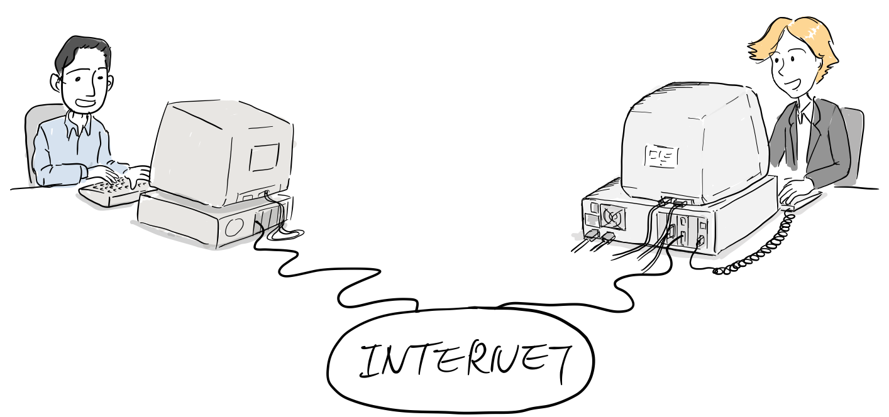

“CERN의 모든 컴퓨터는 이미 인터넷에 연결되어 있으니까, 하이퍼텍스트로 다른 컴퓨터 접근하는데는 기술적 문제는 없고. 중앙의 관리가 없이, 하이퍼 링크를 구현할 주소 체계가 필요하겠군.”

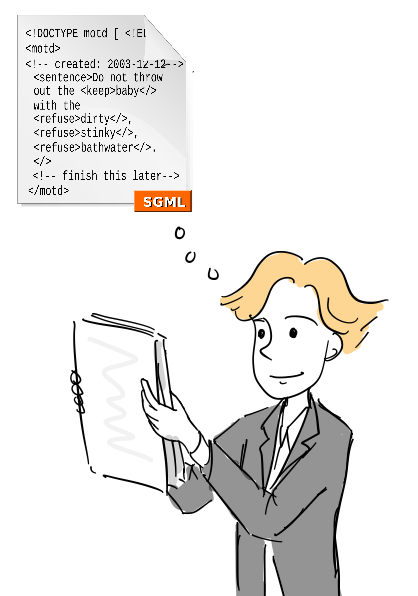

“문서 포맷은 이미 CERN에서 SGML(Standard Generalized Markup Language)을 표준으로 사용하고 있으니까, SGML형식으로 만들면 되겠다.”

당시 CERN에도 문서 관리 시스템이 있었지만, 특정 포맷의 문서만 저장할 수 있었고 오직 4가지 카테고리만 으로 분류할 수 있었다.

“내가 만든 인콰이어를 네트워크를 통해 다른 사람도 접근할 수만 있다면 CERN내에서 정보 공유가 아주 쉬워질 것 같아.”

팀은 당시 상사였던 마이크 센달(Mike Sendall)에게 아이디어를 말하기로 결심한다.

“팀장님 저에게 정보공유 시스템에 대한 아이디어 있는데, 한번 들어보실래요?”

“뭔가요?”

“아시다시피, CERN에는 정말 다양한 출신의 연구원들이 서로 컴퓨터로 인터넷에 연결되어 연구를 진행하고 있잖아요? 그런데, 정보를 공유하기가 참 어려워요. 팀 마다 서로 다른 소프트웨어를 사용하고 문서 포맷도 다르지요.” “컴퓨터간에 하이퍼 텍스트로 문서와 문서내에 있는 리소스를 찾을 수 있는 주소 체제와 데이터를 주고 받을 수 있는 새로운 프로토콜을 만들면 어떨까요? 기존의 소프트웨어로는 이를 구현하는 것이 어려우니, 뭔가 새로운 것을 만들 필요가 있습니다.”

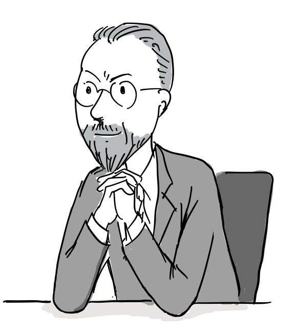

“좋은 아이디어 같은데, 한번 제안서로 정리해오세요.”

“네, 감사합니다!”

1989년 3월 웹에 대한 그의 비전을 정리한 [Information Management: A Proposal](http://info.cern.ch/Proposal.html) 라는 문서를 완성한다.

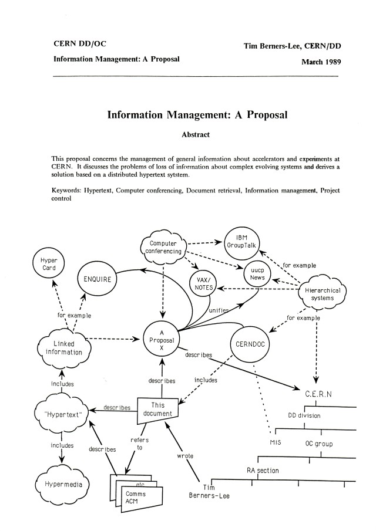

출처: [A short history of the Web](https://home.cern/science/computing/birth-web/short-history-web)

팀이 작성한 “정보 관리”에 대한 제안서는 얼마후 그의 상사에게 보고가 된다.

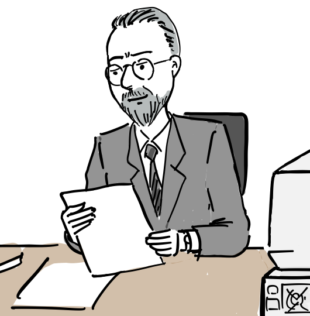

그는 팀이 작성한 첫번째 제안서 겉표지에 “모호하지만, 흥미롭군(Vague But exciting…)이라는 문구를 남긴다.

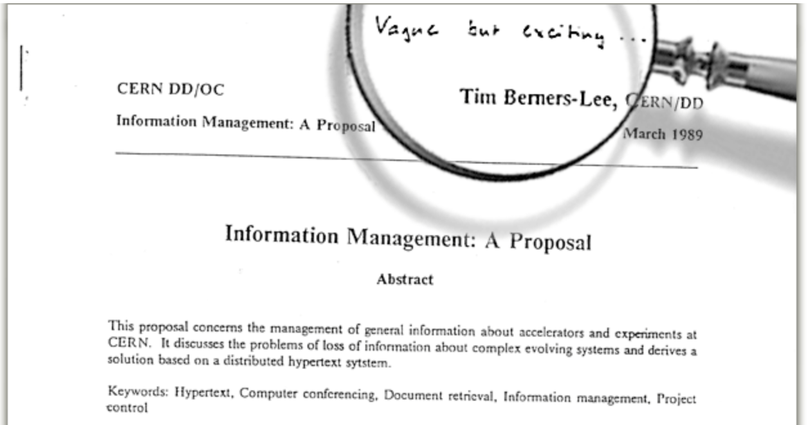

출처: [cern.info.ch – Tim Berners-Lee’s proposal](http://info.cern.ch/Proposal.html)

다음에 계속..

**참고**

1.  [Weaving the Web](https://www.w3.org/People/Berners-Lee/Weaving/Overview.html), Tim Berners-Lee, 1999
2.  How the web was born, Gillies & Cailliau, Oxford university press, 200
3.  [A short history of the Web](https://home.cern/science/computing/birth-web/short-history-web), CERN
