1989년 3월말 팀 버너스 리(이하 팀)의 상사인 마이크 샌들과 그의 상사인 데이비드 윌리엄 및 몇몇 주변 사람에게 제안서를 주었지만, 별 다른 일은 일어나지 않았다.

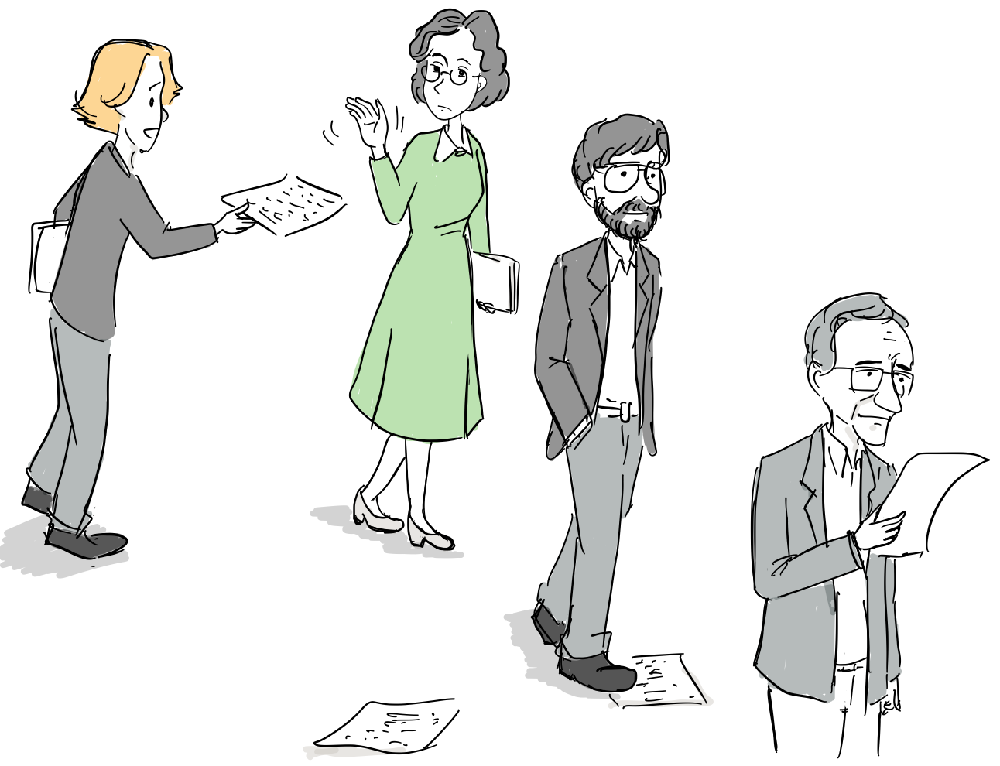

이후, 자신의 아이디어를 CERN에 있는 여러 사람들과 나누었지만, 호의적인 반응은 얻지 못했다.

이미 그가 진행 중인 RPC(Remote Procedure call) 프로젝트 조차도 CERN내에서 약간의 공식적인 지원이 있었을 뿐이었다.

사실, CERN내에 인터넷과 TCP/IP가 도입되는데도 약간의 진통이 있었다. 이미 많은 물리학자들이 [DEC](https://ko.wikipedia.org/wiki/%EB%94%94%EC%A7%80%ED%84%B8_%EC%9D%B4%ED%81%85%EB%A8%BC%ED%8A%B8_%EC%BD%94%ED%8D%BC%EB%A0%88%EC%9D%B4%EC%85%98)사에서 만든 [VAX](https://ko.wikipedia.org/wiki/VAX)/[VMS](https://ko.wikipedia.org/wiki/OpenVMS) 운영체제와 네트워킹으로 [DECnet](https://en.wikipedia.org/wiki/DECnet) 프로토콜을 사용하고 있었고, 일부는 새롭게 부상한 유닉스와 TCP/IP 프로토콜을 사용하고 있었다.

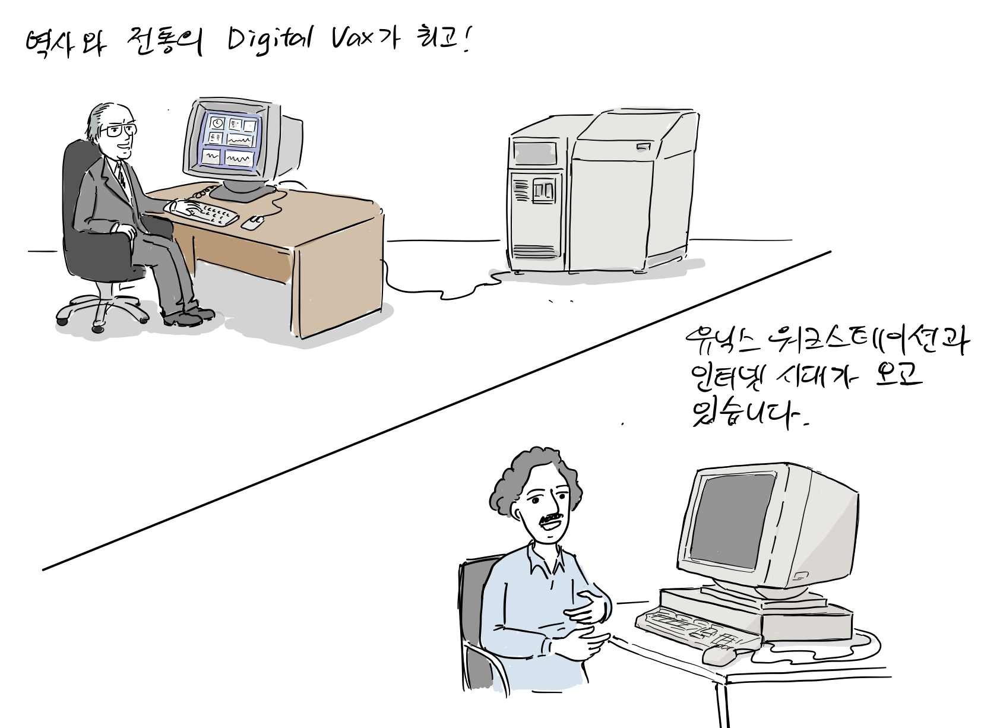

*VAX/VMS over DECnet vs. Unix over TCP/IP*

CERN이 유럽을 기반으로 하고 있다보니, 미국에서 만들어진 인터넷을 도입하는데도 처음에는 어려움이 뒤따랐다.

당시 벤 세갈(Ben Segal)은 CERN내에서 인터넷 에반젤리스로 활동하면서 유닉스와 인터넷 보급에 앞장섰다,

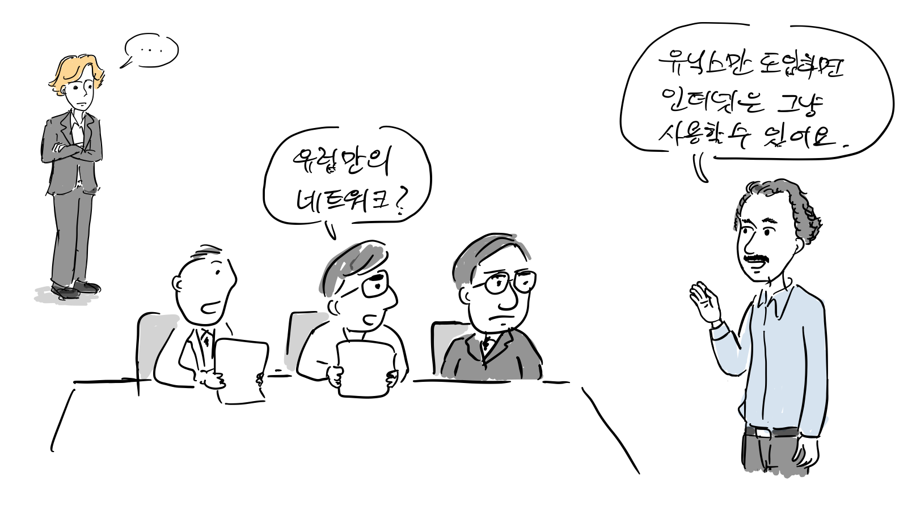

“미국에서 만든 인터넷 보다는 유럽만의 독자적인 네트워크가 필요하지 않을까요? “인터넷은 이미 전세계에 걸쳐 연결되고 있습니다. 게대가 유닉스만 도입하면 TCP/IP를 기반으로 한 인터넷은 그냥 사용할 수 있어요.”

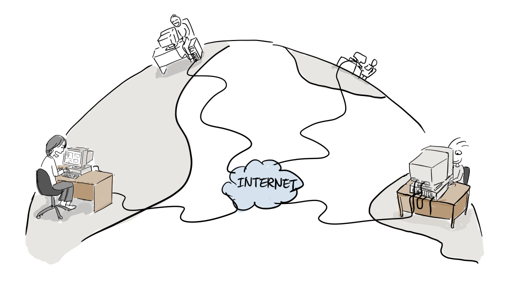

결국, TCP/IP가 대세가 되고 VMS 운영체제에서도 TCP/IP가 동작하기 시작했다. 팀도 자신이 개발하고 있는 RPC 시스템에 TCP/IP를 지원하도록 하였고, VMS와 유닉스 두 운영체제에서 서로 동작하도록 하였다. 그리고 팀도TCP/IP를 기반으로 하이퍼텍스트 정보 공유 시스템을 제안한 것이다. 하지만, 팀은 1990년 초까지 관리 부서로 부터 아무런 응답도 받지 못했고 다시 제안서를 수정해서 데이비드 윌리엄(상사의 상사)에게 전달했다.

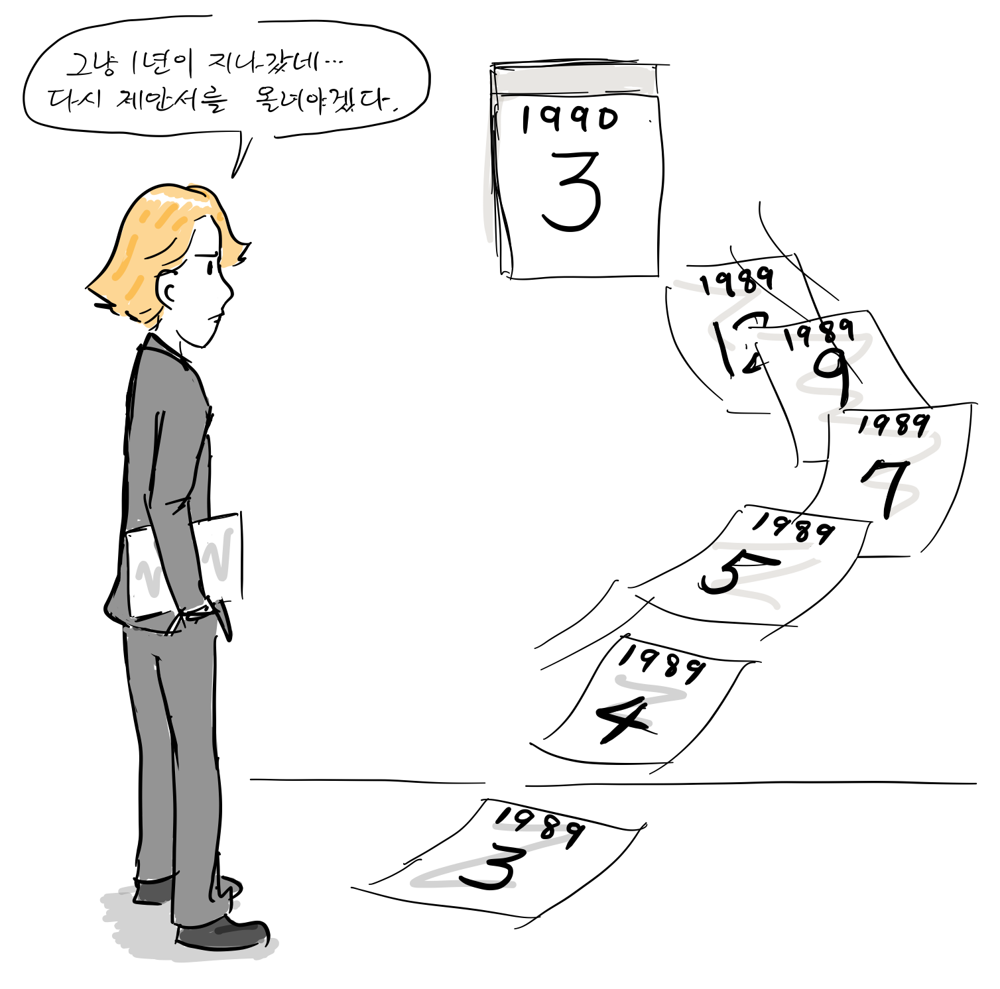

그러던, 어느날 CERN의 유닉스와 인터넷 전도사였던 [벤 세갈](https://internethalloffame.org/inductees/ben-segal)로 부터 NeXT 컴퓨터에 대한 이야기를 듣는다.

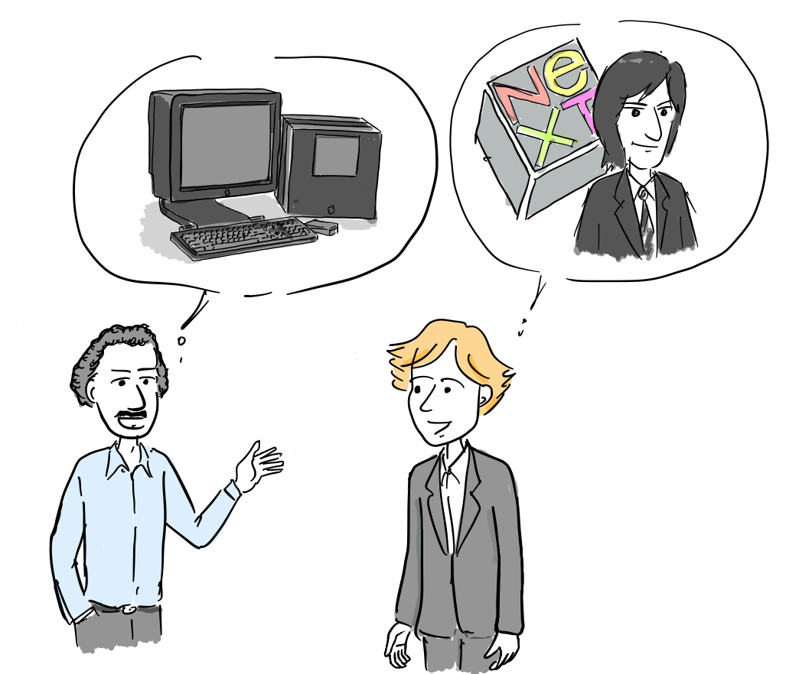

“이봐, 팀 자네 유닉스에 관심이 많았지? 이번에 새로 나온 NeXT 컴퓨터 하나 마이크에게 사달라고 해봐. GUI 개발툴이 끝내줘. 팀이 만들고 싶은 소프트웨어를 쉽게 만들 수 있을거야.”

“스티브 잡스가 애플을 나와서 만들었다는 그 컴퓨터 말인가요?”

그리고, 상사인 마이크에게 Next사에서 새로 만든 NeXT라는 컴퓨터를 구입해 달라고 요청한다.

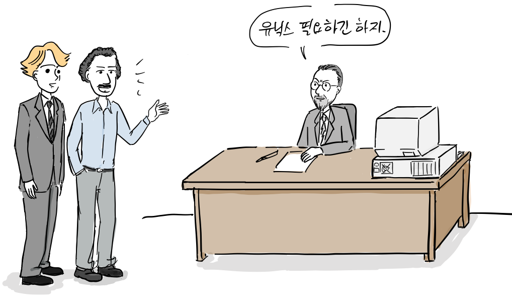

“유닉스 컴퓨터가 필요하긴 하지. 그러면 이 컴퓨터를 받자 마자 자네가 제안한 그 뭔가 하이퍼 텍스트(?) 시스템을 구현하면 어떨까? 적당한 구입 목적이 될 것 같네..”

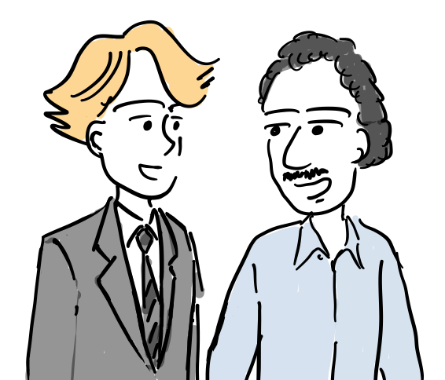

“물론이죠.”

비록 정식 프로젝트는 아니였지만, 상사로 부터 개발을 진행해도 좋다는 사인을 받은 것이다. 넥스트 컴퓨터를 기다리는 동안 팀은 드디어 그의 아이디어를 좋아하는 동료를 찾게된다. 1973년 부터 부터 CERN에서 일한 [로버트 카이오(Robert Cailliau)](https://ko.wikipedia.org/wiki/%EB%A1%9C%EB%B2%A0%EB%A5%B4_%EC%B9%B4%EC%9D%B4%EC%98%A4)는 팀의 아이디어를 마음에 들어했고, 자발적으로 그의 제안서를 CERN에서 선호하는 형식으로 제안서를 고쳐주었다.

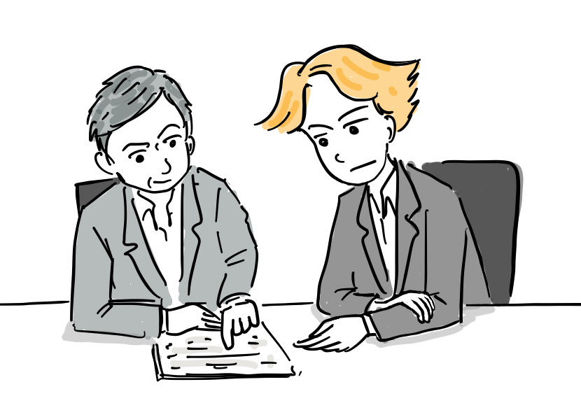

또한 그의 인맥을 동원해서 다방면으로 프로젝트가 진행될 수 있도록 도왔다. 그 결과 팀은 처음으로 WorldWideWeb이 라는 용어를 사용해서 1990년 5월에 다시 수정한 제안서를 제출한다. 이와 함께 기존에 구현되어 있는 하이퍼텍스트 솔루션을 기반으로 월드와이드웹을 개발할 수 있는지도 검토하기 시작했다.

1990년 9월 로버트와 함께 하이퍼 텍스트 기술 유럽 컨퍼런스(European conference on Hypertext Technology )에 가서 여러 업체를 컨택했지만, 답변은 어렵다였다.

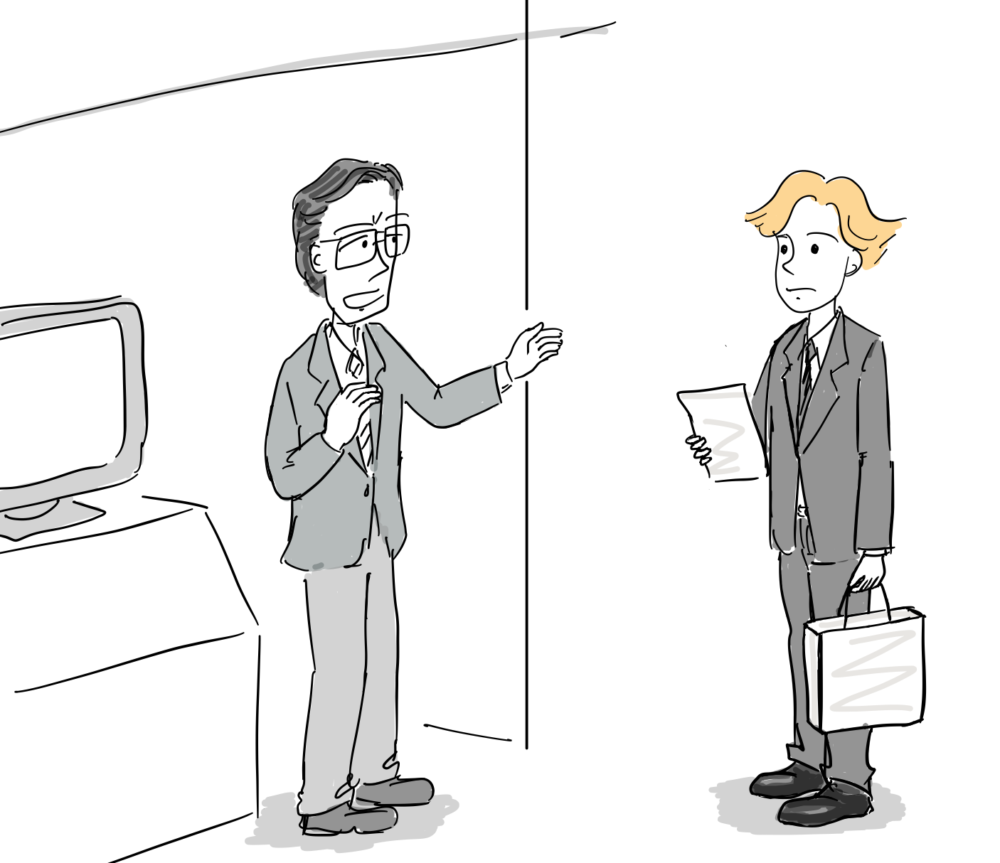

“현재 하이퍼텍스트 시스템도 사실 장사가 잘안되는데, 인터넷을 붙인다고 잘 팔릴까요?”

“우리는 문서를 뷰어에서 보려면 소스 문서를 컴파일해야 합니다.”

“중앙 데이터베이스에서 링크를 관리해야할 것 같은데요. 그래야 끊어진 링크가 없겠죠.”

“이건 전자책이 아니라서 계속 문서가 변합니다. 중앙에서 모든 링크를 관리하는 것은 불가능하죠.”

“이런, 하이퍼텍스트는 업체들하고는 말이 잘 안통하네..”

“아무래도 기존 하이퍼텍스트는 솔루션을 활용하기는 어려워보이네요. 서버 부터 브라우저까지 만들어야할 것 같아요.”

팀은 1990년 10월 부터 스티브 잡스가 만든 NeXT Computer에서 최초의 웹을 구현하기 시작했다.

“오.. 드디어 스티브 잡스가 만든 넥스트 큐브 컴퓨터가 CERN에 왔군.”

“이제 본격적으로 웹을 개발해야죠.”

### 웹의 기반이 되고 있는 3가지 기술

팀은 1990년 11월 중순까지 오늘날까지 웹의 기반이 되고 있는 3가지 기술을 작성했다.

1.  HTML(HyperText Markup Language): 웹을 위한 마크업 언어. 당시 CERN에서 문서화에 사용된 SGML을 참고해서 만듦.
2.  URI(Uniform Resource Identifier): 통합 자원 식별자: 웹에 있는 각각의 리소스를 식별하는데 사용된 일종의 주소. 일반적으로 URL이라고 부른다..
3.  HTTP(Hypertext Transfer Protocol): 하이퍼 본문 전송 규약. 웹에 연결된 리소스를 탐색할 수 있도록 한다.

로버트는 사비를 털어 넥스트 머신을 구입하고 웹브라우저와 웹서버를 테스트할 수 있도록 돕는다.

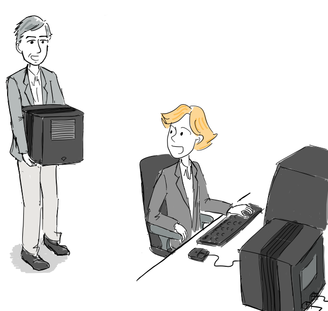

“팀, 나도 넥스트 머신을 하나 샀어. 이제 쉽게 브라우저와 서버를 테스트할 수 있을 거야.”

”고마워요.”

웹서버는 info.cern.ch라는 도메인과 호스트 이름을 갖게 되었다.

### Line-mode 브라우저 개발

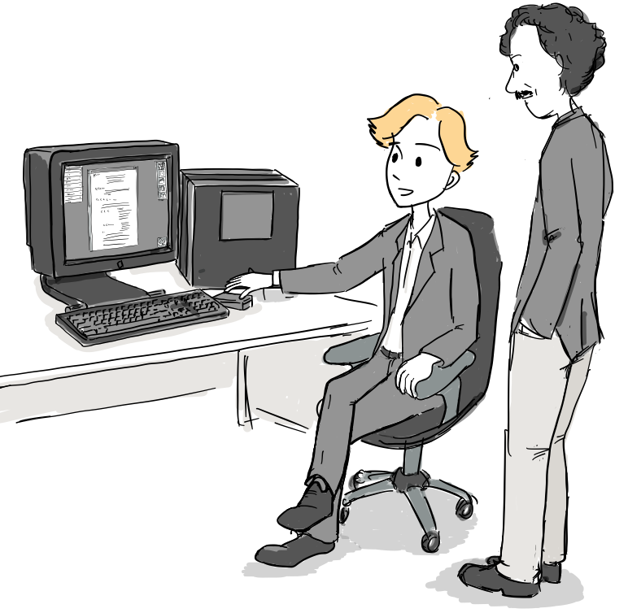

“이게 제가 구현한 월드와이드웹입니다.”

“응 놀랍군. 그런데, 다른 유닉스 머신에서는 쓸 수 있을까?”

“모든 코드가 Objective-C로 만들어져있어서 불가능합니다. 브라우저를 새로 개발해야 하는데, 모든 유닉스에서 동작하려면 편집 기능 없이 텍스트 기반으로 개발해도 충분할 것 같아요.”

“새로 온 인턴이 있는데, 그 친구 보고 유닉스용 브라우저를 만들라고 하면 되겠네.”

[니콜라 펠로우(Nicoa Pellow)](https://en.wikipedia.org/wiki/Nicola_Pellow)는 영국에서 온 수학을 전공하는 학생이였는데, C언어로 터미널 기반의 line-mode 브라우저를 개발한다.

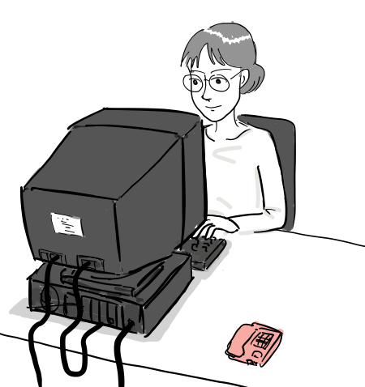

이 브라우저는 종이로 입출력이 인쇄되는 텔레타이프에서도 동작이 가능했다.

1990년 12월 크리스마스 전까지 최초의 웹페이지 에디터와 브라우저인 WorldWideWeb.app과 첫번째 웹서버인 httpd가 동작하기 시작한다.

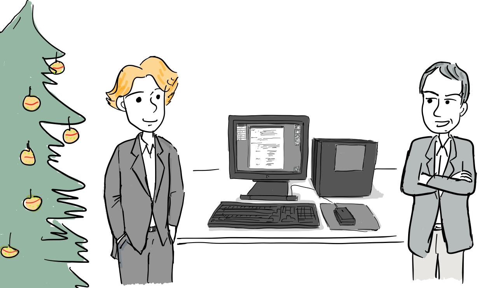

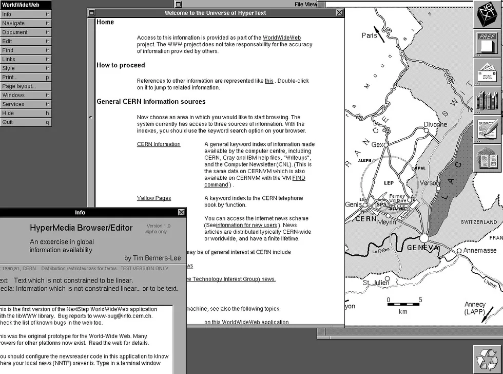

실제 넥스트 컴퓨터에서 동작했던 월드와이드웹 브라우저 모습([출처](http://info.cern.ch/NextBrowser.html))

다음에 계속..

### 참고

-   [Weaving the Web](https://www.w3.org/People/Berners-Lee/Weaving/Overview.html), Tim Berners-Lee, 1999
-   How the web was born, Gillies & Cailliau, Oxford university press, 200
-   [A short history of the Web](https://home.cern/science/computing/birth-web/short-history-web), CERN
-   https://www.cnet.com/pictures/images-berners-lee-and-the-dawn-of-the-web/4/
-   http://info.cern.ch/NextBrowser1.html
