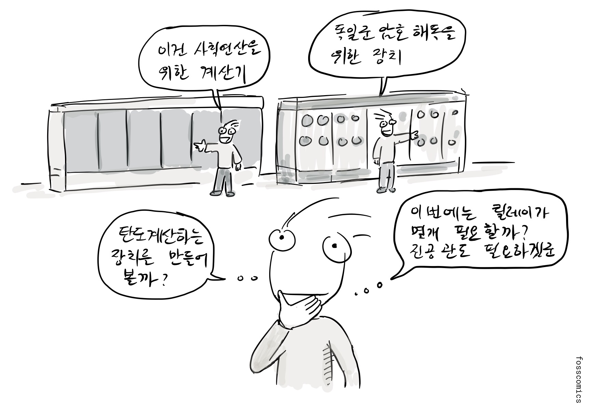
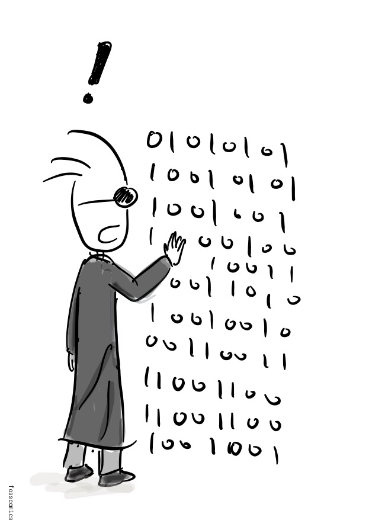
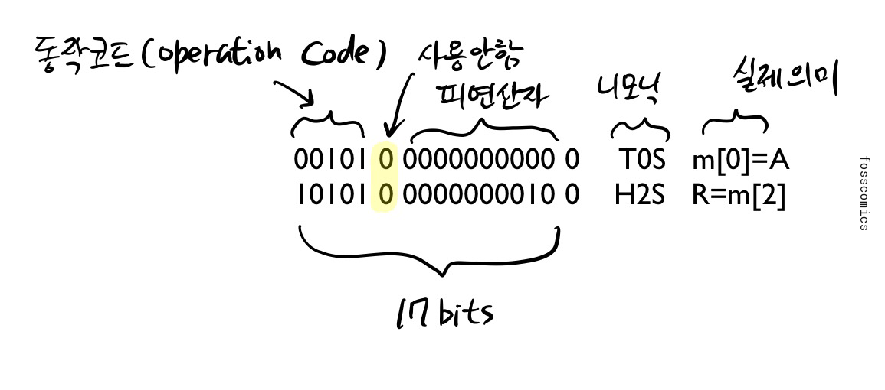
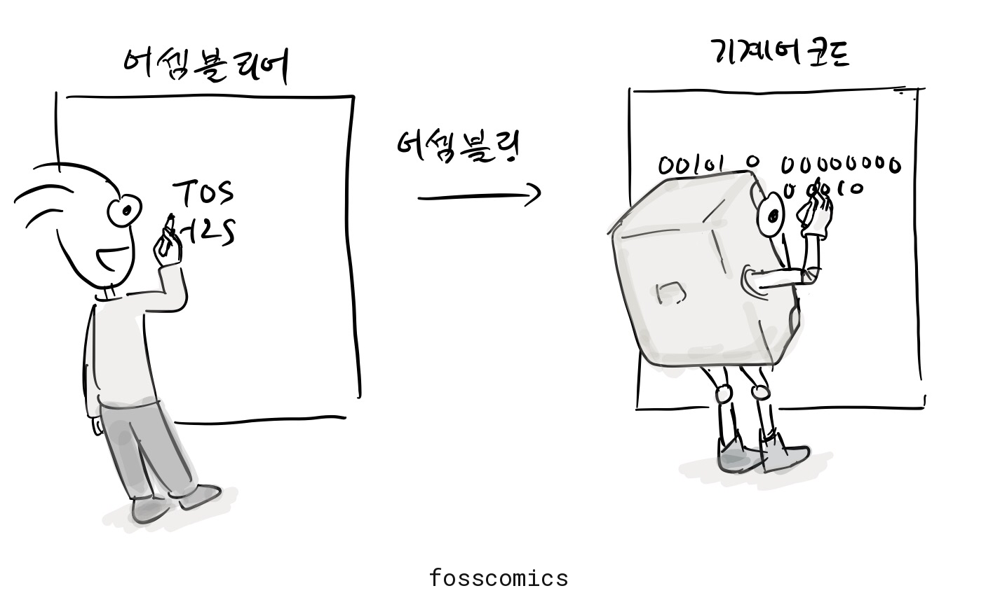
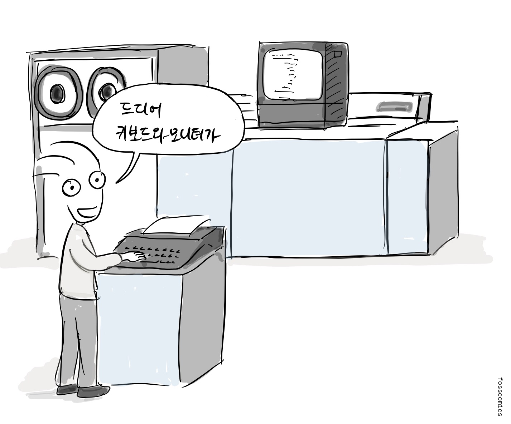
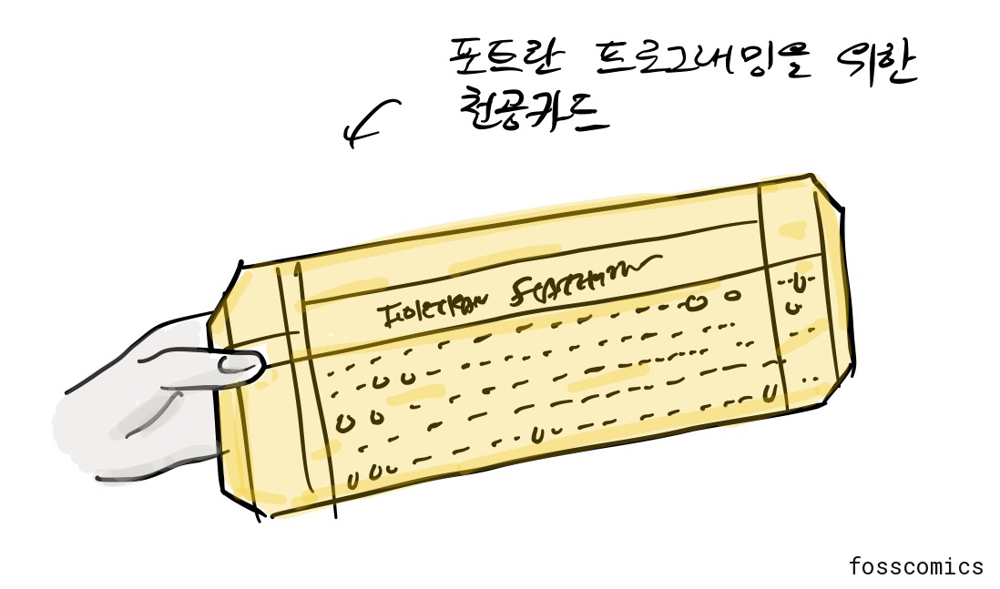
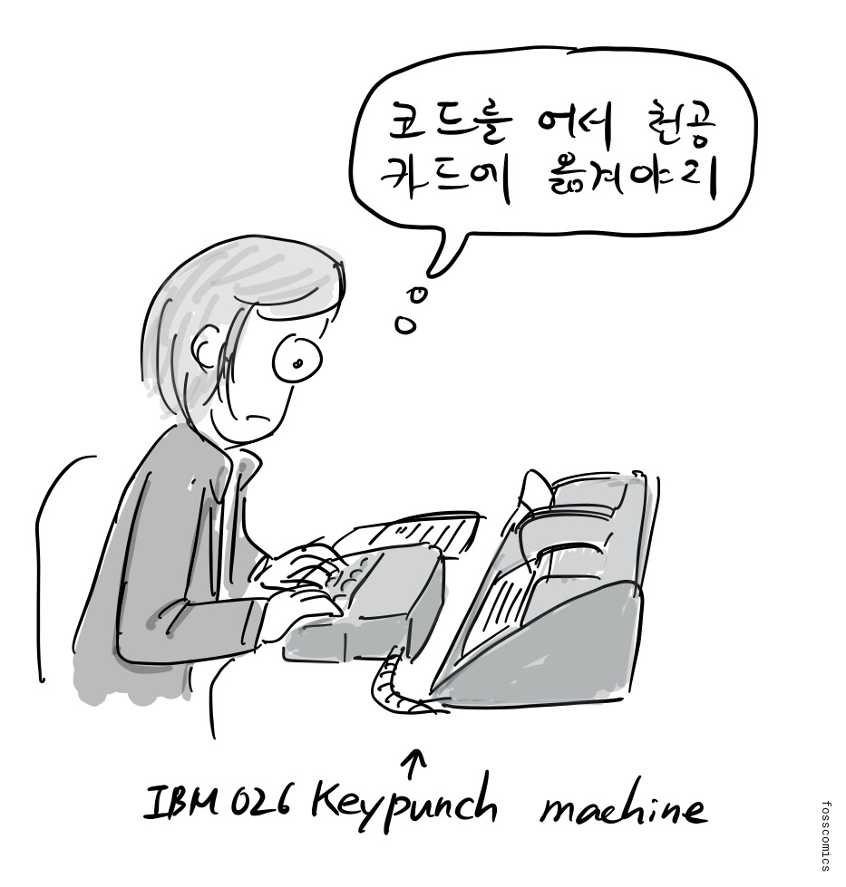
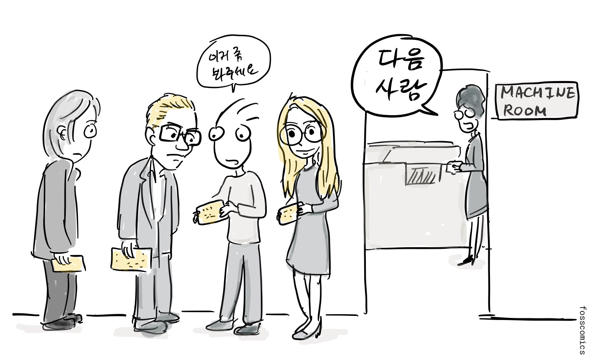
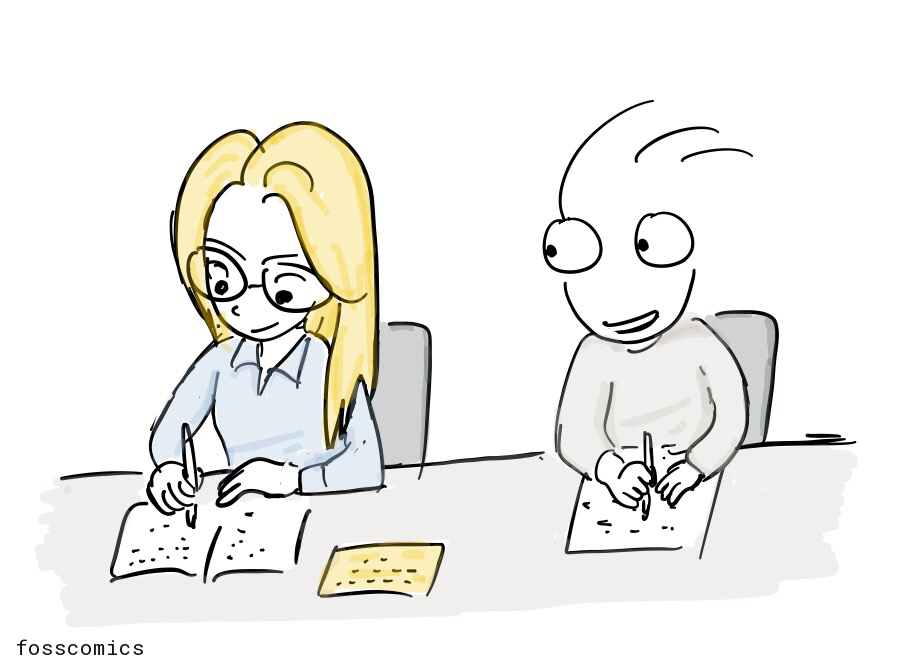

컴퓨터가 처음 만들어졌을 때, 사람들은 어떻게 프로그래밍을 했을까? 오늘날과 같은 소프트웨어는 없었고, 여러 기능이 회로의 개별 장치로 구현되어 있었기 때문에 다시 고칠 수는 없었다. 초기 컴퓨터는 탁상용 전자계산기 처럼 특정 용도로만 사용할 수 있었다. 에니악(ENIAC)의 경우, 이 장치들을 배선하고 스위치를 설정해 프로그램을 바꿀 수 있었지만, 이 작업에는 며칠이 걸리기도 했다. 천공카드는 프로그램을 저장하는 용도가 아니라 입력과 출력에 사용되었다[&lbrack;1&rbrack;][1][&lbrack;4&rbrack;][4].

> "이건 사칙연산을 위한 계산기" \
> "독일군 암호 해독을 위한 장치" \
> "탄도 계산하는 장치를 만들어 볼까?" \
> "이번에는 릴레이가 몇개 필요할까? 진공관도 필요하겠군"

프로그램 내장형 컴퓨터가 등장하면서 프로그래밍은 훨씬 실용적으로 바뀌었다. 프로그램을 전자식 기억장치로 불러와 배선을 바꾸지 않고 실행할 수 있게 된 것이다. 맨체스터 베이비는 1948년에 프로그램을 실행했고, 에드삭(EDSAC)은 1949년에 정규 운용을 시작했다. 에드박(EDVAC)은 프로그램 내장 방식의 발전에 큰 영향을 주었지만, 실제 가동은 그보다 늦었다.

프로그램은 기계가 이해하고 실행할 수 있는 명령어로 이루어진다. 가장 낮은 수준의 명령어를 기계어라고 한다. 기계어는 0과 1로 이루어진 이진수 패턴으로 표현되기 때문에 사람이 읽고 기억하기 어렵다.

그래서 컴퓨터 프로그래밍의 초기부터 어셈블리어의 초기 형태가 등장했다. 숫자로 된 기계 명령 대신 니모닉(mnemonic)이라는 짧은 기호를 사용해 명령을 더 쉽게 표현한 것이다. 에드삭 프로그래머들은 한 글자로 된 오더 코드를 사용했고, Initial Orders라는 작은 부트스트랩 프로그램이 종이테이프에서 이 코드를 읽어 기계 명령으로 변환해 메모리에 적재했다[&lbrack;2&rbrack;][2].

EDSAC의 각 명령은 17비트 워드 하나를 차지했다. 다섯 비트는 동작 코드, 다음 한 비트는 사용하지 않는 비트, 이어지는 열 비트는 주소였고, 마지막 비트는 짧은 피연산자와 긴 피연산자 가운데 하나를 선택했다.

위 그림에 소개된 EDSAC의 두 어셈블리 명령은 아래와 같이 설명할 수 있다.

- `T 0 S`: 누산기(accumulator)의 값을 메모리 주소 `0`에 저장한 다음, 누산기를 `0`으로 초기화한다.
- `H 2 S`: 메모리 주소 `2`의 값을 곱셈 레지스터(multiplier register)로 불러와 곱셈 연산을 준비한다.
- 마지막의 `S`는 이 명령이 EDSAC의 짧은 워드 형식(short-word format)을 사용한다는 뜻이다.

이와 같이, 기계어는 명령어 자체가 이진수에 불과하기 때문에 사람이 기억하고 바로 코드를 이해하기가 어렵다. 그래서 각각의 명령어를 상징적 기호(mnemonics)로 표현하는 어셈블리(assembly) 언어를 만들었다. 이렇게 표현된 코드를 CPU가 이해할 수 있는 기계어 코드로 변환하는 과정을 어셈블링(assembling)이라고 한다.

초기에는 프로그래머가 이 작업을 직접 하기도 했기 때문에 핸드 어셈블리(hand assembly)라고 불렀다. 어셈블러가 없으면 니모닉 변환표를 참고해 어셈블리 코드를 기계어로 직접 바꾸어야 했다. 기호식 어셈블리어는 고급 언어가 널리 쓰이기 전인 1940년대 말과 1950년대 초부터 이미 사용되고 있었다.

> "지금은 코딩중"

1960년대 초까지 키보드와 화면이 있는 대화형 터미널은 흔하지 않았다. 1964~1965년에 MIT Project MAC, 벨 연구소, 제너럴 일렉트릭의 공동 프로젝트로 설계가 시작된 멀틱스(Multics)는 여러 사용자가 원격 터미널을 통해 대화식으로 작업할 수 있도록 디자인되었다[&lbrack;3&rbrack;][3]. 1970년대에 들어 화면과 키보드를 갖춘 터미널이 훨씬 보편화되었다. 그렇다면 이런 터미널이 보급되기 전에는 프로그래머들이 어떻게 코드를 작성하고 결과를 확인했을까?

> "드디어 키보드와 모니터가"

초기 프로그래머들은 천공카드를 이용해 코드를 입력하는 경우가 많았다. 천공카드는 19세기 말부터 미국 인구조사를 비롯한 기계 처리 작업에서 데이터를 기록하고 저장하는 데 쓰였다. 원리는 오늘날의 OMR([광학 마크 인식](https://ko.wikipedia.org/wiki/%EA%B4%91%ED%95%99_%EB%A7%88%ED%81%AC_%EC%9D%B8%EC%8B%9D)) 용지를 생각하면 이해가 쉬운데, OMR 용지는 특정 위치를 표시하고, 천공카드는 특정 위치에 구멍을 뚫어 정보를 표현한다.

IBM은 1928년에 널리 쓰이게 된 80열 카드를 표준화하고 카드, 키펀치, 카드 판독기, 집계 장비를 세계 여러 지역에 공급했다. 이후 천공카드는 프로그램과 데이터를 컴퓨터에 입력하는 중요한 매체가 되었다[&lbrack;5&rbrack;][5].

실제 천공카드를 사용하려면, 프로그래머는 먼저 코딩 용지에 소스 코드를 쓰고 손으로 검토했다. 그런 다음 프로그래머나 키펀치 작업자가 프로그램을 카드에 천공했으며, 보통 카드 한 장에 소스 코드 한 문장을 기록했다. 사용한 언어와 컴퓨터에 따라 어셈블러나 컴파일러가 제출된 프로그램을 기계어로 변환했다.

> "코드를 어서 천공 카드에 옮겨야지"

프로그래머가 카드 덱을 전산실 오퍼레이터에게 제출하면, 오퍼레이터가 각 작업을 카드 판독기에 넣었다. 카드 덱을 제출하기 위해 줄을 서기도 했고, 인쇄된 결과를 받을 때까지 오랫동안 기다려야 할 수도 있었다. 프로그램이 실패하면 문제가 있는 카드를 수정하거나 교체한 뒤 카드 덱을 다시 제출해야 했다.

> "이거 좀 봐주세요" \
> "다음 사람"

프로그램을 카드나 종이테이프에 천공하기 전이라면, 다른 사람이 종이에 손으로 쓴 프로그램을 그대로 베껴 쓰는 것만으로도 프로그램을 복사할 수 있었다.

## 참고 자료

1. [Celebrating Penn Engineering History: ENIAC](http://www.seas.upenn.edu/about-seas/eniac/operation.php)
2. [EDSAC Initial Orders and Squares Program](http://www.cl.cam.ac.uk/~mr10/edsacposter.pdf)
3. [History of Multics](https://www.multicians.org/history.html)
4. [ENIAC, Computer History Museum](https://www.computerhistory.org/revolution/birth-of-the-computer/4/78)
5. [The IBM Punched Card](https://www.ibm.com/history/punched-card)

[1]: http://www.seas.upenn.edu/about-seas/eniac/operation.php "Celebrating Penn Engineering History: ENIAC"

[2]: http://www.cl.cam.ac.uk/~mr10/edsacposter.pdf "EDSAC Initial Orders and Squares Program"

[3]: https://www.multicians.org/history.html "History of Multics"

[4]: https://www.computerhistory.org/revolution/birth-of-the-computer/4/78 "ENIAC, Computer History Museum"

[5]: https://www.ibm.com/history/punched-card "The IBM Punched Card"
