When computers were first introduced, how did people write code for them? In fact, there was no software similar to what we have today. Many functions were implemented as separate functional units in circuits. [ENIAC](https://en.wikipedia.org/wiki/ENIAC) could run different programs by wiring those units together and setting switches, a process that could take days. Punched cards were used for input and output, not to store its programs[&#91;1&#93;][1][&#91;4&#93;][4].

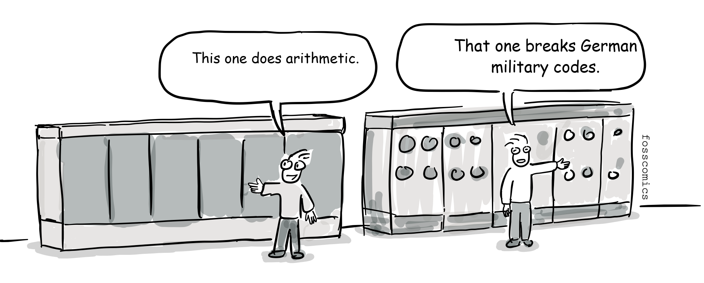
> "This one does arithmetic." \
> "That one breaks German military codes."

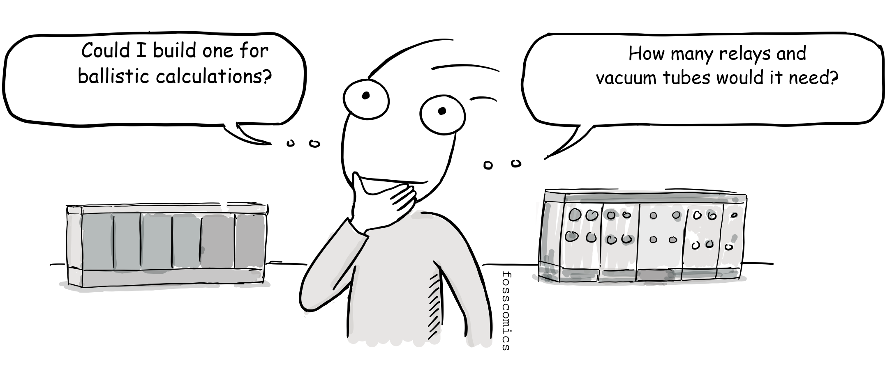
> "Could I build one for ballistic calculations?" \
> "How many relays and vacuum tubes would it need?"

Programming became much more practical when stored-program computers were introduced. A program could be loaded into electronic memory and executed without rewiring the machine. The Manchester Baby ran a stored program in 1948, and [EDSAC](https://en.wikipedia.org/wiki/EDSAC) entered regular operation in 1949. [EDVAC](https://en.wikipedia.org/wiki/EDVAC) was highly influential in the development of the stored-program design, although it became operational later.

A program is made up of instructions that a machine can understand and execute. At the lowest level, these instructions are called [machine code](https://en.wikipedia.org/wiki/Machine_code). Machine code is represented as binary numbers, such as 0 and 1, so it is difficult for people to read and remember.

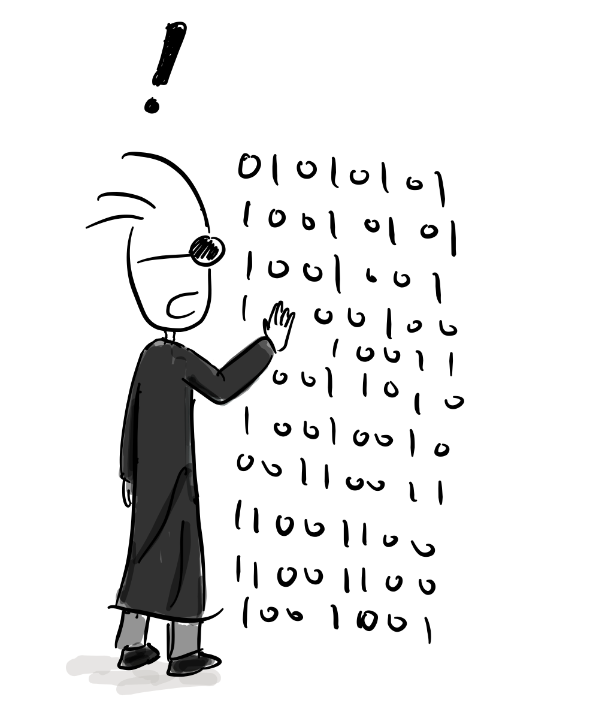

That is why assembly language appeared early in the history of computer programming. Assembly language made machine instructions easier to express with short symbolic codes called mnemonics. EDSAC programmers used single-letter order codes, while a hard-wired bootstrap called the Initial Orders loaded programs from paper tape and translated those codes into instructions[&lbrack;2&rbrack;][2].

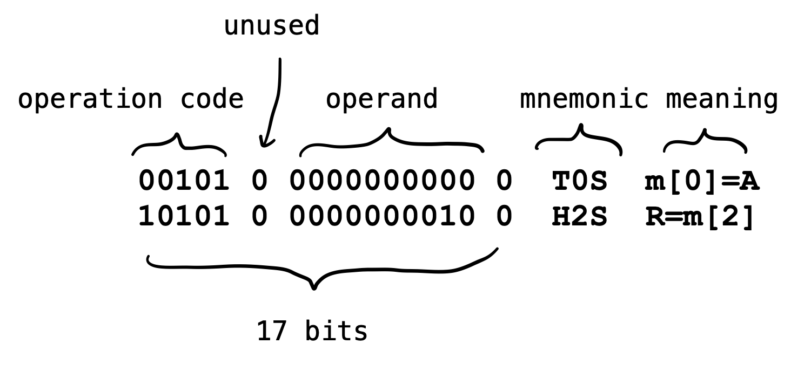

All machine language instructions used in EDSAC are composed of 17 bits. The first column is the operation code, and the second column, 1 bit, is not used. Third column is the operand, representing the address. The last bit indicates whether the current instruction is 17 bits or 35 bits.

The two EDSAC assembly instructions shown above can be explained as follows:

- `T 0 S`: Store the value in the accumulator at memory address `0`, then clear the accumulator by resetting it to `0`.
- `H 2 S`: Load the value stored at memory address `2` into the multiplier register, preparing it for a multiplication operation.
- The final `S` indicates that the instruction uses EDSAC's short-word format.

As you can see, raw binary instructions are difficult for people to understand and remember. Assembly language therefore represents each low-level instruction, or operation code, with a mnemonic. Converting assembly language into machine code is called assembling.

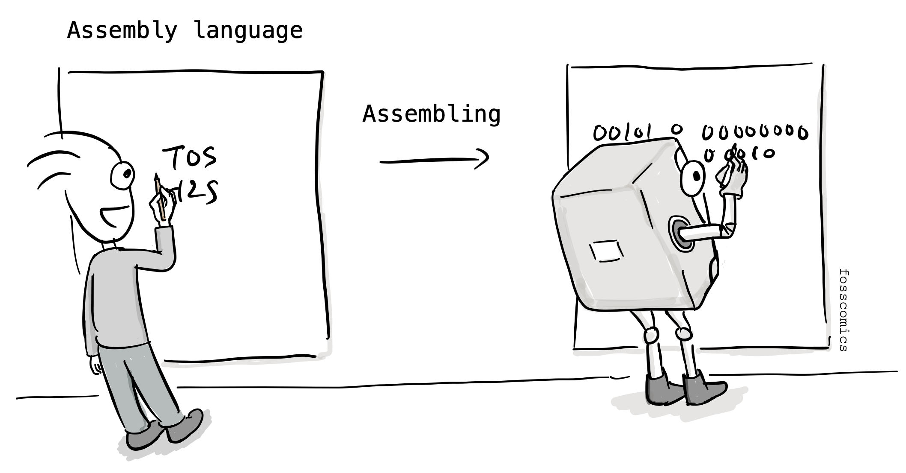

In the early days, programmers sometimes did this work by hand, so the process was called hand assembly. Without an assembler, they had to translate assembly code into machine code manually by consulting mnemonic conversion tables. Symbolic assembly languages were already in use by the late 1940s and early 1950s, before high-level languages became common.

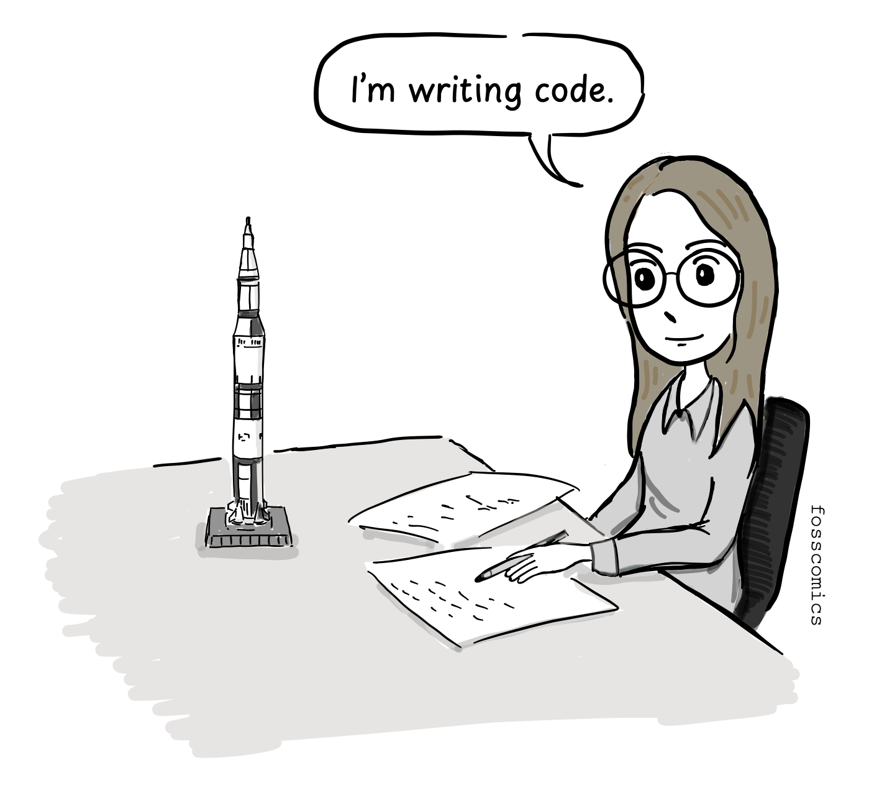
> "I'm writing code."

However, keyboards and monitors did not become commercially available until the 1960s. The first computer with a monitor and keyboard was Multics, designed beginning in 1964-65 by MIT Project MAC, Bell Labs, and General Electric, was intended to serve many users through remote terminals[&lbrack;3&rbrack;][3]. By the 1970s, screen-and-keyboard terminals had become much more common. But before then, how did programmers write code and check the results without a monitor and keyboard?

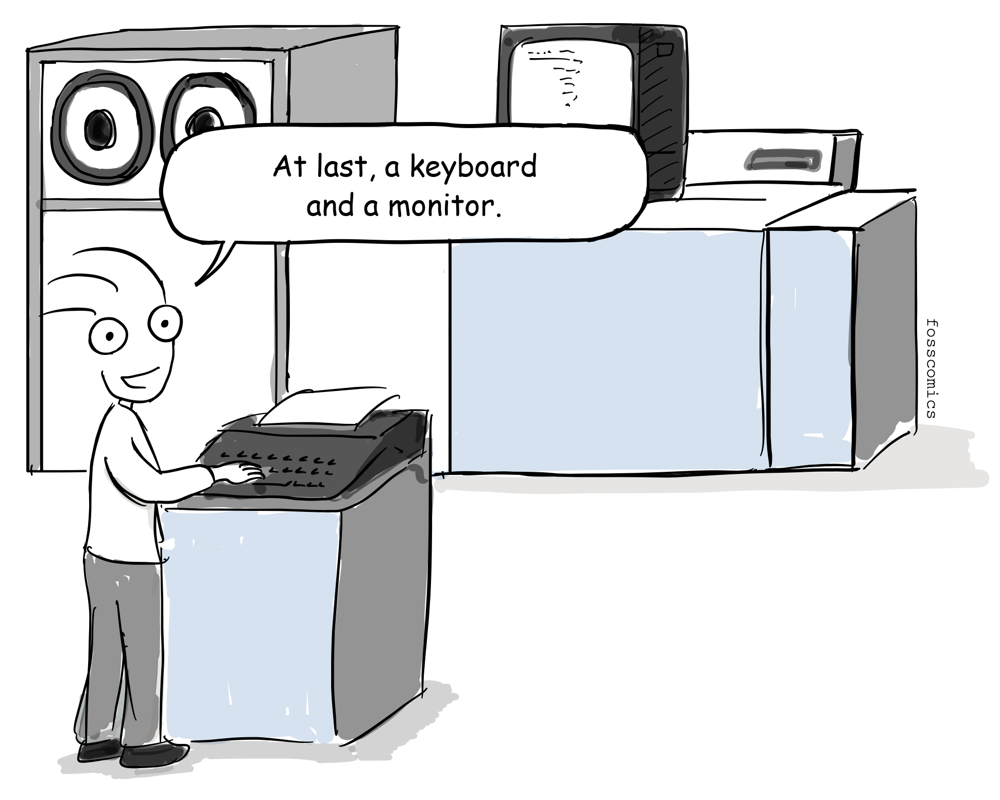
> "Finally, I got a computer with a keyboard and a monitor"

Early programmers often used punched cards to write code. Since the late nineteenth century, punched cards had been used to record and store data for machine processing, including work for the U.S. Census Bureau. It is easy to understand the basic idea if you think of a modern OMR([optical mark recognition](https://en.wikipedia.org/wiki/Optical_mark_recognition)) sheet: each position on a card represented information.

IBM had developed a punch card system at the time and was supplying the system worldwide so the punch card was well used as an essential part of early programming.[&lbrack;5&rbrack;][5].

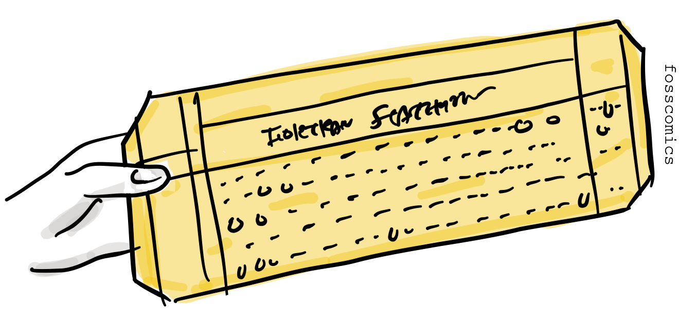

For example, the early programmers used punch cards as a development tool. First, the programmer wrote assembly code on paper. Then they debugged by running the code in their minds. When they were convinced that there were no more errors in their code. Finally, the code was hand assembled into machine code and they filled out machine code line by line onto a punch card.

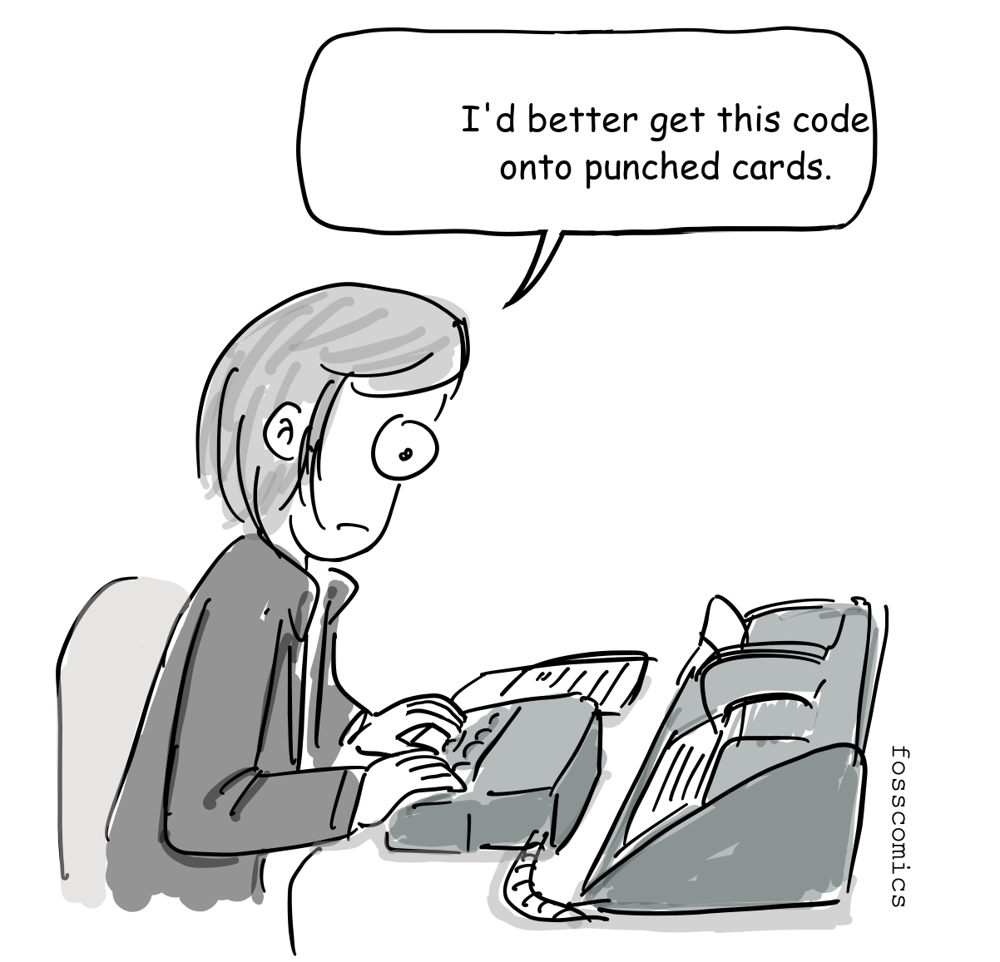
> "I'd better get this code onto punched cards."

Programmers took the punch card to the operator of the computer room.The operator put the punch card into the punch card reader and the computer was able to execute the code loaded from the punch card reader. In reality, the programmer had to wait in line to hand the punch card to the operator and wait a long time until they received the execution result. If there is something wrong with the result, they had to do the same things over and over to get the result they wanted.

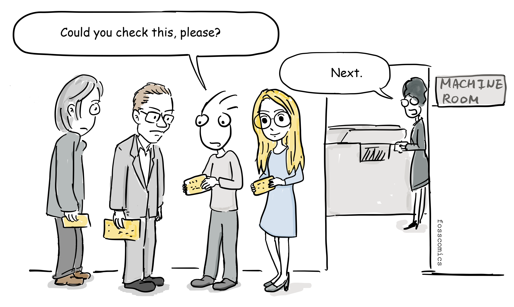
> "Could you check this, please?" \
> "Next."

The interesting thing is that just copying a punch card is the same as copying a program, so it was possible to copy programs by writing at the time.

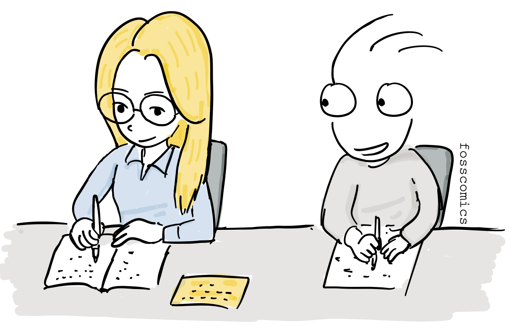

## References
1. [Celebrating Penn Engineering History: ENIAC](http://www.seas.upenn.edu/about-seas/eniac/operation.php)
2. [EDSAC Initial Orders and Squares Program](http://www.cl.cam.ac.uk/~mr10/edsacposter.pdf)
3. [History of Multics](https://www.multicians.org/history.html)
4. [ENIAC, Computer History Museum](https://www.computerhistory.org/revolution/birth-of-the-computer/4/78)
5. [The IBM Punched Card](https://www.ibm.com/history/punched-card)

[1]: http://www.seas.upenn.edu/about-seas/eniac/operation.php "Celebrating Penn Engineering History: ENIAC"

[2]: http://www.cl.cam.ac.uk/~mr10/edsacposter.pdf "EDSAC Initial Orders and Squares Program"

[3]: https://www.multicians.org/history.html "History of Multics"

[4]: https://www.computerhistory.org/revolution/birth-of-the-computer/4/78 "ENIAC, Computer History Museum"

[5]: https://www.ibm.com/history/punched-card "The IBM Punched Card"
