## From rewiring to stored programs

:::panel
When computers were first built, how did people program them? Early computers had nothing like today's software. More like desk calculators, they used switches such as relays and vacuum tubes to form logic circuits and were designed for a single purpose.

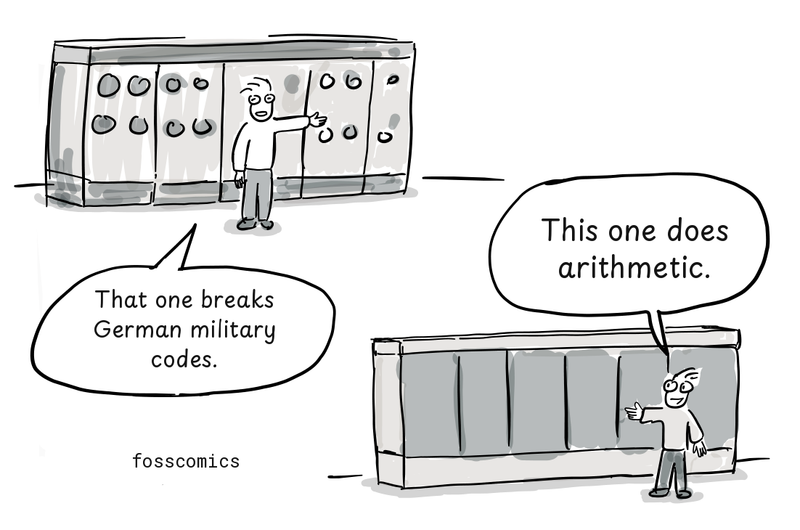
> "That one breaks German military codes." \
> "This one does arithmetic."

> "Could I build one for ballistic calculations?" \
> "How many relays and vacuum tubes would it need?"
:::

:::panel

[ENIAC](https://en.wikipedia.org/wiki/ENIAC) could run different programs by changing its plugboard wiring and switch settings. This was a cumbersome process, and changing a program could take days. Punched cards were used for input and output, not to store its programs[&#91;1&#93;][1][&#91;4&#93;][4].

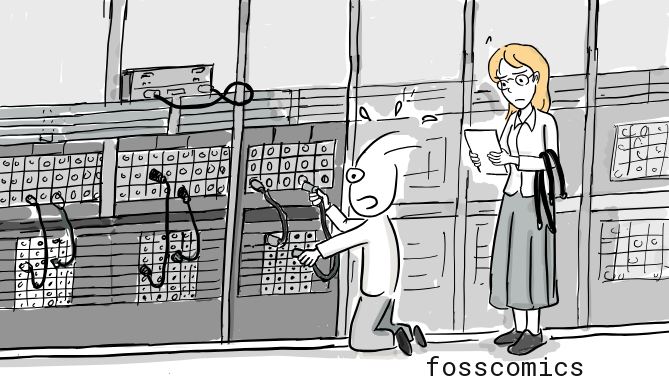

Programming became much more practical when stored-program computers were introduced. A program could be loaded into electronic memory and executed without rewiring the machine. The Manchester Baby ran a stored program in 1948, and [EDSAC](https://en.wikipedia.org/wiki/EDSAC) entered regular operation in 1949. [EDVAC](https://en.wikipedia.org/wiki/EDVAC) was highly influential in the development of the stored-program design, although it became operational later.

:::

## From machine code to assembly language

:::panel

A program is made up of instructions that a machine can understand and execute. At the lowest level, these instructions are called [machine code](https://en.wikipedia.org/wiki/Machine_code). On binary computers such as EDSAC, machine code is encoded as patterns of binary digits, or zeros and ones, which are difficult for people to read and remember.

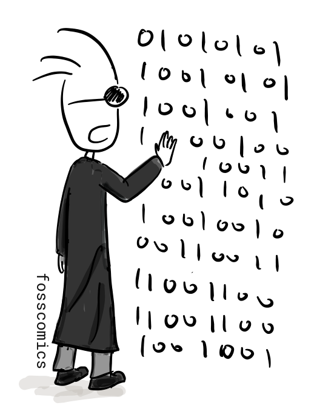

That is why early forms of assembly language appeared near the beginning of computer programming. Instead of numeric machine instructions, they used short symbols called mnemonics to make instructions easier to express. EDSAC programmers used single-letter order codes. A small bootstrap program called the Initial Orders read these codes from paper tape, translated them into machine instructions, and loaded them into memory[&lbrack;2&rbrack;][2].

:::

:::panel rounded="true"
Each EDSAC instruction occupied one 17-bit word:

- The first five bits were the operation code.
- The next bit was unused.
- The next ten bits were the operand, representing an address.
- The final bit selected either a short or long operand.

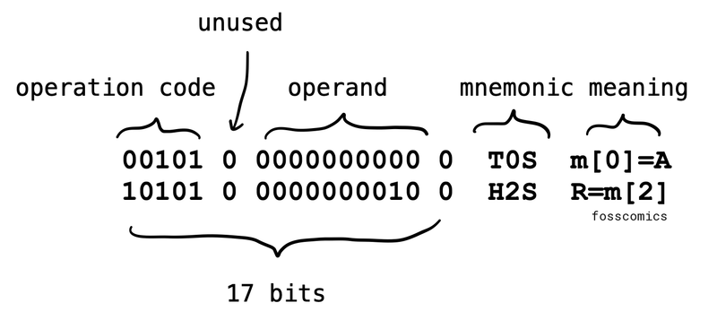

The two EDSAC assembly instructions shown above can be explained as follows:

- `T 0 S`: Store the upper 17 bits of the value in the accumulator at memory address `0`, then clear the accumulator by resetting it to `0`.
- `H 2 S`: Load the value stored at memory address `2` into the multiplier register, preparing it for a multiplication operation.

The final `S` is not an instruction; it indicates that the operand uses the short format. Short operands were 17 bits, while long operands were 35 bits[&lbrack;6&rbrack;][6].
:::

:::panel
As you can see, raw binary instructions are difficult for people to understand and remember. Assembly language therefore represents low-level operations with mnemonics. Converting assembly language into machine code is called assembling.

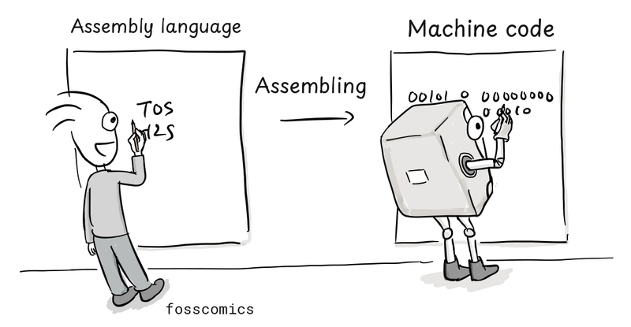
:::

:::panel

When no assembler was available, programmers sometimes translated assembly code into machine code themselves. This was called hand assembly. They looked up the numeric code for each mnemonic in an instruction table, calculated the required memory addresses, and constructed the complete machine instructions. Early forms of assembly language were already in use by the late 1940s and early 1950s, before high-level languages became common.

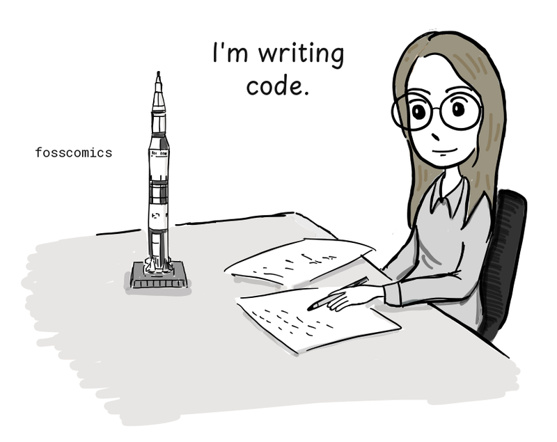
> "I'm writing code."
:::

## Terminals and time-sharing systems

Interactive terminals with keyboards and displays remained uncommon in the early 1960s. Interactive computing did not begin with Multics, however: MIT's CTSS was first demonstrated in 1961. Early terminals often printed their output on paper rather than displaying it on a screen.

:::panel rounded="true"
[Multics](https://en.wikipedia.org/wiki/Multics), whose design began in 1964-65 as a joint project of MIT Project MAC, Bell Labs, and General Electric, was intended to advance this approach to time-sharing. Time-sharing divided one computer's processing time into short intervals for multiple users, allowing each person to work interactively at a terminal[&lbrack;3&rbrack;][3].

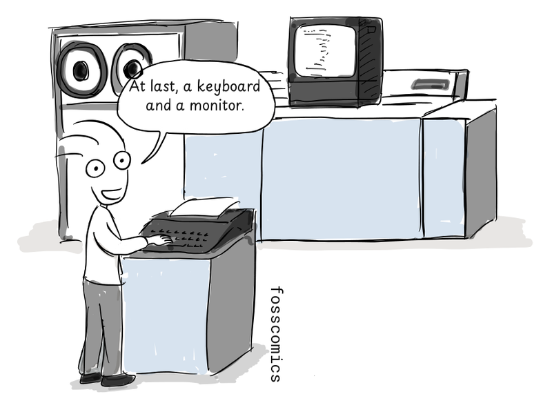
> "At last, a keyboard and a monitor."
:::

By the 1970s, screen-and-keyboard terminals had become more common. But how did programmers write code and check the results when they did not have direct access to a terminal?

## Punched cards and batch processing

:::panel
Early programmers often used punched cards to write code. Since the late nineteenth century, punched cards had been used to record and store data for machine processing, including work for the U.S. Census Bureau. Think of a multiple-choice answer sheet: the position of each mark carries information. Punched cards used holes instead.

IBM standardized its widely adopted 80-column card in 1928 and supplied cards, keypunches, readers, and tabulating equipment around the world. Punched cards later became an important medium for entering programs and data into computers[&lbrack;5&rbrack;][5].

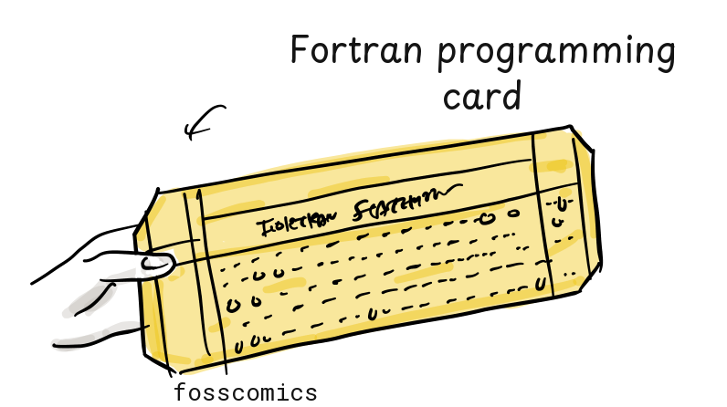
:::

:::panel

Programmers often first wrote source code on coding sheets and checked it by hand. They or a keypunch operator then punched the program onto cards, usually with one source line per card; a long statement could continue across several cards. A keypunch recorded typed characters as holes in cards. Depending on the language and computer, an assembler or compiler running on the computer, not the keypunch, translated the submitted program into machine code.

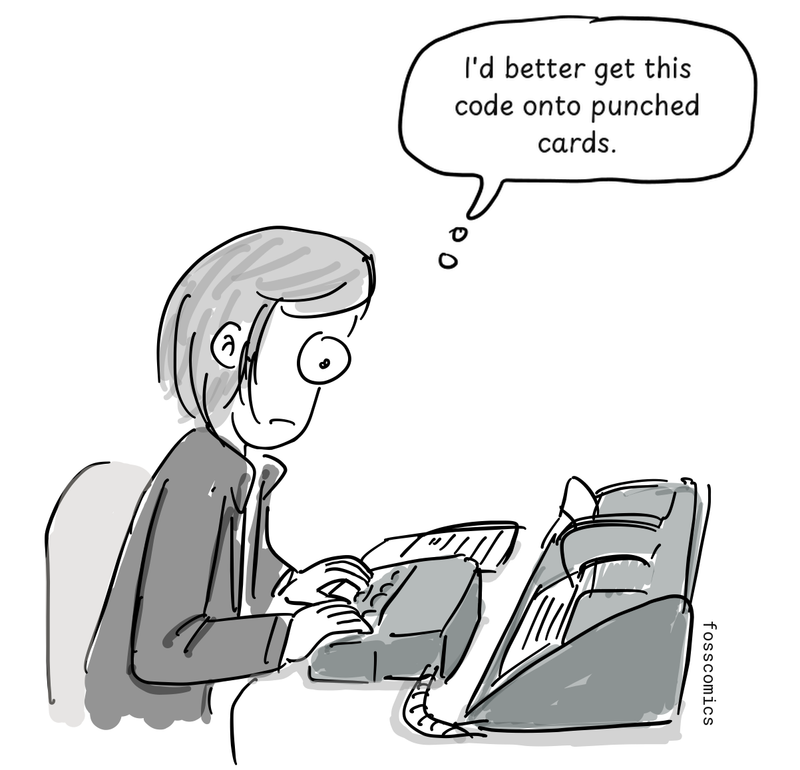
> "I'd better get this code onto punched cards."
:::

:::panel

Programmers submitted their card decks to a computer-room operator, who loaded each job into a card reader. They often waited in line to submit a deck and might not receive the printed results until much later. If the program failed, they had to correct or replace the affected cards and submit the deck again.

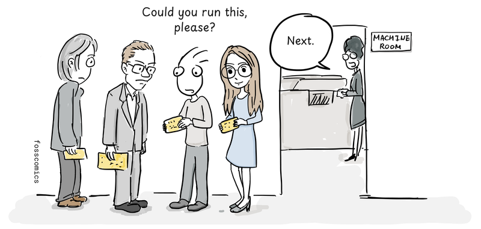
> "Could you run this, please?" \
> "Next."
:::

:::panel rounded="true"
Before a program was punched onto cards, copying it could be as simple as transcribing someone else's handwritten source code.

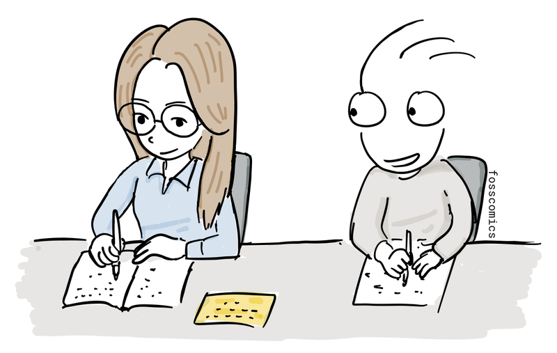
:::

## References
1. [Celebrating Penn Engineering History: ENIAC](http://www.seas.upenn.edu/about-seas/eniac/operation.php)
2. [EDSAC Initial Orders and Squares Program](http://www.cl.cam.ac.uk/~mr10/edsacposter.pdf)
3. [History of Multics](https://www.multicians.org/history.html)
4. [ENIAC, Computer History Museum](https://www.computerhistory.org/revolution/birth-of-the-computer/4/78)
5. [The IBM Punched Card](https://www.ibm.com/history/punched-card)
6. [EDSAC: Memory and Instructions](https://en.wikipedia.org/wiki/EDSAC#Memory_and_instructions)

[1]: http://www.seas.upenn.edu/about-seas/eniac/operation.php "Celebrating Penn Engineering History: ENIAC"

[2]: http://www.cl.cam.ac.uk/~mr10/edsacposter.pdf "EDSAC Initial Orders and Squares Program"

[3]: https://www.multicians.org/history.html "History of Multics"

[4]: https://www.computerhistory.org/revolution/birth-of-the-computer/4/78 "ENIAC, Computer History Museum"

[5]: https://www.ibm.com/history/punched-card "The IBM Punched Card"

[6]: https://en.wikipedia.org/wiki/EDSAC#Memory_and_instructions "EDSAC instruction format"
