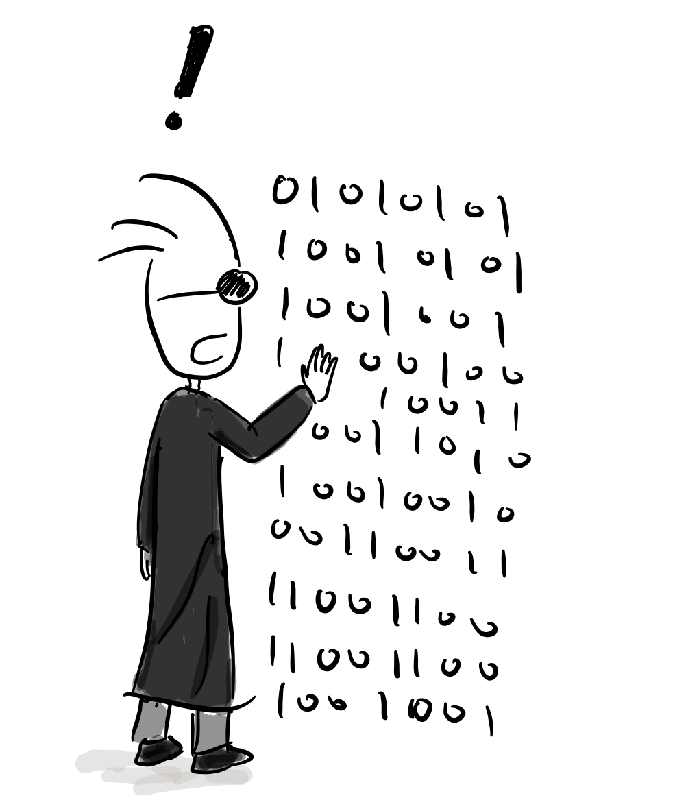
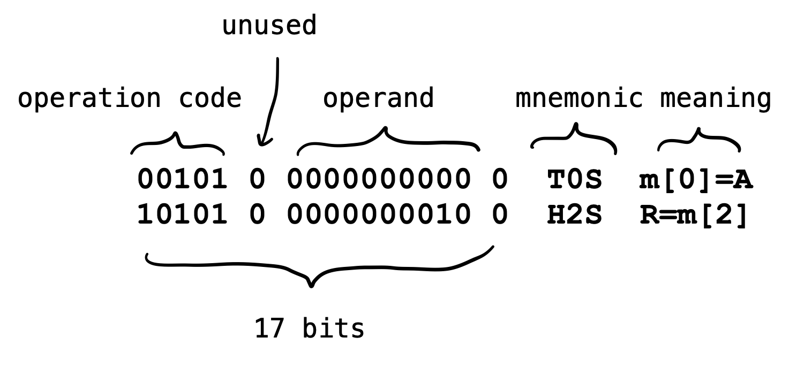
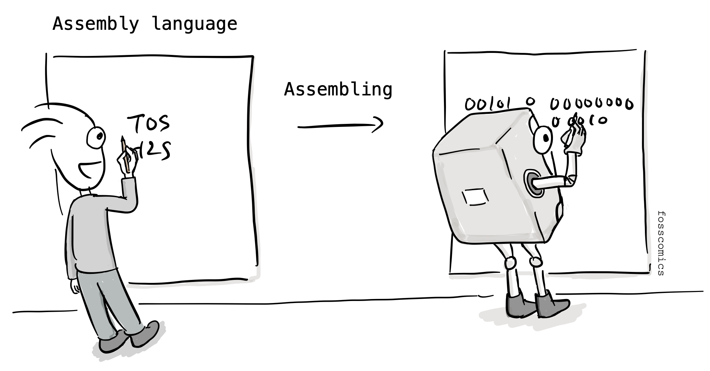
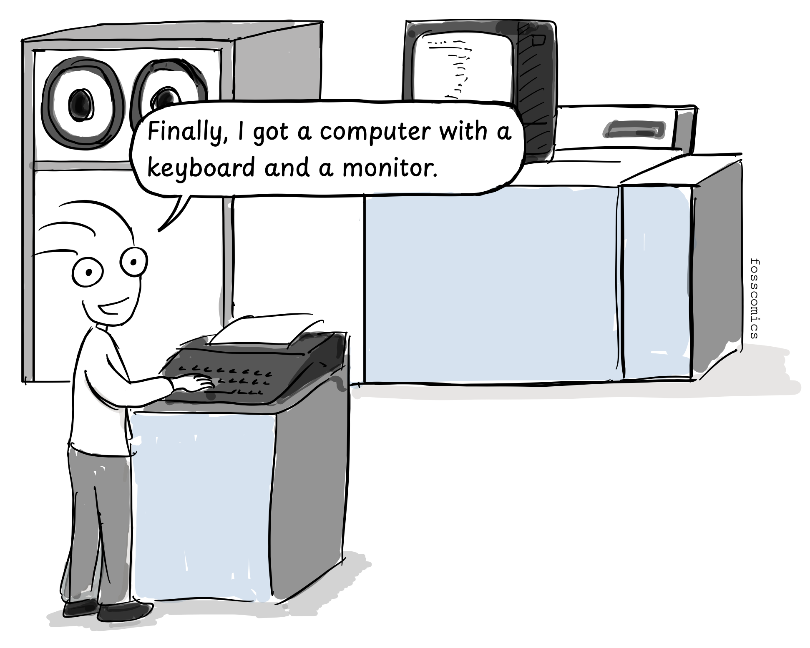
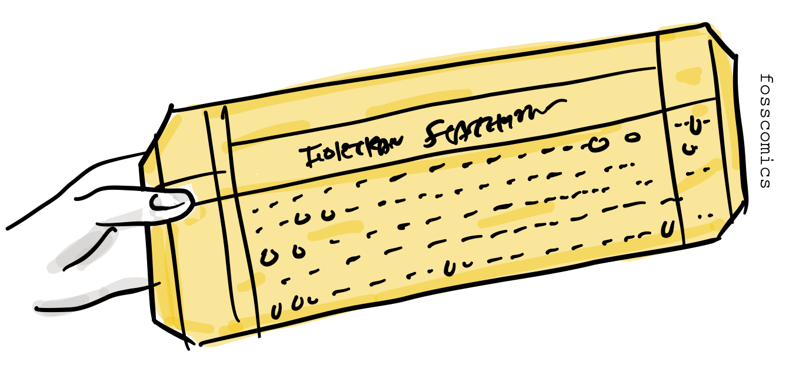
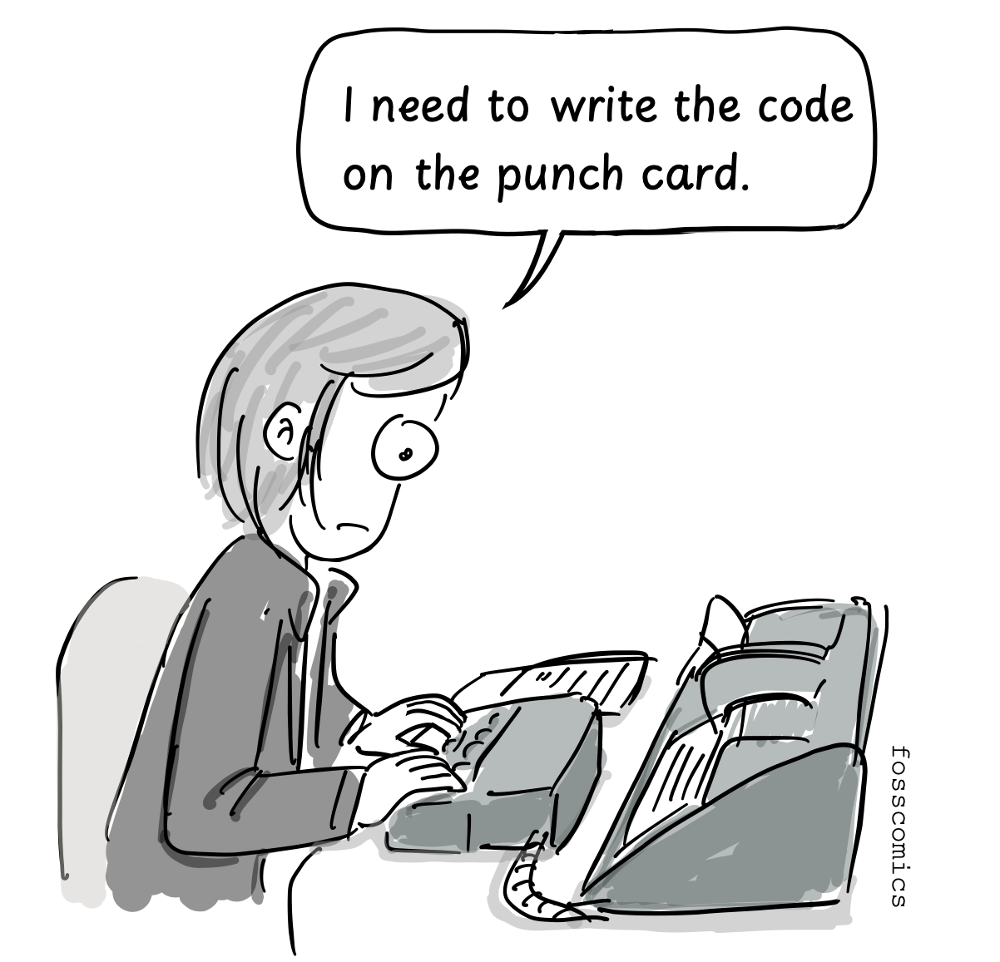

When computers were first introduced commercially, how did people write code for computers? In fact, there was no software similar to what we have today. All functionalities were implemented as functional units in circuits. [ENIAC](https://en.wikipedia.org/wiki/ENIAC) was also able to run various programs by wiring each functional unit and used punch cards as a storage device[&#91;1&#93;][1].

> "This is a computer for arithmetic operations"\
> “That is a computer for breaking German ciphers”

> "Can I make a computer for ballistics calculation?"\
> "How many relays and vacuum tubes are needed for this?"

Actual computer programming has been possible since stored-program computers such as [EDVAC](https://en.wikipedia.org/wiki/EDVAC) and [EDSAC](https://en.wikipedia.org/wiki/EDSAC) were introduced in 1949. Basically, the program can be executed after it is loaded into memory.

A program is made up of instructions that the machine can understand, which is called [machine code](https://en.wikipedia.org/wiki/Machine_code). The machine language is difficult for humans to understand because it consists only of binary numbers such as 0 and 1.

So, that’s why assembly language was born in the early age of computer programming. For example,  the users wrote executable code on EDSAC using an assembly language called Initial Orders. This is an example of an assembly language used in EDSAC[&lbrack;2&rbrack;][2].

All machine language instructions used in EDSAC are composed of 17 bits. The first column is the operation code, and the second column, 1 bit, is not used. Third column is the operand, representing the address. The last bit indicates whether the current instruction is 17 bits or 35 bits.

What does mnemonic, TOS, mean? It means that it loads the value of the accumulator A into m\[0]  and then initializes the accumulator A. The second command H is that it loads the multiplier register R with the data in m\[2].

As you can see, machine code is just binary code so it’s difficult for humans to easily understand and remember it. Therefore, assembly language is used to represent each low-level instruction or opcode with mnemonics. When assembly language is converted into machine code, we call it assembling

In the early days, assembling was done by hand, so the term, hand assembling, was used. Assembly language has been around since the 1950s. The early programmers must know how to use assembly language because there was no high-level language at the time.

 If there is no assembly tool, you still have to assemble assembly code manually by looking at the mnemonic conversion table.

> "I’m writing code"

However, keyboards and monitors did not become commercially available until the 1960s. The first computer with a monitor and keyboard was Multics, which was jointly developed by Bell Labs and MIT in 1964[&lbrack;3&rbrack;][3], and in the 1970s, most computers had a terminal with a screen and keyboard. Then, how could programmers write code and check the results without a monitor and keyboard in the 1960s.

> "Finally, I got a computer with a keyboard and a monitor"

Early programmers used punched cards to write code. Punch cards were originally used for data storage from the late 19th century, and were used by the US Census Bureau for census purposes. It is easy to understand if you think of the current [OMR](https://en.wikipedia.org/wiki/Optical_mark_recognition) sheet to mark answers.

IBM had developed a punch card system at the time and was supplying the system worldwide so  the punch card was well used as an essential part of early programming.

For example, the early programmers used punch cards as a development tool. First, the programmer wrote assembly code on paper. Then they debugged by running the code in their minds. When they were convinced that there were no more errors in their code. Finally, the code was hand assembled into machine code and they filled out machine code line by line onto a punch card.

> “I need to write the code on the punch card”

Programmers took the punch card to the operator of the computer room.The operator put the punch card into the punch card reader and the computer was able to execute the code loaded from the punch card reader. In reality, the programmer had to wait in line to hand the punch card to the operator and wait a long time until they received the execution result. If there is something wrong with the result, they had to do the same things over and over to get the result they wanted.

> "Can you take a look at my code?"\
> "Next person"

The interesting thing is that just copying a punch card is the same as copying a program, so it was possible to copy programs by writing at the time.

## References
1. [Celebrating Penn Engineering History: ENIAC](http://www.seas.upenn.edu/about-seas/eniac/operation.php)
2. [EDSAC Initial Orders and Squares Program](http://www.cl.cam.ac.uk/~mr10/edsacposter.pdf)
3. [History of the Computer Keyboard](http://theinventors.org/library/inventors/blcomputer_keyboard.htm)

[1]: http://www.seas.upenn.edu/about-seas/eniac/operation.php "Celebrating Penn Engineering History: ENIAC"

[2]: http://www.cl.cam.ac.uk/~mr10/edsacposter.pdf "EDSAC Initial Orders and Squares Program"

[3]: http://theinventors.org/library/inventors/blcomputer_keyboard.htm "History of the Computer Keyboard"
