### 월드와이드웹 프로그램을 CERN내에 공개

1991년 3월 팀 버너스 리(이하 팀)는 그가 만든 월드와이드웹 프로그램을 CERN에 있는 넥스트 컴퓨터 사용자에게 릴리스했다.

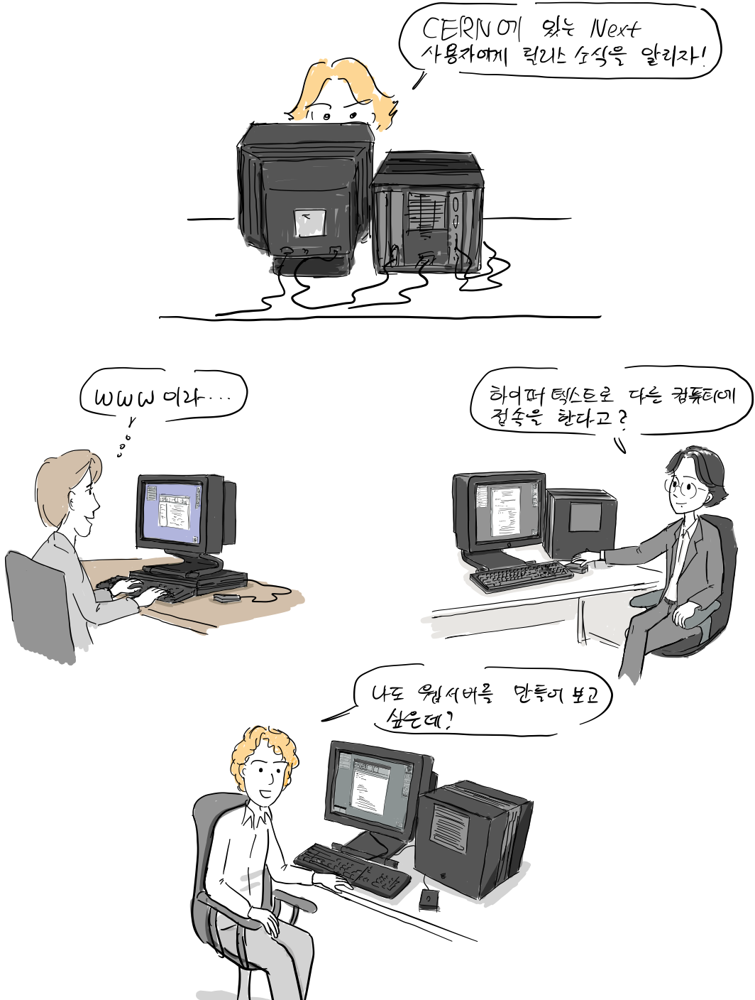

당시에는 브라우저에서 바로 hypertext를 만들 수 있도록 편집 기능을 제공했다.

한편, 인턴인 니콜라가 만든 line-mode browser도 동작을 하면서 팀은 WorldWideWeb브라우저를 배포할 때, line-mode browser를 포함시켰다.

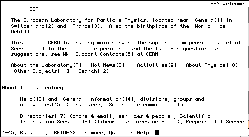

출처: archive.org ([link](https://web.archive.org/web/20100925204436/http://www.w3c.rl.ac.uk/primers/history/origins.htm))

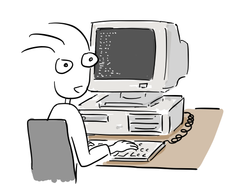

“오, 이제 터미널에서도 웹브라우징이 가능하네..”

1990년 말에는 인터넷에 최초의 웹페이지가 동작하기 시작했고 1991년 부터는 외부 사람들도 웹 공동체에 초대를 받았다.

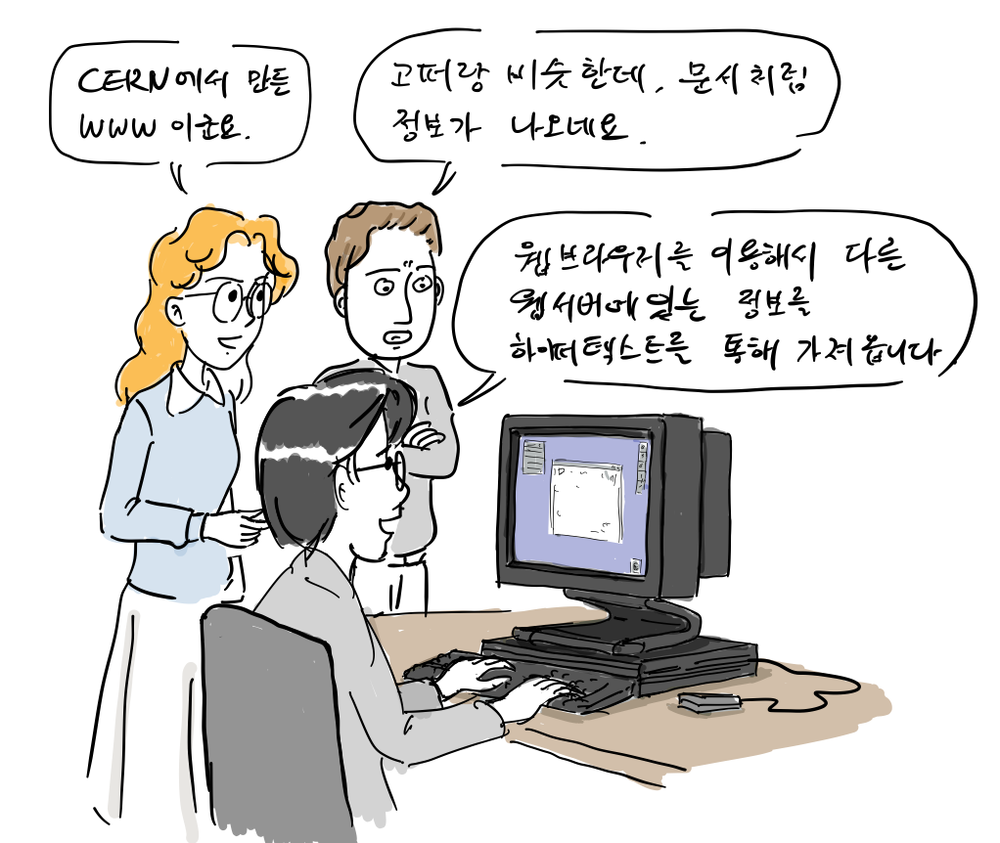

### Hypertext91 학회에서의 데모

1991년 7월 부터 8월까지 팀이 만든 최초의 웹서버는 하루에 10건에서 많게는 100건 정도의 접속 기록이 남았다. 이에 고무된 팀은 동료 로버트와 함께 월드와이드웹을 외부에 알리기 위해 Hypertext91 학회에 참석하기로 한다.

“논문에서 이 부분을 더…”

둘이 열심히 논문을 썼지만, 논문는 통과되지 못하고 대신 월드와이드웹을 데모를 할 수 있는 기회는 얻게 된다.

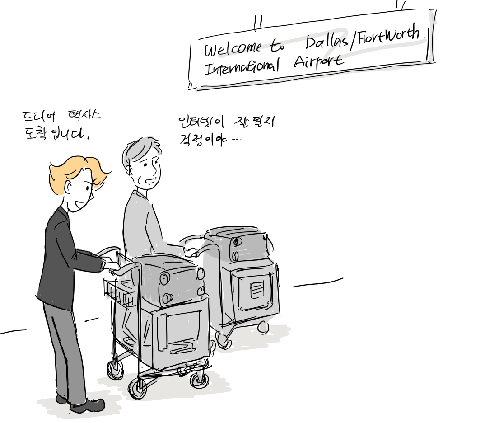

1991년 12월 두 사람은 미국 텍사스 오스틴에서 열리는 하이퍼텍스트 학회에 참석하였다. 직접 들고간 넥스트 컴퓨터를 설치하고 우여곡절 끝에 모뎀을 이용해서 CERN에 있는 웹서버에 접속해서 월드와이드웹 데모를 참석자들에게 보여줄 수 있었다.

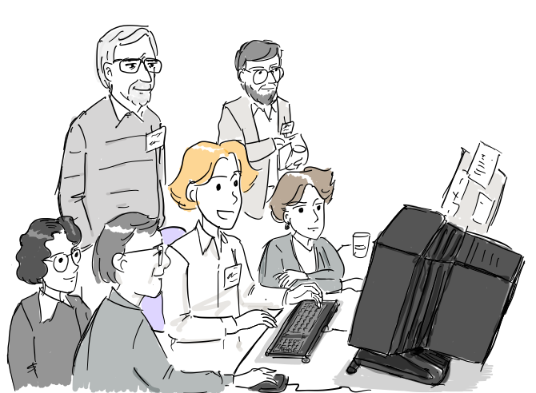

“지금 WWW 브라우저에서 보는 페이지가 바로 저희 CERN에 있는 웹서버로 부터 가져온 것입니다.”

### 미국에 첫 웹서버가 설치되다.

1991년 12월 미국 [Stanford Linear Accelerator Center](http://www.slac.stanford.edu/history/earlyweb/history.shtml) (SLAC)에 웹서버가 동작하기 시작했는, 이는 최초로 미대륙에서 동작한 웹서버였다.

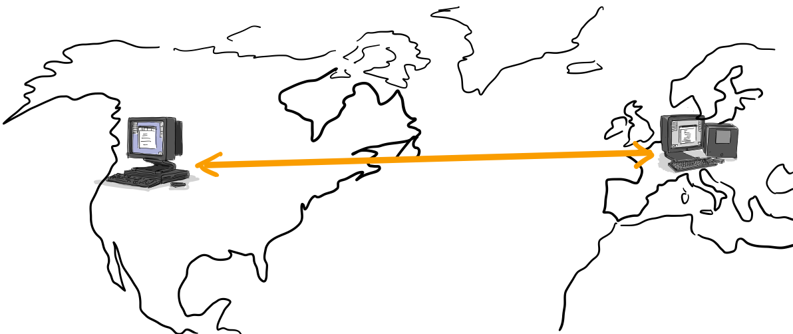

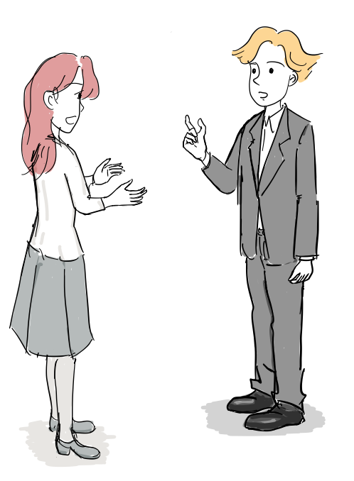

“팀, 다른 대학에서도 웹서버를 구축하기 시작했어. 그런데, CERN 허락없이 이렇게 계속 공짜로 쓰게해도 되는거야?”

“글쎄, 가능한 많은 사람들이 웹을 사용하게 하려면 기술과 프로그램을 무료로 사용할 수 있도록 해야할 것 같아.”

### libwww의 탄생

Objective-C로 개발된 WorldWideWeb은 넥스트 컴퓨터에서만 동작했다. 하루 빨리 다른 플랫폼에 포팅하기 위해 팀은 핵심 기능을 C로 다시 개발하기로 결정한다. 그리고, 때마침 인턴으로 팀에 합류한 장([Jean-François Groff](https://en.wikipedia.org/w/index.php?title=Jean-Fran%C3%A7ois_Groff&action=edit&redlink=1))이 그 일을 맡는다.

“이게 제가 만든 WorldWideWeb 웹브라우저와 서버입니다. 저와 함께 주요 기능인 파서, http기능 등을 C언어로 다시 짜면 될 것 같아요..”

1993년 5월 이를 [libwww](https://ko.wikipedia.org/wiki/Libwww)라는 이름으로 소스코드를 릴리스 한다.

### 퍼블릭 도메인으로 웹기술 공개

“ GPL라이선스가 좋긴한데, 이렇게 하면 회사들이 libwww를 사용해서 브라우저를 만들기 어려울거야. 그냥 퍼블릭 도메인(Public Domain)으로 공개해야겠다.”

이러한 결정으로 libwww을 기반으로 [모자익](https://en.wikipedia.org/wiki/Mosaic_\(web_browser\))과 같은 웹브라우저가 짧은 시간에 탄생할 수 있었고, 상업적인 판매도 가능했다. 최근까지도 W3C에서 최신 웹기술을 구현하는 용도로 유지되고 있다.

팀은 CERN을 설득해서 개발한 프로그램을 무료로 마음대로 사용할 수 있도록 했고, 1993년 4월 CERN은 웹 기술에 대해 특허권을 행사하지 않기로 결정한다.

“월드와이드웹에 대한 특허 권리를 과감하게 포기해야 합니다..”

“음.. 상부와 논의해보지요”

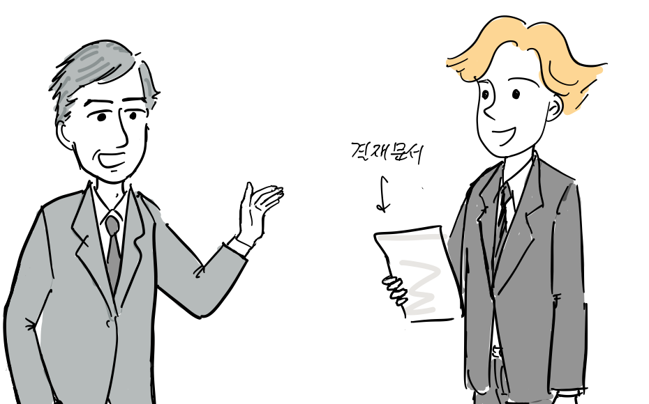

“드디어 결재를 받았군요!”

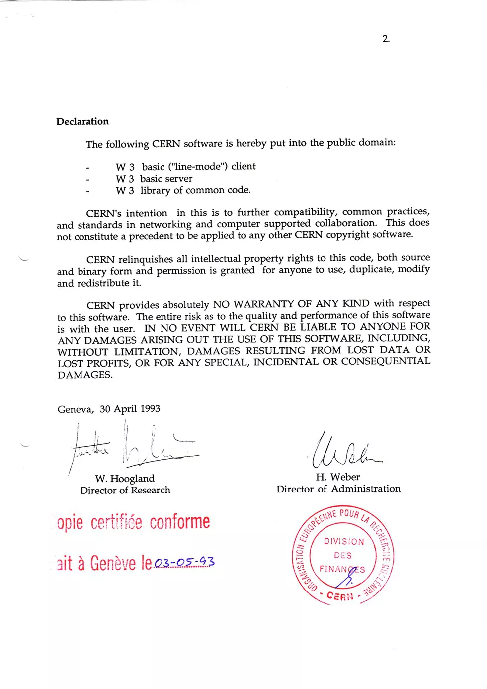

월드와이드웹을 퍼블릭 도메인으로 공개하기로 결정한 내부 문서([출처](https://cds.cern.ch/record/1164399))

이러한 결정으로 팀버너리스가 만든 HTML, URI, HTTP기술 규약을 바탕으로 다양한 웹서버와 웹브라우저가 개발되었다.

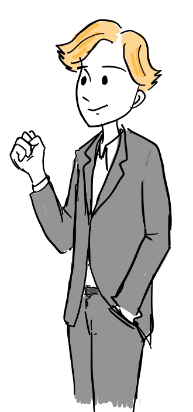

“다양한 웹서버와 브라우저가 잘 호환되도록 웹표준 작업을 계속해야겠다.”

### 웹의 기본 아이디어

1994년 팀 버너스 리는 웹표준 작업을 지속하기위해 MIT로 자리를 옮겨 W3C 콘소시엄(Consortium)을 설립했다. 초기 웹 공동체는 아래와 같은 혁명적인 아이디어를 기반으로 웹을 발전시켰는데, 이는 오늘날까지 기술 전반에 큰 영향을 주고 있다\[3\].

-   탈 중앙화 : 웹에 무엇이든 게시하기 위해 중앙 기관의 허가가 필요하지 않으며, 중앙 제어 노드가 없으므로 단일 장애 지점이 없으며 “킬 스위치”도 없다! 이것은 또한 무차별적인 검열과 감시로부터의 자유를 의미한다.

-   차별 금지 : 특정 서비스 품질로 인터넷에 연결하기 위해 비용을 지불하고 그 이상의 서비스 품질로 연결하기 위해 비용을 지불하면 두 사람 모두 동일한 수준에서 통신 할 수 있습니다. 이 형평성의 원칙을 망중립성이라고도 한다.

-   상향식 설계 : 소규모 전문가 그룹이 코드를 작성하고 제어하는 대신 모든 사람이 볼 수 있도록 개발되어 최대한의 참여와 실험을 장려한다.

-   합의: 보편적인 웹표준이 되려면 모두가 이를 사용하는 데 동의해야한다. 팀과 다른 사람들은 W3C의 투명하고 참여 가능한 프로세스를 통해 누구나 표준에 대해 이야기할 수 있는 기회를 줘서 이러한 합의에 도달했다.

끝. 다음 이야기는 모자익 브라우저입니다.

참고

\[1\] [History of Web](https://web.archive.org/web/20100925204436/http://www.w3c.rl.ac.uk/primers/history/origins.htm), Oxford Brookes University 2002

\[2\] [Weaving the Web](https://www.w3.org/People/Berners-Lee/Weaving/Overview.html), Tim Berners-Lee, 1999

\[3\] [History of the Web](https://webfoundation.org/about/vision/history-of-the-web/), World Wide Web foundation

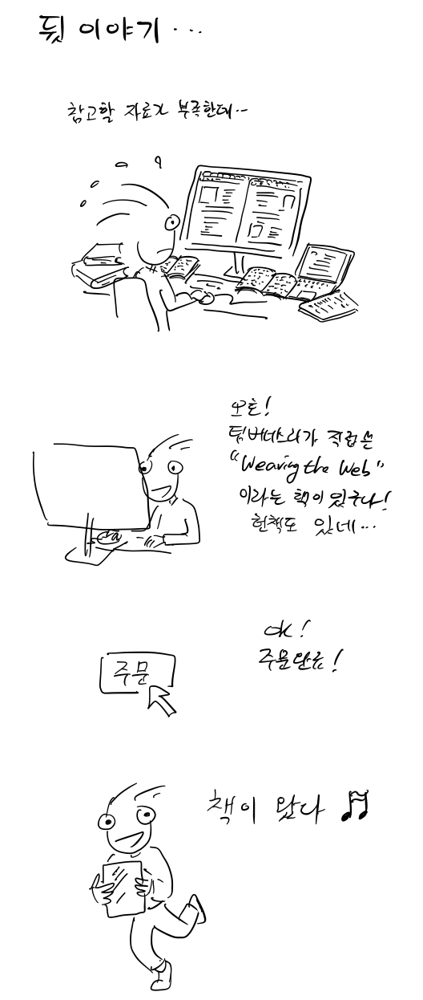

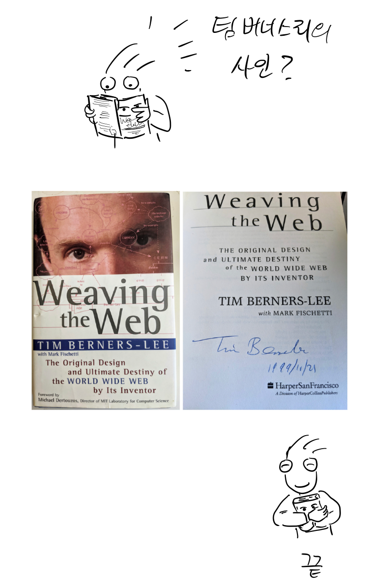
