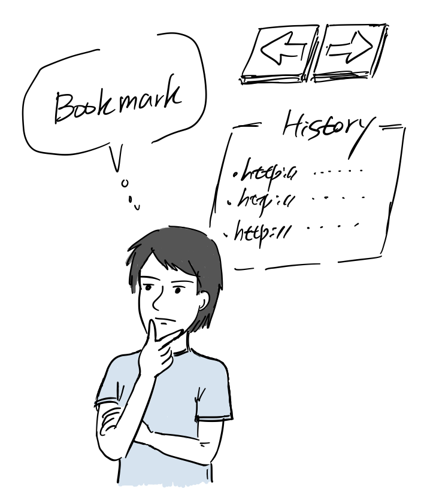
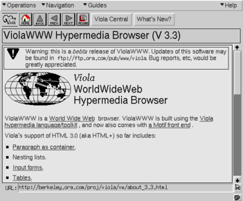
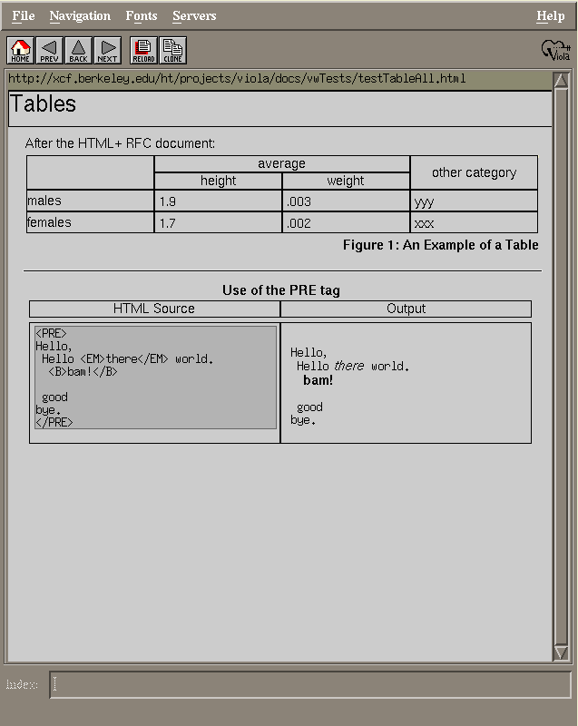
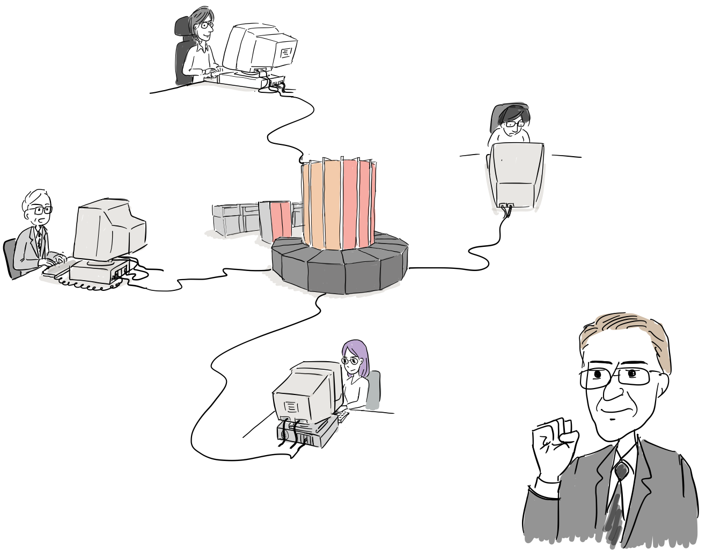
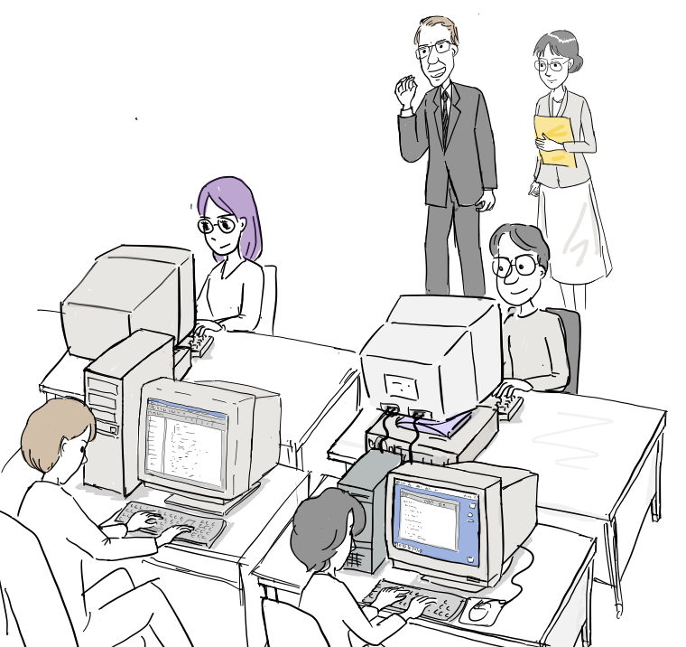
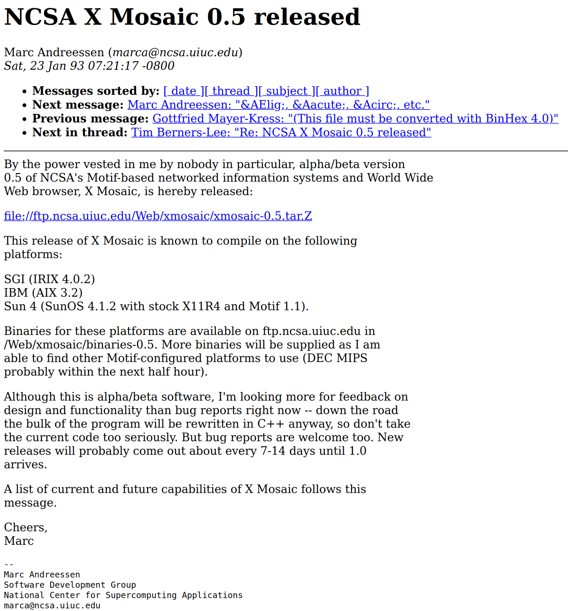
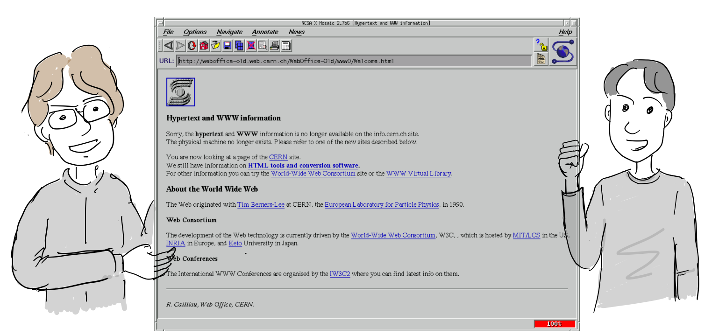

### 최초의 X 윈도우용 웹브라우저 비올라 브라우저

CERN에서 월드와이드웹 브라우저와 함께 HTML과 HTTP 스펙이 공개되었고 이후 새로운 웹브라우저를 개발하려는 시도가 여기 저기서 나타났다.

미국 UC 버클리 대학 학생이었던 대만계 이민 2세인 페이 웨이( Pei Wei)가 [X 윈도우](https://ko.wikipedia.org/wiki/X_%EC%9C%88%EB%8F%84_%EC%8B%9C%EC%8A%A4%ED%85%9C)에서 동작하는 웹브라우저를 처음으로 개발했다.

“X 윈도우 프로그래밍 재미있는데, 매킨토시에서 지원하는 [하이퍼카드](https://ko.wikipedia.org/wiki/%ED%95%98%EC%9D%B4%ED%8D%BC%EC%B9%B4%EB%93%9C) 같은 프로그램을 만들어봐야겠다.”

그는 원래 X 윈도우에서 동작하는 비올라(Viola)라는 하이퍼카드와 같은 프로그램을 만들어 1991년 처음으로 Viola 0.8버전으로 공개한다. 다음 목표로 인터넷을 지원할 계획을 갖고 있었는데, 팀 버너스 리가 만든 월드와이드웹에 대해 알게되었고 그가 제안한 URL 아이디어가 마음에 들어 URL을 지원하는 비올라 프로그램을 만들기로 한다.

“월드와이드웹? 인터넷에서 실행되는 하이퍼카드 같은 개념이네”

페이 웨이는 이에 대한 계획을 WWW 메일링리스트를 통해 공개했고 91년 12월 9일 팀 버너스 리로 부터 직접 답장을 받는다.

“좋은 생각입니다. 아직 X-Window에서 동작하는 웹브라우저가 없어요. ”

그 후 몇 개월동안 비올라 프로그램을 웹브라우저로 다시 개발하는데, 오늘날 웹브라우저가 제공하는 몇 가지는 기능을 최초로 구현한다.

“자주가는 URL을 관리할 수 있는 북마크가 필요하고, 바로 전에 본 페이지를 쉽게 볼 수 있도록 뒤로 가기, 앞으로 가기 버튼을 추가하자. 거기에 브라우저 히스토리까지 지원하면 웹에서 길을 잃지는 않겠군.”

그리고 1992년 1월 ViolaWWW을 공개한다. 이는 최초의 X 윈도우용 웹브라우저였지만, 사용도중 자주 다운되는 문제가 있었다.

1992년 1월 24일에 팀은 WWW 메일링 리스트에 비올라 브라우저가 X윈도우에서 잘 동작한다는 회신을 보낸다.

“좀 더 테스트가 필요하지만 X윈도우에서 잘 동작하는군.”

최초의 X윈도우용 웹브라우저 비올라 V3.3 동작 모습 (출처: [위키피디아](https://en.wikipedia.org/wiki/ViolaWWW#/media/File:ViolaWWW.png))

비올라 브라우저는 최초로 테이블을 지원했다. (출처: [viola.org](https://web.archive.org/web/20190428185443/http://www.viola.org/viola/violaScreenDumps/testTableAll.gif))

“테이블을 지원하고, 웹브라우저에서 외부 프로그램을 실행하는 기능을 넣자”

93년 5월까지 테이블과 외부 프로그램을 실행시킬 수 있는 기능이 추가되었다. 팀의 반응은 호의적이였다.

“아주 직관적이고 복잡하지 않군요.”

### 모자익 브라우저의 탄생

1993년 미국 일리노이 대학 NCSA(the National Center for Supercomputing Applications)에서도 모자익(Mosaic)이라는 웹 브라우저를 공개한다.

NCSA는 1985년 천문 물리학자인 래리 스마(Larry Smarr)가 설립했다. 미국 국립 과학 재단 후원으로 미국 과학자들에게 슈퍼컴퓨터를 공동으로 사용할 기회를 주기 위해 만들어졌다.

“미국내 연구 인력들이 쉽게 슈퍼 컴퓨터를 공유해서 사용할 수 있도록 하자”

과학자들이 원격으로 슈퍼 컴퓨터에 접속하려면 원격 접속 프로그램이 필요했다. 그래서 NCSA는 소프트웨어 개발 그룹을 운영했고 첫 소프트웨어로 [NCSA Telnet](https://en.wikipedia.org/wiki/NCSA_Telnet)을 개발했다.

“웬만한 소프트웨어 회사 규모네”

“윈도, 맥, 유닉스, 도스를 모두 지원해야되다 보니 이렇게 개발팀을 꾸릴 수 밖에 없었어요”

NCSA Telnet은 유닉스 뿐만 아니라 매킨토시 부터 도스까지 지원했고, 이러한 전통은 향후 모자익 브라우저에도 이어진다.

1990년 중국인 유학생이였던 핑 푸(Ping Fu)는 당시 NCSA에서 과학 시각화 프로젝트 진행 중이었는데, 자신의 프로젝트를 도와줄 소프트웨어 개발자로 마크 앤드리슨(Marc Andreessen)을 뽑았다.

“제 논문에 쓸 시각화 프로그램을 개발해주면 되요”

“GUI 프로그래밍이면 자신있어요”

어느날 핑 푸는 마크 앤드리슨에게 웹브라우저를 만들어볼것을 권유한다.

“마크 월드와이드웹 알어?” “마크가 GUI 프로그래밍을 잘하니까, 웹브라우저도 잘 만들 수 있을 것 같아..”

“글쎼요. Ftp 하고 별로 다를 것 같지 않은데요..”

나중에 마크 앤드리슨은 실제 웹브라우저 데모를 보게 된다.

“마크,이게 바로 MediaWWW라는 웹브라우저야!”

“오, 이렇게 정보를 검색할 수 있군요.. “

MediaWWW는 또 다른 웹브라우저였다.

“월드와이드웹 대단한데, 이걸로 사진도 보고 잡지도 본다면 좋을 것 같아. MediaWWW을 만들사람에게 연락해서 같이 만들어보자고 해보자.”

1992년 11월 17일 MediaWWW을 개발하고 코드를 공개한 토니 존스(Tony Johnson)에게 메일을 보낸다.

“제가 코드를 보니 몇가지 버그가 있습니다. 이를 아래와 같이 고치면 더 좋을 것 같습니다. 그리고 이런 기능을 추가하면 좋을 것 같은데, 저와 함께 브라우저를 같이 만들면 어떨까요?”

MediaWWW를 개발한 토니 존슨은 처음에는 호의적으로 답장을 했다.

“함께 작업을 할 수 있으면 좋을 것 같습니다..”

이에 고무된 마크는 몇가지 질문과 또 다른 버그 리스트, 그리고 새로운 제안들 포함해서 하루에 몇 개씩 메일을 보내기 시작한다.

”안타깝지만 모든것을 한꺼번에 고치지기 어려울 것 같습니다. “

참고로 MediasWWW 소스코드는 [github](https://github.com/dckc/MidasWWW)에서 찾아볼 수 있다.

“음.. 안되겠다. 내가 바닥부터 웹브라우저를 만들어야겠어!”

NCSA staff인 에릭 비나(Eric Bina)와 함께 X 윈도우용 웹 브라우저를 만들기 시작한다. 당시 그들게 필요한 것은 컴퓨터와 24시간 편의점 뿐이였다.

크리스마스와 새해도 잊은채 새로운 웹브라우저 개발에 몰두한다.

1993년 1월 23일 마침내 NSCA X Mosaic 0.5를 공개한다.

모자익 브라우저는 처음으로 X윈도우, MS 윈도우, 매킨토시를 함게 지원한 웹브라우저였고 가장 안정적으로 동작했으며 빠르게 새로운 기능을 추가하였다. 이런 이유로 지금까지 조금씩 사용자가 늘었던 웹은 모자익 브라우저 공개 이후 폭발적으로 성장하게 된다.

참고

-   How the web was born, Gillies & Cailliau, Oxford university press, 2000
-   [The Web: A Very Brief History – Web Standards (juude.info)](https://www.juude.info/theweb/standards.htm)
-   http://1997.webhistory.org/www.lists/www-talk.1993q1/0099.html
